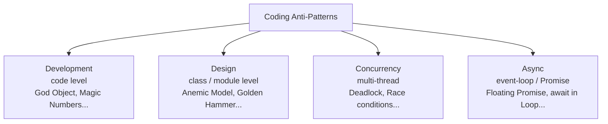

# Coding Anti-Patterns

> *"An AntiPattern is a literary form that describes a commonly occurring solution to a problem that generates decidedly negative consequences."* — William J. Brown et al., *AntiPatterns* (1998)

This roadmap covers anti-patterns at the **code and design levels** — the wrong shapes for functions, classes, and modules. They live inside the codebase; you can usually spot one by reading a file or two.

> Looking for **system-level / architecture** anti-patterns (Big Ball of Mud, Distributed Monolith, Vendor Lock-In, Microservice Sprawl, etc.)? They live in their own roadmap: [Architecture → Anti-Patterns](../../../Architecture/anti-patterns/README.md).
>
> Looking for **process / project-management** anti-patterns (Death March, Analysis Paralysis, Mushroom Management, etc.)? Those live with [Soft-Skills](../../../Soft-Skills/) material.

---

## What Is an Anti-Pattern?

An **anti-pattern** is a recurring "solution" to a problem that *looks* reasonable on the surface but produces bad outcomes — fragility, coupling, unmaintainable code, missed deadlines. Unlike a one-off mistake, an anti-pattern is **named, recognized, and reproduced** across teams and codebases. Giving it a name is the first step toward avoiding it.

To qualify as an anti-pattern (per Brown), the situation must:

1. Be a repeated pattern of action or structure that initially appears beneficial but produces more bad consequences than good.
2. Have a refactored solution that is clearly documented, proven in practice, and repeatable.

---

## Anti-Patterns vs Code Smells vs Design Patterns

These three concepts are easy to confuse — they're related but operate at different layers.

| Concept | What it is | Granularity | Example |
|---|---|---|---|
| **Code Smell** | A *symptom* in the code that *suggests* deeper trouble | Lines / methods / classes | Long Method, Duplicate Code, Feature Envy |
| **Anti-Pattern** | A recognized *bad solution* — the named shape behind the smell | Class / module / package | God Object, Anemic Domain Model, Golden Hammer |
| **Design Pattern** | A recognized *good solution* to a recurring problem | Object / module level | Strategy, Decorator, Observer |

Rules of thumb:

- A **code smell** is local and often syntactic — you can spot it by reading one file.
- An **anti-pattern** is structural or behavioral — you usually need to see how multiple pieces interact to recognize it.
- A **design pattern** is the positive counterpart — patterns and anti-patterns are often opposites of the same axis (e.g., *Strategy* vs *Golden Hammer*).

> See also: [Code Smells](../refactoring/01-code-smells/README.md), [Design Patterns](../design-patterns/README.md).

---

## A Brief History

| Year | Event |
|---|---|
| **1995** | Andrew Koenig coins the term *anti-pattern* in a *JOOP* column, framing it as the inverse of a design pattern. |
| **1998** | William J. Brown, Raphael C. Malveau, Hays W. McCormick III, Thomas J. Mowbray publish *AntiPatterns: Refactoring Software, Architectures, and Projects in Crisis* — the canonical catalog. |
| **2000s** | Anti-pattern catalogs spread to specific domains: web development, agile, database, security. |
| **Today** | Anti-patterns are part of the shared engineering vocabulary — "this is a God Object" lands faster than ten minutes of diagrams. |

---

## Four Categories

This roadmap is scoped to anti-patterns that live **inside the code**. System-level architectural anti-patterns and process / project anti-patterns are handled by their own roadmaps (linked above).

| Category | Layer | Examples |
|---|---|---|
| **[Development](01-development/README.md)** | Code-level habits | God Object, Spaghetti Code, Arrow Anti-Pattern, Pokemon Exception Handling, Stringly-Typed, Magic Numbers, Lasagna Code |
| **[Design](02-design/README.md)** | Class / module structure | Anemic Domain Model, Singletonitis, Flag Arguments, Telescoping Constructor, Fragile Base Class, Golden Hammer |
| **[Concurrency](03-concurrency/README.md)** | Multi-thread coordination | Double-Checked Locking, Deadlock, Shared Mutable State, Busy Waiting, Thread-Per-Request Unbounded |
| **[Async](04-async/README.md)** | Event-loop / Promise / await | Floating Promise, Forgotten await, await in Loop, Swallowed Rejection, Promise Chain Hell |

Total: **57 coding anti-patterns** across the four chapters.

---

## Why Study Anti-Patterns?

1. **Pattern matching beats reasoning from scratch.** Once you can name *God Object*, you spot it in unfamiliar code in seconds.
2. **Vocabulary aligns reviews.** "This has a Golden Hammer feel" is a clearer review comment than "I don't like this."
3. **Refactoring has a target.** Every anti-pattern in this roadmap is paired with a refactored solution — usually a code smell to address and a design pattern (or simpler structure) to move toward.
4. **Avoidance is cheaper than cleanup.** Recognizing the shape of *Premature Optimization* or *Speculative Generality* during design is far cheaper than ripping it out a year later.

### Cautions

- **Not every odd choice is an anti-pattern.** Context matters — a Singleton that is genuinely global state (a logger, a process-wide config) is not the *Singleton anti-pattern*.
- **Naming something doesn't fix it.** "We have a God Object" is a diagnosis, not a plan.
- **Some anti-patterns are language-specific.** *Constant Interface* is a Java pathology; in Go or Python it doesn't even type-check the same way.

---

## How to Use This Roadmap

Each category has its own README that lists every anti-pattern in the chapter. Subcategories then deliver an **8-file suite** covering all anti-patterns in that subcategory collectively:

| File | Focus | Audience |
|---|---|---|
| `junior.md` | "What does this look like?" "Why is it bad?" | Just learned the language |
| `middle.md` | "When do I see it?" "What do I do instead?" | 1–3 yr experience |
| `senior.md` | "How did we get here?" "How do I refactor at scale?" | 3–7 yr experience |
| `professional.md` | Trade-offs, edge cases, when the anti-pattern is actually fine | 7+ yr / specialist |
| `interview.md` | 30+ Q&A | Job preparation |
| `tasks.md` | Hands-on exercises with solutions | Practice |
| `find-bug.md` | Real-world snippets — spot the anti-pattern | Critical reading |
| `optimize.md` | Refactor a flawed implementation | Performance / cleanup practice |

**Recommended order:** `junior.md` → `middle.md` → `senior.md` → `professional.md` → practice files → `interview.md` for review.

Code examples are written in **Go**, **Java**, and **Python** — same convention as the [Refactoring](../refactoring/README.md) and [Design Patterns](../design-patterns/README.md) roadmaps.

---

## Browse by Category

- [Development Anti-Patterns](01-development/README.md) — 19 anti-patterns: bad structure, bad shortcuts, over-engineering.
- [Design Anti-Patterns](02-design/README.md) — 20 anti-patterns: OO misuse, coupling & state, abstraction failures.
- [Concurrency Anti-Patterns](03-concurrency/README.md) — 9 anti-patterns: synchronization misuse, coordination, shared state.
- [Async Anti-Patterns](04-async/README.md) — 9 anti-patterns: error handling, execution shape, misuse.

---

## Further Reading

- **AntiPatterns: Refactoring Software, Architectures, and Projects in Crisis** — Brown, Malveau, McCormick, Mowbray (1998). The foundational text.
- **Patterns of Enterprise Application Architecture** — Martin Fowler (2002). Coined *Anemic Domain Model* among others.
- **Refactoring** — Martin Fowler (1999, 2nd ed. 2018). Smells are micro-anti-patterns; this is the source.
- **c2 wiki — Anti-Patterns category** — [wiki.c2.com/?AntiPatternsCategory](https://wiki.c2.com/?AntiPatternsCategory). Community-maintained catalog with decades of discussion.

---

## Related Roadmaps

- [Architecture → Anti-Patterns](../../../Architecture/anti-patterns/README.md) — system-level anti-patterns (Big Ball of Mud, Distributed Monolith, Vendor Lock-In, …).
- [Design Patterns](../design-patterns/README.md) — the positive counterparts to most design anti-patterns here.
- [Refactoring](../refactoring/README.md) — code smells (micro-anti-patterns) and the techniques that resolve them.
- [Clean Code](../clean-code/README.md) — the principles that, when violated, produce many of these anti-patterns.
