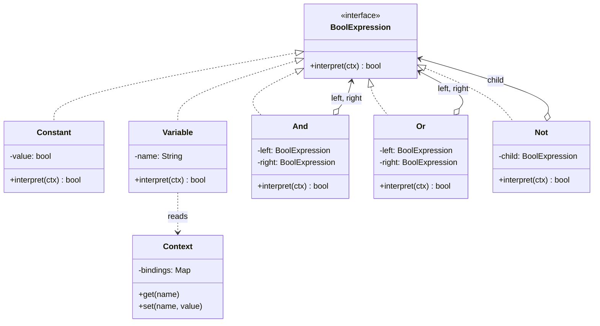

# Interpreter — Junior Level

> **Source:** [refactoring.guru/design-patterns/interpreter](https://refactoring.guru/design-patterns/interpreter)

---

## Table of Contents

1. [What is the Interpreter pattern?](#what-is-the-interpreter-pattern)
2. [Real-world analogy](#real-world-analogy)
3. [The problem it solves](#the-problem-it-solves)
4. [Structure](#structure)
5. [Hello-world example (Java)](#hello-world-example-java)
6. [Python example](#python-example)
7. [TypeScript example](#typescript-example)
8. [Common situations](#common-situations)
9. [When NOT to use](#when-not-to-use)
10. [Pros and cons](#pros-and-cons)
11. [Common mistakes](#common-mistakes)
12. [Diagrams](#diagrams)
13. [Mini Glossary](#mini-glossary)
14. [Review questions](#review-questions)

---

## What is the Interpreter pattern?

**Interpreter** lets you define a small language by representing each grammar rule as a class. Then you build a tree of those classes (an AST — abstract syntax tree) and *evaluate* the tree by asking each node: "interpret yourself".

You walk over a tree of objects. Each object knows how to compute its own value, possibly by recursively asking its children to interpret themselves first.

Two roles:

- **TerminalExpression** — a leaf in the grammar (e.g., a literal `true`, or a variable lookup). It interprets without recursing.
- **NonterminalExpression** — a composite rule (e.g., `And`, `Or`, `Not`). It interprets by recursing into its children and combining their results.

The trick is **logic lives inside the AST nodes**: each grammar rule is a class, and each class is its own little evaluator. Contrast this with Visitor, where logic lives outside the nodes.

---

## Real-world analogy

### Sheet music

A musician reads sheet music. Each symbol — a note, a rest, a chord, a repeat sign — has its own meaning. The musician "interprets" each symbol in order, against the current context (instrument, key signature, tempo).

A whole notes is one terminal symbol. A chord is a nonterminal — it groups multiple notes that play together. The musician walks the sheet and each symbol "plays itself".

### Recipe instructions

A recipe is a small DSL: "chop", "boil for 5 minutes", "stir until smooth". Each instruction is a class that knows how to apply itself in a kitchen *context* (current pot, ingredients, temperature). Composite instructions ("repeat 3 times: stir") wrap inner instructions.

### Spoken directions

"Go straight, then turn left, then go past two intersections." Each step interprets itself against your current location. The location is the *context* that flows through interpretation.

---

## The problem it solves

You have a small language or rule format, and you need to *evaluate* expressions written in that language. Examples:

- Boolean rules in a feature-flag system: `(country == "US") AND (tier == "premium")`.
- Filter expressions: `price > 100 AND category in [shoes, bags]`.
- Spreadsheet formulas: `=SUM(A1:A10) + B2`.
- Search query syntax: `author:alice "design patterns" -draft`.

### Naive approach: a giant if/else

```java
boolean evaluate(String expr, Map<String, Boolean> ctx) {
    if (expr.contains(" AND ")) { /* split, recurse, AND */ }
    else if (expr.contains(" OR ")) { /* split, recurse, OR */ }
    else if (expr.startsWith("NOT ")) { /* recurse, negate */ }
    else if (expr.equals("true"))  { return true;  }
    else if (expr.equals("false")) { return false; }
    else { return ctx.get(expr); }   // variable
}
```

You end up mixing parsing and evaluation in one big function. Every new operator means editing this monster. Precedence rules become tangled. Adding a new rule (e.g., `XOR`) requires touching the whole evaluator.

### Interpreter approach

```java
interface BoolExpression {
    boolean interpret(Context ctx);
}

class Constant   implements BoolExpression { ... }
class Variable   implements BoolExpression { ... }
class And        implements BoolExpression { ... }
class Or         implements BoolExpression { ... }
class Not        implements BoolExpression { ... }
```

Each grammar rule becomes a class. Each class knows how to evaluate *itself*. Adding `Xor` is just one new class. Evaluation is a clean recursive walk. **No giant if/else.**

---

## Structure

```
AbstractExpression (interface)
    + interpret(context: Context): R

TerminalExpression (leaf nodes)
    Constant   → returns a literal value
    Variable   → looks up its name in context

NonterminalExpression (composite nodes)
    And  → interpret = left.interpret(ctx) && right.interpret(ctx)
    Or   → interpret = left.interpret(ctx) || right.interpret(ctx)
    Not  → interpret = !child.interpret(ctx)

Context
    holds shared state during interpretation
    e.g., variable bindings, current input position

Client
    builds the AST (by parsing or hand-construction)
    creates a Context
    calls root.interpret(context) to evaluate
```

**Recursive evaluation.** When you call `root.interpret(context)`:

1. The root node (say, `Or`) calls `interpret` on its left child.
2. The left child may be another nonterminal — it recurses into *its* children.
3. Eventually a terminal (a `Constant` or `Variable`) returns a real value.
4. Each level combines results and returns up the stack.

Result: the whole tree evaluates from the leaves upward.

---

## Hello-world example (Java)

Boolean expression evaluator. We model: constants, variables, and the operators AND, OR, NOT.

```java
import java.util.HashMap;
import java.util.Map;

// Context: variable bindings
public final class Context {
    private final Map<String, Boolean> bindings = new HashMap<>();

    public void set(String name, boolean value) { bindings.put(name, value); }
    public boolean get(String name) {
        Boolean v = bindings.get(name);
        if (v == null) throw new IllegalStateException("Unbound variable: " + name);
        return v;
    }
}

// AbstractExpression
public interface BoolExpression {
    boolean interpret(Context ctx);
}

// Terminal: literal value
public final class Constant implements BoolExpression {
    private final boolean value;
    public Constant(boolean value) { this.value = value; }

    @Override
    public boolean interpret(Context ctx) { return value; }
}

// Terminal: variable lookup
public final class Variable implements BoolExpression {
    private final String name;
    public Variable(String name) { this.name = name; }

    @Override
    public boolean interpret(Context ctx) { return ctx.get(name); }
}

// Nonterminal: AND
public final class And implements BoolExpression {
    private final BoolExpression left, right;
    public And(BoolExpression left, BoolExpression right) {
        this.left = left;
        this.right = right;
    }

    @Override
    public boolean interpret(Context ctx) {
        return left.interpret(ctx) && right.interpret(ctx);
    }
}

// Nonterminal: OR
public final class Or implements BoolExpression {
    private final BoolExpression left, right;
    public Or(BoolExpression left, BoolExpression right) {
        this.left = left;
        this.right = right;
    }

    @Override
    public boolean interpret(Context ctx) {
        return left.interpret(ctx) || right.interpret(ctx);
    }
}

// Nonterminal: NOT
public final class Not implements BoolExpression {
    private final BoolExpression child;
    public Not(BoolExpression child) { this.child = child; }

    @Override
    public boolean interpret(Context ctx) {
        return !child.interpret(ctx);
    }
}

// Usage
public class Demo {
    public static void main(String[] args) {
        // Build AST for: (x AND y) OR NOT z
        BoolExpression expr = new Or(
            new And(new Variable("x"), new Variable("y")),
            new Not(new Variable("z"))
        );

        Context ctx = new Context();
        ctx.set("x", true);
        ctx.set("y", false);
        ctx.set("z", true);

        boolean result = expr.interpret(ctx);
        System.out.println("(x AND y) OR NOT z = " + result);
        // (true AND false) OR NOT true = false OR false = false
    }
}
```

**Output:**

```
(x AND y) OR NOT z = false
```

The expression tree doesn't know how to parse text — it only knows how to evaluate itself. A separate parser (or hand-written builder, as above) constructs the tree.

---

## Python example

```python
from abc import ABC, abstractmethod


class Context:
    def __init__(self):
        self.bindings: dict[str, bool] = {}

    def set(self, name: str, value: bool) -> None:
        self.bindings[name] = value

    def get(self, name: str) -> bool:
        if name not in self.bindings:
            raise KeyError(f"Unbound variable: {name}")
        return self.bindings[name]


class BoolExpression(ABC):
    @abstractmethod
    def interpret(self, ctx: Context) -> bool: ...


class Constant(BoolExpression):
    def __init__(self, value: bool):
        self.value = value

    def interpret(self, ctx: Context) -> bool:
        return self.value


class Variable(BoolExpression):
    def __init__(self, name: str):
        self.name = name

    def interpret(self, ctx: Context) -> bool:
        return ctx.get(self.name)


class And(BoolExpression):
    def __init__(self, left: BoolExpression, right: BoolExpression):
        self.left = left
        self.right = right

    def interpret(self, ctx: Context) -> bool:
        return self.left.interpret(ctx) and self.right.interpret(ctx)


class Or(BoolExpression):
    def __init__(self, left: BoolExpression, right: BoolExpression):
        self.left = left
        self.right = right

    def interpret(self, ctx: Context) -> bool:
        return self.left.interpret(ctx) or self.right.interpret(ctx)


class Not(BoolExpression):
    def __init__(self, child: BoolExpression):
        self.child = child

    def interpret(self, ctx: Context) -> bool:
        return not self.child.interpret(ctx)


# Build AST for: (x AND y) OR NOT z
expr = Or(
    And(Variable("x"), Variable("y")),
    Not(Variable("z")),
)

ctx = Context()
ctx.set("x", True)
ctx.set("y", False)
ctx.set("z", True)

print("(x AND y) OR NOT z =", expr.interpret(ctx))
```

In Python you can also model the AST as `dataclass` records and pattern-match on them — that's a slight twist (closer to the Visitor style), but the textbook Interpreter keeps `interpret` as a method on each node.

---

## TypeScript example

TypeScript also handles Interpreter cleanly with classes and an interface:

```typescript
// Context
class Context {
    private bindings = new Map<string, boolean>();

    set(name: string, value: boolean): void {
        this.bindings.set(name, value);
    }
    get(name: string): boolean {
        if (!this.bindings.has(name)) {
            throw new Error(`Unbound variable: ${name}`);
        }
        return this.bindings.get(name)!;
    }
}

// AbstractExpression
interface BoolExpression {
    interpret(ctx: Context): boolean;
}

// Terminals
class Constant implements BoolExpression {
    constructor(private readonly value: boolean) {}
    interpret(_ctx: Context): boolean { return this.value; }
}

class Variable implements BoolExpression {
    constructor(private readonly name: string) {}
    interpret(ctx: Context): boolean { return ctx.get(this.name); }
}

// Nonterminals
class And implements BoolExpression {
    constructor(
        private readonly left: BoolExpression,
        private readonly right: BoolExpression,
    ) {}
    interpret(ctx: Context): boolean {
        return this.left.interpret(ctx) && this.right.interpret(ctx);
    }
}

class Or implements BoolExpression {
    constructor(
        private readonly left: BoolExpression,
        private readonly right: BoolExpression,
    ) {}
    interpret(ctx: Context): boolean {
        return this.left.interpret(ctx) || this.right.interpret(ctx);
    }
}

class Not implements BoolExpression {
    constructor(private readonly child: BoolExpression) {}
    interpret(ctx: Context): boolean {
        return !this.child.interpret(ctx);
    }
}

// Usage: (x AND y) OR NOT z
const expr: BoolExpression = new Or(
    new And(new Variable("x"), new Variable("y")),
    new Not(new Variable("z")),
);

const ctx = new Context();
ctx.set("x", true);
ctx.set("y", false);
ctx.set("z", true);

console.log("(x AND y) OR NOT z =", expr.interpret(ctx));
```

TypeScript also supports an alternative form using **discriminated unions** (`type Expr = { kind: "and"; ... } | { kind: "or"; ... }`) and pattern-matching `switch` — that's closer to Visitor and is covered in middle.md.

---

## Common situations

| Situation | Why Interpreter helps |
|---|---|
| **Mini DSL evaluator** (filters, queries) | Each operator = one class; easy to extend |
| **Boolean rule engine** (feature flags, ACL) | Compose AND/OR/NOT/comparisons declaratively |
| **Arithmetic expression in a script** | `Add`, `Sub`, `Mul` — small grammar, fits Interpreter perfectly |
| **Regex-like simple matcher** | Each pattern element interprets against an input position |
| **Spreadsheet formulas** (basic) | `Cell`, `Sum`, `If`, `Add` as Interpreter nodes |
| **Search query syntax** (e.g., GitHub-style) | `Term`, `Phrase`, `And`, `Or`, `Not`, `Field` rules |
| **Game scripting / turtle graphics** | Command sequences interpret against a turtle context |
| **Simple template engine** | `Text`, `Variable`, `If`, `Loop` nodes evaluate to strings |

---

## When NOT to use

- **Grammar has more than ~10 rules.** Class explosion gets out of hand. Use a parser generator (ANTLR, Yacc, peg.js) or a hand-written recursive-descent parser plus an evaluator.
- **Performance critical.** Tree-walking with virtual calls is slow. Compile to bytecode and run on a VM, or generate native code, instead.
- **Complex semantics** (scoping, closures, type inference, generics). Interpreter is meant for tiny grammars; real languages need proper compiler infrastructure.
- **One-shot expressions.** If you have a fixed expression that runs once, hardcode it. Don't build an AST framework for one boolean.
- **Heavy IO / side effects per node.** Each node evaluating itself with side effects gets messy; prefer a compiler/IR-based approach.

**Rule of thumb:** *small grammar (< 10 rules), evaluate-only, can tolerate slow execution → Interpreter. Anything bigger → real parser + evaluator (or a real language).*

Note: Interpreter only addresses **evaluation**. Building the tree (parsing) is a separate concern. In small examples the client builds the tree by hand; in larger ones a parser does it.

---

## Pros and cons

### Pros

- **Easy to extend the grammar.** New rule = new class. No edits to existing rules.
- **Clean separation per rule.** Each grammar rule is one tidy class; you can read its semantics in isolation.
- **Self-contained nodes.** A node knows everything needed to evaluate itself — no big switch in the evaluator.
- **Composable.** Trees compose naturally; the same node types are reused at any depth.
- **Testable.** Each node class can be unit-tested with a small context.

### Cons

- **Class explosion.** Even a small grammar with ten operators becomes ten classes.
- **Hard to maintain for complex grammars.** Beyond a handful of rules, the pattern stops scaling.
- **Slow at runtime.** Recursive virtual calls, allocations, no inlining — orders of magnitude slower than compiled code.
- **Only covers evaluation.** Parsing the source text into an AST is a separate problem the pattern doesn't solve.
- **Encapsulation of context.** All nodes share the same `Context`; mistakes in mutating it cascade.

---

## Common mistakes

### Mistake 1: Stale context propagation

```java
// Imagine an Assignment node that mutates context, and a Sequence node:
class Sequence implements Expression {
    public Object interpret(Context ctx) {
        Context copy = ctx.copy();      // BUG: should share, not copy
        first.interpret(copy);
        return second.interpret(ctx);   // second never sees first's writes
    }
}
```

If the left subexpression writes to the context (e.g., assigns a variable), the right subexpression must read those writes. Be explicit about which nodes share vs. snapshot the context.

### Mistake 2: Treating Interpreter as a parser

```java
class And implements BoolExpression {
    public And(String text) {
        // BUG: parsing inside an AST node
        String[] parts = text.split(" AND ");
        ...
    }
}
```

Interpreter is about **evaluation**, not parsing. Keep the parser separate. The AST node should only know how to evaluate, given children that already exist.

### Mistake 3: Cramming a 30-rule grammar into the pattern

```java
class IfThenElseWhileForLetMatchGuardLambda implements Expression {
    ...
}
```

Once you have nested control flow, scoping, types, and modules, you need a real parser + evaluator (or compiler). Interpreter classes turn into a sprawling mess. Use ANTLR or a hand-rolled compiler instead.

### Mistake 4: Mixing terminal and nonterminal logic

```java
class Variable implements BoolExpression {
    public boolean interpret(Context ctx) {
        if (left != null) {                      // BUG: variables shouldn't have children
            return left.interpret(ctx) && ...;
        }
        return ctx.get(name);
    }
}
```

A `Variable` is a terminal — it has no children. Don't shoehorn nonterminal behaviour into it. Make a separate `And` class for that.

### Mistake 5: Sharing one mutable Context across threads

```java
Context ctx = new Context();
ctx.set("x", true);
parallelStream.forEach(e -> e.interpret(ctx));  // BUG: races on writes
```

If interpretation has side effects (variable writes), the context is mutable shared state. Each thread needs its own context (or use immutable bindings).

---

## Diagrams

### Class diagram



Constant and Variable are **terminals** (leaves). And, Or, Not are **nonterminals** (composites holding child expressions).

### Recursive evaluation flow

```mermaid
sequenceDiagram
    participant Client
    participant Or
    participant And
    participant Not
    participant Vx as Variable(x)
    participant Vy as Variable(y)
    participant Vz as Variable(z)
    participant Ctx as Context

    Client->>Or: interpret(ctx)
    Or->>And: interpret(ctx)
    And->>Vx: interpret(ctx)
    Vx->>Ctx: get("x")
    Ctx-->>Vx: true
    Vx-->>And: true
    And->>Vy: interpret(ctx)
    Vy->>Ctx: get("y")
    Ctx-->>Vy: false
    Vy-->>And: false
    And-->>Or: false
    Or->>Not: interpret(ctx)
    Not->>Vz: interpret(ctx)
    Vz->>Ctx: get("z")
    Ctx-->>Vz: true
    Vz-->>Not: true
    Not-->>Or: false
    Or-->>Client: false
```

Each node delegates to its children, then combines the results. The context flows through every call unchanged (in this read-only example).

---

## Mini Glossary

- **Interpreter** — a pattern where each grammar rule is a class with an `interpret(context)` method that evaluates itself.
- **AbstractExpression** — the common interface (or abstract class) declaring `interpret`.
- **TerminalExpression** — a leaf grammar rule (literal, variable). Interprets without recursing into children.
- **NonterminalExpression** — a composite rule (And, Or, Not, Add). Interprets by recursing into its children.
- **Context** — shared state passed through interpretation: variable bindings, input position, output buffer.
- **AST (Abstract Syntax Tree)** — the tree of expression objects that the Interpreter walks.
- **Grammar** — the set of rules describing what valid sentences in the language look like.
- **BNF (Backus–Naur Form)** — a notation for grammars: `expr ::= expr "AND" expr | expr "OR" expr | "NOT" expr | id | "true" | "false"`.
- **Recursive descent** — a common parsing style where each grammar rule is a function (or class) that calls others recursively. Pairs naturally with Interpreter.
- **Parsing vs. Evaluation** — parsing turns text into an AST; evaluation walks the AST. Interpreter solves only evaluation.

---

## Review questions

1. **What problem does Interpreter solve?** Evaluating sentences in a small custom language by representing each grammar rule as a class.
2. **What are the two kinds of expressions?** Terminal (leaves like literals and variables) and nonterminal (composites like And, Or, Not that hold child expressions).
3. **Why is each grammar rule a class?** So each rule encapsulates its own evaluation logic, making it easy to add or change rules without one giant switch.
4. **What is the Context for?** To hold state that flows through interpretation — variable bindings, current position in input, accumulated output.
5. **When should you NOT use Interpreter?** When the grammar is large (> ~10 rules), when performance matters, or when you have complex semantics. Use a real parser + evaluator or compiler instead.
6. **How does Interpreter differ from Visitor?** Interpreter puts the logic *inside* the AST nodes (`node.interpret(ctx)`); Visitor puts it *outside* (`visitor.visit(node)`). Interpreter favours adding new rules; Visitor favours adding new operations on a stable set of nodes.
7. **Does Interpreter handle parsing?** No — only evaluation. Building the AST from text is a separate parser concern.
8. **What's the cost of adding a new operator (e.g., XOR)?** One new class. No changes to existing classes.
9. **Why is Interpreter slow?** Tree walking with virtual calls and per-node allocations; no JIT inlining across the recursion.
10. **Where do you see Interpreter in real code?** Regex engines, SQL `WHERE` clause evaluators, log4j/SLF4J pattern formatters, math expression libraries (math.js), template engines (Mustache-like), spreadsheet formula evaluators, JSONPath/XPath engines.

[← Behavioral patterns home](../README.md) · [Middle →](middle.md)
