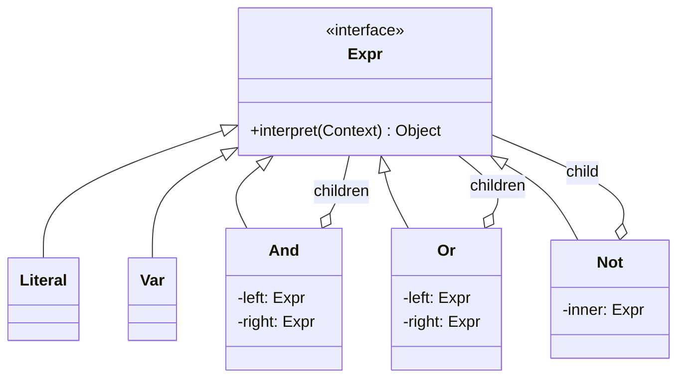
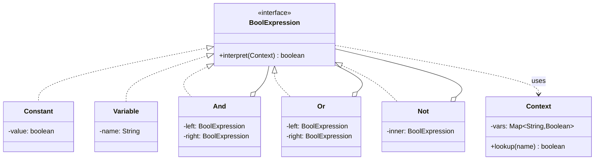
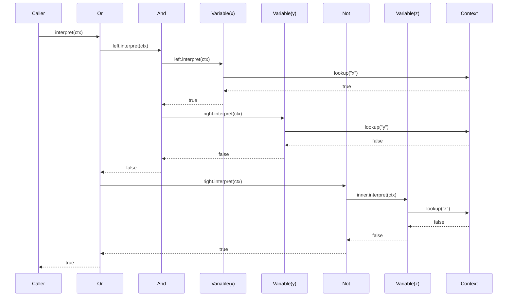
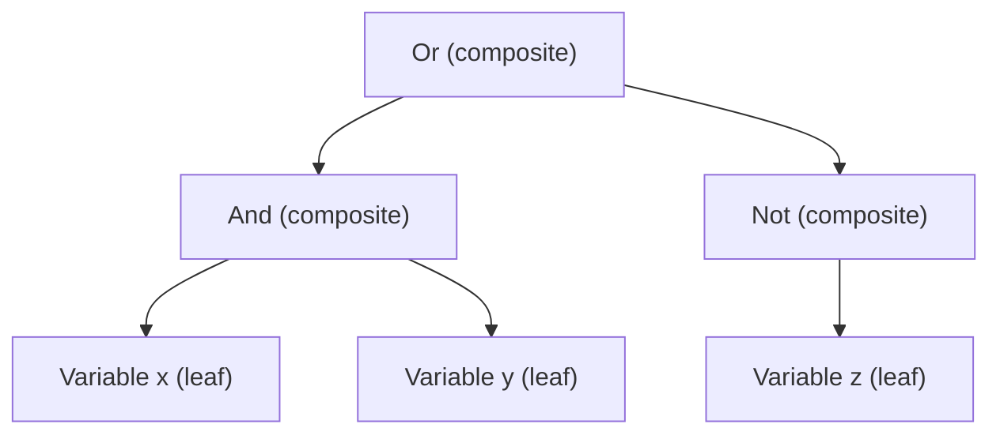

# Interpreter — Middle Level

> **Source:** [refactoring.guru/design-patterns/interpreter](https://refactoring.guru/design-patterns/interpreter)
> **Prerequisite:** [Junior](junior.md)

---

## Table of Contents

1. [Beyond hello-world](#beyond-hello-world)
2. [Math expression interpreter](#math-expression-interpreter)
3. [Boolean rule engine](#boolean-rule-engine)
4. [Combining Interpreter with Composite](#combining-interpreter-with-composite)
5. [Building the AST: parser vs hand-built](#building-the-ast-parser-vs-hand-built)
6. [Context design](#context-design)
7. [Adding a new grammar rule](#adding-a-new-grammar-rule)
8. [Side-effecting interpreters](#side-effecting-interpreters)
9. [Memoization and caching](#memoization-and-caching)
10. [Multi-pass interpretation](#multi-pass-interpretation)
11. [Error handling and reporting](#error-handling-and-reporting)
12. [Common refactorings](#common-refactorings)
13. [Comparing Interpreter with alternatives](#comparing-interpreter-with-alternatives)
14. [Anti-patterns at this level](#anti-patterns-at-this-level)
15. [Diagrams](#diagrams)

---

## Beyond hello-world

Junior level showed boolean expressions. In real code, Interpreter appears in:

- **Regex engines** — each metacharacter (`.`, `*`, `?`, `+`) is a node; the engine walks the AST against the input.
- **SQL `WHERE` clauses** — `age > 18 AND country = 'US'` is parsed into an expression tree, then evaluated per row.
- **Mini DSLs** — feature flags (`user.country == "US" AND user.tier IN ["gold", "platinum"]`), pricing rules, validation rules.
- **Log format parsers** — `%h %l %u %t "%r" %>s %b` (Apache log format) becomes a tiny AST that knows how to read each field.
- **Game scripting** — quest conditions, NPC dialog trees, behaviour scripts.
- **Search syntaxes** — GitHub's `is:open author:foo label:bug`, Gmail's `from:alice has:attachment`.
- **`jq`** — JSON queries like `.users[].name` are interpreted as a pipeline of small node types.
- **Spring Expression Language (SpEL), JEXL, MVEL** — runtime expression evaluation in Java.

The middle-level theme: real grammars (more than 3 node types), real contexts (variable bindings, scopes, IO), and the question of *who builds the tree* (parser vs hand-built).

---

## Math expression interpreter

A small arithmetic language: `(2 + x) * 3`. Numbers, variables, four binary ops, one unary op.

### AST

```java
public sealed interface Expr permits Number, Variable, Add, Sub, Mul, Div, Neg {
    double interpret(Context ctx);
}

public record Number(double value) implements Expr {
    public double interpret(Context ctx) { return value; }
}

public record Variable(String name) implements Expr {
    public double interpret(Context ctx) { return ctx.lookup(name); }
}

public record Add(Expr left, Expr right) implements Expr {
    public double interpret(Context ctx) { return left.interpret(ctx) + right.interpret(ctx); }
}

public record Sub(Expr left, Expr right) implements Expr {
    public double interpret(Context ctx) { return left.interpret(ctx) - right.interpret(ctx); }
}

public record Mul(Expr left, Expr right) implements Expr {
    public double interpret(Context ctx) { return left.interpret(ctx) * right.interpret(ctx); }
}

public record Div(Expr left, Expr right) implements Expr {
    public double interpret(Context ctx) {
        double r = right.interpret(ctx);
        if (r == 0.0) throw new ArithmeticException("division by zero");
        return left.interpret(ctx) / r;
    }
}

public record Neg(Expr inner) implements Expr {
    public double interpret(Context ctx) { return -inner.interpret(ctx); }
}
```

### Context

```java
public final class Context {
    private final Map<String, Double> vars;
    public Context(Map<String, Double> vars) { this.vars = vars; }
    public double lookup(String name) {
        Double v = vars.get(name);
        if (v == null) throw new NoSuchElementException("undefined: " + name);
        return v;
    }
}
```

### Demo

```java
// (2 + x) * 3
Expr ast = new Mul(
    new Add(new Number(2), new Variable("x")),
    new Number(3)
);

Context ctx = new Context(Map.of("x", 5.0));
double result = ast.interpret(ctx);   // (2 + 5) * 3 = 21
```

Each grammar rule maps to one class. **Terminals** (`Number`, `Variable`) interpret without recursing. **Nonterminals** (`Add`, `Sub`, `Mul`, `Div`, `Neg`) recurse into children. Adding a new operator (`Mod`, `Pow`) means adding one new class — no edits to existing ones.

---

## Boolean rule engine

Filtering records: `age > 18 AND country == "US"`.

We need: literals (number, string, bool), variables, comparisons, boolean combinators.

```java
public sealed interface Expr permits Literal, Var, Eq, Gt, Lt, And, Or, Not {
    Object interpret(Context ctx);
}

public record Literal(Object value) implements Expr {
    public Object interpret(Context ctx) { return value; }
}

public record Var(String name) implements Expr {
    public Object interpret(Context ctx) { return ctx.lookup(name); }
}

public record Eq(Expr left, Expr right) implements Expr {
    public Object interpret(Context ctx) {
        return Objects.equals(left.interpret(ctx), right.interpret(ctx));
    }
}

public record Gt(Expr left, Expr right) implements Expr {
    public Object interpret(Context ctx) {
        Number l = (Number) left.interpret(ctx);
        Number r = (Number) right.interpret(ctx);
        return l.doubleValue() > r.doubleValue();
    }
}

public record Lt(Expr left, Expr right) implements Expr {
    public Object interpret(Context ctx) {
        Number l = (Number) left.interpret(ctx);
        Number r = (Number) right.interpret(ctx);
        return l.doubleValue() < r.doubleValue();
    }
}

public record And(Expr left, Expr right) implements Expr {
    public Object interpret(Context ctx) {
        return (Boolean) left.interpret(ctx) && (Boolean) right.interpret(ctx);
    }
}

public record Or(Expr left, Expr right) implements Expr {
    public Object interpret(Context ctx) {
        return (Boolean) left.interpret(ctx) || (Boolean) right.interpret(ctx);
    }
}

public record Not(Expr inner) implements Expr {
    public Object interpret(Context ctx) {
        return !(Boolean) inner.interpret(ctx);
    }
}
```

Filter usage:

```java
// age > 18 AND country == "US"
Expr rule = new And(
    new Gt(new Var("age"), new Literal(18)),
    new Eq(new Var("country"), new Literal("US"))
);

List<Map<String, Object>> users = List.of(
    Map.of("age", 25, "country", "US"),
    Map.of("age", 17, "country", "US"),
    Map.of("age", 30, "country", "UK")
);

users.stream()
     .filter(u -> (Boolean) rule.interpret(new Context(u)))
     .forEach(System.out::println);
// {age=25, country=US}
```

Notice: `And`/`Or` are *not* short-circuiting in this naive form (Java's `&&` is, but the children are already evaluated). To get true short-circuit, evaluate left first, branch:

```java
public Object interpret(Context ctx) {
    if (!(Boolean) left.interpret(ctx)) return false;
    return left.interpret(ctx);
}
```

Most rule engines short-circuit on purpose for performance.

---

## Combining Interpreter with Composite

Interpreter naturally **is** Composite:

- **Terminals** = leaves (`Number`, `Variable`, `Literal`).
- **Nonterminals** = composites (`Add`, `And`, `Or`, `Not`, ...).
- They share an interface (`Expr`).
- Operations are uniform across leaves and composites (`interpret(ctx)`).



The GoF book even notes the duality: Interpreter is a domain-specific application of Composite, where each composite class corresponds to one grammar rule. If you already understand Composite, Interpreter is its specialization for languages.

---

## Building the AST: parser vs hand-built

The Interpreter pattern only addresses **evaluation** of the AST. **Parsing** is a separate concern. Two practical ways to obtain the AST:

### (a) Hand-built in code

Useful for: configuration, tests, programmatic rule construction, embedded DSLs.

```java
Expr rule = new And(
    new Gt(new Var("age"), new Literal(18)),
    new Eq(new Var("country"), new Literal("US"))
);
```

This is essentially a **fluent builder** for the AST, without a string source.

### (b) Recursive descent parser

For end-user input (a config file, a search box), you need a parser. A small recursive descent for arithmetic:

```java
public final class Parser {
    private final String src;
    private int pos = 0;

    public Parser(String src) { this.src = src; }

    public Expr parse() {
        Expr e = expr();
        skipWs();
        if (pos != src.length()) throw new IllegalStateException("trailing: " + src.substring(pos));
        return e;
    }

    // expr := term (('+'|'-') term)*
    private Expr expr() {
        Expr left = term();
        while (true) {
            skipWs();
            if (peek('+')) { pos++; left = new Add(left, term()); }
            else if (peek('-')) { pos++; left = new Sub(left, term()); }
            else return left;
        }
    }

    // term := factor (('*'|'/') factor)*
    private Expr term() {
        Expr left = factor();
        while (true) {
            skipWs();
            if (peek('*')) { pos++; left = new Mul(left, factor()); }
            else if (peek('/')) { pos++; left = new Div(left, factor()); }
            else return left;
        }
    }

    // factor := number | variable | '(' expr ')' | '-' factor
    private Expr factor() {
        skipWs();
        if (peek('-')) { pos++; return new Neg(factor()); }
        if (peek('(')) { pos++; Expr e = expr(); expect(')'); return e; }
        if (Character.isDigit(src.charAt(pos))) return number();
        return variable();
    }

    private Expr number() {
        int start = pos;
        while (pos < src.length() && (Character.isDigit(src.charAt(pos)) || src.charAt(pos) == '.')) pos++;
        return new Number(Double.parseDouble(src.substring(start, pos)));
    }

    private Expr variable() {
        int start = pos;
        while (pos < src.length() && Character.isLetter(src.charAt(pos))) pos++;
        return new Variable(src.substring(start, pos));
    }

    private boolean peek(char c) { return pos < src.length() && src.charAt(pos) == c; }
    private void expect(char c) { if (!peek(c)) throw new IllegalStateException("expected " + c); pos++; }
    private void skipWs() { while (pos < src.length() && Character.isWhitespace(src.charAt(pos))) pos++; }
}
```

Usage:

```java
Expr ast = new Parser("(2 + x) * 3").parse();
double r = ast.interpret(new Context(Map.of("x", 5.0)));   // 21
```

The Interpreter pattern is about the *Expr classes*. The parser is conceptually independent — for serious grammars, use ANTLR, JavaCC, or a parser combinator library. **Don't conflate parsing and interpreting.**

---

## Context design

Context is what the AST needs at evaluation time but doesn't own. Choices:

### Variable bindings

Most common: `Map<String, Object>`. Simple, dynamic.

```java
class Context {
    final Map<String, Object> vars;
}
```

### Scoped (nested) variables

For languages with `let` or function calls:

```java
class Context {
    private final Context parent;
    private final Map<String, Object> vars = new HashMap<>();

    public Context() { this(null); }
    public Context(Context parent) { this.parent = parent; }

    public Object lookup(String name) {
        if (vars.containsKey(name)) return vars.get(name);
        if (parent != null) return parent.lookup(name);
        throw new NoSuchElementException(name);
    }
    public void define(String name, Object value) { vars.put(name, value); }
}
```

### IO / accumulators

For an interpreter with `print`, the context holds the output stream:

```java
class Context {
    final Map<String, Object> vars;
    final PrintStream out;
}
```

### Position tracking

For descriptive error messages, the context tracks current node line/column:

```java
class Context {
    final Map<String, Object> vars;
    int currentLine, currentCol;
}
```

### Context as parameter vs Context as field

**Context as parameter** — `interpret(Context ctx)` — is functional and reentrant. The same AST can be evaluated in many contexts simultaneously.

**Context as field** — `Interpreter` class with `Expr ast; Context ctx;` — is convenient but couples the AST to a single evaluation. Most modern code prefers parameter.

---

## Adding a new grammar rule

The strength of Interpreter: new rules = new classes, no edits to existing ones (Open/Closed Principle).

Add `Xor` to the boolean engine:

```java
public record Xor(Expr left, Expr right) implements Expr {
    public Object interpret(Context ctx) {
        return ((Boolean) left.interpret(ctx)) ^ ((Boolean) right.interpret(ctx));
    }
}
```

That's it. No changes to `And`, `Or`, `Not`, `Literal`, `Var`, or `Context`. Just register `Xor` in the parser if you want surface syntax for it.

Compare with a giant `evaluate(Token op, ...)` switch: adding `Xor` means editing the switch, retesting all branches, and risking regressions in unrelated cases.

---

## Side-effecting interpreters

A tiny scripting language with `print`:

```java
public sealed interface Stmt permits PrintStmt, AssignStmt, Block {
    void execute(Context ctx);
}

public record PrintStmt(Expr expr) implements Stmt {
    public void execute(Context ctx) {
        ctx.out.println(expr.interpret(ctx));
    }
}

public record AssignStmt(String name, Expr expr) implements Stmt {
    public void execute(Context ctx) {
        ctx.define(name, expr.interpret(ctx));
    }
}

public record Block(List<Stmt> stmts) implements Stmt {
    public void execute(Context ctx) {
        for (Stmt s : stmts) s.execute(ctx);
    }
}
```

```java
Stmt program = new Block(List.of(
    new AssignStmt("x", new Number(5)),
    new AssignStmt("y", new Add(new Variable("x"), new Number(3))),
    new PrintStmt(new Variable("y"))
));
program.execute(new Context(...));   // prints 8.0
```

Key lesson: **separate pure subtrees (Expr) from impure ones (Stmt)**. Expressions return values. Statements perform effects. Mixing them — e.g., `Print` as an `Expr` returning `void` — confuses readers and breaks composition (`Add(Print(...), 3)` makes no sense).

Even within a unified hierarchy, keep the convention: nodes are either **value-producing** or **effect-producing**, never both.

---

## Memoization and caching

For pure expressions, repeated evaluation can be cached:

```java
public final class MemoExpr implements Expr {
    private final Expr inner;
    private final Map<Map<String, Object>, Object> cache = new HashMap<>();

    public MemoExpr(Expr inner) { this.inner = inner; }

    public Object interpret(Context ctx) {
        return cache.computeIfAbsent(
            Map.copyOf(ctx.vars),
            k -> inner.interpret(ctx)
        );
    }
}
```

Wrap any subtree: `new MemoExpr(expensiveSubtree)`. This is a **decorator** over an interpreter node.

Caveats:
- Only safe for **pure** subtrees (no IO, no mutation, no time-dependent values).
- Cache key must capture all inputs the subtree depends on. A copy of the full var map is safe but heavy; for a known set of vars, key on just those.
- Memory: bound the cache (LRU) for long-running interpreters.

For ASTs evaluated millions of times against changing data (e.g., a rule applied to every event in a stream), memoizing per-record is useless but memoizing per-subtree across records (when subexpressions are constant) wins.

---

## Multi-pass interpretation

Real languages need multiple passes over the AST: name resolution, type checking, optimization, evaluation. Two designs:

### Design A: multiple `interpret*` methods on each node

```java
public sealed interface Expr permits ... {
    Type typeCheck(TypeEnv env);
    Object interpret(Context ctx);
    Expr optimize();
}
```

Each pass is a method on each node. Adding a new pass = adding a new method to the sealed interface = touching every node class. **Closed for extension** in pass dimension.

### Design B: Visitor pattern over the AST

Each pass is a separate visitor class:

```java
public interface ExprVisitor<R> {
    R visitNumber(Number n);
    R visitAdd(Add a);
    // ...
}

class TypeChecker implements ExprVisitor<Type> { ... }
class Optimizer implements ExprVisitor<Expr> { ... }
class Evaluator implements ExprVisitor<Object> { ... }
```

Adding a pass = new visitor, **no edit to nodes**. Adding a node = edit every visitor.

### Trade-off

| | Many passes, stable nodes | Stable passes, many nodes |
|---|---|---|
| **Method per pass** (A) | edit every node per pass | clean |
| **Visitor per pass** (B) | clean | edit every visitor per node |

GoF's Interpreter assumes design A: nodes own their behaviour. Compilers usually pick B because they have many passes (parser, lexer, name resolver, type checker, escape analyzer, optimizer, code generator) and a relatively fixed AST shape.

**Rule of thumb**: 1-3 operations on the AST → put methods on nodes (Interpreter style). 4+ unrelated operations → use Visitor.

---

## Error handling and reporting

Interpreter errors come in flavours:

### 1. Undefined variable

```java
public Object interpret(Context ctx) {
    Object v = ctx.vars.get(name);
    if (v == null) throw new InterpretError("undefined variable: " + name);
    return v;
}
```

### 2. Type mismatch

```java
public Object interpret(Context ctx) {
    Object l = left.interpret(ctx);
    Object r = right.interpret(ctx);
    if (!(l instanceof Number ln) || !(r instanceof Number rn)) {
        throw new InterpretError("Add expects numbers, got " + l + " + " + r);
    }
    return ln.doubleValue() + rn.doubleValue();
}
```

### 3. Runtime errors (division by zero, index out of bounds)

Raise a structured exception with the offending node.

### Position tracking

For source-level error reporting, each node carries its source location:

```java
public record Add(Expr left, Expr right, int line, int col) implements Expr { ... }
```

The parser fills in line/col. On error, format: `Error at line 3, col 12: undefined variable 'foo'`.

For long pipelines (parser → optimizer → evaluator), preserve line/col across rewrites so the error still points to the original source.

### Exception class

Don't reuse `RuntimeException`. Create a typed `InterpretError(String message, Node node)` so callers can catch specifically and pretty-print.

---

## Common refactorings

### Refactoring 1: Giant if/elseif → Interpreter

Before:

```java
boolean evaluateRule(String ruleType, User u) {
    if (ruleType.equals("us_adult")) {
        return u.age > 18 && u.country.equals("US");
    } else if (ruleType.equals("eu_minor")) {
        return u.age < 18 && EU_COUNTRIES.contains(u.country);
    } else if (ruleType.equals("gold_member")) {
        return u.tier.equals("gold") && u.age > 21;
    }
    // 30 more elseifs
    throw new IllegalArgumentException(ruleType);
}
```

Each rule is hardcoded. New rules = code change + redeploy.

After: rules are AST objects, possibly loaded from config:

```java
Map<String, Expr> rules = Map.of(
    "us_adult",    new And(new Gt(new Var("age"), new Literal(18)),
                           new Eq(new Var("country"), new Literal("US"))),
    "gold_member", new And(new Eq(new Var("tier"), new Literal("gold")),
                           new Gt(new Var("age"), new Literal(21)))
);

boolean ok = (Boolean) rules.get(ruleType).interpret(new Context(userMap));
```

Now business analysts can author rules in JSON/YAML; you load and interpret them at runtime.

### Refactoring 2: String-based mini-DSL → typed AST

Before:

```python
def matches(rule: str, record: dict) -> bool:
    # rule is something like "age>18&country=US"
    parts = rule.split("&")
    for p in parts:
        if ">" in p:
            k, v = p.split(">")
            if not record[k] > int(v): return False
        elif "=" in p:
            k, v = p.split("=")
            if record[k] != v: return False
    return True
```

Fragile parser inline with the evaluator, no precedence, no parentheses, no error messages.

After:

```python
class Expr: ...
class And(Expr): ...
class Gt(Expr): ...
class Eq(Expr): ...
class Var(Expr): ...
class Lit(Expr): ...

def parse(s: str) -> Expr: ...   # proper parser
def matches(ast: Expr, record: dict) -> bool:
    return ast.interpret(record)
```

Parser and evaluator are now separate, testable, extensible.

### Refactoring 3: Methods-on-elements → Visitor

When you find yourself adding a third or fourth operation to every node class (`evaluate`, `prettyPrint`, `optimize`, `typeCheck`), invert: keep nodes data-only and use Visitor for operations. See the multi-pass section above.

---

## Comparing Interpreter with alternatives

| Approach | When | Pros | Cons |
|---|---|---|---|
| **Interpreter (one class per rule)** | Small, stable grammar; few operations | OCP for new rules; clear mapping | Class explosion for big grammars |
| **Giant switch / if-elseif** | Trivial DSLs; one-off scripts | Minimal code; everything in one place | Doesn't scale; hard to extend |
| **Strategy** | One operation, many *implementations* | Pluggable algorithms | Doesn't model grammar / nesting |
| **Visitor** | Many operations on stable AST | Operations as classes; multi-pass clean | Adding nodes is expensive |
| **Full parser + bytecode VM** | Real languages, performance-critical | Fast, mature ecosystem (LLVM, GraalVM) | Massive complexity |
| **Embedded language (Lua, Groovy, JS)** | Power-user scripting; you don't want to design a language | Mature; rich ecosystem | Sandboxing, version compatibility, security |
| **Rules engine (Drools)** | Declarative business rules | Authored by non-developers; explainable | Heavy framework; learning curve |

Rule of thumb: Interpreter is excellent when your DSL is **small, stable, and tightly bound to your domain** (config rules, query filters, validation). Once you want functions, types, modules, threads — stop building Interpreter, embed a real language.

---

## Anti-patterns at this level

### Anti-pattern 1: Interpreter for SQL

```java
class SqlNode { ... }
class Select extends SqlNode { ... }
class Where extends SqlNode { ... }
class Join extends SqlNode { ... }
// ... 80 classes later, you've reimplemented PostgreSQL parser
```

SQL is huge. Use a real parser (JSqlParser, Calcite, sqlparse). Interpreter is for **small** grammars you fully own.

### Anti-pattern 2: AST built by string concat

```java
String rule = "And(Gt(age, " + minAge + "), Eq(country, '" + country + "'))";
Expr ast = parse(rule);
```

You've turned typed object construction into string templating. **Build the AST directly with `new And(...)` or via a typed builder.** No injection bugs, no quoting hell.

### Anti-pattern 3: Parser, evaluator, optimizer in one class

```java
class ExpressionEngine {
    // 800-line class doing tokenizing, parsing, optimization, evaluation, error reporting
}
```

Each concern wants its own home. Break into `Lexer`, `Parser`, `Optimizer`, `Evaluator`. The Interpreter pattern itself only governs evaluation — keep that boundary clean.

### Anti-pattern 4: Interpret mutates the AST

```java
public Object interpret(Context ctx) {
    this.cachedValue = ...;   // mutating the node!
    return cachedValue;
}
```

Now the same AST evaluated in two contexts (or two threads) corrupts itself. Either:
- Keep nodes immutable; cache externally (memoization decorator).
- Make the cache thread-local.

### Anti-pattern 5: Context as a `Map<String, Object>` for everything

For a real language with types, scopes, frames, and references, `Map<String, Object>` becomes a dumping ground. Define a real `Environment` class with typed operations: `defineVar`, `assignVar`, `pushFrame`, `popFrame`. Without structure, debugging gets impossible.

### Anti-pattern 6: Circular AST or unbounded recursion

Hand-built ASTs can accidentally reference themselves (`a.right = a`). Interpret then stack-overflows. For untrusted input, validate the AST is acyclic before interpreting; for hand-built, treat it as a programming error to catch in tests.

---

## Diagrams

### Class diagram: boolean expression hierarchy



### Sequence diagram: evaluating `(x AND y) OR NOT z`



The interpreter walks **post-order**: children evaluate first, then the parent combines. Every nonterminal is a `combine(left.interpret(ctx), right.interpret(ctx))` step. Terminals hit the context and return.

### Interpreter as Composite



Same shape as a Composite tree of shapes or files. The grammar gives the structure meaning; the interpret method gives it behaviour.

---

[← Junior](junior.md) · [Senior →](senior.md)
