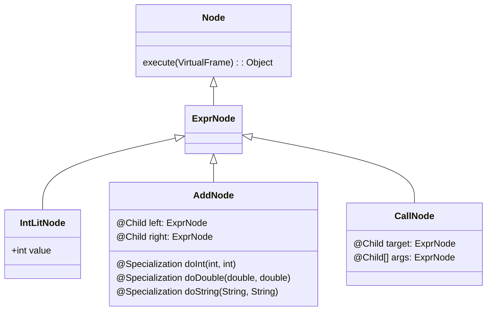

# Interpreter — Professional Level

> **Source:** [refactoring.guru/design-patterns/interpreter](https://refactoring.guru/design-patterns/interpreter)
> **Prerequisite:** [Senior](senior.md)

---

## Table of Contents

1. [Introduction](#introduction)
2. [Tree-walking interpreter performance](#tree-walking-interpreter-performance)
3. [JIT internals: virtual `interpret` call sites](#jit-internals-virtual-interpret-call-sites)
4. [Bytecode compilation as escape from Interpreter](#bytecode-compilation-as-escape-from-interpreter)
5. [Threaded code interpreters](#threaded-code-interpreters)
6. [Inline caching in dynamic interpreters](#inline-caching-in-dynamic-interpreters)
7. [GraalVM Truffle: partial evaluation of an Interpreter](#graalvm-truffle-partial-evaluation-of-an-interpreter)
8. [AST memory layout](#ast-memory-layout)
9. [Stack overflow on deep ASTs](#stack-overflow-on-deep-asts)
10. [Optimization passes on the AST](#optimization-passes-on-the-ast)
11. [Concurrency: shared interpreter, per-thread contexts](#concurrency-shared-interpreter-per-thread-contexts)
12. [Security: sandboxing untrusted Interpreters](#security-sandboxing-untrusted-interpreters)
13. [Cross-language survey](#cross-language-survey)
14. [Microbenchmark anatomy](#microbenchmark-anatomy)
15. [Diagrams](#diagrams)
16. [Related Topics](#related-topics)

---

## Introduction

At the professional tier we stop treating Interpreter as a teaching pattern and look at how it behaves under real workloads: how fast a tree-walking evaluator actually is, where the cycles go, how production VMs evolve out of this exact pattern, and how research compilers (GraalVM Truffle) take an Interpreter as input and emit a JIT compiler as output.

Interpreter is the seed crystal of every language runtime. CPython, Lua, Ruby (MRI), V8 (Ignition), JavaScriptCore (LLInt), HHVM, the .NET CLR's interpreter mode, every regex engine, every SQL planner, jq, JSONPath, every spreadsheet formula engine — all begin life as an Interpreter implementation and then accumulate layers of bytecode lowering, inline caching, and JIT compilation to claw back the orders of magnitude they lose to abstraction.

What follows is the layer between "I implemented Interpreter" and "I implemented a fast language runtime."

---

## Tree-walking interpreter performance

A naive tree-walking interpreter is the slowest thing you will ever write for a given semantic. Concrete numbers from published research and production VMs:

| Implementation | Relative speed (vs C, higher = slower) |
|---|---|
| Native compiled C (GCC -O2) | 1× |
| LuaJIT (tracing JIT) | 1-3× |
| V8 TurboFan / HotSpot C2 | 1-5× |
| CPython bytecode (CPython 3.11+ adaptive) | 30-60× |
| CPython 3.10 bytecode | 60-100× |
| Tree-walking AST interpreter (Lox, toy Scheme) | 200-1000× |
| Tree-walking interpreter in a dynamic language (Python evaluating Python AST) | 5000-10000× |

Tree walking is **10-100× slower than a bytecode VM** doing the same work, and a bytecode VM is itself **10-50× slower than a JIT**. The two factors compound: tree walking is **100-5000× slower than JITted code**.

### Where the cycles go

For a tree-walking `eval(Expr)` on a numeric expression like `(a + b) * c`:

1. **Cache misses traversing the pointer tree.** Each `Expr` is a separate heap object; following `node.left` is a likely L1 miss, often an L2 miss. ~3-15ns per node.
2. **Virtual dispatch per node.** `node.eval(env)` is a virtual call. Polymorphic call site → ~2-5ns. Megamorphic with 30+ AST node types → ~5-10ns.
3. **No register reuse.** Each subexpression result boxed (in JVM/CPython), allocated, returned by reference, then unboxed. ~20-50ns per intermediate.
4. **Environment lookup.** Variable resolution is a HashMap lookup — ~30-100ns.
5. **No constant folding, no CSE, no inlining.** The interpreter re-walks the same path every iteration of a loop.

For `for i in range(1_000_000): x = (a + b) * c`:
- Native C: ~1ms.
- Tree-walking interpreter: ~500-2000ms.
- The 500-2000× gap is mostly from items 1, 3, 4 above, not from "interpretation" abstractly.

### Why naive Visitor-style Interpreter is the worst case

The pattern as taught in GoF — `Expression.interpret(Context)` polymorphic — guarantees you pay the full virtual-dispatch + cache-miss tax on every single evaluation, with no escape valve. It is *also* the easiest implementation to get correct, which is exactly why every real VM starts there.

---

## JIT internals: virtual `interpret` call sites

The same inline cache (IC) machinery analyzed in the [Visitor professional file](../10-visitor/professional.md#jit-internals-virtual-call-sites-in-visitor) applies to Interpreter — and bites harder, because the AST traversal *forces* polymorphism.

### Inline cache states applied to AST evaluation

```java
public abstract class Expr {
    public abstract Object interpret(Context ctx);
}
```

Every recursive call site `child.interpret(ctx)` sees whatever node type happens to be the child. For an arithmetic expression mixing `Add`, `Mul`, `NumberLit`, `Variable`, `Call` — you have at least 5 node types arriving at every call site.

| State | Subclasses seen | Cost (HotSpot, warm) |
|---|---|---|
| Cold | 0 | Slow path, ~50ns |
| Monomorphic | 1 | Inlined direct call, ~0ns |
| Bimorphic | 2 | Type guard + call, ~1ns |
| Polymorphic | 3-7 | Guard chain, ~2-3ns |
| Megamorphic | 8+ | Vtable, ~3-8ns |

A real language has 30-60 AST node types. Every recursive `interpret` call site is megamorphic. **You cannot inline your way out of this** with HotSpot — only with a partial-evaluation system like Truffle.

### Why HotSpot/V8/JSC give up

HotSpot's C2 compiler will inline up to ~3 receiver types at a megamorphic call site (controlled by `MaxPolymorphism`). Beyond that it falls back to the vtable. V8's TurboFan does similar — Crankshaft was even more aggressive about inlining inline caches.

The pathological pattern: a recursive function that dispatches on AST node type. Every call site sees every type. Every call site goes megamorphic. JIT throws up its hands.

This is **the** reason tree-walking interpreters in JIT'd languages (Java, JavaScript) are so much slower than the underlying language's JIT — the JIT can't unwind your AST.

### Devirtualization that *does* work

- **Sealed hierarchies (Java 17+)** let JIT see the full closed set; for ≤4 subtypes JIT can build a tableswitch.
- **Final classes** prune subclass-check chains.
- **Per-call-site specialization** (Truffle's trick) — clone the bytecode of `interpret` per AST shape so each clone sees a monomorphic receiver.

---

## Bytecode compilation as escape from Interpreter

Every production language runtime concludes that tree-walking is too slow and compiles the AST to a flat bytecode that is then interpreted (or further JITted).

### CPython pipeline

```
.py source
   ↓ tokenize
tokens
   ↓ parse
AST  (ast module)
   ↓ compile() → CodeObject
bytecode (.pyc)
   ↓ ceval.c switch loop
result
```

CPython never tree-walks. The `ast` module exposes the tree for tooling, but `compile()` lowers it to bytecode (about 100 opcodes: `LOAD_FAST`, `BINARY_OP`, `CALL`, `RETURN_VALUE` …) before any execution. The `.pyc` file is a serialized bytecode cache — exactly to avoid re-parsing.

Speedup over a hypothetical AST walker: **~10-30×**. Why:
- Bytecode is a flat array; instruction fetch is sequential, cache-friendly.
- Operands are integers (indices, offsets), not pointers.
- The interpreter loop is one giant `switch` — branch predictor handles it well.

### Lua pipeline

Lua compiles source → register-based bytecode (not stack-based — a key innovation). Each function becomes a `Proto` with an instruction array, a constant table, and an upvalue list. The interpreter is `lvm.c`'s `luaV_execute`. LuaJIT then layers a tracing JIT on top.

Register-based bytecode does ~30% less work per operation than stack-based (no push/pop round-trips), at the cost of slightly larger instructions.

### V8 pipeline (modern)

```
JS source
   ↓ parse
AST
   ↓ Ignition bytecode generator
bytecode
   ↓ Ignition interpreter (register machine)
   ↓ (hot functions) profile collection
   ↓ TurboFan JIT
optimized native code
   ↓ (deopt on assumption violation)
back to Ignition
```

Pre-2016, V8 jumped straight from AST to JIT (Crankshaft/Full-codegen). The bytecode tier (Ignition) was added explicitly because:
- AST in memory was huge and slow to revisit.
- Cold code didn't deserve native compilation.
- Bytecode is a stable IR for collecting type feedback.

This is the universal evolutionary path: **Interpreter (AST) → Interpreter (bytecode) → JIT**. Every mature runtime climbs this ladder.

### Lower the cost of the Interpreter pattern itself

Once you have bytecode, the original GoF Interpreter is gone — there are no more `interpret()` virtual calls. There is one giant dispatch loop:

```c
while (1) {
    opcode = *pc++;
    switch (opcode) {
        case OP_ADD: { ... } break;
        case OP_LOAD: { ... } break;
        // ...
    }
}
```

This *is* still the Interpreter pattern — the bytecode is the abstract grammar, each opcode is a terminal — but the traversal is linear and the dispatch is a table jump instead of a virtual call. **5-10× faster** than the AST version.

---

## Threaded code interpreters

Even the bytecode `switch` has overhead: every iteration is a back-edge to the dispatch loop, plus a range check, plus the switch table lookup. Branch prediction confuses itself because the loop's only branch returns to the same point regardless of opcode.

**Threaded code** eliminates the central loop.

### Direct threading

Each bytecode instruction is replaced by a pointer to its handler. Execution is:

```c
goto **pc++;
```

(Using GCC's labels-as-values extension.) Each handler ends with the same `goto **pc++` — meaning every instruction has its own dispatch site. The branch predictor learns per-instruction patterns: after `LOAD_FAST` you usually see `LOAD_FAST` or `BINARY_OP`. Prediction accuracy jumps from ~50% (single dispatch site) to ~85% (per-handler dispatch).

### Indirect threading

Bytecode stores indices into a handler table; one extra indirection. Slightly slower than direct, more compact.

### Computed goto in CPython

CPython 3.1 added computed-goto dispatch in `ceval.c`:

```c
#if USE_COMPUTED_GOTOS
    #define DISPATCH() goto *opcode_targets[*next_instr++]
    #define TARGET(op) TARGET_##op
#else
    #define DISPATCH() goto dispatch_opcode
    #define TARGET(op) case op
#endif
```

Measured speedup: **15-20%** on real Python workloads, just from changing dispatch.

### Subroutine threading

Each opcode is a `call` to a function. Slowest of the threading techniques but easiest to write portable C.

### Token threading

Used in Forth originally. Each instruction is a token; the inner loop fetches and dispatches.

### Hierarchy

```
switch dispatch       ← naive bytecode (CPython pre-3.1)
   ↑
indirect threading    ← Forth-style
   ↑
direct threading      ← GCC computed goto (CPython 3.1+, Lua)
   ↑
inline threading      ← copy handler bodies into instruction stream (rare)
   ↑
JIT                   ← give up interpreting, emit native
```

Every step is roughly 1.3-2× faster than the previous, with diminishing returns.

---

## Inline caching in dynamic interpreters

Dynamic languages (Smalltalk, Self, JavaScript, Python) face a deeper problem than dispatch: every `obj.method()` requires a dictionary lookup on the object's class to find the method. ~30-100ns per call.

**Inline caching** (Deutsch–Schiffman 1984, Self 1991) caches the lookup at the *call site*.

### Monomorphic IC

First call: lookup `Point.add`, cache the result + the receiver's hidden class. Subsequent calls compare the receiver's class to the cached class:
- Hit (~99% in practice) → direct call, ~1ns.
- Miss → re-lookup, update cache.

V8's "hidden classes" exist solely to make this caching effective: every JS object has a hidden class derived from its property layout, so two `{x: 1, y: 2}` objects share a class and hit the same IC.

### Polymorphic IC (PIC)

Cache up to N (typically 4-8) class/handler pairs at a call site. Each call walks the small chain.

### Megamorphic

Fall back to the dictionary lookup. Either accept the cost or, in JIT'd code, deoptimize and retry as bytecode.

### Why this matters for Interpreter

The Interpreter pattern, when implemented for a dynamic language, has *every* `MethodCall.interpret()` doing a method lookup. Without inline caching, each call is 30-100ns. With monomorphic IC, ~1-3ns. **30-100× speedup on method-heavy code, achieved without changing the interpreter's structure** — only by adding a per-call-site cache.

CPython 3.11 added "specializing adaptive interpreter" (PEP 659): each bytecode instruction can rewrite itself in place to a specialized version after observing operand types. `BINARY_OP` → `BINARY_OP_ADD_INT` → direct integer add. This is inline caching applied to bytecode operands instead of method receivers.

---

## GraalVM Truffle: partial evaluation of an Interpreter

The most advanced application of the Interpreter pattern is **Truffle**: write a tree-walking interpreter using a specific style, and Graal *partially evaluates* it into a JIT compiler.

### The big idea

Partial evaluation: given `interpret(ast, input)`, fix `ast` to a known constant and specialize. The result is a function of `input` only — and since the AST shape is fixed, every type guard, every dispatch, every constant lookup folds away. What's left is the actual computation the AST encodes.

This is sometimes called the **first Futamura projection** (1971): partially evaluating an interpreter with respect to a program yields a compiled program.

### Truffle node hierarchy

```java
public abstract class ExprNode extends Node {
    public abstract Object execute(VirtualFrame frame);
}

public class IntLitNode extends ExprNode {
    private final int value;
    public IntLitNode(int value) { this.value = value; }
    public Object execute(VirtualFrame f) { return value; }
}

public class AddNode extends ExprNode {
    @Child private ExprNode left;
    @Child private ExprNode right;

    public AddNode(ExprNode l, ExprNode r) { this.left = l; this.right = r; }

    @Specialization
    int doInt(int a, int b) { return Math.addExact(a, b); }

    @Specialization
    double doDouble(double a, double b) { return a + b; }

    @Specialization
    String doString(String a, String b) { return a + b; }
}
```

Annotations communicate semantics:
- `@Child` — node forms a tree; Graal can traverse it during PE.
- `@Specialization` — the DSL generates a runtime that specializes per observed type, like a manual inline cache.

### Architectural diagram

```
Source
  ↓ parse (your code)
Truffle AST (your code)
  ↓ first execution: tree-walk interpreter
profile + specialization
  ↓ hot enough → call into Graal
Graal partial evaluator
  ↓ inline interpreter, fold types/guards, escape-analyze
optimized native machine code
  ↓ (assumption violated) → deopt → tree-walk
```

The same `execute()` interpreter you wrote runs both as a tree-walking interpreter (cold) and as the source of the JIT (hot). One implementation, two performance regimes.

### TruffleRuby: Interpreter pattern at production speed

Ruby's reference implementation MRI (with YARV bytecode) is a typical bytecode interpreter. TruffleRuby is *just an Interpreter* in Truffle style — and on long-running workloads it matches or beats MRI by 2-10× for compute-heavy code, and approaches JRuby (which uses JVM bytecode) on most workloads.

This is the punchline: **a tree-walking Interpreter, properly written, can be turned into competitive JIT-compiled code by partial evaluation**. The pattern is not inherently slow — naive implementations are.

---

## AST memory layout

For interpreters that *do* keep an AST (Truffle, prototypes, embedded DSLs), memory layout dominates performance.

### Pointer AST (naive)

```java
class BinaryOp implements Expr {
    Expr left;
    String op;
    Expr right;
}
```

Each node:
- 16 bytes object header (JVM, compressed oops).
- 4-8 bytes per pointer × 3 pointers = 12-24 bytes.
- Padding to 8 bytes.
- Total: ~32-48 bytes per `BinaryOp`.

Plus a separate heap allocation per node — randomly placed, no locality. Traversing 1M nodes, with pointer-following triggering a cache miss every few nodes:

- Memory: ~40MB.
- Traversal: ~30-50ns per node = 30-50ms for 1M nodes.
- Cache miss rate: ~50%.

### Flat AST (vector of nodes with int indices)

```java
class FlatAst {
    byte[] kinds;          // node type, 1 byte each
    int[] left;            // index of left child (or -1)
    int[] right;           // index of right child
    int[] payload;         // immediate value or constant pool index
}
```

Each node:
- 1 byte kind + 3 × 4 bytes int = 13 bytes, padded to 16.

Memory: ~16MB for 1M nodes (60% reduction). Indices have no cache miss penalty per access (the arrays themselves are in cache). Traversal:

- ~7-12ns per node = 7-12ms for 1M nodes.
- **3-4× speedup** over pointer AST.

### Why every fast parser uses flat ASTs

- **Tree-sitter** (used by Atom, Neovim, GitHub semantic analysis) stores the AST as a packed byte array.
- **Roslyn (C#)** uses "red-green trees": green tree is a compact immutable representation, red tree is a lazy facade over it.
- **Rowan (Rust analyzer)** is the same red-green idea, ported to Rust.
- **V8's parser** outputs a packed AST that gets discarded after bytecode generation.

### Cost of flatness

- Mutation requires array reallocation or compaction.
- API is uglier (`tree.kind(i)` vs `node.kind`).
- Pattern matching loses type safety.

For *interpreters* (read-mostly), flat wins. For *transformers* (rewrite-heavy), pointer AST + structural sharing competes.

---

## Stack overflow on deep ASTs

Recursive `interpret` blows the JVM stack on adversarial input.

### Pathological case

Right-associative parse of `1 + 2 + 3 + ... + N`:
```
Add(1, Add(2, Add(3, Add(..., Add(N-1, N)))))
```

Recursive `interpret` requires N stack frames. JVM default stack ~512KB, ~30K frames. N = 100K → `StackOverflowError`.

This is a real attack vector. JSON parsers have CVEs for this exact case (deeply nested arrays/objects).

### Iterative evaluator with explicit stack

```java
public class IterativeInterpreter {
    public Object eval(Expr root, Context ctx) {
        Deque<Object> values = new ArrayDeque<>();
        Deque<Object> work = new ArrayDeque<>();
        work.push(root);

        while (!work.isEmpty()) {
            Object item = work.pop();
            if (item instanceof IntLit n) {
                values.push(n.value());
            } else if (item instanceof Var v) {
                values.push(ctx.lookup(v.name()));
            } else if (item instanceof BinaryOp b) {
                work.push(new Combine(b.op()));
                work.push(b.right());
                work.push(b.left());
            } else if (item instanceof Combine c) {
                Object r = values.pop();
                Object l = values.pop();
                values.push(combine(l, c.op(), r));
            }
        }
        return values.pop();
    }
}
```

Stack lives in heap; depth bounded by RAM (~100M nodes per GB), not by 30K frames. Mandatory for production interpreters that accept untrusted input.

### Trampoline alternative

Return continuations from each `eval` step; bouncing loop drives them. See [Visitor pro](../10-visitor/professional.md#trampoline-visitors) for the encoding.

### Cost

Iterative evaluator allocates the explicit stack (~24 bytes per `Combine` marker). For a 1M-node expression: ~24MB allocation overhead. Recursive evaluator allocates ~0 (stack frames are free). Iterative is ~30% slower in the common case but doesn't crash on deep input.

Real interpreters use the recursive form with a depth check, falling back to iterative or rejecting the input above a threshold.

---

## Optimization passes on the AST

Before bytecode emission (or in tree-walking interpreters that want to be smarter), AST passes clean up the tree.

### Constant folding

```
Add(IntLit(2), IntLit(3))   →   IntLit(5)
```

```java
public Expr fold(Expr e) {
    if (e instanceof BinaryOp b) {
        Expr l = fold(b.left());
        Expr r = fold(b.right());
        if (l instanceof IntLit il && r instanceof IntLit ir) {
            return switch (b.op()) {
                case "+" -> new IntLit(il.value() + ir.value());
                case "*" -> new IntLit(il.value() * ir.value());
                default  -> new BinaryOp(l, b.op(), r);
            };
        }
        return new BinaryOp(l, b.op(), r);
    }
    return e;
}
```

For an expression like `(2 + 3) * x`, the `2 + 3` collapses at compile time. Saves an instruction per loop iteration.

### Dead code elimination

```
If(BoolLit(false), thenBranch, elseBranch)   →   elseBranch
Block([Return(...), unreachable...])         →   Block([Return(...)])
```

### Common subexpression elimination

```
Add(Call("f", x), Call("f", x))
   →
Let("t", Call("f", x), Add(Var("t"), Var("t")))
```

Requires a hash on subtrees and proof of purity (`f` has no side effects). Hash-consing makes the equality check O(1).

### Strength reduction

```
Mul(x, IntLit(2))    →   Shl(x, IntLit(1))
Mul(x, IntLit(8))    →   Shl(x, IntLit(3))
Div(x, IntLit(2^k))  →   Shr(x, IntLit(k))      // unsigned only
Mod(x, IntLit(2^k))  →   And(x, IntLit(2^k-1))  // unsigned only
```

Single-cycle ops in place of multi-cycle ones.

### Pass ordering

Optimization passes interact: constant folding may reveal dead code, which may reveal more constant folding. Real compilers iterate to a fixpoint, or schedule passes via a `PassManager` with dependency tracking (LLVM, GraalVM).

For an interpreter, even a single pass of constant folding + DCE typically gives 1.5-3× speedup on numeric workloads, *for free*.

---

## Concurrency: shared interpreter, per-thread contexts

Interpreters get embedded in servers (formula engines in spreadsheet servers, jq in log pipelines, scripting in game engines). The same compiled AST is evaluated against many inputs concurrently.

### Make Expression nodes immutable

```java
public final class Add implements Expr {
    private final Expr left;
    private final Expr right;
    public Add(Expr l, Expr r) { this.left = l; this.right = r; }
    public Object interpret(Context ctx) {
        return ((Number) left.interpret(ctx)).doubleValue()
             + ((Number) right.interpret(ctx)).doubleValue();
    }
}
```

No mutable fields → safe to share across threads with no synchronization. Final fields get JMM publication guarantees.

### Per-thread Context

```java
public final class Context {
    private final Map<String, Object> bindings;
    // local-only, never shared across threads
}
```

Each thread evaluates with its own `Context`. Variable bindings, function call stacks, error info all per-thread.

### Result

```
Compile once:    AST  (immutable, shared)
Eval many:       new Context per request
                 ast.interpret(ctx) ← runs in parallel safely
```

Spreadsheet servers do this: 10K cells, formula AST per cell compiled at sheet load. On evaluate, each cell's AST is interpreted with a context that holds the current cell's input. Trivially parallelizable.

### Caveats

- If `interpret` allocates objects (boxed numbers, intermediate strings), GC contention scales with thread count. Mitigation: use primitive-specialized nodes (`IntAdd extends Expr`) that avoid boxing.
- If the interpreter calls into shared user-defined functions, those functions must themselves be thread-safe.
- TLAB (thread-local allocation buffers) handle most short-lived allocations cheaply, but the AST-traversal allocator gets hot.

---

## Security: sandboxing untrusted Interpreters

Embedding an interpreter that accepts user input is a security boundary. The interpreter is *the* attack surface.

### Threat model

- **CPU exhaustion.** `while True:` loops, exponential recursion, Ackermann.
- **Memory exhaustion.** `[0] * 10**18`, deeply nested allocations.
- **Stack exhaustion.** Recursive evaluation on deep AST (above).
- **Sensitive operation.** Reading filesystem, network, environment, calling exec.
- **Sandbox escape.** Reflective access to the host runtime (JVM `System.exit`, Lua `os.execute`, JS `constructor.constructor`).

### Resource limits

```java
public class LimitedContext extends Context {
    private long opsRemaining = 1_000_000;
    private final long deadline = System.nanoTime() + TimeUnit.MILLISECONDS.toNanos(100);
    private long allocatedBytes = 0;
    private final long maxBytes = 16 * 1024 * 1024;

    public void tick() {
        if (--opsRemaining <= 0) throw new InterpreterLimitException("op limit");
        if (System.nanoTime() > deadline) throw new InterpreterLimitException("timeout");
    }

    public void charge(long bytes) {
        allocatedBytes += bytes;
        if (allocatedBytes > maxBytes) throw new InterpreterLimitException("memory");
    }
}
```

Every node's `interpret` calls `ctx.tick()` first. Cheap (~1ns), enforces hard ceilings.

### Capability-based context

The context holds *the only* references to dangerous operations. Untrusted scripts can only call what the host put in the context.

```java
Context ctx = new Context();
ctx.bind("now", (Function0<Long>) System::currentTimeMillis);
// no "readFile", no "exec" — script literally cannot reach them
```

This is how V8 isolates work, how Lua sandboxes work (set `package` to nil, don't load `os`/`io`), how Spreadsheet formulas work.

### Real-world exposure

- **Spreadsheet formulas** (Google Sheets, Excel Online): per-formula timeout, memory cap, no I/O.
- **Shell expressions in JSON config** (Helm, ArgoCD, GitHub Actions): templates evaluated server-side, must be sandboxed against template injection.
- **jq scripts in log pipelines** (Vector, Fluent Bit): can crash the agent; resource limits required.
- **CSP allow-lists for inline scripts**: browser literally evaluates user-provided JavaScript with isolated scope.
- **Database stored procedures** (PostgreSQL PL/pgSQL): runs in-process; resource limits enforced by query timeout + work_mem.

The Interpreter pattern is the *enabling* pattern for all of these — and the security perimeter sits at exactly its `interpret` method.

---

## Cross-language survey

Every dynamic language and most static ones ship with an interpreter API:

| Language | API | Notes |
|---|---|---|
| Lisp / Scheme | `(eval expr env)` | The primordial Interpreter; `eval` ≡ `interpret`. |
| Lua | `loadstring(s)()` / `load(s)()` | Compiles + executes; sandbox via setfenv/_ENV. |
| JavaScript | `eval(s)` / `new Function(s)` | Same engine as the host script; CSP can disable. |
| Python | `exec` / `eval` / `compile` | Compiles to bytecode then runs in current frame. |
| Ruby | `eval` / `instance_eval` / `class_eval` | Inherits binding by default — careful. |
| Java | BeanShell, Groovy, JEXL, JShell, Janino | All implement Interpreter at the core; some JIT to bytecode. |
| Java (Spring) | SpEL (Spring Expression Language) | Used in `@Value("#{...}")` annotations. |
| Java (Apache) | OGNL | Object navigation; powered Struts (and its CVEs). |
| Java | AviatorScript | Compiles to bytecode; faster than tree-walk. |
| .NET | `CSharpScript.EvaluateAsync` (Roslyn) | Full C# compiler in process. |
| Erlang | `erl_eval:expr` | AST-walking interpreter inside a JIT'd VM. |
| R | `eval(parse(text=...))` | Pure tree walker; the slow path of R. |
| MATLAB | `eval` | Tree walker; reason MATLAB historically slow on loops. |
| Shell | `bash -c`, `sh -c` | Re-tokenize + re-parse + re-execute. |
| jq | jq DSL | Tree-walks a tiny AST; surprisingly fast for compute. |
| AWK | gawk interpreter | Bytecode VM since gawk 4. |
| PostgreSQL | PL/pgSQL EXECUTE | Re-plans dynamic SQL each call. |

**Every** non-trivial language has an Interpreter implementation. The pattern is so foundational it's invisible — but the moment you implement DSL evaluation, formula engines, query planners, or scripting hooks, you are implementing GoF Interpreter.

### One observation

Languages with native ADTs and pattern matching (Haskell, Rust, OCaml, Scala) implement Interpreter as a pattern match on the algebraic data type, not as a Visitor with `accept`. The pattern is the same; the encoding is friendlier.

---

## Microbenchmark anatomy

### JMH for JVM interpreters

```java
@State(Scope.Benchmark)
public class InterpreterBench {
    Expr expr;
    Context ctx;

    @Setup public void setup() {
        // 1000 nested ((x + 1) * 2) operations
        Expr e = new Var("x");
        for (int i = 0; i < 1000; i++) {
            e = new BinaryOp(new BinaryOp(e, "+", new IntLit(1)), "*", new IntLit(2));
        }
        expr = e;
        ctx = new Context(Map.of("x", 0));
    }

    @Benchmark
    public Object treeWalk() {
        return expr.interpret(ctx);
    }
}
```

Run with `@Fork(2) @Warmup(iterations=5) @Measurement(iterations=10)`.

### pyperf for CPython interpreters

```python
import pyperf

def bench_interp(loops, expr, ctx):
    range_it = range(loops)
    t0 = pyperf.perf_counter()
    for _ in range_it:
        interpret(expr, ctx)
    return pyperf.perf_counter() - t0

runner = pyperf.Runner()
runner.bench_time_func("interp", bench_interp, expr, ctx)
```

`pyperf` handles warmup, multiple processes, and stable statistics.

### Pitfalls

- **Dead code elimination.** If you don't `Blackhole.consume(result)` (JMH) or sink it via `pyperf`'s API, the JIT/optimizer deletes the entire benchmark.
- **Cold caches.** First few iterations after warmup measure cache fill, not steady state. Discard them.
- **JIT warmup.** HotSpot needs 10K-100K iterations to fully optimize. Truffle JIT needs ~10K. Without warmup, you're benchmarking the interpreter, not the JIT'd interpreter.
- **GC pauses.** Large allocations during benchmark distort. Either pre-warm, or use `@GcProfiler`.
- **CPU frequency scaling.** Pin to a core, set governor to `performance`, disable turbo if you want repeatable numbers.
- **Branch predictor warm.** A loop with a fixed AST teaches the predictor; a loop over many ASTs doesn't. Decide which you're measuring.

### Honest numbers from a microbenchmark

For a 1000-deep arithmetic AST evaluated 100K times:
- Tree-walk Interpreter (warmed JIT, JMH): ~80-150 µs per eval.
- Bytecode-compiled then interpreted (custom): ~15-30 µs.
- Truffle-style with PE: ~1-3 µs.
- LLVM-emitted native (via Truffle/Sulong): ~0.1 µs.

Each tier is roughly 10× faster than the one above it. Numbers are reproducible within ±20% on a quiet machine.

---

## Diagrams

### Bytecode interpreter loop

```mermaid
sequenceDiagram
    participant Loop as Dispatch loop
    participant PC as Program counter
    participant Stack as Operand stack
    participant Heap as Constant pool

    loop until HALT
        Loop->>PC: fetch opcode
        PC-->>Loop: OP_LOAD_CONST 5
        Loop->>Heap: read constants[5]
        Heap-->>Loop: 42
        Loop->>Stack: push(42)
        Loop->>PC: advance pc
        Loop->>PC: fetch next opcode
        PC-->>Loop: OP_BINARY_ADD
        Loop->>Stack: pop b, pop a
        Loop->>Stack: push(a + b)
        Loop->>PC: advance pc
    end
```

### Truffle node hierarchy



### Flat-array AST memory layout

```
index:   0       1       2       3       4       5
kinds:  [BinOp, Var,   IntLit, BinOp, IntLit, IntLit]
left:   [1,    -1,    -1,     4,    -1,    -1   ]
right:  [3,    -1,    -1,     5,    -1,    -1   ]
op:     ['+',  -,     -,      '*',  -,     -    ]
value:  [-,    "x",   2,      -,    3,     4    ]

Tree:        BinOp(+)
            /        \
         Var(x)    BinOp(*)
                    /     \
                IntLit(3) IntLit(4)

       (note IntLit(2) at index 2 is unused — flat allocation can over-allocate)
```

Cache-friendly: scanning `kinds[]` is one cache line per 64 entries; field arrays sit adjacent in DRAM.

---

## Related Topics

- Compilers (full pipeline that grows out of Interpreter)
- JIT internals (TurboFan, HotSpot C2, GraalVM)
- Bytecode VMs (Ignition, ceval, lvm, Dalvik)
- Parsing (where the AST comes from)
- Static analysis (visitors over the AST that produce diagnostics, not values)
- Visitor pattern (alternative encoding of `interpret` as double dispatch)
- Composite pattern (the AST itself)
- Strategy pattern (swappable evaluation modes — tree-walk vs bytecode vs JIT)

[← Senior](senior.md) · [Interview prep →](interview.md)
