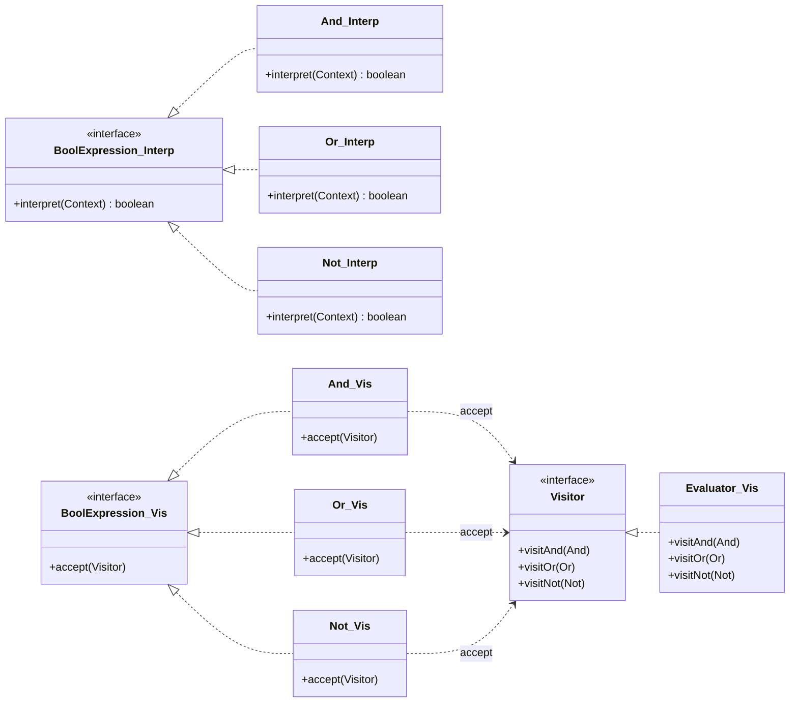
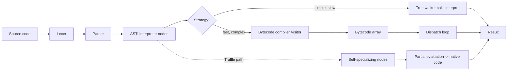

# Interpreter — Senior Level

> **Source:** [refactoring.guru/design-patterns/interpreter](https://refactoring.guru/design-patterns/interpreter)
> **Prerequisite:** [Middle](middle.md)

---

## Table of Contents

1. [Tree-walking vs bytecode interpreters](#tree-walking-vs-bytecode-interpreters)
2. [Interpreter vs Visitor: design duality](#interpreter-vs-visitor-design-duality)
3. [The Expression Problem (Wadler 1998)](#the-expression-problem-wadler-1998)
4. [Real systems using tree-walking interpreters](#real-systems-using-tree-walking-interpreters)
5. [Parser combinators producing Interpreter ASTs](#parser-combinators-producing-interpreter-asts)
6. [Context: stack vs heap, scope chains](#context-stack-vs-heap-scope-chains)
7. [First-class functions as Interpreter](#first-class-functions-as-interpreter)
8. [From Interpreter to bytecode compilation](#from-interpreter-to-bytecode-compilation)
9. [Y-combinator and fixpoints (brief)](#y-combinator-and-fixpoints-brief)
10. [GraalVM Truffle and partial evaluation](#graalvm-truffle-and-partial-evaluation)
11. [Type checking as a separate pass](#type-checking-as-a-separate-pass)
12. [Optimizing the AST before interpretation](#optimizing-the-ast-before-interpretation)
13. [Interpreter and immutability](#interpreter-and-immutability)
14. [Testing interpreters](#testing-interpreters)
15. [Performance considerations](#performance-considerations)
16. [Diagrams](#diagrams)

---

## Tree-walking vs bytecode interpreters

The Interpreter pattern, as described by GoF, is the textbook **tree-walking interpreter**. Each grammar production becomes a class, each class implements `interpret(Context)`, and execution is a recursive descent over the AST.

```java
public interface BoolExpression {
    boolean interpret(Context ctx);
}

public final class Constant implements BoolExpression {
    private final boolean value;
    public Constant(boolean value) { this.value = value; }
    public boolean interpret(Context ctx) { return value; }
}

public final class Variable implements BoolExpression {
    private final String name;
    public Variable(String name) { this.name = name; }
    public boolean interpret(Context ctx) { return ctx.lookup(name); }
}

public final class And implements BoolExpression {
    private final BoolExpression left, right;
    public And(BoolExpression l, BoolExpression r) { this.left = l; this.right = r; }
    public boolean interpret(Context ctx) {
        return left.interpret(ctx) && right.interpret(ctx);
    }
}

public final class Or implements BoolExpression {
    private final BoolExpression left, right;
    public Or(BoolExpression l, BoolExpression r) { this.left = l; this.right = r; }
    public boolean interpret(Context ctx) {
        return left.interpret(ctx) || right.interpret(ctx);
    }
}

public final class Not implements BoolExpression {
    private final BoolExpression inner;
    public Not(BoolExpression inner) { this.inner = inner; }
    public boolean interpret(Context ctx) { return !inner.interpret(ctx); }
}
```

This is correct, clear, and **slow**.

### Why tree walking is slow

1. **Pointer chasing.** AST nodes are heap objects scattered across memory. Each `interpret` call dereferences a child pointer. Modern CPUs prefetch sequential memory; tree traversal foils prefetch.
2. **Virtual dispatch per node.** `left.interpret(ctx)` is a virtual call. A small expression `(a AND b) OR c` performs five virtual calls just to evaluate three operations.
3. **Stack frame overhead.** Each recursive call pushes a frame. Java's HotSpot eliminates many, but deep ASTs are unfriendly.
4. **No fusion.** `Constant(true) AND x` cannot be fused at runtime; the AND node still issues two interpret calls.
5. **Cache misses.** A tree of 10K nodes spans many cache lines. Each visit incurs cache misses unrelated to neighboring nodes.

### Bytecode interpreters

A **bytecode VM** flattens the tree into a linear sequence of opcodes:

```
LOAD_VAR a
LOAD_VAR b
AND
LOAD_VAR c
OR
RETURN
```

Execution is now a tight loop over an `int[]`:

```java
while (true) {
    int op = code[pc++];
    switch (op) {
        case LOAD_VAR -> stack[sp++] = env[code[pc++]];
        case AND      -> { boolean r = stack[--sp] != 0; boolean l = stack[--sp] != 0; stack[sp++] = (l && r) ? 1 : 0; }
        case OR       -> { boolean r = stack[--sp] != 0; boolean l = stack[--sp] != 0; stack[sp++] = (l || r) ? 1 : 0; }
        case RETURN   -> { return stack[--sp] != 0; }
    }
}
```

Sequential opcodes fit in cache; the dispatch loop is highly predictable; a single `switch` becomes a jump table.

### Comparison

| Aspect | Tree walker | Bytecode VM | JIT |
|---|---|---|---|
| Implementation effort | low | medium | very high |
| Startup time | instant | bytecode compilation needed | compile to native first |
| Steady-state speed | 10x baseline | 2-3x baseline | 1x (native) |
| Memory layout | scattered AST | linear bytecode | native machine code |
| Debuggability | trivial (AST = source) | requires source maps | requires deopt info |

### IR-based vs AST-direct

A modern compiler may have several intermediate representations:

```
Source  ->  AST  ->  HIR (high-level IR)  ->  MIR (mid-level IR)  ->  LIR (low-level IR)  ->  Machine
```

The Interpreter pattern *can* run on any of these levels. Tree-walking the AST is the simplest; tree-walking an HIR (after desugaring, after type-checking) is more efficient but architecturally identical. The pattern does not care whether nodes are surface-syntax or normalized IR.

---

## Interpreter vs Visitor: design duality

The two patterns solve the same structural problem from opposite directions.

| | Interpreter | Visitor |
|---|---|---|
| Logic location | Inside nodes (`node.interpret(ctx)`) | Outside nodes (`visitor.visit(node)`) |
| Adding a new operation | Hard — modify every node class | Easy — write a new Visitor class |
| Adding a new node type | Easy — write a new node class | Hard — modify every Visitor interface |
| Best for | Stable operations, growing AST | Stable AST, growing operations |
| Coupling | Operation glued to node hierarchy | Operation decoupled from nodes |
| Testing | Test each node | Test each visitor |

### Same node, both treatments

Interpreter style:

```java
public final class And implements BoolExpression {
    public boolean interpret(Context ctx) {
        return left.interpret(ctx) && right.interpret(ctx);
    }
    public BoolExpression simplify() { /* logic for simplification */ }
    public String render()           { /* logic for rendering */ }
    public Type typeCheck(Env e)     { /* logic for type-check */ }
}
```

Each new operation forces editing `And`, `Or`, `Not`, `Variable`, `Constant`. Five files change.

Visitor style:

```java
public interface BoolVisitor<R> {
    R visitConstant(Constant c);
    R visitVariable(Variable v);
    R visitAnd(And a);
    R visitOr(Or o);
    R visitNot(Not n);
}

public final class Evaluator implements BoolVisitor<Boolean> { ... }
public final class Simplifier implements BoolVisitor<BoolExpression> { ... }
public final class Renderer implements BoolVisitor<String> { ... }
```

Each new operation is one new class. Adding a new node forces editing `BoolVisitor` and every implementation.

### Choosing in practice

- **Define a small DSL with fixed semantics?** Use Interpreter. The grammar is the spec; nodes own their meaning.
- **Build a compiler with growing analyses?** Use Visitor. The AST is fixed by the language; new passes appear constantly.
- **Build both?** Use Interpreter for `evaluate` (the canonical operation) and Visitor for everything else. This is what most production interpreters do.

The duality is real but not exclusive: hybrid approaches dominate.

---

## The Expression Problem (Wadler 1998)

Phil Wadler stated the expression problem in 1998:

> *Can a system be extended in two dimensions — adding new types AND new operations — without modifying existing code, and with full type safety?*

Restated in Interpreter terms:

- **Adding a new operation** (like `simplify`) requires touching every node class. Hard.
- **Adding a new node type** (like `Xor`) is a single new class implementing `BoolExpression`. Easy.

Restated in Visitor terms (the dual):

- **Adding a new operation** is a single new visitor. Easy.
- **Adding a new node type** requires touching every visitor. Hard.

Neither pattern solves both axes. Solutions exist but require richer language features:

| Mechanism | Both axes? | Languages |
|---|---|---|
| Type classes / traits | yes | Haskell, Rust, Scala |
| Multimethods | yes | Clojure, CLOS, Julia |
| Open data types | yes | Research languages, OCaml polymorphic variants |
| Default methods | partial | Java 8+, Kotlin, C# |
| Sealed types + pattern matching | partial | Kotlin, Scala 3, Java 21+ |

The honest answer: in mainstream OOP, you pick one axis and live with the other. Interpreter is correct when the operation set is small and stable (typically just `evaluate`) and the grammar grows over time.

---

## Real systems using tree-walking interpreters

The Interpreter pattern is not an academic curiosity. Many production systems begin life as tree walkers, and several remain so.

### Early Ruby (MRI before YARV)

Until Ruby 1.9, the MRI implementation was a pure AST walker. Each method call recursively interpreted the parsed AST. YARV (Yet Another Ruby VM) introduced bytecode compilation for steady-state speed, but for ten years Ruby ran by walking trees.

### Early PHP (Zend before opcache)

PHP parsed each request, walked the AST, and discarded it. Opcache later added bytecode caching, but the interpreter loop is still operating on a flattened representation derived from the AST.

### Lua

Lua compiles to a register-based bytecode VM rather than a tree walker, but the conceptual proximity to the Interpreter pattern is striking: each opcode is a small interpretive routine, and the dispatch loop is the moral equivalent of `interpret`.

### AWK

AWK parses the program into an AST, then walks it for every input line. Performance is acceptable because most programs are small.

### Regex engines (NFA/DFA simulation)

A backtracking regex engine constructs an NFA (the AST of the regex) and walks it. Each node — `Concat`, `Alt`, `Star`, `Char` — has an `interpret` method that consumes input characters. Java's `java.util.regex.Pattern` is essentially a tree-walking interpreter over a compiled NFA.

### XPath evaluators

XPath expressions are parsed into ASTs whose nodes (`Step`, `Predicate`, `FunctionCall`, `BinaryOp`) implement an `evaluate(Context)` method. The Context carries the current node-set, the document, and variables. Java's JAXP and Python's lxml use this structure.

### jq

The JSON query language `jq` parses programs into an AST of filters, each implementing the equivalent of `apply(input) -> stream of outputs`. The streaming semantics force a slightly more elaborate Context (a continuation, in functional terms), but the architecture is GoF Interpreter.

### Spreadsheet formula engines

Excel, Google Sheets, Numbers — each formula is parsed into an AST. Cells reference other cells (Variable nodes); operations are `Add`, `Multiply`, `If`, `Vlookup`. The recalculation engine walks the dependency graph and interprets each formula.

### SQL WHERE clauses (in some engines)

Embedded databases sometimes interpret WHERE expressions directly as a tree walker over rows. SQLite compiles to bytecode; H2 (in some modes) and many embedded engines walk the AST per row.

The pattern is everywhere small DSLs appear.

---

## Parser combinators producing Interpreter ASTs

Parser combinators are higher-order functions that combine small parsers into larger ones. They naturally produce Interpreter-style ASTs because each grammar rule maps directly to a node constructor.

### Concept

A parser is a function `String -> Maybe (Result, String)`. Combinators include:

- `or(p1, p2)` — try `p1`, fall back to `p2`.
- `seq(p1, p2)` — apply `p1`, then `p2`, return both.
- `many(p)` — apply `p` zero or more times.
- `map(p, f)` — apply `p`, transform result with `f`.

### Kotlin sketch

```kotlin
typealias Parser<T> = (String, Int) -> Pair<T, Int>?

fun <T> token(s: String, value: T): Parser<T> = { input, pos ->
    if (input.startsWith(s, pos)) value to (pos + s.length) else null
}

fun <T> or(p1: Parser<T>, p2: Parser<T>): Parser<T> = { input, pos ->
    p1(input, pos) ?: p2(input, pos)
}

fun <A, B> seq(pa: Parser<A>, pb: Parser<B>): Parser<Pair<A, B>> = { input, pos ->
    val r1 = pa(input, pos) ?: return@seq null
    val r2 = pb(input, r1.second) ?: return@seq null
    (r1.first to r2.first) to r2.second
}

// Grammar for boolean expressions:
//   expr   := orExpr
//   orExpr := andExpr ("OR" andExpr)*
//   andExpr:= atom    ("AND" atom)*
//   atom   := "true" | "false" | identifier | "NOT" atom | "(" expr ")"

val constTrue:  Parser<BoolExpression> = token("true",  Constant(true))
val constFalse: Parser<BoolExpression> = token("false", Constant(false))
val atom: Parser<BoolExpression> = or(constTrue, constFalse)
// ... and so on, building up Or/And/Not nodes
```

The output of parsing is exactly the AST that the Interpreter pattern operates on. The Visitor pattern would require a separate construction phase; the Interpreter pattern uses the parse tree directly.

### Why this matters

Parser combinator libraries (Haskell's Parsec, Scala's parser combinators, Kotlin's various ports, jparsec for Java) make it trivially cheap to build small interpreters. Define a grammar in 50 lines, get an AST, write `interpret` on each node, and you have a working DSL. This is the GoF Interpreter pattern's natural ecosystem.

---

## Context: stack vs heap, scope chains

The `Context` parameter is the carrier of state during interpretation. Its design varies enormously by language semantics.

### Flat context (boolean expressions)

```java
public final class Context {
    private final Map<String, Boolean> bindings;
    public boolean lookup(String name) { return bindings.get(name); }
}
```

Single namespace, no nesting. Fine for boolean DSLs.

### Lexical scoping with environment frames

Add `let` to the language:

```
let x = true in (x AND y)
```

Now Context must support nested scopes:

```java
public final class Context {
    private final Map<String, Boolean> bindings;
    private final Context parent;

    public Context(Context parent) { this.parent = parent; this.bindings = new HashMap<>(); }

    public boolean lookup(String name) {
        if (bindings.containsKey(name)) return bindings.get(name);
        if (parent != null) return parent.lookup(name);
        throw new RuntimeException("undefined: " + name);
    }

    public Context extend() { return new Context(this); }
    public void define(String name, boolean value) { bindings.put(name, value); }
}
```

Each `Let` node creates a child Context, defines its variable, and interprets its body in the new scope.

```java
public final class Let implements BoolExpression {
    private final String name;
    private final BoolExpression value, body;
    public boolean interpret(Context ctx) {
        Context inner = ctx.extend();
        inner.define(name, value.interpret(ctx));
        return body.interpret(inner);
    }
}
```

This is **lexical scoping**: a variable resolves in the scope where it was defined, not where it is used.

### Dynamic scoping

The opposite policy: variables resolve in the dynamic call stack. Implemented by using the *caller's* Context for body evaluation. Almost no modern language uses dynamic scoping; the famous exceptions are early Lisps and shell scripting (`local` vs default behavior in Bash).

### Stack vs heap allocation

Local environments can be allocated on the stack if they don't escape (no closures capture them). When closures capture an environment frame, that frame must move to the heap, because its lifetime exceeds the calling function's.

The choice is identical to JVM's escape analysis: HotSpot can stack-allocate a heap object if it provably does not escape its enclosing method.

### Scope chain as linked list

The chain of `parent` pointers is a linked list. Variable lookup is O(depth). For deeply nested scopes this can dominate; production interpreters often flatten lookups using **lexical addresses** (`(frame_index, slot_index)`) computed at compile time. JavaScript engines and Smalltalk VMs do this routinely.

---

## First-class functions as Interpreter

Once Context supports lexical scoping, adding first-class functions is a small step. Two new node types:

```java
public final class Lambda implements BoolExpression {
    private final List<String> params;
    private final BoolExpression body;
    public Closure interpret(Context ctx) {
        return new Closure(params, body, ctx);   // capture defining context
    }
}

public final class Apply implements BoolExpression {
    private final BoolExpression fn;
    private final List<BoolExpression> args;
    public Object interpret(Context ctx) {
        Closure closure = (Closure) fn.interpret(ctx);
        Context callCtx = closure.env.extend();
        for (int i = 0; i < closure.params.size(); i++) {
            callCtx.define(closure.params.get(i), args.get(i).interpret(ctx));
        }
        return closure.body.interpret(callCtx);
    }
}

public final class Closure {
    final List<String> params;
    final BoolExpression body;
    final Context env;   // captured at lambda creation
    Closure(List<String> p, BoolExpression b, Context e) { this.params = p; this.body = b; this.env = e; }
}
```

A **closure** is just a record carrying the function's body and the Context in which it was defined. The `Apply` node interprets the function expression to obtain a Closure, then evaluates the body in a fresh extension of the closure's captured environment.

This three-class addition (Lambda, Apply, Closure) turns a propositional-logic interpreter into a small functional language. The Interpreter pattern accommodates this growth without altering existing nodes — the expression-problem axis it's *good* at.

Note the type punning: the original `boolean interpret(Context)` no longer fits, since Lambda returns a Closure. In a real implementation, replace the boolean return with a tagged value type (`Value` with subclasses `BoolValue`, `ClosureValue`).

---

## From Interpreter to bytecode compilation

Most production interpreters begin as tree walkers and migrate to bytecode for speed. The Interpreter pattern is the **prototype phase** of language implementation.

### CPython

Until the AST-direct experiments of recent versions, CPython parsed Python source to an AST, then compiled the AST to a stack-based bytecode (`co_code` on each code object), then ran the bytecode in `_PyEval_EvalFrameDefault`. The Interpreter pattern lives only in the AST validator and a handful of constant-folding passes; execution is bytecode.

### V8 (JavaScript)

V8 has Ignition (a register-based bytecode interpreter) plus TurboFan (an optimizing JIT). Source is parsed to AST, compiled to Ignition bytecode, then optionally compiled to native by TurboFan when hot. The Interpreter pattern is essentially absent from V8's hot path.

### Lua

Lua compiles to a register-based bytecode VM. The reference interpreter never walks the AST at runtime.

### Why migrate?

Three forces drive the move from tree walking to bytecode:

1. **Speed.** Bytecode is 5-10x faster steady-state. For long-running programs this dominates.
2. **Memory.** A single bytecode array is smaller than a tree of objects.
3. **Serialization.** Bytecode can be cached across processes (`__pycache__`); ASTs typically aren't.

### When to stay tree-walking

- Short-lived scripts (parse cost dominates).
- Heavy debugging support (the AST is the debug model).
- Truffle-style partial evaluation (see below) makes tree walking competitive again.
- The DSL is too small to justify a VM.

### Compilation as a Visitor

Once you decide to compile, the bytecode generator is a Visitor over the AST. The Interpreter and Visitor patterns coexist:

```java
public class BytecodeCompiler implements BoolVisitor<Void> {
    private final List<Op> code = new ArrayList<>();
    public Void visitConstant(Constant c) { code.add(new PushConst(c.value())); return null; }
    public Void visitVariable(Variable v) { code.add(new LoadVar(v.name())); return null; }
    public Void visitAnd(And a) {
        a.left().accept(this);
        int jumpIfFalse = code.size();
        code.add(new JumpIfFalse(-1));   // patched below
        a.right().accept(this);
        ((JumpIfFalse) code.get(jumpIfFalse)).target = code.size();
        return null;
    }
    // ...
}
```

Note `And` already short-circuits via the bytecode jump — semantically identical to the Interpreter version.

---

## Y-combinator and fixpoints (brief)

A pure Interpreter (no mutable state, no global definitions) cannot express recursion directly. A function defined as `fun fact(n) = if n <= 1 then 1 else n * fact(n-1)` references its own name — but at the moment the lambda is created, that name is unbound.

Solutions:

### Mutable bindings

Allow `let rec`, which inserts the name into Context *before* evaluating the body. Most languages do this.

### Y-combinator

A higher-order function that produces fixpoints:

```
Y = λf. (λx. f (x x)) (λx. f (x x))
```

Then `Y(λfact. λn. if n <= 1 then 1 else n * fact(n-1))` is the recursive factorial without a name. The Y-combinator only works in untyped or with rank-2 polymorphism; in simply-typed lambda calculus it cannot be expressed.

### Practical relevance

The Y-combinator is rarely useful in production — it's a theoretical curiosity that proves untyped lambda calculus is Turing-complete without explicit recursion primitives. Real interpreters use mutable name bindings or `let rec`. Flag it because senior engineers in language work occasionally encounter it (PL theory papers, scheme implementations, Haskell-internals discussions).

---

## GraalVM Truffle and partial evaluation

Truffle is the modern justification for writing a tree-walking interpreter in 2026.

### What Truffle does

You write your language as a tree-walking Interpreter using Truffle's `Node` base class. Truffle, running on GraalVM, **partially evaluates** your interpreter against a specific program, producing native machine code optimized for that program.

Concretely: when a method gets hot, Truffle takes the AST plus your interpreter code, specializes the interpreter to that AST (eliminating the AST traversal entirely — the AST shape becomes a *constant*), then runs the GraalVM optimizing compiler over the result. Output: native code that *is* the program, with no interpretation overhead.

### Futamura projections

This is one of Yoshihiko Futamura's projections (1971): partial evaluation of an interpreter against a program *is* compilation. Truffle is the first widely-used commercial realization.

### Languages built on Truffle

- TruffleRuby — competitive with MRI and YARV.
- GraalPython — competitive with CPython on numeric workloads.
- TruffleJS — JavaScript on Truffle.
- FastR — R on Truffle.
- Sulong — LLVM bitcode on Truffle (for C, C++, Rust).

All of these are written as tree-walking interpreters. The Interpreter pattern, applied with Truffle's annotations and self-specializing nodes, gets you a competitive VM "for free".

### Caveat

Truffle imposes constraints:

- Nodes must be subclasses of `Node`.
- Self-specialization (a node rewrites itself based on observed types) must be expressed via `@Specialization` annotations.
- The interpreter must be free of un-specialized polymorphism on hot paths.

Within these constraints, the Interpreter pattern is no longer the slow choice. It is a competitive starting point.

---

## Type checking as a separate pass

In a typed language, a type checker validates that operations are applied to compatible operands. Two design choices:

### Type checking as a Visitor

Standard separation of concerns:

```java
public final class TypeChecker implements BoolVisitor<Type> {
    private final TypeEnv env;
    public Type visitAnd(And a) {
        Type lt = a.left().accept(this);
        Type rt = a.right().accept(this);
        if (!lt.equals(BOOL) || !rt.equals(BOOL))
            throw new TypeError("AND requires booleans");
        return BOOL;
    }
    // ...
}
```

**Pros:** type checking is a separate concern; can be skipped, replaced, or made optional. Adding a new type judgment is one new method.

**Cons:** must maintain Visitor-implementation parity with each new node.

### Type checking as Interpreter (per node)

Each node has its own `typeCheck(TypeEnv)`:

```java
public final class And implements BoolExpression {
    public Type typeCheck(TypeEnv env) {
        if (!left.typeCheck(env).equals(BOOL)) throw new TypeError("AND left");
        if (!right.typeCheck(env).equals(BOOL)) throw new TypeError("AND right");
        return BOOL;
    }
}
```

**Pros:** node owns its type rule. Adding a new node adds its type rule alongside its evaluation rule. No separate file to keep in sync.

**Cons:** logic spreads across all node classes. Hard to swap type systems (e.g., from monomorphic to polymorphic).

### Practical recommendation

In a language with stable semantics (a DSL with one type system), per-node `typeCheck` is fine and locality-friendly. In a language with multiple type modes (Java has erased generics, reified primitives, and projected nullability) or research languages with multiple type systems, Visitor-based checking wins.

Most real compilers use Visitor. Interpreter style appears in tutorials and small interpreters.

---

## Optimizing the AST before interpretation

Tree-walking interpreters benefit hugely from AST-level optimization. The same passes that compilers apply to IR work on the original AST.

### Constant folding

Replace constant subexpressions with their values:

```java
public final class ConstFolder implements BoolVisitor<BoolExpression> {
    public BoolExpression visitAnd(And a) {
        BoolExpression l = a.left().accept(this);
        BoolExpression r = a.right().accept(this);
        if (l instanceof Constant lc && r instanceof Constant rc)
            return new Constant(lc.value() && rc.value());
        if (l instanceof Constant lc && !lc.value()) return new Constant(false);   // false AND _
        if (l instanceof Constant lc && lc.value()) return r;                       // true AND x  -> x
        if (r instanceof Constant rc && !rc.value()) return new Constant(false);   // _ AND false (assumes pure left)
        if (r instanceof Constant rc && rc.value()) return l;                       // x AND true  -> x
        return new And(l, r);
    }
    public BoolExpression visitOr(Or o) {
        BoolExpression l = o.left().accept(this);
        BoolExpression r = o.right().accept(this);
        if (l instanceof Constant lc && r instanceof Constant rc)
            return new Constant(lc.value() || rc.value());
        if (l instanceof Constant lc && lc.value()) return new Constant(true);
        if (l instanceof Constant lc && !lc.value()) return r;
        return new Or(l, r);
    }
    public BoolExpression visitNot(Not n) {
        BoolExpression inner = n.inner().accept(this);
        if (inner instanceof Constant c) return new Constant(!c.value());
        if (inner instanceof Not innerNot) return innerNot.inner();   // NOT NOT x  -> x
        return new Not(inner);
    }
    public BoolExpression visitConstant(Constant c) { return c; }
    public BoolExpression visitVariable(Variable v) { return v; }
}
```

Result: `Constant(true) AND Variable(x)` simplifies to `Variable(x)`.

### Other AST optimizations

- **Dead code elimination.** `if Constant(false) then A else B` reduces to B.
- **Common subexpression elimination.** Detect identical subtrees, share or cache.
- **Strength reduction.** `x AND x` simplifies to `x`; `x OR NOT x` simplifies to `Constant(true)`.
- **Peephole transformations.** Local rewrites that simplify small patterns: `NOT (a AND b)` -> `(NOT a) OR (NOT b)` (De Morgan).

Each is a Visitor. They form a pipeline; running them iteratively until the AST stabilizes is the **fixed-point** style.

### Why optimize before interpreting

Interpretation cost is per-evaluation. Optimization cost is one-time. A query-language DSL evaluated against a million rows benefits enormously from a one-time fold; a one-shot script does not.

---

## Interpreter and immutability

The Interpreter pattern is most pleasant with immutable ASTs.

### Immutable ASTs

Each node's fields are `final`. Nodes are constructed once and never mutated. Optimization passes return new nodes; if the result equals the input, the input is reused (structural sharing).

```java
public BoolExpression visitAnd(And a) {
    BoolExpression l = a.left().accept(this);
    BoolExpression r = a.right().accept(this);
    if (l == a.left() && r == a.right()) return a;   // unchanged: reuse
    return new And(l, r);
}
```

**Benefits:**

- Safe to share AST across threads.
- Optimization passes are pure functions; trivially testable.
- Caching of evaluation results is sound (no aliasing concerns).
- Memoization of subexpression evaluations works.

### Mutable ASTs

Some interpreters mutate nodes — annotating them with computed types, inferred values, or optimization markers.

```java
public final class And implements BoolExpression {
    private boolean optimized = false;
    private Type cachedType;
    // ...
}
```

**Drawbacks:**

- AST is no longer thread-safe.
- Order of passes matters (mutation creates dependencies).
- Optimization cannot trivially be undone.
- Memory grows as annotation slots are added.

**Benefits:**

- Cheaper than allocating new nodes.
- Useful when optimization is iterative and many passes annotate.

### Recommendation

Default to immutable ASTs. Move to mutable annotations only if profiling proves allocation is a bottleneck. The clarity gain from immutability dwarfs the runtime cost in 95% of interpreters.

---

## Testing interpreters

### Golden file tests

For each input program, store the expected output. Re-run on every commit; flag any change.

```java
@Test void program_factorial5() {
    String src = readFile("tests/factorial5.lang");
    String expected = readFile("tests/factorial5.expected");
    String actual = interpret(src);
    assertEquals(expected, actual);
}
```

Excellent for catching regressions in semantics. Hard to maintain when intentional output changes (regenerate goldens cautiously).

### Property-based testing

Test invariants over generated inputs:

```java
@Property
void evaluatorAgreesWithFolder(@ForAll BoolExpression ast, @ForAll Map<String, Boolean> env) {
    Context ctx = Context.from(env);
    boolean direct = ast.interpret(ctx);
    BoolExpression folded = ast.accept(new ConstFolder());
    boolean afterFold = folded.interpret(ctx);
    assertEquals(direct, afterFold);
}
```

Generator produces random ASTs; the test catches optimizer bugs the property `eval(opt(x)) == eval(x)` would expose.

### Round-trip tests for parsers

```java
@Property
void parsePrintRoundTrip(@ForAll BoolExpression ast) {
    String text = ast.print();
    BoolExpression reparsed = Parser.parse(text);
    assertEquals(ast, reparsed);
}
```

If `print(parse(s)) == s` modulo whitespace, the parser and printer agree.

### Differential testing

Compare against another interpreter (the reference) or a compiler:

```java
@Property
void agreesWithReferenceImpl(@ForAll BoolExpression ast, @ForAll Map<String,Boolean> env) {
    boolean ours = new Evaluator().eval(ast, env);
    boolean reference = new ReferenceImpl().eval(ast, env);
    assertEquals(ours, reference);
}
```

Ideal when a slow but trusted reference exists (e.g., the original textbook interpreter; an external library; a competing implementation).

### Fuzz testing

Generate malformed inputs; assert the interpreter never crashes (only throws controlled exceptions). Languages like Erlang and Rust have mature fuzzing infrastructure; for JVM, use JQF.

### Testing the Context

Test scope chains independently of evaluation:

```java
@Test void shadowingResolvesToInnermost() {
    Context outer = new Context(null);
    outer.define("x", true);
    Context inner = outer.extend();
    inner.define("x", false);
    assertFalse(inner.lookup("x"));
    assertTrue(outer.lookup("x"));
}
```

Many interpreter bugs are scope bugs; isolate them.

---

## Performance considerations

### Virtual dispatch per node

Each `interpret` call is a virtual call. A 10K-node tree triggers at least 10K virtual calls. JIT inlines the call site only when the call is monomorphic — observed to dispatch to one type. Across multiple node types, the call is megamorphic and not inlined.

### Megamorphic dispatch

A typical AST has 10-30 node types. A single call site to `interpret` will see all of them. HotSpot's inline cache supports two types per site; beyond that it falls back to a v-table lookup. This is one of the hardest performance ceilings in tree-walking interpreters.

### Mitigations

- **Bytecode compilation** (covered above) replaces virtual dispatch with switch dispatch over an int.
- **Self-specializing nodes** (Truffle): a node observes the actual types it sees and rewrites itself to a specialized version. Inline caches stay monomorphic.
- **Inlining-friendly tree shape**: keep node classes few and broad. A `BinaryOp` with an op-code field beats `Add`, `Sub`, `Mul`, `Div` if the call site is hot.
- **Final classes**: mark all node classes `final`. JIT can devirtualize when no subclasses exist.

### No inlining across `interpret`

The body of `interpret` cannot be inlined into its caller because the caller is also `interpret` (recursion). Bytecode VMs solve this with a dispatch loop where the `switch` case can be inlined into itself for the common cases.

### Cache locality

Tree nodes are heap-allocated, scattered. Cache misses dominate small-node interpreters. Counterintuitively, **deeper but smaller** ASTs may be slower than **shallower but larger** ASTs due to cache locality of arrays.

Some implementations flatten the AST into a single array of tagged nodes, sacrificing the natural object-oriented shape for cache friendliness. This is the **AST-as-arena** approach used by Roslyn, ANTLR (in fast mode), and a handful of academic compilers.

### Allocation

If `interpret` allocates Context frames on every call, GC pressure is enormous. Reuse frames or stack-allocate (escape analysis). Avoid wrapping primitive results in boxes (`Boolean.valueOf` vs unboxed `boolean`).

### Branch prediction

A bytecode dispatch loop trains the branch predictor: the same opcodes appear repeatedly, the predictor learns the patterns. Tree walking presents the predictor with a different call site for each node, defeating prediction.

### Summary

- Tree walking is **simple, slow, and easy to get right**. Use it for prototypes, DSLs, REPLs, and one-shot tools.
- Bytecode is **medium complexity, fast enough**. Use it once your interpreter is the bottleneck.
- JIT is **complex, fast**. Rarely needed; if needed, use Truffle.

---

## Diagrams

### Evaluation sequence (recursive interpret with Context)

```mermaid
sequenceDiagram
    participant Caller
    participant Or as Or(left, right)
    participant And as And(a, b)
    participant Va as Variable(a)
    participant Vb as Variable(b)
    participant Vc as Variable(c)
    participant Ctx as Context

    Caller->>Or: interpret(ctx)
    Or->>And: left.interpret(ctx)
    And->>Va: a.interpret(ctx)
    Va->>Ctx: lookup("a")
    Ctx-->>Va: true
    Va-->>And: true
    And->>Vb: b.interpret(ctx)
    Vb->>Ctx: lookup("b")
    Ctx-->>Vb: false
    Vb-->>And: false
    And-->>Or: false
    Or->>Vc: right.interpret(ctx)
    Vc->>Ctx: lookup("c")
    Ctx-->>Vc: true
    Vc-->>Or: true
    Or-->>Caller: true
```

### Interpreter and Visitor as duals (class diagram)



Left side: logic lives **in the nodes** (Interpreter). Right side: logic lives **in the visitor** (Visitor). Both express the same evaluation; the duality is in *where* the per-operation code resides.

### Expression problem matrix

```
                +------+--------+
                | Add  | Add    |
                | Type | Op     |
+---------------+------+--------+
| Interpreter   | EASY | HARD   |
+---------------+------+--------+
| Visitor       | HARD | EASY   |
+---------------+------+--------+
| Multimethods  | EASY | EASY   |
+---------------+------+--------+
```

### From AST to bytecode



The Interpreter pattern is the entry point. The branches downstream are performance engineering on top of the same conceptual core.

---

[← Middle](middle.md) · [Professional →](professional.md)
