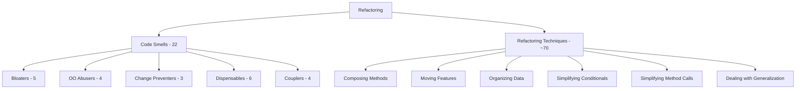

# Refactoring Roadmap

> **Source:** [refactoring.guru](https://refactoring.guru/) — adapted into a structured, multi-language roadmap with code examples in **Go**, **Java**, and **Python**.

> *"For each desirable change, make the change easy (warning: this may be hard), then make the easy change."* — Kent Beck

---

## What This Roadmap Covers

| Section | Topics | Files |
|---|---|---|
| [Code Smells](01-code-smells/README.md) | 22 smells in 5 categories | 40 |
| [Refactoring Techniques](02-refactoring-techniques/README.md) | ~70 techniques in 6 categories | 48 |

> Looking for design patterns? They live in their own roadmap: [Design Patterns](../design-patterns/README.md).

---

## How to Use This Roadmap

Each topic lives in its own folder containing **8 files**, each targeting a different skill level or learning mode:

| File | Focus | Audience |
|---|---|---|
| `junior.md` | "What is it?" "How to use?" | Just learned the language |
| `middle.md` | "Why?" "When?" Tradeoffs and real-world cases | 1-3 yr experience |
| `senior.md` | "How to optimize?" "How to architect?" | 3-7 yr experience |
| `professional.md` | Under the hood — runtime, memory, performance | 7+ yr / specialist |
| `interview.md` | 50+ Q&A across all levels | Job preparation |
| `tasks.md` | 10+ hands-on exercises with solutions | Practice |
| `find-bug.md` | 10+ buggy code snippets to fix | Critical reading |
| `optimize.md` | 10+ inefficient implementations to optimize | Performance practice |

**Recommended order:** `junior.md` → `middle.md` → `senior.md` → `professional.md` → practice files (`tasks.md` → `find-bug.md` → `optimize.md`) → `interview.md` for review.

---

## Code Smells & Techniques at a Glance

---

## Cross-References: Smell ↔ Technique

Smells and techniques are two sides of the same coin: a smell is a *symptom*, a technique is the *cure*. The two sections are linked bidirectionally — each smell file lists the techniques that resolve it, and each technique file lists the smells it addresses.

A few high-traffic correspondences:

| Smell | Resolved by |
|---|---|
| Long Method | Extract Method, Replace Method with Method Object, Decompose Conditional |
| Large Class | Extract Class, Extract Subclass, Extract Interface |
| Primitive Obsession | Replace Data Value with Object, Replace Type Code with Class/Subclasses, Introduce Parameter Object |
| Switch Statements | Replace Conditional with Polymorphism, Replace Type Code with State/Strategy |
| Duplicate Code | Extract Method, Pull Up Method, Form Template Method |
| Feature Envy | Move Method, Extract Method |
| Message Chains | Hide Delegate |
| Refused Bequest | Push Down Method/Field, Replace Inheritance with Delegation |

The catalog continues inside each section — every smell page enumerates its full set of resolving techniques, and every technique page enumerates the smells it addresses.

---

## Languages

All code examples in three languages — **Go**, **Java**, **Python** — to highlight idiomatic differences:

- **Go** — package-oriented, composition over inheritance, no classical OOP — refactorings differ from Java/Python
- **Java** — classical OOP, the language refactoring.guru itself uses by default — closest to Fowler's original *Refactoring* book
- **Python** — dynamic typing, "duck typing" — many techniques become simpler or unnecessary

Comparing the same refactoring across all three is a powerful learning device: it shows what the technique is **really** about, separated from any specific language's syntax.

---

## Status

### ✅ Code Smells — COMPLETE (5/5)
- ✅ Bloaters (Long Method, Large Class, Primitive Obsession, Long Parameter List, Data Clumps)
- ✅ OO Abusers (Switch Statements, Temporary Field, Refused Bequest, Alternative Classes)
- ✅ Change Preventers (Divergent Change, Shotgun Surgery, Parallel Inheritance Hierarchies)
- ✅ Dispensables (Comments, Duplicate Code, Lazy Class, Data Class, Dead Code, Speculative Generality)
- ✅ Couplers (Feature Envy, Inappropriate Intimacy, Message Chains, Middle Man)

### ⏳ Refactoring Techniques — PENDING (0/6)
- ⬜ Composing Methods
- ⬜ Moving Features Between Objects
- ⬜ Organizing Data
- ⬜ Simplifying Conditional Expressions
- ⬜ Simplifying Method Calls
- ⬜ Dealing with Generalization

---

## References

- **Source:** [Refactoring.Guru](https://refactoring.guru/refactoring)
- **Foundational book:** *Refactoring: Improving the Design of Existing Code* (1999, 2nd ed. 2018) — Martin Fowler
- **Companion roadmap:** [Design Patterns](../design-patterns/README.md) — the GoF catalog that this roadmap originally lived alongside

---

## Project Context

This roadmap is part of the [Senior Project](../../../index.md) — a personal effort to consolidate the essential knowledge of software engineering in one place.
