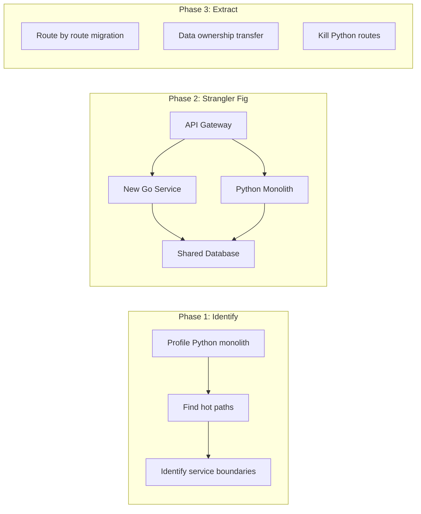

# Why Use Go — Interview Questions

## Table of Contents

1. [Junior Level](#junior-level)
2. [Middle Level](#middle-level)
3. [Senior Level](#senior-level)
4. [Scenario-Based Questions](#scenario-based-questions)
5. [FAQ](#faq)

---

## Junior Level

### 1. What is Go and who created it?

**Answer:**
Go (also called Golang) is an open-source, statically typed, compiled programming language created at Google in 2009 by Robert Griesemer, Rob Pike, and Ken Thompson. It was designed to solve problems with slow compilation, complex dependency management, and difficulty writing concurrent programs in large codebases.

---

### 2. What are the main advantages of using Go?

**Answer:**
The main advantages are:
- **Fast compilation** — large projects compile in seconds, not minutes
- **Built-in concurrency** — goroutines and channels make concurrent programming simple
- **Single binary deployment** — no runtime or dependencies needed on the target machine
- **Strong standard library** — HTTP servers, JSON, crypto, testing, and more are built in
- **Simple syntax** — only 25 keywords, easy to learn and read
- **Excellent tooling** — `go fmt`, `go vet`, `go test`, built-in race detector

---

### 3. What is a goroutine and how does it differ from a thread?

**Answer:**
A goroutine is a lightweight concurrent function managed by the Go runtime. Key differences from OS threads:

```go
package main

import (
    "fmt"
    "sync"
)

func main() {
    var wg sync.WaitGroup
    // Launch 1000 goroutines — easy and cheap
    for i := 0; i < 1000; i++ {
        wg.Add(1)
        go func(id int) {
            defer wg.Done()
            fmt.Printf("Goroutine %d\n", id)
        }(i)
    }
    wg.Wait()
}
```

- Goroutines start with ~2KB stack (threads: ~1MB)
- Go runtime manages goroutines (OS manages threads)
- You can run millions of goroutines (threads are limited to thousands)
- Goroutines are multiplexed onto a small number of OS threads (M:N scheduling)

---

### 4. What does "single binary deployment" mean?

**Answer:**
Go compiles your entire program — including all dependencies and the Go runtime — into a single executable file. You do not need to install Go, a virtual machine, or any libraries on the target machine. Just copy the binary and run it. This simplifies deployment, especially in containerized environments (Docker images can be as small as ~10MB).

---

### 5. How does Go handle errors differently from languages like Java or Python?

**Answer:**
Go uses explicit error return values instead of exceptions:

```go
package main

import (
    "fmt"
    "strconv"
)

func main() {
    // Go: errors are values, not exceptions
    num, err := strconv.Atoi("abc")
    if err != nil {
        fmt.Println("Error:", err)
        return
    }
    fmt.Println("Number:", num)
}
```

- Functions return an `error` as the last return value
- The caller must check `err != nil` explicitly
- There is no `try/catch` mechanism
- This makes error handling paths visible and explicit in the code

---

### 6. What is Go's standard library and why is it important?

**Answer:**
Go's standard library is a comprehensive set of packages included with the Go installation. It covers HTTP servers (`net/http`), JSON encoding (`encoding/json`), cryptography (`crypto`), file I/O (`os`, `io`), testing (`testing`), and much more. It is important because for many common tasks, you do not need any third-party dependencies — reducing supply chain risk, simplifying builds, and ensuring quality.

---

### 7. Name three real-world projects built with Go.

**Answer:**
- **Docker** — containerization platform
- **Kubernetes** — container orchestration system
- **Terraform** — infrastructure as code tool

All three demonstrate Go's strengths: network services, CLI tools, and infrastructure software that needs to be distributed as a single binary.

---

## Middle Level

### 8. Why was Go designed to be simple rather than feature-rich?

**Answer:**
Go was designed at Google where thousands of engineers work on large shared codebases. The design philosophy prioritizes:

1. **Readability:** Code is read 10x more than written. Fewer language features mean fewer ways to write confusing code
2. **Fast onboarding:** New engineers can become productive in Go within 2-4 weeks
3. **Consistent codebase:** With one way to format (`go fmt`), one loop construct (`for`), and no operator overloading, all Go code looks similar
4. **Reduced maintenance cost:** Simple code is easier to debug, review, and maintain over years

The trade-off: Go sacrifices expressiveness (no macros, limited generics, no pattern matching) for these benefits. This is intentional — Rob Pike famously said Go is "for working at scale, both in terms of the problem domain and the number of engineers."

---

### 9. Explain Go's concurrency model. How does it differ from Python's asyncio or Java's threads?

**Answer:**
Go uses CSP (Communicating Sequential Processes):

```go
package main

import "fmt"

func main() {
    ch := make(chan string)

    // Producer goroutine
    go func() {
        ch <- "hello from goroutine"
    }()

    // Consumer (main goroutine)
    msg := <-ch
    fmt.Println(msg)
}
```

| Aspect | Go | Python asyncio | Java Threads |
|--------|-----|---------------|-------------|
| Model | CSP (goroutines + channels) | Event loop + coroutines | OS threads + executors |
| Memory | ~2KB per goroutine | Single thread (GIL) | ~1MB per thread |
| Parallelism | True parallelism on multi-core | No true parallelism (GIL) | True parallelism |
| Syntax | `go func()` | `async/await` | `new Thread()` or `ExecutorService` |
| Communication | Channels (message passing) | Futures/queues | Shared memory + locks |

Go's advantage: goroutines are cheap enough to use one per connection, avoiding the complexity of callback-based or async/await patterns.

---

### 10. When would you NOT choose Go for a project?

**Answer:**
- **Machine learning / data science:** Python's ecosystem (NumPy, pandas, TensorFlow, PyTorch) is irreplaceable
- **Complex domain modeling:** Languages with algebraic data types (Rust, Kotlin, Scala) are better for rich domain models
- **GUI desktop applications:** Go lacks mature GUI frameworks (use Swift, C#, Electron)
- **Ultra-low-latency systems:** Go's garbage collector causes sub-millisecond pauses — use Rust or C++ when you need predictable sub-microsecond latency
- **Rapid scripting/prototyping:** Python or JavaScript are faster for throwaway code

---

### 11. What is the nil interface trap in Go?

**Answer:**
An interface in Go is a `(type, value)` pair. A nil interface has both type and value as nil. But a non-nil type with a nil value creates a non-nil interface:

```go
package main

import "fmt"

type MyError struct{ msg string }
func (e *MyError) Error() string { return e.msg }

func process() error {
    var err *MyError // nil pointer
    return err       // Returns (*MyError, nil) — NOT a nil interface!
}

func main() {
    err := process()
    fmt.Println(err == nil) // false! The interface has type *MyError
}
```

**Fix:** Always return `nil` directly, not a typed nil pointer: `return nil`.

---

### 12. How would you debug a goroutine leak in production?

**Answer:**
1. **Monitor goroutine count:** Expose `runtime.NumGoroutine()` as a metric
2. **Enable pprof endpoint:** `import _ "net/http/pprof"` and `go http.ListenAndServe(":6060", nil)`
3. **Get goroutine dump:** `curl http://localhost:6060/debug/pprof/goroutine?debug=2`
4. **Identify stuck goroutines:** Look for goroutines in `chan receive` or `select` state for extended time
5. **Root cause:** Usually a channel that is never closed, or a goroutine without a context cancellation path
6. **Fix:** Always provide goroutines with a way to exit — use `context.Context` or channel-based signals

---

### 13. Explain structural typing in Go. Why is it useful?

**Answer:**
In Go, a type implements an interface by having the right methods — no explicit `implements` keyword needed:

```go
package main

import "fmt"

type Sizer interface {
    Size() int
}

// MyFile implements Sizer without knowing about it
type MyFile struct{ bytes int }
func (f MyFile) Size() int { return f.bytes }

// MyDir also implements Sizer
type MyDir struct{ files []MyFile }
func (d MyDir) Size() int {
    total := 0
    for _, f := range d.files {
        total += f.Size()
    }
    return total
}

func printSize(s Sizer) {
    fmt.Println("Size:", s.Size())
}

func main() {
    printSize(MyFile{bytes: 1024})
    printSize(MyDir{files: []MyFile{{100}, {200}}})
}
```

**Why it's useful:**
- **Decoupling:** Packages can define interfaces without importing the implementing packages
- **Testability:** Easy to create mock implementations for testing
- **Retrofitting:** Third-party types can satisfy your interfaces without modification

---

## Senior Level

### 14. As a tech lead, how would you decide between Go and Rust for a new microservice?

**Answer:**
Decision framework:

| Factor | Choose Go | Choose Rust |
|--------|-----------|-------------|
| **Latency** | p99 < 10ms acceptable | Sub-microsecond required |
| **Team** | Can hire/train quickly | Have experienced Rust devs |
| **Development speed** | Ship in weeks | Can wait months |
| **Domain** | Network services, APIs | Systems, embedded, crypto |
| **Memory** | GC is acceptable (~0.5ms pauses) | Zero-overhead required |
| **Ecosystem** | Need cloud-native tools | Need systems-level libraries |

**My recommendation process:**
1. Profile the actual latency requirement — most services are fine with Go's GC
2. Assess team skills — Rust has a 3-4x longer ramp-up time
3. Consider hiring — Go developers are easier to hire
4. Start with Go — if profiling shows GC is a bottleneck, migrate the hot path to Rust via CGO or separate service

---

### 15. A team member argues Go is "too simple" and wants to use Scala instead. How do you respond?

**Answer:**
I would acknowledge Scala's strengths while making the case for Go:

1. **Acknowledge:** Scala's type system is more expressive. For complex domain modeling, this is genuinely useful
2. **Counter:** In a microservice architecture, each service's domain model is usually simple. Go's simplicity is a feature: any team member can understand any service quickly
3. **Data point:** Go's compilation speed (seconds vs Scala's minutes) directly impacts developer velocity
4. **Team scalability:** Go's enforced simplicity means new hires are productive in 2-4 weeks. Scala's learning curve is 2-3 months
5. **Operational simplicity:** Go binaries are 10-20MB static binaries. Scala requires JVM deployment (~200MB+)
6. **Compromise:** If there is a specific service with genuinely complex domain logic, consider using Scala for that one service while keeping the rest in Go

---

### 16. How would you architect a migration from a Python monolith to Go microservices?

**Answer:**



1. **Never do a big-bang rewrite** — use the strangler fig pattern
2. **Start with the highest-traffic API** — maximize ROI
3. **Put an API gateway in front** — allows gradual routing from Python to Go
4. **Shared database phase** — both Python and Go read/write the same DB initially
5. **Data ownership** — eventually each Go service owns its data
6. **Measure impact** — compare latency, throughput, memory usage, and development velocity

---

### 17. How does Go's garbage collector impact system design decisions?

**Answer:**
Go's GC has specific characteristics that affect architecture:

1. **GC pauses are proportional to pointer count, not heap size:** Large heaps with few pointers (e.g., big byte buffers) have minimal GC impact. Many small objects with pointers (e.g., maps with millions of entries) create longer pauses.

2. **Design implications:**
   - Use `[]byte` or proto buffers instead of deep struct hierarchies in hot paths
   - Pre-allocate and reuse objects with `sync.Pool` to reduce allocation rate
   - Consider `GOGC` tuning: lower value = more frequent but shorter pauses
   - For extreme cases, use `arena` package (experimental) or off-heap storage

3. **Real-world example:** Discord's read states service had millions of pointer-heavy map entries. GC had to scan all pointers every cycle, causing 10ms+ pauses. They migrated to Rust. For 99% of services, this is not an issue.

4. **Monitoring:** Always track `go_gc_duration_seconds` (p99) and `go_goroutines` in production.

---

### 18. What is Go's backward compatibility guarantee and why does it matter for architecture?

**Answer:**
Go 1 compatibility guarantee states that code written for Go 1.x will continue to compile and work correctly with Go 1.y (where y > x). This has been maintained since Go 1.0 (2012).

**Why it matters:**
- **Long-lived systems:** Services running for 5+ years can upgrade Go versions without rewriting code
- **Dependency stability:** Libraries maintain compatibility, reducing "dependency hell"
- **Team velocity:** Engineers do not spend time on migration/upgrade tasks
- **Tech debt:** Go's stability means less accumulated tech debt from language changes

**Trade-off:** Feature adoption is slower. Generics took 10+ years. But for production systems, stability is often more valuable than new features.

---

### 19. Describe a scenario where you would recommend AGAINST using Go despite it being the team's default language.

**Answer:**
**Scenario:** Building a real-time audio processing pipeline for a video conferencing system.

**Why not Go:**
1. **Latency:** Audio processing requires consistent sub-millisecond latency. Go's GC can cause 0.5-1ms pauses, which would create audible glitches
2. **Predictability:** Audio needs deterministic timing. Go's goroutine scheduler introduces unpredictable delays
3. **CPU efficiency:** Audio processing is CPU-bound DSP work. Rust or C++ provide better SIMD optimization and zero-overhead abstractions

**Recommendation:** Use Rust for the audio pipeline, Go for the signaling server and API layer. This is a common pattern — use the right language for each component.

---

## Scenario-Based Questions

### 20. Your Go service handles 10K RPS and latency is fine, but memory keeps growing. What do you investigate?

**Answer:**
Step-by-step investigation:

1. **Check goroutine count:** `runtime.NumGoroutine()` — if growing, it is a goroutine leak
   ```bash
   curl http://localhost:6060/debug/pprof/goroutine?debug=1 | head -20
   ```

2. **Check heap profile:**
   ```bash
   go tool pprof http://localhost:6060/debug/pprof/heap
   (pprof) top 10
   ```
   Look for types/functions that allocate the most

3. **Compare two heap snapshots:** Take profiles 5 minutes apart, compare with `go tool pprof -diff_base`

4. **Check for leaked references:** Common causes:
   - Slices holding references to large underlying arrays
   - Maps that grow but never shrink (Go maps do not shrink)
   - Global caches without eviction
   - Goroutines blocked on channels that are never closed

5. **Fix based on root cause:**
   - Goroutine leak: Add `context.Context` cancellation
   - Map growth: Use an LRU cache with max size
   - Slice reference: Re-slice with copy to release the original array

---

### 21. You are reviewing a proposal to rewrite a critical Python service in Go. The Python service has 100K+ lines of code and 5 years of business logic. What questions do you ask?

**Answer:**
1. **Why rewrite?** Is it performance, reliability, or developer experience? Can we fix the specific problem without a full rewrite?
2. **What is the ROI?** How much will we save in infrastructure costs vs. engineering time to rewrite?
3. **Can we do incremental migration?** Start with one API endpoint, prove it works, then expand
4. **Do we understand the business logic?** 5 years of code often has undocumented edge cases — testing coverage?
5. **Team readiness?** Does the team know Go? Budget for 2-4 weeks of training
6. **What about the Python ecosystem?** Are we using Python-specific libraries (Django ORM, Celery) that have no Go equivalent?
7. **Timeline?** Set clear milestones: MVP in 2 months, feature parity in 6 months
8. **Rollback plan?** Keep Python running in parallel until Go is proven in production

---

### 22. A junior developer asks: "If Go is so great, why does Discord use Rust, Dropbox uses Python, and Netflix uses Java?" How do you explain?

**Answer:**
Each company chose the best language for **their specific needs**:

- **Discord (Rust):** Their read states service needed sub-millisecond tail latency with millions of concurrent connections. Go's GC pauses (0.5-1ms) were causing user-visible lag. Rust's lack of GC eliminates this specific problem. Most of Discord's services are still in Go.

- **Dropbox (Python):** Dropbox started as a Python desktop client. They use Python for business logic and web services where developer velocity matters more than raw performance. They rewrote performance-critical storage systems in Go (and Rust).

- **Netflix (Java):** Netflix has a massive Java ecosystem built over 15+ years. Their Spring-based microservice framework (Spring Boot) is mature and battle-tested. Switching languages would require rebuilding their entire platform tooling.

**Key lesson:** There is no universally "best" language. The right choice depends on: latency requirements, team expertise, existing ecosystem, hiring market, and specific domain (ML, web, systems, etc.).

---

## FAQ

### Q: What do interviewers actually look for in answers about "Why Use Go"?

**A:** Key evaluation criteria by level:

**Junior should demonstrate:**
- Know what Go is and name its key features (compilation speed, goroutines, single binary)
- Understand basic error handling (`if err != nil`)
- Name real-world Go projects (Docker, Kubernetes)
- Show enthusiasm and curiosity about the language

**Middle should demonstrate:**
- Explain **why** Go was designed the way it was (not just what features it has)
- Compare Go with alternatives (Python, Java, Rust) with trade-offs
- Discuss production considerations (deployment, monitoring, debugging)
- Know when Go is NOT the right choice
- Understand the nil interface trap and goroutine lifecycle

**Senior should demonstrate:**
- Make architectural decisions about when to use Go backed by data and experience
- Discuss GC implications for system design
- Explain migration strategies (strangler fig pattern)
- Consider team scalability, hiring, and long-term maintenance
- Know specific cases where Go failed (Discord's GC issue) and why
- Evaluate Go's type system limitations and propose workarounds

### Q: What is the most common mistake candidates make when discussing Go?

**A:** The most common mistake is being a "language zealot" — claiming Go is the best language for everything. Strong candidates demonstrate **balance**: they know Go's strengths AND weaknesses, and can recommend alternatives when appropriate. Saying "I would use Rust here because Go's GC is a problem for this specific use case" shows more technical depth than blindly advocating for Go.

### Q: Should I memorize Go runtime internals for interviews?

**A:** For junior/middle roles: No. Focus on practical usage, error handling, and concurrency patterns. For senior roles: You should understand the GMP model (goroutine scheduler), GC characteristics (sub-millisecond pauses, pointer-heavy data is expensive), and escape analysis (stack vs heap). You do not need to memorize source code, but knowing how to profile with `pprof` and interpret results is valuable.
