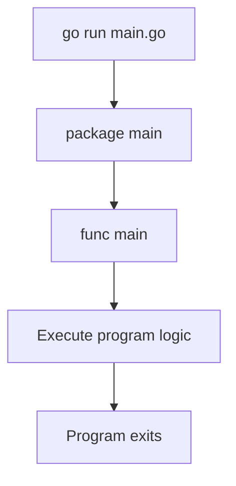
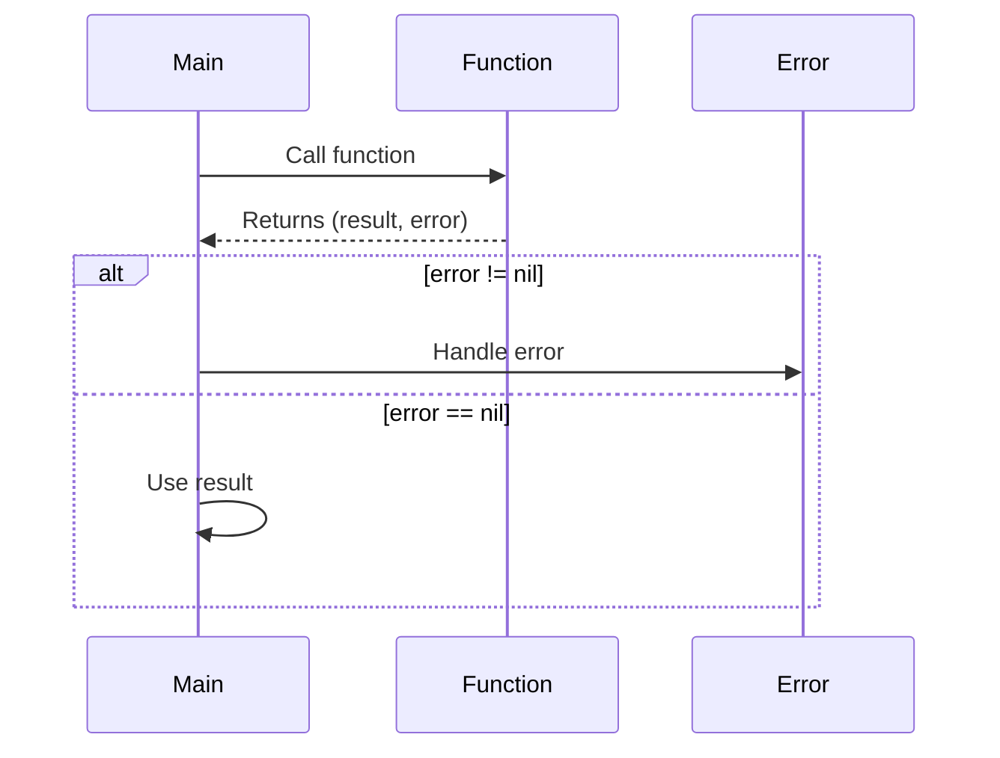
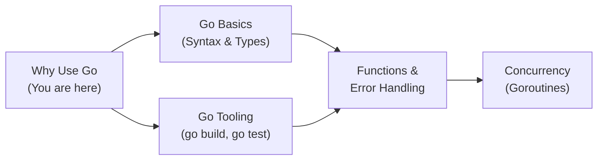
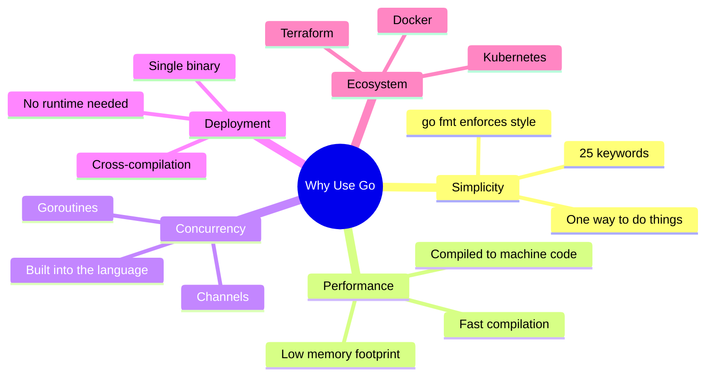
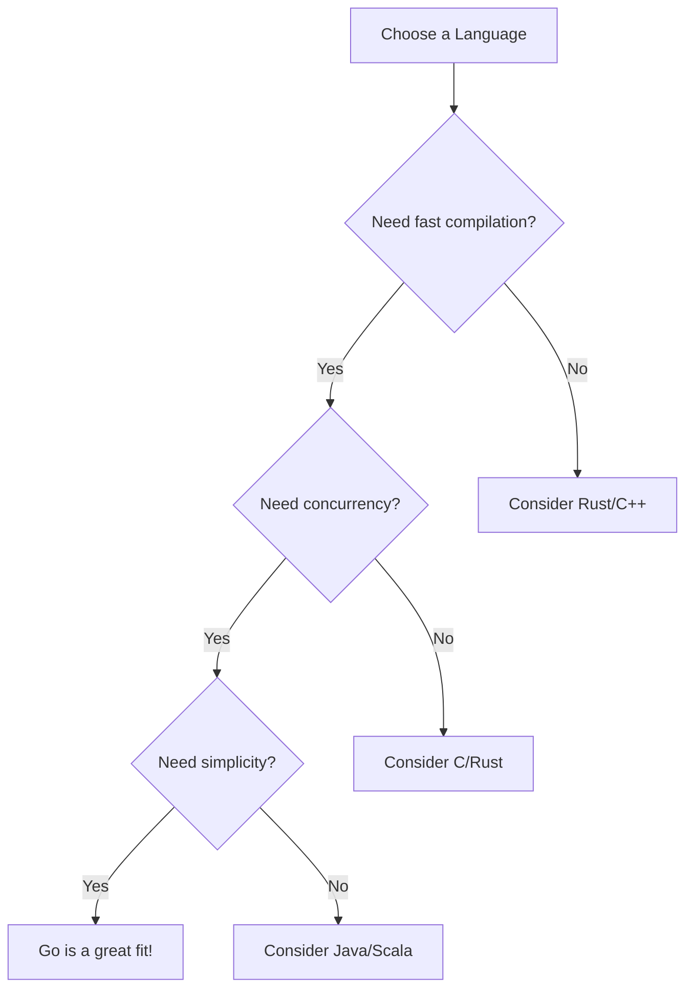

# Why Use Go — Junior Level

## Table of Contents

1. [Introduction](#introduction)
2. [Prerequisites](#prerequisites)
3. [Glossary](#glossary)
4. [Core Concepts](#core-concepts)
5. [Real-World Analogies](#real-world-analogies)
6. [Mental Models](#mental-models)
7. [Pros & Cons](#pros--cons)
8. [Use Cases](#use-cases)
9. [Code Examples](#code-examples)
10. [Coding Patterns](#coding-patterns)
11. [Clean Code](#clean-code)
12. [Product Use / Feature](#product-use--feature)
13. [Error Handling](#error-handling)
14. [Security Considerations](#security-considerations)
15. [Performance Tips](#performance-tips)
16. [Metrics & Analytics](#metrics--analytics)
17. [Best Practices](#best-practices)
18. [Edge Cases & Pitfalls](#edge-cases--pitfalls)
19. [Common Mistakes](#common-mistakes)
20. [Common Misconceptions](#common-misconceptions)
21. [Tricky Points](#tricky-points)
22. [Test](#test)
23. [Tricky Questions](#tricky-questions)
24. [Cheat Sheet](#cheat-sheet)
25. [Self-Assessment Checklist](#self-assessment-checklist)
26. [Summary](#summary)
27. [What You Can Build](#what-you-can-build)
28. [Further Reading](#further-reading)
29. [Related Topics](#related-topics)
30. [Diagrams & Visual Aids](#diagrams--visual-aids)

---

## Introduction

> Focus: "What is it?" and "How to use it?"

Go (also known as Golang) is an open-source programming language created at Google in 2009 by Robert Griesemer, Rob Pike, and Ken Thompson. It was designed to solve real-world problems that developers face when building large-scale software: slow compilation, complex dependency management, and difficulty writing concurrent programs.

As a beginner, understanding **why** Go exists and what makes it different from other languages will help you appreciate its design choices and know when Go is the right tool for the job. Go is intentionally simple — it has only 25 keywords, compiles to a single binary, and has built-in support for concurrent programming through goroutines and channels.

---

## Prerequisites

- **Required:** Basic programming knowledge (variables, loops, functions) — Go builds on familiar concepts but has its own syntax
- **Required:** Command-line basics (navigating directories, running commands) — Go programs are typically compiled and run from the terminal
- **Helpful but not required:** Experience with any compiled language (C, Java, Rust) — helps appreciate Go's fast compilation speed

---

## Glossary

| Term | Definition |
|------|-----------|
| **Go (Golang)** | An open-source, statically typed, compiled programming language designed at Google |
| **Goroutine** | A lightweight thread managed by the Go runtime, used for concurrent execution |
| **Channel** | A typed conduit through which goroutines communicate with each other |
| **Static Typing** | Types are checked at compile time, catching errors before the program runs |
| **Compiled Language** | Code is translated to machine code before execution, resulting in fast binaries |
| **Garbage Collection (GC)** | Automatic memory management that frees unused memory without manual intervention |
| **Single Binary** | Go compiles to one executable file with no external dependencies |
| **Standard Library** | The built-in collection of packages that come with Go (net/http, fmt, os, etc.) |

---

## Core Concepts

### Concept 1: Simplicity by Design

Go was created to be simple. Unlike languages that add features over time (C++, Java), Go deliberately removed features like inheritance, generics (added later in Go 1.18 in a minimal form), and operator overloading. The result is a language where there is usually **one obvious way** to do things, making code easier to read and maintain.

### Concept 2: Built-in Concurrency

Go was designed for the modern era of multi-core processors. Instead of using OS threads (which are expensive), Go provides **goroutines** — lightweight concurrent functions that cost only a few kilobytes of memory. You can run thousands of goroutines on a single machine with minimal overhead.

### Concept 3: Fast Compilation

One of Go's original design goals was to compile large codebases quickly. Google engineers were frustrated by C++ builds that took minutes or even hours. Go compiles entire projects in seconds, even for millions of lines of code. This enables a fast development cycle.

### Concept 4: Single Binary Deployment

Go compiles your entire program — including all dependencies — into a single executable binary. There is no need to install a runtime (like Java's JVM or Python's interpreter) on the target machine. Just copy the binary and run it.

### Concept 5: Strong Standard Library

Go ships with a powerful standard library that covers HTTP servers, JSON handling, cryptography, testing, and more. For many tasks, you do not need any third-party packages.

---

## Real-World Analogies

| Concept | Analogy |
|---------|--------|
| **Go's simplicity** | Like LEGO bricks — few shapes, but you can build anything. Other languages are like clay — more flexible but harder to maintain consistency |
| **Goroutines** | Like hiring many inexpensive assistants who can work simultaneously, instead of a few expensive experts who work one at a time |
| **Single binary** | Like a self-contained lunchbox — everything you need is inside, no need to find a plate, fork, or napkin separately |
| **Static typing** | Like airport security — catches mistakes (wrong types) before your code "takes off" into production |
| **Garbage collection** | Like a building janitor who cleans up unused memory automatically, so you do not have to remember to free it yourself |

---

## Mental Models

**The intuition:** Think of Go as a toolbox designed by experienced engineers who stripped out every unnecessary tool. Instead of 50 screwdriver variations, you get one Phillips and one flathead. This feels limiting at first, but means everyone on the team uses the same tools the same way.

**Why this model helps:** When you wonder "why doesn't Go have feature X?", the answer is often "because simpler alternatives exist." This prevents you from fighting the language and instead embracing its conventions (like using composition over inheritance).

---

## Pros & Cons

| Pros | Cons |
|------|------|
| Fast compilation — seconds, not minutes | Limited expressiveness — no operator overloading, no macros |
| Built-in concurrency with goroutines | Verbose error handling — `if err != nil` repeated frequently |
| Single binary deployment — easy ops | No traditional OOP — no classes, no inheritance |
| Strong standard library | Smaller ecosystem than Python or JavaScript |
| Excellent tooling (fmt, vet, test) | Generics arrived late (Go 1.18) and are still basic |

### When to use:
- Building web servers, APIs, microservices
- Writing CLI tools and DevOps utilities
- Systems programming (networking, file processing)
- Projects where fast compilation and easy deployment matter

### When NOT to use:
- Machine learning / data science (Python has better ecosystem)
- Mobile app development (Swift/Kotlin are better suited)
- GUI desktop applications (Go lacks mature GUI frameworks)
- Rapid prototyping where dynamic typing helps (use Python)

---

## Use Cases

- **Use Case 1:** Building REST APIs and web servers — Go's `net/http` package makes it easy to create production-ready HTTP servers without frameworks
- **Use Case 2:** Command-line tools — Go compiles to a single binary, perfect for distributing CLI tools (e.g., Docker CLI, kubectl)
- **Use Case 3:** Cloud-native infrastructure — Kubernetes, Docker, Terraform are all written in Go
- **Use Case 4:** Microservices — Go's small memory footprint and fast startup time make it ideal for containerized microservices

---

## Code Examples

### Example 1: Hello World — Your First Go Program

```go
package main

import "fmt"

func main() {
    // Print a greeting to the console
    fmt.Println("Hello, Go!")
    fmt.Println("Go was created at Google in 2009")
    fmt.Println("It compiles to a single binary!")
}
```

**What it does:** Prints three lines to the console, demonstrating Go's simple syntax. Every Go program starts with `package main` and a `func main()` entry point.
**How to run:** `go run main.go`

### Example 2: Simple HTTP Server — Why Go Shines

```go
package main

import (
    "fmt"
    "net/http"
)

func handler(w http.ResponseWriter, r *http.Request) {
    // Write a response to the HTTP client
    fmt.Fprintf(w, "Hello from Go! You requested: %s", r.URL.Path)
}

func main() {
    // Register the handler function for the root path
    http.HandleFunc("/", handler)

    fmt.Println("Server starting on :8080...")
    // Start the HTTP server — no framework needed!
    if err := http.ListenAndServe(":8080", nil); err != nil {
        fmt.Println("Error:", err)
    }
}
```

**What it does:** Creates a working HTTP server in ~15 lines using only the standard library. This demonstrates one of Go's biggest strengths — you can build production-ready servers without any third-party dependencies.
**How to run:** `go run main.go` then visit `http://localhost:8080` in your browser.

### Example 3: Concurrency with Goroutines — Go's Superpower

```go
package main

import (
    "fmt"
    "sync"
    "time"
)

func fetchData(source string, wg *sync.WaitGroup) {
    defer wg.Done() // Signal that this goroutine is done

    // Simulate a network request
    time.Sleep(1 * time.Second)
    fmt.Printf("Fetched data from %s\n", source)
}

func main() {
    start := time.Now()

    var wg sync.WaitGroup
    sources := []string{"Database", "Cache", "API", "FileSystem"}

    for _, source := range sources {
        wg.Add(1)
        go fetchData(source, &wg) // Launch goroutine — the "go" keyword!
    }

    wg.Wait() // Wait for all goroutines to finish
    fmt.Printf("All done in %v\n", time.Since(start))
    // Takes ~1 second total, not 4 seconds!
}
```

**What it does:** Fetches data from 4 sources concurrently. Instead of waiting 4 seconds (1 second each sequentially), all 4 goroutines run in parallel and finish in about 1 second total.
**How to run:** `go run main.go`

---

## Coding Patterns

### Pattern 1: The Main Package Pattern

**Intent:** Every Go executable starts with `package main` and `func main()` — this is the entry point of your program.
**When to use:** Every time you write a runnable Go program.

```go
package main

import "fmt"

func main() {
    // Your program logic starts here
    result := add(3, 5)
    fmt.Println("3 + 5 =", result)
}

func add(a, b int) int {
    return a + b
}
```

**Diagram:**



**Remember:** If your file has `package main` and `func main()`, it can be compiled into an executable.

---

### Pattern 2: Error Checking Pattern

**Intent:** Go does not have exceptions. Instead, functions return errors as values, and you must check them immediately.
**When to use:** Every time you call a function that can fail.

```go
package main

import (
    "fmt"
    "os"
)

func main() {
    // Open a file — this can fail
    file, err := os.Open("config.txt")
    if err != nil {
        // Handle the error — do not ignore it!
        fmt.Println("Could not open file:", err)
        return
    }
    defer file.Close()

    fmt.Println("File opened successfully:", file.Name())
}
```

**Diagram:**



**Remember:** In Go, always check `err != nil` immediately after calling a function that returns an error. Never ignore errors.

---

## Clean Code

### Naming

```go
// Bad naming
func p(s string) { fmt.Println(s) }
var d = fetchData()

// Clean naming
func printMessage(message string) { fmt.Println(message) }
var userData = fetchData()
```

**Rules:**
- Variables: describe WHAT they hold (`userCount`, not `n`, `x`, `tmp`)
- Functions: describe WHAT they do (`calculateTotal`, not `calc`, `doStuff`)
- Booleans: use `is`, `has`, `can` prefix (`isValid`, `hasPermission`)

---

### Functions

```go
// Too long, does too many things
func process(data []byte) error {
    // 80+ lines doing parse, validate, save, notify...
    return nil
}

// Single responsibility
func parseInput(data []byte) (Input, error)  { return Input{}, nil }
func validateInput(in Input) error           { return nil }
func saveInput(in Input) error               { return nil }
```

**Rule:** If you need to scroll to see a function — it does too much. Aim for **<= 20 lines**.

---

### Comments

```go
// Noise comment (states the obvious)
// increment i by 1
i++

// Outdated comment (lies)
// returns user by email (actually returns by ID now)
func getUser(id int) User { return User{} }

// Explains WHY, not WHAT
// Retry up to 3 times — downstream service has transient failures
for attempt := 0; attempt < 3; attempt++ { }
```

**Rule:** Good code explains itself. Comments explain **why**, not **what**.

---

## Product Use / Feature

### 1. Docker

- **How it uses Go:** Docker, the containerization platform, is written entirely in Go. It leverages Go's strong networking library and single-binary deployment for distributing the Docker daemon and CLI.
- **Why it matters:** Docker proved that Go is suitable for building complex infrastructure tools used by millions of developers.

### 2. Kubernetes

- **How it uses Go:** Kubernetes, the container orchestration system, is built in Go. Go's concurrency model is essential for managing thousands of containers across clusters.
- **Why it matters:** The entire cloud-native ecosystem (Prometheus, Istio, Helm) chose Go because Kubernetes set the standard.

### 3. Hugo

- **How it uses Go:** Hugo is a static site generator written in Go. It uses Go's fast compilation speed and concurrency to generate websites with thousands of pages in milliseconds.
- **Why it matters:** Demonstrates Go's speed advantage — Hugo is one of the fastest static site generators available.

---

## Error Handling

### Error 1: Ignoring errors

```go
package main

import (
    "fmt"
    "os"
)

func main() {
    // BAD: Ignoring the error
    file, _ := os.Open("nonexistent.txt")
    fmt.Println(file) // This will be nil — could cause a panic!
}
```

**Why it happens:** Beginners use `_` to ignore errors because it seems convenient.
**How to fix:**

```go
package main

import (
    "fmt"
    "os"
)

func main() {
    // GOOD: Always check errors
    file, err := os.Open("nonexistent.txt")
    if err != nil {
        fmt.Println("Error opening file:", err)
        return
    }
    defer file.Close()
    fmt.Println("File:", file.Name())
}
```

### Error 2: Using panic instead of error returns

```go
package main

import "fmt"

func divide(a, b float64) float64 {
    if b == 0 {
        panic("division by zero") // BAD: panic should not be used for expected errors
    }
    return a / b
}

func main() {
    result := divide(10, 0)
    fmt.Println(result)
}
```

**Why it happens:** Developers from other languages (Python, Java) are used to exceptions.
**How to fix:**

```go
package main

import (
    "errors"
    "fmt"
)

func divide(a, b float64) (float64, error) {
    if b == 0 {
        return 0, errors.New("division by zero")
    }
    return a / b, nil
}

func main() {
    result, err := divide(10, 0)
    if err != nil {
        fmt.Println("Error:", err)
        return
    }
    fmt.Println("Result:", result)
}
```

### Error Handling Pattern

```go
// Recommended Go error handling idiom: check errors immediately
result, err := someFunction()
if err != nil {
    // handle error appropriately
    fmt.Printf("error: %v\n", err)
    return
}
// use result safely here
_ = result
```

---

## Security Considerations

### 1. Never hardcode secrets

```go
package main

import "fmt"

func main() {
    // Insecure — secrets in source code
    apiKey := "sk-1234567890abcdef"
    fmt.Println("Using key:", apiKey)
}
```

```go
package main

import (
    "fmt"
    "os"
)

func main() {
    // Secure — read from environment variable
    apiKey := os.Getenv("API_KEY")
    if apiKey == "" {
        fmt.Println("API_KEY not set")
        return
    }
    fmt.Println("API key loaded from environment")
}
```

**Risk:** Hardcoded credentials can be leaked through version control (Git).
**Mitigation:** Always use environment variables or secret management tools.

### 2. Validate user input

```go
package main

import (
    "fmt"
    "strconv"
)

func main() {
    userInput := "not-a-number"

    // Always validate input before using it
    value, err := strconv.Atoi(userInput)
    if err != nil {
        fmt.Println("Invalid input:", err)
        return
    }
    fmt.Println("Parsed value:", value)
}
```

**Risk:** Unvalidated input can lead to crashes, injection attacks, or unexpected behavior.
**Mitigation:** Always validate and sanitize input at the boundary of your program.

---

## Performance Tips

### Tip 1: Pre-allocate slices when you know the size

```go
package main

import "fmt"

func main() {
    n := 1000

    // Slow — grows the slice, causing multiple allocations
    slow := []int{}
    for i := 0; i < n; i++ {
        slow = append(slow, i)
    }

    // Faster — pre-allocate with known capacity
    fast := make([]int, 0, n)
    for i := 0; i < n; i++ {
        fast = append(fast, i)
    }

    fmt.Println("Both have", len(slow), "elements")
    fmt.Println("Both have", len(fast), "elements")
}
```

**Why it's faster:** Pre-allocating avoids repeated memory allocations and copying as the slice grows.

### Tip 2: Use strings.Builder for string concatenation

```go
package main

import (
    "fmt"
    "strings"
)

func main() {
    // Slow — creates a new string on every iteration
    slow := ""
    for i := 0; i < 100; i++ {
        slow += "hello "
    }

    // Fast — uses a buffer, avoids allocations
    var builder strings.Builder
    for i := 0; i < 100; i++ {
        builder.WriteString("hello ")
    }
    fast := builder.String()

    fmt.Println("Slow length:", len(slow))
    fmt.Println("Fast length:", len(fast))
}
```

**Why it's faster:** Strings in Go are immutable. Concatenation with `+` creates a new string each time. `strings.Builder` writes to a buffer and only creates one final string.

---

## Metrics & Analytics

### What to Measure

| Metric | Why it matters | Tool |
|--------|---------------|------|
| **Build time** | Go's fast compilation is a key advantage — track it | `time go build ./...` |
| **Binary size** | Single binary deployment — monitor size | `ls -lh ./binary` |
| **Goroutine count** | Too many goroutines can indicate a leak | `runtime.NumGoroutine()` |

### Basic Instrumentation

```go
package main

import (
    "expvar"
    "fmt"
    "net/http"
)

var (
    requestCount = expvar.NewInt("requests.total")
    errorCount   = expvar.NewInt("requests.errors")
)

func handler(w http.ResponseWriter, r *http.Request) {
    requestCount.Add(1)
    fmt.Fprintf(w, "Request count: %d", requestCount.Value())
}

func main() {
    http.HandleFunc("/", handler)
    // expvar automatically registers /debug/vars
    fmt.Println("Server on :8080, metrics at /debug/vars")
    if err := http.ListenAndServe(":8080", nil); err != nil {
        fmt.Println("Error:", err)
    }
}
```

---

## Best Practices

- **Do this:** Always run `go fmt` before committing code — Go has a single official formatting style
- **Do this:** Use `go vet` to catch suspicious code — it finds bugs that compile but are likely wrong
- **Do this:** Keep your `go.mod` file updated with `go mod tidy` — removes unused dependencies
- **Do this:** Write tests from the start using Go's built-in `testing` package — no external test framework needed
- **Do this:** Use `defer` for cleanup (closing files, connections) — ensures cleanup happens even if the function returns early

---

## Edge Cases & Pitfalls

### Pitfall 1: Nil pointer dereference

```go
package main

import "fmt"

type User struct {
    Name string
}

func findUser(name string) *User {
    if name == "admin" {
        return &User{Name: "Admin"}
    }
    return nil // No user found
}

func main() {
    user := findUser("guest")
    // This will PANIC — user is nil!
    // fmt.Println(user.Name)

    // Always check for nil first
    if user != nil {
        fmt.Println(user.Name)
    } else {
        fmt.Println("User not found")
    }
}
```

**What happens:** Accessing a field on a nil pointer causes a runtime panic.
**How to fix:** Always check if a pointer is nil before using it.

### Pitfall 2: Unused imports cause compilation errors

```go
package main

import (
    "fmt"
    // "os" // Uncommenting this without using os will fail to compile
)

func main() {
    fmt.Println("Go does not allow unused imports")
}
```

**What happens:** Go refuses to compile if you import a package but do not use it.
**How to fix:** Remove unused imports, or use `_` as a blank identifier if you need the side effect: `import _ "net/http/pprof"`.

---

## Common Mistakes

### Mistake 1: Using := outside of functions

```go
package main

import "fmt"

// Wrong — := can only be used inside functions
// name := "Go"  // This will not compile

// Correct — use var at package level
var name = "Go"

func main() {
    // := works inside functions
    greeting := "Hello, " + name
    fmt.Println(greeting)
}
```

### Mistake 2: Forgetting to handle the error return value

```go
package main

import (
    "fmt"
    "strconv"
)

func main() {
    // Wrong — ignoring the error
    // num, _ := strconv.Atoi("abc")
    // fmt.Println(num) // prints 0, but silently hides the error

    // Correct — handle the error
    num, err := strconv.Atoi("abc")
    if err != nil {
        fmt.Println("Conversion failed:", err)
        return
    }
    fmt.Println("Converted:", num)
}
```

### Mistake 3: Modifying a slice while iterating

```go
package main

import "fmt"

func main() {
    // Be careful: range uses a copy of the value
    nums := []int{1, 2, 3, 4, 5}

    // Wrong — modifying the loop variable does not change the slice
    for _, v := range nums {
        v *= 2 // This does nothing to the original slice
        _ = v
    }
    fmt.Println("After wrong attempt:", nums) // Still [1 2 3 4 5]

    // Correct — use the index to modify
    for i := range nums {
        nums[i] *= 2
    }
    fmt.Println("After correct modification:", nums) // [2 4 6 8 10]
}
```

---

## Common Misconceptions

### Misconception 1: "Go is only for backend/server programming"

**Reality:** While Go excels at servers and infrastructure, it is also used for CLI tools (kubectl, gh), DevOps (Terraform, Packer), data processing pipelines, embedded systems, and even game development.

**Why people think this:** Go became famous through Docker and Kubernetes, which are both backend infrastructure tools.

### Misconception 2: "Go is too simple for serious projects"

**Reality:** Go's simplicity is its strength, not a weakness. Companies like Google, Uber, Twitch, and Cloudflare use Go for their most critical systems handling millions of requests per second.

**Why people think this:** Go lacks features like generics (now partially available), inheritance, and pattern matching that other languages have. But fewer features means fewer ways to write confusing code.

### Misconception 3: "Go does not support object-oriented programming"

**Reality:** Go supports OOP through structs and methods, and interface-based polymorphism. It simply does not use class-based inheritance. Go favors composition over inheritance.

**Why people think this:** Go does not have the `class` keyword, so developers from Java or Python assume OOP is not possible.

---

## Tricky Points

### Tricky Point 1: Exported vs unexported names

```go
package main

import "fmt"

type user struct {   // lowercase = unexported (private to package)
    name string      // lowercase = unexported
    Age  int         // uppercase = exported (visible outside package)
}

func main() {
    u := user{name: "Alice", Age: 30}
    fmt.Println(u.name, u.Age)
    // Within the same package, both work fine
    // But from another package, only u.Age would be accessible
}
```

**Why it's tricky:** Unlike other languages that use `public`/`private` keywords, Go uses capitalization to determine visibility.
**Key takeaway:** Uppercase first letter = exported (public). Lowercase = unexported (private to the package).

### Tricky Point 2: Zero values

```go
package main

import "fmt"

func main() {
    var i int       // zero value: 0
    var f float64   // zero value: 0.0
    var b bool      // zero value: false
    var s string    // zero value: "" (empty string)
    var p *int      // zero value: nil

    fmt.Println(i, f, b, s, p)
    // Output: 0 0 false  <nil>
}
```

**Why it's tricky:** In Go, variables are always initialized — there are no "uninitialized" variables. Each type has a well-defined zero value. This is different from languages like C where uninitialized variables contain garbage data.
**Key takeaway:** Every Go type has a zero value. Know them: `0` for numbers, `false` for bools, `""` for strings, `nil` for pointers/slices/maps.

---

## Test

### Multiple Choice

**1. Who created Go and when?**

- A) Guido van Rossum in 2005
- B) Robert Griesemer, Rob Pike, and Ken Thompson in 2009
- C) Linus Torvalds in 2012
- D) Brendan Eich in 2009

<details>
<summary>Answer</summary>
**B)** — Go was created at Google by Robert Griesemer, Rob Pike, and Ken Thompson. It was publicly announced in November 2009.
</details>

### True or False

**2. Go requires a virtual machine (like Java's JVM) to run programs.**

<details>
<summary>Answer</summary>
**False** — Go compiles directly to machine code and produces a single static binary. No virtual machine or runtime environment is needed on the target machine.
</details>

**3. Go has built-in support for concurrent programming through goroutines.**

<details>
<summary>Answer</summary>
**True** — Goroutines are one of Go's core features. They are lightweight concurrent functions launched with the `go` keyword.
</details>

### What's the Output?

**4. What does this code print?**

```go
package main

import "fmt"

func main() {
    var x int
    var y string
    var z bool
    fmt.Println(x, y, z)
}
```

<details>
<summary>Answer</summary>
Output: `0  false`

Explanation: Go initializes all variables to their zero values. `int` defaults to `0`, `string` defaults to `""` (empty string — note the space between 0 and false in the output), and `bool` defaults to `false`.
</details>

**5. What does this code print?**

```go
package main

import "fmt"

func greet() string {
    return "Hello"
}

func main() {
    message := greet()
    fmt.Println(message + ", Go!")
}
```

<details>
<summary>Answer</summary>
Output: `Hello, Go!`

Explanation: The function `greet()` returns the string `"Hello"`, which is concatenated with `", Go!"` using the `+` operator.
</details>

### Multiple Choice

**6. Which of the following is NOT a reason to use Go?**

- A) Fast compilation speed
- B) Built-in concurrency support
- C) Rich GUI framework library
- D) Single binary deployment

<details>
<summary>Answer</summary>
**C)** — Go does not have a rich built-in GUI framework. It excels at backend services, CLI tools, and infrastructure. For GUI applications, other languages like Swift, C#, or JavaScript (Electron) are more appropriate.
</details>

**7. What happens if you import a package but do not use it?**

- A) The compiler ignores it
- B) A warning is printed
- C) The program will not compile
- D) The program compiles but runs slowly

<details>
<summary>Answer</summary>
**C)** — Go treats unused imports as a compilation error. This enforces clean code — you never have dead imports cluttering your codebase.
</details>

---

## "What If?" Scenarios

**What if you try to run a Go program without `package main`?**
- **You might think:** It will still run since it has a `main()` function
- **But actually:** Go requires `package main` for executable programs. Without it, the code is treated as a library package and cannot be run directly.

**What if you declare a variable but never use it?**
- **You might think:** It is fine, the compiler will just ignore it
- **But actually:** Go will refuse to compile your program. Unused variables are compilation errors in Go. This prevents dead code from accumulating.

---

## Tricky Questions

**1. Can a Go program have more than one `main()` function?**

- A) Yes, Go allows multiple main functions in different files within the same package
- B) No, there can only be one main function per program
- C) Yes, but only in different packages
- D) No, it causes a runtime error

<details>
<summary>Answer</summary>
**B)** — A Go program can only have one `func main()` in `package main`. If you have multiple files in `package main`, only one of them can define `main()`. However, you can have separate programs in separate directories each with their own `package main` and `func main()`.
</details>

**2. Go is an interpreted language — True or False?**

- A) True — Go uses an interpreter like Python
- B) True — Go runs on a virtual machine like Java
- C) False — Go is compiled but uses garbage collection
- D) False — Go is compiled and does not use garbage collection

<details>
<summary>Answer</summary>
**C)** — Go is a compiled language (source code is translated to machine code) but it does use garbage collection for automatic memory management. Options A and B are wrong because Go compiles to native code. Option D is wrong because Go does have a garbage collector.
</details>

**3. What makes goroutines different from OS threads?**

- A) Goroutines are exactly the same as OS threads
- B) Goroutines are managed by the Go runtime, use less memory, and are multiplexed onto OS threads
- C) Goroutines can only run on a single CPU core
- D) Goroutines replace threads and cannot run in parallel

<details>
<summary>Answer</summary>
**B)** — Goroutines are managed by the Go runtime scheduler (not the OS). They start with only a few KB of stack (vs ~1MB for OS threads) and the Go scheduler multiplexes many goroutines onto a smaller number of OS threads. This makes it practical to run thousands or even millions of goroutines.
</details>

---

## Cheat Sheet

| What | Syntax / Command | Example |
|------|-----------------|---------|
| Run a Go file | `go run <file>` | `go run main.go` |
| Build a binary | `go build -o <name>` | `go build -o myapp` |
| Format code | `go fmt <file>` | `go fmt main.go` |
| Check for issues | `go vet ./...` | `go vet ./...` |
| Run tests | `go test ./...` | `go test ./...` |
| Initialize module | `go mod init <name>` | `go mod init myproject` |
| Add dependencies | `go mod tidy` | `go mod tidy` |
| Print to console | `fmt.Println()` | `fmt.Println("hello")` |
| Declare variable | `var x T` or `x := val` | `name := "Go"` |
| Launch goroutine | `go funcName()` | `go fetchData()` |

---

## Self-Assessment Checklist

### I can explain:
- [ ] What Go is and why it was created
- [ ] When to use Go and when NOT to use it
- [ ] What goroutines are and why they are useful
- [ ] What a single binary means and why it matters for deployment
- [ ] How Go handles errors differently from other languages

### I can do:
- [ ] Write a basic Go program with `package main` and `func main()`
- [ ] Create a simple HTTP server using the standard library
- [ ] Handle errors properly using `if err != nil`
- [ ] Run and build Go programs from the command line

### I can answer:
- [ ] All multiple choice questions in this document
- [ ] "What's the output?" questions correctly

---

## Summary

- Go was created at Google to solve real engineering problems: slow compilation, complex dependency management, and difficulty writing concurrent programs
- Go's main strengths are simplicity, fast compilation, built-in concurrency (goroutines), and single-binary deployment
- Go's standard library is powerful enough for most tasks — you can build HTTP servers, CLI tools, and more without third-party packages
- Error handling in Go uses return values, not exceptions — always check `err != nil`
- Go enforces clean code by design: unused imports and variables are compilation errors, and `go fmt` ensures consistent formatting

**Next step:** Learn Go syntax basics — variables, types, control flow, functions.

---

## What You Can Build

### Projects you can create:
- **Hello World CLI tool:** A command-line application that accepts arguments and prints output
- **Simple HTTP API:** A REST API server using only the standard library
- **File processor:** A tool that reads, transforms, and writes files
- **URL shortener:** A simple web service that creates and redirects short URLs

### Learning path — what to study next:



---

## Further Reading

- **Official docs:** [Go Documentation](https://go.dev/doc/)
- **Interactive tutorial:** [A Tour of Go](https://go.dev/tour/) — learn Go basics interactively in your browser
- **Blog post:** [Go at Google: Language Design in the Service of Software Engineering](https://go.dev/talks/2012/splash.article) — Rob Pike explains why Go was created
- **Video:** [Go Proverbs](https://www.youtube.com/watch?v=PAAkCSZUG1c) — Rob Pike, ~20 min, core philosophy of Go

---

## Related Topics

- **Go Basics** — variables, types, control flow, functions
- **Go Tooling** — go build, go test, go fmt, go vet
- **Concurrency** — deep dive into goroutines and channels

---

## Diagrams & Visual Aids

### Mind Map



### Go vs Other Languages — Feature Comparison



### Go Compilation Process

```
+------------------+     +------------------+     +------------------+
|   Source Code     |     |    Compiler      |     |  Single Binary   |
|   (.go files)     | --> |    (go build)    | --> |  (executable)    |
|                  |     |                  |     |                  |
|  package main    |     |  Lexer/Parser    |     |  No dependencies |
|  func main()     |     |  Type checking   |     |  Ready to deploy |
|  import "fmt"    |     |  Code generation |     |  Any OS/Arch     |
+------------------+     +------------------+     +------------------+
```
