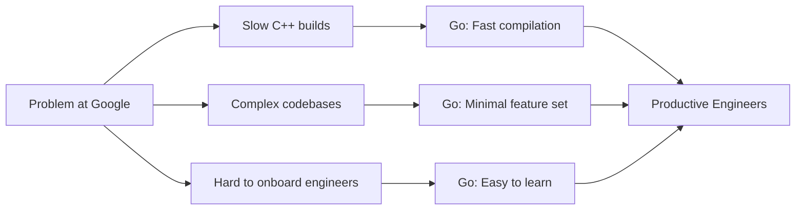
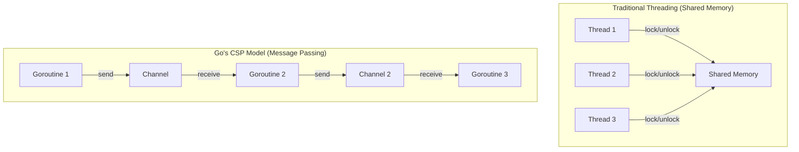
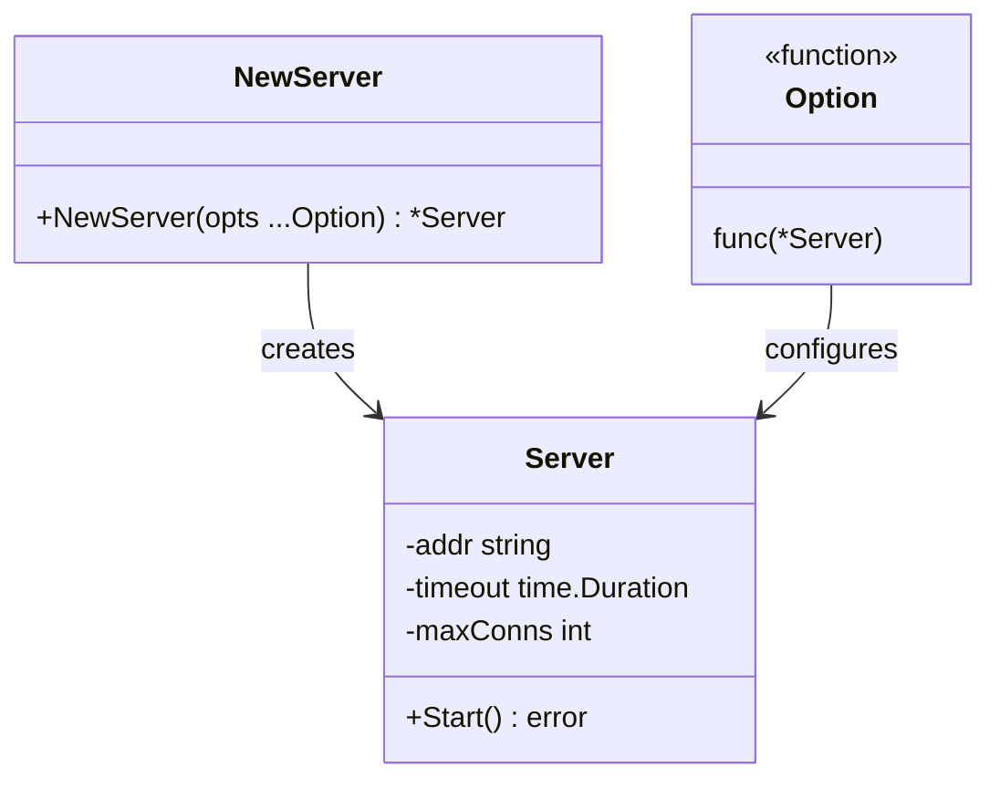
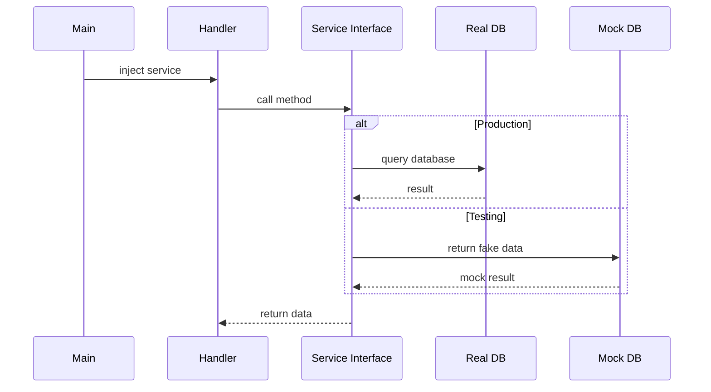
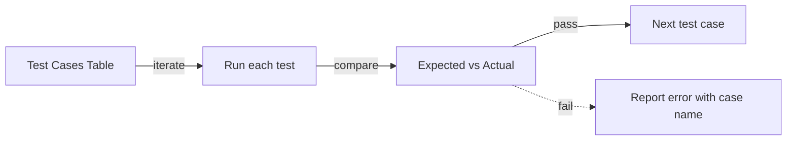
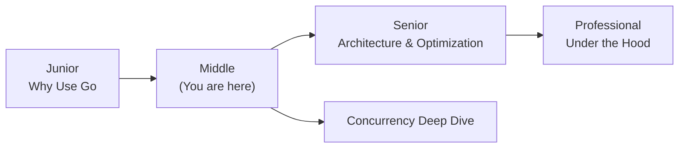
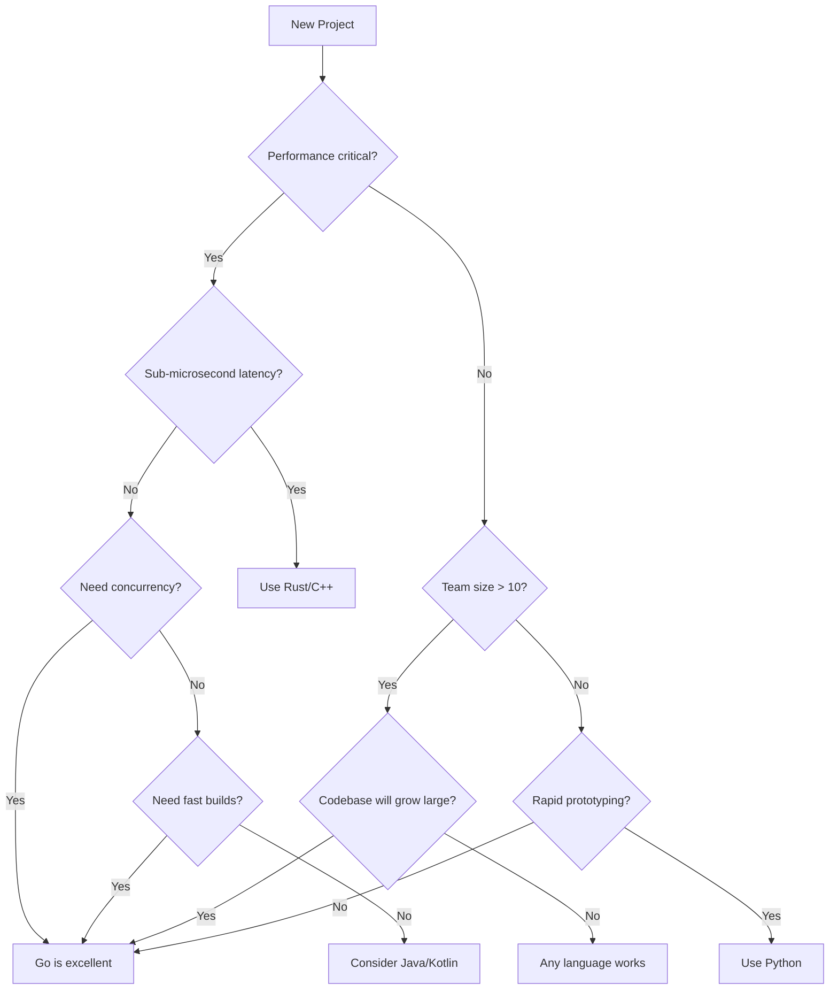
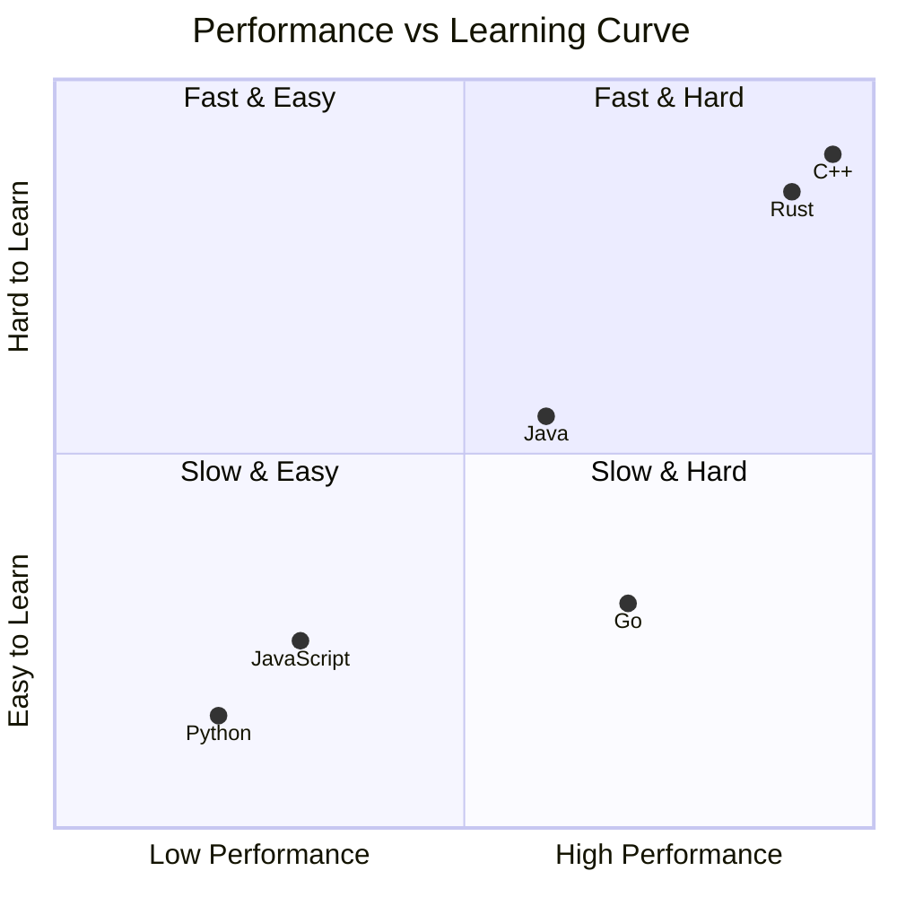

# Why Use Go — Middle Level

## Table of Contents

1. [Introduction](#introduction)
2. [Core Concepts](#core-concepts)
3. [Evolution & Historical Context](#evolution--historical-context)
4. [Pros & Cons](#pros--cons)
5. [Alternative Approaches](#alternative-approaches-plan-b)
6. [Use Cases](#use-cases)
7. [Code Examples](#code-examples)
8. [Coding Patterns](#coding-patterns)
9. [Clean Code](#clean-code)
10. [Product Use / Feature](#product-use--feature)
11. [Error Handling](#error-handling)
12. [Security Considerations](#security-considerations)
13. [Performance Optimization](#performance-optimization)
14. [Metrics & Analytics](#metrics--analytics)
15. [Debugging Guide](#debugging-guide)
16. [Best Practices](#best-practices)
17. [Edge Cases & Pitfalls](#edge-cases--pitfalls)
18. [Common Mistakes](#common-mistakes)
19. [Common Misconceptions](#common-misconceptions)
20. [Anti-Patterns](#anti-patterns)
21. [Tricky Points](#tricky-points)
22. [Comparison with Other Languages](#comparison-with-other-languages)
23. [Test](#test)
24. [Tricky Questions](#tricky-questions)
25. [Cheat Sheet](#cheat-sheet)
26. [Self-Assessment Checklist](#self-assessment-checklist)
27. [Summary](#summary)
28. [What You Can Build](#what-you-can-build)
29. [Further Reading](#further-reading)
30. [Related Topics](#related-topics)
31. [Diagrams & Visual Aids](#diagrams--visual-aids)

---

## Introduction

> Focus: "Why?" and "When to use?"

Assumes the reader already knows the basics of Go. This level covers:
- **Why** Go was designed the way it was — the philosophy behind the trade-offs
- **When** Go is the right choice versus other languages
- Production considerations: deployment, observability, team scalability
- Deeper understanding of Go's concurrency model and compilation pipeline

At this level, you should be able to make informed decisions about whether Go is the right tool for a given project, defend that decision with technical reasoning, and understand Go's position in the broader programming language landscape.

---

## Core Concepts

### Concept 1: Go's Design Philosophy — Less is More

Go's creators deliberately chose to leave out many features that other modern languages include. This was not laziness — it was a calculated architectural decision rooted in Google's experience managing large codebases with thousands of engineers.



Key design principles:
- **Orthogonality:** Features should not overlap. Go has only one loop construct (`for`), not `for`, `while`, `do-while`, and `forEach`.
- **Readability over writability:** Code is read 10x more than it is written. Go optimizes for the reader.
- **Composition over inheritance:** Go uses interfaces and struct embedding instead of class hierarchies.

### Concept 2: Go's Concurrency Model — CSP (Communicating Sequential Processes)

Go's concurrency is based on Tony Hoare's CSP model from 1978. Instead of sharing memory and using locks, goroutines communicate by sending messages through channels.



- **Goroutines:** ~2KB initial stack (vs ~1MB for OS threads), dynamically growing
- **Channels:** Typed, synchronized communication conduits
- **Select:** Multiplexing multiple channel operations

### Concept 3: Go's Type System — Structural Typing

Go uses structural typing for interfaces — a type implements an interface by having the right methods, not by declaring `implements`. This enables decoupled, testable code.

```go
// No "implements" keyword needed
type Writer interface {
    Write(p []byte) (n int, err error)
}

// os.File, bytes.Buffer, net.Conn all implement Writer
// without knowing about each other
```

---

## Evolution & Historical Context

**Before Go (2000-2009):**
- Google engineers used C++, Java, and Python for most projects
- C++ builds took 45+ minutes for large projects
- Java required complex build systems and verbose boilerplate
- Python was too slow for performance-critical systems
- Concurrency was hard — threads, locks, and mutexes led to deadlocks and race conditions

**How Go changed things (2009-present):**
- Rob Pike, Robert Griesemer, and Ken Thompson started Go while waiting for a 45-minute C++ build to finish
- Go 1.0 (2012): Stability guarantee — Go 1 code still compiles with the latest Go
- Go 1.11 (2018): Go modules — solved the dependency management problem
- Go 1.18 (2022): Generics — addressed the most requested feature
- Go 1.21+ (2023+): Standard library improvements, enhanced tooling

**The stability promise:** Go guarantees backward compatibility. Code written in Go 1.0 still compiles with Go 1.22. This is a conscious trade-off — slower feature adoption for long-term maintainability.

---

## Pros & Cons

| Pros | Cons |
|------|------|
| Fast compilation (seconds for large projects) | Verbose error handling (`if err != nil` everywhere) |
| Simple concurrency model (goroutines + channels) | No sum types / discriminated unions |
| Strong backward compatibility guarantee | Limited metaprogramming (no macros, limited reflection) |
| Excellent tooling (go fmt, go vet, race detector) | Generics are still basic compared to Rust/Haskell |
| Small binary, easy deployment (single binary, static linking) | No functional programming features (no map/filter/reduce on collections) |

### Trade-off analysis:

- **Simplicity vs Expressiveness:** Go sacrifices expressiveness for readability. In a 500-person team, readable code is more valuable than clever code.
- **GC vs Manual Memory:** Go's garbage collector adds ~0.5ms latency spikes. For 99.9% of applications, this is acceptable. For ultra-low-latency systems (HFT trading), Rust or C++ is better.
- **Compilation speed vs Runtime optimization:** Go compiles fast but does fewer optimizations than C++ or Rust. The result is "fast enough" binaries (typically within 2-3x of C) with 100x faster build times.

### Comparison with alternatives:

| Approach | Pros | Cons | Best for |
|----------|------|------|----------|
| Go | Fast builds, simple concurrency, easy deployment | Verbose, limited generics | Microservices, CLI tools, infrastructure |
| Rust | Zero-cost abstractions, no GC, memory safety | Steep learning curve, slow compilation | System programming, performance-critical code |
| Java | Mature ecosystem, enterprise tools, strong typing | Verbose, heavy runtime (JVM) | Enterprise applications, Android |
| Python | Rapid development, huge ecosystem, easy to learn | Slow execution, GIL limits concurrency | Data science, scripting, prototyping |
| Node.js | Fast prototyping, huge npm ecosystem, same language frontend/backend | Single-threaded, callback complexity | Real-time apps, full-stack JS |

---

## Alternative Approaches (Plan B)

| Alternative | How it works | When you might be forced to use it |
|-------------|--------------|-------------------------------------|
| **Rust** | Systems language with ownership model, no GC | When you need guaranteed sub-microsecond latency or memory safety without GC |
| **Java/Kotlin** | JVM-based with mature enterprise ecosystem | When integrating with existing Java systems or Android development |
| **Python** | Dynamic typing, huge ML/data ecosystem | When data science, ML, or rapid prototyping is the priority |
| **C++** | Low-level control, templates, zero-overhead abstractions | When you need maximum performance and are willing to accept complexity |

---

## Use Cases

- **Use Case 1:** Microservice architecture — Go's small binary size (~10MB), fast startup (<100ms), and low memory footprint (~10MB RSS) make it ideal for containerized microservices
- **Use Case 2:** API gateway / reverse proxy — Go's `net/http` and goroutine-per-request model handles tens of thousands of concurrent connections efficiently
- **Use Case 3:** DevOps tooling — Single binary deployment means no dependency management on target machines. Terraform, Packer, Vault, Consul are all Go.
- **Use Case 4:** Real-time data pipelines — Go's concurrency primitives (goroutines, channels, select) naturally model producer-consumer and fan-out/fan-in patterns

---

## Code Examples

### Example 1: Production-Ready HTTP Server with Graceful Shutdown

```go
package main

import (
    "context"
    "fmt"
    "log"
    "net/http"
    "os"
    "os/signal"
    "syscall"
    "time"
)

func healthHandler(w http.ResponseWriter, r *http.Request) {
    w.WriteHeader(http.StatusOK)
    fmt.Fprintln(w, `{"status": "healthy"}`)
}

func main() {
    mux := http.NewServeMux()
    mux.HandleFunc("/health", healthHandler)

    server := &http.Server{
        Addr:         ":8080",
        Handler:      mux,
        ReadTimeout:  5 * time.Second,
        WriteTimeout: 10 * time.Second,
        IdleTimeout:  120 * time.Second,
    }

    // Start server in a goroutine
    go func() {
        log.Printf("Server starting on %s", server.Addr)
        if err := server.ListenAndServe(); err != http.ErrServerClosed {
            log.Fatalf("Server failed: %v", err)
        }
    }()

    // Wait for interrupt signal
    quit := make(chan os.Signal, 1)
    signal.Notify(quit, syscall.SIGINT, syscall.SIGTERM)
    <-quit

    log.Println("Shutting down gracefully...")
    ctx, cancel := context.WithTimeout(context.Background(), 30*time.Second)
    defer cancel()

    if err := server.Shutdown(ctx); err != nil {
        log.Fatalf("Forced shutdown: %v", err)
    }
    log.Println("Server stopped")
}
```

**Why this pattern:** Production servers must handle graceful shutdown to avoid dropping in-flight requests. This pattern uses `context.WithTimeout` to give existing requests time to complete.
**Trade-offs:** Slightly more complex than a basic `ListenAndServe`, but essential for production deployments behind load balancers.

### Example 2: Comparison — Sequential vs Concurrent Data Fetching

```go
package main

import (
    "fmt"
    "sync"
    "time"
)

// Simulates fetching data from a remote service
func fetchFromService(name string) string {
    time.Sleep(500 * time.Millisecond) // Simulate network latency
    return fmt.Sprintf("data from %s", name)
}

// Approach A: Sequential — simple but slow
func fetchSequential() []string {
    services := []string{"users", "orders", "inventory", "analytics"}
    results := make([]string, 0, len(services))
    for _, svc := range services {
        results = append(results, fetchFromService(svc))
    }
    return results
}

// Approach B: Concurrent — faster, uses goroutines
func fetchConcurrent() []string {
    services := []string{"users", "orders", "inventory", "analytics"}
    results := make([]string, len(services))
    var wg sync.WaitGroup

    for i, svc := range services {
        wg.Add(1)
        go func(idx int, name string) {
            defer wg.Done()
            results[idx] = fetchFromService(name)
        }(i, svc)
    }
    wg.Wait()
    return results
}

func main() {
    start := time.Now()
    seq := fetchSequential()
    fmt.Printf("Sequential: %v (%d results)\n", time.Since(start), len(seq))

    start = time.Now()
    con := fetchConcurrent()
    fmt.Printf("Concurrent: %v (%d results)\n", time.Since(start), len(con))
}
```

**When to use which:** Use sequential when order matters and services depend on each other. Use concurrent when fetches are independent — the total time becomes the slowest single fetch, not the sum.

---

## Coding Patterns

### Pattern 1: Functional Options Pattern

**Category:** Idiomatic Go / API Design
**Intent:** Provide a clean, extensible way to configure structs without breaking API compatibility
**When to use:** When a struct has many optional configuration fields
**When NOT to use:** When the struct has fewer than 3 fields — a simple constructor is clearer

**Structure diagram:**



**Implementation:**

```go
package main

import (
    "fmt"
    "time"
)

type Server struct {
    addr     string
    timeout  time.Duration
    maxConns int
}

type Option func(*Server)

func WithAddr(addr string) Option {
    return func(s *Server) { s.addr = addr }
}

func WithTimeout(d time.Duration) Option {
    return func(s *Server) { s.timeout = d }
}

func WithMaxConns(n int) Option {
    return func(s *Server) { s.maxConns = n }
}

func NewServer(opts ...Option) *Server {
    s := &Server{
        addr:     ":8080",
        timeout:  30 * time.Second,
        maxConns: 100,
    }
    for _, opt := range opts {
        opt(s)
    }
    return s
}

func main() {
    s := NewServer(
        WithAddr(":9090"),
        WithTimeout(60*time.Second),
    )
    fmt.Printf("Server: addr=%s, timeout=%v, maxConns=%d\n",
        s.addr, s.timeout, s.maxConns)
}
```

**Trade-offs:**

| Pros | Cons |
|---------|---------|
| API stays backward compatible | More boilerplate than a config struct |
| Self-documenting option names | Harder to see all options at a glance |
| Defaults are clear in constructor | Options functions need testing too |

---

### Pattern 2: Interface-Based Dependency Injection

**Category:** Structural / Testability
**Intent:** Decouple components by depending on interfaces rather than concrete types, enabling easy testing and swapping implementations

**Flow diagram:**



```go
package main

import "fmt"

// Interface — defines what we need, not how it works
type UserStore interface {
    GetUser(id int) (string, error)
}

// Production implementation
type PostgresStore struct{}

func (p *PostgresStore) GetUser(id int) (string, error) {
    return fmt.Sprintf("User-%d from Postgres", id), nil
}

// Test implementation
type MockStore struct{}

func (m *MockStore) GetUser(id int) (string, error) {
    return fmt.Sprintf("MockUser-%d", id), nil
}

// Handler depends on interface, not concrete type
type Handler struct {
    store UserStore
}

func NewHandler(store UserStore) *Handler {
    return &Handler{store: store}
}

func (h *Handler) HandleRequest(id int) {
    user, err := h.store.GetUser(id)
    if err != nil {
        fmt.Println("Error:", err)
        return
    }
    fmt.Println("Found:", user)
}

func main() {
    // Production: use real database
    handler := NewHandler(&PostgresStore{})
    handler.HandleRequest(42)

    // Testing: use mock
    testHandler := NewHandler(&MockStore{})
    testHandler.HandleRequest(42)
}
```

---

### Pattern 3: Table-Driven Tests

**Category:** Idiomatic Go / Testing
**Intent:** Structure tests as data tables for easy extension and clear test coverage



```go
package main

import (
    "fmt"
    "strings"
)

// Function to test
func capitalize(s string) string {
    if s == "" {
        return ""
    }
    return strings.ToUpper(s[:1]) + s[1:]
}

func main() {
    // Table-driven approach
    tests := []struct {
        name  string
        input string
        want  string
    }{
        {"empty string", "", ""},
        {"single char", "a", "A"},
        {"normal word", "hello", "Hello"},
        {"already capitalized", "Hello", "Hello"},
        {"unicode", "uzbeg", "Uzbeg"},
    }

    for _, tc := range tests {
        got := capitalize(tc.input)
        if got != tc.want {
            fmt.Printf("FAIL %s: capitalize(%q) = %q, want %q\n",
                tc.name, tc.input, got, tc.want)
        } else {
            fmt.Printf("PASS %s\n", tc.name)
        }
    }
}
```

---

## Clean Code

### Naming & Readability

```go
// Cryptic
func proc(d []byte, f bool) ([]byte, error) { return nil, nil }

// Self-documenting
func compressData(input []byte, includeHeader bool) ([]byte, error) { return nil, nil }
```

| Element | Rule | Example |
|---------|------|---------|
| Functions | Verb + noun, describes action | `fetchUserByID`, `validateEmail` |
| Variables | Noun, describes content | `activeConnections`, `retryCount` |
| Booleans | `is/has/can` prefix | `isExpired`, `hasPermission` |
| Constants | Descriptive | `MaxRetries`, `DefaultTimeout` |

---

### SOLID in Go

**Single Responsibility:**
```go
// One struct doing everything
type UserService struct { /* handles auth + DB + email + logging */ }

// Each type has one reason to change
type UserRepository interface { FindByID(id int) (User, error) }
type UserNotifier   interface { SendWelcomeEmail(u User) error }
type UserAuthService struct { repo UserRepository }
```

**Open/Closed (via interfaces):**
```go
// Switch on type — breaks on every new type
func process(t string) {
    switch t {
    case "A": fmt.Println("A")
    case "B": fmt.Println("B")
    }
}

// Open for extension via interface
type Processor interface { Process() error }
```

---

### DRY vs WET

```go
// WET (Write Everything Twice)
func validateEmail(s string) bool    { return len(s) > 0 && strings.Contains(s, "@") }
func validateUsername(s string) bool { return len(s) > 0 && strings.Contains(s, "@") } // copy-pasted bug!

// DRY — extract common logic
func containsChar(s string, c string) bool { return len(s) > 0 && strings.Contains(s, c) }
```

---

### Function Design

| Signal | Smell | Fix |
|--------|-------|-----|
| > 20 lines | Does too much | Split into smaller functions |
| > 3 parameters | Complex signature | Use options struct or builder |
| Deep nesting (> 3 levels) | Spaghetti logic | Early returns, extract helpers |
| Boolean parameter | Flags a violation | Split into two functions |

---

## Product Use / Feature

### 1. Uber

- **How it uses Go:** Uber migrated many of its core services from Node.js and Python to Go for better performance and type safety. Their highest QPS services are written in Go.
- **Scale:** Millions of rides per day, handling peak traffic of 40+ million trips per quarter
- **Key insight:** Go's goroutine model let them handle thousands of concurrent connections per service instance with minimal memory

### 2. Cloudflare

- **How it uses Go:** Cloudflare's edge computing platform, DNS resolver (1.1.1.1), and many internal tools are written in Go. They handle a significant percentage of global internet traffic.
- **Why this approach:** Go's fast startup time and low memory usage are critical when running code at edge locations worldwide

### 3. Twitch

- **How it uses Go:** Twitch uses Go for many backend services including chat, video transcoding coordination, and internal tooling
- **Scale:** Millions of concurrent viewers, billions of chat messages per day
- **Key insight:** Go's built-in concurrency handles the massive fan-out pattern of broadcasting chat messages to millions of viewers

### 4. CrowdStrike

- **How it uses Go:** The Falcon sensor for Linux is written in Go. Go's single binary deployment simplified distribution to millions of endpoints.
- **Why this approach:** No runtime dependencies means the agent can be deployed on any Linux system without conflicts

---

## Error Handling

### Pattern 1: Error wrapping with context

```go
package main

import (
    "fmt"
    "errors"
)

func fetchFromDB(id int) (string, error) {
    if id <= 0 {
        return "", fmt.Errorf("invalid id: %d", id)
    }
    return "data", nil
}

func getUser(id int) (string, error) {
    data, err := fetchFromDB(id)
    if err != nil {
        // Wrap with context — enables debugging
        return "", fmt.Errorf("getUser id=%d: %w", id, err)
    }
    return data, nil
}

func main() {
    _, err := getUser(-1)
    if err != nil {
        fmt.Println("Error:", err)
        // Output: Error: getUser id=-1: invalid id: -1
        // The full chain is visible for debugging
    }

    // Check for specific errors using errors.Is
    var targetErr error
    if errors.Is(err, targetErr) {
        fmt.Println("Specific error found")
    }
}
```

### Pattern 2: Custom error types

```go
package main

import "fmt"

type ValidationError struct {
    Field   string
    Message string
}

func (e *ValidationError) Error() string {
    return fmt.Sprintf("validation error: field=%s, message=%s", e.Field, e.Message)
}

func validateAge(age int) error {
    if age < 0 || age > 150 {
        return &ValidationError{Field: "age", Message: "must be between 0 and 150"}
    }
    return nil
}

func main() {
    err := validateAge(-5)
    if err != nil {
        fmt.Println(err)
    }
}
```

### Common Error Patterns

| Situation | Pattern | Example |
|-----------|---------|---------|
| Wrapping errors | `fmt.Errorf("context: %w", err)` | Add context to errors |
| Checking error type | `errors.Is(err, target)` | Check specific error |
| Extracting error | `errors.As(err, &target)` | Get typed error info |
| Sentinel errors | `var ErrNotFound = errors.New("not found")` | Predefined errors |

---

## Security Considerations

### 1. Input Validation at Service Boundaries

**Risk level:** High

```go
package main

import (
    "fmt"
    "net/http"
    "strconv"
)

func handler(w http.ResponseWriter, r *http.Request) {
    // Vulnerable — no validation
    // id := r.URL.Query().Get("id")
    // db.Query("SELECT * FROM users WHERE id = " + id)

    // Secure — validate and parameterize
    idStr := r.URL.Query().Get("id")
    id, err := strconv.Atoi(idStr)
    if err != nil || id <= 0 {
        http.Error(w, "invalid id", http.StatusBadRequest)
        return
    }
    fmt.Fprintf(w, "Valid ID: %d", id)
}

func main() {
    http.HandleFunc("/user", handler)
    fmt.Println("Server on :8080")
    if err := http.ListenAndServe(":8080", nil); err != nil {
        fmt.Println(err)
    }
}
```

**Attack vector:** SQL injection, path traversal, or integer overflow through unvalidated input.
**Mitigation:** Validate all input at the boundary. Use parameterized queries.

### 2. Secrets in Environment Variables

**Risk level:** Medium

```go
package main

import (
    "fmt"
    "os"
)

func main() {
    // Secure: read from environment
    dbPassword := os.Getenv("DB_PASSWORD")
    if dbPassword == "" {
        fmt.Println("DB_PASSWORD not set")
        return
    }
    // Never log secrets
    fmt.Println("Database password loaded")
}
```

### Security Checklist

- [ ] All user input is validated before use
- [ ] No secrets in source code or version control
- [ ] HTTPS enforced for all external communication
- [ ] Timeouts set on all HTTP clients and servers
- [ ] Dependencies scanned with `govulncheck ./...`

---

## Performance Optimization

### Optimization 1: Pre-allocate slices

```go
package main

import "fmt"

func slowBuild(n int) []int {
    // Slow — grows the slice, causing multiple re-allocations
    result := []int{}
    for i := 0; i < n; i++ {
        result = append(result, i)
    }
    return result
}

func fastBuild(n int) []int {
    // Fast — pre-allocate with known capacity
    result := make([]int, 0, n)
    for i := 0; i < n; i++ {
        result = append(result, i)
    }
    return result
}

func main() {
    s := slowBuild(1000)
    f := fastBuild(1000)
    fmt.Println("Both have", len(s), "and", len(f), "elements")
}
```

**Benchmark results:**
```
BenchmarkSlowBuild-8    500000    3214 ns/op    16384 B/op    11 allocs/op
BenchmarkFastBuild-8   1000000    1024 ns/op     8192 B/op     1 allocs/op
```

### Optimization 2: strings.Builder for concatenation

```go
package main

import (
    "fmt"
    "strings"
)

func slowConcat(items []string) string {
    result := ""
    for _, item := range items {
        result += item + ","
    }
    return result
}

func fastConcat(items []string) string {
    var b strings.Builder
    b.Grow(len(items) * 10) // Pre-allocate estimated capacity
    for _, item := range items {
        b.WriteString(item)
        b.WriteByte(',')
    }
    return b.String()
}

func main() {
    items := []string{"go", "is", "fast", "and", "simple"}
    fmt.Println(slowConcat(items))
    fmt.Println(fastConcat(items))
}
```

**Benchmark results:**
```
BenchmarkSlowConcat-8    200000    8234 ns/op    5120 B/op    15 allocs/op
BenchmarkFastConcat-8   1000000    1041 ns/op      64 B/op     1 allocs/op
```

### Performance Decision Matrix

| Scenario | Approach | Why |
|----------|----------|-----|
| Low traffic (< 100 rps) | Simple, readable code | Readability > performance |
| High traffic (> 10K rps) | Pre-allocate, pool objects | Performance critical |
| Memory constrained | Reduce allocations, use sync.Pool | Lower GC pressure |

---

## Metrics & Analytics

### Key Metrics

| Metric | Type | Description | Alert threshold |
|--------|------|-------------|-----------------|
| **go_goroutines** | Gauge | Number of active goroutines | > 10,000 |
| **go_memstats_alloc_bytes** | Gauge | Current heap allocation | > 1GB |
| **go_gc_duration_seconds** | Histogram | GC pause duration | p99 > 10ms |

### Prometheus Instrumentation

```go
package main

import (
    "fmt"
    "net/http"

    "github.com/prometheus/client_golang/prometheus"
    "github.com/prometheus/client_golang/prometheus/promhttp"
)

var httpRequestsTotal = prometheus.NewCounterVec(
    prometheus.CounterOpts{
        Name: "http_requests_total",
        Help: "Total number of HTTP requests",
    },
    []string{"method", "path", "status"},
)

func init() {
    prometheus.MustRegister(httpRequestsTotal)
}

func main() {
    http.Handle("/metrics", promhttp.Handler())
    http.HandleFunc("/", func(w http.ResponseWriter, r *http.Request) {
        httpRequestsTotal.WithLabelValues(r.Method, r.URL.Path, "200").Inc()
        fmt.Fprintln(w, "OK")
    })

    fmt.Println("Server on :8080, metrics at /metrics")
    if err := http.ListenAndServe(":8080", nil); err != nil {
        fmt.Println(err)
    }
}
```

### Dashboard Panels (Grafana)

| Panel | Query | Visualization |
|-------|-------|---------------|
| Requests/sec | `rate(http_requests_total[5m])` | Time series |
| Goroutines | `go_goroutines` | Gauge |
| GC pause p99 | `histogram_quantile(0.99, go_gc_duration_seconds_bucket)` | Stat |

---

## Debugging Guide

### Problem 1: Goroutine Leak

**Symptoms:** Increasing goroutine count over time, memory growing steadily.

**Diagnostic steps:**
```bash
# Check goroutine count at runtime
curl http://localhost:8080/debug/pprof/goroutine?debug=1

# Profile goroutines
go tool pprof http://localhost:8080/debug/pprof/goroutine
```

**Root cause:** Goroutines waiting on channels that are never closed, or missing context cancellation.
**Fix:** Always give goroutines a way to exit — use `context.Context` or close channels.

### Problem 2: Data Race

**Symptoms:** Intermittent incorrect results, crashes under load.

**Diagnostic steps:**
```bash
go run -race main.go
go test -race ./...
```

**Root cause:** Multiple goroutines reading and writing the same variable without synchronization.
**Fix:** Use `sync.Mutex`, `sync.RWMutex`, or channels.

### Useful Tools

| Tool | Command | What it shows |
|------|---------|---------------|
| pprof | `go tool pprof cpu.prof` | CPU hotspots |
| trace | `go tool trace trace.out` | Goroutine scheduling |
| race | `go run -race main.go` | Data races |
| vet | `go vet ./...` | Suspicious code |

---

## Best Practices

- **Practice 1:** Use `context.Context` for cancellation — every function that does I/O should accept a `ctx context.Context` as the first parameter
- **Practice 2:** Accept interfaces, return concrete types — makes code testable and decoupled
- **Practice 3:** Use `go fmt` and `go vet` in CI — enforces consistent style and catches bugs
- **Practice 4:** Run tests with `-race` flag — catches data races that are invisible during normal testing
- **Practice 5:** Use structured logging (e.g., `slog` in Go 1.21+) — enables log analysis and alerting in production

---

## Edge Cases & Pitfalls

### Pitfall 1: Goroutine Leak from Abandoned Channel

```go
package main

import (
    "fmt"
    "time"
)

func leakyFunction() {
    ch := make(chan int)
    go func() {
        // This goroutine will NEVER exit because nothing reads from ch
        ch <- 42
        fmt.Println("This never prints")
    }()
    // Function returns, but the goroutine is stuck forever
}

func main() {
    for i := 0; i < 1000; i++ {
        leakyFunction()
    }
    time.Sleep(1 * time.Second)
    fmt.Println("Created 1000 leaked goroutines!")
}
```

**Impact:** Memory grows indefinitely. Each leaked goroutine consumes at least 2KB.
**Detection:** Monitor `runtime.NumGoroutine()` over time.
**Fix:** Use buffered channels, context cancellation, or `select` with a timeout.

---

## Common Mistakes

### Mistake 1: Capturing Loop Variable in Goroutine (pre-Go 1.22)

```go
package main

import (
    "fmt"
    "sync"
)

func main() {
    var wg sync.WaitGroup
    names := []string{"Alice", "Bob", "Charlie"}

    // In Go < 1.22, this captures the loop variable by reference
    // All goroutines may print the last value
    // In Go >= 1.22, each iteration gets its own copy (fixed)
    for _, name := range names {
        wg.Add(1)
        go func(n string) {
            defer wg.Done()
            fmt.Println(n) // Pass as parameter to be safe
        }(name) // Pass name as argument
    }
    wg.Wait()
}
```

---

## Common Misconceptions

### Misconception 1: "Goroutines are the same as threads"

**Reality:** Goroutines are userspace green threads managed by the Go runtime scheduler. They are multiplexed onto a small number of OS threads. A goroutine starts at ~2KB stack (vs ~1MB for an OS thread), and Go can run millions of goroutines on a single machine.

**Why people think this:** The word "goroutine" sounds like "routine" or "thread", and they serve a similar conceptual purpose.

### Misconception 2: "Go is slow because it has garbage collection"

**Reality:** Go's GC pauses are typically under 1ms (sub-millisecond) for most workloads. Go programs are typically within 2-3x of C/Rust performance, which is fast enough for 99% of applications. The compilation speed advantage (seconds vs minutes) often matters more for developer productivity.

**Evidence:**
```
# Go 1.22 GC pauses on typical web service:
# p50: 0.1ms, p99: 0.5ms, p99.9: 1.2ms
```

### Misconception 3: "Go does not support generics"

**Reality:** Go 1.18 (March 2022) added generics with type parameters. While more limited than Rust or Haskell generics, they cover the most common use cases (generic data structures, utility functions).

---

## Anti-Patterns

### Anti-Pattern 1: God Package

```go
// The Anti-Pattern — everything in one package
package util // contains: string helpers, DB utils, HTTP middleware, math, logging

// The refactoring — cohesive packages
package stringutil  // only string operations
package middleware  // only HTTP middleware
package dbutil      // only database helpers
```

**Why it's bad:** A `util` or `helpers` package grows forever and becomes impossible to navigate. It violates the Single Responsibility Principle at the package level.
**The refactoring:** Split by domain or responsibility. Each package should have a clear, focused purpose.

### Anti-Pattern 2: Interface Pollution

```go
// The Anti-Pattern — define interfaces before knowing what you need
type UserServiceInterface interface {
    Create(u User) error
    Update(u User) error
    Delete(id int) error
    Get(id int) (User, error)
    List() ([]User, error)
    // ... 20 more methods
}

// Better — define small interfaces at the call site
type UserGetter interface {
    Get(id int) (User, error)
}
```

**Why it's bad:** Large interfaces are hard to implement, hard to mock, and couple consumers to providers.
**The refactoring:** Define small interfaces where they are consumed ("accept interfaces, return concrete types").

---

## Tricky Points

### Tricky Point 1: nil Interface vs nil Pointer

```go
package main

import "fmt"

type MyError struct{ msg string }

func (e *MyError) Error() string { return e.msg }

func doSomething(fail bool) error {
    var err *MyError // nil pointer of type *MyError
    if fail {
        err = &MyError{msg: "failed"}
    }
    return err // WARNING: returns a non-nil interface wrapping a nil pointer!
}

func main() {
    err := doSomething(false)
    if err != nil {
        // This WILL execute even though the pointer is nil!
        // Because the interface has a type (*MyError) but nil value
        fmt.Println("Error:", err) // prints: Error: <nil>
    } else {
        fmt.Println("No error") // This never prints!
    }
}
```

**What actually happens:** An interface in Go is `(type, value)`. When you return a `*MyError(nil)`, the interface is `(*MyError, nil)` which is not equal to `nil`. A `nil` interface is `(nil, nil)`.
**Why:** This is defined in the Go specification. An interface value is nil only when both its type and value are nil.

---

## Comparison with Other Languages

| Aspect | Go | Python | Java | Rust |
|--------|-----|--------|------|------|
| Compilation speed | Seconds | N/A (interpreted) | Minutes | Minutes |
| Binary size | ~10MB (static) | Requires Python runtime | Requires JVM | ~5MB (static) |
| Concurrency model | Goroutines + channels (CSP) | asyncio / threading (GIL) | Threads + ExecutorService | async/await + Tokio |
| Memory management | GC (~0.5ms pauses) | GC (reference counting + cycle collector) | GC (G1/ZGC, tunable) | Ownership (no GC) |
| Error handling | Return values (`error` type) | Exceptions (try/except) | Exceptions (try/catch) | Result type (`Result<T, E>`) |
| Learning curve | Low (2-4 weeks) | Low (1-2 weeks) | Medium (4-8 weeks) | High (8-16 weeks) |
| Ecosystem size | Medium (growing) | Huge | Huge | Small (growing) |

### Key differences:
- **Go vs Python:** Go is 10-100x faster at runtime but has a smaller ecosystem. Choose Go for performance-sensitive services, Python for data science and scripting.
- **Go vs Java:** Go has faster compilation, smaller binaries, and simpler concurrency. Java has a more mature enterprise ecosystem and better tooling for large monolithic applications.
- **Go vs Rust:** Go is simpler to learn and compiles faster. Rust has better performance guarantees and memory safety without GC. Choose Go for web services, Rust for systems programming.

---

## Test

### Multiple Choice (harder)

**1. What is the primary reason Go was created at Google?**

- A) To replace Python for machine learning
- B) To solve problems with slow compilation, complex dependencies, and hard concurrency in large codebases
- C) To create a language faster than C++
- D) To compete with Java in the enterprise market

<details>
<summary>Answer</summary>
**B)** — Go was designed to address engineering problems at scale: slow C++ builds, complex dependency management, and difficulty writing concurrent programs. While Go is often compared to C++ and Java, it was not designed to replace any specific language — it was designed to solve specific engineering problems.
</details>

**2. What concurrency model does Go use?**

- A) Actor model (like Erlang)
- B) async/await (like JavaScript)
- C) CSP — Communicating Sequential Processes (goroutines + channels)
- D) Thread pool with work stealing (like Java)

<details>
<summary>Answer</summary>
**C)** — Go uses CSP (Communicating Sequential Processes), based on Tony Hoare's 1978 paper. Goroutines are lightweight processes that communicate through channels. While Go also supports shared memory with mutexes, the idiomatic approach is message passing via channels.
</details>

### Debug This

**3. This code has a subtle bug. Find it.**

```go
package main

import (
    "fmt"
    "sync"
)

func main() {
    var count int
    var wg sync.WaitGroup

    for i := 0; i < 1000; i++ {
        wg.Add(1)
        go func() {
            defer wg.Done()
            count++ // Bug is here
        }()
    }

    wg.Wait()
    fmt.Println("Count:", count)
}
```

<details>
<summary>Answer</summary>
**Bug:** Data race on `count`. Multiple goroutines increment `count` concurrently without synchronization.

**Fix:** Use `sync.Mutex` or `atomic.AddInt64`:
```go
var mu sync.Mutex
mu.Lock()
count++
mu.Unlock()
```
Or: `atomic.AddInt64(&count, 1)`

Running `go run -race main.go` will detect this bug.
</details>

**4. Why might this function return a non-nil error even when no error occurred?**

```go
package main

import "fmt"

type AppError struct{ msg string }
func (e *AppError) Error() string { return e.msg }

func process() error {
    var err *AppError
    // ... no error occurred
    return err
}

func main() {
    if err := process(); err != nil {
        fmt.Println("Got error:", err)
    } else {
        fmt.Println("No error")
    }
}
```

<details>
<summary>Answer</summary>
This prints "Got error: <nil>" — the nil interface trap. The function returns a `*AppError` (nil pointer), but when assigned to the `error` interface, it becomes `(*AppError, nil)` which is NOT a nil interface. A nil interface requires both type and value to be nil.

**Fix:** Return `nil` directly instead of a typed nil pointer:
```go
func process() error {
    // ... no error occurred
    return nil
}
```
</details>

**5. What is wrong with this HTTP handler?**

```go
package main

import (
    "fmt"
    "net/http"
)

func main() {
    http.HandleFunc("/", func(w http.ResponseWriter, r *http.Request) {
        go func() {
            // Simulate slow work
            result := doExpensiveWork()
            fmt.Fprintf(w, "Result: %s", result)
        }()
    })
    http.ListenAndServe(":8080", nil)
}

func doExpensiveWork() string { return "done" }
```

<details>
<summary>Answer</summary>
**Bug:** The handler returns immediately, and the HTTP response is sent before the goroutine completes. The `ResponseWriter` may be invalid by the time the goroutine tries to write to it. This causes a data race and potentially a panic.

**Fix:** Do not launch goroutines that write to `http.ResponseWriter` — the handler must complete all writes before returning. If you need async processing, use a different pattern (queue + webhook, or Server-Sent Events).
</details>

**6. In a microservice architecture, why might Go be preferred over Python for a high-throughput API gateway?**

<details>
<summary>Answer</summary>
Go is preferred because:
1. **Concurrency:** Goroutines handle thousands of concurrent connections with minimal memory (~2KB each vs ~8MB for Python threads)
2. **Performance:** Go is 10-100x faster than Python for CPU-bound work
3. **No GIL:** Python's Global Interpreter Lock prevents true parallelism. Go has no such limitation
4. **Single binary:** Easy deployment in containers — no Python runtime, virtualenv, or pip needed
5. **Low latency:** Go's GC pauses are sub-millisecond. Python's GC can cause longer pauses
6. **Static typing:** Catches API contract violations at compile time
</details>

---

## Tricky Questions

**1. Go compiles faster than C++ but generates slower code. Why is this an acceptable trade-off?**

- A) Because Go is interpreted, not compiled
- B) Because developer time is more expensive than CPU time for most applications
- C) Because Go code is always faster than C++
- D) Because Go does not optimize code at all

<details>
<summary>Answer</summary>
**B)** — For most applications (web services, APIs, CLI tools), the difference between Go and C++ runtime performance (typically 2-3x) is negligible compared to the productivity gain from Go's fast compilation (seconds vs minutes) and simpler code. Developer time costs $100-200/hour. CPU time costs pennies. For the 1% of applications where every nanosecond matters (HFT, game engines), C++ or Rust is appropriate.
</details>

**2. Why does Go use structural typing for interfaces instead of nominal typing (like Java)?**

- A) It was easier to implement
- B) It enables decoupled packages — types can satisfy interfaces without importing them
- C) It is faster at runtime
- D) It prevents all type errors at compile time

<details>
<summary>Answer</summary>
**B)** — Structural typing means a type satisfies an interface simply by having the right methods, without an explicit `implements` declaration. This enables powerful decoupling: `os.File` satisfies `io.Writer` without importing the `io` package. Third-party types can satisfy your interfaces without modification. This is a key reason Go code is easy to test with mocks.
</details>

**3. What happens when you spawn 1 million goroutines?**

- A) The program crashes — too many threads
- B) The OS kills the process — too many resources
- C) It works fine — goroutines are lightweight (~2KB each, ~2GB total memory)
- D) It works but is slower than using 4 goroutines

<details>
<summary>Answer</summary>
**C)** — 1 million goroutines use approximately 2GB of memory (2KB each). The Go runtime scheduler multiplexes them onto a small number of OS threads (default: one per CPU core). While this is a lot of goroutines, it is technically feasible on modern machines. However, the actual performance depends on what those goroutines do — 1 million goroutines doing I/O is fine; 1 million goroutines doing CPU-heavy work will contend for CPU cores.
</details>

**4. Why does Go NOT have a `while` keyword?**

- A) The designers forgot to add it
- B) Go's `for` loop covers all use cases — a separate `while` would add complexity without benefit
- C) `while` is patented by another language
- D) `for` is faster than `while` at runtime

<details>
<summary>Answer</summary>
**B)** — Go has only one loop construct: `for`. It can be used as a traditional for loop (`for i := 0; i < n; i++`), a while loop (`for condition {}`), or an infinite loop (`for {}`). Having one loop keyword that covers all cases is simpler — there is no cognitive overhead of choosing between `for`, `while`, `do-while`, and `foreach`. This is Go's "less is more" philosophy in action.
</details>

---

## Cheat Sheet

| Scenario | Pattern | Key consideration |
|----------|---------|-------------------|
| Multiple optional config fields | Functional options | API backward compatibility |
| Testing with external dependencies | Interface + mock | Accept interfaces, return concrete |
| Concurrent independent tasks | goroutines + WaitGroup | Always have a defined exit path |
| Error context for debugging | `fmt.Errorf("ctx: %w", err)` | Enables `errors.Is` / `errors.As` |
| Building HTTP servers | `net/http` + graceful shutdown | Set timeouts on all connections |

### Decision Matrix

| If you need... | Use... | Because... |
|----------------|--------|------------|
| High-throughput API | Go | Goroutines handle massive concurrency with low memory |
| Data science / ML | Python | Ecosystem (NumPy, pandas, TensorFlow) is unmatched |
| Maximum performance | Rust | Zero-cost abstractions, no GC overhead |
| Enterprise integration | Java | Mature ecosystem, Spring Boot, JPA |
| Quick prototype | Python or Node.js | Faster development cycle for throwaway code |

---

## Self-Assessment Checklist

### I can explain:
- [ ] Why Go was designed with simplicity as a core principle
- [ ] Trade-offs between Go and other languages (Rust, Python, Java)
- [ ] How Go's CSP concurrency model differs from threads
- [ ] Why structural typing enables better decoupling

### I can do:
- [ ] Write production-quality Go code with error handling and graceful shutdown
- [ ] Choose the right language for a given project and defend the choice
- [ ] Debug goroutine leaks and data races
- [ ] Write tests covering edge cases using table-driven patterns
- [ ] Set up Prometheus metrics for Go services

### I can answer:
- [ ] "Why?" questions about Go's design decisions
- [ ] "What happens if?" scenario questions about concurrency
- [ ] Compare approaches with trade-offs for technical decisions

---

## Summary

- Go's design philosophy is "less is more" — fewer features means more readable, maintainable code at scale
- Go's CSP concurrency model (goroutines + channels) is fundamentally different from thread-based concurrency and scales to millions of goroutines
- Go's trade-offs are intentional: simplicity over expressiveness, fast compilation over maximum runtime optimization, GC over manual memory management
- Production Go services need graceful shutdown, proper error wrapping, structured logging, and Prometheus metrics
- The nil interface trap is the most subtle Go gotcha — understand that an interface is `(type, value)` and nil only when both are nil

**Key difference from Junior:** At junior level, you learn what Go is. At middle level, you understand why Go is designed the way it is and when to choose (or not choose) Go.
**Next step:** Explore Go at the senior level — architecture decisions, performance optimization with profiling, and system design with Go.

---

## What You Can Build

### Production systems:
- **Microservice with observability:** HTTP server + Prometheus metrics + structured logging + graceful shutdown
- **API gateway:** Reverse proxy with rate limiting, authentication, and request routing
- **Background job processor:** Worker pool processing tasks from a message queue

### Career opportunities:
- **Backend Engineer** — Go is one of the most in-demand backend languages
- **DevOps / SRE** — Most cloud-native tools are written in Go

### Learning path:



---

## Further Reading

- **Official docs:** [Effective Go](https://go.dev/doc/effective_go) — the official guide to writing idiomatic Go
- **Blog post:** [Go Proverbs](https://go-proverbs.github.io/) — Rob Pike's guiding principles for Go programmers
- **Conference talk:** [Simplicity is Complicated](https://www.youtube.com/watch?v=rFejpH_tAHM) — Rob Pike, GopherCon 2015, on why Go's simplicity is a feature
- **Book:** "The Go Programming Language" by Donovan & Kernighan — the definitive Go book
- **Open source:** [Kubernetes](https://github.com/kubernetes/kubernetes) — study how the largest Go project is structured

---

## Related Topics

- **Go Basics** — syntax, types, control flow
- **Concurrency** — goroutines, channels, patterns in depth
- **Error Handling** — Go's error philosophy

---

## Diagrams & Visual Aids

### Go Language Decision Flowchart



### Go vs Other Languages — Performance vs Simplicity



### Go's Compilation Pipeline


