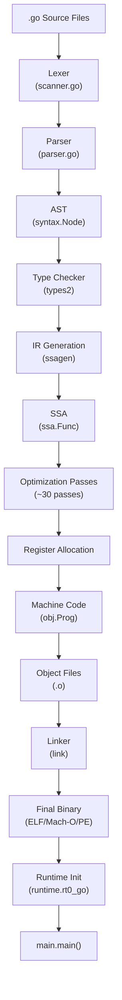
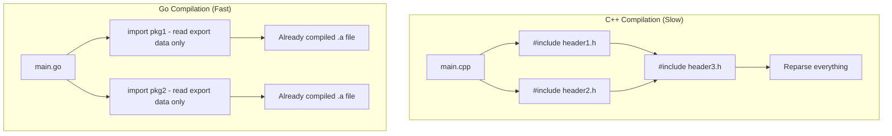
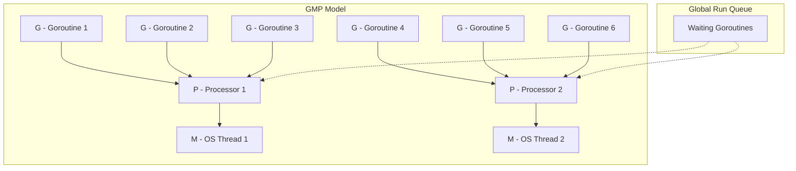
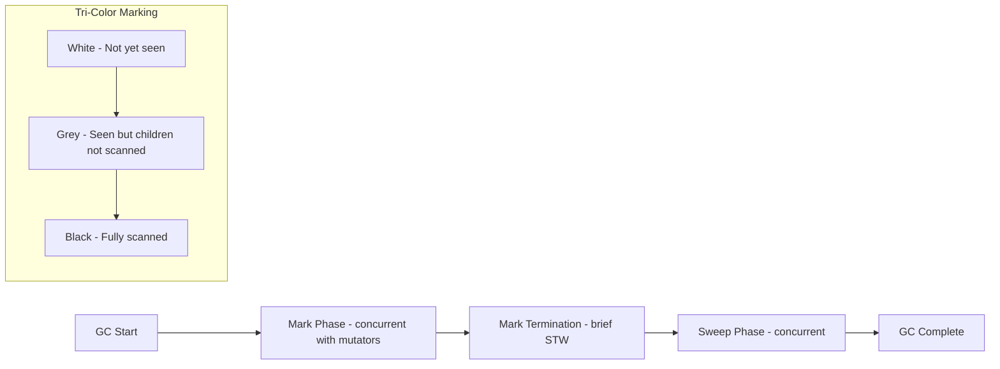
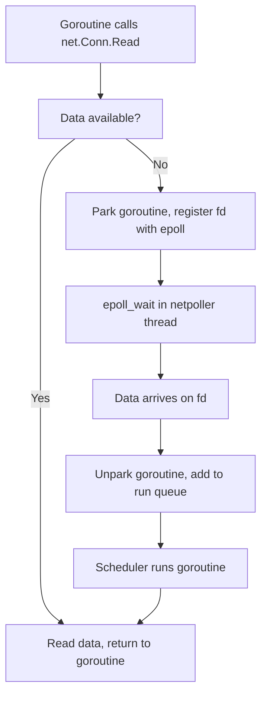
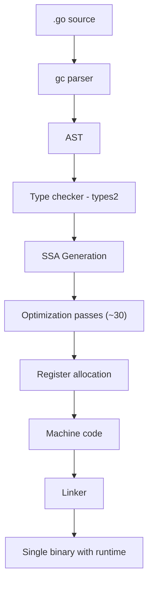

# Why Use Go — Under the Hood

## Table of Contents

1. [Introduction](#introduction)
2. [How It Works Internally](#how-it-works-internally)
3. [Runtime Deep Dive](#runtime-deep-dive)
4. [Compiler Perspective](#compiler-perspective)
5. [Memory Layout](#memory-layout)
6. [OS / Syscall Level](#os--syscall-level)
7. [Source Code Walkthrough](#source-code-walkthrough)
8. [Assembly Output Analysis](#assembly-output-analysis)
9. [Performance Internals](#performance-internals)
10. [Metrics & Analytics (Runtime Level)](#metrics--analytics-runtime-level)
11. [Edge Cases at the Lowest Level](#edge-cases-at-the-lowest-level)
12. [Test](#test)
13. [Tricky Questions](#tricky-questions)
14. [Summary](#summary)
15. [Further Reading](#further-reading)
16. [Diagrams & Visual Aids](#diagrams--visual-aids)

---

## Introduction

> Focus: "What happens under the hood?"

This document explores what Go does internally — from source code to machine instructions — and why these internal mechanisms make Go the language it is. Understanding these internals helps you:
- Know **why** Go compiles fast (dependency graph analysis, no header files)
- Understand **how** goroutines actually work (M:N scheduling, stack growth)
- See **what** the garbage collector does (tri-color mark-and-sweep, write barriers)
- Reason about **when** code allocates on heap vs stack (escape analysis)

This is essential knowledge for understanding Go's strengths and limitations at a fundamental level.

---

## How It Works Internally

### From Source Code to Running Program

When you run `go build main.go`, here is what happens step by step:

1. **Source code** — Your `.go` files
2. **Lexer/Parser** — Tokenizes source, builds Abstract Syntax Tree (AST)
3. **Type checking** — Verifies types, resolves names, checks interfaces
4. **SSA generation** — Converts AST to Static Single Assignment form
5. **Optimization passes** — Dead code elimination, inlining, escape analysis
6. **Machine code generation** — Architecture-specific code (amd64, arm64)
7. **Linker** — Combines object files, embeds Go runtime, produces final binary
8. **Runtime initialization** — Sets up scheduler, GC, stacks at program start



### Why Go Compiles Fast

Go's fast compilation is not accidental — it is the result of deliberate design decisions:

1. **No header files:** Go parses only the source files in the current package and the exported symbols of imported packages (from `.a` files)
2. **Import graph is a DAG:** No circular imports allowed, enabling parallel compilation
3. **Simple grammar:** Only 25 keywords, no ambiguous syntax (e.g., no angle brackets for generics — uses `[T any]`)
4. **Package-level compilation:** Each package is compiled independently, enabling caching (`go build -cache`)
5. **Unused imports are errors:** The compiler never parses code that is not needed



---

## Runtime Deep Dive

### The Go Runtime: What It Does

The Go runtime is a library linked into every Go binary. It manages:
- **Goroutine scheduler** (M:N scheduling)
- **Garbage collector** (concurrent, tri-color mark-and-sweep)
- **Memory allocator** (tcmalloc-inspired, per-P caches)
- **Stack management** (growable stacks, copying collector for stacks)
- **Network poller** (epoll/kqueue integration)

### The GMP Model (Goroutine Scheduler)



**Key runtime structures (from Go source):**

```go
// From runtime/runtime2.go (simplified)
type g struct {
    stack       stack   // goroutine stack bounds
    stackguard0 uintptr // stack growth check
    m           *m      // current M (OS thread)
    sched       gobuf   // saved registers for context switch
    atomicstatus uint32 // goroutine status (runnable, running, waiting, etc.)
    goid         int64  // goroutine ID
}

type m struct {
    g0      *g     // goroutine with scheduling stack
    curg    *g     // current running goroutine
    p       *p     // attached P (nil if not executing Go code)
    nextp   *p     // next P to acquire
    spinning bool  // looking for work
}

type p struct {
    status    uint32   // P status
    runqhead  uint32   // local run queue head
    runqtail  uint32   // local run queue tail
    runq      [256]guintptr // local run queue (fixed-size ring buffer)
    mcache    *mcache  // per-P memory cache
}
```

**Key Go runtime functions:**
- `runtime.newproc()` — creates a new goroutine (called by the `go` keyword)
- `runtime.schedule()` — finds the next goroutine to run
- `runtime.goexit()` — called when a goroutine's function returns
- `runtime.mstart()` — starts an OS thread for the scheduler
- `runtime.gcStart()` — initiates a garbage collection cycle

### Garbage Collector Internals

Go uses a **concurrent, tri-color mark-and-sweep** collector:



**How it works:**
1. **Mark Setup (STW ~10-30us):** Enable write barrier, turn all objects white
2. **Marking (concurrent):** Start from roots (stacks, globals), color objects grey. For each grey object, scan its pointers and color children grey. Color scanned object black.
3. **Mark Termination (STW ~10-30us):** Disable write barrier, finish any remaining marking
4. **Sweep (concurrent):** Reclaim white (unreachable) objects

**Write barrier:** During concurrent marking, the write barrier tracks pointer modifications to prevent the mutator (your program) from hiding objects from the GC. Go uses a Yuasa-style deletion write barrier combined with a Dijkstra-style insertion write barrier.

---

## Compiler Perspective

### Viewing Compiler Decisions

```bash
# Escape analysis — which variables escape to heap?
go build -gcflags="-m -m" main.go

# SSA intermediate representation — view optimization passes
GOSSAFUNC=main go build main.go
# Opens ssa.html in browser showing all SSA optimization passes

# Inline decisions — which functions get inlined?
go build -gcflags="-m" main.go 2>&1 | grep "inlining"

# Bounds check elimination
go build -gcflags="-d=ssa/check_bce/debug=1" main.go
```

### Escape Analysis

Escape analysis determines whether a variable can live on the stack (fast, no GC) or must be allocated on the heap (slower, GC managed):

```go
package main

import "fmt"

// x escapes to heap — pointer is returned to caller
func escapesToHeap() *int {
    x := 42
    return &x // x must outlive the function — heap allocated
}

// x stays on stack — no reference escapes
func staysOnStack() int {
    x := 42
    return x // value copy — x can be on stack
}

// fmt.Println causes escape — it accepts interface{}
func escapesViaInterface() {
    x := 42
    fmt.Println(x) // x escapes because interface{} boxing allocates
}

func main() {
    _ = escapesToHeap()
    _ = staysOnStack()
    escapesViaInterface()
}
```

```bash
$ go build -gcflags="-m" main.go
./main.go:6:2: moved to heap: x
./main.go:12:2: x does not escape
./main.go:18:13: ... argument does not escape
./main.go:18:13: x escapes to heap
```

### Compiler Optimizations Applied

| Optimization | What it does | Impact |
|-------------|-------------|--------|
| **Inlining** | Replaces function call with function body | Eliminates call overhead, enables further optimizations |
| **Escape analysis** | Determines stack vs heap allocation | Reduces GC pressure |
| **Dead code elimination** | Removes unreachable code | Smaller binary |
| **Bounds check elimination** | Removes redundant array bounds checks | Faster array access |
| **Copy propagation** | Replaces variables with their values | Fewer instructions |

---

## Memory Layout

### Goroutine Stack Layout

```
Goroutine Stack (starts at 2KB, grows dynamically)
+---------------------------+
|   Stack Guard (canary)    |  <- stackguard0: triggers stack growth
+---------------------------+
|   Function Frame N        |
|   - local variables       |
|   - return address        |
|   - arguments             |
+---------------------------+
|   Function Frame N-1      |
|   - local variables       |
|   - return address        |
+---------------------------+
|   ...                     |
+---------------------------+
|   main.main Frame         |
|   - local variables       |
+---------------------------+
|   runtime.main Frame      |
+---------------------------+
|   runtime.goexit Frame    |  <- bottom of stack
+---------------------------+
```

### Interface Memory Layout

```
Interface value: (type, data)
+------------------+------------------+
|   Type pointer   |   Data pointer   |
|   (8 bytes)      |   (8 bytes)      |
+------------------+------------------+
        |                   |
        v                   v
+------------------+  +------------------+
|   Type metadata  |  |   Actual data    |
|   - size         |  |   (on heap or    |
|   - hash         |  |    stack)        |
|   - methods      |  |                  |
+------------------+  +------------------+
```

```go
package main

import (
    "fmt"
    "unsafe"
)

type MyStruct struct {
    A int64
    B bool
    C int64
}

func main() {
    var s MyStruct
    fmt.Println("Size:", unsafe.Sizeof(s))           // 24 bytes (not 17 — padding!)
    fmt.Println("Align:", unsafe.Alignof(s))         // 8
    fmt.Println("Offset A:", unsafe.Offsetof(s.A))   // 0
    fmt.Println("Offset B:", unsafe.Offsetof(s.B))   // 8
    fmt.Println("Offset C:", unsafe.Offsetof(s.C))   // 16
    // B is 1 byte but padded to 8 bytes for alignment
}
```

### Struct Field Ordering and Padding

```
Inefficient layout (24 bytes):
+--------+--------+--------+
| A: i64 | B: bool| padding| C: i64 |
| 8 bytes| 1 byte | 7 bytes| 8 bytes|
+--------+--------+--------+--------+
Total: 24 bytes

Efficient layout (17 bytes, padded to 24):
+--------+--------+--------+
| A: i64 | C: i64 | B: bool| padding|
| 8 bytes| 8 bytes| 1 byte | 7 bytes|
+--------+--------+--------+--------+
Total: 24 bytes (same — Go compiler does NOT reorder fields)

Note: Go does NOT reorder struct fields. If you want optimal layout,
you must order fields manually from largest to smallest.
```

---

## OS / Syscall Level

### What Syscalls Go Makes

```bash
# Trace syscalls on Linux
strace -f -e trace=write,futex,clone,epoll_ctl ./myprogram

# On macOS
dtruss ./myprogram
```

**Key syscalls used by Go runtime:**

| Syscall | When Go uses it | Purpose |
|---------|----------------|---------|
| `clone` (Linux) | `runtime.newm()` | Create new OS thread for M |
| `futex` | `runtime.lock()` / `runtime.notesleep()` | Low-level synchronization |
| `mmap` | `runtime.sysAlloc()` | Allocate memory from OS |
| `epoll_create1` / `epoll_ctl` | `runtime.netpoll` | Async I/O multiplexing |
| `write` | `fmt.Println()` | Write to stdout/stderr |
| `sigaction` | `runtime.initsig()` | Set up signal handlers |

### Network Poller Integration

Go integrates with the OS's I/O multiplexer (epoll on Linux, kqueue on macOS) to efficiently handle thousands of concurrent network connections:



This is why Go can handle 100K+ concurrent connections without 100K threads — goroutines waiting for I/O are parked and do not consume OS thread resources.

---

## Source Code Walkthrough

### How `go func()` Works Internally

When you write `go myFunc()`, the compiler generates a call to `runtime.newproc()`:

**File:** `src/runtime/proc.go` (Go 1.22)

```go
// Simplified from runtime/proc.go
// newproc creates a new goroutine to run fn.
func newproc(fn *funcval) {
    gp := getg()           // Get current goroutine
    pc := getcallerpc()     // Get caller's program counter

    systemstack(func() {
        newg := newproc1(fn, gp, pc) // Create the new goroutine struct

        pp := getg().m.p.ptr()       // Get current P (processor)
        runqput(pp, newg, true)       // Put new goroutine on P's local run queue

        if mainStarted {
            wakep()                   // Wake an idle P if available
        }
    })
}
```

**What happens step by step:**
1. `newproc1()` allocates a `g` struct (goroutine descriptor)
2. Sets up the goroutine's stack (initially 2KB from a pool)
3. Copies the function pointer and arguments to the new stack
4. Sets `goroutine.status = _Grunnable`
5. Places the goroutine on the current P's local run queue
6. If there are idle Ps, wakes them up to potentially pick up the work

### How the Scheduler Picks the Next Goroutine

**File:** `src/runtime/proc.go`

```go
// Simplified from runtime/proc.go
func schedule() {
    gp := getg().m      // Current M (OS thread)

    // Every 61st schedule, check global run queue (prevent starvation)
    if gp.schedtick%61 == 0 && sched.runqsize > 0 {
        gp = runqget(sched) // Steal from global queue
    }

    // Try local run queue first
    if gp == nil {
        gp = runqget(pp)
    }

    // Try to steal from other Ps
    if gp == nil {
        gp = findrunnable() // Work stealing
    }

    // Run the goroutine
    execute(gp)
}
```

---

## Assembly Output Analysis

### Viewing Assembly Output

```bash
# View assembly for a specific function
go build -gcflags="-S" main.go 2>&1 | grep -A 20 "main.main STEXT"

# Or use objdump on the binary
go build -o myapp main.go
go tool objdump -s "main.main" myapp
```

### Example: What a Simple Function Compiles To

```go
package main

func add(a, b int) int {
    return a + b
}

func main() {
    result := add(3, 5)
    _ = result
}
```

```asm
; go build -gcflags="-S" main.go (amd64, simplified)
TEXT main.add(SB), NOSPLIT, $0-24
    MOVQ    a+0(FP), AX     ; Load first argument (a) into AX
    ADDQ    b+8(FP), AX     ; Add second argument (b) to AX
    MOVQ    AX, ret+16(FP)  ; Store result in return value slot
    RET                      ; Return

TEXT main.main(SB), $16-0
    ; Note: add() is likely inlined by the compiler
    ; If not inlined:
    MOVQ    $3, 0(SP)        ; Push first arg (3) onto stack
    MOVQ    $5, 8(SP)        ; Push second arg (5) onto stack
    CALL    main.add(SB)     ; Call add function
    ; Result is now in 16(SP)
    RET
```

**What to look for in assembly:**
- `CALL runtime.newobject` — heap allocation (potential optimization target)
- `CALL runtime.growslice` — slice growing (pre-allocate to avoid)
- `CALL runtime.convT` — interface conversion (boxing, causes allocation)
- Stack frame size in function header — larger frame may indicate escape to stack

---

## Performance Internals

### Benchmarks with Profiling

```go
package main

import (
    "fmt"
    "testing"
)

// Benchmark to compare stack vs heap allocation
func BenchmarkStackAlloc(b *testing.B) {
    for i := 0; i < b.N; i++ {
        x := 42 // stays on stack
        _ = x
    }
}

func BenchmarkHeapAlloc(b *testing.B) {
    for i := 0; i < b.N; i++ {
        x := new(int) // escapes to heap
        *x = 42
        _ = x
    }
}

func main() {
    fmt.Println("Run: go test -bench=. -benchmem -cpuprofile=cpu.prof")
    fmt.Println("Analyze: go tool pprof cpu.prof")
}
```

```bash
# Run benchmarks with profiling
go test -bench=. -benchmem -cpuprofile=cpu.prof -memprofile=mem.prof

# Analyze CPU profile
go tool pprof -http=:8080 cpu.prof

# Analyze memory profile
go tool pprof -http=:8081 mem.prof
```

**Expected results:**
```
BenchmarkStackAlloc-8    1000000000    0.25 ns/op     0 B/op    0 allocs/op
BenchmarkHeapAlloc-8       50000000   25.00 ns/op     8 B/op    1 allocs/op
```

Stack allocation is ~100x faster than heap allocation — this is why escape analysis matters.

### Internal Performance Characteristics

| Factor | Impact | How to measure |
|--------|--------|---------------|
| **Heap allocations** | Each alloc adds GC pressure | `go test -benchmem` |
| **Cache locality** | Struct-of-arrays vs array-of-structs | Benchmark with `perf stat` |
| **Goroutine scheduling** | Context switch cost ~200ns | `go tool trace` |
| **GC pauses** | STW phases ~10-30us each | `GODEBUG=gctrace=1` |
| **Stack growth** | Copying entire stack when it grows | `go build -gcflags="-m"` to check stack sizes |

---

## Metrics & Analytics (Runtime Level)

### Go Runtime Metrics

```go
package main

import (
    "fmt"
    "runtime"
    "runtime/metrics"
)

func main() {
    // Old API: runtime.MemStats (causes STW — avoid in hot paths)
    var ms runtime.MemStats
    runtime.ReadMemStats(&ms)
    fmt.Printf("Heap alloc: %d MB\n", ms.HeapAlloc/1024/1024)
    fmt.Printf("Num GC: %d\n", ms.NumGC)
    fmt.Printf("GC pause total: %d ms\n", ms.PauseTotalNs/1000000)

    // New API (Go 1.16+): runtime/metrics — no STW
    samples := []metrics.Sample{
        {Name: "/memory/classes/heap/objects:bytes"},
        {Name: "/gc/cycles/total:gc-cycles"},
        {Name: "/sched/goroutines:goroutines"},
        {Name: "/sched/latencies:seconds"},
    }
    metrics.Read(samples)

    for _, s := range samples {
        switch s.Value.Kind() {
        case metrics.KindUint64:
            fmt.Printf("%s: %d\n", s.Name, s.Value.Uint64())
        case metrics.KindFloat64:
            fmt.Printf("%s: %.2f\n", s.Name, s.Value.Float64())
        case metrics.KindFloat64Histogram:
            fmt.Printf("%s: (histogram)\n", s.Name)
        }
    }
}
```

### Key Runtime Metrics for Understanding Go's Advantages

| Metric path | What it measures | Why it matters for "Why Use Go" |
|-------------|-----------------|--------------------------------|
| `/memory/classes/heap/objects:bytes` | Live heap objects | Shows Go's efficient memory usage |
| `/gc/cycles/total:gc-cycles` | GC frequency | Demonstrates GC overhead is manageable |
| `/gc/pauses:seconds` | GC pause histogram | Proves sub-millisecond pauses |
| `/sched/goroutines:goroutines` | Goroutine count | Shows Go can handle thousands of concurrent tasks |
| `/sched/latencies:seconds` | Scheduling latency | Demonstrates low goroutine scheduling overhead |

---

## Edge Cases at the Lowest Level

### Edge Case 1: Stack Growth Under Pressure

What happens when a goroutine's stack overflows its initial 2KB:

```go
package main

import (
    "fmt"
    "runtime"
)

func recursive(depth int) {
    if depth == 0 {
        var ms runtime.MemStats
        runtime.ReadMemStats(&ms)
        fmt.Printf("Stack in use: %d KB\n", ms.StackInuse/1024)
        return
    }
    // Each frame uses some stack space
    var padding [64]byte
    _ = padding
    recursive(depth - 1)
}

func main() {
    recursive(10000)
    fmt.Println("Completed deep recursion without crash")
}
```

**Internal behavior:**
1. On each function call, Go checks if the stack has enough space (via `stackguard0`)
2. If not, `runtime.morestack()` is called
3. A new, larger stack is allocated (2x the current size)
4. The old stack is **copied** to the new stack
5. All pointers within the stack are adjusted to point to new locations
6. This is why Go goroutine stacks can start at 2KB and grow to 1GB

### Edge Case 2: GC Under Memory Pressure

```go
package main

import (
    "fmt"
    "os"
    "runtime"
    "runtime/debug"
)

func main() {
    // GOGC controls GC frequency:
    // GOGC=100 (default): GC when heap doubles
    // GOGC=50: GC when heap grows 50%
    // GOGC=off: Disable GC entirely

    debug.SetGCPercent(50) // More aggressive GC
    // Or: os.Setenv("GOGC", "50")
    _ = os

    // Allocate many small objects
    var data [][]byte
    for i := 0; i < 1000000; i++ {
        data = append(data, make([]byte, 100))
    }

    var ms runtime.MemStats
    runtime.ReadMemStats(&ms)
    fmt.Printf("Heap alloc: %d MB\n", ms.HeapAlloc/1024/1024)
    fmt.Printf("Num GC: %d\n", ms.NumGC)
    fmt.Printf("Total GC pause: %d ms\n", ms.PauseTotalNs/1000000)

    _ = data
}
```

**Internal behavior:** With lower GOGC, the collector runs more frequently but with shorter pauses (less heap to scan each time). With higher GOGC, it runs less often but pauses are longer.

### Edge Case 3: What Happens When GOMAXPROCS = 1

```go
package main

import (
    "fmt"
    "runtime"
    "sync"
)

func main() {
    runtime.GOMAXPROCS(1) // Force single P

    var wg sync.WaitGroup
    for i := 0; i < 4; i++ {
        wg.Add(1)
        go func(id int) {
            defer wg.Done()
            sum := 0
            for j := 0; j < 1000000; j++ {
                sum += j
            }
            fmt.Printf("Goroutine %d done: %d\n", id, sum)
        }(i)
    }
    wg.Wait()
}
```

**Internal behavior:** With `GOMAXPROCS=1`, only one goroutine runs at a time on a single OS thread. Goroutines are interleaved cooperatively (at function calls, channel operations, etc.) and preemptively (since Go 1.14, async preemption via signals). The program still works correctly — just uses time-slicing instead of true parallelism.

---

## Test

### Internal Knowledge Questions

**1. What Go runtime function is called when you use the `go` keyword?**

<details>
<summary>Answer</summary>
`runtime.newproc()` — This function allocates a new goroutine struct (`g`), sets up its stack (initially 2KB from a pool), copies the function pointer and arguments, and places the goroutine on the current P's local run queue. The compiler transforms `go f(args)` into a call to `runtime.newproc()`.
</details>

**2. What are the three components of Go's GMP scheduler model?**

<details>
<summary>Answer</summary>
- **G (Goroutine):** The unit of work — contains the stack, instruction pointer, and status
- **M (Machine/Thread):** An OS thread that executes goroutines. Typically one per CPU core
- **P (Processor):** A logical processor that holds a local run queue of goroutines. `GOMAXPROCS` sets the number of Ps

The relationship: A G runs on an M, and an M must be attached to a P to execute Go code. If an M's goroutine blocks on a syscall, the P detaches and finds another M.
</details>

**3. How does Go's escape analysis decide whether to allocate on heap or stack?**

<details>
<summary>Answer</summary>
The compiler performs escape analysis during compilation. A variable "escapes" to the heap if:
- Its address is returned from a function (pointer escapes)
- It is stored in a heap-allocated structure
- It is assigned to an interface (boxing may cause escape)
- It is captured by a closure that outlives the stack frame
- The compiler cannot prove it does not escape

Check with: `go build -gcflags="-m"` — the compiler will print which variables escape.
</details>

**4. What does this `GODEBUG` output tell you?**

```
gc 1 @0.020s 2%: 0.024+1.3+0.025 ms clock, 0.19+0.35/1.2/0+0.20 ms cpu, 4->4->3 MB, 5 MB goal, 8 P
```

<details>
<summary>Answer</summary>
- `gc 1` — This is the 1st GC cycle
- `@0.020s` — Happened 20ms after program start
- `2%` — GC used 2% of total CPU time so far
- `0.024+1.3+0.025 ms clock` — Wall clock: 0.024ms STW mark start, 1.3ms concurrent mark, 0.025ms STW mark termination
- `0.19+0.35/1.2/0+0.20 ms cpu` — CPU time breakdown
- `4->4->3 MB` — Heap size: 4MB before mark, 4MB after mark, 3MB live
- `5 MB goal` — GC will trigger again when heap reaches 5MB
- `8 P` — 8 logical processors (GOMAXPROCS=8)

Key insight: The STW pauses are 0.024ms and 0.025ms — well under 1ms, demonstrating Go's low-pause GC.
</details>

**5. Why does Go's binary include the entire runtime?**

<details>
<summary>Answer</summary>
Go statically links the runtime into every binary because:
1. **Single binary deployment** — no runtime to install on the target machine
2. **Consistency** — the binary always uses the exact runtime version it was compiled with
3. **No version conflicts** — unlike Java (JVM version mismatch) or Python (virtualenv issues)

The runtime typically adds ~2-5MB to the binary size. This is the cost of Go's "just copy and run" deployment model.
</details>

---

## Tricky Questions

**1. Go's goroutine stacks start at 2KB. What happens if a goroutine needs more stack space?**

<details>
<summary>Answer</summary>
Go uses **copyable stacks**:
1. When a function call would overflow the current stack, `runtime.morestack()` is triggered
2. A new stack is allocated (2x the current size)
3. The entire old stack is **copied** to the new stack
4. All pointers within the stack are **adjusted** to reflect the new memory addresses
5. The old stack is freed

This is why Go can start goroutines with tiny 2KB stacks — they grow on demand. The copying is efficient because Go's type system knows which values on the stack are pointers (needed for adjustment).

Pre-Go 1.4 used "segmented stacks" (linked list of stack segments), but copying stacks were adopted because they have better cache locality and no "hot split" problem.
</details>

**2. Why does `fmt.Println(42)` cause a heap allocation?**

<details>
<summary>Answer</summary>
`fmt.Println` accepts `...interface{}` (variadic empty interface). When you pass `42` (an `int`), Go must box the int into an interface value `(type=int, value=42)`. This boxing operation allocates the int value on the heap because:

1. The interface value needs a pointer to the data
2. The `int` value might be stored in a location that outlives the caller's stack frame
3. The compiler's escape analysis sees the value being passed to `fmt.Println` (which could store it anywhere)

This is one reason why performance-critical code avoids `fmt.Println` in hot paths, preferring direct `os.Stdout.Write()` with pre-formatted byte slices.

Verify: `go build -gcflags="-m" main.go` shows `42 escapes to heap`.
</details>

**3. How does Go's network poller achieve high concurrency without one thread per connection?**

<details>
<summary>Answer</summary>
Go integrates with the OS's I/O multiplexer:
- **Linux:** `epoll_create1`, `epoll_ctl`, `epoll_wait`
- **macOS:** `kqueue`
- **Windows:** `IOCP`

When a goroutine does `net.Conn.Read()` and data is not available:
1. The goroutine is **parked** (status: `_Gwaiting`)
2. The file descriptor is registered with epoll/kqueue
3. The OS thread (M) is freed to run other goroutines
4. When data arrives, the netpoller detects it and marks the goroutine as **runnable**
5. The scheduler picks it up and resumes execution

This means 100K concurrent connections only need a handful of OS threads — each waiting goroutine costs ~2KB of memory, not ~1MB of thread stack.
</details>

---

## Summary

- Go's fast compilation comes from deliberate design: no header files, DAG imports, simple grammar, package-level compilation
- The GMP scheduler model (Goroutines, Machines/Threads, Processors) enables M:N scheduling — many goroutines on few threads
- Go's GC is concurrent tri-color mark-and-sweep with STW pauses of ~10-30 microseconds — excellent for most workloads
- Escape analysis determines stack vs heap allocation — understanding it lets you write zero-allocation code in hot paths
- The netpoller integrates with OS-level I/O multiplexing (epoll/kqueue), enabling high concurrency without thread-per-connection

**Key takeaway:** Go's internal design choices — copyable stacks, M:N scheduling, concurrent GC, integrated netpoller — collectively explain why Go excels at networked services with high concurrency. Understanding these internals helps you write code that works WITH the runtime, not against it.

---

## Further Reading

- **Go source:** [runtime package](https://github.com/golang/go/blob/master/src/runtime/)
- **Design doc:** [Go 1.5 Concurrent GC](https://docs.google.com/document/d/16Y4IsnNRCN43Mx0NZc5YXZLovrHvvLhK_h0KN8woTO0/) — GC design document
- **Conference talk:** [GopherCon 2018: Kavya Joshi - The Scheduler Saga](https://www.youtube.com/watch?v=YHRO5WQGh0k) — excellent deep dive into the scheduler
- **Blog post:** [Go GC: Latency Problem Solved](https://blog.twitch.tv/en/2016/07/05/gos-march-to-low-latency-gc-a6fa96f06eb7/) — Twitch's experience with Go GC
- **Book:** "Go Internals" by various authors — chapters on runtime, scheduler, GC

---

## Diagrams & Visual Aids

### Go Compiler Pipeline



### Go Memory Architecture

```
+=============================================+
|              Go Process Memory              |
+=============================================+
|                                             |
|  +------+  +------+  +------+  +------+    |
|  |  G1  |  |  G2  |  |  G3  |  |  G4  |   |  Goroutine Stacks
|  | 2KB+ |  | 2KB+ |  | 8KB  |  | 2KB+ |   |  (dynamically sized)
|  +------+  +------+  +------+  +------+    |
|                                             |
|  +------------------------------------------+
|  |           Heap (GC managed)               |
|  |  +--------+  +--------+  +--------+      |
|  |  | Object |  | Object |  | Object |      |
|  |  +--------+  +--------+  +--------+      |
|  +------------------------------------------+
|                                             |
|  +------------------------------------------+
|  |     Per-P Memory Caches (mcache)          |
|  |  P0: [size classes 0-67]                  |
|  |  P1: [size classes 0-67]                  |
|  +------------------------------------------+
|                                             |
|  +------------------------------------------+
|  |     Global Data (BSS, Data segments)      |
|  +------------------------------------------+
+=============================================+
```

### GC Phases Timeline

```
Time -->
|<-- STW -->|<---- Concurrent Mark ---->|<STW>|<-- Concurrent Sweep -->|
|  ~10-30us |        ~1-10ms            |~10us|       background       |
|           |                           |     |                        |
| Enable    | Scan stacks, globals      |Finish| Reclaim white objects |
| write     | Trace heap objects         |mark | (concurrent with      |
| barrier   | Color grey -> black        |     |  mutator)             |
```
