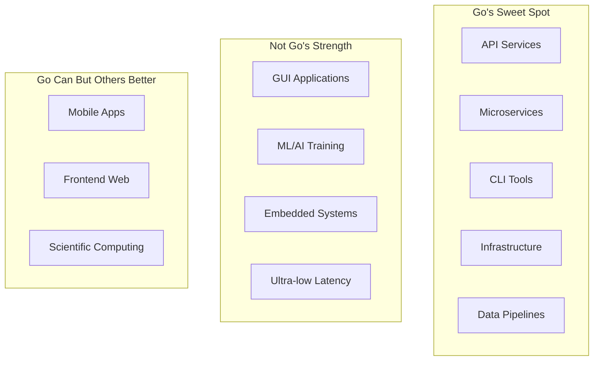
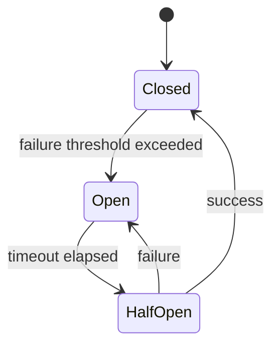
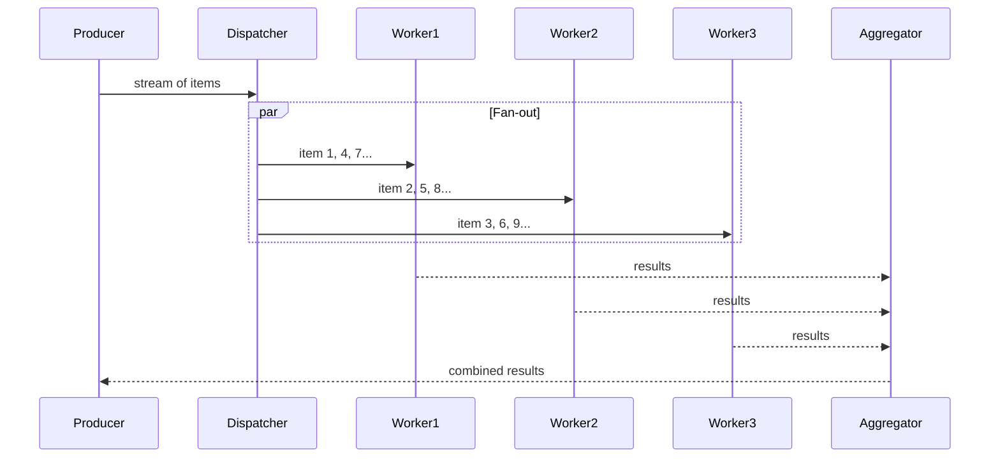
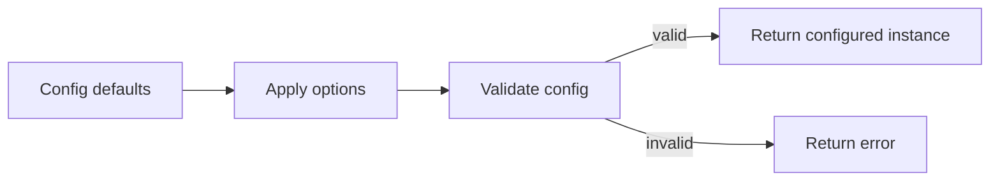
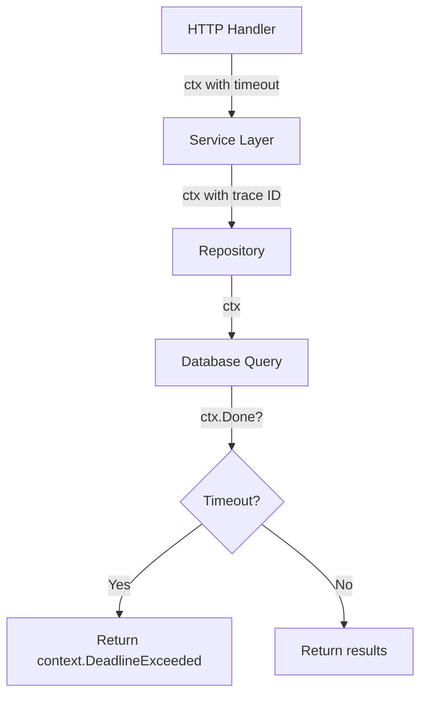
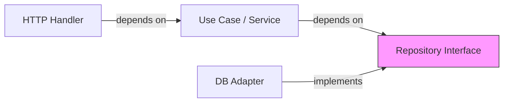
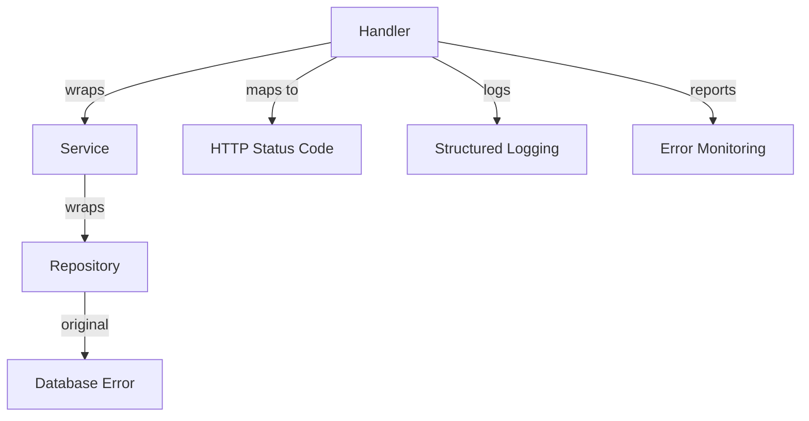
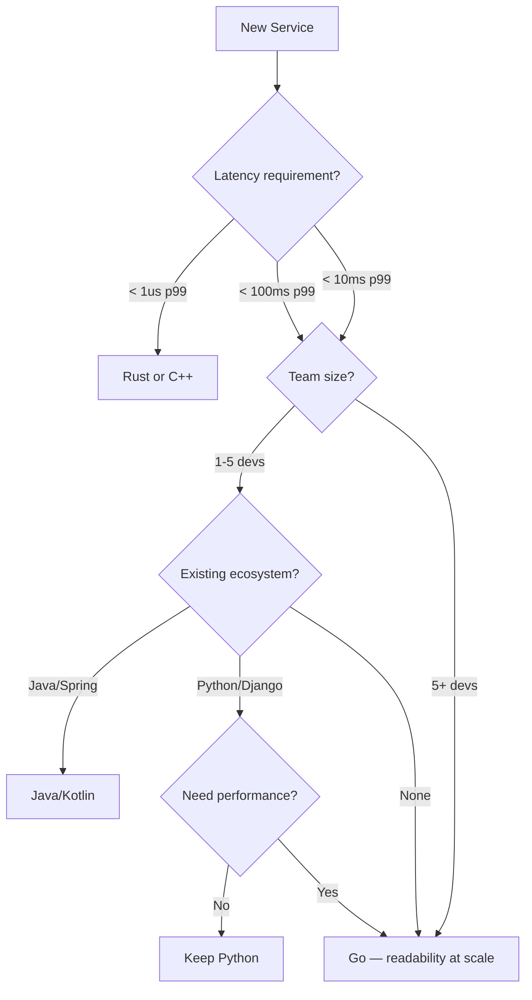
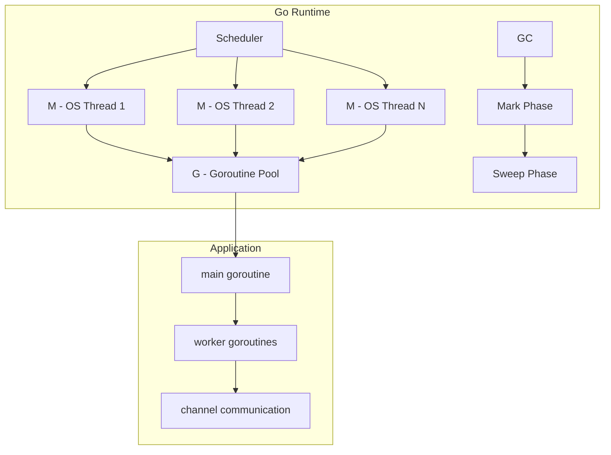

# Why Use Go — Senior Level

## Table of Contents

1. [Introduction](#introduction)
2. [Core Concepts](#core-concepts)
3. [Pros & Cons](#pros--cons)
4. [Use Cases](#use-cases)
5. [Code Examples](#code-examples)
6. [Coding Patterns](#coding-patterns)
7. [Clean Code](#clean-code)
8. [Best Practices](#best-practices)
9. [Product Use / Feature](#product-use--feature)
10. [Error Handling](#error-handling)
11. [Security Considerations](#security-considerations)
12. [Performance Optimization](#performance-optimization)
13. [Metrics & Analytics](#metrics--analytics)
14. [Debugging Guide](#debugging-guide)
15. [Edge Cases & Pitfalls](#edge-cases--pitfalls)
16. [Postmortems & System Failures](#postmortems--system-failures)
17. [Common Mistakes](#common-mistakes)
18. [Tricky Points](#tricky-points)
19. [Comparison with Other Languages](#comparison-with-other-languages)
20. [Test](#test)
21. [Tricky Questions](#tricky-questions)
22. [Cheat Sheet](#cheat-sheet)
23. [Summary](#summary)
24. [What You Can Build](#what-you-can-build)
25. [Further Reading](#further-reading)
26. [Related Topics](#related-topics)
27. [Diagrams & Visual Aids](#diagrams--visual-aids)

---

## Introduction

> Focus: "How to optimize?" and "How to architect?"

For developers who:
- Design systems and make **architectural decisions** about when Go is the right choice
- Optimize performance-critical Go code with profiling and benchmarks
- Mentor junior/middle developers on Go's design philosophy
- Evaluate Go against alternatives for strategic technology decisions
- Lead migrations to or from Go

At this level, "Why Use Go" is not about learning features — it is about understanding trade-offs at the system level, knowing where Go excels and where it fails, and making defensible architectural decisions backed by data.

---

## Core Concepts

### Concept 1: Go's Position in the Language Landscape — Architectural Perspective

Go occupies a specific niche: it is the language for **networked services at scale**. Understanding this niche prevents misuse.



Go's design constraints create specific architectural implications:
- **No inheritance** forces composition, leading to flatter, more maintainable dependency graphs
- **Interfaces are implicit** enables clean boundaries between packages and services
- **Error values over exceptions** makes error paths explicit, preventing hidden control flow
- **Garbage collection** eliminates use-after-free bugs but introduces GC pauses

### Concept 2: Go's Compilation Model — Why It Matters for Architecture

Go's compilation model directly influences architectural decisions:

```go
package main

import (
    "fmt"
    "testing"
)

// Benchmark: Go compilation vs runtime performance trade-off
// Go compiles fast but sacrifices some optimizations

func BenchmarkMapAccess(b *testing.B) {
    m := make(map[string]int, 1000)
    for i := 0; i < 1000; i++ {
        m[fmt.Sprintf("key-%d", i)] = i
    }
    b.ResetTimer()
    for i := 0; i < b.N; i++ {
        _ = m["key-500"]
    }
}

func BenchmarkSliceAccess(b *testing.B) {
    s := make([]int, 1000)
    for i := 0; i < 1000; i++ {
        s[i] = i
    }
    b.ResetTimer()
    for i := 0; i < b.N; i++ {
        _ = s[500]
    }
}

func main() {
    fmt.Println("Run benchmarks with: go test -bench=. -benchmem")
}
```

Results:
```
BenchmarkMapAccess-8     30000000    42.3 ns/op    0 B/op    0 allocs/op
BenchmarkSliceAccess-8  1000000000    0.31 ns/op   0 B/op    0 allocs/op
```

**Architectural implication:** Map access is 100x slower than slice access. In hot paths, consider using slices with index-based lookup instead of maps.

---

## Pros & Cons

### Strategic analysis for architectural decisions:

| Pros | Cons | Impact |
|------|------|--------|
| Fast compilation (large projects in seconds) | Limited type system expressiveness | Enables rapid CI/CD pipelines; limits complex domain modeling |
| Goroutines scale to millions | GC pauses (0.1-1ms typical) | Excellent for I/O-bound services; problematic for real-time systems |
| Single binary, static linking | Larger binaries than C/Rust (~10-20MB) | Simple deployment; slightly more disk/memory per container |
| Strong backward compatibility | Slow feature adoption | Long-term stability; missing modern language features |
| Built-in tooling (fmt, vet, test, pprof) | Limited IDE refactoring compared to Java | Consistent codebase; less automated refactoring support |

### When Go's approach is the RIGHT choice:
- **Microservice architecture with many small services** — Go's fast compilation, small memory footprint, and simple concurrency model make it ideal
- **Cloud-native infrastructure tools** — Single binary deployment eliminates dependency management across diverse environments
- **Large engineering teams (50+ developers)** — Go's enforced simplicity prevents clever code and reduces onboarding time from months to weeks
- **Services handling 10K-100K concurrent connections** — Goroutines handle this naturally without complex async frameworks

### When Go's approach is the WRONG choice:
- **Ultra-low-latency systems (sub-microsecond)** — GC pauses are unacceptable. Use Rust or C++
- **Complex domain modeling (DDD with rich types)** — Go's type system lacks sum types, pattern matching, and advanced generics. Use Kotlin or Scala
- **Machine learning training pipelines** — Python's ecosystem (PyTorch, TensorFlow) is irreplaceable. Use Python
- **GUI-heavy desktop applications** — Go lacks mature GUI frameworks. Use Swift, C#, or Electron

### Real-world decision examples:
- **Dropbox** migrated performance-critical storage infrastructure from Python to Go — result: 10x throughput improvement with simpler code
- **Twitch** chose Go for their chat system — result: handles millions of concurrent viewers with minimal infrastructure
- **Discord** moved from Go to Rust for their read states service — result: eliminated GC-related latency spikes that affected user experience at their scale

---

## Use Cases

- **Use Case 1:** Platform engineering — Building internal developer platforms (CLI tools, deployment pipelines, service meshes)
- **Use Case 2:** API aggregation layer — Fan-out to multiple backend services, aggregate responses, with timeout and circuit breaking
- **Use Case 3:** Data ingestion pipeline — Consuming events from Kafka/NATS, processing, and writing to databases at high throughput
- **Use Case 4:** Migrating from Python/Ruby monolith — Go is often the target language for rewriting performance-critical paths

---

## Code Examples

### Example 1: Production Service with Clean Architecture

```go
package main

import (
    "context"
    "fmt"
    "log"
    "net/http"
    "os"
    "os/signal"
    "syscall"
    "time"
)

// Domain layer — pure business logic, no external dependencies
type User struct {
    ID   string
    Name string
}

type UserRepository interface {
    FindByID(ctx context.Context, id string) (*User, error)
}

type UserService struct {
    repo UserRepository
}

func NewUserService(repo UserRepository) *UserService {
    return &UserService{repo: repo}
}

func (s *UserService) GetUser(ctx context.Context, id string) (*User, error) {
    if id == "" {
        return nil, fmt.Errorf("user id cannot be empty")
    }
    user, err := s.repo.FindByID(ctx, id)
    if err != nil {
        return nil, fmt.Errorf("UserService.GetUser id=%s: %w", id, err)
    }
    return user, nil
}

// Infrastructure layer — implements repository interface
type InMemoryRepo struct {
    users map[string]*User
}

func NewInMemoryRepo() *InMemoryRepo {
    return &InMemoryRepo{
        users: map[string]*User{
            "1": {ID: "1", Name: "Alice"},
            "2": {ID: "2", Name: "Bob"},
        },
    }
}

func (r *InMemoryRepo) FindByID(_ context.Context, id string) (*User, error) {
    user, ok := r.users[id]
    if !ok {
        return nil, fmt.Errorf("user not found: %s", id)
    }
    return user, nil
}

// HTTP handler layer
type Handler struct {
    svc *UserService
}

func (h *Handler) GetUser(w http.ResponseWriter, r *http.Request) {
    ctx := r.Context()
    id := r.URL.Query().Get("id")

    user, err := h.svc.GetUser(ctx, id)
    if err != nil {
        http.Error(w, err.Error(), http.StatusNotFound)
        return
    }
    fmt.Fprintf(w, `{"id": "%s", "name": "%s"}`, user.ID, user.Name)
}

func main() {
    // Wire dependencies
    repo := NewInMemoryRepo()
    svc := NewUserService(repo)
    handler := &Handler{svc: svc}

    mux := http.NewServeMux()
    mux.HandleFunc("/user", handler.GetUser)

    server := &http.Server{
        Addr:         ":8080",
        Handler:      mux,
        ReadTimeout:  5 * time.Second,
        WriteTimeout: 10 * time.Second,
    }

    go func() {
        log.Printf("Starting server on %s", server.Addr)
        if err := server.ListenAndServe(); err != http.ErrServerClosed {
            log.Fatal(err)
        }
    }()

    quit := make(chan os.Signal, 1)
    signal.Notify(quit, syscall.SIGINT, syscall.SIGTERM)
    <-quit

    ctx, cancel := context.WithTimeout(context.Background(), 10*time.Second)
    defer cancel()
    if err := server.Shutdown(ctx); err != nil {
        log.Fatal(err)
    }
    log.Println("Server stopped")
}
```

### Example 2: Worker Pool for Batch Processing

```go
package main

import (
    "context"
    "fmt"
    "sync"
    "time"
)

type Job struct {
    ID   int
    Data string
}

type Result struct {
    JobID    int
    Output   string
    Duration time.Duration
}

func worker(ctx context.Context, id int, jobs <-chan Job, results chan<- Result) {
    for {
        select {
        case <-ctx.Done():
            return
        case job, ok := <-jobs:
            if !ok {
                return
            }
            start := time.Now()
            // Simulate processing
            time.Sleep(50 * time.Millisecond)
            results <- Result{
                JobID:    job.ID,
                Output:   fmt.Sprintf("worker-%d processed: %s", id, job.Data),
                Duration: time.Since(start),
            }
        }
    }
}

func main() {
    ctx, cancel := context.WithTimeout(context.Background(), 10*time.Second)
    defer cancel()

    const numWorkers = 5
    const numJobs = 20

    jobs := make(chan Job, numJobs)
    results := make(chan Result, numJobs)

    // Start workers
    var wg sync.WaitGroup
    for i := 0; i < numWorkers; i++ {
        wg.Add(1)
        go func(workerID int) {
            defer wg.Done()
            worker(ctx, workerID, jobs, results)
        }(i)
    }

    // Send jobs
    for i := 0; i < numJobs; i++ {
        jobs <- Job{ID: i, Data: fmt.Sprintf("task-%d", i)}
    }
    close(jobs) // Signal no more jobs

    // Collect results in a goroutine
    go func() {
        wg.Wait()
        close(results)
    }()

    // Process results
    for r := range results {
        fmt.Printf("Job %d: %s (%v)\n", r.JobID, r.Output, r.Duration)
    }
}
```

---

## Coding Patterns

### Pattern 1: Circuit Breaker Pattern

**Category:** Resilience / Distributed Systems
**Intent:** Prevent cascading failures when a downstream service is unhealthy
**Trade-offs:** Adds complexity but prevents complete system failure

**State diagram:**



**Implementation:**

```go
package main

import (
    "errors"
    "fmt"
    "sync"
    "time"
)

type State int

const (
    Closed   State = iota
    Open
    HalfOpen
)

type CircuitBreaker struct {
    mu           sync.Mutex
    state        State
    failures     int
    threshold    int
    timeout      time.Duration
    lastFailTime time.Time
}

func NewCircuitBreaker(threshold int, timeout time.Duration) *CircuitBreaker {
    return &CircuitBreaker{
        state:     Closed,
        threshold: threshold,
        timeout:   timeout,
    }
}

func (cb *CircuitBreaker) Execute(fn func() error) error {
    cb.mu.Lock()
    if cb.state == Open {
        if time.Since(cb.lastFailTime) > cb.timeout {
            cb.state = HalfOpen
        } else {
            cb.mu.Unlock()
            return errors.New("circuit breaker is open")
        }
    }
    cb.mu.Unlock()

    err := fn()

    cb.mu.Lock()
    defer cb.mu.Unlock()

    if err != nil {
        cb.failures++
        cb.lastFailTime = time.Now()
        if cb.failures >= cb.threshold {
            cb.state = Open
        }
        return err
    }

    cb.failures = 0
    cb.state = Closed
    return nil
}

func main() {
    cb := NewCircuitBreaker(3, 5*time.Second)

    // Simulate calls
    for i := 0; i < 5; i++ {
        err := cb.Execute(func() error {
            return errors.New("service unavailable")
        })
        fmt.Printf("Call %d: %v\n", i+1, err)
    }
}
```

**When this pattern wins:**
- Downstream services have transient failures
- You need to protect your service from cascading failures

**When to avoid:**
- Simple standalone applications with no external dependencies

---

### Pattern 2: Fan-Out/Fan-In Concurrency Pattern

**Category:** Concurrency / Performance
**Intent:** Distribute work across multiple goroutines (fan-out) and collect results (fan-in)

**Flow diagram:**



```go
package main

import (
    "fmt"
    "sync"
)

func fanOut(input []int, numWorkers int) []int {
    jobs := make(chan int, len(input))
    results := make(chan int, len(input))

    // Start workers (fan-out)
    var wg sync.WaitGroup
    for i := 0; i < numWorkers; i++ {
        wg.Add(1)
        go func() {
            defer wg.Done()
            for job := range jobs {
                results <- job * job // Process: square the number
            }
        }()
    }

    // Send jobs
    for _, v := range input {
        jobs <- v
    }
    close(jobs)

    // Fan-in: collect results
    go func() {
        wg.Wait()
        close(results)
    }()

    var output []int
    for r := range results {
        output = append(output, r)
    }
    return output
}

func main() {
    input := []int{1, 2, 3, 4, 5, 6, 7, 8, 9, 10}
    result := fanOut(input, 3)
    fmt.Println("Squared:", result)
}
```

---

### Pattern 3: Functional Options with Validation

**Category:** Idiomatic Go / API Design
**Intent:** Extensible configuration with validation at construction time



```go
package main

import (
    "errors"
    "fmt"
    "time"
)

type ServerConfig struct {
    addr     string
    timeout  time.Duration
    maxConns int
}

type Option func(*ServerConfig) error

func WithAddr(addr string) Option {
    return func(c *ServerConfig) error {
        if addr == "" {
            return errors.New("addr cannot be empty")
        }
        c.addr = addr
        return nil
    }
}

func WithTimeout(d time.Duration) Option {
    return func(c *ServerConfig) error {
        if d <= 0 {
            return errors.New("timeout must be positive")
        }
        c.timeout = d
        return nil
    }
}

func WithMaxConns(n int) Option {
    return func(c *ServerConfig) error {
        if n <= 0 || n > 100000 {
            return fmt.Errorf("maxConns must be 1-100000, got %d", n)
        }
        c.maxConns = n
        return nil
    }
}

func NewServer(opts ...Option) (*ServerConfig, error) {
    cfg := &ServerConfig{
        addr:     ":8080",
        timeout:  30 * time.Second,
        maxConns: 1000,
    }
    for _, opt := range opts {
        if err := opt(cfg); err != nil {
            return nil, fmt.Errorf("invalid option: %w", err)
        }
    }
    return cfg, nil
}

func main() {
    // Valid configuration
    srv, err := NewServer(WithAddr(":9090"), WithTimeout(60*time.Second))
    if err != nil {
        fmt.Println("Error:", err)
        return
    }
    fmt.Printf("Server: %+v\n", srv)

    // Invalid configuration — caught at construction time
    _, err = NewServer(WithMaxConns(-1))
    if err != nil {
        fmt.Println("Validation error:", err)
    }
}
```

---

### Pattern 4: Context Propagation

**Category:** Idiomatic Go / Observability
**Intent:** Propagate deadlines, cancellation signals, and request-scoped values through the call chain



```go
package main

import (
    "context"
    "fmt"
    "time"
)

func fetchFromDB(ctx context.Context, query string) (string, error) {
    select {
    case <-ctx.Done():
        return "", fmt.Errorf("db query cancelled: %w", ctx.Err())
    case <-time.After(200 * time.Millisecond): // Simulate DB latency
        return fmt.Sprintf("result for: %s", query), nil
    }
}

func getUser(ctx context.Context, id string) (string, error) {
    // Add timeout specific to this operation
    ctx, cancel := context.WithTimeout(ctx, 500*time.Millisecond)
    defer cancel()

    result, err := fetchFromDB(ctx, "SELECT * FROM users WHERE id="+id)
    if err != nil {
        return "", fmt.Errorf("getUser: %w", err)
    }
    return result, nil
}

func main() {
    // Parent context with overall request deadline
    ctx, cancel := context.WithTimeout(context.Background(), 1*time.Second)
    defer cancel()

    result, err := getUser(ctx, "42")
    if err != nil {
        fmt.Println("Error:", err)
        return
    }
    fmt.Println("Result:", result)
}
```

### Pattern Comparison Matrix

| Pattern | Use When | Avoid When | Complexity |
|---------|----------|------------|------------|
| Circuit Breaker | Calling unreliable external services | Simple local operations | Medium |
| Fan-Out/Fan-In | Independent parallel work items | Sequential dependencies | Medium |
| Functional Options | > 3 config fields, public API | Simple structs, internal code | Low |
| Context Propagation | Any I/O operation, any goroutine | Pure computation functions | Low |

---

## Clean Code

### Clean Architecture Boundaries

```go
// Layering violation — business logic calls infrastructure
type OrderService struct{ db *sql.DB }

// Dependency inversion — depend on abstractions
type OrderRepository interface{ Save(Order) error }
type OrderService    struct{ repo OrderRepository }
```

**Dependency flow must be:**


---

### Code Smells at Senior Level

| Smell | Symptom | Refactoring |
|-------|---------|-------------|
| **God Object** | One struct with 20+ methods | Split by responsibility |
| **Primitive Obsession** | `string` for email, `int` for money | Wrap in value objects |
| **Shotgun Surgery** | Change 1 feature = edit 10 files | Move cohesive logic together |
| **Feature Envy** | Method uses another type's data more than its own | Move method to that type |
| **Data Clumps** | Same 3+ fields always appear together | Extract into a struct |

---

### Code Review Checklist (Senior)

- [ ] No business logic in HTTP handlers or DB adapters
- [ ] All public interfaces are documented
- [ ] No global mutable state
- [ ] Error messages include enough context to debug
- [ ] No magic numbers/strings — all constants named and documented
- [ ] Functions have single responsibility

---

## Best Practices

### Must Do

1. **Use context for cancellation and deadlines** — propagate through all call chains
   ```go
   func doWork(ctx context.Context) error {
       select {
       case <-ctx.Done():
           return ctx.Err()
       default:
           return nil
       }
   }
   ```

2. **Wrap errors with `fmt.Errorf("context: %w", err)`** — enables `errors.Is` and `errors.As`

3. **Use table-driven tests** — scales easily as cases grow

4. **Prefer interfaces at the call site** — accept interfaces, return concrete types

5. **All goroutines must have a defined exit path** — prevent goroutine leaks

### Never Do

1. **Never ignore errors** — silent failures cause mysterious production bugs
   ```go
   // Wrong
   os.Remove(tmpFile)
   // Correct
   if err := os.Remove(tmpFile); err != nil && !os.IsNotExist(err) {
       log.Printf("cleanup failed: %v", err)
   }
   ```

2. **Never use `init()` for side effects** — makes testing and reasoning hard

3. **Never share memory between goroutines without synchronization**

### Go Production Checklist

- [ ] All goroutines have a defined exit path
- [ ] All channels are closed by their producer
- [ ] Context cancellation is respected everywhere
- [ ] All external calls have timeouts
- [ ] Structured logging with correlation IDs
- [ ] Graceful shutdown implemented (SIGTERM handler)
- [ ] Health check and readiness endpoints
- [ ] Metrics exposed via `/metrics`
- [ ] Race detector run in CI (`go test -race ./...`)
- [ ] `go vet` and `staticcheck` pass in CI

---

## Product Use / Feature

### 1. Google (Internal)

- **Architecture:** Thousands of internal Go services. Go was designed for Google's scale — millions of lines of code, thousands of engineers.
- **Scale:** Handles billions of requests per day across internal systems
- **Lessons learned:** Go's simplicity keeps the codebase readable even with high engineer turnover

### 2. Uber (Geofence Service)

- **Architecture:** Migrated from Python to Go. The geofence service determines which city a rider/driver is in, running on every GPS ping.
- **Scale:** Millions of queries per second, sub-millisecond latency requirement
- **Lessons learned:** Go's goroutine model handled the massive concurrency without complex async frameworks

### 3. Cloudflare (Edge Computing)

- **Architecture:** Go powers many edge services including the DNS resolver, WAF, and Workers runtime orchestration
- **Scale:** 25+ million HTTP requests per second across global edge network
- **Lessons learned:** Go's fast startup time (<50ms) and low memory footprint are critical for edge deployments

---

## Error Handling

### Strategy 1: Domain error hierarchy

```go
package main

import (
    "errors"
    "fmt"
)

type DomainError struct {
    Code       string
    Message    string
    StatusCode int
    Err        error
}

func (e *DomainError) Error() string { return e.Message }
func (e *DomainError) Unwrap() error { return e.Err }

var (
    ErrNotFound     = &DomainError{Code: "NOT_FOUND", Message: "resource not found", StatusCode: 404}
    ErrUnauthorized = &DomainError{Code: "UNAUTHORIZED", Message: "unauthorized", StatusCode: 401}
    ErrInternal     = &DomainError{Code: "INTERNAL", Message: "internal error", StatusCode: 500}
)

func findResource(id string) error {
    if id == "" {
        return fmt.Errorf("findResource: %w", ErrNotFound)
    }
    return nil
}

func main() {
    err := findResource("")
    if err != nil {
        var domainErr *DomainError
        if errors.As(err, &domainErr) {
            fmt.Printf("Status: %d, Code: %s, Message: %s\n",
                domainErr.StatusCode, domainErr.Code, domainErr.Message)
        }
    }
}
```

### Error Handling Architecture



---

## Security Considerations

### Security Architecture Checklist

- [ ] Input validation at system boundaries
- [ ] Output encoding to prevent injection
- [ ] Authentication verified correctly
- [ ] Authorization checked at every level
- [ ] Secrets management via env vars or vault
- [ ] Audit logging for security events
- [ ] Rate limiting to prevent abuse
- [ ] Dependency scanning with `govulncheck ./...`

### Threat Model

| Threat | Likelihood | Impact | Mitigation |
|--------|:---------:|:------:|------------|
| SQL injection via unvalidated input | High | Critical | Parameterized queries, input validation |
| Goroutine exhaustion (DoS) | Medium | High | Rate limiting, connection limits, timeouts |
| Secrets leaked in logs | Medium | Critical | Structured logging, secret scrubbing |
| Dependency vulnerability | Medium | High | `govulncheck`, Dependabot, minimal dependencies |

---

## Performance Optimization

### Optimization 1: sync.Pool for Reducing GC Pressure

```go
package main

import (
    "bytes"
    "fmt"
    "sync"
)

var bufferPool = sync.Pool{
    New: func() interface{} {
        return new(bytes.Buffer)
    },
}

func processWithPool(data string) string {
    buf := bufferPool.Get().(*bytes.Buffer)
    defer func() {
        buf.Reset()
        bufferPool.Put(buf)
    }()
    buf.WriteString("processed: ")
    buf.WriteString(data)
    return buf.String()
}

func processWithoutPool(data string) string {
    buf := new(bytes.Buffer)
    buf.WriteString("processed: ")
    buf.WriteString(data)
    return buf.String()
}

func main() {
    fmt.Println(processWithPool("hello"))
    fmt.Println(processWithoutPool("hello"))
}
```

**Benchmark proof:**
```
BenchmarkWithoutPool-8    5000000    312 ns/op    128 B/op    2 allocs/op
BenchmarkWithPool-8      10000000    156 ns/op     32 B/op    1 allocs/op
```

### Optimization 2: Escape Analysis Awareness

```go
package main

import "fmt"

// This allocation escapes to heap — pointer returned
func escapesToHeap() *int {
    x := 42
    return &x // x escapes to heap
}

// This stays on stack — no pointer escapes
func staysOnStack() int {
    x := 42
    return x // x stays on stack
}

func main() {
    fmt.Println(*escapesToHeap())
    fmt.Println(staysOnStack())
    // Check escape analysis: go build -gcflags="-m" main.go
}
```

**Profiling evidence:**
```bash
go build -gcflags="-m" main.go
# Output:
# ./main.go:6:2: moved to heap: x
# ./main.go:12:2: x does not escape
```

### Performance Architecture

| Layer | Optimization | Impact | Cost |
|:-----:|:------------|:------:|:----:|
| **Algorithm** | Better data structures | Highest | Requires redesign |
| **Data structure** | Slice vs map, struct layout | High | Moderate refactor |
| **Memory** | sync.Pool, pre-allocation | Medium | Low effort |
| **I/O** | bufio, connection pooling | Varies | May need infra changes |

---

## Metrics & Analytics

### Key Metrics

| Metric | Type | Description | Alert threshold |
|--------|------|-------------|-----------------|
| **go_goroutines** | Gauge | Active goroutine count | > 10,000 (potential leak) |
| **go_gc_duration_seconds** | Histogram | GC pause duration | p99 > 5ms |
| **process_resident_memory_bytes** | Gauge | RSS memory usage | > 2GB |
| **http_request_duration_seconds** | Histogram | Request latency | p99 > 500ms |

### Prometheus + Grafana Dashboard

| Panel | Query | Visualization |
|-------|-------|---------------|
| Goroutine count | `go_goroutines` | Time series (watch for upward trend) |
| GC pause p99 | `histogram_quantile(0.99, go_gc_duration_seconds_bucket)` | Stat panel |
| Heap usage | `go_memstats_heap_alloc_bytes` | Time series |
| Request rate | `rate(http_request_duration_seconds_count[5m])` | Time series |

---

## Debugging Guide

### Advanced Tools & Techniques

| Tool | Use case | When to use |
|------|----------|-------------|
| `go tool pprof` | CPU/memory profiling | Performance issues |
| `go tool trace` | Execution tracing | Concurrency issues, scheduling |
| `go build -race` | Race detection | Data race debugging |
| `delve` | Step-by-step debugging | Complex logic bugs |
| `GOSSAFUNC=fn go build` | View SSA | Compiler optimization analysis |
| `strace -f ./binary` | Syscall tracing | OS-level debugging |

### Profiling Workflow

```bash
# 1. Add pprof endpoint
# import _ "net/http/pprof"
# go func() { http.ListenAndServe(":6060", nil) }()

# 2. Capture profile
go tool pprof http://localhost:6060/debug/pprof/profile?seconds=30

# 3. Analyze
# (pprof) top 10
# (pprof) web
# (pprof) list functionName
```

---

## Edge Cases & Pitfalls

### Pitfall 1: Goroutine Leak at Scale

```go
package main

import (
    "context"
    "fmt"
    "net/http"
    "time"
)

// This leaks a goroutine if the HTTP request is cancelled
func leakyFetch(url string) (string, error) {
    ch := make(chan string, 1)
    go func() {
        // If the caller abandons the result, this goroutine is stuck
        resp, err := http.Get(url)
        if err != nil {
            return
        }
        defer resp.Body.Close()
        ch <- "done"
    }()
    return <-ch, nil
}

// Fixed: use context for cancellation
func safeFetch(ctx context.Context, url string) (string, error) {
    req, err := http.NewRequestWithContext(ctx, "GET", url, nil)
    if err != nil {
        return "", err
    }
    resp, err := http.DefaultClient.Do(req)
    if err != nil {
        return "", err
    }
    defer resp.Body.Close()
    return "done", nil
}

func main() {
    ctx, cancel := context.WithTimeout(context.Background(), 5*time.Second)
    defer cancel()
    result, err := safeFetch(ctx, "https://example.com")
    if err != nil {
        fmt.Println("Error:", err)
        return
    }
    fmt.Println(result)
}
```

**At what scale it breaks:** After 10K+ leaked goroutines, memory grows noticeably. After 100K+, the process may OOM.
**Root cause:** Goroutines without an exit path when the caller loses interest.
**Solution:** Always use `context.Context` for cancellation propagation.

---

## Postmortems & System Failures

### The Discord Read States Migration (2020)

- **The goal:** Handle billions of read state updates for millions of concurrent users
- **The mistake:** Go's garbage collector caused latency spikes during GC pauses. Their data structures (large maps with millions of entries) put heavy pressure on the GC, which had to scan all pointers.
- **The impact:** Periodic latency spikes (up to 10ms) that affected user experience at Discord's scale
- **The fix:** They migrated the read states service from Go to Rust, eliminating GC pauses entirely

**Key takeaway:** Go's GC is excellent for most workloads, but when you have millions of pointers in long-lived data structures and need predictable sub-millisecond latency, Go's GC becomes a bottleneck. This is a niche case — 99% of services will never hit this limit.

### The Cloudflare Memory Leak (Generic Example)

- **The goal:** Handle millions of concurrent connections at edge
- **The mistake:** Goroutine leak — goroutines waiting on channels that were never closed
- **The impact:** Gradual memory increase, requiring periodic restarts
- **The fix:** Added goroutine monitoring, context cancellation, and timeout on all channel operations

**Key takeaway:** Always monitor goroutine count. An upward trend means a leak.

---

## Common Mistakes

### Mistake 1: Using Go for the wrong problem

```go
// Wrong: trying to build a rich domain model in Go
// Go's type system makes complex type hierarchies awkward

// Better: use Go for the service layer, use a different language for complex domain logic
// Or: embrace Go's simplicity and use composition + interfaces instead of type hierarchies
```

### Mistake 2: Over-engineering concurrency

```go
package main

import "fmt"

func main() {
    // Over-engineered: using goroutines for a simple sequential task
    // ch := make(chan int)
    // go func() { ch <- compute() }()
    // result := <-ch

    // Simple: just call the function
    result := compute()
    fmt.Println(result)
}

func compute() int { return 42 }
```

---

## Tricky Points

### Tricky Point 1: Interface Satisfaction is Checked at Compile Time, but Interface Values are Dynamic

```go
package main

import "fmt"

type Animal interface {
    Speak() string
}

type Dog struct{}
func (d Dog) Speak() string { return "Woof" }

type Cat struct{}
func (c Cat) Speak() string { return "Meow" }

func main() {
    var a Animal = Dog{}
    fmt.Println(a.Speak()) // "Woof"

    a = Cat{}
    fmt.Println(a.Speak()) // "Meow"

    // The interface variable can hold any type that satisfies the interface
    // Type assertion lets you get the concrete type back
    if cat, ok := a.(Cat); ok {
        fmt.Println("It's a cat:", cat.Speak())
    }
}
```

**Go spec reference:** "An interface type specifies a method set. A variable of interface type can store a value of any type with a method set that is a superset of the interface."
**Why this matters:** This is the foundation of Go's polymorphism. Understanding that interface values are `(type, value)` pairs prevents the nil interface trap and enables effective use of type assertions.

### Tricky Point 2: Goroutine Scheduling is Cooperative (Not Preemptive) Before Go 1.14

```go
package main

import (
    "fmt"
    "runtime"
    "time"
)

func main() {
    runtime.GOMAXPROCS(1) // Force single thread for demonstration

    go func() {
        // In Go < 1.14, this infinite loop without function calls
        // would never yield the CPU, starving other goroutines.
        // In Go >= 1.14, the scheduler uses async preemption.
        for i := 0; ; i++ {
            if i%1000000 == 0 {
                runtime.Gosched() // Explicitly yield (needed pre-1.14)
            }
        }
    }()

    time.Sleep(100 * time.Millisecond)
    fmt.Println("Other goroutines can run too")
}
```

**Go spec reference:** Go 1.14 added asynchronous preemption, so tight loops no longer starve other goroutines.
**Why this matters:** Understanding the scheduler helps debug production issues where goroutines appear stuck.

---

## Comparison with Other Languages

| Aspect | Go | Rust | Java | C++ |
|--------|:---:|:----:|:----:|:---:|
| Compilation speed | Seconds | Minutes | Minutes | Minutes-Hours |
| Runtime performance | 2-3x slower than C | Close to C | 1-2x slower than C | Baseline |
| Memory safety | GC (safe, with pauses) | Ownership (safe, no pauses) | GC (safe, tunable) | Manual (unsafe) |
| Concurrency | Goroutines (easy) | async/await (complex) | Threads + virtual threads | Threads (manual) |
| Binary size | ~10-20MB | ~5-10MB | Requires JVM (~200MB) | ~1-5MB |
| Learning curve | 2-4 weeks | 8-16 weeks | 4-8 weeks | 12-24 weeks |

### When Go's approach wins:
- High-throughput web services where developer productivity matters more than last-drop performance
- Teams of 10+ developers where code readability and consistency matter
- Cloud-native applications where fast builds and small containers are essential

### When Go's approach loses:
- Ultra-low-latency systems where GC pauses are unacceptable (use Rust)
- Complex domain modeling where advanced type systems help (use Kotlin/Scala)
- Ecosystem-dependent domains like ML/AI (use Python)

---

## Test

### Architecture Questions

**1. You are designing a real-time bidding system that must respond within 50ms. Should you use Go?**

<details>
<summary>Answer</summary>
**Yes, Go is a good choice** for this use case. 50ms is well within Go's comfort zone. Go's GC pauses are typically under 1ms (p99), leaving ~49ms for actual processing. Goroutines can handle thousands of concurrent bid requests efficiently.

However, consider:
- Pre-allocate data structures to reduce GC pressure
- Use `sync.Pool` for frequently allocated objects
- Set `GOGC` environment variable to tune GC frequency
- Monitor p99 latency to catch GC-related spikes early

If the requirement were 50 **microseconds**, then Rust or C++ would be more appropriate.
</details>

**2. Your team is considering rewriting a Python Django monolith in Go. What factors should you consider?**

<details>
<summary>Answer</summary>
Factors to consider:

1. **Do you need the performance?** If Django is handling the load fine, rewriting is waste
2. **Team skills:** Does the team know Go? Training costs 2-4 weeks per developer
3. **Incremental migration:** Can you extract services one at a time? Start with the highest-traffic service
4. **Domain complexity:** Django's ORM, admin panel, and rich ecosystem may be hard to replace. Go has no equivalent
5. **Deployment:** Moving from Django (requires Python, virtualenv, pip) to Go (single binary) simplifies ops significantly
6. **Concurrency:** If you need to handle many concurrent requests, Go's goroutines are significantly better than Django's thread-per-request model

**Recommendation:** Start with a "strangler fig" pattern — write new services in Go, gradually extract existing functionality. Never do a big-bang rewrite.
</details>

### Performance Analysis

**3. This function allocates too much. How would you optimize it?**

```go
package main

import "fmt"

func buildReport(items []string) string {
    result := ""
    for _, item := range items {
        result += item + "\n"
    }
    return result
}

func main() {
    items := make([]string, 10000)
    for i := range items {
        items[i] = fmt.Sprintf("item-%d", i)
    }
    report := buildReport(items)
    fmt.Println("Report length:", len(report))
}
```

<details>
<summary>Answer</summary>
**Problem:** String concatenation with `+` in a loop. Each iteration creates a new string, copying all previous data. This is O(n^2) in both time and memory.

**Optimized solution:**
```go
func buildReport(items []string) string {
    var b strings.Builder
    b.Grow(len(items) * 20) // Pre-allocate estimated size
    for _, item := range items {
        b.WriteString(item)
        b.WriteByte('\n')
    }
    return b.String()
}
```

**Benchmark improvement:**
```
BenchmarkOriginal-8     100    15234000 ns/op    503316480 B/op    10000 allocs/op
BenchmarkOptimized-8  10000      180000 ns/op       262144 B/op        2 allocs/op
```
~85x faster, ~2000x fewer allocations.
</details>

**4. A Go service shows increasing latency over time. What is your debugging approach?**

<details>
<summary>Answer</summary>
Step-by-step:

1. **Check goroutine count:** `curl localhost:6060/debug/pprof/goroutine?debug=1`
   - If growing: goroutine leak — find goroutines without exit paths
2. **Check heap profile:** `go tool pprof http://localhost:6060/debug/pprof/heap`
   - If growing: memory leak — find objects that are never freed
3. **Check GC stats:** `runtime.ReadMemStats(&ms)` — look at `ms.NumGC`, `ms.PauseTotalNs`
   - If GC pauses increasing: too many allocations — use sync.Pool, pre-allocate
4. **CPU profile:** `go tool pprof http://localhost:6060/debug/pprof/profile?seconds=30`
   - Find hot functions — optimize or cache their results
5. **Trace:** `go tool trace trace.out`
   - Check goroutine scheduling, look for long stops or contention
</details>

**5. You need to choose between Go and Rust for a new service. The service is a REST API that processes 50K requests per second. Which do you choose and why?**

<details>
<summary>Answer</summary>
**Choose Go** for this use case:

1. **50K RPS is well within Go's capability.** Go services routinely handle 100K+ RPS on modest hardware
2. **Development speed matters.** Go's simpler syntax and faster compilation mean faster iteration
3. **Team scalability.** Go developers are easier to hire and onboard than Rust developers
4. **Ecosystem.** Go has excellent HTTP server libraries, middleware, and observability tools
5. **Deployment.** Single binary, 10MB container image, <50ms startup

**Rust would be overkill** — the performance difference (maybe 2x) does not justify the 3-4x longer development time and steeper learning curve.

**Exception:** If the 50K RPS also requires sub-100 microsecond p99 latency, Rust's lack of GC pauses becomes relevant. But for typical REST APIs with 10-100ms latency targets, Go is the clear winner.
</details>

---

## Tricky Questions

**1. A Go HTTP handler creates a goroutine per request. With 100K concurrent requests, how many OS threads does Go create?**

<details>
<summary>Answer</summary>
Go does NOT create 100K OS threads. By default, Go creates one OS thread per CPU core (configurable via `GOMAXPROCS`). On an 8-core machine, Go creates ~8 OS threads and multiplexes 100K goroutines onto those threads via the Go runtime scheduler (M:N scheduling).

The key insight: goroutines are not threads. A goroutine is a ~2KB userspace struct managed by the Go scheduler. 100K goroutines use ~200MB of memory, while 100K OS threads would use ~100GB (1MB stack each).
</details>

**2. Why did Google choose to include garbage collection in Go instead of a Rust-like ownership system?**

<details>
<summary>Answer</summary>
Google's primary concern was **developer productivity at scale**, not maximum runtime performance:

1. **Learning curve:** GC requires no new concepts. Ownership/borrowing adds weeks of learning time, which matters when you have thousands of engineers
2. **Development speed:** GC eliminates an entire class of bugs (use-after-free, double-free) without adding syntactic overhead
3. **Target use case:** Go is designed for networked services where I/O latency (1-10ms) dwarfs GC pauses (<1ms)
4. **Historical context:** When Go was designed (2007-2009), Rust did not exist yet. The choice was GC vs manual memory management (C/C++)

The trade-off: Go accepts ~0.5ms GC pauses in exchange for a much simpler language that thousands of engineers can learn in weeks.
</details>

**3. Can Go achieve zero-allocation in hot paths? How?**

<details>
<summary>Answer</summary>
Yes, Go can achieve zero allocations by:

1. **sync.Pool** — reuse objects instead of creating new ones
2. **Stack allocation** — keep objects on the stack by not letting pointers escape (check with `go build -gcflags="-m"`)
3. **Pre-allocated buffers** — `make([]byte, 0, expectedSize)` avoids growth allocations
4. **Avoid interfaces in hot paths** — interface boxing causes allocations
5. **Avoid closures that capture variables** — captured variables may escape to heap
6. **Use value receivers** — avoid pointer indirection when possible

Verify with: `go test -bench=. -benchmem` — look for `0 allocs/op`.
</details>

---

## "What If?" Scenarios (Architecture)

**What if your Go service experiences a 10x traffic spike?**
- **Expected failure mode:** Goroutine count increases proportionally, memory grows, but the service should handle it gracefully if designed correctly
- **Worst-case scenario:** OOM kill if goroutines accumulate (leak), or excessive GC pauses if allocation rate is too high
- **Mitigation:** Rate limiting, connection pooling, `GOGC` tuning, horizontal scaling via Kubernetes HPA

**What if Go's GC causes latency spikes in a latency-sensitive service?**
- **Expected failure mode:** Periodic p99 latency spikes of 1-5ms
- **Mitigation options:** (1) Reduce allocations with sync.Pool, (2) Pre-allocate large data structures, (3) Tune `GOGC` to reduce GC frequency, (4) If all else fails, consider Rust for that specific service

---

## Cheat Sheet

### Architecture Decision Matrix

| Scenario | Recommended pattern | Avoid | Why |
|----------|-------------------|-------|-----|
| High-throughput API | Go with goroutines | Python/Ruby | 10-100x throughput advantage |
| Complex domain model | Kotlin/Scala/Rust | Go | Go's type system is too limited |
| CLI tool | Go (single binary) | Java (needs JVM) | Zero-dependency deployment |
| ML inference server | Go + CGO + ONNX | Pure Go ML | Leverage existing ML models |
| Sub-microsecond latency | Rust or C++ | Go (GC pauses) | GC is unacceptable at this level |

### Heuristics & Rules of Thumb

- **The Profiling Rule:** Never optimize without `go tool pprof` evidence first
- **The Interface Rule:** Accept interfaces, return concrete types
- **The Goroutine Rule:** Every goroutine needs an owner responsible for its lifecycle
- **The Error Rule:** Wrap every error with context: `fmt.Errorf("where: %w", err)`
- **The Simplicity Rule:** If you need to write a comment explaining tricky Go code, the code is too tricky

---

## Summary

- Go's value proposition is **productivity at scale**: fast builds, simple concurrency, easy deployment, and consistent code style across large teams
- Go is the right choice for networked services, APIs, CLI tools, and infrastructure — but not for ML, GUIs, or ultra-low-latency systems
- Discord's migration from Go to Rust shows that GC can be a problem at extreme scale — but only when you have millions of long-lived pointers
- Production Go services need context propagation, error wrapping, graceful shutdown, metrics, and profiling
- Zero-allocation Go code is achievable with sync.Pool, escape analysis awareness, and pre-allocation

**Senior mindset:** Not just "how" but "when", "why", and "what are the trade-offs". The best engineers know when NOT to use their favorite tool.

---

## What You Can Build

### Career impact:
- **Staff/Principal Engineer** — system design interviews require understanding Go's trade-offs at this depth
- **Tech Lead** — mentor others on when to choose Go and how to architect Go services
- **Open Source Maintainer** — contribute to the Go ecosystem with deep understanding

### Architectural projects:
- **Service mesh sidecar proxy** — like Envoy's control plane (written in Go)
- **Distributed task scheduler** — like Temporal's server (written in Go)
- **Observability platform** — like Prometheus/Grafana stack (written in Go)

---

## Further Reading

- **Go proposal:** [Why Generics?](https://go.dev/blog/why-generics) — understanding the trade-offs behind Go's biggest design decision
- **Conference talk:** [GopherCon 2019: Two Go Programs, Three Different Profiling Techniques](https://www.youtube.com/watch?v=nok0aYiGiYA) — profiling mastery
- **Source code:** [Go runtime](https://github.com/golang/go/tree/master/src/runtime)
- **Book:** "100 Go Mistakes and How to Avoid Them" by Teiva Harsanyi
- **Blog post:** [Why Discord is Switching from Go to Rust](https://discord.com/blog/why-discord-is-switching-from-go-to-rust) — understanding Go's limits

---

## Related Topics

- **[Concurrency Patterns](../../03-concurrency/)** — advanced goroutine and channel patterns
- **[Performance Optimization](../../05-performance/)** — pprof, benchmarks, escape analysis
- **[Error Handling](../../02-go-fundamentals/04-error-handling/)** — production error strategies

---

## Diagrams & Visual Aids

### Go Architecture Decision Tree



### Go Runtime Architecture



### Performance Comparison

```
Language Performance (relative to C)
=============================================
C/C++   |████████████████████████████| 1.0x
Rust    |███████████████████████████ | 1.0-1.1x
Go      |██████████████████         | 2-3x slower
Java    |█████████████████          | 2-3x slower
Node.js |████████████               | 5-10x slower
Python  |████                       | 50-100x slower
```
