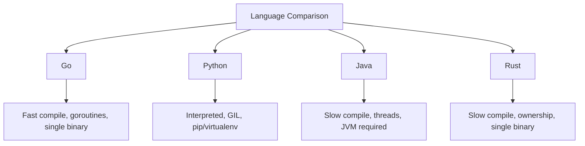

# Why Use Go — Practical Tasks

## Table of Contents

1. [Junior Tasks](#junior-tasks)
2. [Middle Tasks](#middle-tasks)
3. [Senior Tasks](#senior-tasks)
4. [Questions](#questions)
5. [Mini Projects](#mini-projects)
6. [Challenge](#challenge)

---

## Junior Tasks

### Task 1: Hello Go World

**Type:** Code

**Goal:** Verify your Go installation and understand the basic program structure.

**Starter code:**

```go
package main

import "fmt"

// TODO: Create a function that returns a formatted string
// containing Go's version year (2009) and creator company (Google)
func goInfo() string {
    return "TODO"
}

func main() {
    fmt.Println(goInfo())
}
```

**Expected output:**
```
Go was created by Google in 2009
```

**Evaluation criteria:**
- [ ] Code compiles and runs with `go run main.go`
- [ ] Output matches expected
- [ ] Function returns the string (not prints directly)

---

### Task 2: Why Go Comparison Table

**Type:** Design

**Goal:** Create a comparison diagram showing Go's advantages vs other languages.

**Deliverable:** Create a mermaid diagram (or markdown table) that compares Go, Python, Java, and Rust across these dimensions:
- Compilation speed
- Memory usage
- Concurrency model
- Deployment complexity
- Learning curve



**Evaluation criteria:**
- [ ] All 4 languages compared
- [ ] At least 4 dimensions covered
- [ ] Honest trade-offs shown (not biased toward Go)

---

### Task 3: Simple Concurrent Fetcher

**Type:** Code

**Goal:** Practice Go's concurrency — the main reason to use Go.

**Starter code:**

```go
package main

import (
    "fmt"
    "sync"
    "time"
)

// TODO: Implement this function to fetch data from multiple sources concurrently
// Each source takes 500ms to fetch (simulate with time.Sleep)
// Return all results and the total elapsed time
func fetchAll(sources []string) ([]string, time.Duration) {
    start := time.Now()
    results := make([]string, len(sources))

    // TODO: Use goroutines and sync.WaitGroup to fetch concurrently
    // Hint: Each goroutine should simulate a 500ms fetch and store
    // the result in results[i]

    _ = results
    return results, time.Since(start)
}

func main() {
    sources := []string{"Database", "Cache", "API", "FileSystem", "Queue"}
    results, elapsed := fetchAll(sources)

    fmt.Println("Results:")
    for _, r := range results {
        fmt.Println(" -", r)
    }
    fmt.Printf("Total time: %v\n", elapsed)
    fmt.Println("(Should be ~500ms, not ~2500ms)")
}
```

**Expected output:**
```
Results:
 - Data from Database
 - Data from Cache
 - Data from API
 - Data from FileSystem
 - Data from Queue
Total time: ~500ms
(Should be ~500ms, not ~2500ms)
```

**Evaluation criteria:**
- [ ] Code compiles and runs
- [ ] All 5 sources are fetched
- [ ] Total time is ~500ms (concurrent), not ~2500ms (sequential)
- [ ] Uses `sync.WaitGroup` correctly
- [ ] No data race (test with `go run -race main.go`)

<details>
<summary>Solution</summary>

```go
package main

import (
    "fmt"
    "sync"
    "time"
)

func fetchAll(sources []string) ([]string, time.Duration) {
    start := time.Now()
    results := make([]string, len(sources))
    var wg sync.WaitGroup

    for i, source := range sources {
        wg.Add(1)
        go func(idx int, src string) {
            defer wg.Done()
            time.Sleep(500 * time.Millisecond)
            results[idx] = fmt.Sprintf("Data from %s", src)
        }(i, source)
    }

    wg.Wait()
    return results, time.Since(start)
}

func main() {
    sources := []string{"Database", "Cache", "API", "FileSystem", "Queue"}
    results, elapsed := fetchAll(sources)

    fmt.Println("Results:")
    for _, r := range results {
        fmt.Println(" -", r)
    }
    fmt.Printf("Total time: %v\n", elapsed)
}
```

</details>

---

### Task 4: Go Feature Flowchart

**Type:** Design

**Goal:** Create a decision flowchart for when to use Go.

**Deliverable:** Draw a mermaid flowchart that helps a developer decide whether Go is the right language for their project. Include at least 5 decision points (e.g., "Need ML?", "Need fast compilation?", "Need concurrency?", "Building CLI tool?", "Need sub-microsecond latency?").

**Evaluation criteria:**
- [ ] At least 5 decision points
- [ ] Leads to Go AND non-Go recommendations
- [ ] Realistic and accurate decisions

---

## Middle Tasks

### Task 5: Production HTTP Server with Metrics

**Type:** Code

**Requirements:**
- [ ] Create an HTTP server with at least 2 endpoints (`/health` and `/api/data`)
- [ ] Implement graceful shutdown (handle SIGINT/SIGTERM)
- [ ] Add basic metrics tracking (request count, using `expvar`)
- [ ] Set proper timeouts on the server (`ReadTimeout`, `WriteTimeout`)
- [ ] Handle errors properly using Go idioms (`fmt.Errorf("...: %w", err)`)
- [ ] Write at least 2 tests for your handlers

**Starter code:**

```go
package main

import (
    "context"
    "expvar"
    "fmt"
    "net/http"
    "os"
    "os/signal"
    "syscall"
    "time"
)

var requestCount = expvar.NewInt("requests.total")

// TODO: Implement health handler
func healthHandler(w http.ResponseWriter, r *http.Request) {
    // Return JSON: {"status": "healthy", "timestamp": "..."}
}

// TODO: Implement data handler
func dataHandler(w http.ResponseWriter, r *http.Request) {
    requestCount.Add(1)
    // Return JSON: {"message": "Hello from Go!", "request_count": N}
}

func main() {
    mux := http.NewServeMux()
    // TODO: Register handlers
    // TODO: Create server with timeouts
    // TODO: Start server in goroutine
    // TODO: Wait for SIGINT/SIGTERM
    // TODO: Graceful shutdown with timeout

    _ = mux
    fmt.Println("TODO: Implement production server")
}
```

**Evaluation criteria:**
- [ ] Server starts and responds to requests
- [ ] Graceful shutdown works (test with `kill -SIGTERM <pid>`)
- [ ] Metrics tracked via `/debug/vars`
- [ ] Proper error handling
- [ ] Tests pass with `go test -v`

---

### Task 6: Language Comparison Benchmark

**Type:** Code

**Requirements:**
- [ ] Write a Go program that benchmarks 3 common operations to demonstrate Go's strengths:
  1. String concatenation (compare naive `+` vs `strings.Builder`)
  2. Concurrent HTTP requests (sequential vs goroutines)
  3. JSON parsing performance
- [ ] Use Go's `testing.B` benchmark framework
- [ ] Include benchmark results in comments

**Starter code:**

```go
package main

import (
    "fmt"
    "strings"
    "testing"
)

// TODO: Implement slow string concatenation
func concatSlow(n int) string {
    result := ""
    for i := 0; i < n; i++ {
        result += "hello"
    }
    return result
}

// TODO: Implement fast string concatenation
func concatFast(n int) string {
    var b strings.Builder
    for i := 0; i < n; i++ {
        b.WriteString("hello")
    }
    return b.String()
}

func main() {
    // Run quick comparison
    n := 10000
    fmt.Printf("Slow concat length: %d\n", len(concatSlow(n)))
    fmt.Printf("Fast concat length: %d\n", len(concatFast(n)))
    fmt.Println("\nRun benchmarks with: go test -bench=. -benchmem")
}
```

---

### Task 7: Error Handling Refactor

**Type:** Code

**Goal:** Refactor poorly written Go error handling to follow Go idioms.

**Provided code to refactor:**

```go
package main

import (
    "fmt"
    "os"
    "strconv"
)

// BAD: This function has multiple error handling problems
func processFile(filename string) {
    // Problem 1: Ignoring error
    file, _ := os.Open(filename)

    // Problem 2: No defer close
    data := make([]byte, 100)
    file.Read(data)

    // Problem 3: Panic instead of error return
    num, err := strconv.Atoi(string(data))
    if err != nil {
        panic("bad number")
    }

    // Problem 4: No error wrapping
    fmt.Println("Number:", num)
    file.Close()
}

func main() {
    processFile("data.txt")
}
```

**Requirements:**
- [ ] Fix all 4 error handling problems
- [ ] Use `fmt.Errorf("context: %w", err)` for wrapping
- [ ] Use `defer` for cleanup
- [ ] Return `error` instead of panicking
- [ ] Handle all possible errors

---

## Senior Tasks

### Task 8: Architecture Decision Document

**Type:** Design + Code

**Scenario:** You are the tech lead. Your company (an e-commerce platform) currently runs a Python/Django monolith handling 5K RPS. The CTO wants to scale to 50K RPS. Write an Architecture Decision Record (ADR) comparing:
- Scaling the Python monolith (horizontal scaling)
- Rewriting critical paths in Go
- Full rewrite in Go

**Requirements:**
- [ ] Compare all 3 options with pros/cons
- [ ] Include estimated timeline and team size for each
- [ ] Recommend one approach with justification
- [ ] Include a mermaid diagram showing the migration architecture
- [ ] Write a proof-of-concept Go HTTP handler that demonstrates Go's concurrency advantage

---

### Task 9: Performance Profiling Exercise

**Type:** Code

**Provided code to optimize:**

```go
package main

import (
    "fmt"
    "math/rand"
    "strings"
    "time"
)

// This function has multiple performance problems
// Your job: profile it, identify bottlenecks, and optimize
func processData(n int) string {
    var results []string

    for i := 0; i < n; i++ {
        // Problem 1: String concatenation in loop
        item := ""
        for j := 0; j < 10; j++ {
            item = item + fmt.Sprintf("field%d=%d,", j, rand.Intn(1000))
        }
        results = append(results, item)
    }

    // Problem 2: String join without pre-allocation
    output := ""
    for _, r := range results {
        output += r + "\n"
    }

    return output
}

func main() {
    start := time.Now()
    result := processData(100000)
    elapsed := time.Since(start)

    fmt.Printf("Result length: %d bytes\n", len(result))
    fmt.Printf("Time: %v\n", elapsed)

    _ = strings.Count(result, "\n")
}
```

**Requirements:**
- [ ] Profile the original code with `go test -bench=. -benchmem -cpuprofile=cpu.prof`
- [ ] Identify at least 3 performance bottlenecks
- [ ] Optimize the code
- [ ] Benchmark your solution with `go test -bench=. -benchmem`
- [ ] Document trade-offs: what you changed and why
- [ ] Target: at least 5x improvement in speed and 10x reduction in allocations

---

### Task 10: Go vs Alternative — Technical Deep Dive

**Type:** Code + Design

**Requirements:**
- [ ] Implement the same algorithm in Go using three approaches:
  1. Sequential processing
  2. Goroutines with `sync.WaitGroup`
  3. Goroutines with channels (fan-out/fan-in)
- [ ] Benchmark all three approaches
- [ ] Write a summary comparing Go's concurrency model with a hypothetical thread-based approach
- [ ] Create a mermaid diagram showing the data flow for each approach

---

## Questions

### 1. Why does Go enforce unused import errors instead of just warning?

**Answer:**
Go enforces unused imports as errors because:
- Dead imports slow down compilation (every import triggers package parsing)
- Dead code is a maintenance burden — it confuses readers about what the code actually uses
- It is consistent with Go's philosophy of keeping code clean by default
- The tooling (`goimports`) automatically manages imports, so the developer burden is minimal

---

### 2. What are Go's zero values and why do they matter?

**Answer:**
Every type in Go has a zero value: `0` for numbers, `false` for bools, `""` for strings, `nil` for pointers/slices/maps/channels/interfaces. This matters because:
- Variables are always initialized — no undefined behavior
- The zero value is often the useful default (e.g., `sync.Mutex{}` is ready to use)
- Code that relies on zero values is simpler and requires fewer constructors

---

### 3. Explain Go's `defer` keyword and why it is important for resource management.

**Answer:**
`defer` schedules a function call to execute when the surrounding function returns. It is essential for cleanup:
- Closing files: `defer file.Close()`
- Releasing locks: `defer mu.Unlock()`
- Recovering from panics: `defer func() { recover() }()`

The key advantage: cleanup is written next to the resource acquisition, not at every possible return point. This prevents resource leaks.

---

### 4. Why does Go use composition over inheritance?

**Answer:**
Go uses struct embedding (composition) instead of class inheritance because:
- Inheritance creates tight coupling — changes to parent break children
- Deep inheritance hierarchies are hard to understand and maintain
- Composition is more flexible — you can compose behaviors from multiple sources
- Go's interfaces provide polymorphism without inheritance
- This aligns with the "prefer composition over inheritance" principle from Gang of Four

---

### 5. What is `GOMAXPROCS` and how does it affect performance?

**Answer:**
`GOMAXPROCS` sets the number of OS threads that can execute Go code simultaneously (number of P's in the GMP model). Default: number of CPU cores.
- Setting it lower reduces CPU usage but limits parallelism
- Setting it higher than CPU cores usually does not help (context switching overhead)
- For I/O-bound services, default is usually optimal
- For CPU-bound work, set it equal to available CPU cores

---

## Mini Projects

### Project 1: Go Advantages Demo Tool

**Requirements:**
- [ ] Build a CLI tool that demonstrates Go's advantages through live benchmarks
- [ ] The tool should:
  1. Measure and display compilation time
  2. Demonstrate concurrency (fetch multiple URLs in parallel)
  3. Show binary size
  4. Display goroutine count during concurrent operations
- [ ] Use only the standard library (no third-party packages)
- [ ] Tests with >80% coverage
- [ ] README with `go run` / `go test` instructions

**Difficulty:** Middle
**Estimated time:** 4-6 hours

**Skeleton:**

```go
package main

import (
    "flag"
    "fmt"
    "net/http"
    "runtime"
    "sync"
    "time"
)

func demoConcurrency(urls []string) {
    fmt.Println("=== Concurrency Demo ===")
    fmt.Printf("Fetching %d URLs...\n", len(urls))
    fmt.Printf("Goroutines before: %d\n", runtime.NumGoroutine())

    start := time.Now()
    var wg sync.WaitGroup
    for _, url := range urls {
        wg.Add(1)
        go func(u string) {
            defer wg.Done()
            resp, err := http.Get(u)
            if err != nil {
                fmt.Printf("  Error: %s: %v\n", u, err)
                return
            }
            resp.Body.Close()
            fmt.Printf("  OK: %s (%d)\n", u, resp.StatusCode)
        }(url)
    }

    fmt.Printf("Goroutines during: %d\n", runtime.NumGoroutine())
    wg.Wait()
    fmt.Printf("Total time: %v (concurrent)\n", time.Since(start))
}

func main() {
    demo := flag.String("demo", "all", "Demo to run: concurrency, runtime, all")
    flag.Parse()

    switch *demo {
    case "concurrency":
        demoConcurrency([]string{"https://example.com", "https://go.dev", "https://github.com"})
    case "runtime":
        fmt.Printf("GOMAXPROCS: %d\n", runtime.GOMAXPROCS(0))
        fmt.Printf("NumCPU: %d\n", runtime.NumCPU())
        fmt.Printf("NumGoroutine: %d\n", runtime.NumGoroutine())
        fmt.Printf("Go version: %s\n", runtime.Version())
    default:
        demoConcurrency([]string{"https://example.com", "https://go.dev"})
    }
}
```

---

## Challenge

### The Language Showdown: Prove Go's Worth

**Scenario:** You need to convince your team that Go is the right choice for a new high-throughput event processing service. Build a proof-of-concept.

**Requirements:**
- Build a concurrent event processor that:
  1. Accepts events via HTTP POST (`/events`)
  2. Processes events concurrently using a worker pool (configurable number of workers)
  3. Tracks and exposes metrics: events received, events processed, processing time (via `/metrics`)
  4. Implements graceful shutdown
  5. Uses only the standard library

**Constraints:**
- Must handle 10K events/second on a single core
- Memory usage under 50 MB
- No external libraries (stdlib only)
- Code must pass `go vet` and `go test -race`

**Scoring:**
- Correctness: 40% — all events processed correctly, no data races
- Performance (benchmarks): 30% — meets 10K events/second target
- Code quality (readability, error handling): 20%
- Architecture (clean separation, testability): 10%

**Starter structure:**

```
event-processor/
├── main.go           ← entry point, server setup
├── handler.go        ← HTTP handlers
├── worker.go         ← worker pool implementation
├── metrics.go        ← metrics tracking
├── handler_test.go   ← handler tests
└── worker_test.go    ← worker pool tests
```
