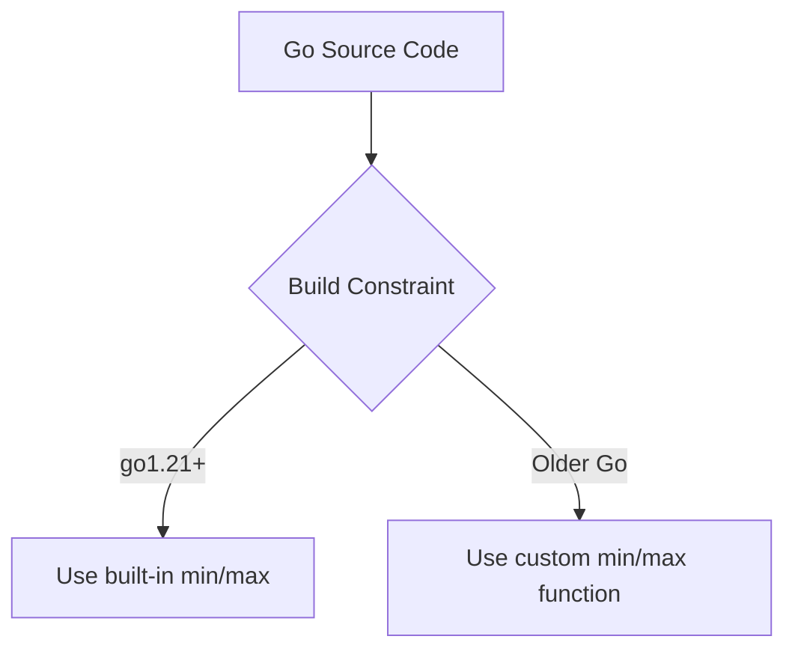
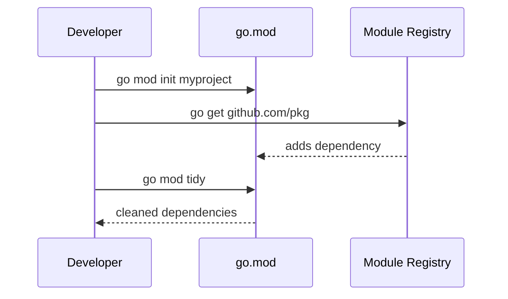
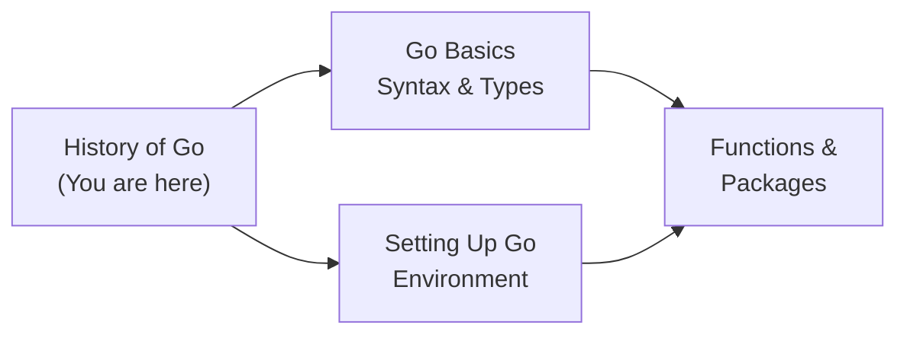
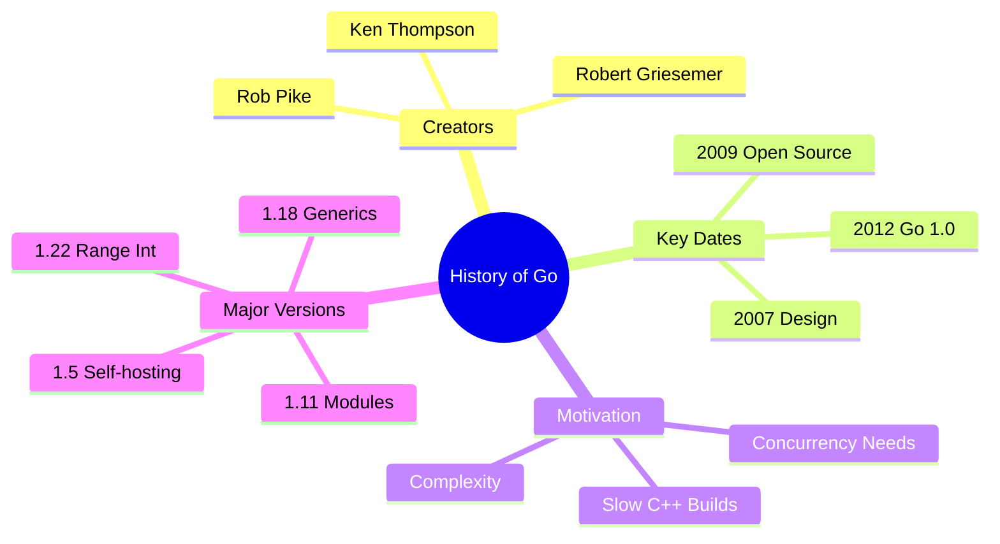
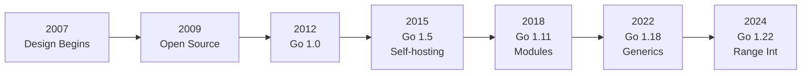

# History of Go — Junior Level

## Table of Contents

1. [Introduction](#introduction)
2. [Prerequisites](#prerequisites)
3. [Glossary](#glossary)
4. [Core Concepts](#core-concepts)
5. [Pros & Cons](#pros--cons)
6. [Use Cases](#use-cases)
7. [Code Examples](#code-examples)
8. [Coding Patterns](#coding-patterns)
9. [Clean Code](#clean-code)
10. [Product Use / Feature](#product-use--feature)
11. [Error Handling](#error-handling)
12. [Security Considerations](#security-considerations)
13. [Performance Tips](#performance-tips)
14. [Metrics & Analytics](#metrics--analytics)
15. [Best Practices](#best-practices)
16. [Edge Cases & Pitfalls](#edge-cases--pitfalls)
17. [Common Mistakes](#common-mistakes)
18. [Tricky Points](#tricky-points)
19. [Test](#test)
20. [Tricky Questions](#tricky-questions)
21. [Cheat Sheet](#cheat-sheet)
22. [Summary](#summary)
23. [What You Can Build](#what-you-can-build)
24. [Further Reading](#further-reading)
25. [Related Topics](#related-topics)
26. [Diagrams & Visual Aids](#diagrams--visual-aids)

---

## Introduction

> Focus: "What is it?" and "How to use it?"

Go (also called Golang) is a programming language created at Google in 2007 by Robert Griesemer, Rob Pike, and Ken Thompson. It was publicly announced as an open-source project in November 2009, and Go 1.0 — the first stable release — shipped in March 2012.

Understanding Go's history helps you appreciate **why** the language looks the way it does. Go was born out of frustration with slow C++ compile times, overly complex codebases, and the difficulty of writing concurrent programs. Knowing this context makes Go's design choices — simplicity, fast compilation, built-in concurrency — feel natural rather than arbitrary.

---

## Prerequisites

- **Required:** Basic programming knowledge (variables, functions, loops) — you need to understand what a programming language does
- **Required:** Familiarity with at least one other language (C, Python, Java) — comparisons will make more sense
- **Helpful but not required:** Basic understanding of compiled vs interpreted languages

---

## Glossary

| Term | Definition |
|------|-----------|
| **Go (Golang)** | A statically typed, compiled programming language designed at Google |
| **Compiler** | A tool that translates source code into machine code (executable binary) |
| **Concurrency** | The ability of a program to handle multiple tasks at the same time |
| **Goroutine** | Go's lightweight thread — a function that runs concurrently |
| **Open Source** | Software whose source code is freely available for anyone to use and modify |
| **Backward Compatibility** | A promise that code written for an older version will still work in newer versions |
| **Go 1 Compatibility Promise** | Google's guarantee that Go 1.x programs will continue to compile and run correctly |
| **Garbage Collection (GC)** | Automatic memory management — the runtime frees memory you no longer use |

---

## Core Concepts

### Concept 1: The Creators

Go was designed by three legendary computer scientists at Google:
- **Rob Pike** — co-created the UTF-8 encoding and the Plan 9 operating system
- **Ken Thompson** — co-created Unix and the C programming language
- **Robert Griesemer** — worked on the V8 JavaScript engine and the Java HotSpot VM

Their combined experience with systems programming led them to design a language that avoids the mistakes of C++ and Java while keeping the performance of compiled languages.

### Concept 2: The Problem Go Solved

In 2007, Google engineers faced daily pain:
- C++ builds took **45 minutes** or more
- Adding a feature to a large codebase was terrifyingly complex
- Writing concurrent code (to use multi-core CPUs) was error-prone
- Dependency management was a nightmare

Go was designed to solve all of these problems at once.

### Concept 3: Key Milestones

- **2007** — Design began at Google
- **November 10, 2009** — Go announced as open source
- **March 28, 2012** — Go 1.0 released with the Go 1 Compatibility Promise
- **August 2015** — Go 1.5: compiler rewritten from C to Go (self-hosting)
- **February 2018** — Go 1.11: Go Modules introduced
- **March 2022** — Go 1.18: Generics added (the most requested feature)
- **August 2023** — Go 1.21: built-in `min`, `max`, `clear` functions
- **February 2024** — Go 1.22: range over integers, improved for-loop variable scoping

### Concept 4: The Go 1 Compatibility Promise

When Go 1.0 was released, the team made a bold promise: **any program written for Go 1.0 will continue to compile and run correctly with future Go 1.x releases.** This means code you write today will still work years from now without modification — a rare guarantee in the programming world.

---

## Real-World Analogies

| Concept | Analogy |
|---------|--------|
| **Go's simplicity** | Like IKEA furniture instructions — minimal parts, clear steps, anyone can assemble it |
| **Go 1 Compatibility Promise** | Like a road system — old cars still drive on new highways; you never have to buy a new car just because the road was repaved |
| **Concurrency in Go** | Like a restaurant kitchen — multiple cooks (goroutines) work on different dishes simultaneously, coordinated by the head chef (scheduler) |

---

## Mental Models

**The intuition:** Think of Go as a "best practices" language. The creators took decades of experience writing C, C++, and other systems languages, identified what caused the most pain, and designed Go to make the painful things impossible or at least easy to avoid.

**Why this model helps:** When you wonder "why doesn't Go have feature X?" the answer is almost always "because feature X caused problems at Google-scale." Understanding this prevents frustration with Go's intentional simplicity.

---

## Pros & Cons

| Pros | Cons |
|------|------|
| Fast compilation — seconds, not minutes | Fewer language features than C++ or Rust |
| Built-in concurrency with goroutines | No generics until Go 1.18 (2022) |
| Strong backward compatibility promise | Verbose error handling (`if err != nil`) |
| Simple syntax — easy to read and learn | No traditional OOP (no classes, no inheritance) |
| Single binary deployment — no runtime dependencies | Garbage collector adds small latency |

### When to use:
- Building web servers, APIs, microservices, CLI tools, and infrastructure software

### When NOT to use:
- Building mobile apps (use Swift/Kotlin), desktop GUIs, or real-time systems requiring sub-microsecond latency

---

## Use Cases

- **Use Case 1:** Building REST API servers — Go's standard library includes a production-ready HTTP server
- **Use Case 2:** Writing CLI tools — Go compiles to a single binary that runs anywhere without dependencies
- **Use Case 3:** Building cloud infrastructure — Docker, Kubernetes, and Terraform are all written in Go

---

## Code Examples

### Example 1: Your First Go Program

```go
// Every Go program starts with a package declaration
package main

// Import the "fmt" package for formatted I/O
import "fmt"

// The main function is the entry point of every Go program
func main() {
    // Print the Go version history
    fmt.Println("Go was designed in 2007")
    fmt.Println("Go was open-sourced in 2009")
    fmt.Println("Go 1.0 was released in 2012")
}
```

**What it does:** Prints three key dates in Go's history.
**How to run:** `go run main.go`

### Example 2: Checking Your Go Version

```go
package main

import (
    "fmt"
    "runtime"
)

func main() {
    // runtime.Version() returns the Go version used to build this binary
    fmt.Println("Go version:", runtime.Version())

    // runtime.GOOS and runtime.GOARCH tell you the OS and architecture
    fmt.Printf("OS: %s, Architecture: %s\n", runtime.GOOS, runtime.GOARCH)

    // runtime.NumCPU() shows how many CPUs Go can use
    // Go was designed for multi-core CPUs — this is why concurrency is built-in
    fmt.Printf("Available CPUs: %d\n", runtime.NumCPU())
}
```

**What it does:** Displays the Go version, operating system, architecture, and CPU count.
**How to run:** `go run main.go`

### Example 3: Go's Concurrency — The Reason Go Exists

```go
package main

import (
    "fmt"
    "sync"
)

func main() {
    // WaitGroup tracks goroutines — a key Go concurrency primitive
    var wg sync.WaitGroup

    milestones := []string{
        "2007: Go design began at Google",
        "2009: Go open-sourced",
        "2012: Go 1.0 released",
        "2015: Go 1.5 — self-hosting compiler",
        "2018: Go 1.11 — Modules introduced",
        "2022: Go 1.18 — Generics added",
    }

    for _, milestone := range milestones {
        wg.Add(1)
        go func(m string) {
            defer wg.Done()
            fmt.Println(m)
        }(milestone)
    }

    wg.Wait()
    fmt.Println("All milestones printed!")
}
```

**What it does:** Prints Go milestones concurrently using goroutines.
**How to run:** `go run main.go`

---

## Coding Patterns

### Pattern 1: Build Constraint for Version-Specific Code

**Intent:** Run different code depending on the Go version.
**When to use:** When you need to use features from a newer Go version but still support older ones.

```go
// This file only compiles with Go 1.21 or later
//go:build go1.21

package main

import "fmt"

func main() {
    // min and max are built-in functions starting from Go 1.21
    a, b := 3, 7
    fmt.Println("Min:", min(a, b))
    fmt.Println("Max:", max(a, b))
}
```

**Diagram:**



**Remember:** Build constraints let you write version-aware code. The `//go:build` directive must be the first line in the file.

---

### Pattern 2: Go Modules — Modern Dependency Management

**Intent:** Manage your project's dependencies — introduced in Go 1.11, standard since Go 1.16.
**When to use:** Every Go project should use modules.

```go
// To initialize a new Go module:
// go mod init myproject

// go.mod file (created automatically):
// module myproject
// go 1.22

package main

import "fmt"

func main() {
    fmt.Println("This project uses Go Modules!")
    fmt.Println("go.mod tracks dependencies and Go version")
}
```

**Diagram:**



---

## Clean Code

### Naming

```go
// Bad naming
func gv() string { return runtime.Version() }
var v = gv()

// Clean naming
func getGoVersion() string { return runtime.Version() }
var goVersion = getGoVersion()
```

**Rules:**
- Variables: describe WHAT they hold (`goVersion`, not `v`, `gv`, `tmp`)
- Functions: describe WHAT they do (`getGoVersion`, not `gv`, `doStuff`)
- Booleans: use `is`, `has`, `can` prefix (`isSupported`, `hasGenerics`)

---

### Functions

```go
// Too long, does too many things
func setup(data []byte) error {
    // 80+ lines doing parse, validate, configure, connect...
    return nil
}

// Single responsibility
func parseConfig(data []byte) (Config, error) { return Config{}, nil }
func validateConfig(c Config) error            { return nil }
func connectDB(c Config) (*DB, error)          { return nil, nil }
```

**Rule:** If you need to scroll to see a function — it does too much. Aim for **20 lines or fewer**.

---

### Comments

```go
// Noise comment (states the obvious)
// print the version
fmt.Println(runtime.Version())

// Explains WHY, not WHAT
// Use runtime.Version() instead of hardcoding — the version changes with each release
fmt.Println(runtime.Version())
```

**Rule:** Good code explains itself. Comments explain **why**, not **what**.

---

## Product Use / Feature

### 1. Docker

- **How it uses Go's history:** Docker was one of the first major projects built in Go (2013). It leveraged Go's fast compilation, static binaries, and strong concurrency support.
- **Why it matters:** Docker proved that Go could build production-grade infrastructure software.

### 2. Kubernetes

- **How it uses Go's history:** Kubernetes (2014) was built in Go because Google already had deep Go expertise. Its massive concurrent workload management relies on goroutines.
- **Why it matters:** Kubernetes becoming the industry standard for container orchestration made Go a must-learn language for DevOps and cloud engineering.

### 3. Terraform

- **How it uses Go's history:** HashiCorp chose Go for Terraform because Go's single-binary deployment made distributing CLI tools simple across all platforms.
- **Why it matters:** Terraform's success demonstrated Go's strength in building cross-platform developer tools.

---

## Error Handling

### Error 1: "go: go.mod file not found"

```go
// Running `go run main.go` outside a module
// Error: go: go.mod file not found in current directory or any parent directory
```

**Why it happens:** Since Go 1.16, Go requires a `go.mod` file. Before modules (Go 1.11), this was not needed.
**How to fix:**

```go
// Run this command in your project directory:
// go mod init myproject

// Then your code will compile:
package main

import "fmt"

func main() {
    fmt.Println("Module initialized!")
}
```

### Error 2: "cannot use generic features"

```go
// Trying to use generics in Go < 1.18
// Error: type parameter requires go1.18 or later
```

**Why it happens:** Generics were added in Go 1.18 (March 2022). Older Go versions do not support them.
**How to fix:**

```go
// Update your Go version to 1.18+ and set go.mod:
// go 1.18

// Then generics work:
package main

import "fmt"

func PrintAny[T any](value T) {
    fmt.Println(value)
}

func main() {
    PrintAny(42)
    PrintAny("hello")
}
```

### Error Handling Pattern

```go
package main

import (
    "fmt"
    "os/exec"
)

func main() {
    // Check Go version on the system
    output, err := exec.Command("go", "version").Output()
    if err != nil {
        fmt.Printf("Error checking Go version: %v\n", err)
        return
    }
    fmt.Println(string(output))
}
```

---

## Security Considerations

### 1. Keeping Go Updated

```go
// Insecure: using an old Go version with known vulnerabilities
// go 1.16 (has known security issues)

// Secure: using a recent Go version
// go 1.22 (latest security patches)
```

**Risk:** Older Go versions may have unpatched security vulnerabilities in the standard library (crypto, net/http, etc.).
**Mitigation:** Regularly update Go with `go install golang.org/dl/go1.22@latest` and run `govulncheck ./...` to scan for known vulnerabilities.

### 2. Checking Dependencies for Vulnerabilities

```go
// Run this command to check for known vulnerabilities
// go install golang.org/x/vuln/cmd/govulncheck@latest
// govulncheck ./...

package main

import "fmt"

func main() {
    fmt.Println("Always run govulncheck before deploying!")
}
```

**Risk:** Third-party dependencies may contain security flaws.
**Mitigation:** Use `govulncheck` (introduced as an official tool) and keep dependencies updated with `go get -u ./...`.

---

## Performance Tips

### Tip 1: Use the Latest Go Version

```go
// Older Go versions have slower garbage collector and compiler
// Go 1.5: major GC improvements (sub-10ms pauses)
// Go 1.22: even faster compilation and runtime performance

// Simply upgrading Go version can give you free performance gains
package main

import (
    "fmt"
    "runtime"
)

func main() {
    fmt.Printf("Running Go %s — newer is usually faster!\n", runtime.Version())
}
```

**Why it's faster:** Each Go release includes compiler optimizations, GC improvements, and standard library performance enhancements — you get free speed just by upgrading.

### Tip 2: Use Go Modules for Reproducible Builds

```go
// go.mod ensures everyone on the team uses the same Go version
// module myproject
// go 1.22

// This prevents "works on my machine" problems
package main

import "fmt"

func main() {
    fmt.Println("Consistent builds with Go Modules!")
}
```

**Why it helps:** Reproducible builds prevent subtle performance and behavior differences between environments.

---

## Metrics & Analytics

### What to Measure

| Metric | Why it matters | Tool |
|--------|---------------|------|
| **Go version in production** | Ensures you have latest security patches and performance | `runtime.Version()` |
| **Build time** | Go was designed for fast builds — monitor this | `time go build ./...` |

### Basic Instrumentation

```go
package main

import (
    "expvar"
    "fmt"
    "runtime"
)

var goVersionMetric = expvar.NewString("go.version")

func init() {
    goVersionMetric.Set(runtime.Version())
}

func main() {
    fmt.Println("Go version metric registered:", runtime.Version())
}
```

---

## Best Practices

- **Always use the latest stable Go version** — each release includes performance improvements, bug fixes, and security patches
- **Always use Go Modules** — `go mod init` is the first command for any new project
- **Set the `go` directive in go.mod** — this ensures your project uses the correct minimum Go version
- **Read the release notes** — each Go release has a blog post explaining what changed and why

---

## Edge Cases & Pitfalls

### Pitfall 1: Assuming All Go 1.x Versions Are Identical

```go
package main

import "fmt"

func main() {
    // This code works in Go 1.21+ but NOT in older versions
    result := min(3, 7) // built-in min added in Go 1.21
    fmt.Println(result)
}
```

**What happens:** Compilation fails on Go versions before 1.21 with `undefined: min`.
**How to fix:** Check the `go` directive in your `go.mod` file and ensure your team uses the correct Go version.

### Pitfall 2: For-Loop Variable Capture Changed in Go 1.22

```go
package main

import "fmt"

func main() {
    funcs := []func(){}
    for i := 0; i < 3; i++ {
        funcs = append(funcs, func() {
            fmt.Println(i)
        })
    }
    for _, f := range funcs {
        f()
    }
    // Go < 1.22: prints 3, 3, 3 (shared variable)
    // Go >= 1.22: prints 0, 1, 2 (per-iteration variable)
}
```

**What happens:** The behavior of loop variable capture changed in Go 1.22. Old code may behave differently.
**How to fix:** Set `go 1.22` in your `go.mod` to get the new behavior, or explicitly copy the variable in older versions.

---

## Common Mistakes

### Mistake 1: Using GOPATH instead of Go Modules

```go
// Wrong way (pre-Go 1.11 style)
// Put code in $GOPATH/src/github.com/user/project/

// Correct way (Go 1.16+)
// Use go mod init anywhere on your filesystem
// go mod init github.com/user/project
```

### Mistake 2: Hardcoding Go Version Information

```go
package main

import (
    "fmt"
    "runtime"
)

func main() {
    // Wrong — hardcoded version string that becomes stale
    // fmt.Println("Go version: 1.19")

    // Correct — dynamically get the version
    fmt.Println("Go version:", runtime.Version())
}
```

---

## Common Misconceptions

### Misconception 1: "Go is made by Google, so it could be abandoned anytime"

**Reality:** Go is fully open source under a BSD license. Even if Google stopped supporting it, the community could continue development. Additionally, Google uses Go extensively internally (YouTube, Google Cloud, etc.), making abandonment extremely unlikely.

**Why people think this:** Google has a history of discontinuing products (Google Reader, Google+, etc.), but Go is infrastructure — not a consumer product.

### Misconception 2: "Go is just a simpler C"

**Reality:** While Go's creators had deep C/Unix experience, Go has garbage collection, goroutines, interfaces, built-in maps and slices, and a rich standard library. Go is a modern language that happens to value simplicity like C did.

**Why people think this:** Go's syntax looks C-like, and Ken Thompson co-created C.

### Misconception 3: "Go doesn't have generics"

**Reality:** Go added generics in version 1.18 (March 2022). This was the most requested feature for years. Today Go has full support for type parameters.

**Why people think this:** For 13 years (2009-2022), Go indeed lacked generics, and many blog posts from that era still appear in search results.

---

## Tricky Points

### Tricky Point 1: The `go` Directive in go.mod Affects Behavior

```go
// go.mod with go 1.21:
// module example
// go 1.21

package main

import "fmt"

func main() {
    // With go 1.21 in go.mod, you can use min/max
    fmt.Println(min(3, 7))

    // But if go.mod says "go 1.20", this will NOT compile
    // even if your Go toolchain is 1.22!
}
```

**Why it's tricky:** The `go` directive in `go.mod` controls which language features are available, not just the minimum version required. Changing this one line can break or fix your code.
**Key takeaway:** The `go` directive is a language version selector, not just documentation.

---

## Test

### Multiple Choice

**1. Who created Go?**

- A) Guido van Rossum, James Gosling, Bjarne Stroustrup
- B) Rob Pike, Ken Thompson, Robert Griesemer
- C) Linus Torvalds, Dennis Ritchie, Brian Kernighan
- D) Larry Page, Sergey Brin, Eric Schmidt

<details>
<summary>Answer</summary>
**B)** — Rob Pike, Ken Thompson, and Robert Griesemer designed Go at Google starting in 2007. Option A lists the creators of Python, Java, and C++. Option C lists famous systems programmers not involved with Go. Option D lists Google founders, not language designers.
</details>

**2. When was Go 1.0 released?**

- A) 2007
- B) 2009
- C) 2012
- D) 2015

<details>
<summary>Answer</summary>
**C)** — Go 1.0 was released on March 28, 2012. 2007 is when design began, 2009 is when Go was open-sourced, and 2015 is when Go 1.5 (self-hosting compiler) was released.
</details>

### True or False

**3. Go was created because Google engineers were frustrated with slow C++ compile times.**

<details>
<summary>Answer</summary>
**True** — Rob Pike has explicitly stated that the idea for Go was born during a 45-minute C++ compilation. The long wait gave them time to discuss what a better language would look like.
</details>

**4. Go has always had generics since version 1.0.**

<details>
<summary>Answer</summary>
**False** — Generics were added in Go 1.18 (March 2022), thirteen years after Go's initial release. Before that, Go developers used interfaces and code generation as alternatives.
</details>

### What's the Output?

**5. What does this code print?**

```go
package main

import (
    "fmt"
    "runtime"
)

func main() {
    version := runtime.Version()
    fmt.Println(version[:2])
}
```

<details>
<summary>Answer</summary>
Output: `go`
Explanation: `runtime.Version()` returns a string like `"go1.22.1"`. The slice `[:2]` takes the first two characters, which is `"go"`.
</details>

**6. What happens when you compile this code with Go 1.20?**

```go
package main

import "fmt"

func main() {
    fmt.Println(min(5, 3))
}
```

<details>
<summary>Answer</summary>
**Compilation error:** `undefined: min`. The built-in `min` function was added in Go 1.21. In Go 1.20, you would need to write your own min function.
</details>

---

## "What If?" Scenarios

**What if Google decided to stop developing Go?**
- **You might think:** Go would die and your code would become useless.
- **But actually:** Go is open source (BSD license). The community could fork and continue development, just like many other open-source projects. Your existing Go binaries would still run, and the Go 1 Compatibility Promise means your code remains valid.

---

## Tricky Questions

**1. Which Go version introduced the self-hosting compiler (Go compiler written in Go)?**

- A) Go 1.0
- B) Go 1.3
- C) Go 1.5
- D) Go 1.11

<details>
<summary>Answer</summary>
**C)** — Go 1.5 (August 2015) was the first version where the Go compiler was written entirely in Go. Before that, the compiler was written in C. This was a major milestone called "self-hosting." Option D (Go 1.11) introduced modules, not the self-hosting compiler.
</details>

**2. What does the Go 1 Compatibility Promise guarantee?**

- A) All Go programs will run 10x faster in each new version
- B) Programs written for Go 1.0 will compile and run with future Go 1.x releases
- C) The Go standard library will never add new functions
- D) Go will never change its syntax

<details>
<summary>Answer</summary>
**B)** — The Go 1 Compatibility Promise states that programs conforming to the Go 1 specification will continue to compile and run correctly in future Go 1.x versions. It does NOT guarantee performance improvements (A), a frozen standard library (C), or no syntax changes (D — new features like generics were added).
</details>

**3. Why did Go initially NOT include generics?**

- A) The creators did not know what generics were
- B) Generics were impossible to implement in Go
- C) The creators prioritized simplicity and wanted to find the right design before adding complexity
- D) Google banned the use of generics

<details>
<summary>Answer</summary>
**C)** — The Go team deliberately delayed generics to avoid adding the wrong abstraction. They studied many designs over 10+ years before settling on the type parameter approach in Go 1.18. Rob Pike has said they preferred "no generics" to "bad generics."
</details>

---

## Cheat Sheet

| What | Syntax / Command | Example |
|------|-----------------|---------|
| Check Go version | `go version` | `go version go1.22.1 linux/amd64` |
| Initialize a module | `go mod init <name>` | `go mod init myproject` |
| Get Go version in code | `runtime.Version()` | `"go1.22.1"` |
| Check OS/Arch | `runtime.GOOS`, `runtime.GOARCH` | `"linux"`, `"amd64"` |
| Set minimum Go version | `go` directive in go.mod | `go 1.22` |
| Update dependencies | `go get -u ./...` | Updates all deps |
| Check vulnerabilities | `govulncheck ./...` | Scans for known CVEs |

---

## Self-Assessment Checklist

### I can explain:
- [ ] What Go is and who created it
- [ ] When Go was designed, open-sourced, and reached 1.0
- [ ] Why Go was created (C++ frustration, concurrency, simplicity)
- [ ] What the Go 1 Compatibility Promise means

### I can do:
- [ ] Check my Go version using `go version` and `runtime.Version()`
- [ ] Initialize a Go module with `go mod init`
- [ ] Write and run a basic Go program
- [ ] Read Go release notes to understand what changed

### I can answer:
- [ ] All multiple choice questions in this document

---

## Summary

- Go was created at Google in 2007 by Rob Pike, Ken Thompson, and Robert Griesemer to solve real engineering pain (slow builds, complex code, poor concurrency support)
- Go 1.0 shipped in 2012 with a backward compatibility guarantee
- Key milestones include self-hosting compiler (1.5), modules (1.11), and generics (1.18)
- Go's design philosophy is intentional simplicity — every feature was carefully considered before inclusion

**Next step:** Learn about Go's basic syntax: packages, imports, variables, and the `main` function.

---

## What You Can Build

### Projects you can create:
- **Version Checker Tool:** A CLI that checks and displays the current Go version and environment info
- **Go Timeline App:** A web page that displays Go's version history in a visual timeline
- **Module Inspector:** A tool that reads `go.mod` files and reports the minimum Go version required

### Learning path — what to study next:



---

## Further Reading

- **Official docs:** [The Go Programming Language](https://go.dev)
- **Blog post:** [Go at Google: Language Design in the Service of Software Engineering](https://go.dev/talks/2012/splash.article) — Rob Pike explains why Go was created
- **Video:** [Go Proverbs — Rob Pike](https://www.youtube.com/watch?v=PAAkCSZUG1c) — 20 min, the philosophy behind Go's design
- **Blog post:** [Go 1 and the Future of Go Programs](https://go.dev/doc/go1compat) — the official Go 1 Compatibility Promise

---

## Related Topics

- **Go Basics** — the syntax and fundamentals you learn after understanding Go's history
- **Setting Up Go** — installing and configuring your Go environment

---

## Diagrams & Visual Aids

### Mind Map



### Go Timeline Flowchart



### Go's Design Philosophy

```
+------------------------------------------+
|          Go Design Principles            |
|------------------------------------------|
| Simplicity    | Less is more             |
| Readability   | Code is read > written   |
| Concurrency   | Built-in goroutines      |
| Fast Builds   | Seconds, not minutes     |
| Compatibility | Go 1 Promise             |
+------------------------------------------+
```
