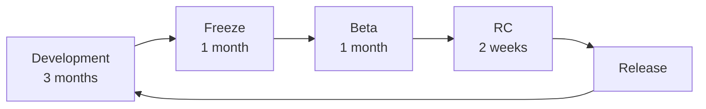
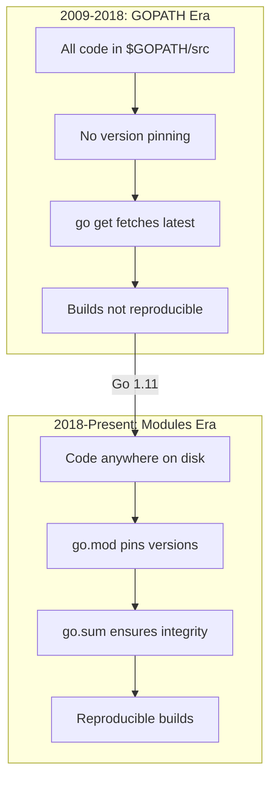
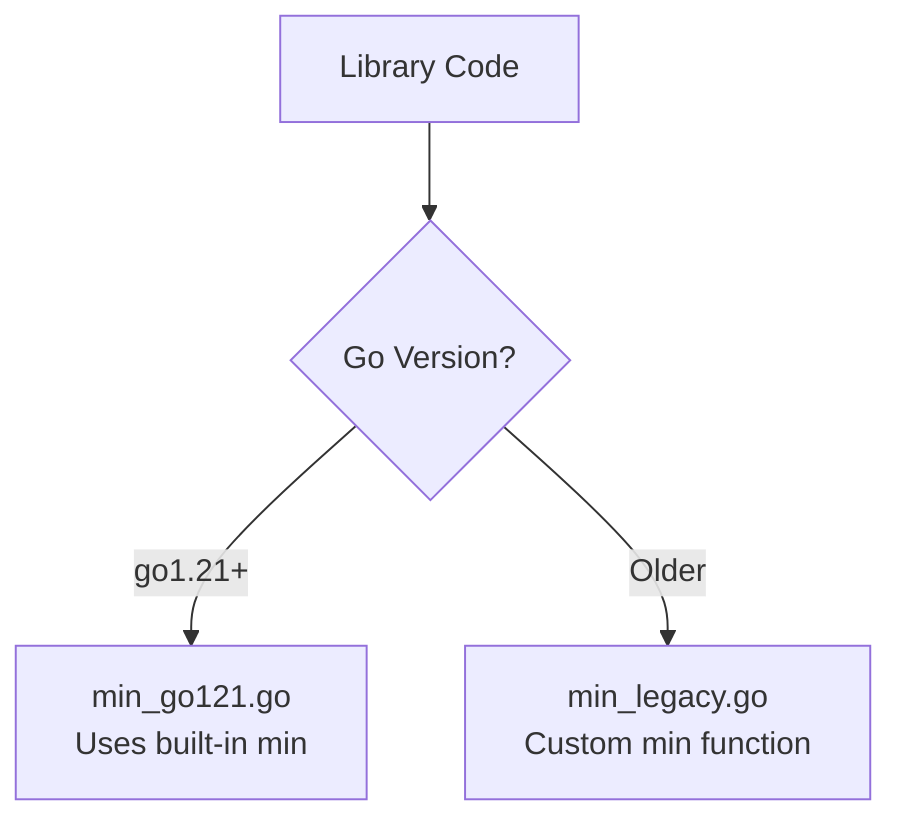
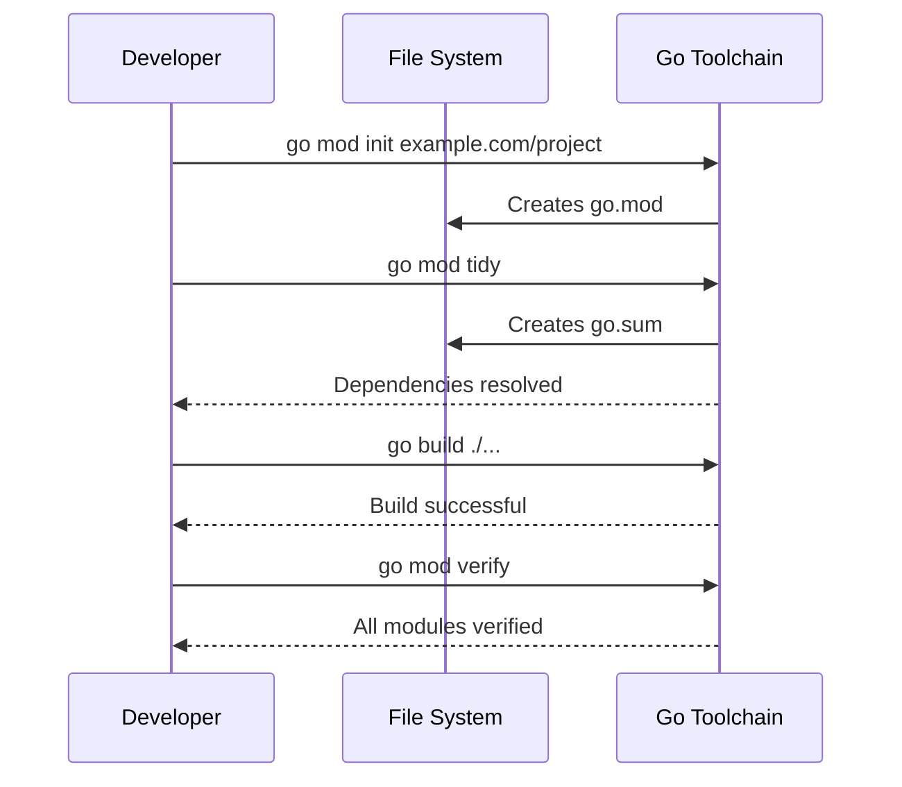
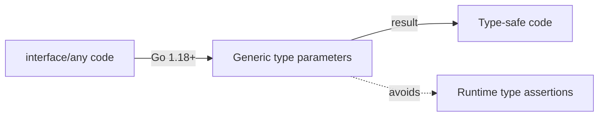
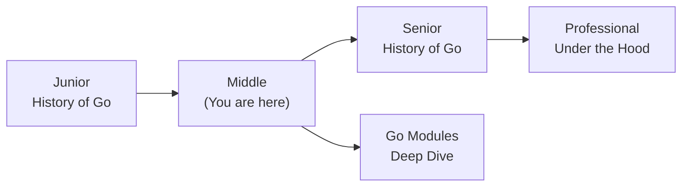
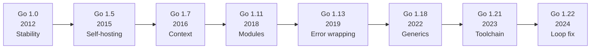

# History of Go — Middle Level

## Table of Contents

1. [Introduction](#introduction)
2. [Core Concepts](#core-concepts)
3. [Evolution & Historical Context](#evolution--historical-context)
4. [Pros & Cons](#pros--cons)
5. [Alternative Approaches](#alternative-approaches-plan-b)
6. [Use Cases](#use-cases)
7. [Code Examples](#code-examples)
8. [Coding Patterns](#coding-patterns)
9. [Clean Code](#clean-code)
10. [Product Use / Feature](#product-use--feature)
11. [Error Handling](#error-handling)
12. [Security Considerations](#security-considerations)
13. [Performance Optimization](#performance-optimization)
14. [Metrics & Analytics](#metrics--analytics)
15. [Debugging Guide](#debugging-guide)
16. [Best Practices](#best-practices)
17. [Edge Cases & Pitfalls](#edge-cases--pitfalls)
18. [Common Mistakes](#common-mistakes)
19. [Tricky Points](#tricky-points)
20. [Comparison with Other Languages](#comparison-with-other-languages)
21. [Test](#test)
22. [Tricky Questions](#tricky-questions)
23. [Cheat Sheet](#cheat-sheet)
24. [Summary](#summary)
25. [What You Can Build](#what-you-can-build)
26. [Further Reading](#further-reading)
27. [Related Topics](#related-topics)
28. [Diagrams & Visual Aids](#diagrams--visual-aids)

---

## Introduction

> Focus: "Why?" and "When to use?"

Assumes the reader already knows the basics of Go's origin story. This level covers:
- **Why** specific design decisions were made at each stage of Go's evolution
- How Go's version history affects the code you write today
- How to navigate version-specific features in production codebases
- The reasoning behind Go's evolution compared to other languages

---

## Core Concepts

### Concept 1: Go's Version Evolution Strategy

Go follows a strict release cadence: **two major releases per year** (February and August), each identified as Go 1.X. Every release goes through a development freeze, beta, release candidate, and final release cycle.



Key version milestones and their architectural reasoning:

| Version | Year | Key Feature | Why It Was Added |
|---------|------|-------------|------------------|
| 1.0 | 2012 | Stability guarantee | Enable enterprise adoption |
| 1.5 | 2015 | Self-hosting compiler | Remove C dependency, enable Go-specific optimizations |
| 1.7 | 2016 | `context` package | Standardize cancellation/timeout propagation |
| 1.11 | 2018 | Go Modules | Replace GOPATH chaos with reproducible builds |
| 1.13 | 2019 | Error wrapping (`%w`) | Standardize error chain inspection |
| 1.14 | 2020 | Go Module mirror/checksum | Supply chain security |
| 1.16 | 2021 | `embed` package, Modules default | Embed static files, finalize module transition |
| 1.18 | 2022 | Generics, fuzzing | Type safety without code generation |
| 1.21 | 2023 | Built-in `min`/`max`/`clear`, `log/slog` | Reduce boilerplate, structured logging |
| 1.22 | 2024 | Range over int, loop var fix | Fix long-standing gotcha, improve ergonomics |
| 1.23 | 2024 | Iterator functions, `unique` | Standardize iteration patterns |

### Concept 2: The Design Decision Framework

Every Go feature goes through a rigorous process. The Go team evaluates features on four axes:

1. **Simplicity** — Does it keep the language simple?
2. **Readability** — Does it make code easier to read?
3. **Orthogonality** — Does it compose well with existing features?
4. **Scalability** — Does it work at Google-scale codebases (millions of lines)?

This is why generics took 13 years. Multiple proposals were rejected because they failed one or more of these criteria.

---

## Evolution & Historical Context

**Before Go (the problems):**
- C++ builds at Google took 45+ minutes for large projects
- Complex dependency graphs caused cascading recompilations
- No standardized dependency management (each team had custom solutions)
- Writing concurrent code in C++/Java was error-prone (threads, locks, mutexes)
- Dynamic languages (Python, Ruby) were too slow for infrastructure

**How Go changed things:**
- **Fast compilation:** Go's import system was designed so the compiler only reads the direct imports, not transitive dependencies — compilation is O(n) not O(n^2)
- **Standardized tooling:** `go fmt`, `go vet`, `go test` built into the standard distribution — no more "which linter/formatter should we use?" debates
- **Concurrency as a first-class feature:** goroutines and channels made concurrent programming accessible to average developers, not just experts

**The GOPATH era vs Modules era:**



---

## Pros & Cons

| Pros | Cons |
|------|------|
| Predictable release cadence (2x/year) — easy to plan upgrades | Conservative feature additions — sometimes frustratingly slow |
| Go 1 Compatibility Promise — old code always works | Backward compatibility limits ability to fix design mistakes |
| Each release includes free performance improvements | Breaking changes to standard library are nearly impossible |
| Strong tooling evolves with the language | Major features (generics) can take a decade |

### Trade-off analysis:
- **Stability vs innovation:** Go heavily favors stability. The Go 1 Compatibility Promise means you can upgrade Go versions without changing code, but it also means the language cannot fix legacy design issues easily.
- **Simplicity vs expressiveness:** The deliberate omission of features (enums, sum types, method overloading) keeps Go simple but can lead to boilerplate.

### Comparison with alternatives:

| Approach | Pros | Cons | Best for |
|----------|------|------|----------|
| Go's conservative evolution | Stability, predictability | Slow feature adoption | Enterprise, infrastructure |
| Rust's edition system | Can fix past mistakes | More complex upgrade path | Systems, safety-critical |
| Python's breaking changes (2→3) | Clean slate | Decade-long migration pain | Scripting, ML/AI |

---

## Alternative Approaches (Plan B)

| Alternative | How it works | When you might be forced to use it |
|-------------|--------------|-------------------------------------|
| **Rust** | Memory safety without GC, edition-based evolution | When you need zero-cost abstractions and no GC pauses |
| **Java** | Mature ecosystem, preview features system | When enterprise ecosystem (Spring, Hibernate) is required |

---

## Use Cases

- **Use Case 1:** Migrating a legacy Go codebase from GOPATH to Go Modules — understanding the history helps avoid migration pitfalls
- **Use Case 2:** Deciding which Go version to set in `go.mod` for a new project — balancing feature availability with deployment compatibility
- **Use Case 3:** Upgrading Go versions in CI/CD pipelines — understanding what changed between versions prevents surprises

---

## Code Examples

### Example 1: Version-Aware Feature Detection

```go
package main

import (
    "fmt"
    "runtime"
    "strings"
)

// parseGoVersion extracts the major.minor version from runtime.Version()
func parseGoVersion() (int, int) {
    v := runtime.Version()
    // runtime.Version() returns "go1.22.1" format
    v = strings.TrimPrefix(v, "go")
    parts := strings.Split(v, ".")
    if len(parts) < 2 {
        return 0, 0
    }
    var major, minor int
    fmt.Sscanf(parts[0], "%d", &major)
    fmt.Sscanf(parts[1], "%d", &minor)
    return major, minor
}

func main() {
    major, minor := parseGoVersion()
    fmt.Printf("Go %d.%d\n", major, minor)

    // Feature availability based on version
    features := []struct {
        name     string
        minMinor int
    }{
        {"Go Modules", 11},
        {"Error wrapping (%w)", 13},
        {"embed package", 16},
        {"Generics", 18},
        {"log/slog", 21},
        {"Range over int", 22},
        {"Iterators", 23},
    }

    for _, f := range features {
        status := "available"
        if minor < f.minMinor {
            status = "NOT available"
        }
        fmt.Printf("  %-25s (Go 1.%d+): %s\n", f.name, f.minMinor, status)
    }
}
```

**Why this pattern:** In production, you sometimes need to verify which features are available in the current runtime. This is especially useful for libraries that must support multiple Go versions.
**Trade-offs:** Checking at runtime is rare in Go — build constraints (`//go:build`) are preferred for compile-time version selection.

### Example 2: Comparing Error Handling Evolution

```go
package main

import (
    "errors"
    "fmt"
)

// --- Pre Go 1.13 style: string comparison ---
func oldStyleError() error {
    return fmt.Errorf("database connection failed")
}

func handleOldStyle() {
    err := oldStyleError()
    if err != nil {
        // Fragile: breaks if error message changes
        if err.Error() == "database connection failed" {
            fmt.Println("Old style: matched by string")
        }
    }
}

// --- Go 1.13+ style: error wrapping with %w ---
var ErrConnection = errors.New("connection failed")

func newStyleError() error {
    return fmt.Errorf("database: %w", ErrConnection)
}

func handleNewStyle() {
    err := newStyleError()
    if err != nil {
        // Robust: works even if error message is wrapped multiple times
        if errors.Is(err, ErrConnection) {
            fmt.Println("New style: matched by errors.Is")
        }
        fmt.Println("Full error:", err)
    }
}

func main() {
    handleOldStyle()
    handleNewStyle()
}
```

**When to use which:** Always use Go 1.13+ error wrapping in new code. Use `errors.Is` and `errors.As` instead of string matching.

---

## Coding Patterns

### Pattern 1: Build Constraints for Multi-Version Support

**Category:** Idiomatic Go
**Intent:** Support multiple Go versions in a single codebase
**When to use:** When maintaining a library that must work with older Go versions
**When NOT to use:** Application code where you control the Go version

**Structure diagram:**



**Implementation:**

```go
// File: min_go121.go
//go:build go1.21

package mathutil

// Min uses the built-in min function (Go 1.21+)
func Min(a, b int) int {
    return min(a, b)
}
```

```go
// File: min_legacy.go
//go:build !go1.21

package mathutil

// Min provides min for Go versions before 1.21
func Min(a, b int) int {
    if a < b {
        return a
    }
    return b
}
```

**Trade-offs:**

| Pros | Cons |
|---------|---------|
| Library works on multiple Go versions | More files to maintain |
| Users don't need to upgrade Go | Testing matrix grows |

---

### Pattern 2: Module Version Migration

**Category:** Idiomatic Go / Project Management
**Intent:** Properly migrate a project from GOPATH to Go Modules

**Flow diagram:**



```go
// After migration, your code looks the same
// But imports are now tracked in go.mod
package main

import (
    "fmt"
    "example.com/project/internal/config"
)

func main() {
    cfg := config.Load()
    fmt.Printf("Project: %s\n", cfg.Name)
}
```

---

### Pattern 3: Generics Migration — Interface{} to Type Parameters

**Category:** Idiomatic Go
**Intent:** Modernize pre-1.18 code that used `interface{}` to use type parameters



```go
package main

import "fmt"

// Pre-generics (Go < 1.18): uses interface{}, needs type assertion
func containsOld(slice []interface{}, target interface{}) bool {
    for _, v := range slice {
        if v == target {
            return true
        }
    }
    return false
}

// Post-generics (Go 1.18+): type-safe at compile time
func contains[T comparable](slice []T, target T) bool {
    for _, v := range slice {
        if v == target {
            return true
        }
    }
    return false
}

func main() {
    // Old way: no compile-time type safety
    fmt.Println(containsOld([]interface{}{1, 2, 3}, 2))

    // New way: compiler catches type mismatches
    fmt.Println(contains([]int{1, 2, 3}, 2))
    fmt.Println(contains([]string{"a", "b", "c"}, "b"))
}
```

---

## Clean Code

### Naming & Readability

```go
// Cryptic
func chk(v string) bool { return len(v) > 0 }

// Self-documenting
func isGoVersionSupported(version string) bool { return len(version) > 0 }
```

| Element | Rule | Example |
|---------|------|---------|
| Functions | Verb + noun, describes action | `parseGoVersion`, `checkCompatibility` |
| Variables | Noun, describes content | `currentVersion`, `releaseDate` |
| Booleans | `is/has/can` prefix | `isModuleEnabled`, `hasGenerics` |
| Constants | Descriptive | `MinGoVersion`, `DefaultModulePath` |

---

### SOLID in Go

**Single Responsibility:**
```go
// One struct doing everything
type VersionManager struct { /* checks, parses, downloads, installs */ }

// Each type has one reason to change
type VersionParser interface { Parse(s string) (Version, error) }
type VersionChecker interface { IsSupported(v Version) bool }
type VersionInstaller struct { parser VersionParser }
```

**Open/Closed (via interfaces):**
```go
// Switch on version — breaks on every new version
func handleVersion(v string) { switch v { case "1.21": /* ... */ case "1.22": /* ... */ } }

// Open for extension via interface
type VersionHandler interface { Handle(v Version) error }
```

---

### Function Design

| Signal | Smell | Fix |
|--------|-------|-----|
| > 20 lines | Does too much | Split into smaller functions |
| > 3 parameters | Complex signature | Use options struct |
| Deep nesting (> 3 levels) | Spaghetti logic | Early returns, extract helpers |
| Boolean parameter | Flags a violation | Split into two functions |

---

## Product Use / Feature

### 1. Google (Internal)

- **How it uses Go's history:** Google migrated many internal services from C++ and Java to Go, driven by faster build times and lower operational complexity.
- **Scale:** Thousands of Go services handling billions of requests daily.
- **Key insight:** Google's internal experience directly shapes Go's evolution — features like `context.Context` were designed for Google's distributed systems before being open-sourced.

### 2. Uber

- **How it uses Go's history:** Uber adopted Go around 2015 for their highest-throughput microservices, replacing Node.js and Python services.
- **Scale:** Their Go services handle millions of requests per second with predictable latency.
- **Key insight:** Go's GC improvements (1.5+) were critical for Uber's low-latency requirements.

### 3. Cloudflare

- **How it uses Go's history:** Cloudflare builds much of their edge computing infrastructure in Go, including their DNS server and access control systems.
- **Key insight:** They have contributed back to Go, particularly around performance and networking improvements.

---

## Error Handling

### Pattern 1: Error wrapping with context (Go 1.13+)

```go
package main

import (
    "errors"
    "fmt"
)

var ErrVersionNotFound = errors.New("version not found")

func lookupVersion(name string) (string, error) {
    versions := map[string]string{
        "modules": "1.11",
        "generics": "1.18",
    }
    v, ok := versions[name]
    if !ok {
        return "", fmt.Errorf("lookupVersion %q: %w", name, ErrVersionNotFound)
    }
    return v, nil
}

func main() {
    _, err := lookupVersion("pattern-matching")
    if errors.Is(err, ErrVersionNotFound) {
        fmt.Println("Feature not yet in Go:", err)
    }
}
```

### Common Error Patterns

| Situation | Pattern | Example |
|-----------|---------|---------|
| Wrapping errors | `fmt.Errorf("context: %w", err)` | Add context to errors |
| Checking error type | `errors.Is(err, target)` | Check specific error (Go 1.13+) |
| Extracting error | `errors.As(err, &target)` | Get typed error info (Go 1.13+) |
| Sentinel errors | `var ErrNotFound = errors.New("not found")` | Predefined errors |

---

## Security Considerations

### 1. Dependency Supply Chain Attacks

**Risk level:** High

```go
// Before Go 1.14: no checksum verification
// go get github.com/malicious/package  -- could be tampered with

// Go 1.14+: checksum database (sum.golang.org)
// go.sum file records expected checksums
// Tampering is automatically detected
```

**Attack vector:** An attacker modifies a popular Go module's source code after it has been published.
**Impact:** Malicious code runs in your production environment.
**Mitigation:** Go 1.14+ uses `sum.golang.org` to verify module integrity. Never set `GONOSUMCHECK` in production.

### Security Checklist

- [ ] Use latest Go version — each release includes security patches
- [ ] Run `govulncheck ./...` in CI pipeline
- [ ] Set `GOFLAGS=-mod=readonly` in CI to prevent unauthorized dependency changes
- [ ] Review go.sum changes in every pull request

---

## Performance Optimization

### Optimization 1: GC Improvements Across Go Versions

```go
package main

import (
    "fmt"
    "runtime"
    "time"
)

func allocateWork() {
    // Simulate allocation-heavy workload
    data := make([][]byte, 10000)
    for i := range data {
        data[i] = make([]byte, 1024)
    }
    _ = data
}

func main() {
    // Measure GC pause time — this has improved dramatically across Go versions
    // Go 1.4: 300ms+ pauses
    // Go 1.5: <10ms pauses (concurrent GC)
    // Go 1.8: <1ms pauses
    // Go 1.19: GOMEMLIMIT for better memory management

    var stats runtime.MemStats
    start := time.Now()
    for i := 0; i < 100; i++ {
        allocateWork()
    }
    runtime.ReadMemStats(&stats)
    fmt.Printf("Go version: %s\n", runtime.Version())
    fmt.Printf("Time: %v\n", time.Since(start))
    fmt.Printf("GC cycles: %d\n", stats.NumGC)
    fmt.Printf("Total GC pause: %v\n", time.Duration(stats.PauseTotalNs))
}
```

**Benchmark results (approximate across versions):**
```
Go 1.4:   Total GC pause: ~300ms
Go 1.5:   Total GC pause: ~8ms
Go 1.8:   Total GC pause: ~0.5ms
Go 1.19+: Total GC pause: ~0.3ms (with GOMEMLIMIT)
```

**When to optimize:** Upgrading Go version is the easiest optimization — always try it first.

### Performance Decision Matrix

| Scenario | Approach | Why |
|----------|----------|-----|
| High GC pressure | Upgrade Go version first | Free improvements |
| Legacy GOPATH project | Migrate to Modules | Better dependency caching |
| Slow compilation | Use Go 1.20+ build cache | Incremental builds |

---

## Metrics & Analytics

### Key Metrics

| Metric | Type | Description | Alert threshold |
|--------|------|-------------|-----------------|
| **go_version** | Gauge | Current Go version in production | < latest-2 versions |
| **go_build_time_seconds** | Histogram | Build time for CI pipeline | p99 > 300s |
| **go_dependency_age_days** | Gauge | Age of oldest dependency | > 365 days |

### Prometheus Instrumentation

```go
package main

import (
    "fmt"
    "runtime"

    "github.com/prometheus/client_golang/prometheus"
)

var goVersionInfo = prometheus.NewGaugeVec(
    prometheus.GaugeOpts{
        Name: "go_build_info",
        Help: "Go version used to build this binary",
    },
    []string{"version"},
)

func init() {
    goVersionInfo.WithLabelValues(runtime.Version()).Set(1)
    prometheus.MustRegister(goVersionInfo)
}

func main() {
    fmt.Printf("Registered Go version metric: %s\n", runtime.Version())
}
```

---

## Debugging Guide

### Problem 1: "Module requires Go >= 1.X" errors

**Symptoms:** `go build` fails with message about Go version being too old.

**Diagnostic steps:**
```bash
go version
cat go.mod | grep "^go "
```

**Root cause:** The `go.mod` file specifies a minimum Go version higher than your installed version.
**Fix:** Upgrade your Go installation or lower the `go` directive in `go.mod` (if you do not need newer features).

### Problem 2: Behavior difference after Go upgrade

**Symptoms:** Tests pass on old Go version but fail on new one.

**Diagnostic steps:**
```bash
go doc -all | grep "Deprecated"
go vet ./...
```

**Root cause:** While Go maintains backward compatibility, subtle behavior changes can occur (e.g., loop variable scoping in Go 1.22).
**Fix:** Read the release notes for each version between your old and new version.

### Useful Tools

| Tool | Command | What it shows |
|------|---------|---------------|
| go version | `go version` | Installed Go version |
| go env | `go env GOVERSION` | Go version for current module |
| govulncheck | `govulncheck ./...` | Known vulnerabilities |
| go vet | `go vet ./...` | Suspicious code patterns |

---

## Best Practices

- **Pin your Go version in CI:** Use exact Go versions in CI/CD (e.g., `go 1.22.1`) to prevent surprise behavior changes
- **Read release notes before upgrading:** Every Go release has a detailed blog post explaining changes
- **Use `go mod tidy` regularly:** Keeps your dependency tree clean
- **Set GOMEMLIMIT (Go 1.19+):** Helps the GC make better decisions about when to collect
- **Test with `-race` flag:** Race detector has improved significantly over Go versions

---

## Edge Cases & Pitfalls

### Pitfall 1: Loop Variable Capture Behavior Change (Go 1.22)

```go
package main

import "fmt"

func main() {
    funcs := make([]func(), 3)
    for i := 0; i < 3; i++ {
        funcs[i] = func() { fmt.Println(i) }
    }
    for _, f := range funcs {
        f()
    }
    // go.mod says "go 1.21" → prints: 3, 3, 3
    // go.mod says "go 1.22" → prints: 0, 1, 2
}
```

**Impact:** Changing the `go` directive in `go.mod` from 1.21 to 1.22 changes program behavior.
**Detection:** Run tests before and after changing the `go` directive.
**Fix:** This is actually a bug fix in Go 1.22 — the new behavior is what most developers intended.

---

## Common Mistakes

### Mistake 1: Ignoring the go directive in go.mod

```go
// Looks correct but go.mod says "go 1.20"
// module myproject
// go 1.20

package main

import "fmt"

func main() {
    // This will NOT compile because go.mod says 1.20
    // min was added in Go 1.21
    fmt.Println(min(1, 2))
}

// Fix: update go.mod to "go 1.21" or later
```

### Mistake 2: Not running govulncheck

```go
// Looks fine but a dependency has a known vulnerability
// Always run:
// govulncheck ./...
// This tool was made official in Go 1.20's toolchain

package main

import "fmt"

func main() {
    fmt.Println("Run govulncheck before every release!")
}
```

---

## Common Misconceptions

### Misconception 1: "Go never breaks backward compatibility"

**Reality:** The Go 1 Compatibility Promise covers the language spec and documented standard library behavior. However, undocumented behavior, bugs, and performance characteristics can change between versions. For example, map iteration order has always been random by spec, but some code accidentally depended on a specific order.

**Evidence:**
```go
package main

import "fmt"

func main() {
    // Map iteration order is intentionally randomized
    // Code that depends on a specific order is ALWAYS wrong
    m := map[string]int{"a": 1, "b": 2, "c": 3}
    for k, v := range m {
        fmt.Println(k, v) // Different order each run
    }
}
```

### Misconception 2: "Newer Go version = always faster code"

**Reality:** While Go generally improves performance with each release, specific workloads can sometimes regress. Always benchmark your actual application after upgrading.

**Why people think this:** Release notes highlight improvements, not regressions. Most benchmarks show improvement, but edge cases exist.

---

## Anti-Patterns

### Anti-Pattern 1: Version Pinning to Ancient Go

```go
// go.mod
// module myproject
// go 1.13

// Using Go 1.13 in 2025 means:
// - No generics
// - No embed
// - No log/slog
// - Missing 6 years of security patches
// - Missing 6 years of performance improvements
```

**Why it's bad:** Technical debt accumulates rapidly. The longer you wait to upgrade, the harder the migration becomes.
**The refactoring:** Upgrade Go versions incrementally. Test thoroughly at each step. Most Go upgrades are painless due to the compatibility promise.

---

## Tricky Points

### Tricky Point 1: GOTOOLCHAIN Directive (Go 1.21+)

```go
// go.mod
// module myproject
// go 1.22.0
// toolchain go1.22.4

// The "toolchain" directive specifies the exact Go version to use
// The "go" directive specifies the minimum language version
// These are different!
```

**What actually happens:** Since Go 1.21, the `go` command can automatically download and use the correct Go version specified in `go.mod`. The `toolchain` directive lets you pin the exact patch version.
**Why:** Go spec reference: Go 1.21 added "forward compatibility" — `go` command downloads newer toolchain if needed.

---

## Comparison with Other Languages

| Aspect | Go | Python | Java | Rust |
|--------|-----|--------|------|------|
| Release cadence | 2x/year | ~1x/year | 2x/year (since Java 9) | 6 weeks |
| Breaking changes | Almost never (Go 1 Promise) | Python 2→3 was painful | Deprecated features removed over years | Edition system (2015, 2018, 2021, 2024) |
| Generics | Added in 1.18 (2022) | Always had (duck typing) | Since Java 5 (2004) | Since 1.0 (2015) |
| Module system | Go Modules (2018) | pip/poetry/uv | Maven/Gradle (long history) | Cargo (since 1.0) |
| Backward compatibility | Extremely strong | Moderate (2→3 broke everything) | Strong (but deprecation warnings) | Strong (editions handle breaking changes) |

### Key differences:
- **Go vs Python:** Go prioritizes backward compatibility above all. Python's 2→3 migration took over a decade and caused immense community pain. Go learned from this.
- **Go vs Java:** Java uses deprecation warnings and eventual removal. Go almost never removes anything.
- **Go vs Rust:** Rust uses "editions" to make breaking changes while maintaining backward compatibility at the compiler level. Go has no edition system — it achieves compatibility by simply never breaking things.

---

## Test

### Multiple Choice (harder)

**1. Which Go version introduced the `context` package into the standard library?**

- A) Go 1.5
- B) Go 1.7
- C) Go 1.9
- D) Go 1.11

<details>
<summary>Answer</summary>
**B)** — The `context` package was moved from `golang.org/x/net/context` to the standard library in Go 1.7 (August 2016). It was created to standardize cancellation and timeout propagation in concurrent programs, which was a major need for Google's microservices.
</details>

**2. What problem did Go Modules (Go 1.11) solve?**

- A) Slow garbage collection
- B) Lack of generics
- C) Unreproducible builds and GOPATH dependency management
- D) Missing concurrency support

<details>
<summary>Answer</summary>
**C)** — Before Go Modules, all Go code had to live in `$GOPATH/src`, `go get` always fetched the latest version with no pinning, and builds were not reproducible. Go Modules introduced `go.mod` and `go.sum` to track exact dependency versions.
</details>

**3. What is the Go 1 Compatibility Promise?**

- A) All Go programs compile in under 1 second
- B) Programs written for Go 1.x will compile and run correctly with future Go 1.x releases
- C) Go will never add new features
- D) Go will always be faster than C

<details>
<summary>Answer</summary>
**B)** — The Go 1 Compatibility Promise guarantees that code conforming to the Go 1 specification will continue to compile and run. It does NOT guarantee compilation speed (A), feature freezing (C), or performance vs C (D).
</details>

### Debug This

**4. This CI pipeline fails after upgrading from Go 1.21 to Go 1.22. Why?**

```go
package main

import "fmt"

func main() {
    results := make([]int, 0)
    for i := 0; i < 5; i++ {
        go func() {
            results = append(results, i)
        }()
    }
    // ... wait for goroutines ...
    fmt.Println(results)
}
```

<details>
<summary>Answer</summary>
In Go 1.21, the loop variable `i` is shared across iterations, so goroutines likely all capture the final value (5). In Go 1.22, each iteration gets its own copy of `i`, so goroutines capture 0, 1, 2, 3, 4. The test expectations may have been written for the old (buggy) behavior. Additionally, there is a data race on `results` — `append` is not safe for concurrent use. Fix: use proper synchronization and update test expectations.
</details>

### True or False

**5. The `go` directive in `go.mod` only documents the Go version and has no effect on compilation.**

<details>
<summary>Answer</summary>
**False** — The `go` directive in `go.mod` controls which language features are available. For example, changing it from `go 1.21` to `go 1.22` enables per-iteration loop variable scoping and range over integers. It is a language version selector, not just documentation.
</details>

**6. Go's compiler was originally written in C, not Go.**

<details>
<summary>Answer</summary>
**True** — The original Go compiler (`gc`) was written in C. In Go 1.5 (August 2015), the compiler was rewritten in Go itself (a process called "self-hosting"). This was done using an automated translation tool that converted the C code to Go.
</details>

### What's the Output?

**7. What does this print on Go 1.22+?**

```go
package main

import "fmt"

func main() {
    for i := range 5 {
        fmt.Print(i, " ")
    }
}
```

<details>
<summary>Answer</summary>
Output: `0 1 2 3 4`
Explanation: `range N` (range over integer) was introduced in Go 1.22. It iterates from 0 to N-1. On Go versions before 1.22, this code will not compile.
</details>

---

## Tricky Questions

**1. Can the `go` directive in `go.mod` be higher than your installed Go version?**

- A) No, it will always fail to compile
- B) Yes, since Go 1.21 the toolchain will automatically download the required version
- C) Yes, but only if you use `go install`
- D) The `go` directive has no effect on the build

<details>
<summary>Answer</summary>
**B)** — Since Go 1.21, the `go` command implements "forward compatibility." If `go.mod` requires Go 1.23 but you have Go 1.21, the toolchain will automatically download and use Go 1.23. This is controlled by the `GOTOOLCHAIN` environment variable.
</details>

**2. Why did the Go team wait 13 years to add generics?**

- A) They forgot about the feature request
- B) They wanted to ensure the design was right — multiple proposals were rejected because they failed simplicity, readability, or orthogonality criteria
- C) Generics are impossible to implement in a compiled language
- D) The Go community voted against generics

<details>
<summary>Answer</summary>
**B)** — The Go team evaluated numerous proposals over 13 years. Early proposals (like the 2010 generics design) were rejected for being too complex. The final design (type parameters with constraints) was chosen because it balanced expressiveness with Go's core values of simplicity and readability. Ian Lance Taylor's proposal went through multiple iterations before acceptance.
</details>

**3. What happens if you change `go 1.21` to `go 1.22` in `go.mod` without changing any code?**

- A) Nothing changes — it is just documentation
- B) Code may behave differently due to language specification changes (e.g., loop variable scoping)
- C) All dependencies are automatically upgraded
- D) The project will no longer compile

<details>
<summary>Answer</summary>
**B)** — Changing the `go` directive activates Go 1.22's language changes, most notably the per-iteration loop variable scoping. Code that previously relied on shared loop variables (a common bug) may now behave differently — usually correctly, but this can change test expectations.
</details>

---

## Cheat Sheet

| Scenario | Pattern | Key consideration |
|----------|---------|-------------------|
| New project | `go mod init` with latest Go version | Set `go` directive to latest stable |
| Library supporting old Go | `//go:build go1.XX` build constraints | Test matrix for each supported version |
| Upgrading Go version | Read release notes, run tests | Check for behavior changes, not just compilation |

### Decision Matrix

| If you need... | Use... | Because... |
|----------------|--------|------------|
| Generics | Go 1.18+ | Type parameters with constraints |
| Structured logging | Go 1.21+ | `log/slog` in standard library |
| Range over integers | Go 1.22+ | `for i := range N` syntax |
| Auto toolchain download | Go 1.21+ | Forward compatibility |

---

## Self-Assessment Checklist

### I can explain:
- [ ] Why Go was designed with simplicity as a core value
- [ ] The trade-offs of Go's conservative evolution approach
- [ ] How the `go` directive in `go.mod` affects program behavior
- [ ] Why generics took 13 years to add

### I can do:
- [ ] Write production-quality Go code using appropriate version features
- [ ] Migrate a project from GOPATH to Go Modules
- [ ] Debug version-related issues
- [ ] Write build constraints for multi-version support

### I can answer:
- [ ] "Why?" questions about Go design decisions
- [ ] "What happens if?" scenarios about version upgrades

---

## Summary

- Go follows a predictable 2x/year release cadence with strong backward compatibility
- The `go` directive in `go.mod` is a language version selector, not just documentation
- Key evolution: self-hosting (1.5) → context (1.7) → modules (1.11) → error wrapping (1.13) → generics (1.18) → toolchain management (1.21) → loop fix (1.22)
- Go's conservative approach to features prevents Python 2→3 style disasters but can be frustrating for those wanting faster evolution

**Key difference from Junior:** Understanding not just *what* changed, but *why* it changed and how those decisions affect production code.
**Next step:** Explore how Go's design decisions impact system architecture and performance optimization at the Senior level.

---

## What You Can Build

### Production systems:
- **Version-Aware CI Pipeline:** A CI system that automatically tests against multiple Go versions
- **Dependency Audit Tool:** A tool that scans `go.mod` files and reports outdated dependencies and security issues

### Learning path:



---

## Further Reading

- **Official docs:** [Go Release History](https://go.dev/doc/devel/release)
- **Blog post:** [Go 1 and the Future of Go Programs](https://go.dev/doc/go1compat) — the compatibility promise
- **Conference talk:** [The Evolution of Go — Robert Griesemer (GopherCon 2015)](https://www.youtube.com/watch?v=0ReKdcpNyQg) — design philosophy
- **Blog post:** [Why Generics?](https://go.dev/blog/why-generics) — the reasoning behind Go's generics design

---

## Related Topics

- **Go Modules** — deep dive into the module system introduced in Go 1.11
- **[Generics](../../04-generics/)** — understanding type parameters added in Go 1.18

---

## Diagrams & Visual Aids

### Go Version Evolution Timeline



### Feature Availability Matrix

```
+------------------+------+------+------+------+------+------+------+
| Feature          | 1.11 | 1.13 | 1.16 | 1.18 | 1.21 | 1.22 | 1.23 |
|------------------|------|------|------|------|------|------|------|
| Go Modules       |  +   |  +   |  +   |  +   |  +   |  +   |  +   |
| Error wrapping   |      |  +   |  +   |  +   |  +   |  +   |  +   |
| embed            |      |      |  +   |  +   |  +   |  +   |  +   |
| Generics         |      |      |      |  +   |  +   |  +   |  +   |
| min/max/clear    |      |      |      |      |  +   |  +   |  +   |
| Range over int   |      |      |      |      |      |  +   |  +   |
| Iterators        |      |      |      |      |      |      |  +   |
+------------------+------+------+------+------+------+------+------+
```
