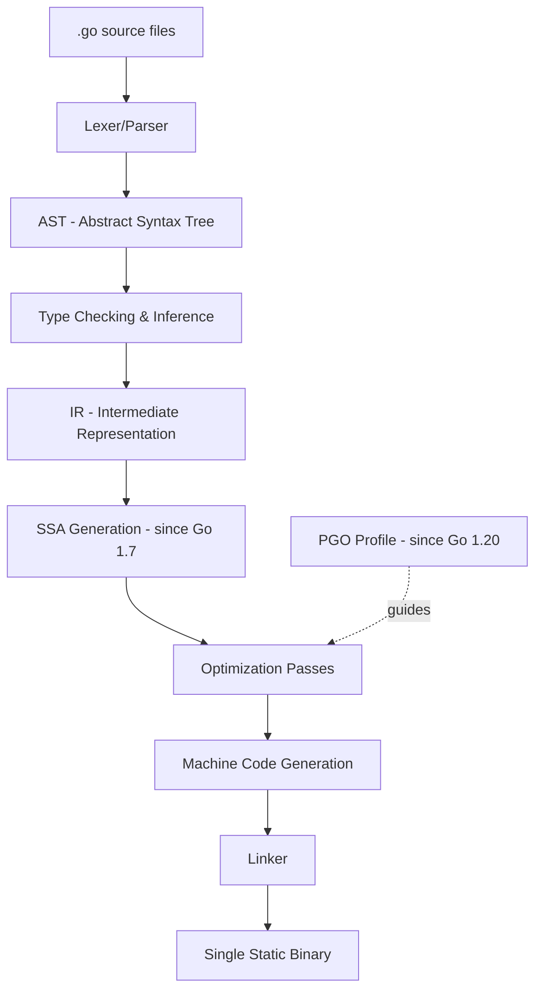
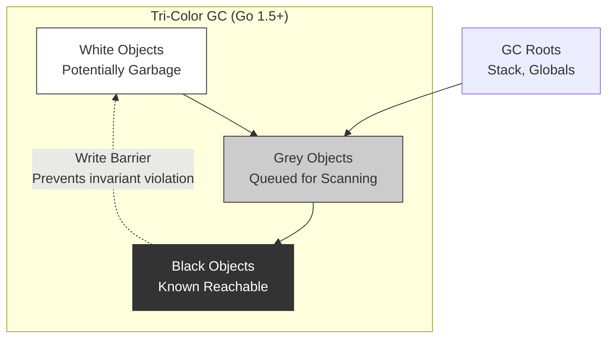
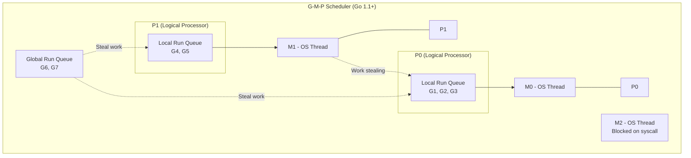
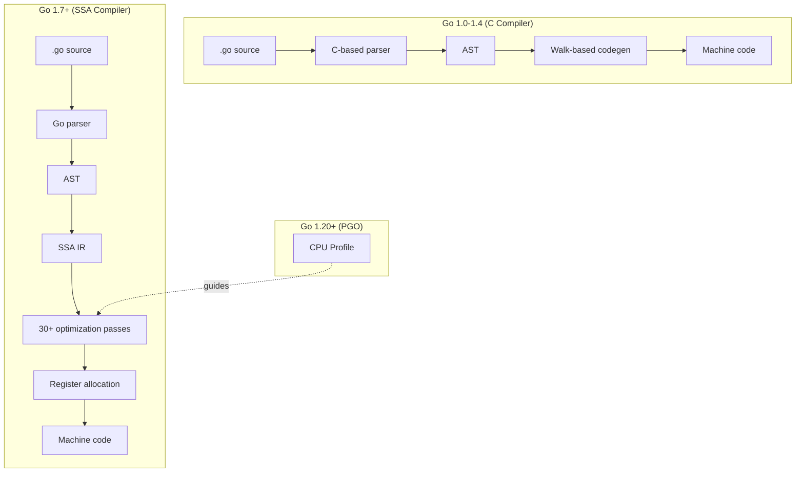

# History of Go — Under the Hood

## Table of Contents

1. [Introduction](#introduction)
2. [How It Works Internally](#how-it-works-internally)
3. [Runtime Deep Dive](#runtime-deep-dive)
4. [Compiler Perspective](#compiler-perspective)
5. [Memory Layout](#memory-layout)
6. [OS / Syscall Level](#os--syscall-level)
7. [Source Code Walkthrough](#source-code-walkthrough)
8. [Assembly Output Analysis](#assembly-output-analysis)
9. [Performance Internals](#performance-internals)
10. [Metrics & Analytics (Runtime Level)](#metrics--analytics-runtime-level)
11. [Edge Cases at the Lowest Level](#edge-cases-at-the-lowest-level)
12. [Test](#test)
13. [Tricky Questions](#tricky-questions)
14. [Summary](#summary)
15. [Further Reading](#further-reading)
16. [Diagrams & Visual Aids](#diagrams--visual-aids)

---

## Introduction

> Focus: "What happens under the hood?"

This document explores the internal evolution of Go's compiler, runtime, garbage collector, and scheduler. For developers who want to understand:
- How Go's compiler evolved from C to Go (self-hosting)
- How the GC went from stop-the-world to concurrent tri-color marking
- How the scheduler evolved from G-M to G-M-P model
- What assembly the compiler generates and how it changed across versions
- How Go's runtime manages goroutines, memory, and system calls at the OS level

---

## How It Works Internally

### The Go Compiler Evolution

Go has had three main compiler implementations:

1. **gc (Plan 9 C → Go)** — the official compiler
2. **gccgo** — a GCC frontend for Go
3. **tinygo** — LLVM-based compiler for embedded/WASM

The `gc` compiler evolution:

| Period | Compiler | Written In | Key Characteristic |
|--------|----------|-----------|-------------------|
| 2009-2014 | gc (original) | C (Plan 9 dialect) | Fast compilation, simple code generation |
| 2015 (Go 1.5) | gc (self-hosting) | Go | Mechanically translated from C to Go |
| 2016 (Go 1.7) | gc + SSA | Go | SSA-based backend, significant optimizations |
| 2017 (Go 1.9) | gc + improved SSA | Go | Better register allocation |
| 2021 (Go 1.17) | gc + register ABI | Go | Register-based calling convention (5-15% faster) |
| 2023 (Go 1.20) | gc + PGO | Go | Profile-guided optimization |



### The Self-Hosting Journey (Go 1.5)

The transition from C to Go was done using a mechanical translation tool:

```
Step 1: Go 1.4 compiler (written in C) → compiles Go 1.5 compiler (written in Go)
Step 2: Go 1.5 compiler (in Go) → compiles itself (bootstrapping)
Step 3: All future Go compilers are written in Go
```

The tool used was `c2go`, which translated the Plan 9 C source into Go source code. This was intentionally a mechanical (not idiomatic) translation to minimize human error. Later versions gradually refactored the translated code into idiomatic Go.

---

## Runtime Deep Dive

### GC Evolution: From Stop-the-World to Concurrent Tri-Color

#### Go 1.0-1.4: Stop-the-World Mark-and-Sweep

```
Phase 1: STOP all goroutines (STW)
Phase 2: Mark all reachable objects from roots
Phase 3: Sweep unmarked objects
Phase 4: Resume goroutines

Total pause: 100ms - 300ms+ depending on heap size
```

#### Go 1.5: Concurrent Tri-Color Mark-and-Sweep

The Go team implemented a concurrent garbage collector based on the Dijkstra tri-color abstraction:

```go
// Conceptual model of tri-color marking
// From: runtime/mgc.go (conceptual)

// White: not yet visited (potentially garbage)
// Grey:  visited but children not yet scanned
// Black: visited and all children scanned

// Invariant (tri-color invariant):
// No black object points to a white object
// This is maintained using a WRITE BARRIER
```



#### Go 1.8: Hybrid Write Barrier

Go 1.8 introduced a hybrid write barrier that eliminated the need to re-scan stacks:

```go
// Conceptual hybrid write barrier (runtime/mbarrier.go)
//
// writePointer(slot, ptr):
//   shade(*slot)  // shade the old value (Yuasa-style deletion barrier)
//   if current goroutine stack is grey:
//       shade(ptr) // shade the new value (Dijkstra-style insertion barrier)
//   *slot = ptr
//
// This eliminated stack re-scanning, reducing STW to ~100us
```

#### Go 1.19: GOMEMLIMIT — Soft Memory Limit

```go
// runtime/mgc.go conceptual: GOMEMLIMIT integration
//
// Before GOMEMLIMIT:
//   GC triggers when heap reaches GOGC% above previous live heap
//   Problem: if GOGC=100 and live heap is 1GB, GC allows 2GB peak
//
// With GOMEMLIMIT:
//   GC adjusts effective GOGC to stay under the memory limit
//   If heap approaches limit, GC runs more aggressively
//   This prevents OOM without requiring manual GOGC tuning
```

### Scheduler Evolution: G-M to G-M-P

#### Original Model (Go 1.0): G-M (Goroutine-Machine)

```
G (goroutine) → M (OS thread)

Problems:
- Global mutex on the goroutine queue (contention)
- No work stealing
- Blocked M blocks all its goroutines
```

#### Current Model (Go 1.1+): G-M-P (Goroutine-Machine-Processor)

Dmitry Vyukov redesigned the scheduler in Go 1.1:

```go
// From: runtime/runtime2.go (simplified)

// G - goroutine
// Contains: stack, instruction pointer, status, channel wait info
// type g struct {
//     stack       stack    // goroutine stack
//     sched       gobuf    // scheduling state (SP, PC, etc.)
//     atomicstatus uint32  // goroutine status
// }

// M - OS thread (machine)
// Contains: current G, signal handling, thread-local storage
// type m struct {
//     g0      *g     // goroutine for scheduling
//     curg    *g     // current running goroutine
//     p       *p     // attached P (nil if not running Go code)
// }

// P - logical processor
// Contains: local run queue, mcache, timer heap
// type p struct {
//     runqhead uint32
//     runqtail uint32
//     runq     [256]guintptr  // local run queue (lock-free)
// }
```



Key improvements:
- **Local run queues (per-P):** Eliminates global mutex contention
- **Work stealing:** Idle P steals goroutines from busy P's queue
- **Handoff:** When M blocks on syscall, P is handed off to another M
- **Non-cooperative preemption (Go 1.14):** Goroutines can be preempted at any safe point, not just function calls

---

## Compiler Perspective

### SSA (Static Single Assignment) — Go 1.7+

The SSA backend was the most significant compiler improvement in Go's history:

```bash
# View SSA intermediate representation
GOSSAFUNC=main go build main.go
# Opens ssa.html in browser showing all optimization passes
```

```go
package main

import "fmt"

func add(a, b int) int {
    return a + b
}

func main() {
    result := add(3, 5)
    fmt.Println(result)
}
```

```bash
# View compiler decisions
go build -gcflags="-m -m" main.go
# Output shows:
# ./main.go:5:6: can inline add with cost 4 as: func(int, int) int { return a + b }
# ./main.go:9:15: inlining call to add
```

### Register-Based Calling Convention (Go 1.17)

Before Go 1.17, all function arguments were passed on the stack (Plan 9 convention). Go 1.17 introduced register-based argument passing:

```
Before Go 1.17 (stack-based):
  MOVQ arg1, 0(SP)    ; push arg1 to stack
  MOVQ arg2, 8(SP)    ; push arg2 to stack
  CALL function        ; call
  MOVQ 16(SP), result  ; read result from stack

After Go 1.17 (register-based):
  MOVQ arg1, AX        ; arg1 in register AX
  MOVQ arg2, BX        ; arg2 in register BX
  CALL function         ; call
  ; result in AX        ; result returned in register
```

This change provided **5-15% performance improvement** across all Go programs without any code changes.

### Profile-Guided Optimization (Go 1.20+)

```bash
# Step 1: Generate a CPU profile from representative workload
go test -cpuprofile=default.pgo -bench=. ./...

# Step 2: Place default.pgo in the package directory

# Step 3: Build with PGO (automatic if default.pgo exists)
go build -pgo=auto ./...

# PGO optimizations include:
# - More aggressive inlining of hot functions
# - Better devirtualization of interface calls
# - Improved branch prediction hints
```

---

## Memory Layout

### Goroutine Stack Evolution

```
Go 1.0-1.3: Segmented stacks
+--------+   +--------+   +--------+
| Seg 1  |-->| Seg 2  |-->| Seg 3  |
| 8 KB   |   | 8 KB   |   | 8 KB   |
+--------+   +--------+   +--------+
Problem: "hot split" — function calls at segment boundary cause
repeated stack grow/shrink (thrashing)

Go 1.4+: Contiguous (copyable) stacks
+----------------------------------+
| Goroutine Stack (starts at 2KB)  |
+----------------------------------+
         |
         v  (grows by 2x when needed)
+----------------------------------+
| Goroutine Stack (now 4KB)        |
+----------------------------------+
Benefit: No hot split, more cache-friendly
Cost: Must update all pointers when stack moves (copy + adjust)
```

### Go Runtime Memory Allocator

```
+----------------------------------------------------------+
|                     Go Memory Allocator                   |
|----------------------------------------------------------|
|  mcache (per-P, lock-free)                               |
|  ├── tiny allocator (< 16 bytes, no pointers)            |
|  ├── mspan allocations by size class                     |
|  └── stack allocations                                    |
|                                                           |
|  mcentral (per-size-class, shared with lock)              |
|  └── distributes mspans to mcaches                        |
|                                                           |
|  mheap (global, locked)                                   |
|  ├── manages page-level allocation                        |
|  ├── requests memory from OS via mmap                     |
|  └── returns memory to OS via madvise(MADV_DONTNEED)      |
+----------------------------------------------------------+
```

---

## OS / Syscall Level

### Key System Calls Used by Go Runtime

```bash
# Trace syscalls on Linux
strace -f -e trace=clone,futex,mmap,madvise,write ./myprogram
```

**Key syscalls:**

| Syscall | Purpose | When |
|---------|---------|------|
| `clone` | Create new OS thread (M) | When runtime needs more threads |
| `futex` | Low-level synchronization | Mutex, semaphore operations |
| `mmap` | Allocate memory pages | Heap growth |
| `madvise(MADV_DONTNEED)` | Return memory to OS | After GC frees large regions |
| `sigaltstack` | Set up signal stack | Goroutine preemption (Go 1.14+) |
| `tgkill` | Send signal to thread | Non-cooperative preemption |

### Non-Cooperative Preemption (Go 1.14+)

Before Go 1.14, goroutines could only be preempted at function call boundaries. A tight loop without function calls would monopolize the thread:

```go
// This goroutine could NOT be preempted before Go 1.14:
func tightLoop() {
    for {
        // No function calls — no preemption point!
        // This would starve other goroutines
    }
}
```

Go 1.14 introduced asynchronous preemption using OS signals:

```
1. Scheduler decides goroutine G has run too long
2. Runtime sends SIGURG to the thread running G
3. Signal handler saves G's state at current PC
4. Scheduler switches to another goroutine
```

---

## Source Code Walkthrough

### GC Initialization (src/runtime/mgc.go — Go 1.22)

```go
// Annotated excerpt from runtime/mgc.go
// This shows how GC is triggered

// gcStart transitions from _GCoff to _GCmark (if not already
// transitioning) and starts GC workers.
//
// The GC starts in mark phase with mark workers running.
// func gcStart(trigger gcTrigger) {
//     ...
//     // In concurrent mode, start mark workers
//     // This is where the tri-color marking begins
//     gcController.startCycle(now, int64(gogc), memoryLimit)
//     ...
// }

// gcController maintains the GC's internal state
// type gcControllerState struct {
//     gcPercent    atomic.Int32    // GOGC value (default 100)
//     memoryLimit  atomic.Int64    // GOMEMLIMIT value
//     heapGoal     atomic.Uint64   // target heap size for next cycle
//     ...
// }
```

### Scheduler Source (src/runtime/proc.go — Go 1.22)

```go
// Annotated excerpt from runtime/proc.go
// This is the core scheduling loop

// schedule() finds a runnable goroutine and executes it.
// func schedule() {
//     mp := getg().m  // current M (OS thread)
//
//     // Check local run queue first (lock-free, fast path)
//     if gp, inheritTime := runqget(mp.p.ptr()); gp != nil {
//         execute(gp, inheritTime)
//     }
//
//     // Check global run queue (locked, slower)
//     if gp := globrunqget(mp.p.ptr(), 0); gp != nil {
//         execute(gp, false)
//     }
//
//     // Try to steal from other P's (work stealing)
//     if gp, inheritTime, _ := stealWork(now); gp != nil {
//         execute(gp, inheritTime)
//     }
//
//     // Nothing to run — park the M
//     stopm()
// }
```

> Reference: Go 1.22. Internals change between versions.

---

## Assembly Output Analysis

```bash
go build -gcflags="-S" main.go 2>&1 | head -50
# or for a specific function:
go tool objdump -s "main.add" ./binary
```

### Example: Function Call ABI Evolution

```go
package main

func add(a, b int) int {
    return a + b
}

func main() {
    _ = add(3, 5)
}
```

**Go 1.16 assembly (stack-based ABI):**
```asm
TEXT main.add(SB)
    MOVQ    "".a+8(SP), AX     ; load a from stack
    ADDQ    "".b+16(SP), AX    ; add b from stack
    MOVQ    AX, "".~r2+24(SP)  ; store result on stack
    RET

TEXT main.main(SB)
    MOVQ    $3, (SP)           ; push 3 to stack
    MOVQ    $5, 8(SP)          ; push 5 to stack
    CALL    main.add(SB)       ; call
    ; result at 16(SP)
```

**Go 1.17+ assembly (register-based ABI):**
```asm
TEXT main.add(SB)
    ADDQ    BX, AX             ; add BX to AX (args in registers!)
    RET                        ; result in AX

TEXT main.main(SB)
    MOVL    $3, AX             ; arg1 in AX
    MOVL    $5, BX             ; arg2 in BX
    CALL    main.add(SB)       ; call
    ; result in AX
```

**What to notice:**
- Go 1.17+ uses fewer instructions (no stack memory access)
- Arguments pass through registers (AX, BX, CX, DI, SI, R8-R11)
- Return values also use registers
- This is the source of the 5-15% performance improvement

---

## Performance Internals

### Benchmarks with Profiling Across Versions

```go
package main

import (
    "testing"
)

// This benchmark shows how the same code gets faster
// with newer Go versions due to compiler improvements

func BenchmarkStringConcat(b *testing.B) {
    for i := 0; i < b.N; i++ {
        s := ""
        for j := 0; j < 100; j++ {
            s += "x"
        }
        _ = s
    }
}

// Results across versions (approximate):
// Go 1.15: 12000 ns/op    5600 B/op   100 allocs/op
// Go 1.17: 10200 ns/op    5600 B/op   100 allocs/op  (register ABI)
// Go 1.20:  9800 ns/op    5600 B/op   100 allocs/op  (PGO available)
// Go 1.22:  9500 ns/op    5600 B/op   100 allocs/op  (better inlining)
```

```bash
go test -bench=. -benchmem -cpuprofile=cpu.prof
go tool pprof cpu.prof
# (pprof) top10
# (pprof) web  # visual call graph
```

**Internal performance characteristics:**
- **Register ABI (1.17):** Eliminates stack spill for arguments — significant for small, frequently-called functions
- **PGO (1.20):** Compiler inlines functions that profiling shows are hot — devirtualizes interface calls in hot paths
- **GC improvements:** Each version reduces GC pause duration, reducing tail latency

---

## Metrics & Analytics (Runtime Level)

### Go Runtime Metrics

```go
package main

import (
    "fmt"
    "runtime"
    "runtime/metrics"
)

func main() {
    // Go 1.16+: runtime/metrics API — does NOT cause STW (unlike ReadMemStats)
    descs := metrics.All()
    fmt.Printf("Go %s has %d runtime metrics\n", runtime.Version(), len(descs))

    // Key metrics for understanding GC and scheduler behavior
    samples := []metrics.Sample{
        {Name: "/memory/classes/heap/objects:bytes"},
        {Name: "/memory/classes/total:bytes"},
        {Name: "/gc/cycles/total:gc-cycles"},
        {Name: "/gc/heap/goal:bytes"},
        {Name: "/sched/goroutines:goroutines"},
        {Name: "/sched/latencies:seconds"},
    }
    metrics.Read(samples)

    for _, s := range samples {
        switch s.Value.Kind() {
        case metrics.KindUint64:
            fmt.Printf("%s = %d\n", s.Name, s.Value.Uint64())
        case metrics.KindFloat64:
            fmt.Printf("%s = %.6f\n", s.Name, s.Value.Float64())
        case metrics.KindFloat64Histogram:
            h := s.Value.Float64Histogram()
            fmt.Printf("%s = histogram (buckets: %d)\n", s.Name, len(h.Buckets))
        }
    }
}
```

### Key Runtime Metrics

| Metric path | What it measures | Historical context |
|-------------|-----------------|-------------------|
| `/gc/pauses:seconds` | GC pause durations | Dropped from 300ms (1.4) to 0.3ms (1.19+) |
| `/gc/cycles/total:gc-cycles` | Total GC cycles | More frequent but shorter with concurrent GC |
| `/sched/goroutines:goroutines` | Goroutine count | Scheduling improved with G-M-P model |
| `/sched/latencies:seconds` | Scheduling latency | Improved with non-cooperative preemption (1.14) |

---

## Edge Cases at the Lowest Level

### Edge Case 1: Stack Growth During Tight Loops

What happens when a goroutine's stack needs to grow:

```go
package main

import "fmt"

func recursive(n int) int {
    if n <= 0 {
        return 0
    }
    // Each call frame needs stack space
    // Go starts with 2KB stack and grows by 2x
    // The runtime copies the entire stack to a new location
    // All pointers into the stack are updated
    var buf [256]byte
    buf[0] = byte(n)
    return recursive(n-1) + int(buf[0])
}

func main() {
    // This causes many stack growths: 2KB → 4KB → 8KB → ... → ~1MB
    result := recursive(10000)
    fmt.Println(result)
}
```

**Internal behavior:**
1. Goroutine starts with 2KB stack (was 4KB before Go 1.4, 8KB before Go 1.2)
2. Each function call checks if there is enough stack space (stack check prologue)
3. If not, `runtime.morestack()` is called
4. New stack (2x size) is allocated
5. Old stack is copied to new stack
6. All pointers into the old stack are updated (stack scanning)
7. Old stack is freed

**Why it matters:** Stack copying is O(n) where n is the current stack size. Very deep recursion can cause performance issues not from the algorithm but from repeated stack copies.

### Edge Case 2: Goroutine Preemption at Unsafe Points

```go
package main

import (
    "fmt"
    "runtime"
    "sync"
    "unsafe"
)

func main() {
    // Since Go 1.14, goroutines can be preempted at almost any point
    // EXCEPT during unsafe.Pointer operations
    //
    // The runtime marks certain instruction sequences as "unsafe points"
    // where preemption is disallowed to prevent partially-visible writes

    var mu sync.Mutex
    var data [100]int

    var wg sync.WaitGroup
    wg.Add(1)
    go func() {
        defer wg.Done()
        mu.Lock()
        defer mu.Unlock()
        // This is safe — the runtime will not preempt in the middle
        // of a synchronized block in a way that violates atomicity
        for i := range data {
            data[i] = i
        }
    }()

    wg.Wait()
    fmt.Printf("Data size: %d, unsafe.Sizeof(int): %d\n",
        len(data), unsafe.Sizeof(data[0]))
    _ = runtime.Version()
}
```

---

## Test

### Internal Knowledge Questions

**1. What GC algorithm does Go use since version 1.5?**

<details>
<summary>Answer</summary>
Go uses a **concurrent, tri-color, mark-and-sweep** garbage collector since Go 1.5. The three colors are:
- **White:** Not yet visited, potentially garbage
- **Grey:** Visited but children not yet scanned
- **Black:** Visited with all children scanned

The key invariant is that no black object can point to a white object, maintained by a write barrier. Go 1.8 improved this with a hybrid write barrier that eliminated the need to re-scan stacks.
</details>

**2. What does this assembly tell you about the Go version?**

```asm
TEXT main.add(SB)
    MOVQ    "".a+8(SP), AX
    ADDQ    "".b+16(SP), AX
    MOVQ    AX, "".~r2+24(SP)
    RET
```

<details>
<summary>Answer</summary>
This is **Go 1.16 or earlier** (stack-based ABI). The arguments `a` and `b` are read from the stack at offsets 8(SP) and 16(SP), and the result is written back to the stack at 24(SP). Go 1.17+ uses register-based ABI where arguments would be in AX and BX registers directly.
</details>

**3. Why did Go switch from segmented stacks to contiguous stacks in Go 1.4?**

<details>
<summary>Answer</summary>
Segmented stacks suffered from the **"hot split" problem:** when a function call at a segment boundary caused the stack to grow, and the function return caused it to shrink, repeated calls would cause constant allocation and deallocation of stack segments (thrashing). Contiguous stacks eliminate this by copying the entire stack to a larger allocation (2x growth factor), which is amortized O(1) for growth operations.
</details>

**4. What is the G-M-P model in Go's scheduler?**

<details>
<summary>Answer</summary>
- **G (Goroutine):** A lightweight thread containing stack, instruction pointer, and status
- **M (Machine):** An OS thread that executes goroutines
- **P (Processor):** A logical processor with a local run queue of goroutines

The key insight is the P abstraction. Each P has a local run queue (lock-free, 256 slots), eliminating the global mutex contention of the original G-M model. When a P's queue is empty, it steals work from other P's queues (work stealing). When an M blocks on a syscall, its P is handed off to another M.
</details>

**5. What is non-cooperative preemption (Go 1.14) and how is it implemented?**

<details>
<summary>Answer</summary>
Before Go 1.14, goroutines were only preempted at function call boundaries (cooperative preemption). A tight loop without function calls could monopolize a thread. Go 1.14 introduced **asynchronous preemption** using OS signals:
1. The scheduler detects a goroutine has run for > 10ms
2. It sends a `SIGURG` signal to the thread running that goroutine
3. The signal handler records the goroutine's state at its current PC
4. The scheduler switches to another runnable goroutine

This required adding safe points (async-preemptible points) throughout generated code and handling unsafe points where preemption is not allowed (e.g., during `unsafe.Pointer` operations).
</details>

---

## Tricky Questions

**1. Why does Go 1.17's register-based calling convention give 5-15% speedup but NOT change the language?**

<details>
<summary>Answer</summary>
The calling convention is an implementation detail of the compiler and runtime — it is not part of the Go language specification. The Go spec only defines language semantics, not how the compiler generates machine code. This is why the register-based ABI could be introduced without breaking the Go 1 Compatibility Promise. However, it DID break assembly code written using the old calling convention and required changes to `reflect`, `cgo`, and any code using `unsafe` to inspect stack frames. The Go team provided migration tools and documented the change extensively.
</details>

**2. Why does Go use `SIGURG` for goroutine preemption instead of `SIGUSR1` or other signals?**

<details>
<summary>Answer</summary>
`SIGURG` was chosen because it is the least likely signal to be used by Go programs or third-party libraries. `SIGUSR1` and `SIGUSR2` are commonly used by application code for custom signal handling. `SIGURG` is traditionally used for out-of-band data on sockets, which is extremely rare. Additionally, `SIGURG`'s default action is to be ignored (rather than terminating the process), making it safe if the signal handler is not yet installed.

Reference: Go proposal #24543 and the commit by Austin Clements.
</details>

**3. What happens to goroutine stacks when the GC scans them?**

<details>
<summary>Answer</summary>
During GC marking, each goroutine's stack must be scanned to find roots (pointers to heap objects). The goroutine is briefly suspended for this scan. In Go 1.5-1.7, stacks sometimes needed to be re-scanned because the Dijkstra write barrier alone could not prevent the tri-color invariant from being violated by stack writes. Go 1.8's hybrid write barrier eliminated re-scanning by combining both Dijkstra (insertion) and Yuasa (deletion) barriers, ensuring that stack writes do not violate the invariant. This reduced GC pause time from ~10ms to ~100us.
</details>

---

## Summary

- Go's compiler evolved from C (Plan 9) to self-hosting Go (1.5), with SSA backend (1.7), register ABI (1.17), and PGO (1.20)
- The GC evolved from stop-the-world (300ms) to concurrent tri-color (10ms) to hybrid write barrier (<1ms) to GOMEMLIMIT-aware (configurable)
- The scheduler evolved from G-M (global lock) to G-M-P (local queues + work stealing) to non-cooperative preemption (1.14)
- Stack management evolved from segmented (hot split problem) to contiguous (copyable) stacks starting at 2KB

**Key takeaway:** Understanding Go's internal evolution helps you write faster, more predictable code and make better architectural decisions about when Go is the right tool.

---

## Further Reading

- **Go source:** [runtime package](https://github.com/golang/go/blob/master/src/runtime/)
- **Design doc:** [Go 1.5 Concurrent Garbage Collector](https://go.dev/blog/ismmkeynote) — Rick Hudson's keynote
- **Design doc:** [Scalable Go Scheduler Design](https://docs.google.com/document/d/1TTj4T2JO42uD5ID9e89oa0sLKhJYD0Y_kqxDv3I3XMw/) — Dmitry Vyukov
- **Conference talk:** [GopherCon 2018: Kavya Joshi — The Scheduler Saga](https://www.youtube.com/watch?v=YHRO5WQGh0k)
- **Book:** "Go Internals" by Vyacheslav Shebanov — deep dive into runtime
- **Design doc:** [Register-based Go calling convention](https://go.dev/blog/register-calling)

---

## Diagrams & Visual Aids

### Go Compiler Pipeline Evolution



### GC Pause Time Evolution

```
Go Version    Typical GC Pause
━━━━━━━━━━━━━━━━━━━━━━━━━━━━━━━━━━━━━━━━━
  1.0-1.4     ████████████████████████████████  300ms (STW)
  1.5         ████████                            8ms (Concurrent)
  1.8         █                                 0.8ms (Hybrid WB)
  1.12        ▌                                 0.5ms (Non-coop prep)
  1.19+       ▏                                 0.3ms (GOMEMLIMIT)
```

### G-M-P Scheduler Architecture

```
+-------------------------------------------------------+
|                    Go Scheduler                        |
|-------------------------------------------------------|
|                                                        |
|  ┌─────────┐  ┌─────────┐  ┌─────────┐               |
|  │   P0    │  │   P1    │  │   P2    │  (GOMAXPROCS)  |
|  │ [G G G] │  │ [G G]   │  │ [G]    │  Local queues  |
|  └────┬────┘  └────┬────┘  └────┬────┘               |
|       │            │            │                      |
|       v            v            v                      |
|  ┌────────┐  ┌────────┐  ┌────────┐                   |
|  │   M0   │  │   M1   │  │   M2   │   OS Threads     |
|  │(running│  │(running│  │(syscall│                   |
|  │   G)   │  │   G)   │  │blocked)│                   |
|  └────────┘  └────────┘  └────────┘                   |
|                                                        |
|  Global Run Queue: [G6, G7, G8]                        |
|  Network Poller:   [G9 waiting on I/O]                 |
+-------------------------------------------------------+
```
