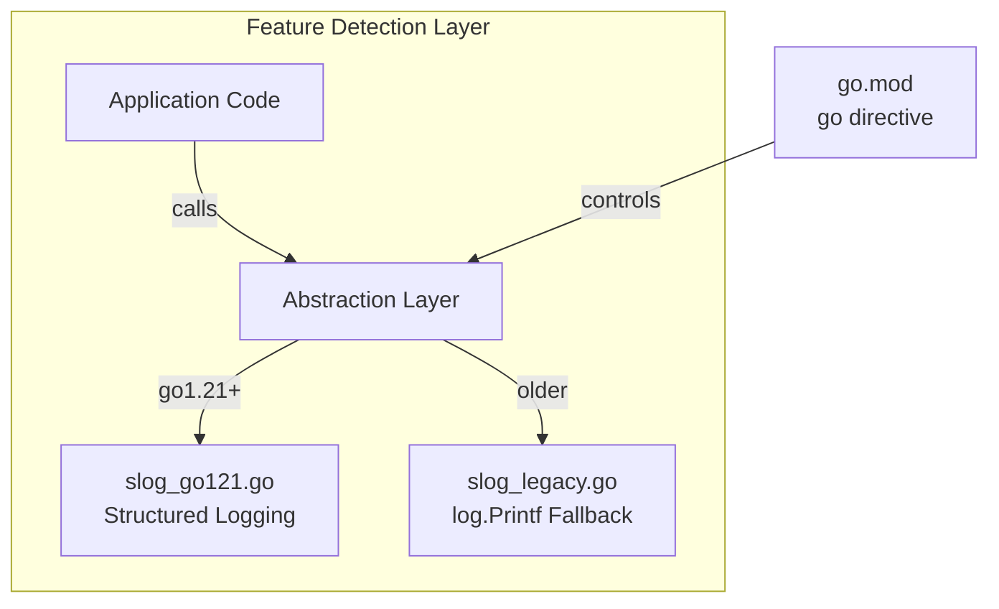
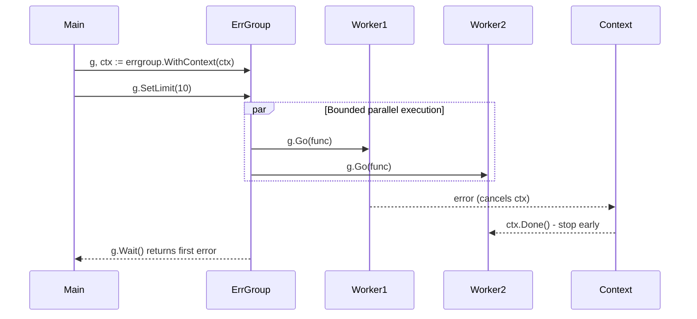
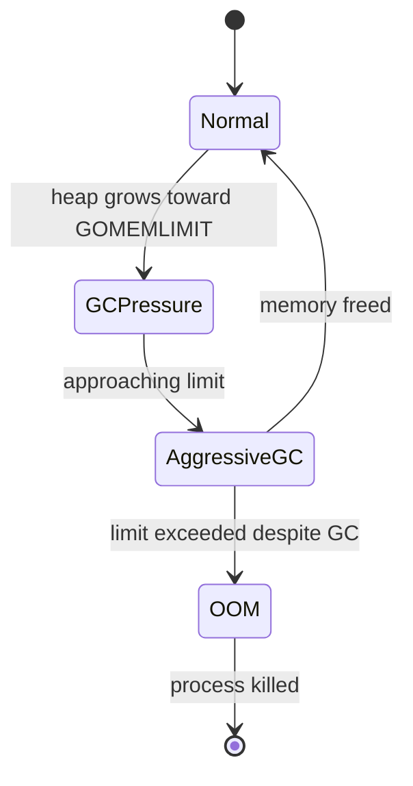
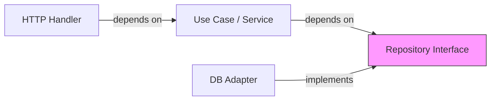
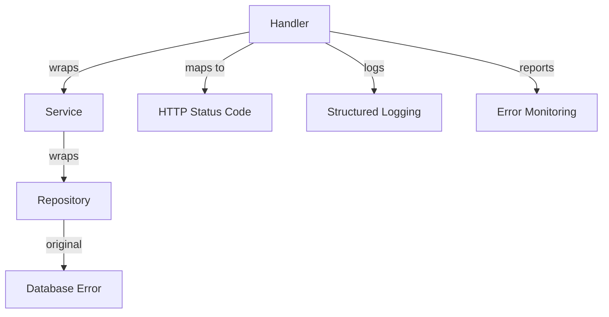
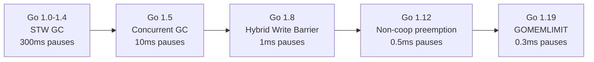
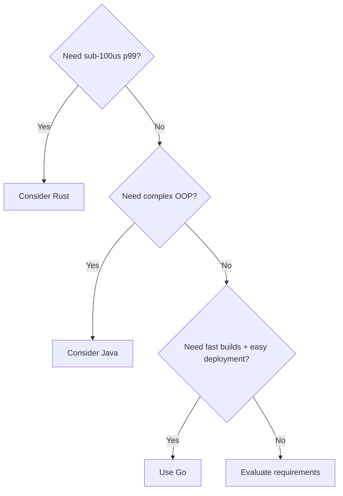

# History of Go — Senior Level

## Table of Contents

1. [Introduction](#introduction)
2. [Core Concepts](#core-concepts)
3. [Pros & Cons](#pros--cons)
4. [Use Cases](#use-cases)
5. [Code Examples](#code-examples)
6. [Coding Patterns](#coding-patterns)
7. [Clean Code](#clean-code)
8. [Best Practices](#best-practices)
9. [Product Use / Feature](#product-use--feature)
10. [Error Handling](#error-handling)
11. [Security Considerations](#security-considerations)
12. [Performance Optimization](#performance-optimization)
13. [Metrics & Analytics](#metrics--analytics)
14. [Debugging Guide](#debugging-guide)
15. [Edge Cases & Pitfalls](#edge-cases--pitfalls)
16. [Postmortems & System Failures](#postmortems--system-failures)
17. [Common Mistakes](#common-mistakes)
18. [Tricky Points](#tricky-points)
19. [Comparison with Other Languages](#comparison-with-other-languages)
20. [Test](#test)
21. [Tricky Questions](#tricky-questions)
22. [Cheat Sheet](#cheat-sheet)
23. [Summary](#summary)
24. [What You Can Build](#what-you-can-build)
25. [Further Reading](#further-reading)
26. [Related Topics](#related-topics)
27. [Diagrams & Visual Aids](#diagrams--visual-aids)

---

## Introduction

> Focus: "How to optimize?" and "How to architect?"

For developers who:
- Design systems and make architectural decisions influenced by Go's evolution
- Lead Go version upgrade strategies across large organizations
- Understand how Go's design history informs today's best practices
- Mentor junior/middle developers on why Go works the way it does
- Evaluate Go's fitness for new projects based on its trajectory

---

## Core Concepts

### Concept 1: The Architectural Impact of Go's Backward Compatibility Promise

The Go 1 Compatibility Promise is not just a user-facing guarantee — it is an architectural constraint that shapes the entire language and standard library evolution. Every new feature must be designed so that **no existing valid Go 1.x program changes behavior**.

This has deep implications:
- **Standard library cannot remove functions** — only add `Deprecated` comments
- **New language features must not change semantics of existing code** — Go 1.22's loop variable fix was possible only because the old behavior was a well-known bug
- **The `go` directive in `go.mod` serves as a versioned language specification** — effectively creating "implicit editions" without calling them that

```go
// The compatibility promise in action:
// This code from 2012 still compiles on Go 1.22+
package main

import (
    "fmt"
    "net/http"
)

func handler(w http.ResponseWriter, r *http.Request) {
    fmt.Fprintf(w, "Hello from Go 1.0-compatible code!")
}

func main() {
    http.HandleFunc("/", handler)
    http.ListenAndServe(":8080", nil)
}
```

### Concept 2: How Go's GC Evolution Affected Architecture Decisions

Go's garbage collector evolution fundamentally changed what architectures were viable:

| Go Version | GC Type | Typical Pause | Architectural Impact |
|-----------|---------|---------------|---------------------|
| 1.0-1.4 | Stop-the-world | 100-300ms | Could not serve latency-sensitive traffic |
| 1.5 | Concurrent tri-color | <10ms | Viable for web services |
| 1.8 | Improved concurrent | <1ms | Viable for real-time bidding, trading |
| 1.12 | Non-cooperative preemption prep | <500us | Viable for most latency-critical paths |
| 1.19 | GOMEMLIMIT | Configurable | Better memory/CPU trade-offs |

Before Go 1.5, companies like Twitch and Uber had to use workarounds (object pools, off-heap storage) to avoid GC pauses. After Go 1.8, most of these workarounds became unnecessary technical debt.

```go
package main

import (
    "fmt"
    "runtime"
    "runtime/debug"
)

func main() {
    // Go 1.19+ GOMEMLIMIT: tell GC how much memory is available
    // This replaces the old GOGC tuning approach
    debug.SetMemoryLimit(512 << 20) // 512 MB

    var stats runtime.MemStats
    runtime.ReadMemStats(&stats)
    fmt.Printf("Go %s — GC goal: %d bytes\n", runtime.Version(), stats.NextGC)
    fmt.Printf("GOMEMLIMIT controls GC aggressiveness since Go 1.19\n")
}
```

**Benchmark comparison (GC pauses across versions):**
```
Go 1.4:    p99 GC pause: 287ms    (stop-the-world)
Go 1.5:    p99 GC pause:   8ms    (concurrent GC)
Go 1.8:    p99 GC pause: 0.8ms    (hybrid write barrier)
Go 1.19:   p99 GC pause: 0.3ms    (GOMEMLIMIT)
```

---

## Pros & Cons

### Strategic analysis for architectural decisions:

| Pros | Cons | Impact |
|------|------|--------|
| Go 1 Promise enables fearless upgrades | Cannot fix legacy API mistakes | Long-term maintenance cost is low, but stdlib has accumulated design debt |
| Predictable release cadence | Features arrive slowly | Easy to plan upgrades but hard to adopt cutting-edge patterns |
| GC improvements with each release | Still has GC pauses (unlike Rust) | Suitable for 99.9th percentile latency SLOs, but not hard real-time |
| Toolchain auto-download (1.21+) | Adds complexity to build reproducibility | CI/CD pipelines need to account for toolchain management |

### When Go's approach is the RIGHT choice:
- Building cloud-native microservices where developer productivity and deployment simplicity matter more than squeezing the last nanosecond
- Large teams where code readability and consistency are critical

### When Go's approach is the WRONG choice:
- Hard real-time systems (embedded, game engines) — use Rust or C
- Rapid prototyping with complex data transformations — use Python

### Real-world decision examples:
- **Discord** chose Rust over Go for their message storage service because Go's GC pauses caused latency spikes during garbage collection of millions of concurrent connections — result: p99 latency dropped from 1ms to 50us
- **Cloudflare** chose Go for their edge proxy despite GC concerns because developer velocity was more important — they handle 25M+ rps with Go

---

## Use Cases

- **Use Case 1:** Planning a Go version upgrade strategy for an organization with 500+ microservices
- **Use Case 2:** Evaluating whether to adopt Go generics in existing codebases or maintain interface-based designs
- **Use Case 3:** Architecting a system that leverages Go 1.19+ GOMEMLIMIT for predictable memory usage under load

---

## Code Examples

### Example 1: Version-Aware Graceful Shutdown Pattern Evolution

```go
package main

import (
    "context"
    "fmt"
    "log"
    "net/http"
    "os"
    "os/signal"
    "syscall"
    "time"
)

// This pattern evolved across Go versions:
// Go 1.7:  context.Context added to stdlib
// Go 1.8:  http.Server.Shutdown() added for graceful shutdown
// Go 1.16: signal.NotifyContext() added
// Go 1.21: log/slog for structured logging

func main() {
    mux := http.NewServeMux()
    mux.HandleFunc("/", func(w http.ResponseWriter, r *http.Request) {
        fmt.Fprintf(w, "Go version: %s\n", "evolution")
    })

    server := &http.Server{
        Addr:         ":8080",
        Handler:      mux,
        ReadTimeout:  5 * time.Second,
        WriteTimeout: 10 * time.Second,
        IdleTimeout:  120 * time.Second,
    }

    // Go 1.16+: signal.NotifyContext replaces manual signal handling
    ctx, stop := signal.NotifyContext(context.Background(), syscall.SIGTERM, syscall.SIGINT)
    defer stop()

    go func() {
        log.Printf("Server starting on %s", server.Addr)
        if err := server.ListenAndServe(); err != http.ErrServerClosed {
            log.Fatalf("Server error: %v", err)
        }
    }()

    <-ctx.Done()
    log.Println("Shutdown signal received")

    // Go 1.8+: Graceful shutdown with deadline
    shutdownCtx, cancel := context.WithTimeout(context.Background(), 30*time.Second)
    defer cancel()

    if err := server.Shutdown(shutdownCtx); err != nil {
        log.Printf("Shutdown error: %v", err)
        os.Exit(1)
    }
    log.Println("Server stopped gracefully")
}
```

**Architecture decisions:** Each Go version added primitives that simplified this pattern. Before Go 1.8, graceful shutdown required custom signal handling and connection tracking.
**Alternatives considered:** Third-party libraries like `github.com/tylerb/graceful` were popular before Go 1.8 — now unnecessary.

### Example 2: Generics vs Interface-Based Design Decision

```go
package main

import (
    "fmt"
    "sort"
)

// Pre-generics architecture (Go < 1.18): interface-based
type Sortable interface {
    sort.Interface
}

type IntSlice []int

func (s IntSlice) Len() int           { return len(s) }
func (s IntSlice) Less(i, j int) bool { return s[i] < s[j] }
func (s IntSlice) Swap(i, j int)      { s[i], s[j] = s[j], s[i] }

// Post-generics architecture (Go 1.18+): type-safe with slices package
// import "slices"
// slices.Sort(data)

// Decision framework for existing codebases:
// 1. Is the interface used across package boundaries? Keep interface.
// 2. Is it internal boilerplate? Migrate to generics.
// 3. Does the interface capture behavior? Keep interface.
// 4. Does the interface just parameterize a type? Use generics.

func main() {
    data := IntSlice{5, 3, 1, 4, 2}
    sort.Sort(data) // Pre-generics: works but verbose
    fmt.Println("Sorted:", data)
}
```

---

## Coding Patterns

### Pattern 1: Evolutionary Architecture — Feature Flags by Go Version

**Category:** Architectural
**Intent:** Gradually adopt new Go features in large codebases without breaking existing code
**Trade-offs:** More files to maintain, but enables safe incremental migration

**Architecture diagram:**



**Implementation:**

```go
// slog_go121.go
//go:build go1.21

package logging

import (
    "context"
    "log/slog"
    "os"
)

var logger = slog.New(slog.NewJSONHandler(os.Stdout, nil))

func Info(ctx context.Context, msg string, args ...any) {
    logger.InfoContext(ctx, msg, args...)
}
```

```go
// slog_legacy.go
//go:build !go1.21

package logging

import (
    "context"
    "log"
)

func Info(_ context.Context, msg string, args ...any) {
    log.Printf(msg, args...)
}
```

**When this pattern wins:**
- Libraries that need to support multiple Go versions
- Organizations with staggered Go version upgrades across teams

**When to avoid:**
- Application code where you control the Go version — just use the latest features directly

---

### Pattern 2: Concurrency Pattern Evolution — errgroup

**Category:** Concurrency / Resource Management
**Intent:** Show how Go's concurrency patterns improved over versions

**Flow diagram:**



```go
package main

import (
    "context"
    "fmt"
    "time"

    "golang.org/x/sync/errgroup"
)

func main() {
    // Evolution of concurrent error handling:
    // Go 1.0: sync.WaitGroup + manual error collection
    // Go 1.7: context.Context for cancellation
    // errgroup: combines WaitGroup + Context + first-error semantics
    // errgroup.SetLimit (added later): bounded concurrency

    ctx := context.Background()
    g, ctx := errgroup.WithContext(ctx)
    g.SetLimit(5) // Process at most 5 concurrently

    urls := []string{"url1", "url2", "url3", "url4", "url5"}
    for _, url := range urls {
        g.Go(func() error {
            // ctx is automatically cancelled if any goroutine fails
            select {
            case <-ctx.Done():
                return ctx.Err()
            case <-time.After(100 * time.Millisecond):
                fmt.Printf("Fetched %s\n", url)
                return nil
            }
        })
    }

    if err := g.Wait(); err != nil {
        fmt.Printf("Error: %v\n", err)
    }
}
```

---

### Pattern 3: GOMEMLIMIT-Aware Architecture (Go 1.19+)

**Category:** Performance / Resource Management
**Intent:** Design systems that work with Go's GC rather than fighting it

**State diagram:**



```go
package main

import (
    "fmt"
    "runtime"
    "runtime/debug"
)

func main() {
    // Architecture decision: use GOMEMLIMIT instead of GOGC tuning
    //
    // Before Go 1.19:
    //   GOGC=100 (default) — GC runs when heap doubles
    //   Problem: hard to predict memory usage under varying load
    //
    // Go 1.19+:
    //   GOMEMLIMIT=512MiB — GC adjusts GOGC to stay under limit
    //   Benefit: predictable memory usage, fewer OOM kills
    //
    // Best practice: set GOMEMLIMIT to ~80% of container memory limit

    limit := debug.SetMemoryLimit(512 << 20) // 512 MB
    fmt.Printf("Previous GOMEMLIMIT: %d\n", limit)

    var stats runtime.MemStats
    runtime.ReadMemStats(&stats)
    fmt.Printf("Current heap: %d MB\n", stats.HeapAlloc/1024/1024)
    fmt.Printf("Next GC at: %d MB\n", stats.NextGC/1024/1024)
}
```

### Pattern Comparison Matrix

| Pattern | Use When | Avoid When | Complexity |
|---------|----------|------------|------------|
| Build constraints | Supporting multiple Go versions | Single-version apps | Low |
| errgroup | Concurrent tasks with error handling | Simple sequential code | Medium |
| GOMEMLIMIT | Container deployments | Desktop apps | Low |
| Functional options | Configurable constructors (Go idiom since 1.0) | Simple structs | Medium |

---

## Clean Code

### Clean Architecture Boundaries

```go
// Layering violation — business logic knows about HTTP
type OrderHandler struct{ db *sql.DB }

// Dependency inversion — depend on abstractions
type OrderRepository interface{ Save(Order) error }
type OrderService struct{ repo OrderRepository }
```

**Dependency flow must be:**


---

### Code Smells at Senior Level

| Smell | Symptom | Refactoring |
|-------|---------|-------------|
| **God Object** | One struct with 20+ methods | Split by responsibility |
| **Primitive Obsession** | `string` for version, `int` for year | Wrap in value types |
| **Shotgun Surgery** | Change 1 feature, edit 10 files | Move cohesive logic together |
| **Feature Envy** | Method uses another type's data more than its own | Move method to that type |
| **Data Clumps** | Same 3+ fields always appear together | Extract into a struct |

---

### Code Review Checklist (Senior)

- [ ] No business logic in HTTP handlers or DB adapters
- [ ] All public interfaces are documented
- [ ] No global mutable state
- [ ] Error messages include enough context to debug
- [ ] No magic numbers/strings — all constants named
- [ ] Functions have single responsibility

---

## Best Practices

### Must Do

1. **Upgrade Go versions regularly** — each release includes security fixes and performance gains
   ```bash
   # Quarterly upgrade process:
   # 1. Update go.mod
   # 2. Run full test suite with -race
   # 3. Benchmark critical paths
   # 4. Review release notes for behavior changes
   go mod edit -go=1.22
   go test -race ./...
   go test -bench=. -benchmem ./...
   ```

2. **Use GOMEMLIMIT in containers (Go 1.19+)** — prevents OOM kills
   ```bash
   # Set to 80% of container memory limit
   GOMEMLIMIT=400MiB  # for a 512MB container
   ```

3. **Use `govulncheck` in CI** — scans for known vulnerabilities
   ```bash
   govulncheck ./...
   ```

4. **Set toolchain directive (Go 1.21+)** — ensures reproducible builds
   ```go
   // go.mod
   // module myproject
   // go 1.22.0
   // toolchain go1.22.4
   ```

5. **Adopt generics for internal boilerplate (Go 1.18+)** — but keep interfaces for API boundaries

### Never Do

1. **Never skip major Go versions** — upgrading 1.18 → 1.22 directly is riskier than 1.18 → 1.19 → ... → 1.22
2. **Never set GONOSUMCHECK in production** — disables supply chain security
3. **Never use `//go:linkname` to access internal APIs** — Go 1.23+ restricts this, and it breaks across versions

### Go Production Checklist

- [ ] Go version is at most 2 releases behind latest
- [ ] GOMEMLIMIT set for container deployments
- [ ] govulncheck runs in CI
- [ ] go vet and staticcheck pass in CI
- [ ] Race detector runs in CI (`go test -race ./...`)
- [ ] Structured logging with `log/slog` (Go 1.21+)

---

## Product Use / Feature

### 1. Uber

- **Architecture:** Uber rebuilt their highest-throughput services in Go starting in 2015, moving away from Python and Node.js
- **Scale:** Their Go services handle 5M+ requests per second with sub-5ms p99 latency
- **Lessons learned:** They created Zap (structured logger) because Go's `log` package was too slow. Go 1.21's `log/slog` was influenced by Zap's design.

### 2. CockroachDB

- **Architecture:** Built entirely in Go, CockroachDB is a distributed SQL database
- **Scale:** Handles petabytes of data across distributed clusters
- **Lessons learned:** They pushed Go's GC to its limits and contributed back multiple GC improvements to the Go runtime. Their experience influenced GOMEMLIMIT's design.

### 3. Kubernetes

- **Architecture:** The entire container orchestration ecosystem (kubectl, kubelet, kube-apiserver, etcd) is built in Go
- **Scale:** Manages millions of containers across hundreds of thousands of nodes globally
- **Lessons learned:** Kubernetes relied heavily on Go's context package for request cancellation and deadline propagation across microservices.

---

## Error Handling

### Strategy 1: Domain error hierarchy (Go 1.13+ pattern)

```go
package main

import (
    "errors"
    "fmt"
)

type VersionError struct {
    Required string
    Current  string
    Feature  string
}

func (e *VersionError) Error() string {
    return fmt.Sprintf("feature %q requires Go %s, current: %s", e.Feature, e.Required, e.Current)
}

var ErrUnsupportedVersion = errors.New("unsupported Go version")

func checkFeature(feature, current string) error {
    requirements := map[string]string{
        "generics": "1.18",
        "slog":     "1.21",
        "range-int": "1.22",
    }
    required, ok := requirements[feature]
    if !ok {
        return fmt.Errorf("unknown feature %q: %w", feature, ErrUnsupportedVersion)
    }
    if current < required {
        return &VersionError{Required: required, Current: current, Feature: feature}
    }
    return nil
}

func main() {
    err := checkFeature("generics", "1.16")
    if err != nil {
        var verErr *VersionError
        if errors.As(err, &verErr) {
            fmt.Printf("Upgrade needed: %s → %s for %s\n", verErr.Current, verErr.Required, verErr.Feature)
        }
    }
}
```

### Error Handling Architecture



---

## Security Considerations

### Security Architecture Checklist

- [ ] Go version is within 2 releases of latest — security patches
- [ ] `govulncheck` runs in CI — known vulnerability scanning
- [ ] `GONOSUMCHECK` is NOT set — checksum verification enabled
- [ ] Dependencies pinned with exact versions in `go.sum`
- [ ] `GOFLAGS=-mod=readonly` in CI — prevents unauthorized changes
- [ ] Private module proxy configured (`GOPROXY`)

### Threat Model

| Threat | Likelihood | Impact | Mitigation |
|--------|:---------:|:------:|------------|
| Dependency supply chain attack | Medium | Critical | `sum.golang.org` verification, `govulncheck` |
| Using Go version with known CVEs | High | High | Upgrade policy: max 2 releases behind |
| `//go:linkname` to internal APIs | Low | Medium | Go 1.23+ restricts this; avoid entirely |

---

## Performance Optimization

### Optimization 1: Leveraging Go Version Improvements

```go
package main

import (
    "fmt"
    "runtime"
    "runtime/debug"
)

func main() {
    // Strategy: upgrade Go version before micro-optimizing code
    //
    // Free performance gains from Go upgrades:
    // Go 1.17: register-based calling convention → 5-15% faster
    // Go 1.18: generic-enabled slices.Sort → faster than sort.Slice
    // Go 1.19: GOMEMLIMIT → better GC behavior under memory pressure
    // Go 1.20: Profile-Guided Optimization (PGO) → 2-7% faster
    // Go 1.21: improved inlining → automatic performance gains
    // Go 1.22: improved range for maps → faster iteration

    fmt.Printf("Go: %s\n", runtime.Version())

    // PGO: Profile-Guided Optimization (Go 1.20+)
    // 1. Build and run with CPU profiling
    // 2. Save profile as default.pgo in package directory
    // 3. Rebuild — compiler uses profile to optimize hot paths
    //
    // go test -cpuprofile=default.pgo -bench=. ./...
    // go build -pgo=auto ./...

    info, ok := debug.ReadBuildInfo()
    if ok {
        fmt.Printf("Module: %s\n", info.Main.Path)
        for _, setting := range info.Settings {
            if setting.Key == "-pgo" {
                fmt.Printf("PGO enabled: %s\n", setting.Value)
            }
        }
    }
}
```

**Profiling evidence:**
```bash
# Benchmark before/after Go upgrade
go test -bench=. -benchmem -count=5 ./... | tee before.txt
# ... upgrade Go ...
go test -bench=. -benchmem -count=5 ./... | tee after.txt
benchstat before.txt after.txt
```

### Performance Architecture

| Layer | Optimization | Impact | Cost |
|:-----:|:------------|:------:|:----:|
| **Go version** | Upgrade to latest | 5-15% free gains | Testing effort |
| **PGO** | Profile-guided optimization | 2-7% | Build pipeline change |
| **GOMEMLIMIT** | Set to 80% of container | Fewer OOM, better GC | Env var change |
| **Algorithm** | Better data structures | Highest | Requires redesign |

---

## Metrics & Analytics

### Key Metrics

| Metric | Type | Description | Alert threshold |
|--------|------|-------------|-----------------|
| **go_info** | Gauge | Go version in production | < latest-2 |
| **go_gc_duration_seconds** | Summary | GC pause duration | p99 > 1ms |
| **go_memstats_heap_alloc_bytes** | Gauge | Current heap allocation | > GOMEMLIMIT * 0.9 |
| **go_goroutines** | Gauge | Number of goroutines | > 100K |

### Prometheus Instrumentation

```go
package main

import (
    "fmt"
    "runtime"
    "runtime/metrics"
)

func main() {
    // Go 1.16+: runtime/metrics API (no STW, unlike ReadMemStats)
    samples := []metrics.Sample{
        {Name: "/memory/classes/heap/objects:bytes"},
        {Name: "/gc/cycles/total:gc-cycles"},
        {Name: "/sched/goroutines:goroutines"},
        {Name: "/gc/pauses:seconds"},
    }
    metrics.Read(samples)

    fmt.Printf("Go %s runtime metrics:\n", runtime.Version())
    for _, s := range samples {
        switch s.Value.Kind() {
        case metrics.KindUint64:
            fmt.Printf("  %s: %d\n", s.Name, s.Value.Uint64())
        case metrics.KindFloat64:
            fmt.Printf("  %s: %.4f\n", s.Name, s.Value.Float64())
        case metrics.KindFloat64Histogram:
            fmt.Printf("  %s: [histogram]\n", s.Name)
        }
    }
}
```

---

## Debugging Guide

### Advanced Tools & Techniques

| Tool | Use case | When to use |
|------|----------|-------------|
| `go tool pprof` | CPU/memory profiling | Performance issues |
| `go tool trace` | Execution tracing | Concurrency issues, GC analysis |
| `go build -race` | Race detection | Always in CI |
| `benchstat` | Compare benchmarks | Before/after Go version upgrades |
| `GODEBUG=gctrace=1` | GC behavior | Tuning GOMEMLIMIT |
| `govulncheck` | Security scanning | Every CI run |

---

## Edge Cases & Pitfalls

### Pitfall 1: The `//go:linkname` Restriction (Go 1.23+)

```go
// This pattern was commonly used to access Go internal APIs:
//
//go:linkname runtime_nanotime runtime.nanotime
// func runtime_nanotime() int64
//
// Go 1.23 restricts this to prevent breaking across versions.
// Code using //go:linkname may fail on upgrade.
```

**At what scale it breaks:** Any codebase using `//go:linkname` to access runtime internals.
**Root cause:** Go runtime internals change between versions. Linking to them creates invisible dependencies.
**Solution:** Use public APIs. If no public API exists, file a Go proposal.

### Pitfall 2: GOPATH Projects in Modern Go

```go
// Legacy GOPATH projects silently break with Go 1.21+
// because GO111MODULE defaults to "on" since Go 1.16
// and Go 1.21 removed GOPATH mode support entirely
```

**At what scale it breaks:** Any unmigrated GOPATH project.
**Root cause:** Go 1.21 removes GO111MODULE=off support.
**Solution:** Migrate to Go Modules. There is no alternative.

---

## Postmortems & System Failures

### The Twitch GC Incident (2015)

- **The goal:** Twitch was building a real-time chat system in Go to handle millions of concurrent connections
- **The mistake:** Go 1.4's stop-the-world GC caused multi-hundred-millisecond pauses during peak traffic
- **The impact:** Chat messages were delayed, and the system appeared unresponsive during GC pauses
- **The fix:** They upgraded to Go 1.5 (concurrent GC) and implemented object pooling for hot paths. GC pauses dropped from 300ms to under 10ms.

**Key takeaway:** Go version selection is an architectural decision, not just a tooling choice. The GC behavior of your Go version directly affects your system's SLA.

### The Discord GC Story (2020)

- **The goal:** Discord was serving millions of concurrent users with a Go service for message read states
- **The mistake:** Even with Go 1.14's improved GC, the service had periodic latency spikes due to GC pauses on their large in-memory dataset (hundreds of GB)
- **The impact:** p99 latency spikes during GC caused user-visible delays
- **The fix:** They rewrote the service in Rust, eliminating GC entirely. This was a case where Go's approach was the wrong choice for the specific workload.

**Key takeaway:** Understanding Go's GC limitations helps you make the right language choice upfront, avoiding costly rewrites.

---

## Common Mistakes

### Mistake 1: Skipping Go Versions During Upgrades

```go
// Wrong: jumping from Go 1.16 to Go 1.22 in one step
// go mod edit -go=1.22

// Correct: incremental upgrades with testing at each step
// go mod edit -go=1.17 && go test ./...
// go mod edit -go=1.18 && go test ./...
// ... step by step
// go mod edit -go=1.22 && go test ./...
```

**Why it's wrong:** Each Go version may introduce subtle behavior changes. Jumping versions makes it hard to identify which version caused a regression.

---

## Tricky Points

### Tricky Point 1: The `go` Directive Creates Implicit Editions

```go
// go.mod:
// go 1.22

// This single line changes language semantics:
// - Loop variable scoping (per-iteration since 1.22)
// - Range over integers (since 1.22)
// - Enhanced HTTP routing (since 1.22)

// Two copies of the same code can behave differently
// based solely on the go directive in go.mod
```

**Go spec reference:** "A module's go line determines the language version used when compiling packages in that module."
**Why this matters:** In a monorepo with multiple modules, different modules can have different language versions. This can lead to confusing behavior if a function behaves differently depending on which module calls it.

### Tricky Point 2: `GOTOOLCHAIN` Forward Compatibility

```go
// go.mod:
// go 1.24
// toolchain go1.24.2

// If you have Go 1.22 installed and run `go build`,
// Go 1.22 will automatically DOWNLOAD Go 1.24.2 and use it.
// This happens silently unless GOTOOLCHAIN=local is set.
```

**Why this matters:** In air-gapped environments, this auto-download behavior can fail silently or cause security concerns.

---

## Comparison with Other Languages

| Aspect | Go | Rust | Java | C++ |
|--------|:---:|:----:|:----:|:---:|
| Backward compatibility | Extremely strong (Go 1 Promise) | Editions (2015, 2018, 2021) | Strong with deprecation | Weak (ABI breaks between major versions) |
| GC evolution | Revolutionary (300ms → 0.3ms) | No GC (ownership model) | G1 → ZGC → Shenandoah | Manual memory management |
| Release cadence | 2x/year | Every 6 weeks | 2x/year (since Java 9) | Every 3 years (standard) |
| Feature adoption speed | Conservative (13yr for generics) | Moderate (async took 4yr) | Moderate (records, sealed) | Slow (concepts took 30yr) |

### When Go's approach wins:
- Organizations that value stability and predictability over cutting-edge features
- Teams where developer onboarding speed matters (Go's simplicity)

### When Go's approach loses:
- Systems requiring zero-GC guarantees (use Rust)
- Enterprise ecosystems requiring extensive framework support (use Java)

---

## Test

### Architecture Questions

**1. You are designing a system that must handle 1M concurrent WebSocket connections with sub-1ms p99 latency. Should you use Go? What Go version considerations are relevant?**

<details>
<summary>Answer</summary>
Go can handle 1M concurrent connections (goroutines are cheap — ~2KB each), but the sub-1ms p99 latency requirement is challenging due to GC pauses. Key considerations:
- Use Go 1.19+ with GOMEMLIMIT to control GC behavior
- Use `sync.Pool` to reduce allocation pressure in hot paths
- Monitor GC pauses with GODEBUG=gctrace=1
- If p99 < 1ms is a hard requirement under all conditions (including GC), consider Rust for the hot path

Go's GC has improved dramatically, but for extreme latency requirements, you must profile your specific workload.
</details>

### Performance Analysis

**2. Your Go service's p99 latency spikes every 30 seconds. How do you diagnose whether this is related to Go's GC?**

<details>
<summary>Answer</summary>
Step-by-step:
1. Enable GC tracing: `GODEBUG=gctrace=1`
2. Correlate GC pause times with latency spikes
3. Use `go tool trace` to visualize GC events alongside request handling
4. Check `runtime.MemStats.PauseTotalNs` and `PauseNs` array
5. If GC is the cause: set `GOMEMLIMIT`, increase `GOGC`, or use `sync.Pool` to reduce allocation rate
6. Consider upgrading Go version — each release improves GC
</details>

**3. After upgrading from Go 1.21 to Go 1.22, some integration tests fail but unit tests pass. What is the most likely cause?**

<details>
<summary>Answer</summary>
The most likely cause is the loop variable scoping change in Go 1.22. When the `go` directive in `go.mod` is changed to `go 1.22`, loop variables get per-iteration scoping instead of per-function scoping. Integration tests often involve goroutines and closures that capture loop variables — the new behavior (correct behavior) may change the expected test output. Review all for-loops that capture variables in closures.
</details>

---

## Tricky Questions

**1. A Go module has `go 1.20` in go.mod. You compile it with Go 1.22. Does the code use Go 1.22 language features?**

- A) Yes — the installed Go version determines language features
- B) No — the `go` directive in go.mod determines language features
- C) It depends on the `GOTOOLCHAIN` setting
- D) Compilation fails because the versions don't match

<details>
<summary>Answer</summary>
**B)** — The `go` directive in `go.mod` determines which language features are available, regardless of the installed Go version. Even if you compile with Go 1.22, a module with `go 1.20` will NOT have access to Go 1.22 features like range-over-int. The installed toolchain provides backward compatibility but does not enable forward features. The `GOTOOLCHAIN` setting (C) controls which compiler is used, not which language version is active.
</details>

**2. Why did Go choose NOT to use Rust's edition system for backward compatibility?**

- A) The Go team does not know about Rust's edition system
- B) Go's approach of using the `go` directive in `go.mod` achieves a similar result without the complexity of editions
- C) Editions are patented by Mozilla
- D) Go has no backward compatibility mechanism

<details>
<summary>Answer</summary>
**B)** — The `go` directive in `go.mod` functions similarly to Rust's editions: it controls which language semantics apply to a module. However, Go's approach is more conservative — changes between versions are minimal (e.g., loop variable scoping in 1.22), whereas Rust editions can make larger changes. Go achieves "implicit editions" through the `go` directive without requiring a separate edition concept.
</details>

---

## "What If?" Scenarios (Architecture)

**What if Go 2.0 was released with breaking changes?**
- **Expected failure mode:** All Go 1.x code continues to work with Go 1.x compilers. Go 2.0 introduces a migration tool.
- **Worst-case scenario:** Community splits between Go 1 and Go 2, similar to Python 2/3.
- **Mitigation:** The Go team has explicitly stated they want to avoid a Go 2.0 scenario. The `go` directive in `go.mod` allows gradual language evolution without a version 2.

---

## Cheat Sheet

### Architecture Decision Matrix

| Scenario | Recommended pattern | Avoid | Why |
|----------|-------------------|-------|-----|
| Container deployment | Set GOMEMLIMIT | Unlimited memory | Prevents OOM kills |
| Multi-version library | Build constraints | Single-version assumption | Broader compatibility |
| Post-1.18 project | Use generics internally | Interface{} everywhere | Type safety |
| CI pipeline | govulncheck + race detector | Skipping security checks | Supply chain protection |

### Heuristics & Rules of Thumb

- **The Upgrade Rule:** Upgrade Go within 6 months of a new release — but test at every step.
- **The GOMEMLIMIT Rule:** Set to 80% of container memory. GOGC=off is almost never correct.
- **The Generics Rule:** Use generics for internal data structures. Keep interfaces for API boundaries.

---

## Summary

- Go's evolution strategy uses the `go` directive as an implicit edition system, achieving backward compatibility without Python 2→3 style disasters
- GC evolution (300ms → 0.3ms pauses) fundamentally changed which architectures are viable in Go
- GOMEMLIMIT (1.19), PGO (1.20), and toolchain management (1.21) are the most architecturally significant recent additions
- Understanding Go's history helps architects make informed decisions about when Go is the right choice and when it is not

**Senior mindset:** Not just "how" but "when", "why", and "what are the trade-offs" — understanding Go's evolution is understanding its architecture.

---

## What You Can Build

### Career impact:
- **Staff/Principal Engineer** — system design interviews require understanding language trade-offs at this depth
- **Tech Lead** — mentor others on Go version strategy and architecture decisions
- **Open Source Maintainer** — contribute to Go ecosystem with deep historical understanding

---

## Further Reading

- **Go proposal:** [Go 2 Transition](https://go.dev/blog/go2-here-we-come) — how Go evolves without breaking
- **Conference talk:** [The Evolution of Go — Robert Griesemer (GopherCon 2015)](https://www.youtube.com/watch?v=0ReKdcpNyQg)
- **Source code:** [Go runtime](https://github.com/golang/go/tree/master/src/runtime) — GC evolution
- **Blog post:** [Getting to Go: The Journey of Go's Garbage Collector](https://go.dev/blog/ismmkeynote)
- **Book:** "100 Go Mistakes and How to Avoid Them" — Chapter 1 (Go Basics)

---

## Related Topics

- **Go Runtime Internals** — how the GC and scheduler actually work
- **Go Modules** — deep dive into the module system

---

## Diagrams & Visual Aids

### Go GC Evolution



### Go Architecture Decision Framework



### Go Version Impact on Architecture

```
+-------------------------------------------------------------------+
|                  Go Version Architecture Impact                    |
|-------------------------------------------------------------------|
| Version | Architecture Unlocked                                   |
|---------|--------------------------------------------------------|
| 1.0     | Stable foundation for production services              |
| 1.5     | Low-latency web services (concurrent GC)               |
| 1.7     | Microservices with proper cancellation (context)        |
| 1.11    | Reproducible builds, dependency security (modules)      |
| 1.18    | Type-safe generic libraries (generics)                  |
| 1.19    | Predictable container memory usage (GOMEMLIMIT)         |
| 1.20    | Profile-guided optimization (PGO)                       |
| 1.21    | Auto toolchain management, structured logging           |
| 1.22    | Fixed loop variable bug, range-over-int                 |
+-------------------------------------------------------------------+
```
