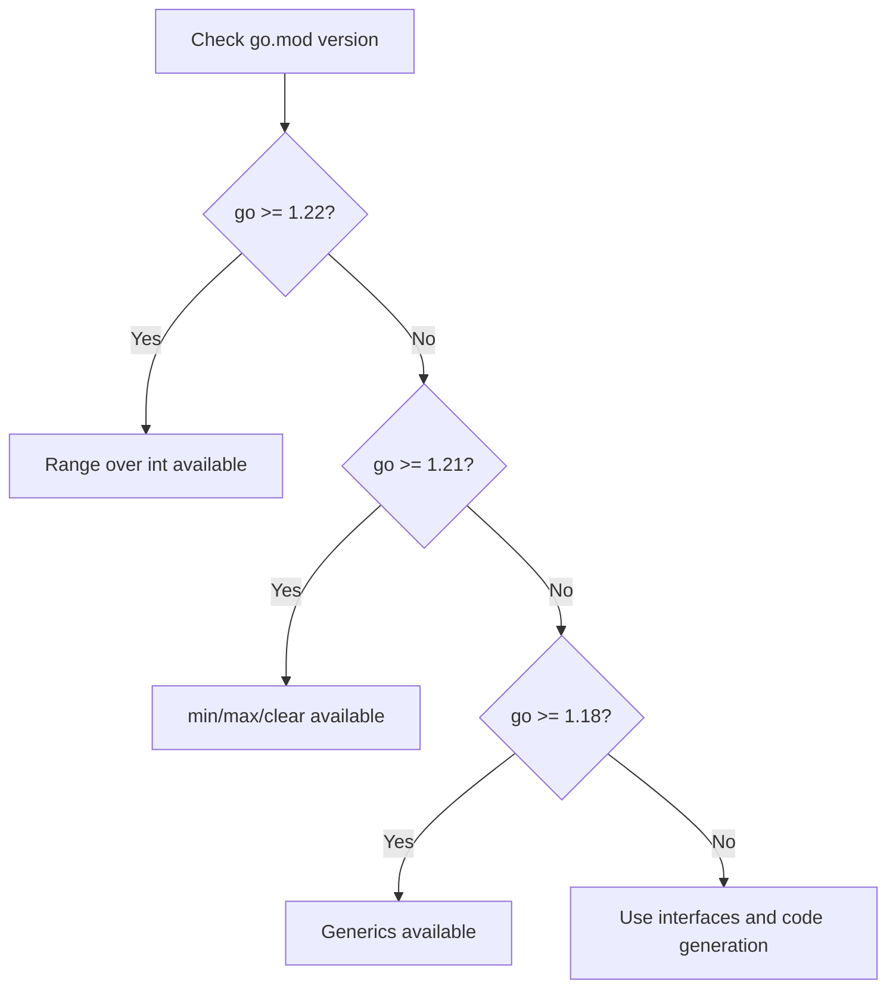
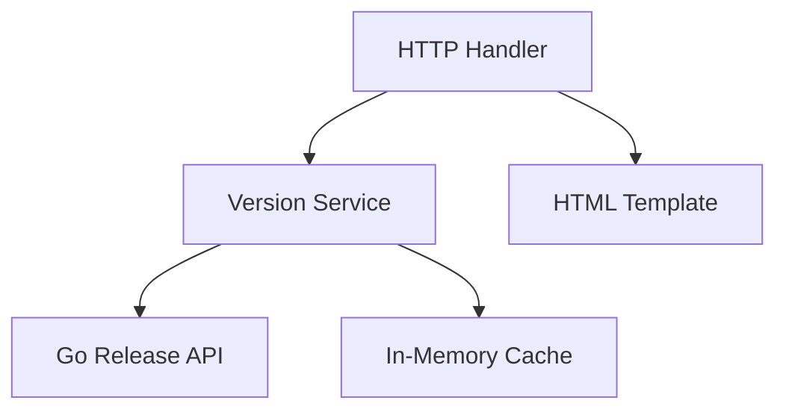

# History of Go — Practical Tasks

## Table of Contents

1. [Junior Tasks](#junior-tasks)
2. [Middle Tasks](#middle-tasks)
3. [Senior Tasks](#senior-tasks)
4. [Questions](#questions)
5. [Mini Projects](#mini-projects)
6. [Challenge](#challenge)

---

## Junior Tasks

### Task 1: Go Version Reporter

**Type:** Code

**Goal:** Practice using the `runtime` package to inspect Go's environment.

**Starter code:**

```go
package main

import (
    "fmt"
    "runtime"
)

// TODO: Complete this function to return a formatted string
// containing Go version, OS, architecture, and number of CPUs
func getEnvironmentInfo() string {
    // Use runtime.Version(), runtime.GOOS, runtime.GOARCH, runtime.NumCPU()
    return "TODO"
}

func main() {
    info := getEnvironmentInfo()
    fmt.Println(info)
}
```

**Expected output (example — varies by system):**
```
Go Version: go1.22.1
OS: linux
Architecture: amd64
CPUs: 8
```

**Evaluation criteria:**
- [ ] Code compiles and runs
- [ ] Output includes all four pieces of information
- [ ] Uses `runtime` package functions correctly

---

### Task 2: Go Timeline Quiz

**Type:** Code

**Goal:** Practice working with maps and conditionals by building an interactive quiz about Go's history.

**Starter code:**

```go
package main

import (
    "bufio"
    "fmt"
    "os"
    "strings"
)

// TODO: Create a map of Go milestones (year -> event)
// Include at least 5 milestones:
// 2007 - Design began
// 2009 - Open sourced
// 2012 - Go 1.0 released
// 2015 - Go 1.5 self-hosting compiler
// 2018 - Go 1.11 Modules introduced
// 2022 - Go 1.18 Generics added

func main() {
    milestones := map[int]string{
        // TODO: Fill in the milestones
    }

    scanner := bufio.NewScanner(os.Stdin)
    score := 0
    total := 0

    for year, event := range milestones {
        total++
        fmt.Printf("What happened in Go's history in %d?\n", year)
        fmt.Print("Your answer: ")
        scanner.Scan()
        answer := strings.ToLower(scanner.Text())
        eventLower := strings.ToLower(event)

        // TODO: Check if the answer contains key words from the event
        // Award a point if it does
        if strings.Contains(eventLower, answer) || strings.Contains(answer, "TODO") {
            fmt.Println("Correct!")
            score++
        } else {
            fmt.Printf("The answer was: %s\n", event)
        }
        fmt.Println()
    }

    fmt.Printf("Score: %d/%d\n", score, total)
}
```

**Expected output:**
```
What happened in Go's history in 2012?
Your answer: go 1.0 released
Correct!
...
Score: 4/6
```

**Evaluation criteria:**
- [ ] Code compiles and runs
- [ ] Map contains at least 5 milestones
- [ ] Quiz logic works with partial matches

---

### Task 3: Build Constraint Demo

**Type:** Code

**Goal:** Practice using Go build constraints to write version-specific code.

**Starter code:**

Create two files:

```go
// File: min_new.go
//go:build go1.21

package main

import "fmt"

func findMin(a, b int) int {
    // TODO: Use the built-in min function (Go 1.21+)
    return 0
}

func init() {
    fmt.Println("Using Go 1.21+ built-in min")
}
```

```go
// File: min_old.go
//go:build !go1.21

package main

import "fmt"

func findMin(a, b int) int {
    // TODO: Implement min manually
    return 0
}

func init() {
    fmt.Println("Using custom min (pre-Go 1.21)")
}
```

```go
// File: main.go
package main

import "fmt"

func main() {
    fmt.Println("Min of 5 and 3:", findMin(5, 3))
    fmt.Println("Min of -1 and 7:", findMin(-1, 7))
}
```

**Expected output:**
```
Using Go 1.21+ built-in min
Min of 5 and 3: 3
Min of -1 and 7: -1
```

**Evaluation criteria:**
- [ ] Code compiles and runs on both Go 1.21+ and older versions
- [ ] Build constraints are correct
- [ ] Output matches expected values

---

### Task 4: Go Version Feature Checker

**Type:** Design

**Goal:** Design a flowchart showing which Go features are available at different versions.

**Deliverable:** Create a Mermaid flowchart that shows the decision tree for feature availability.



**Evaluation criteria:**
- [ ] Flowchart includes at least 4 Go versions
- [ ] Decision logic is correct
- [ ] Readable and well-organized

---

## Middle Tasks

### Task 3: Module Migration Simulator

**Type:** Code

**Goal:** Build a tool that simulates migrating a GOPATH project to Go Modules.

**Requirements:**
- [ ] Parse a list of import paths and determine if they need module paths
- [ ] Generate a `go.mod` file structure
- [ ] Handle errors properly using Go idioms (`fmt.Errorf("...: %w", err)`)
- [ ] Write tests for your solution

**Starter code:**

```go
package main

import (
    "fmt"
    "strings"
)

// Dependency represents a Go package dependency
type Dependency struct {
    ImportPath string
    Version    string
}

// TODO: Implement generateGoMod that takes a module name and list of
// dependencies and returns a go.mod file content as a string
func generateGoMod(moduleName string, goVersion string, deps []Dependency) (string, error) {
    if moduleName == "" {
        return "", fmt.Errorf("generateGoMod: %w", fmt.Errorf("module name cannot be empty"))
    }

    var b strings.Builder
    fmt.Fprintf(&b, "module %s\n\n", moduleName)
    fmt.Fprintf(&b, "go %s\n", goVersion)

    if len(deps) > 0 {
        b.WriteString("\nrequire (\n")
        for _, dep := range deps {
            fmt.Fprintf(&b, "\t%s %s\n", dep.ImportPath, dep.Version)
        }
        b.WriteString(")\n")
    }

    return b.String(), nil
}

func main() {
    deps := []Dependency{
        {ImportPath: "github.com/gin-gonic/gin", Version: "v1.9.1"},
        {ImportPath: "github.com/lib/pq", Version: "v1.10.9"},
    }

    result, err := generateGoMod("github.com/myorg/myproject", "1.22", deps)
    if err != nil {
        fmt.Printf("Error: %v\n", err)
        return
    }
    fmt.Println(result)
}
```

**Expected output:**
```
module github.com/myorg/myproject

go 1.22

require (
	github.com/gin-gonic/gin v1.9.1
	github.com/lib/pq v1.10.9
)
```

---

### Task 4: Version Compatibility Checker

**Type:** Code

**Goal:** Build a tool that checks if a Go source file uses features from a specific Go version.

**Requirements:**
- [ ] Parse Go source code and detect version-specific features
- [ ] Report which minimum Go version is required
- [ ] Handle edge cases (empty input, invalid syntax)
- [ ] Write table-driven tests

**Starter code:**

```go
package main

import (
    "fmt"
    "strings"
)

// VersionFeature represents a Go feature and its minimum version
type VersionFeature struct {
    Feature    string
    MinVersion string
    Detector   func(source string) bool
}

var features = []VersionFeature{
    {
        Feature:    "Generics (type parameters)",
        MinVersion: "1.18",
        Detector:   func(s string) bool { return strings.Contains(s, "[T ") || strings.Contains(s, "[T]") },
    },
    {
        Feature:    "errors.Is/errors.As",
        MinVersion: "1.13",
        Detector:   func(s string) bool { return strings.Contains(s, "errors.Is") || strings.Contains(s, "errors.As") },
    },
    // TODO: Add detectors for:
    // - "any" keyword (Go 1.18+)
    // - "log/slog" import (Go 1.21+)
    // - "range" over integer (Go 1.22+)
    // - min/max built-in (Go 1.21+)
}

// TODO: Implement analyzeSource that returns the minimum Go version required
func analyzeSource(source string) (string, []string) {
    minVersion := "1.0"
    var detectedFeatures []string

    for _, f := range features {
        if f.Detector(source) {
            detectedFeatures = append(detectedFeatures, f.Feature)
            if f.MinVersion > minVersion {
                minVersion = f.MinVersion
            }
        }
    }

    return minVersion, detectedFeatures
}

func main() {
    source := `
package main

import (
    "errors"
    "fmt"
)

func Contains[T comparable](s []T, v T) bool {
    for _, item := range s {
        if item == v { return true }
    }
    return false
}

func main() {
    var ErrNotFound = errors.New("not found")
    err := fmt.Errorf("wrap: %w", ErrNotFound)
    if errors.Is(err, ErrNotFound) {
        fmt.Println("found!")
    }
}
`
    version, feats := analyzeSource(source)
    fmt.Printf("Minimum Go version: %s\n", version)
    fmt.Println("Detected features:")
    for _, f := range feats {
        fmt.Printf("  - %s\n", f)
    }
}
```

---

### Task 5: Error Handling Evolution Demo

**Type:** Code

**Goal:** Demonstrate the evolution of Go's error handling patterns from Go 1.0 to Go 1.20.

**Requirements:**
- [ ] Show string comparison (pre-1.13), error wrapping (1.13+), and errors.Join (1.20+)
- [ ] Each approach should be in a separate function
- [ ] Include comments explaining the historical context
- [ ] Write at least 3 tests

---

## Senior Tasks

### Task 6: Go Version Upgrade Impact Analyzer

**Type:** Code

**Goal:** Build a tool that analyzes a Go project and identifies potential issues when upgrading between specific Go versions.

**Requirements:**
- [ ] Accept source version and target version as parameters
- [ ] Detect patterns that may behave differently (e.g., loop variable capture in 1.22)
- [ ] Generate a risk report with severity levels
- [ ] Benchmark your analysis with `go test -bench=. -benchmem`
- [ ] Document trade-offs

**Starter code:**

```go
package main

import (
    "fmt"
    "strings"
)

type Risk struct {
    Severity    string // "high", "medium", "low"
    Description string
    Location    string
    Suggestion  string
}

type UpgradeReport struct {
    FromVersion string
    ToVersion   string
    Risks       []Risk
}

// TODO: Implement analyzeUpgrade that scans source code for
// patterns that may break or change behavior between versions
func analyzeUpgrade(source, fromVersion, toVersion string) UpgradeReport {
    report := UpgradeReport{
        FromVersion: fromVersion,
        ToVersion:   toVersion,
    }

    // Check for loop variable capture issues (1.21 → 1.22)
    if fromVersion < "1.22" && toVersion >= "1.22" {
        // Look for goroutines inside for loops that capture loop variables
        if strings.Contains(source, "go func()") && strings.Contains(source, "for ") {
            report.Risks = append(report.Risks, Risk{
                Severity:    "high",
                Description: "Loop variable scoping changed in Go 1.22",
                Location:    "for loop with goroutine closure",
                Suggestion:  "Review all for-loops with closures — behavior may change",
            })
        }
    }

    // TODO: Add more checks:
    // - //go:linkname usage (restricted in 1.23)
    // - deprecated API usage
    // - GOPATH-style imports

    return report
}

func main() {
    source := `
package main

func process(items []int) {
    for _, item := range items {
        go func() {
            fmt.Println(item)
        }()
    }
}
`
    report := analyzeUpgrade(source, "1.21", "1.22")
    fmt.Printf("Upgrade: Go %s → Go %s\n", report.FromVersion, report.ToVersion)
    fmt.Printf("Risks found: %d\n\n", len(report.Risks))
    for i, r := range report.Risks {
        fmt.Printf("Risk %d [%s]: %s\n", i+1, r.Severity, r.Description)
        fmt.Printf("  Location: %s\n", r.Location)
        fmt.Printf("  Suggestion: %s\n\n", r.Suggestion)
    }
}
```

---

### Task 7: GC Behavior Benchmarker

**Type:** Code

**Goal:** Build a benchmark suite that demonstrates how GOMEMLIMIT affects GC behavior.

**Requirements:**
- [ ] Create allocation-heavy workloads with different patterns
- [ ] Benchmark with and without GOMEMLIMIT
- [ ] Measure GC pause times, allocation counts, and throughput
- [ ] Generate a comparison report
- [ ] Document the trade-offs between GOGC and GOMEMLIMIT

---

## Questions

### 1. Why did Go choose not to include exceptions?

**Answer:**
The Go designers (coming from C and Plan 9) believed that exceptions create hidden control flow that makes programs harder to understand. Instead, Go uses explicit error returns (`func() (T, error)`) that force developers to handle errors at every call site. This makes the error handling visible in the code and prevents errors from propagating silently through the call stack. The pattern `if err != nil { return err }` is verbose but explicit.

---

### 2. What is the significance of November 10, 2009 in Go's history?

**Answer:**
November 10, 2009 is the date Go was publicly announced and released as an open-source project. This date is considered Go's "birthday." The Go team celebrates this annually, and the Go Playground's clock is permanently set to this date (2009-11-10 23:00:00 UTC).

---

### 3. Why did Go switch from segmented stacks to contiguous stacks?

**Answer:**
Segmented stacks (used in Go 1.0-1.3) suffered from the "hot split" problem: when a function call at a segment boundary caused the stack to grow, and the function return caused it to shrink, repeated calls would cause constant allocation/deallocation of segments. Contiguous stacks (Go 1.4+) solve this by copying the entire stack to a 2x larger allocation when growth is needed. While copying has a cost, it is amortized O(1) and eliminates the thrashing problem.

---

### 4. What was the `c2go` tool and why was it important?

**Answer:**
`c2go` was an automated translation tool that converted the Go compiler's C source code (written in Plan 9 C dialect) to Go source code. It was used to create Go 1.5's self-hosting compiler. The translation was intentionally mechanical (not idiomatic) to minimize human error. This was a critical milestone because it removed Go's dependency on a C compiler for bootstrapping and enabled Go-specific compiler optimizations in future releases.

---

### 5. How does Go's `go.sum` file prevent supply chain attacks?

**Answer:**
`go.sum` records cryptographic checksums (SHA-256 hashes) of all module dependencies. When `go build` or `go mod download` runs, it verifies that the downloaded modules match the checksums in `go.sum`. Since Go 1.14, these checksums are also verified against Google's transparency log (`sum.golang.org`), which maintains a tamper-proof record of all module versions. This makes it extremely difficult for an attacker to modify a published module without detection.

---

### 6. Why was the loop variable scoping change (Go 1.22) significant?

**Answer:**
Before Go 1.22, loop variables were scoped to the entire for loop, meaning closures would capture the variable by reference and all see the final value. This was the most common Go gotcha for over a decade. Go 1.22 changed loop variables to be per-iteration, which matches what developers intuitively expect. This was possible only because:
1. The old behavior was widely recognized as a design mistake
2. The `go` directive in `go.mod` allowed the change to be opt-in based on the version
3. The Go team created `loopclosure` analyzer to detect affected code

---

### 7. What are the differences between gc, gccgo, and tinygo?

**Answer:**
| Compiler | Backend | Use Case | Pros | Cons |
|----------|---------|----------|------|------|
| **gc** | Custom (SSA) | General purpose (default) | Fast compilation, official | Larger binaries than tinygo |
| **gccgo** | GCC | Linux systems | Better optimization for some workloads | Slower compilation, lags behind gc in features |
| **tinygo** | LLVM | Embedded, WebAssembly | Tiny binaries, microcontroller support | Does not support full Go spec |

---

## Mini Projects

### Project 1: Go Version History Dashboard

**Requirements:**
- [ ] Build a web server that displays Go's version history in a visual timeline
- [ ] Fetch release information from `https://go.dev/dl/?mode=json`
- [ ] Display version, release date, and key features for each release
- [ ] Include a feature compatibility matrix
- [ ] Tests with >80% coverage
- [ ] README with `go run` / `go test` instructions

**Difficulty:** Middle
**Estimated time:** 4-6 hours

**Architecture hint:**



---

## Challenge

### Go Compatibility Scanner

**Build a command-line tool that scans a Go project directory and produces a compatibility report.**

**Requirements:**
- Scan all `.go` files in a directory tree
- Detect usage of version-specific features (generics, error wrapping, min/max, range-over-int, slog, etc.)
- Report the minimum Go version required
- Identify deprecated patterns (GOPATH-style imports, `interface{}` instead of `any`)
- Output report in JSON and human-readable format

**Constraints:**
- Must run in under 5 seconds for a 10,000-file project
- Memory usage under 100 MB
- No external libraries (stdlib only)

**Scoring:**
- Correctness: 50% — accurate feature detection and version reporting
- Performance (benchmarks): 30% — handles large projects efficiently
- Code quality (go vet, readability): 20% — idiomatic Go, proper error handling
