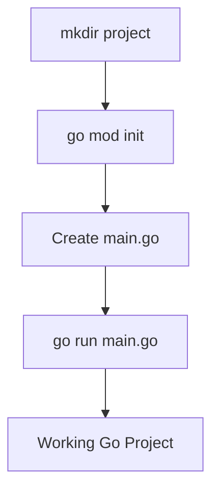
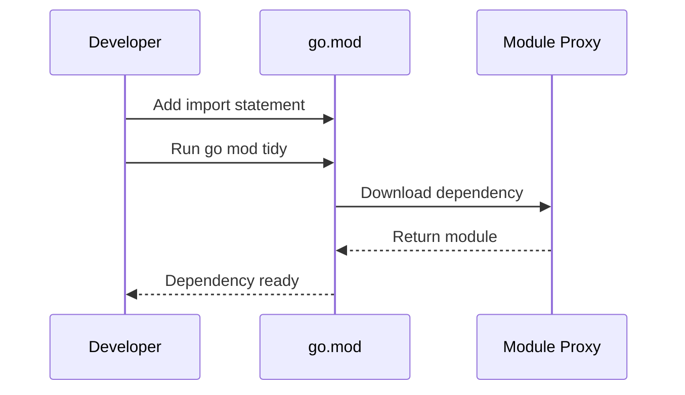
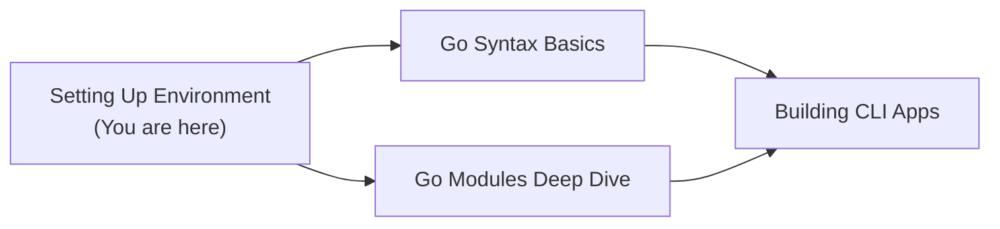
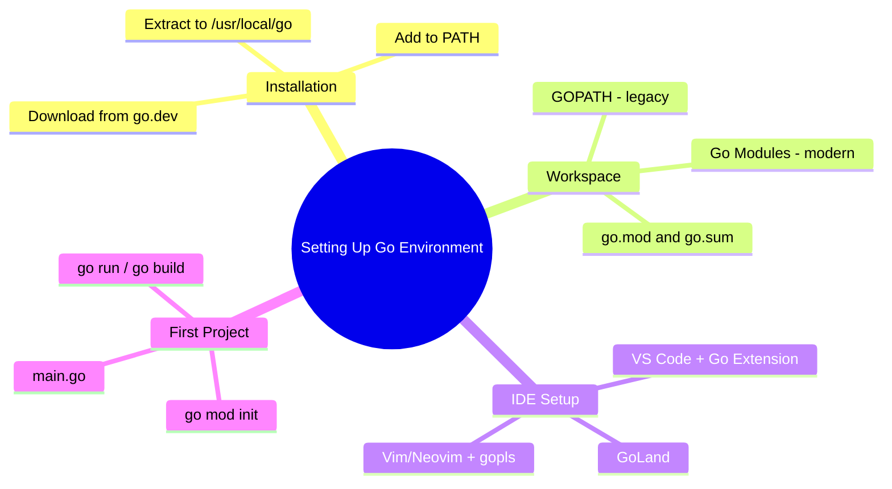
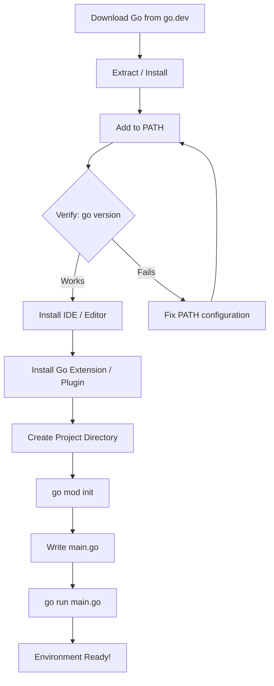

# Setting Up the Go Environment — Junior Level

## Table of Contents

1. [Introduction](#introduction)
2. [Prerequisites](#prerequisites)
3. [Glossary](#glossary)
4. [Core Concepts](#core-concepts)
5. [Real-World Analogies](#real-world-analogies)
6. [Mental Models](#mental-models)
7. [Pros & Cons](#pros--cons)
8. [Use Cases](#use-cases)
9. [Code Examples](#code-examples)
10. [Coding Patterns](#coding-patterns)
11. [Clean Code](#clean-code)
12. [Product Use / Feature](#product-use--feature)
13. [Error Handling](#error-handling)
14. [Security Considerations](#security-considerations)
15. [Performance Tips](#performance-tips)
16. [Metrics & Analytics](#metrics--analytics)
17. [Best Practices](#best-practices)
18. [Edge Cases & Pitfalls](#edge-cases--pitfalls)
19. [Common Mistakes](#common-mistakes)
20. [Common Misconceptions](#common-misconceptions)
21. [Tricky Points](#tricky-points)
22. [Test](#test)
23. [Tricky Questions](#tricky-questions)
24. [Cheat Sheet](#cheat-sheet)
25. [Self-Assessment Checklist](#self-assessment-checklist)
26. [Summary](#summary)
27. [What You Can Build](#what-you-can-build)
28. [Further Reading](#further-reading)
29. [Related Topics](#related-topics)
30. [Diagrams & Visual Aids](#diagrams--visual-aids)

---

## Introduction

> Focus: "What is it?" and "How to use it?"

Setting up the Go environment means installing the Go toolchain, configuring your workspace, choosing an IDE or editor, and creating your first Go project with modules. Before you can write and run Go programs, you need a properly configured development environment. This guide walks you through every step from downloading Go to running your first program.

---

## Prerequisites

- **Required:** Basic command line / terminal usage — you will run commands like `go run`, `go build`, and `go mod init`
- **Required:** A text editor or IDE installed — any editor works, but VS Code or GoLand is recommended
- **Helpful but not required:** Basic understanding of what a programming language is and how source code becomes an executable

---

## Glossary

| Term | Definition |
|------|-----------|
| **Go toolchain** | The set of tools (compiler, linker, etc.) that comes with the Go installation |
| **GOPATH** | The legacy workspace directory where Go stores source code, packages, and binaries |
| **Go modules** | The modern dependency management system introduced in Go 1.11, using `go.mod` files |
| **GOROOT** | The directory where Go itself is installed (e.g., `/usr/local/go`) |
| **go.mod** | A file that defines a module's path and its dependency requirements |
| **go.sum** | A file that records the expected cryptographic checksums of module dependencies |
| **IDE** | Integrated Development Environment — a tool that provides code editing, debugging, and building in one place |
| **Go extension** | A plugin for VS Code (or other editors) that adds Go language support like auto-completion and linting |

---

## Core Concepts

### Concept 1: Installing Go

Go is distributed as a single archive or installer. You download it from [go.dev/dl](https://go.dev/dl/), extract it, and add the `go` binary to your system PATH. After installation, `go version` confirms it works.

```bash
# Download and install Go (Linux/macOS)
wget https://go.dev/dl/go1.23.0.linux-amd64.tar.gz
sudo rm -rf /usr/local/go
sudo tar -C /usr/local -xzf go1.23.0.linux-amd64.tar.gz
export PATH=$PATH:/usr/local/go/bin
go version
```

### Concept 2: GOPATH vs Go Modules

**GOPATH** was the original workspace model — all Go code lived under one directory (`~/go`). **Go modules** replaced it: each project has its own `go.mod` file, and dependencies are downloaded to a local cache. Always use Go modules for new projects.

### Concept 3: IDE Setup

The two most popular choices are **VS Code with the Go extension** and **GoLand**. VS Code is free and lightweight; GoLand is a paid IDE with deeper Go-specific features. Both provide auto-completion, formatting, linting, and debugging.

### Concept 4: First Project Setup

Creating your first Go project involves making a directory, initializing a module, writing a `.go` file, and running it.

```bash
mkdir myproject && cd myproject
go mod init github.com/username/myproject
# Create main.go, then:
go run main.go
```

---

## Real-World Analogies

| Concept | Analogy |
|---------|--------|
| **Installing Go** | Installing a kitchen before you can cook — you need the tools (compiler) before writing code |
| **GOPATH** | An old-style shared workshop where all craftsmen put their tools in one big room — messy but simple |
| **Go Modules** | Each craftsman has their own toolbox with a label listing exactly what is inside — clean and portable |
| **IDE** | A workbench with built-in lights, rulers, and magnifying glass — makes the job easier but is not strictly required |

---

## Mental Models

**The intuition:** Think of Go's environment as three layers: (1) the Go toolchain installed on your machine, (2) your project folder with a `go.mod` file, and (3) your editor that helps you write code. Layer 1 must be set up once, Layer 2 is created per project, and Layer 3 is your personal preference.

**Why this model helps:** It prevents confusion about what is "global" (Go installation) vs "per-project" (modules) vs "personal" (editor settings).

---

## Pros & Cons

| Pros | Cons |
|------|------|
| Go has a single binary installation — no runtime dependency | Must manually add Go to PATH on some systems |
| Go modules handle dependencies automatically | Module proxy and checksum database require internet access |
| `go fmt` enforces consistent code style everywhere | Limited IDE choices compared to languages like Java or Python |
| Cross-platform — same setup on Linux, macOS, Windows | Version upgrades can sometimes require manual cleanup of old installations |

### When to use:
- Always — you cannot write Go programs without setting up the environment first

### When NOT to use:
- If you only need to run a quick snippet, use the [Go Playground](https://go.dev/play/) online without any setup

---

## Use Cases

- **Use Case 1:** Setting up a fresh development machine for a new Go project
- **Use Case 2:** Configuring CI/CD pipelines to build and test Go code
- **Use Case 3:** Onboarding a new team member who needs a working Go environment

---

## Code Examples

### Example 1: Hello World — Your First Go Program

```go
// main.go — the simplest possible Go program
package main

import "fmt"

func main() {
    fmt.Println("Hello, World!")
}
```

**What it does:** Prints "Hello, World!" to the terminal.
**How to run:** `go run main.go`

### Example 2: Creating a Module with a Dependency

```go
// main.go — using an external package
package main

import (
    "fmt"
    "rsc.io/quote"
)

func main() {
    fmt.Println(quote.Hello())
}
```

**Setup steps:**
```bash
mkdir quoteapp && cd quoteapp
go mod init example.com/quoteapp
# Create main.go with the code above, then:
go mod tidy   # downloads the dependency
go run main.go
```

**What it does:** Downloads the `rsc.io/quote` module and prints a greeting.
**How to run:** `go run main.go` (after `go mod tidy`)

### Example 3: Verifying Your Installation

```go
// check_env.go — prints Go environment info
package main

import (
    "fmt"
    "runtime"
)

func main() {
    fmt.Printf("Go Version: %s\n", runtime.Version())
    fmt.Printf("OS/Arch:    %s/%s\n", runtime.GOOS, runtime.GOARCH)
    fmt.Printf("GOROOT:     %s\n", runtime.GOROOT())
    fmt.Printf("NumCPU:     %d\n", runtime.NumCPU())
}
```

**What it does:** Displays Go version, operating system, architecture, and GOROOT.
**How to run:** `go run check_env.go`

---

## Coding Patterns

### Pattern 1: Standard Project Initialization

**Intent:** Create a new Go project with proper module support.
**When to use:** Every time you start a new Go project.

```go
// Step 1: Terminal commands
// mkdir myapp && cd myapp
// go mod init github.com/username/myapp

// Step 2: Create main.go
package main

import "fmt"

func main() {
    fmt.Println("Project initialized successfully!")
}

// Step 3: Run it
// go run main.go
```

**Diagram:**



**Remember:** Always run `go mod init` before writing any Go code in a new directory.

---

### Pattern 2: Adding Dependencies

**Intent:** Import and use third-party packages in your project.

```go
// After adding an import to your .go file:
// go mod tidy
// This downloads missing dependencies and removes unused ones
package main

import (
    "fmt"
    "github.com/fatih/color"
)

func main() {
    color.Green("This text is green!")
    fmt.Println("Dependencies are working!")
}
```

**Diagram:**



---

## Clean Code

### Naming

```go
// Bad naming for project structure
// myapp/a/b.go

// Clean naming for project structure
// myapp/internal/handler/user.go
```

**Rules:**
- Module paths: use your domain or GitHub path (`github.com/username/project`)
- Package names: short, lowercase, no underscores (`handler`, not `user_handler`)
- Files: lowercase with underscores if needed (`user_handler.go`)

---

### Functions

```go
// Too much in one function
func setup() {
    // install Go
    // configure PATH
    // initialize module
    // create main.go
    // run tests
}

// Single responsibility
func installGo() error          { return nil }
func configurePATH() error      { return nil }
func initModule(name string) error { return nil }
```

**Rule:** Each setup step should be its own function or script.

---

### Comments

```go
// Bad: states the obvious
// Initialize the module
go mod init myapp

// Good: explains WHY
// Use the full GitHub path so 'go get' works for other users
go mod init github.com/username/myapp
```

**Rule:** Comments should explain decisions, not repeat what the code does.

---

## Product Use / Feature

### 1. Docker

- **How it uses Go environment:** Docker is written in Go. Building Docker from source requires setting up Go and configuring build tools.
- **Why it matters:** Shows how the Go toolchain is used in one of the most important infrastructure projects.

### 2. Kubernetes

- **How it uses Go environment:** Kubernetes has a standardized development setup with specific Go version requirements documented in their contributor guide.
- **Why it matters:** Following Kubernetes' setup guide teaches best practices for large-scale Go projects.

### 3. VS Code Go Extension

- **How it uses Go environment:** The extension auto-detects your Go installation, formats code on save with `gofmt`, and runs linting with `staticcheck`.
- **Why it matters:** Proper IDE setup dramatically increases productivity and code quality.

---

## Error Handling

### Error 1: `go: command not found`

```bash
# This error happens when Go is not in your PATH
$ go version
bash: go: command not found
```

**Why it happens:** The Go binary directory is not added to your shell's PATH variable.
**How to fix:**

```bash
# Add to ~/.bashrc or ~/.zshrc
export PATH=$PATH:/usr/local/go/bin
# Then reload your shell
source ~/.bashrc
```

### Error 2: `go.mod file not found`

```bash
# This error happens when you run go commands outside a module
$ go build
go: go.mod file not found in current directory or any parent directory
```

**Why it happens:** You are running a `go` command in a directory without a `go.mod` file.
**How to fix:**

```bash
# Initialize a module in your project directory
go mod init example.com/myproject
```

### Error 3: `cannot find module providing package`

```bash
$ go run main.go
main.go:5:2: no required module provides package github.com/some/pkg
```

**Why it happens:** You imported a package but did not download it.
**How to fix:**

```bash
# Download all missing dependencies
go mod tidy
```

### Error Handling Pattern

```go
// When checking if Go tools are available, verify errors
package main

import (
    "fmt"
    "os/exec"
)

func main() {
    path, err := exec.LookPath("go")
    if err != nil {
        fmt.Printf("Go not found: %v\n", err)
        fmt.Println("Please install Go from https://go.dev/dl/")
        return
    }
    fmt.Printf("Go found at: %s\n", path)
}
```

---

## Security Considerations

### 1. Verify Downloads

```bash
# Insecure — downloading from an unofficial source
wget https://some-random-site.com/go.tar.gz

# Secure — always download from the official site and verify checksum
wget https://go.dev/dl/go1.23.0.linux-amd64.tar.gz
sha256sum go1.23.0.linux-amd64.tar.gz
# Compare with the checksum listed on go.dev/dl/
```

**Risk:** A tampered Go binary could inject malicious code into everything you compile.
**Mitigation:** Always download from go.dev and verify SHA256 checksums.

### 2. Module Checksums

```bash
# Go automatically verifies module checksums via sum.golang.org
# If you see this error, DO NOT ignore it:
# verifier error: checksum mismatch
```

**Risk:** A compromised dependency could contain malicious code.
**Mitigation:** Never disable `GONOSUMCHECK`. Let Go verify all module checksums automatically.

---

## Performance Tips

### Tip 1: Use `go build` Instead of `go run` for Repeated Execution

```bash
# Slow — compiles every time
go run main.go

# Faster for repeated runs — compile once, run the binary
go build -o myapp main.go
./myapp
```

**Why it's faster:** `go run` compiles to a temp directory every time, while `go build` creates a reusable binary.

### Tip 2: Enable the Go Build Cache

```bash
# Check if the build cache is active (it is by default)
go env GOCACHE
# Typical output: /home/user/.cache/go-build

# Clearing the cache (only if necessary)
go clean -cache
```

**Why it's faster:** Go caches compiled packages so subsequent builds only recompile changed files.

---

## Metrics & Analytics

### What to Measure

| Metric | Why it matters | Tool |
|--------|---------------|------|
| **Build time** | Slow builds reduce productivity | `time go build ./...` |
| **Binary size** | Large binaries slow deployment | `ls -lh myapp` |
| **Dependency count** | Too many deps increase attack surface | `go list -m all \| wc -l` |

### Basic Instrumentation

```bash
# Measure build time
time go build -o myapp ./...

# Check binary size
ls -lh myapp

# Count dependencies
go list -m all | wc -l
```

---

## Best Practices

- **Use Go modules for every project** — never rely on GOPATH for new code
- **Pin your Go version** — document the required Go version in your README or `go.mod`
- **Run `go mod tidy` regularly** — keeps your `go.mod` and `go.sum` clean
- **Use `go vet ./...` before committing** — catches common mistakes automatically
- **Format your code with `gofmt` or `goimports`** — enforces the standard Go style

---

## Edge Cases & Pitfalls

### Pitfall 1: Multiple Go Installations

```bash
# You might have Go installed via package manager AND manually
which -a go
# Output:
# /usr/local/go/bin/go
# /usr/bin/go    <-- old version from package manager
```

**What happens:** The wrong version of Go may be used, causing confusing build errors.
**How to fix:** Remove the old installation or adjust your PATH to prioritize the correct one.

### Pitfall 2: GOPATH and Modules Conflict

```bash
# If GO111MODULE is set to "off", modules are disabled
go env GO111MODULE
# Should output: "" or "on"
```

**What happens:** Go ignores your `go.mod` file and looks for packages in GOPATH.
**How to fix:** `go env -w GO111MODULE=on`

---

## Common Mistakes

### Mistake 1: Not Running `go mod tidy`

```bash
# Wrong — manually editing go.mod
echo 'require github.com/pkg/errors v0.9.1' >> go.mod

# Correct — let Go manage dependencies
go mod tidy
```

### Mistake 2: Forgetting `package main` and `func main()`

```go
// Wrong — missing package declaration
import "fmt"

func main() {
    fmt.Println("Hello")
}

// Correct — every executable needs package main
package main

import "fmt"

func main() {
    fmt.Println("Hello")
}
```

### Mistake 3: Wrong Module Path

```bash
# Wrong — generic module path
go mod init myapp

# Correct — use a unique, URL-like path
go mod init github.com/username/myapp
```

---

## Common Misconceptions

### Misconception 1: "I need to set GOPATH for Go modules to work"

**Reality:** Go modules do NOT require GOPATH. Since Go 1.16, modules are the default. GOPATH is only used as a cache location (`~/go/pkg/mod`).

**Why people think this:** Older tutorials and blog posts (pre-2019) heavily relied on GOPATH because modules did not exist yet.

### Misconception 2: "I need GoLand to write Go — VS Code is not enough"

**Reality:** VS Code with the official Go extension provides excellent Go support including auto-completion, debugging, test running, and refactoring. GoLand offers some additional features, but VS Code is fully sufficient.

**Why people think this:** GoLand's marketing and its Java IDE heritage make it seem like the "serious" option.

---

## Tricky Points

### Tricky Point 1: `go install` vs `go build`

```bash
# go build — creates binary in current directory
go build -o myapp .

# go install — creates binary in $GOPATH/bin or $GOBIN
go install .
```

**Why it's tricky:** Both compile code, but the output goes to different places.
**Key takeaway:** Use `go build` for project binaries, `go install` for tools you want globally available.

### Tricky Point 2: Module Path Must Match Repository

```bash
# If your repo is github.com/alice/mylib, your go.mod must say:
# module github.com/alice/mylib
# NOT: module mylib
```

**Why it's tricky:** Go uses the module path to resolve imports. A mismatch means `go get` fails for users of your library.
**Key takeaway:** Always use the full repository URL as your module path.

---

## Test

### Multiple Choice

**1. What command initializes a new Go module?**

- A) `go new module myapp`
- B) `go mod init myapp`
- C) `go init myapp`
- D) `go create module myapp`

<details>
<summary>Answer</summary>
**B)** — `go mod init myapp` creates a new `go.mod` file in the current directory. There is no `go new`, `go init`, or `go create` command.
</details>

### True or False

**2. GOPATH is required for Go modules to work.**

<details>
<summary>Answer</summary>
**False** — Go modules work independently of GOPATH. Since Go 1.16, module mode is the default. GOPATH is only used as a default cache location.
</details>

### What's the Output?

**3. What does this code print?**

```go
package main

import (
    "fmt"
    "runtime"
)

func main() {
    fmt.Println(runtime.Version())
}
```

<details>
<summary>Answer</summary>
Output: The installed Go version, e.g., `go1.23.0`
Explanation: `runtime.Version()` returns the Go version string of the binary that is currently running.
</details>

**4. What happens if you run `go run main.go` without a `go.mod` file?**

- A) It works fine
- B) It prints a warning but runs
- C) It fails with "go.mod file not found"
- D) It creates a go.mod automatically

<details>
<summary>Answer</summary>
**C)** — Since Go 1.16, module mode is default and requires a `go.mod` file. Without it, Go refuses to run.
</details>

**5. Which environment variable points to where Go is installed?**

- A) GOPATH
- B) GOROOT
- C) GOBIN
- D) GOCACHE

<details>
<summary>Answer</summary>
**B)** — GOROOT points to the Go installation directory (e.g., `/usr/local/go`). GOPATH is the workspace, GOBIN is where installed binaries go, and GOCACHE is the build cache.
</details>

---

## "What If?" Scenarios

**What if you have Go 1.20 installed but your project's `go.mod` says `go 1.22`?**
- **You might think:** The project will not build at all.
- **But actually:** Go is forward-compatible for the `go` directive. Go 1.20 will attempt to build the project but may fail if the code uses features introduced in Go 1.22. The `go` directive in `go.mod` is a minimum version, not a strict requirement (though since Go 1.21, toolchain management can auto-download the right version).

---

## Tricky Questions

**1. What is the difference between `go mod tidy` and `go mod download`?**

- A) They do the same thing
- B) `tidy` updates `go.mod`, `download` only fills the cache
- C) `download` updates `go.mod`, `tidy` only fills the cache
- D) Neither modifies `go.mod`

<details>
<summary>Answer</summary>
**B)** — `go mod tidy` analyzes your source code, adds missing dependencies to `go.mod`, removes unused ones, and downloads everything needed. `go mod download` only downloads modules already listed in `go.mod` into the local cache without modifying `go.mod`.
</details>

**2. Where does `go install github.com/golangci/golangci-lint/cmd/golangci-lint@latest` put the binary?**

- A) In the current directory
- B) In GOROOT/bin
- C) In GOPATH/bin (or GOBIN if set)
- D) In /usr/local/bin

<details>
<summary>Answer</summary>
**C)** — `go install` places binaries in `$GOBIN` if set, otherwise in `$GOPATH/bin` (default: `~/go/bin`). Make sure this directory is in your PATH.
</details>

---

## Cheat Sheet

| What | Syntax / Command | Example |
|------|-----------------|---------|
| Install Go | Download from go.dev/dl | `tar -C /usr/local -xzf go1.23.0.linux-amd64.tar.gz` |
| Check version | `go version` | `go1.23.0 linux/amd64` |
| Init module | `go mod init <path>` | `go mod init github.com/user/app` |
| Run program | `go run <file>` | `go run main.go` |
| Build binary | `go build -o <name>` | `go build -o myapp .` |
| Add deps | `go mod tidy` | Adds missing, removes unused |
| Format code | `gofmt -w .` | Formats all .go files |
| Lint code | `go vet ./...` | Checks for common mistakes |
| See env vars | `go env` | Shows all Go environment variables |
| Set env var | `go env -w KEY=VAL` | `go env -w GOBIN=/usr/local/bin` |

---

## Self-Assessment Checklist

### I can explain:
- [ ] What Go modules are and why they replaced GOPATH
- [ ] The difference between GOROOT and GOPATH
- [ ] What `go.mod` and `go.sum` files do
- [ ] Why module paths should match repository URLs

### I can do:
- [ ] Install Go from scratch on my operating system
- [ ] Create a new Go project with `go mod init`
- [ ] Add and manage dependencies with `go mod tidy`
- [ ] Set up VS Code with the Go extension for Go development

### I can answer:
- [ ] All multiple choice questions in this document
- [ ] "What's the output?" questions correctly

---

## Summary

- Go installation is a single binary — download, extract, add to PATH
- Go modules (`go.mod`) are the standard way to manage dependencies — GOPATH is legacy
- VS Code with the Go extension or GoLand are the best IDE choices for Go development
- Every Go project starts with `go mod init` followed by creating a `main.go` file
- Use `go run` for quick testing and `go build` for creating deployable binaries

**Next step:** Learn about Go's basic syntax — variables, types, functions, and control flow.

---

## What You Can Build

### Projects you can create:
- **Hello World CLI tool:** A simple command-line app that takes arguments and prints output
- **Environment checker:** A tool that verifies all Go tools are properly installed
- **Project scaffolder:** A script that creates a standard Go project structure

### Learning path — what to study next:



---

## Further Reading

- **Official docs:** [Getting Started with Go](https://go.dev/doc/tutorial/getting-started) — the official first tutorial
- **Official docs:** [Managing Dependencies](https://go.dev/doc/modules/managing-dependencies) — how Go modules work
- **Blog post:** [Using Go Modules](https://go.dev/blog/using-go-modules) — the original modules blog series
- **Video:** [Setting up Go with VS Code](https://www.youtube.com/watch?v=1MXIGYrMk80) — step-by-step IDE setup

---

## Related Topics

- **Go Syntax Basics** — what to learn after your environment is ready
- **Go Modules** — deeper dive into dependency management

---

## Diagrams & Visual Aids

### Mind Map



### Go Environment Setup Flow



### Go Project Structure

```
myproject/
├── go.mod          ← Module definition (name, Go version, dependencies)
├── go.sum          ← Checksums of all dependencies
├── main.go         ← Entry point: package main + func main()
├── internal/       ← Private packages (not importable by others)
│   └── handler/
│       └── user.go
└── pkg/            ← Public packages (importable by others)
    └── util/
        └── helper.go
```
