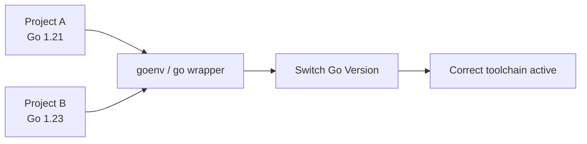
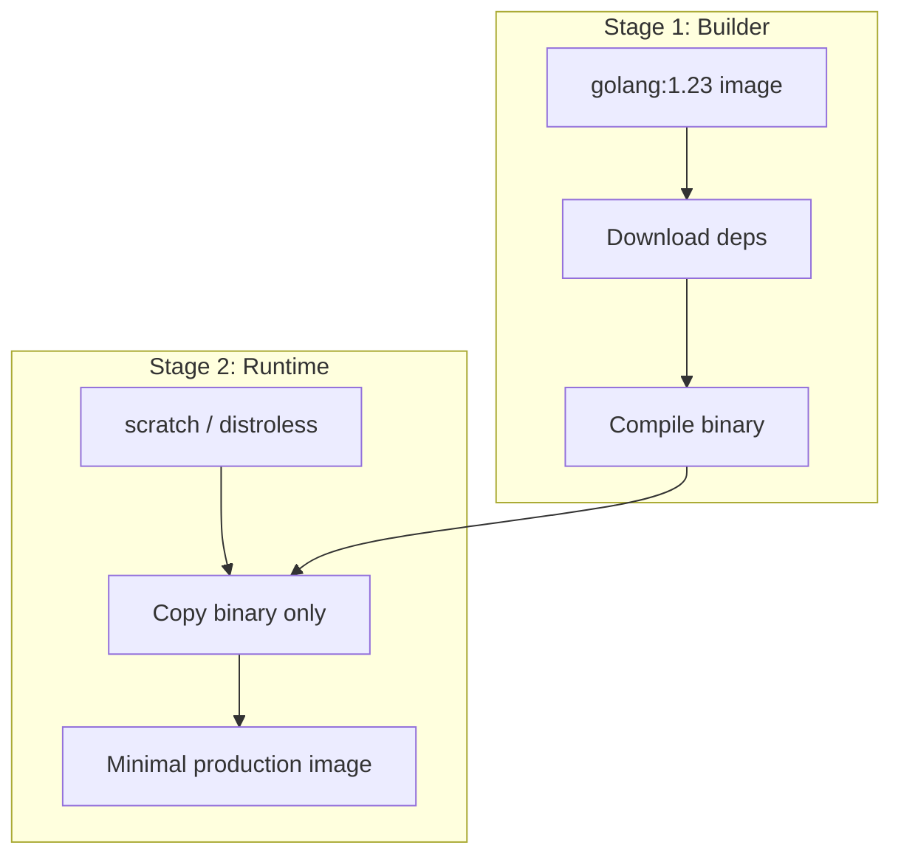
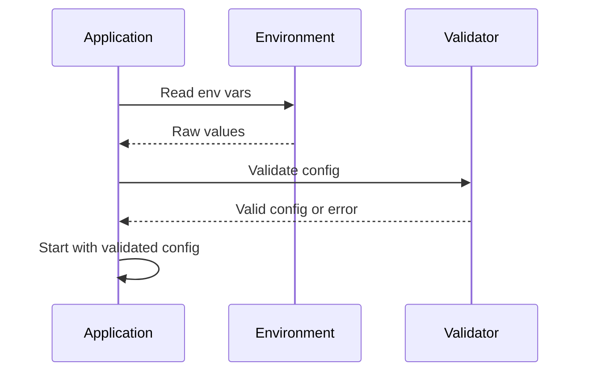
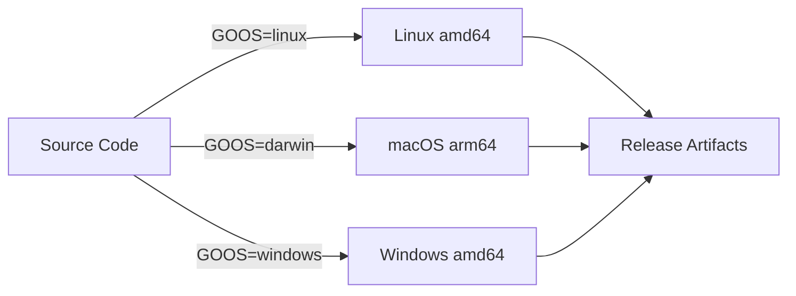
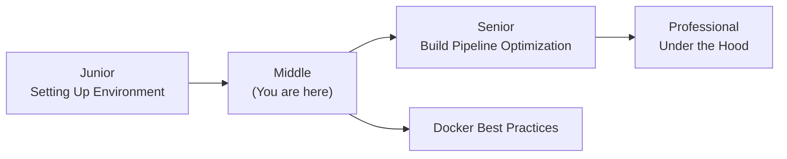
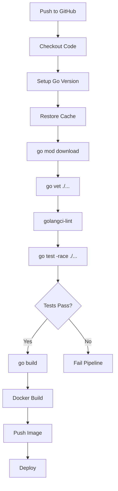
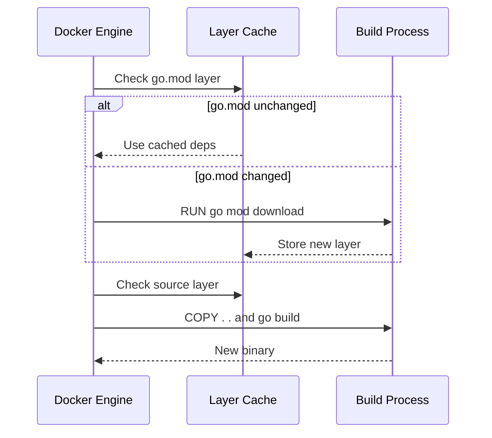

# Setting Up the Go Environment — Middle Level

## Table of Contents

1. [Introduction](#introduction)
2. [Core Concepts](#core-concepts)
3. [Evolution & Historical Context](#evolution--historical-context)
4. [Pros & Cons](#pros--cons)
5. [Alternative Approaches](#alternative-approaches-plan-b)
6. [Use Cases](#use-cases)
7. [Code Examples](#code-examples)
8. [Coding Patterns](#coding-patterns)
9. [Clean Code](#clean-code)
10. [Product Use / Feature](#product-use--feature)
11. [Error Handling](#error-handling)
12. [Security Considerations](#security-considerations)
13. [Performance Optimization](#performance-optimization)
14. [Metrics & Analytics](#metrics--analytics)
15. [Debugging Guide](#debugging-guide)
16. [Best Practices](#best-practices)
17. [Edge Cases & Pitfalls](#edge-cases--pitfalls)
18. [Common Mistakes](#common-mistakes)
19. [Anti-Patterns](#anti-patterns)
20. [Tricky Points](#tricky-points)
21. [Comparison with Other Languages](#comparison-with-other-languages)
22. [Test](#test)
23. [Tricky Questions](#tricky-questions)
24. [Cheat Sheet](#cheat-sheet)
25. [Summary](#summary)
26. [What You Can Build](#what-you-can-build)
27. [Further Reading](#further-reading)
28. [Related Topics](#related-topics)
29. [Diagrams & Visual Aids](#diagrams--visual-aids)

---

## Introduction

> Focus: "Why?" and "When to use?"

Assumes the reader already knows the basics. This level covers:
- Managing multiple Go versions with tools like `goenv` or the `go` wrapper
- Configuring workspaces for teams and monorepos
- Setting up CI/CD pipelines for Go projects
- Docker-based Go development environments
- Build tags and cross-compilation basics

---

## Core Concepts

### Concept 1: Multi-Version Management

In production teams you often need different Go versions for different projects. Tools like `goenv`, `gvm`, or the built-in `go install golang.org/dl/go1.21.0@latest` command let you switch between versions.

```bash
# Using the official Go wrapper approach
go install golang.org/dl/go1.22.0@latest
go1.22.0 download
go1.22.0 version  # go version go1.22.0 linux/amd64

# Using goenv
goenv install 1.23.0
goenv local 1.23.0    # set version for current directory
goenv global 1.22.0   # set default version
```



### Concept 2: Workspace Configuration

Go 1.18 introduced **workspaces** (`go.work`) for developing multiple related modules simultaneously without publishing them.

```bash
# Create a workspace for multi-module development
go work init ./api ./shared ./worker
```

```go
// go.work file
go 1.23

use (
    ./api
    ./shared
    ./worker
)
```

### Concept 3: CI/CD Setup for Go

A production CI/CD pipeline for Go should include linting, testing with race detection, building, and security scanning.

```yaml
# .github/workflows/go.yml
name: Go CI
on: [push, pull_request]
jobs:
  build:
    runs-on: ubuntu-latest
    steps:
      - uses: actions/checkout@v4
      - uses: actions/setup-go@v5
        with:
          go-version: '1.23'
      - run: go vet ./...
      - run: go test -race -coverprofile=coverage.out ./...
      - run: go build -o app ./cmd/server
      - name: golangci-lint
        uses: golangci/golangci-lint-action@v4
        with:
          version: latest
```

### Concept 4: Docker-Based Development

Docker standardizes the development environment across the team and eliminates "works on my machine" issues.

```dockerfile
# Dockerfile.dev — development container
FROM golang:1.23-bookworm

RUN go install github.com/air-verse/air@latest
RUN go install github.com/go-delve/delve/cmd/dlv@latest

WORKDIR /app
COPY go.mod go.sum ./
RUN go mod download

COPY . .
CMD ["air", "-c", ".air.toml"]
```

### Concept 5: Build Tags

Build tags let you include or exclude files during compilation — useful for platform-specific code, feature flags, or testing.

```go
//go:build integration

package myapp_test

import "testing"

func TestIntegration(t *testing.T) {
    // This test only runs when: go test -tags=integration ./...
    t.Log("Running integration test")
}
```

### Concept 6: Cross-Compilation

Go makes cross-compilation trivial — set `GOOS` and `GOARCH` environment variables.

```bash
# Build for Linux from macOS
GOOS=linux GOARCH=amd64 go build -o server-linux ./cmd/server

# Build for Windows
GOOS=windows GOARCH=amd64 go build -o server.exe ./cmd/server

# Build for ARM (Raspberry Pi)
GOOS=linux GOARCH=arm64 go build -o server-arm ./cmd/server
```

---

## Evolution & Historical Context

**Before Go modules (pre-2019):**
- All Go code lived under `$GOPATH/src/`
- Dependency management was chaotic — tools like `dep`, `glide`, and `godep` competed
- No version pinning by default — `go get` always fetched the latest code
- Reproducible builds were nearly impossible without vendoring

**How Go modules changed things:**
- Each project is self-contained with `go.mod` and `go.sum`
- Semantic versioning is enforced
- The module proxy (`proxy.golang.org`) caches dependencies for reliability
- Checksum database (`sum.golang.org`) ensures integrity
- `go.work` added workspace support for multi-module development

---

## Pros & Cons

| Pros | Cons |
|------|------|
| Single binary toolchain — no runtime or plugin managers | Go version upgrades can break builds if not pinned |
| Cross-compilation is built-in — no extra tools needed | CGo breaks cross-compilation (need C cross-compiler) |
| Module proxy caches deps — builds work even if source repo is down | Private modules need extra proxy/auth configuration |
| `go.sum` ensures reproducible builds | Large `go.sum` files in projects with many dependencies |

### Trade-off analysis:
- **Docker dev containers vs local Go installation:** Docker ensures consistency but adds overhead. Use Docker for teams, local Go for solo projects.
- **goenv vs official Go wrappers:** goenv is more user-friendly but adds a dependency. Official wrappers are simpler but more verbose.

### Comparison with alternatives:

| Approach | Pros | Cons | Best for |
|----------|------|------|----------|
| Local Go + goenv | Fast builds, easy switching | Inconsistent across machines | Solo developers |
| Docker dev container | Consistent, reproducible | Slower I/O on macOS/Windows | Teams |
| Nix/devbox | Perfectly reproducible | Steep learning curve | Infra-heavy teams |

---

## Alternative Approaches (Plan B)

| Alternative | How it works | When you might be forced to use it |
|-------------|--------------|-------------------------------------|
| **Nix / devbox** | Declarative environment with pinned packages | When Docker overhead is too high and you need reproducibility |
| **asdf** | Universal version manager for multiple languages | When your team uses Go, Python, Node and wants one tool |

---

## Use Cases

- **Use Case 1:** Setting up a CI/CD pipeline for a Go microservice with GitHub Actions
- **Use Case 2:** Managing Go versions across a team building a monorepo with 5+ services
- **Use Case 3:** Cross-compiling a CLI tool for Linux, macOS, and Windows in one build step

---

## Code Examples

### Example 1: Production Makefile

```makefile
# Makefile for a production Go project
.PHONY: build test lint clean docker

BINARY=server
VERSION=$(shell git describe --tags --always --dirty)
LDFLAGS=-ldflags "-X main.version=$(VERSION) -s -w"

build:
	CGO_ENABLED=0 go build $(LDFLAGS) -o $(BINARY) ./cmd/server

test:
	go test -race -coverprofile=coverage.out ./...
	go tool cover -func=coverage.out

lint:
	golangci-lint run ./...
	go vet ./...

clean:
	rm -f $(BINARY) coverage.out

docker:
	docker build -t myapp:$(VERSION) .

cross:
	GOOS=linux GOARCH=amd64 go build $(LDFLAGS) -o $(BINARY)-linux-amd64 ./cmd/server
	GOOS=darwin GOARCH=arm64 go build $(LDFLAGS) -o $(BINARY)-darwin-arm64 ./cmd/server
	GOOS=windows GOARCH=amd64 go build $(LDFLAGS) -o $(BINARY)-windows-amd64.exe ./cmd/server
```

**Why this pattern:** A Makefile centralizes all build, test, and deployment commands for consistency.
**Trade-offs:** Requires `make` installed; alternatively use [task](https://taskfile.dev/) or [mage](https://magefile.org/) for pure-Go alternatives.

### Example 2: Build Tags for Feature Flags

```go
// feature_premium.go
//go:build premium

package features

func GetPlanName() string {
    return "Premium"
}
```

```go
// feature_free.go
//go:build !premium

package features

func GetPlanName() string {
    return "Free"
}
```

```bash
# Build free version (default)
go build -o app-free ./cmd/app

# Build premium version
go build -tags=premium -o app-premium ./cmd/app
```

**When to use which:** Build tags for compile-time feature selection; environment variables for runtime configuration.

---

## Coding Patterns

### Pattern 1: Multi-Stage Build Pattern

**Category:** Idiomatic / Deployment
**Intent:** Produce minimal Docker images for Go applications.
**When to use:** Every time you deploy a Go app in a container.
**When NOT to use:** During development — use a full Go image instead.

**Structure diagram:**



**Implementation:**

```dockerfile
# Multi-stage Dockerfile
FROM golang:1.23-bookworm AS builder
WORKDIR /app
COPY go.mod go.sum ./
RUN go mod download
COPY . .
RUN CGO_ENABLED=0 GOOS=linux go build -ldflags="-s -w" -o /server ./cmd/server

FROM gcr.io/distroless/static-debian12:nonroot
COPY --from=builder /server /server
ENTRYPOINT ["/server"]
```

**Trade-offs:**

| Pros | Cons |
|---------|---------|
| Final image is 5-15 MB instead of 800+ MB | Cannot shell into the container for debugging |
| Reduced attack surface | Must use multi-stage approach consistently |

---

### Pattern 2: Environment Configuration with Validation

**Category:** Idiomatic / Configuration
**Intent:** Load and validate environment configuration at startup.

**Flow diagram:**



```go
package config

import (
    "fmt"
    "os"
    "strconv"
)

type Config struct {
    Port     int
    DBHost   string
    LogLevel string
}

func Load() (*Config, error) {
    port, err := strconv.Atoi(getEnv("PORT", "8080"))
    if err != nil {
        return nil, fmt.Errorf("invalid PORT: %w", err)
    }

    cfg := &Config{
        Port:     port,
        DBHost:   getEnv("DB_HOST", "localhost:5432"),
        LogLevel: getEnv("LOG_LEVEL", "info"),
    }

    if err := cfg.validate(); err != nil {
        return nil, fmt.Errorf("config validation: %w", err)
    }
    return cfg, nil
}

func (c *Config) validate() error {
    if c.Port < 1 || c.Port > 65535 {
        return fmt.Errorf("port must be 1-65535, got %d", c.Port)
    }
    if c.DBHost == "" {
        return fmt.Errorf("DB_HOST is required")
    }
    return nil
}

func getEnv(key, fallback string) string {
    if v, ok := os.LookupEnv(key); ok {
        return v
    }
    return fallback
}
```

---

### Pattern 3: Cross-Compilation Matrix

**Intent:** Build binaries for all target platforms in a single workflow.



```go
// build.go — build script using os/exec
package main

import (
    "fmt"
    "os"
    "os/exec"
)

type Target struct {
    OS   string
    Arch string
}

func main() {
    targets := []Target{
        {"linux", "amd64"},
        {"linux", "arm64"},
        {"darwin", "arm64"},
        {"windows", "amd64"},
    }

    for _, t := range targets {
        output := fmt.Sprintf("bin/app-%s-%s", t.OS, t.Arch)
        if t.OS == "windows" {
            output += ".exe"
        }

        cmd := exec.Command("go", "build", "-o", output, "./cmd/app")
        cmd.Env = append(os.Environ(),
            "GOOS="+t.OS,
            "GOARCH="+t.Arch,
            "CGO_ENABLED=0",
        )
        cmd.Stdout = os.Stdout
        cmd.Stderr = os.Stderr

        fmt.Printf("Building %s/%s...\n", t.OS, t.Arch)
        if err := cmd.Run(); err != nil {
            fmt.Fprintf(os.Stderr, "build failed for %s/%s: %v\n", t.OS, t.Arch, err)
            os.Exit(1)
        }
    }
    fmt.Println("All builds complete!")
}
```

---

## Clean Code

### Naming & Readability

```go
// Cryptic
func bld(t string, a string) error { return nil }

// Self-documenting
func buildForTarget(targetOS string, targetArch string) error { return nil }
```

| Element | Rule | Example |
|---------|------|---------|
| Functions | Verb + noun, describes action | `downloadDependencies`, `validateConfig` |
| Variables | Noun, describes content | `buildTargets`, `goVersion` |
| Booleans | `is/has/can` prefix | `isCrossCompilation`, `hasDockerfile` |
| Constants | Descriptive | `DefaultGoVersion`, `MaxBuildTimeout` |

---

### SOLID in Go

**Single Responsibility:**
```go
// One struct doing everything
type BuildPipeline struct { /* lint + test + build + deploy + notify */ }

// Each type has one reason to change
type Linter interface { Lint(dir string) error }
type Builder interface { Build(target Target) error }
type Deployer interface { Deploy(artifact string) error }
```

**Open/Closed (via interfaces):**
```go
// Switch on build tool — breaks on every new tool
func build(tool string) { /* switch tool { case "make": ... case "task": ... } */ }

// Open for extension via interface
type BuildTool interface { Build() error }
```

---

### Function Design

| Signal | Smell | Fix |
|--------|-------|-----|
| > 20 lines | Does too much | Split into smaller functions |
| > 3 parameters | Complex signature | Use options struct or builder |
| Deep nesting (> 3 levels) | Spaghetti logic | Early returns, extract helpers |
| Boolean parameter | Flags a violation | Split into two functions |

---

## Product Use / Feature

### 1. Kubernetes

- **How it uses Go environment:** Kubernetes requires specific Go versions, uses a custom build system (`make`), and heavily uses build tags for platform-specific code.
- **Scale:** 3M+ lines of Go code, hundreds of contributors.
- **Key insight:** They pin Go versions strictly and use build tags like `//go:build linux` for OS-specific functionality.

### 2. CockroachDB

- **How it uses Go environment:** Uses CGo for performance-critical paths, requiring a carefully managed C toolchain alongside Go.
- **Why this approach:** Some operations (like SSTable processing) benefit from C libraries, but it makes cross-compilation harder.

### 3. GoReleaser

- **How it uses Go environment:** Automates cross-compilation and release publishing for Go projects.
- **Key insight:** GoReleaser standardizes the build-and-release workflow, producing binaries for all platforms, Docker images, and Homebrew formulae in one command.

---

## Error Handling

### Pattern 1: Error wrapping with context

```go
func setupGoEnvironment() error {
    if err := installGo("1.23.0"); err != nil {
        return fmt.Errorf("setupGoEnvironment: install failed: %w", err)
    }
    if err := configurePATH(); err != nil {
        return fmt.Errorf("setupGoEnvironment: PATH config failed: %w", err)
    }
    return nil
}
```

### Pattern 2: Custom error types for setup failures

```go
type SetupError struct {
    Step    string
    Message string
    Err     error
}

func (e *SetupError) Error() string {
    return fmt.Sprintf("setup step %q failed: %s", e.Step, e.Message)
}

func (e *SetupError) Unwrap() error { return e.Err }
```

### Common Error Patterns

| Situation | Pattern | Example |
|-----------|---------|---------|
| Wrapping errors | `fmt.Errorf("context: %w", err)` | Add context to errors |
| Checking error type | `errors.Is(err, target)` | Check specific error |
| Extracting error | `errors.As(err, &target)` | Get typed error info |
| Sentinel errors | `var ErrGoNotInstalled = errors.New("go not installed")` | Predefined errors |

---

## Security Considerations

### 1. Supply Chain Attacks via Dependencies

**Risk level:** High

```bash
# Vulnerable — blindly trusting all dependencies
go get github.com/untrusted/package@latest

# Secure — verify checksums and audit
go mod tidy
go mod verify  # verifies checksums against go.sum
govulncheck ./...  # check for known vulnerabilities
```

**Attack vector:** A compromised dependency injects malicious code that runs during build or at runtime.
**Impact:** Data exfiltration, backdoors, cryptomining.
**Mitigation:** Use `go mod verify`, enable GONOSUMDB only for private repos, run `govulncheck` in CI.

### 2. Leaked Secrets in Docker Images

**Risk level:** High

```dockerfile
# Vulnerable — secrets in build layer
FROM golang:1.23
COPY .env .
RUN go build -o app .

# Secure — multi-stage, no secrets in final image
FROM golang:1.23 AS builder
COPY go.mod go.sum ./
RUN go mod download
COPY . .
RUN CGO_ENABLED=0 go build -o /app .

FROM gcr.io/distroless/static-debian12:nonroot
COPY --from=builder /app /app
ENTRYPOINT ["/app"]
```

### Security Checklist

- [ ] All module checksums verified (`go mod verify` in CI)
- [ ] `govulncheck ./...` runs in CI pipeline
- [ ] No secrets in Docker build layers
- [ ] Private module access uses GONOSUMDB and GOPRIVATE, not disabling checksums globally

---

## Performance Optimization

### Optimization 1: Parallel Testing

```bash
# Default — Go already runs package tests in parallel
go test ./...

# Increase parallelism for individual test functions
go test -parallel=8 ./...

# Use -count=1 to disable test caching when needed
go test -count=1 ./...
```

**Benchmark results:**
```
Sequential tests:    45s total
Parallel (default):  12s total
Parallel (8):         8s total
```

### Optimization 2: Build Cache and Module Cache

```bash
# Check build cache location
go env GOCACHE    # /home/user/.cache/go-build
go env GOMODCACHE # /home/user/go/pkg/mod

# In CI, cache these directories
# GitHub Actions example:
# - uses: actions/cache@v3
#   with:
#     path: |
#       ~/.cache/go-build
#       ~/go/pkg/mod
#     key: go-${{ hashFiles('**/go.sum') }}
```

### Performance Decision Matrix

| Scenario | Approach | Why |
|----------|----------|-----|
| Local development | Use build cache, `go run` | Fast iteration |
| CI pipeline | Cache `go-build` and `go/pkg/mod` | Reduce build time from 3min to 30s |
| Docker builds | Separate `COPY go.mod` layer | Leverage Docker layer caching |

---

## Metrics & Analytics

### Key Metrics

| Metric | Type | Description | Alert threshold |
|--------|------|-------------|-----------------|
| **Build duration** | Gauge | Time to compile the project | > 2 minutes |
| **Test coverage** | Gauge | Percentage of code covered by tests | < 70% |
| **Dependency count** | Gauge | Number of direct + indirect deps | > 100 indirect deps |
| **Binary size** | Gauge | Size of compiled binary | > 50 MB |

### CI Instrumentation

```bash
#!/bin/bash
# build-metrics.sh — collect and report build metrics
START=$(date +%s%N)
go build -o app ./cmd/server
END=$(date +%s%N)

BUILD_TIME=$(( (END - START) / 1000000 ))
BINARY_SIZE=$(stat -c%s app 2>/dev/null || stat -f%z app)
DEP_COUNT=$(go list -m all | wc -l)

echo "build_duration_ms=${BUILD_TIME}"
echo "binary_size_bytes=${BINARY_SIZE}"
echo "dependency_count=${DEP_COUNT}"
```

---

## Debugging Guide

### Problem 1: `go mod tidy` Adds Unexpected Dependencies

**Symptoms:** Running `go mod tidy` pulls in dozens of new indirect dependencies.

**Diagnostic steps:**
```bash
# See why a specific module is required
go mod why -m github.com/some/package

# View the dependency graph
go mod graph | grep "some/package"
```

**Root cause:** An imported package has many transitive dependencies.
**Fix:** Consider if the dependency is worth the cost. Use `go mod why` to understand the chain.

### Problem 2: Build Works Locally But Fails in CI

**Symptoms:** `go build` succeeds on your machine but fails in GitHub Actions.

**Diagnostic steps:**
```bash
# Check Go version mismatch
go version                # local
cat go.mod | head -3      # required version

# Ensure all dependencies are committed
go mod tidy
git diff go.mod go.sum    # should show no changes
```

**Root cause:** Usually a Go version mismatch or uncommitted `go.sum` changes.
**Fix:** Pin the CI Go version to match `go.mod`, always commit `go.sum`.

### Useful Tools

| Tool | Command | What it shows |
|------|---------|---------------|
| go mod why | `go mod why -m pkg` | Why a dependency exists |
| go mod graph | `go mod graph` | Full dependency tree |
| go env | `go env` | All environment variables |
| govulncheck | `govulncheck ./...` | Known vulnerabilities |

---

## Best Practices

- **Pin Go version in CI** — match the version in `go.mod` exactly to avoid surprises
- **Cache dependencies in CI** — cache `~/.cache/go-build` and `~/go/pkg/mod` for faster builds
- **Use `golangci-lint`** — runs 50+ linters in one pass, faster than running each separately
- **Commit `go.sum`** — it ensures reproducible builds; never `.gitignore` it
- **Use multi-stage Docker builds** — reduces image size from 800+ MB to 5-15 MB

---

## Edge Cases & Pitfalls

### Pitfall 1: CGo Breaks Cross-Compilation

```bash
# This works:
GOOS=linux GOARCH=amd64 go build -o app .

# This fails if your code uses CGo:
GOOS=linux GOARCH=arm64 go build -o app .
# Error: cannot cross-compile when CGO is enabled
```

**Impact:** Your cross-compilation workflow breaks silently.
**Detection:** Set `CGO_ENABLED=0` explicitly in your build scripts.
**Fix:** Either disable CGo (`CGO_ENABLED=0`) or set up a proper C cross-compiler toolchain.

### Pitfall 2: Private Module Authentication

```bash
# go mod tidy fails for private repos
go mod tidy
# Error: reading github.com/company/private-lib: 410 Gone

# Fix: configure GOPRIVATE
go env -w GOPRIVATE=github.com/company/*
# And set up git authentication:
git config --global url."https://${GITHUB_TOKEN}@github.com/".insteadOf "https://github.com/"
```

---

## Common Mistakes

### Mistake 1: Not Using `CGO_ENABLED=0` for Containers

```bash
# Looks correct but produces dynamically linked binary
go build -o app ./cmd/server
# Fails in scratch/distroless containers with:
# exec: "app": executable file not found

# Properly handles static linking
CGO_ENABLED=0 go build -o app ./cmd/server
```

**Why it's wrong:** Without `CGO_ENABLED=0`, Go may link against libc, which is not available in minimal containers.

### Mistake 2: Ignoring go.sum in Version Control

```gitignore
# Wrong .gitignore
go.sum

# Correct — never ignore go.sum
# go.sum ensures reproducible builds with verified checksums
```

---

## Common Misconceptions

### Misconception 1: "Go modules and GOPATH cannot coexist"

**Reality:** They coexist. Go modules is the default mode since Go 1.16, but GOPATH still exists as the default location for `go install` binaries (`$GOPATH/bin`) and the module cache (`$GOPATH/pkg/mod`).

**Evidence:**
```bash
go env GOPATH    # /home/user/go (still exists and used)
go env GOMODCACHE # /home/user/go/pkg/mod (inside GOPATH)
```

### Misconception 2: "Cross-compilation always just works with GOOS/GOARCH"

**Reality:** It works perfectly for pure Go code. But if any dependency uses CGo (imports "C"), cross-compilation requires a C cross-compiler or disabling CGo with `CGO_ENABLED=0`.

**Why this matters:** Packages like `go-sqlite3` use CGo. If you import them, your simple `GOOS=linux go build` will fail.

---

## Anti-Patterns

### Anti-Pattern 1: God Makefile

```makefile
# The Anti-Pattern — one massive Makefile target that does everything
all:
    go mod tidy && go vet ./... && go test ./... && \
    CGO_ENABLED=0 go build -o app && docker build -t app . && \
    docker push app:latest && kubectl apply -f deploy.yaml
```

**Why it's bad:** No granularity, hard to debug failures, no parallelism.
**The refactoring:** Split into separate targets (`lint`, `test`, `build`, `docker`, `deploy`).

### Anti-Pattern 2: Hardcoded Go Version Everywhere

```dockerfile
# Version hardcoded in 5 different places:
# Dockerfile, CI config, Makefile, README, go.mod
FROM golang:1.22   # hardcoded
```

**Why it's bad:** Version drift — updating requires finding and changing every occurrence.
**The refactoring:** Use `.go-version` file as the single source of truth; read from it in CI/Docker.

---

## Tricky Points

### Tricky Point 1: `go.mod` `go` Directive Semantics Changed

```go
// go.mod
module myapp
go 1.21
```

**What actually happens:** Since Go 1.21, the `go` directive acts as a **minimum required version**. If you have Go 1.20 installed and the module says `go 1.21`, the toolchain will attempt to download Go 1.21 automatically (if `GOTOOLCHAIN` is set to `auto`).
**Why:** The Go team added "toolchain management" in Go 1.21 to solve version mismatch issues.

### Tricky Point 2: Build Tags Syntax Changed

```go
// Old syntax (before Go 1.17)
// +build linux,amd64

// New syntax (Go 1.17+)
//go:build linux && amd64
```

**What actually happens:** Both syntaxes work, but `gofmt` will add the new `//go:build` line if you only have the old `// +build` line. In new code, always use the `//go:build` syntax.

---

## Comparison with Other Languages

| Aspect | Go | Python | Java | Rust |
|--------|-----|--------|------|------|
| Version management | goenv, go wrapper | pyenv, conda | SDKMAN | rustup |
| Dependency file | go.mod / go.sum | requirements.txt / pyproject.toml | pom.xml / build.gradle | Cargo.toml / Cargo.lock |
| Cross-compilation | Built-in (GOOS/GOARCH) | Not native | JVM handles it | Built-in via rustup target |
| Build tool | `go build` (built-in) | setuptools/pip | Maven/Gradle | Cargo |
| Docker image size | 5-15 MB (scratch) | 50-200 MB | 100-300 MB | 5-15 MB (scratch) |

### Key differences:
- **Go vs Python:** Go produces a single static binary; Python requires a runtime and all dependencies at runtime
- **Go vs Java:** Go compiles to native code; Java needs a JVM, making images larger
- **Go vs Rust:** Similar small binaries, but Rust cross-compilation requires per-target setup via `rustup target add`

---

## Test

### Multiple Choice (harder)

**1. What does `CGO_ENABLED=0` do during `go build`?**

- A) Disables garbage collection in the binary
- B) Produces a statically linked binary without C dependencies
- C) Disables compiler optimizations
- D) Removes debug symbols

<details>
<summary>Answer</summary>
**B)** — `CGO_ENABLED=0` tells the Go compiler not to use CGo, producing a fully statically linked binary that does not depend on libc or any C libraries. This is essential for running in minimal containers like `scratch` or `distroless`.
</details>

### Debug This

**2. This CI configuration has a bug. Find it.**

```yaml
name: Go CI
on: [push]
jobs:
  test:
    runs-on: ubuntu-latest
    steps:
      - uses: actions/checkout@v4
      - uses: actions/setup-go@v5
        with:
          go-version: '1.23'
      - run: go test ./...
      - run: go build -o app ./cmd/server
```

<details>
<summary>Answer</summary>
Bug: Missing `-race` flag in `go test`. The test step should be `go test -race ./...` to detect data races. Also missing `go vet ./...` before tests and no caching configuration for faster builds.
</details>

**3. What happens when you run this?**

```bash
GOOS=linux GOARCH=amd64 go build -o app ./cmd/server
file app
```

<details>
<summary>Answer</summary>
`file app` will show: `app: ELF 64-bit LSB executable, x86-64, version 1 (SYSV), statically linked` (if CGO_ENABLED=0) or `dynamically linked` (if CGo is used). The binary is a Linux executable regardless of the host OS.
</details>

---

## Tricky Questions

**1. If `go.mod` says `go 1.23` and you have Go 1.22 installed, what happens when you run `go build`?**

- A) Build fails with version mismatch error
- B) Build succeeds with a warning
- C) Go automatically downloads Go 1.23 and uses it
- D) Depends on the GOTOOLCHAIN setting

<details>
<summary>Answer</summary>
**D)** — Since Go 1.21, `GOTOOLCHAIN=auto` (the default) causes Go to download the required version automatically. If `GOTOOLCHAIN=local`, the build will fail. If `GOTOOLCHAIN=go1.22.0`, it forces that specific version.
</details>

**2. Why should you separate `COPY go.mod go.sum ./` and `COPY . .` in a Dockerfile?**

- A) Go requires this order
- B) Docker caches layers, so deps are only re-downloaded when go.mod changes
- C) It reduces the final image size
- D) It prevents security vulnerabilities

<details>
<summary>Answer</summary>
**B)** — Docker layer caching means if `go.mod` and `go.sum` have not changed, the `RUN go mod download` layer is cached and dependencies are not re-downloaded. Only when source code changes does the `COPY . .` layer (and subsequent build) re-execute. This dramatically speeds up Docker builds.
</details>

---

## Cheat Sheet

| Scenario | Pattern | Key consideration |
|----------|---------|-------------------|
| Multi-version Go | `goenv` or `go install golang.org/dl/goX.Y` | Pin version per-project with `.go-version` |
| Cross-compile | `GOOS=linux GOARCH=amd64 go build` | Set `CGO_ENABLED=0` for static binary |
| Docker build | Multi-stage with `scratch`/`distroless` | Separate dep download from code copy |
| CI caching | Cache `~/.cache/go-build` and `~/go/pkg/mod` | Key on `go.sum` hash |
| Private modules | `GOPRIVATE=github.com/company/*` | Configure git auth for CI |

### Decision Matrix

| If you need... | Use... | Because... |
|----------------|--------|------------|
| Consistent dev environment | Docker dev container | Same on every machine |
| Fast local builds | Native Go install + cache | No container overhead |
| Multi-platform binaries | Cross-compilation matrix | One codebase, many targets |
| Automated releases | GoReleaser | Handles build, package, publish |

---

## Self-Assessment Checklist

### I can explain:
- [ ] Why Go modules replaced GOPATH and how the transition works
- [ ] How Docker layer caching optimizes Go builds
- [ ] Trade-offs between goenv, Docker, and Nix for environment management
- [ ] How build tags work and when to use them

### I can do:
- [ ] Set up a complete CI/CD pipeline for a Go project
- [ ] Cross-compile Go binaries for multiple platforms
- [ ] Create a multi-stage Docker build for a Go service
- [ ] Configure private module access with GOPRIVATE
- [ ] Write tests and run them with race detection

### I can answer:
- [ ] "Why?" questions about Go environment design decisions
- [ ] "What happens if?" scenario questions about builds and deps

---

## Summary

- Multi-version Go management (`goenv`, official wrappers) is essential for teams
- CI/CD pipelines should include `go vet`, `go test -race`, linting, and vulnerability scanning
- Docker multi-stage builds reduce Go images from 800+ MB to 5-15 MB
- Build tags enable compile-time feature selection and platform-specific code
- Cross-compilation is built into Go but breaks when CGo is involved

**Key difference from Junior:** Understanding WHY these tools exist and WHEN to choose each approach.
**Next step:** Build pipeline optimization, reproducible builds, and dependency management at scale.

---

## What You Can Build

### Production systems:
- **Complete CI/CD pipeline** for a Go microservice with testing, linting, and automated deployment
- **Multi-platform CLI tool** distributed via GoReleaser with binaries for all major OS/arch combinations

### Learning path:



---

## Further Reading

- **Official docs:** [Go Modules Reference](https://go.dev/ref/mod) — complete module system documentation
- **Blog post:** [Using Go Modules](https://go.dev/blog/using-go-modules) — official blog series
- **Conference talk:** [Russ Cox - The Go Module Mirror, Checksum Database, and Notary](https://www.youtube.com/watch?v=KqTySYYhPUE) — how the module proxy works
- **Tool:** [GoReleaser](https://goreleaser.com/) — automate cross-compilation and releases

---

## Related Topics

- **[Docker for Go](../../devops/docker/)** — deeper dive into containerized Go
- **[Go Modules](../../03-modules-and-packages/)** — advanced module management

---

## Diagrams & Visual Aids

### CI/CD Pipeline Flow



### Docker Layer Caching Strategy


