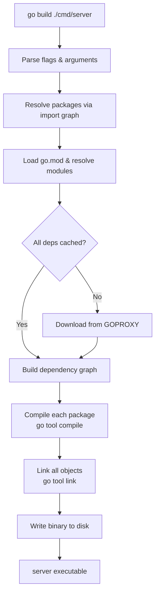
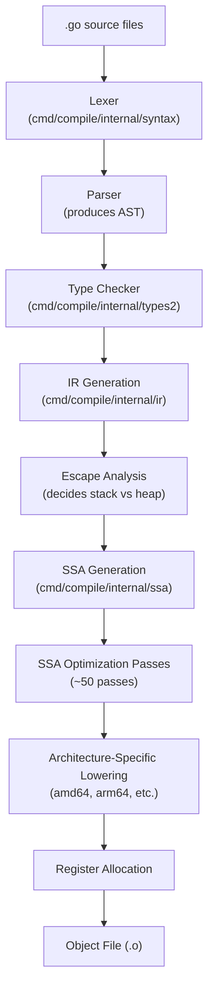
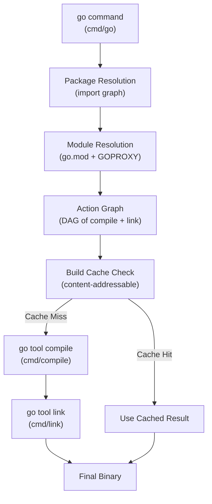
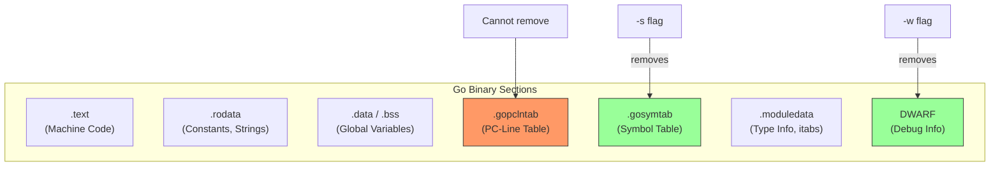

# Setting Up the Go Environment — Under the Hood

## Table of Contents

1. [Introduction](#introduction)
2. [How It Works Internally](#how-it-works-internally)
3. [Runtime Deep Dive](#runtime-deep-dive)
4. [Compiler Perspective](#compiler-perspective)
5. [Memory Layout](#memory-layout)
6. [OS / Syscall Level](#os--syscall-level)
7. [Source Code Walkthrough](#source-code-walkthrough)
8. [Assembly Output Analysis](#assembly-output-analysis)
9. [Performance Internals](#performance-internals)
10. [Metrics & Analytics (Runtime Level)](#metrics--analytics-runtime-level)
11. [Edge Cases at the Lowest Level](#edge-cases-at-the-lowest-level)
12. [Test](#test)
13. [Tricky Questions](#tricky-questions)
14. [Self-Assessment Checklist](#self-assessment-checklist)
15. [Summary](#summary)
16. [Further Reading](#further-reading)
17. [Diagrams & Visual Aids](#diagrams--visual-aids)

---

## Introduction

> Focus: "What happens under the hood?"

This document explores the internal mechanics of Go's build system, toolchain, and environment. For developers who want to understand:
- How `go install` and `go build` work internally
- How Go bootstraps and builds itself
- What GOROOT contains and how the toolchain is structured
- How the linker and compiler flags affect the final binary
- The internals of module resolution and the module proxy protocol

---

## How It Works Internally

### What Happens When You Run `go build`

Step-by-step breakdown of what happens when Go compiles your source code:

1. **Command parsing** — `cmd/go/main.go` parses the `build` subcommand and flags
2. **Package resolution** — The build system resolves all import paths to packages
3. **Module resolution** — For each unresolved import, consult `go.mod`, then GOPROXY
4. **Dependency graph** — Build a DAG (directed acyclic graph) of all packages
5. **Compilation** — For each package in topological order, invoke the compiler (`go tool compile`)
6. **Linking** — Invoke the linker (`go tool link`) to combine object files into a binary
7. **Output** — Write the final executable



### Internal Command Flow

When you type `go build`, the `cmd/go` package does NOT invoke the compiler directly as a subprocess for each file. Instead, it uses the **build cache** and **action graph**:

```
cmd/go/main.go
  -> cmd/go/internal/work.Builder
    -> Creates an action graph (DAG)
    -> For each action:
      -> Check build cache (content-addressable)
      -> If cache miss: invoke go tool compile / go tool link
      -> Store result in cache
```

---

## Runtime Deep Dive

### How Go Bootstraps Itself

Go is famously written in Go (since Go 1.5). The bootstrapping process is:

1. **Stage 0:** Use a C compiler or an existing Go installation to build a minimal Go compiler
2. **Stage 1:** Use the stage-0 compiler to build the actual Go toolchain
3. **Stage 2:** Use the stage-1 toolchain to rebuild itself (for verification)

```bash
# The bootstrap process (from Go source)
cd $GOROOT/src
./make.bash
# Internally:
# 1. Build cmd/dist (bootstrap tool) using GOROOT_BOOTSTRAP
# 2. Use cmd/dist to build the compiler, assembler, linker
# 3. Use the new compiler to rebuild everything
# 4. Run tests
```

**Key file:** `src/cmd/dist/build.go` — orchestrates the entire bootstrap.

```go
// Simplified view of bootstrap stages in cmd/dist
// From: src/cmd/dist/build.go (Go 1.23)
func cmdbootstrap() {
    // Phase 1: Build using GOROOT_BOOTSTRAP compiler
    // Compiles: cmd/compile, cmd/link, cmd/asm, cmd/go
    bootstrapBuildTools()

    // Phase 2: Rebuild everything with the new compiler
    // This produces the final toolchain
    installRuntime()
    installCommands()

    // Phase 3: Verify by rebuilding cmd/go
    checkNotStale("cmd/go")
}
```

### GOROOT Structure

```
$GOROOT/
├── bin/
│   ├── go          <- main driver binary
│   └── gofmt       <- formatter
├── pkg/
│   └── tool/
│       └── linux_amd64/
│           ├── compile  <- the Go compiler (cmd/compile)
│           ├── link     <- the Go linker (cmd/link)
│           ├── asm      <- the Go assembler (cmd/asm)
│           ├── cover    <- coverage tool
│           ├── vet      <- static analysis
│           ├── pprof    <- profiling tool
│           ├── trace    <- execution tracer
│           └── objdump  <- disassembler
├── src/
│   ├── cmd/        <- compiler, linker, go tool source
│   │   ├── compile/
│   │   ├── link/
│   │   ├── go/     <- the 'go' command itself
│   │   └── dist/   <- bootstrap tool
│   ├── runtime/    <- Go runtime
│   └── ...         <- standard library
└── lib/
    └── time/       <- timezone data
```

---

## Compiler Perspective

### What `go tool compile` Does

The Go compiler (`cmd/compile`) transforms Go source into object files through these stages:



```bash
# View compiler decisions
go build -gcflags="-m -m" main.go 2>&1 | head -20

# View SSA for a specific function
GOSSAFUNC=main go build main.go
# Creates ssa.html — open in browser to see all SSA passes

# View all compiler flags
go tool compile -help
```

### Key Compiler Flags

| Flag | What it does | Internal effect |
|------|-------------|----------------|
| `-m` | Print escape analysis decisions | Shows stack vs heap allocation decisions |
| `-m -m` | Verbose escape analysis | Shows why each decision was made |
| `-S` | Print assembly output | Shows generated machine code |
| `-N` | Disable optimizations | Produces unoptimized code for debugging |
| `-l` | Disable inlining | Prevents function inlining |
| `-B` | Disable bounds checking | Removes array bounds checks (unsafe!) |

### Linker Flags Deep Dive

The Go linker (`cmd/link`) combines object files into an executable.

```bash
# View linker flags
go tool link -help

# Common ldflags explained:
# -s : Omit symbol table (reduces binary size)
# -w : Omit DWARF debug info (reduces binary size further)
# -X : Set string variable at link time
# -buildid= : Set or clear the build ID
# -extldflags : Pass flags to external linker (for CGo)
```

```bash
# How -X works internally:
# The linker finds the symbol for the variable and replaces its initialization value
go build -ldflags="-X main.version=1.2.3" -o app ./cmd/app

# Verify: the string "1.2.3" is embedded directly in the binary's data section
go tool nm app | grep version
# Output: 5a8120 D main.version
```

---

## Memory Layout

### Binary Structure

A Go binary contains these sections:

```
+--------------------+
| ELF Header         |  <- Binary format metadata
+--------------------+
| .text              |  <- Machine code (compiled functions)
+--------------------+
| .rodata            |  <- Read-only data (string literals, constants)
+--------------------+
| .data              |  <- Initialized global variables
+--------------------+
| .bss               |  <- Uninitialized global variables
+--------------------+
| .gopclntab         |  <- Go PC-line table (for stack traces)
+--------------------+
| .gosymtab          |  <- Go symbol table
+--------------------+
| .noptrdata         |  <- Go data without pointers (skipped by GC)
+--------------------+
| .moduledata        |  <- Module metadata (type info, itabs)
+--------------------+
| .note.go.buildid   |  <- Build ID for cache invalidation
+--------------------+
```

```bash
# Examine binary sections
objdump -h ./server | head -30

# Check what takes space
go tool nm -size ./server | sort -rn -k2 | head -20

# View the build ID
go tool buildid ./server

# View embedded module info
go version -m ./server
```

### Effect of `-s -w` on Binary Size

```bash
# Full binary with debug info:
# .gosymtab  : ~1.5 MB   (Go symbol table)
# .gopclntab : ~3.0 MB   (PC-line table for stack traces)
# DWARF      : ~5.0 MB   (debug sections for delve/gdb)

# With -s (strip symbol table):
# .gosymtab  : removed
# .gopclntab : reduced (but not removed — needed for panic stack traces)

# With -w (strip DWARF):
# DWARF      : removed entirely

# With -s -w together: typical 25-30% reduction
```

---

## OS / Syscall Level

### What Happens During `go build`

```bash
# Trace syscalls made by go build
strace -f -e trace=process,openat,execve go build -o /dev/null ./cmd/server 2>&1 | head -50
```

**Key syscalls during build:**

| Syscall | When | Why |
|---------|------|-----|
| `execve` | Starting compiler/linker | Each package spawns `go tool compile` |
| `openat` | Reading source files | Compiler reads `.go` files |
| `openat` | Cache lookup | Checking build cache for cached objects |
| `mkdirat` | Cache storage | Storing compiled objects in cache |
| `clone` | Parallel compilation | Go uses goroutines for parallel builds |
| `write` | Output | Writing object files and final binary |

### Module Download Internals

When `go mod download` needs a module:

```bash
# Network syscalls for module download
strace -f -e trace=network go mod download github.com/gin-gonic/gin@v1.9.1 2>&1

# What happens:
# 1. HTTPS GET to $GOPROXY/<module>/@v/<version>.info   (module metadata)
# 2. HTTPS GET to $GOPROXY/<module>/@v/<version>.mod    (go.mod file)
# 3. HTTPS GET to $GOPROXY/<module>/@v/<version>.zip    (source code)
# 4. HTTPS GET to sum.golang.org/lookup/<module>@<version> (checksum verification)
```

The GOPROXY protocol is a simple REST API:

```
GET $GOPROXY/<module>/@v/list              -> list of available versions
GET $GOPROXY/<module>/@v/<version>.info    -> {"Version":"v1.9.1","Time":"..."}
GET $GOPROXY/<module>/@v/<version>.mod     -> go.mod file contents
GET $GOPROXY/<module>/@v/<version>.zip     -> source code zip
GET $GOPROXY/<module>/@latest              -> latest version info
```

---

## Source Code Walkthrough

### The `go` Command Entry Point

**File:** `src/cmd/go/main.go` (Go 1.23)

```go
// Simplified view of cmd/go/main.go
package main

import (
    "cmd/go/internal/base"
    "cmd/go/internal/cfg"
    "cmd/go/internal/modload"
    "cmd/go/internal/work"
    // ... many more internal packages
)

func main() {
    // Parse command: "build", "test", "install", etc.
    // Dispatch to the appropriate handler
    base.Main()
}

// The build command handler (cmd/go/internal/work/build.go)
// func runBuild(ctx context.Context, cmd *base.Command, args []string)
// 1. Resolve packages from args
// 2. Create action graph (DAG of compilation + link actions)
// 3. Execute actions in parallel, checking cache first
```

### Build Cache Internals

**File:** `src/cmd/go/internal/cache/cache.go`

```go
// The build cache uses content-addressable storage
// Each cached item is identified by a hash of:
// - compiler version
// - compile flags
// - source file contents
// - dependency object file hashes
//
// Cache directory structure:
// $GOCACHE/
//   00/  01/  02/  ...  ff/     <- 256 hash prefix directories
//     <hash>-a                   <- action cache entry
//     <hash>-d                   <- output file (object or binary)
```

```bash
# The cache key is computed from:
# ActionID = hash(compiler_version + flags + source_hashes + dep_hashes)
# Then: cache[ActionID] -> ResultID -> cached output

# View cache entries
ls $(go env GOCACHE)/ | head -5
# Output: 00  01  02  03  04  ...
```

### Module Fetching Internals

**File:** `src/cmd/go/internal/modfetch/fetch.go`

```go
// Simplified view of how module download works
// From: src/cmd/go/internal/modfetch/fetch.go

// Download downloads the specific module version to the module cache
// func Download(ctx context.Context, mod module.Version) (dir string, err error)

// Steps:
// 1. Check if module is already in GOMODCACHE
// 2. If not, try each proxy in GOPROXY list
// 3. For each proxy:
//    a. GET /<module>/@v/<version>.info (metadata)
//    b. GET /<module>/@v/<version>.zip (source)
// 4. Verify checksum against go.sum and sum.golang.org
// 5. Extract zip to GOMODCACHE/<module>@<version>/
// 6. Mark directory as read-only (prevent accidental modification)
```

---

## Assembly Output Analysis

### Hello World Assembly

```go
package main

import "fmt"

func main() {
    fmt.Println("Hello, World!")
}
```

```bash
go build -gcflags="-S" main.go 2>&1 | grep -A 20 '"".main STEXT'
```

```asm
; Key assembly instructions for main.main
TEXT main.main(SB), ABIInternal, $40-0
    ; Function prologue — stack growth check
    CMPQ    SP, 16(R14)           ; compare SP with goroutine stack limit
    PCDATA  $0, $-2
    JLS     grow_stack             ; if SP too low, grow the stack

    ; Set up stack frame
    SUBQ    $40, SP                ; allocate 40 bytes on stack
    MOVQ    BP, 32(SP)             ; save frame pointer
    LEAQ    32(SP), BP

    ; Prepare arguments for fmt.Println
    LEAQ    type:string(SB), AX    ; load string type descriptor
    MOVQ    AX, (SP)               ; first arg: type
    LEAQ    main..stmp_0(SB), AX   ; load pointer to "Hello, World!"
    MOVQ    AX, 8(SP)              ; second arg: string pointer
    MOVQ    $13, 16(SP)            ; third arg: string length (13 bytes)

    CALL    fmt.Println(SB)        ; call fmt.Println

    ; Function epilogue
    MOVQ    32(SP), BP             ; restore frame pointer
    ADDQ    $40, SP                ; deallocate stack frame
    RET

grow_stack:
    CALL    runtime.morestack_noctxt(SB)  ; grow goroutine stack
    JMP     main.main(SB)                  ; retry from start
```

**What to notice:**
- Stack growth check at every function entry (goroutine stacks are dynamically sized)
- `runtime.morestack_noctxt` — called when the goroutine needs a bigger stack
- String is stored as a pointer + length (not null-terminated like C)
- Frame pointer (`BP`) is saved/restored for profiling tools

### How `-s -w` Affects the Binary

```bash
# Compare symbol counts
go build -o app-full ./cmd/server
go build -ldflags="-s -w" -o app-stripped ./cmd/server

go tool nm app-full | wc -l       # ~50,000 symbols
go tool nm app-stripped | wc -l    # ~0 symbols (stripped)

# But the binary still works because Go's runtime has its own
# internal symbol table (.gopclntab) for panic/stack traces
```

---

## Performance Internals

### Build Parallelism

The Go build system uses an action graph to maximize parallelism:

```go
// cmd/go/internal/work/exec.go
// The builder executes actions in parallel using a semaphore
// limited by runtime.GOMAXPROCS (usually = NumCPU)

// Each package is an action node in the DAG:
//   compile(pkgA) -> link(binary)
//   compile(pkgB) -> link(binary)
//   compile(pkgC) depends on compile(pkgA)
//
// pkgA and pkgB compile in parallel
// pkgC waits for pkgA to finish
// link waits for all compilations
```

```bash
# Profile build time by package
go build -v -x ./... 2>&1 | grep "^#" | sort -t'/' -k3

# Benchmark the build cache
time go build ./...          # first build: cache cold
time go build ./...          # second build: cache warm

# Count how many packages need recompilation
go build -v ./... 2>&1 | wc -l   # 0 if fully cached
```

### Cache Hit Analysis

```bash
# Force cache miss (rebuild everything)
go clean -cache
time go build ./...   # Full build time

# Cached build
time go build ./...   # Should be near-instant

# Partial cache invalidation (change one file)
touch cmd/server/main.go
time go build ./...   # Recompiles only affected packages
```

**Internal performance characteristics:**
- Build cache is content-addressable (SHA256 of inputs)
- Parallel compilation up to GOMAXPROCS
- Linker is single-threaded (can be a bottleneck for large binaries)
- Module cache uses read-only directories (prevents accidental writes)

---

## Metrics & Analytics (Runtime Level)

### Go Build System Metrics

```bash
# Measure compilation time per package
go build -v ./... 2>&1 | while read pkg; do
    echo "$(date +%s%N) COMPILING: $pkg"
done

# Detailed build timing with -x
go build -x ./cmd/server 2>&1 | grep -E "^(#|/)" | head -30
```

### Module Cache Analysis

```bash
# Size of module cache
du -sh $(go env GOMODCACHE)

# Number of cached modules
find $(go env GOMODCACHE) -maxdepth 2 -type d | wc -l

# Build cache size
du -sh $(go env GOCACHE)

# Build cache entry count
find $(go env GOCACHE) -type f | wc -l
```

### Key Runtime Metrics for Build Tools

| Metric path | What it measures | Impact on build |
|-------------|-----------------|-----------------|
| `/memory/classes/heap/objects:bytes` | Live heap objects | High during compilation |
| `/gc/cycles/total:gc-cycles` | GC frequency | Compiler is memory-intensive |
| `/sched/goroutines:goroutines` | Goroutine count | Parallel compilation spawns many goroutines |

---

## Edge Cases at the Lowest Level

### Edge Case 1: Maximum Symbol Table Size

What happens when a Go binary has millions of symbols:

```go
// Pathological case: massive binary with many packages
// The linker must process all symbols, and .gopclntab grows linearly
// with the number of functions.

// In Go 1.21, the gopclntab format was optimized to reduce binary size
// by ~5% for large binaries. Before this, binaries with 100K+ functions
// could have gopclntab sections >50 MB.
```

**Internal behavior:** The linker reads all object files, resolves symbols, generates `.gopclntab`, `.gosymtab`, and writes the final binary. For very large binaries (>100K functions), this can take minutes.
**Why it matters:** Monorepo builds with thousands of packages hit this limitation.

### Edge Case 2: Circular Module Dependencies

```
Module A imports Module B
Module B imports Module A  -> compile error
```

**Internal behavior:** `cmd/go/internal/modload` builds a module dependency graph. Circular dependencies are detected during graph construction and produce a clear error: `import cycle not allowed`. This happens before compilation even starts.

### Edge Case 3: Build Cache Corruption

```bash
# Symptoms: builds fail with unexplainable errors
# "internal compiler error" or "cannot find package"

# The build cache can become corrupted by:
# - Disk failures
# - Concurrent modifications
# - Docker volume mounts with inconsistent filesystems

# Fix: clear the build cache
go clean -cache

# The module cache is more resilient (read-only directories)
# but can also be cleared:
go clean -modcache
```

---

## Test

### Internal Knowledge Questions

**1. What Go command is responsible for the bootstrap process?**

<details>
<summary>Answer</summary>
`cmd/dist` — This is a small Go program that orchestrates the entire bootstrap process. It is built first using `GOROOT_BOOTSTRAP` (an existing Go installation), and then uses itself to build the full Go toolchain. The entry point is `src/cmd/dist/build.go`, function `cmdbootstrap()`.
</details>

**2. How does the build cache determine if a cached result is valid?**

<details>
<summary>Answer</summary>
The build cache computes an **ActionID** which is a SHA256 hash of:
- The Go compiler version (binary hash)
- The compilation flags
- The source file content hashes
- The hashes of all dependency object files

If the ActionID matches a cache entry, the cached output is reused. This is content-addressable: any change to inputs produces a different hash, invalidating the cache.

Source: `src/cmd/go/internal/cache/hash.go`
</details>

**3. What does `-trimpath` actually remove from the binary?**

<details>
<summary>Answer</summary>
`-trimpath` rewrites the file paths stored in the binary's debug information and `.gopclntab` section. Instead of `/home/user/project/cmd/server/main.go`, it stores `mymodule/cmd/server/main.go`. This affects stack traces, pprof output, and the `runtime.Caller()` function. The flag is implemented in `cmd/compile` by replacing the working directory prefix with the module path.
</details>

**4. What is the GOPROXY protocol?**

<details>
<summary>Answer</summary>
GOPROXY is a simple HTTP API with these endpoints:

- `GET /<module>/@v/list` — newline-separated list of versions
- `GET /<module>/@v/<version>.info` — JSON with Version and Time fields
- `GET /<module>/@v/<version>.mod` — the go.mod file
- `GET /<module>/@v/<version>.zip` — source code in zip format
- `GET /<module>/@latest` — latest version info

The Go tool tries each proxy in `GOPROXY` in order. If a proxy returns 404 or 410, it tries the next one. The `direct` keyword means fetch directly from the VCS (git, svn, etc.).

Source: `src/cmd/go/internal/modfetch/proxy.go`
</details>

**5. Why is `.gopclntab` preserved even with `-s` (strip symbols)?**

<details>
<summary>Answer</summary>
`.gopclntab` (Go PC-line table) maps program counter values to function names and line numbers. The Go runtime NEEDS this for:
- `panic()` stack traces
- `runtime.Caller()` and `runtime.Callers()`
- pprof profiling

Without `.gopclntab`, panic messages would show raw addresses instead of function names. The `-s` flag strips the traditional symbol table (`.symtab`), but `.gopclntab` is an internal Go structure that the runtime depends on.
</details>

---

## Tricky Questions

**1. Can Go build itself from scratch on a machine with NO existing Go installation?**

<details>
<summary>Answer</summary>
No. Go requires a **bootstrap compiler** (`GOROOT_BOOTSTRAP`). Since Go 1.5, Go has been written in Go (before that, it was in C). To build Go from source, you need either:
1. An existing Go installation (Go 1.20+ to build Go 1.23+)
2. Download a pre-built bootstrap toolchain from go.dev

The bootstrap requirement has been increasing: Go 1.22 requires Go 1.20 for bootstrap. This is documented in `src/cmd/dist/build.go` which checks `GOROOT_BOOTSTRAP`.

The original Go 1.0-1.4 compilers were written in C and could bootstrap from a C compiler, but those are no longer maintained.
</details>

**2. Why does Go produce larger binaries than C/Rust for the same program?**

<details>
<summary>Answer</summary>
Go binaries include:
1. **The Go runtime** (~2-4 MB) — GC, goroutine scheduler, memory allocator, network poller
2. **`.gopclntab`** — PC-line table for stack traces (~10-30% of binary size)
3. **Type metadata** — reflection info, interface dispatch tables
4. **Static linking** — all dependencies are linked in (unlike C which can use shared libraries)

A minimal "Hello World" in Go is ~1.8 MB because it includes the entire runtime. In C, the same program can be ~16 KB because it links dynamically to libc.

The `-s -w` flags remove debug info but cannot remove the runtime or `.gopclntab`.
</details>

**3. What is the difference between `go build -buildmode=default` and `go build -buildmode=pie`?**

<details>
<summary>Answer</summary>
- **default**: Produces a standard executable. On Linux, this is a position-dependent executable (PDE) — loaded at a fixed address.
- **pie** (Position Independent Executable): The binary can be loaded at any address in memory. This enables ASLR (Address Space Layout Randomization) — a security feature that makes it harder for attackers to predict memory addresses.

Since Go 1.15, PIE is the default on some platforms (e.g., Android, macOS). On Linux, you must opt in with `-buildmode=pie`. PIE has a very small performance overhead (~1%) due to extra indirection for global variables.

Source: `src/cmd/link/internal/ld/config.go`
</details>

---

## Self-Assessment Checklist

### I can explain internals:
- [ ] How Go bootstraps and builds itself
- [ ] The GOPROXY protocol and module resolution process
- [ ] How the build cache works (content-addressable, ActionID)
- [ ] What GOROOT contains and how tools are organized

### I can analyze:
- [ ] Read and understand assembly output from `go build -gcflags="-S"`
- [ ] Use `go tool nm` to analyze binary symbols
- [ ] Trace syscalls during module download with `strace`
- [ ] Examine binary sections with `objdump`

### I can prove:
- [ ] Why `-trimpath` improves security (with binary analysis)
- [ ] Why `-s -w` reduces size but cannot remove `.gopclntab`
- [ ] How build cache invalidation works (with hash analysis)

---

## Summary

- `go build` creates an action graph (DAG) and executes compilation in parallel, using a content-addressable cache
- Go bootstraps itself using `cmd/dist`, requiring an existing Go installation (`GOROOT_BOOTSTRAP`)
- The linker embeds version info via `-X` by modifying the data section of the binary
- `.gopclntab` cannot be stripped because the runtime needs it for panic stack traces
- The GOPROXY protocol is a simple REST API that serves module metadata and source archives

**Key takeaway:** Understanding the Go toolchain internals helps you optimize build times, debug mysterious build failures, and make informed decisions about binary packaging and security.

---

## Further Reading

- **Go source:** [cmd/go](https://github.com/golang/go/tree/master/src/cmd/go) — the `go` command implementation
- **Go source:** [cmd/compile](https://github.com/golang/go/tree/master/src/cmd/compile) — the Go compiler
- **Go source:** [cmd/link](https://github.com/golang/go/tree/master/src/cmd/link) — the Go linker
- **Design doc:** [Go Modules Reference](https://go.dev/ref/mod) — complete module system specification
- **Conference talk:** [Rob Pike - The Go Compiler](https://www.youtube.com/watch?v=KINIAgRpkDA) — compiler architecture overview
- **Blog post:** [Go Build Cache](https://go.dev/blog/build-cache) — how the build cache works

---

## Diagrams & Visual Aids

### Go Toolchain Architecture



### Binary Structure



### Module Resolution Sequence

```
Developer                    go command              GOPROXY              sum.golang.org
    |                            |                      |                       |
    |--- go build ./... -------->|                      |                       |
    |                            |--- GET /mod/@v/v1.info ->|                   |
    |                            |<-- {"Version":"v1"} ----|                   |
    |                            |--- GET /mod/@v/v1.zip -->|                   |
    |                            |<-- [zip data] ----------|                   |
    |                            |--- GET /lookup/mod@v1 ---|------------------>|
    |                            |<-- checksum hash --------|-------------------|
    |                            |--- verify against go.sum |                   |
    |<-- build complete ---------|                          |                   |
```
