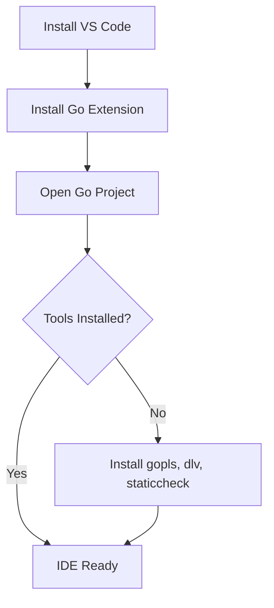

# Setting Up the Go Environment — Practical Tasks

## Table of Contents

1. [Junior Tasks](#junior-tasks)
2. [Middle Tasks](#middle-tasks)
3. [Senior Tasks](#senior-tasks)
4. [Questions](#questions)
5. [Mini Projects](#mini-projects)
6. [Challenge](#challenge)

---

## Junior Tasks

### Task 1: Install Go and Run Your First Program

**Type:** Code

**Goal:** Verify Go installation and create a runnable program.

**Instructions:**
1. Install Go from [go.dev/dl](https://go.dev/dl/)
2. Verify installation with `go version`
3. Create a new directory called `hello`
4. Initialize a module: `go mod init example.com/hello`
5. Create `main.go` with the code below
6. Run it with `go run main.go`

**Starter code:**

```go
package main

import (
    "fmt"
    "runtime"
)

func main() {
    // TODO: Print the Go version, your OS, and architecture
    // Use runtime.Version(), runtime.GOOS, runtime.GOARCH
    fmt.Println("TODO: print environment info")
}
```

**Expected output:**
```
Go Version: go1.23.0
OS:         linux
Arch:       amd64
```

**Evaluation criteria:**
- [ ] `go version` works from the command line
- [ ] `go.mod` file exists with correct module path
- [ ] Program compiles and runs
- [ ] Output shows correct Go version, OS, and architecture

---

### Task 2: Configure Your IDE

**Type:** Design

**Goal:** Set up VS Code (or GoLand) with proper Go support.

**Instructions:**
1. Install VS Code and the official Go extension (`golang.go`)
2. Open a Go project and let the extension install required tools
3. Create a simple Go file with a deliberate error (e.g., unused variable)
4. Verify that the IDE highlights the error
5. Test auto-formatting by writing messy code and saving

**Deliverable:** Screenshot or description showing:
- Go extension installed and active
- Error highlighting working
- Code formatted on save



**Evaluation criteria:**
- [ ] IDE shows Go syntax highlighting
- [ ] Errors are detected in real-time
- [ ] Code formats automatically on save
- [ ] Auto-completion works for standard library

---

### Task 3: Create a Project with External Dependencies

**Type:** Code

**Goal:** Learn to manage dependencies with Go modules.

**Instructions:**
1. Create a new directory and initialize a module
2. Write a program that uses an external library (e.g., `github.com/fatih/color`)
3. Run `go mod tidy` to download the dependency
4. Build and run the program

**Starter code:**

```go
package main

import (
    "fmt"
    // TODO: Import github.com/fatih/color
)

func main() {
    // TODO: Use the color package to print colored text
    // color.Green("This is green!")
    // color.Red("This is red!")
    fmt.Println("TODO: add colored output")
}
```

**Expected output:**
```
This is green!  (in green color)
This is red!    (in red color)
```

**Evaluation criteria:**
- [ ] `go.mod` lists the `color` dependency
- [ ] `go.sum` exists with checksums
- [ ] Program compiles and runs with colored output
- [ ] `go mod tidy` was used (not manual go.mod editing)

---

### Task 4: Build a Binary and Inspect It

**Type:** Code

**Goal:** Understand the difference between `go run` and `go build`.

**Instructions:**
1. Write a simple Go program
2. Run it with `go run main.go`
3. Build it with `go build -o myapp main.go`
4. Run the binary `./myapp`
5. Check the binary size with `ls -lh myapp`
6. Build again with `-ldflags="-s -w"` and compare sizes

**Starter code:**

```go
package main

import "fmt"

func main() {
    fmt.Println("Built with Go!")
    fmt.Printf("Binary is running from: %s\n", "TODO: use os.Executable()")
}
```

**Evaluation criteria:**
- [ ] Binary is created and runs
- [ ] Student can explain the difference between `go run` and `go build`
- [ ] Binary with `-s -w` is smaller than default
- [ ] Student can use `os.Executable()` to find the binary path

---

## Middle Tasks

### Task 4: Set Up a CI/CD Pipeline

**Type:** Code

**Goal:** Create a complete GitHub Actions CI workflow for a Go project.

**Scenario:** You have a Go microservice with unit tests. Create a CI pipeline that ensures code quality.

**Requirements:**
- [ ] Pipeline triggers on push and pull request
- [ ] Uses `actions/setup-go` with the correct Go version
- [ ] Runs `go vet ./...`
- [ ] Runs tests with race detection and coverage
- [ ] Builds the binary with proper flags
- [ ] Caches Go module and build directories

**Hints:**
<details>
<summary>Hint 1</summary>
Use `actions/cache@v3` with paths `~/.cache/go-build` and `~/go/pkg/mod`, keyed on `hashFiles('**/go.sum')`.
</details>
<details>
<summary>Hint 2</summary>
The build command should include `CGO_ENABLED=0`, `-trimpath`, and `-ldflags="-s -w"`.
</details>

**Evaluation criteria:**
- [ ] YAML file is valid GitHub Actions syntax
- [ ] All quality checks are included
- [ ] Caching is properly configured
- [ ] Build produces a production-ready binary

---

### Task 5: Docker Development Environment

**Type:** Code

**Goal:** Create a Dockerfile for both development and production.

**Scenario:** Your team needs a consistent development environment and a minimal production image.

**Requirements:**
- [ ] Development Dockerfile with hot-reload (`air`) and debugger (`delve`)
- [ ] Production multi-stage Dockerfile with distroless base
- [ ] `docker-compose.yml` for local development
- [ ] Separate dependency download layer for caching

**Hints:**
<details>
<summary>Hint 1</summary>
Use `golang:1.23-bookworm` for development and `gcr.io/distroless/static-debian12:nonroot` for production.
</details>
<details>
<summary>Hint 2</summary>
Install `air` with `go install github.com/air-verse/air@latest` and `delve` with `go install github.com/go-delve/delve/cmd/dlv@latest`.
</details>

**Evaluation criteria:**
- [ ] Development container starts and hot-reloads on file changes
- [ ] Production image is under 20 MB
- [ ] Docker layer caching is properly utilized
- [ ] `docker-compose.yml` works with `docker compose up`

---

### Task 6: Cross-Compilation Matrix

**Type:** Code

**Goal:** Build a Go CLI tool for multiple platforms.

**Scenario:** You are releasing a CLI tool and need binaries for Linux (amd64, arm64), macOS (arm64), and Windows (amd64).

**Requirements:**
- [ ] Makefile or Go build script that compiles for all 4 targets
- [ ] Each binary named with OS and architecture suffix
- [ ] SHA256 checksums generated for each binary
- [ ] Build uses `-trimpath` and `-ldflags="-s -w"`

**Evaluation criteria:**
- [ ] All 4 binaries are produced
- [ ] Binaries are correctly named (e.g., `app-linux-amd64`, `app-darwin-arm64`)
- [ ] Checksums file is generated
- [ ] Build script handles errors gracefully

---

## Senior Tasks

### Task 7: Private Module Proxy Setup

**Type:** Code

**Goal:** Set up and configure a private module proxy for a team.

**Scenario:** Your company has 30 private Go modules on GitHub. CI builds are slow because each one clones the full git repo. Set up Athens as a private proxy.

**Requirements:**
- [ ] Deploy Athens using Docker
- [ ] Configure `GOPROXY` to use Athens first, then `proxy.golang.org`
- [ ] Configure `GOPRIVATE` for company modules
- [ ] Set up git authentication for private repos
- [ ] Write a verification script that tests module download
- [ ] Document the setup for team onboarding

**Provided code to review/optimize:**

```bash
# Current slow setup — every build clones repos
GOPROXY=direct
# Each go mod download takes 30+ seconds for private repos
```

**Evaluation criteria:**
- [ ] Athens proxy is running and serving modules
- [ ] Private modules are cached after first download
- [ ] Second download is 10x+ faster than direct git clone
- [ ] Documentation is clear enough for a new team member

---

### Task 8: Build Pipeline Architecture

**Type:** Design

**Goal:** Design the build infrastructure for a company with 20 Go microservices.

**Scenario:** Your company has 20 Go microservices in separate repositories. Builds are slow (average 12 minutes), dependencies are downloaded redundantly, and Go version management is inconsistent.

**Requirements:**
- [ ] Architecture diagram showing the full build pipeline
- [ ] Decision: monorepo vs multi-repo with justification
- [ ] Go version management strategy
- [ ] Dependency governance plan (allowed/blocked dependencies)
- [ ] Caching strategy for CI builds
- [ ] Security scanning pipeline (govulncheck, SBOM)
- [ ] Estimated build time improvement

**Deliverable:**
- Architecture diagram (Mermaid)
- Written design document (1-2 pages)
- Decision matrix for key choices

**Evaluation criteria:**
- [ ] Design addresses all pain points (speed, consistency, security)
- [ ] Trade-offs are clearly documented
- [ ] Estimated improvements are realistic
- [ ] Design is implementable incrementally (not big-bang)

---

### Task 9: Reproducible Build Verification

**Type:** Code

**Goal:** Implement and verify reproducible builds for a Go service.

**Scenario:** Your compliance team requires that builds are reproducible — the same source must produce the same binary hash.

**Requirements:**
- [ ] Build script that produces reproducible binaries
- [ ] Verification script that builds twice and compares SHA256
- [ ] CI integration that fails if builds are not reproducible
- [ ] Documentation of all flags and why they are needed
- [ ] Handle edge cases: CGo, embedded files, time-based values

**Evaluation criteria:**
- [ ] Two builds from the same source produce identical SHA256
- [ ] Build script is well-documented
- [ ] CI check blocks non-reproducible builds
- [ ] Edge cases are addressed and documented

---

## Questions

### 1. Why should you always commit `go.sum` to version control?

**Answer:**
`go.sum` contains cryptographic checksums (SHA256 hashes) of all module versions used by the project. Committing it ensures:
- **Reproducibility:** Every developer and CI system uses the exact same verified versions
- **Security:** Go verifies checksums on download — any tampered module is detected
- **Audit trail:** Changes to dependencies are visible in git history

Without `go.sum`, different builds might use different (potentially compromised) module versions.

---

### 2. What does `CGO_ENABLED=0` do and when is it needed?

**Answer:**
`CGO_ENABLED=0` tells the Go compiler to not use CGo (the C interoperability layer). This produces a fully statically linked binary with no dependency on libc. It is needed when:
- Building for `scratch` or `distroless` Docker images (which have no C libraries)
- Cross-compiling without a C cross-compiler
- Ensuring the binary runs on any Linux distribution regardless of glibc version

---

### 3. What is the difference between `-ldflags="-s"` and `-ldflags="-w"`?

**Answer:**
- `-s` strips the Go symbol table (`.gosymtab`) — removes function and variable names used by tools like `nm`
- `-w` strips DWARF debug information — removes data used by debuggers like `delve` and `gdb`
- Using both (`-s -w`) provides maximum size reduction (typically 25-30%)

Note: `.gopclntab` (PC-line table) is NOT stripped by either flag because the Go runtime needs it for panic stack traces.

---

### 4. How does `GOTOOLCHAIN` work?

**Answer:**
Introduced in Go 1.21, `GOTOOLCHAIN` controls which Go version is used. Values:
- `auto` (default): if the project requires a newer Go version than installed, download it automatically
- `local`: use only the locally installed Go version; fail if it is too old
- `go1.23.0`: force a specific version

The `go.mod` file can specify `toolchain go1.23.0` to set the preferred version. This is the modern way to manage Go versions across a team without external tools.

---

### 5. What is the `go.work` file and when should it be used?

**Answer:**
`go.work` defines a Go workspace — a collection of modules developed together. It allows you to use local (unpublished) versions of modules:

```go
go 1.23
use (
    ./api-service
    ./shared-lib
)
```

Use it for local development when you need to edit a library and test it in a service simultaneously. **Never commit `go.work` to the repository** — CI should build each module independently.

---

### 6. Why is `-trimpath` important for production builds?

**Answer:**
Without `-trimpath`, the binary embeds absolute file paths from the build machine (e.g., `/home/developer/projects/myapp/main.go`). This:
1. Leaks developer usernames and directory structure (security issue)
2. Makes builds non-reproducible (different machines produce different binaries)
3. Makes stack traces longer and less readable

With `-trimpath`, paths are rewritten to module-relative paths (e.g., `myapp/main.go`).

---

### 7. How does the Go build cache work?

**Answer:**
Go's build cache (`$GOCACHE`) is content-addressable:
1. For each compilation, Go computes an **ActionID** = hash(compiler version + flags + source hashes + dependency hashes)
2. If the ActionID matches a cached entry, the cached output is reused
3. Only changed packages are recompiled

This means:
- Changing one file only recompiles that file's package and its dependents
- Switching git branches and back still hits cache if code is the same
- Clearing the cache (`go clean -cache`) forces a full rebuild

---

### 8. What are the GOPROXY fallback rules?

**Answer:**
`GOPROXY` is a comma-separated list of proxy URLs:
```
GOPROXY=https://proxy.golang.org,direct
```
Go tries each proxy in order:
- If a proxy returns the module: use it
- If a proxy returns 404 or 410: try the next proxy
- If a proxy returns any other error (500, timeout): **stop immediately** (do not try next)
- `direct`: fetch directly from the source repository (git)

Use `|` instead of `,` to try the next proxy on ALL errors (not just 404/410):
```
GOPROXY=https://proxy.golang.org|direct
```

---

### 9. What is `go mod vendor` vs `go mod vendor -e`?

**Answer:**
- `go mod vendor` copies all dependencies to the `vendor/` directory. Fails if there are errors in the module graph.
- `go mod vendor -e` does the same but continues even if some modules have errors. Useful when you need to vendor most dependencies even though one is temporarily broken.

---

### 10. How do you inspect what is inside a compiled Go binary?

**Answer:**
```bash
# View embedded module info
go version -m ./binary

# List symbols
go tool nm ./binary | head

# Check binary type
file ./binary

# View build ID
go tool buildid ./binary

# Check sections
objdump -h ./binary
```

---

## Mini Projects

### Project 1: Go Environment Checker CLI

**Requirements:**
- [ ] CLI tool that checks if Go is properly set up
- [ ] Verifies: Go installed, correct version, IDE configured, GOPATH vs modules
- [ ] Outputs a report with pass/fail for each check
- [ ] Suggests fixes for failed checks
- [ ] Tests with >80% coverage
- [ ] README with `go run` / `go test` instructions

**Example output:**
```
Go Environment Health Check
===========================
[PASS] Go installed: go1.23.0
[PASS] Go modules enabled
[PASS] GOPATH set: /home/user/go
[WARN] GOBIN not set (using default: /home/user/go/bin)
[PASS] gopls installed
[FAIL] golangci-lint not found
  Fix: go install github.com/golangci/golangci-lint/cmd/golangci-lint@latest

Score: 5/6 checks passed
```

**Difficulty:** Junior / Middle
**Estimated time:** 3-4 hours

---

## Challenge

### Build System from Scratch

Build a minimal build system in Go that:
1. Reads a `build.yaml` configuration file
2. Compiles a Go project for specified targets (OS/arch combinations)
3. Embeds version info from git tags
4. Generates SHA256 checksums for all binaries
5. Creates a release archive (`.tar.gz` for Unix, `.zip` for Windows)

**Constraints:**
- Must run in under 30 seconds for a medium-sized project
- Memory usage under 100 MB
- No external libraries — standard library only (`os/exec`, `archive/tar`, `archive/zip`, `crypto/sha256`)

**Scoring:**
- Correctness: 50% — all targets build, checksums match, archives are valid
- Performance (benchmarks): 30% — parallel compilation, efficient I/O
- Code quality (go vet, readability): 20% — clean code, error handling, tests

**Example `build.yaml`:**
```yaml
module: github.com/user/myapp
binary: myapp
targets:
  - os: linux
    arch: amd64
  - os: linux
    arch: arm64
  - os: darwin
    arch: arm64
  - os: windows
    arch: amd64
ldflags:
  - "-s"
  - "-w"
  - "-X main.version={{.Version}}"
```
