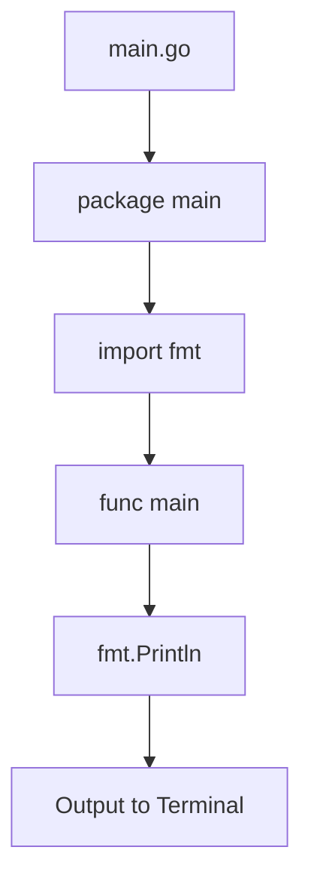
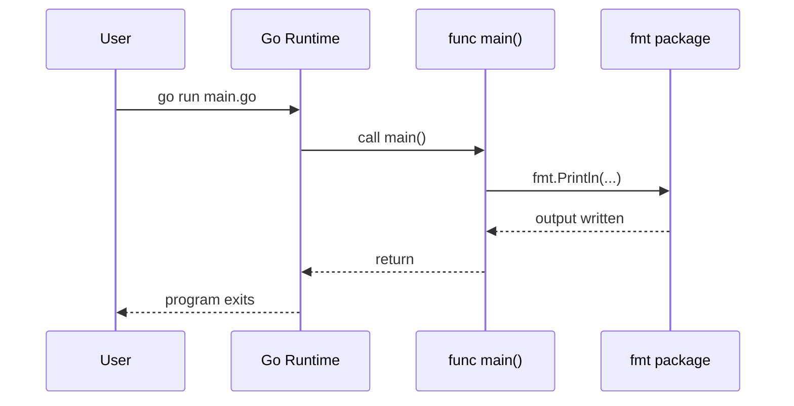
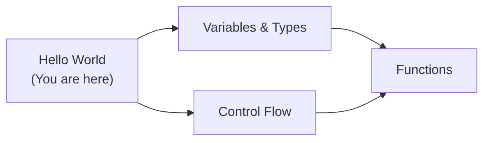
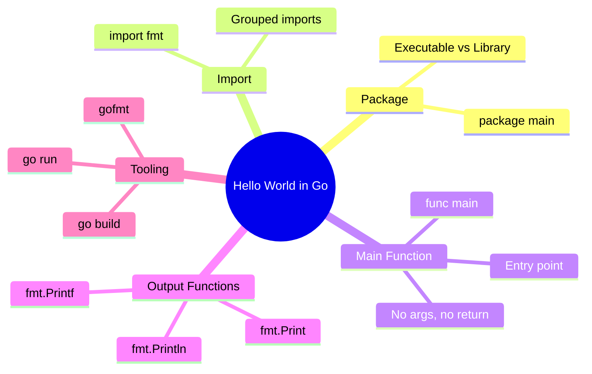
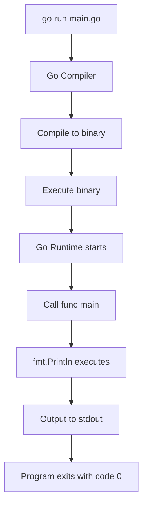

# Hello World in Go — Junior Level

## Table of Contents

1. [Introduction](#introduction)
2. [Prerequisites](#prerequisites)
3. [Glossary](#glossary)
4. [Core Concepts](#core-concepts)
5. [Real-World Analogies](#real-world-analogies)
6. [Mental Models](#mental-models)
7. [Pros & Cons](#pros--cons)
8. [Use Cases](#use-cases)
9. [Code Examples](#code-examples)
10. [Coding Patterns](#coding-patterns)
11. [Clean Code](#clean-code)
12. [Product Use / Feature](#product-use--feature)
13. [Error Handling](#error-handling)
14. [Security Considerations](#security-considerations)
15. [Performance Tips](#performance-tips)
16. [Metrics & Analytics](#metrics--analytics)
17. [Best Practices](#best-practices)
18. [Edge Cases & Pitfalls](#edge-cases--pitfalls)
19. [Common Mistakes](#common-mistakes)
20. [Common Misconceptions](#common-misconceptions)
21. [Tricky Points](#tricky-points)
22. [Test](#test)
23. [Tricky Questions](#tricky-questions)
24. [Cheat Sheet](#cheat-sheet)
25. [Self-Assessment Checklist](#self-assessment-checklist)
26. [Summary](#summary)
27. [What You Can Build](#what-you-can-build)
28. [Further Reading](#further-reading)
29. [Related Topics](#related-topics)
30. [Diagrams & Visual Aids](#diagrams--visual-aids)

---

## Introduction

> Focus: "What is it?" and "How to use it?"

The "Hello World" program is the very first program you write when learning any programming language. In Go, it teaches you the fundamental building blocks: packages, imports, and the entry point function. Every Go program starts with a `package main` declaration and a `func main()` that the runtime calls when the program launches.

Writing "Hello World" in Go introduces you to the `fmt` package, Go's standard way of printing text to the terminal. It also teaches you how to compile and run Go programs using `go run` and `go build`.

---

## Prerequisites

- **Required:** Go installed on your machine (version 1.21+) — needed to compile and run Go programs
- **Required:** A text editor or IDE (VS Code with Go extension recommended) — for writing code
- **Helpful but not required:** Basic understanding of what a terminal/command line is — you will use it to run commands

---

## Glossary

| Term | Definition |
|------|-----------|
| **Package** | A way to organize and group related Go code; every Go file belongs to a package |
| **`main` package** | A special package that tells Go this code is an executable program, not a library |
| **`func main()`** | The entry point function that Go calls when your program starts |
| **`import`** | A keyword that brings external packages into your file so you can use their functions |
| **`fmt`** | The standard library package for formatted I/O — printing, scanning, and formatting text |
| **`go run`** | A command that compiles and immediately runs a Go source file |
| **`go build`** | A command that compiles Go source code into a standalone binary executable |
| **Standard library** | The collection of packages that come built-in with Go, ready to use without installation |

---

## Core Concepts

### Concept 1: Package Declaration

Every Go file must start with a `package` declaration. For executable programs, this must be `package main`. Library code uses other package names like `package math` or `package http`.

```go
package main // This file is part of an executable program
```

### Concept 2: Import Statement

The `import` statement brings in packages you want to use. The `fmt` package provides functions for formatted I/O, including `Println` for printing text.

```go
import "fmt" // Now we can use fmt.Println, fmt.Printf, etc.
```

### Concept 3: The main Function

`func main()` is the entry point of every Go executable. It takes no arguments and returns nothing. When your program starts, Go calls this function first.

```go
func main() {
    // Your program logic goes here
}
```

### Concept 4: fmt.Println

`fmt.Println` prints its arguments to standard output (the terminal) followed by a newline character. The capital `P` means it is an exported (public) function from the `fmt` package.

```go
fmt.Println("Hello, World!") // Prints: Hello, World!
```

---

## Real-World Analogies

| Concept | Analogy |
|---------|--------|
| **`package main`** | Like the "main entrance" of a building — the place where everything starts |
| **`import "fmt"`** | Like borrowing a tool from a toolbox — you declare which tool you need before using it |
| **`func main()`** | Like pressing the "Start" button on a machine — it is the trigger that begins execution |
| **`fmt.Println`** | Like a loudspeaker — it takes your message and broadcasts it to the outside world (terminal) |

---

## Mental Models

**The intuition:** Think of a Go program as a recipe card. `package main` is the title of the recipe (tells the kitchen this is a dish to serve, not just a note). `import` is the ingredients list. `func main()` is the cooking instructions — Go follows them step by step from top to bottom.

**Why this model helps:** It reminds you that Go executes code sequentially inside `main()`. If you forget `package main`, Go does not know this file is an executable — like a recipe without a title that cannot be cooked.

---

## Pros & Cons

| Pros | Cons |
|------|------|
| Extremely simple — minimal boilerplate to write a working program | Must have `package main` and `func main()` even for a one-liner |
| Fast compilation — `go run` compiles and runs in milliseconds | Cannot use unused imports — Go compiler will reject the code |
| Produces a single static binary with `go build` | No REPL (read-eval-print loop) like Python for quick experiments |
| Standard library (`fmt`) is rich and requires no external installs | Case sensitivity matters — `fmt.println` (lowercase p) will not work |

### When to use:
- Learning Go basics and verifying your Go installation works

### When NOT to use:
- When you need a library/package to share code — use a different package name instead of `main`

---

## Use Cases

- **Use Case 1:** Verifying your Go installation — running Hello World confirms the toolchain works
- **Use Case 2:** Learning program structure — understanding package, import, and function concepts
- **Use Case 3:** Quick prototyping — starting a new tool or script with a minimal main.go

---

## Code Examples

### Example 1: Classic Hello World

```go
// Every Go file starts with a package declaration.
// "main" means this is an executable program.
package main

// Import the "fmt" package for formatted I/O functions.
import "fmt"

// func main() is where the program begins execution.
func main() {
    // Println prints the string and adds a newline at the end.
    fmt.Println("Hello, World!")
}
```

**What it does:** Prints `Hello, World!` to the terminal and exits.
**How to run:** `go run main.go`
**How to build:** `go build -o hello main.go` then `./hello`

### Example 2: Printing Multiple Values

```go
package main

import "fmt"

func main() {
    // Println can accept multiple arguments, separated by spaces in output
    fmt.Println("Hello", "from", "Go!")
    // Output: Hello from Go!
}
```

**What it does:** Demonstrates that `Println` accepts multiple arguments and separates them with spaces.
**How to run:** `go run main.go`

### Example 3: Using Printf for Formatted Output

```go
package main

import "fmt"

func main() {
    name := "Gopher"
    age := 10
    // Printf uses format verbs: %s for string, %d for integer
    fmt.Printf("Hello, %s! You are %d years old.\n", name, age)
    // Output: Hello, Gopher! You are 10 years old.
}
```

**What it does:** Shows formatted output using `Printf` with format verbs.
**How to run:** `go run main.go`

### Example 4: Print Without Newline

```go
package main

import "fmt"

func main() {
    // Print does NOT add a newline at the end
    fmt.Print("Hello, ")
    fmt.Print("World!")
    fmt.Println() // Add a newline manually
    // Output: Hello, World!
}
```

**What it does:** Shows the difference between `Print` (no newline) and `Println` (adds newline).
**How to run:** `go run main.go`

---

## Coding Patterns

### Pattern 1: Single Import

**Intent:** Import one package for a simple program.
**When to use:** When your program only needs one external package.

```go
package main

import "fmt"

func main() {
    fmt.Println("Single import pattern")
}
```

**Diagram:**



**Remember:** Every Go program needs at least `package main` and `func main()` to be executable.

---

### Pattern 2: Multiple Imports (Grouped)

**Intent:** Import multiple packages cleanly using parentheses.
**When to use:** When your program uses more than one package.

```go
package main

import (
    "fmt"
    "os"
)

func main() {
    fmt.Println("Program name:", os.Args[0])
}
```

**Diagram:**



**Remember:** Use grouped imports with parentheses — Go's `goimports` tool will organize them automatically.

---

## Clean Code

### Naming

```go
// Bad naming
package main
import "fmt"
func main() {
    s := "World"
    fmt.Println("Hello, " + s)
}

// Clean naming
package main
import "fmt"
func main() {
    greeting := "World"
    fmt.Println("Hello, " + greeting)
}
```

**Rules:**
- Variables: describe WHAT they hold (`greeting`, not `s`, `x`, `tmp`)
- Functions: describe WHAT they do (`printGreeting`, not `pg`)
- Booleans: use `is`, `has`, `can` prefix (`isReady`, `hasOutput`)

---

### Functions

```go
// Too much in one function
package main
import "fmt"
func main() {
    name := "Gopher"
    greeting := "Hello, " + name + "!"
    fmt.Println(greeting)
    fmt.Println("Welcome to Go.")
    fmt.Println("Enjoy coding!")
}

// Single responsibility — extract a greeting function
package main
import "fmt"
func buildGreeting(name string) string {
    return "Hello, " + name + "!"
}
func main() {
    fmt.Println(buildGreeting("Gopher"))
}
```

**Rule:** If you need to scroll to see a function — it does too much. Aim for **20 lines or fewer**.

---

### Comments

```go
// Noise comment (states the obvious)
// print hello world
fmt.Println("Hello, World!")

// Explains WHY, not WHAT
// Use Println instead of Printf — no dynamic formatting needed here
fmt.Println("Hello, World!")
```

**Rule:** Good code explains itself. Comments explain **why**, not **what**.

---

## Product Use / Feature

### 1. Docker

- **How it uses Hello World:** Docker's official Go tutorial starts with a Hello World program to verify the containerized Go environment works.
- **Why it matters:** Ensures the build toolchain inside a container produces working binaries.

### 2. Go Playground (play.golang.org)

- **How it uses Hello World:** Every new session starts with the Hello World template as the default program.
- **Why it matters:** Provides an instant sandbox for beginners to experiment without installing Go.

### 3. CI/CD Pipelines (GitHub Actions)

- **How it uses Hello World:** Teams often include a Hello World test to validate that Go is correctly installed in the CI environment.
- **Why it matters:** A failing Hello World in CI immediately signals a toolchain issue.

---

## Error Handling

### Error 1: `undefined: fmt` or package not imported

```go
package main

func main() {
    fmt.Println("Hello") // Error: undefined: fmt
}
```

**Why it happens:** You forgot the `import "fmt"` statement.
**How to fix:**

```go
package main

import "fmt"

func main() {
    fmt.Println("Hello")
}
```

### Error 2: `imported and not used: "fmt"`

```go
package main

import "fmt"

func main() {
    // We imported fmt but never used it
}
```

**Why it happens:** Go does not allow unused imports to keep code clean.
**How to fix:** Remove the import or use the package. During development, you can use a blank identifier: `_ = fmt.Println` (not recommended for production).

### Error 3: `expected declaration, found '...'`

```go
package main

import "fmt"

fmt.Println("Hello") // Error: expected declaration
```

**Why it happens:** Executable statements must be inside a function. You placed `fmt.Println` outside of `func main()`.
**How to fix:**

```go
package main

import "fmt"

func main() {
    fmt.Println("Hello")
}
```

---

## Security Considerations

### 1. Do Not Print Sensitive Data

```go
// Insecure — printing secrets to stdout
package main
import "fmt"
func main() {
    password := "s3cret123"
    fmt.Println("Password:", password) // Visible in logs!
}

// Secure — never print credentials
package main
import "fmt"
func main() {
    fmt.Println("Application started successfully")
}
```

**Risk:** Printed secrets end up in log files, terminal history, or CI output — accessible to anyone who reads them.
**Mitigation:** Never print passwords, API keys, or tokens. Use environment variables and avoid logging them.

### 2. User Input in Print Statements

```go
// Risky — using Printf with user-controlled format string
package main
import "fmt"
func main() {
    userInput := "%x %x %x %x"
    fmt.Printf(userInput) // Format string attack — reads stack memory
}

// Safe — always use format verbs explicitly
package main
import "fmt"
func main() {
    userInput := "%x %x %x %x"
    fmt.Printf("%s\n", userInput) // Treated as a plain string
}
```

**Risk:** If user input is used as a format string in `Printf`, an attacker can read memory contents.
**Mitigation:** Always pass user input as an argument, never as the format string itself.

---

## Performance Tips

### Tip 1: Use `fmt.Println` for Simple Output

```go
// Slower — unnecessary formatting overhead
fmt.Printf("%s\n", "Hello, World!")

// Faster — direct print, no format parsing
fmt.Println("Hello, World!")
```

**Why it's faster:** `Println` directly writes the string without parsing a format string. For simple text output, avoid `Printf` unless you need formatting.

### Tip 2: Use `go build` for Production

```go
// Development: compile and run in one step (slower — temporary binary)
// go run main.go

// Production: compile once, run many times (faster execution)
// go build -o myapp main.go
// ./myapp
```

**Why it's faster:** `go run` compiles every time. `go build` creates a reusable binary — no compilation overhead on subsequent runs.

---

## Metrics & Analytics

### What to Measure

| Metric | Why it matters | Tool |
|--------|---------------|------|
| **Compilation time** | Ensures fast development feedback loop | `time go build main.go` |
| **Binary size** | Affects deployment and container image size | `ls -lh myapp` |

### Basic Instrumentation

```go
package main

import (
    "fmt"
    "time"
)

func main() {
    start := time.Now()
    fmt.Println("Hello, World!")
    elapsed := time.Since(start)
    fmt.Printf("Execution took: %s\n", elapsed)
}
```

---

## Best Practices

- **Always start with `package main`:** Executable Go programs must use the `main` package.
- **Use `goimports` or `gofmt`:** Let Go tools format your code automatically — run `gofmt -w main.go`.
- **Keep `func main()` small:** Move logic into separate functions; `main` should just wire things together.
- **Use grouped imports:** When importing more than one package, use parenthesized import blocks.
- **Run `go vet` on your code:** It catches common mistakes like incorrect format verbs in `Printf`.

---

## Edge Cases & Pitfalls

### Pitfall 1: Missing Newline at End of File

```go
package main

import "fmt"

func main() {
    fmt.Println("Hello")
}// No newline here — some editors warn about this
```

**What happens:** The code compiles fine, but some tools and code review systems flag missing trailing newlines.
**How to fix:** Always ensure your file ends with a newline character. Most editors do this automatically.

### Pitfall 2: Wrong File Extension

Saving your code as `main.txt` instead of `main.go` will cause `go run` to fail.

**How to fix:** Always use the `.go` file extension.

---

## Common Mistakes

### Mistake 1: Lowercase function name in fmt

```go
package main

import "fmt"

func main() {
    fmt.println("Hello") // Error: cannot refer to unexported name fmt.println
}

// Correct: use capital P
func main() {
    fmt.Println("Hello")
}
```

### Mistake 2: Using curly brace on a new line

```go
package main

import "fmt"

func main()
{ // Error: unexpected semicolon or newline before {
    fmt.Println("Hello")
}

// Correct: opening brace on the same line
func main() {
    fmt.Println("Hello")
}
```

### Mistake 3: Semicolons at end of lines

```go
package main

import "fmt"

func main() {
    fmt.Println("Hello"); // Works but not idiomatic Go
}

// Correct: no semicolons — Go inserts them automatically
func main() {
    fmt.Println("Hello")
}
```

---

## Common Misconceptions

### Misconception 1: "Go needs semicolons like C/Java"

**Reality:** Go automatically inserts semicolons at the end of lines during compilation. You should NOT write them manually.

**Why people think this:** Developers coming from C, Java, or JavaScript are used to writing semicolons. Go's lexer handles this for you.

### Misconception 2: "`go run` creates a permanent binary"

**Reality:** `go run` creates a temporary binary in a temp directory, runs it, and deletes it after execution. Use `go build` to create a permanent binary.

**Why people think this:** Because `go run` works so seamlessly, people assume it is the same as `go build` + run.

---

## Tricky Points

### Tricky Point 1: Opening Brace Placement

```go
package main

import "fmt"

// This will NOT compile:
func main()
{
    fmt.Println("Hello")
}
```

**Why it's tricky:** Go's automatic semicolon insertion adds a semicolon after `main()`, making it `func main();` — which is invalid syntax.
**Key takeaway:** Always put the opening `{` on the same line as the function declaration.

### Tricky Point 2: Exported vs Unexported Names

```go
package main

import "fmt"

func main() {
    fmt.Println("Works")  // Println starts with uppercase — exported
    // fmt.println("Fails") // lowercase — unexported, compile error
}
```

**Why it's tricky:** In Go, capitalization determines visibility. Only names starting with an uppercase letter are accessible from outside their package.
**Key takeaway:** When calling functions from imported packages, the function name must start with a capital letter.

---

## Test

### Multiple Choice

**1. What is the required package name for a Go executable?**

- A) `package app`
- B) `package program`
- C) `package main`
- D) `package exec`

<details>
<summary>Answer</summary>
**C)** — Go requires the `main` package for any executable program. Other package names are used for libraries.
</details>

**2. Which function is the entry point of a Go program?**

- A) `func start()`
- B) `func init()`
- C) `func run()`
- D) `func main()`

<details>
<summary>Answer</summary>
**D)** — `func main()` in the `main` package is the entry point. `func init()` runs before `main` but is not the entry point. `start()` and `run()` have no special meaning in Go.
</details>

### True or False

**3. You can have unused imports in Go code.**

<details>
<summary>Answer</summary>
**False** — The Go compiler will reject code with unused imports. This is by design to keep code clean. You must either use the import or remove it.
</details>

**4. `go run main.go` creates a permanent binary file in the current directory.**

<details>
<summary>Answer</summary>
**False** — `go run` compiles to a temporary directory, runs the binary, and cleans up. Use `go build` to create a permanent binary.
</details>

### What's the Output?

**5. What does this code print?**

```go
package main

import "fmt"

func main() {
    fmt.Print("Hello ")
    fmt.Print("World")
    fmt.Println("!")
}
```

<details>
<summary>Answer</summary>
Output: `Hello World!`

Explanation: `Print` does not add a newline, so "Hello " and "World" are on the same line. `Println` adds "!" and then a newline.
</details>

**6. What does this code print?**

```go
package main

import "fmt"

func main() {
    fmt.Println("A", "B", "C")
}
```

<details>
<summary>Answer</summary>
Output: `A B C`

Explanation: `Println` separates multiple arguments with a space and adds a newline at the end.
</details>

**7. Will this code compile?**

```go
package main

import "fmt"

func main() {
    fmt.Println("Hello")
    fmt.Println("World")
}
```

<details>
<summary>Answer</summary>
**Yes** — This is valid Go code. It will print:
```
Hello
World
```
Each `Println` call outputs its argument followed by a newline.
</details>

---

## "What If?" Scenarios

**What if you forget `package main`?**
- **You might think:** The compiler will use a default package name.
- **But actually:** The Go compiler will report an error. Every `.go` file must declare its package. Without `package main`, the file cannot be an executable.

**What if you write `func Main()` (capital M)?**
- **You might think:** Go is case-insensitive, so it would still work.
- **But actually:** Go is case-sensitive. `Main` is not the same as `main`. The runtime looks for `func main()` (lowercase) — your program will fail to compile with `runtime.main_main·f: function main is undeclared in the main package`.

---

## Tricky Questions

**1. What happens if you import `fmt` but never use it?**

- A) The code compiles with a warning
- B) The code compiles successfully
- C) The code fails to compile with an error
- D) The code compiles but panics at runtime

<details>
<summary>Answer</summary>
**C)** — Go enforces that all imports must be used. An unused import causes a compile-time error: `imported and not used: "fmt"`. This is a deliberate Go design decision to keep dependencies clean.
</details>

**2. Can you write multiple `func main()` in the same package?**

- A) Yes, Go merges them automatically
- B) Yes, but only the last one runs
- C) No, the compiler will report a duplicate function error
- D) No, but it silently ignores the extras

<details>
<summary>Answer</summary>
**C)** — Go does not allow duplicate function names within the same package. You will get a compile error: `main redeclared in this block`.
</details>

**3. What is the output of `fmt.Println()`?**

- A) Nothing (no output)
- B) An empty line
- C) `<nil>`
- D) A compile error

<details>
<summary>Answer</summary>
**B)** — `fmt.Println()` with no arguments prints just a newline character, resulting in an empty line in the output.
</details>

---

## Cheat Sheet

| What | Syntax / Command | Example |
|------|-----------------|---------|
| Declare executable package | `package main` | First line of every Go executable |
| Import a package | `import "pkg"` | `import "fmt"` |
| Import multiple packages | `import (...)` | `import ("fmt"; "os")` |
| Print with newline | `fmt.Println(...)` | `fmt.Println("Hello")` |
| Print without newline | `fmt.Print(...)` | `fmt.Print("Hello ")` |
| Formatted print | `fmt.Printf(format, ...)` | `fmt.Printf("Age: %d\n", 25)` |
| Run a Go file | `go run file.go` | `go run main.go` |
| Build a binary | `go build -o name file.go` | `go build -o hello main.go` |
| Format code | `gofmt -w file.go` | `gofmt -w main.go` |
| Check for errors | `go vet ./...` | `go vet ./...` |

---

## Self-Assessment Checklist

### I can explain:
- [ ] What `package main` means and why it is required
- [ ] What `import "fmt"` does
- [ ] What `func main()` is and why it takes no arguments
- [ ] The difference between `fmt.Print`, `fmt.Println`, and `fmt.Printf`

### I can do:
- [ ] Write a Hello World program from scratch without looking at examples
- [ ] Run a Go program using `go run`
- [ ] Build a binary using `go build`
- [ ] Fix basic compile errors (missing imports, unused imports, wrong case)

### I can answer:
- [ ] All multiple choice questions in this document
- [ ] "What's the output?" questions correctly

---

## Summary

- Every Go executable starts with `package main` and `func main()`
- Use `import "fmt"` to access printing functions like `Println`, `Print`, and `Printf`
- `go run main.go` compiles and runs instantly; `go build` creates a standalone binary
- Go enforces clean code: no unused imports, opening braces on the same line, auto-formatted code

**Next step:** Learn about variables, types, and constants in Go.

---

## What You Can Build

### Projects you can create:
- **Custom Greeting Tool:** A program that prints personalized greetings based on the current time of day
- **ASCII Art Printer:** A program that prints ASCII art to the terminal using multiple `Println` calls
- **Go Version Checker:** A program that prints the current Go version using the `runtime` package

### Learning path -- what to study next:



---

## Further Reading

- **Official docs:** [Go Tour](https://go.dev/tour/) — interactive tutorial starting with Hello World
- **Blog post:** [How to Write Go Code](https://go.dev/doc/code) — official guide on project structure
- **Video:** [Go in 100 Seconds](https://www.youtube.com/watch?v=446E-r0rXHI) — quick overview of Go, covers Hello World

---

## Related Topics

- **Variables and Types** — next step after Hello World, learn to store data
- **Functions** — learn to organize code into reusable functions
- **Packages** — deeper understanding of Go's package system

---

## Diagrams & Visual Aids

### Mind Map



### Program Execution Flow



### Program Structure

```
+----------------------------------+
|         main.go                  |
|----------------------------------|
| package main      <- Package     |
|                                  |
| import "fmt"      <- Import      |
|                                  |
| func main() {     <- Entry Point |
|   fmt.Println("Hello, World!")   |
| }                                |
+----------------------------------+
         |
         v
+----------------------------------+
|       Terminal Output            |
|----------------------------------|
| Hello, World!                    |
+----------------------------------+
```
