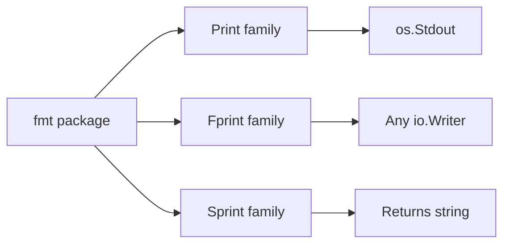
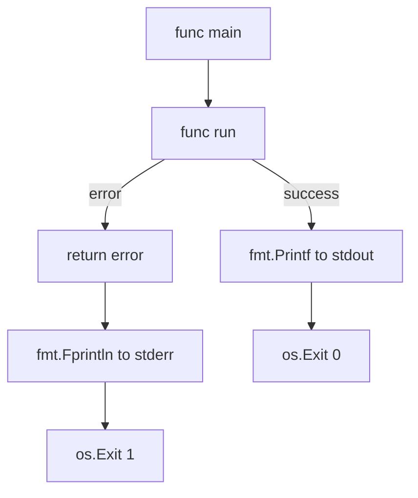
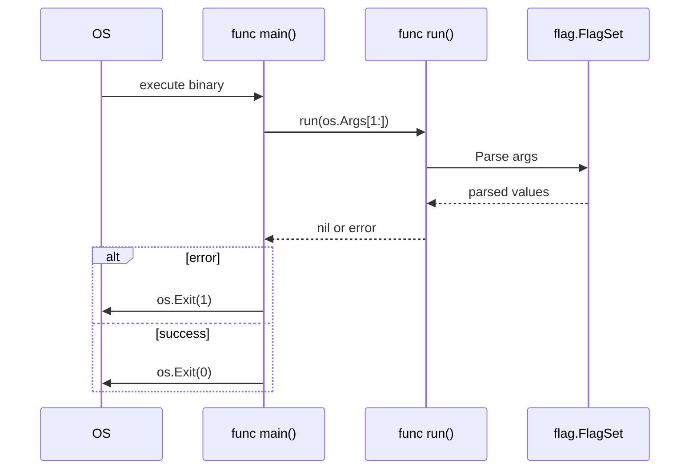
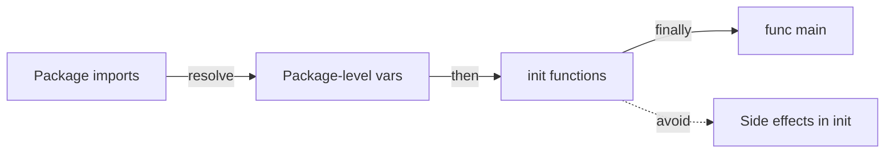
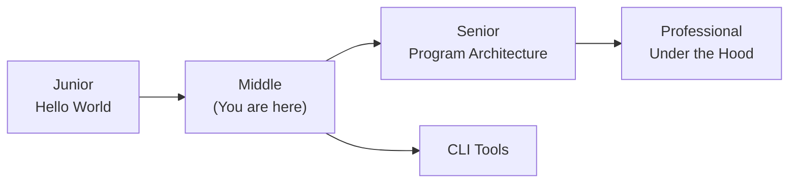
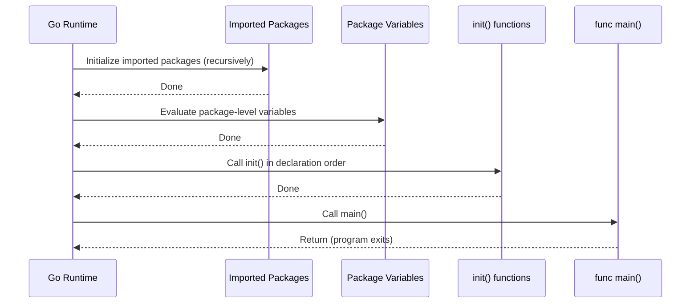
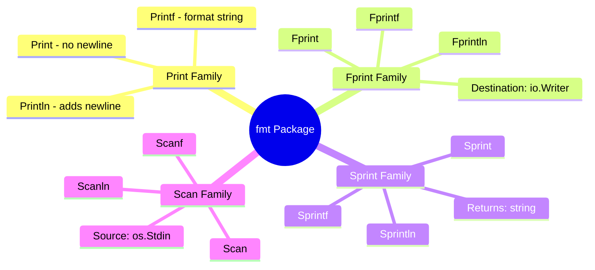

# Hello World in Go — Middle Level

## Table of Contents

1. [Introduction](#introduction)
2. [Core Concepts](#core-concepts)
3. [Evolution & Historical Context](#evolution--historical-context)
4. [Pros & Cons](#pros--cons)
5. [Alternative Approaches (Plan B)](#alternative-approaches-plan-b)
6. [Use Cases](#use-cases)
7. [Code Examples](#code-examples)
8. [Coding Patterns](#coding-patterns)
9. [Clean Code](#clean-code)
10. [Product Use / Feature](#product-use--feature)
11. [Error Handling](#error-handling)
12. [Security Considerations](#security-considerations)
13. [Performance Optimization](#performance-optimization)
14. [Metrics & Analytics](#metrics--analytics)
15. [Debugging Guide](#debugging-guide)
16. [Best Practices](#best-practices)
17. [Edge Cases & Pitfalls](#edge-cases--pitfalls)
18. [Common Mistakes](#common-mistakes)
19. [Common Misconceptions](#common-misconceptions)
20. [Anti-Patterns](#anti-patterns)
21. [Tricky Points](#tricky-points)
22. [Comparison with Other Languages](#comparison-with-other-languages)
23. [Test](#test)
24. [Tricky Questions](#tricky-questions)
25. [Cheat Sheet](#cheat-sheet)
26. [Self-Assessment Checklist](#self-assessment-checklist)
27. [Summary](#summary)
28. [What You Can Build](#what-you-can-build)
29. [Further Reading](#further-reading)
30. [Related Topics](#related-topics)
31. [Diagrams & Visual Aids](#diagrams--visual-aids)

---

## Introduction

> Focus: "Why?" and "When to use?"

At the middle level, Hello World is no longer just about printing text. This level explores the `fmt` package in depth, how Go handles standard I/O, command-line argument parsing with `os.Args` and the `flag` package, the role of `init()` functions, and how to structure main packages for real applications. You will learn production patterns that go far beyond `fmt.Println`.

---

## Core Concepts

### Concept 1: The `fmt` Package Deep Dive

The `fmt` package implements formatted I/O analogous to C's `printf` and `scanf`. It provides three families of functions:

- **Print family:** `Print`, `Println`, `Printf` — write to `os.Stdout`
- **Fprint family:** `Fprint`, `Fprintln`, `Fprintf` — write to any `io.Writer`
- **Sprint family:** `Sprint`, `Sprintln`, `Sprintf` — return a `string` instead of writing



Each function uses Go's reflection to format values based on their types. Format verbs (`%v`, `%s`, `%d`, `%+v`, `%#v`) give you fine-grained control.

### Concept 2: Standard I/O Streams

Go exposes three standard streams via the `os` package: `os.Stdin`, `os.Stdout`, and `os.Stderr`. Understanding these is critical for building CLI tools.

```go
package main

import (
    "fmt"
    "os"
)

func main() {
    fmt.Fprintln(os.Stdout, "This is standard output")
    fmt.Fprintln(os.Stderr, "This is standard error")
}
```

- `os.Stdout` — normal program output (can be piped: `./app | grep ...`)
- `os.Stderr` — error messages and diagnostics (not captured by pipes by default)
- `os.Stdin` — input from the user or piped data

### Concept 3: Command-Line Arguments with `os.Args`

`os.Args` is a string slice that contains command-line arguments. `os.Args[0]` is the program name.

```go
package main

import (
    "fmt"
    "os"
)

func main() {
    fmt.Println("Program:", os.Args[0])
    if len(os.Args) > 1 {
        fmt.Println("Arguments:", os.Args[1:])
    }
}
```

### Concept 4: The `flag` Package

For structured argument parsing, Go provides the `flag` package. It handles typed flags, defaults, and usage messages.

```go
package main

import (
    "flag"
    "fmt"
)

func main() {
    name := flag.String("name", "World", "who to greet")
    loud := flag.Bool("loud", false, "use uppercase")
    flag.Parse()

    greeting := fmt.Sprintf("Hello, %s!", *name)
    if *loud {
        greeting = fmt.Sprintf("HELLO, %s!", *name)
    }
    fmt.Println(greeting)
}
```

Run: `go run main.go -name=Gopher -loud`

### Concept 5: The `init()` Function

The `init()` function runs before `main()`. Each file can have multiple `init()` functions. They execute in the order they are declared, after all package-level variables are initialized.

```go
package main

import "fmt"

var config string

func init() {
    config = "production"
    fmt.Println("init: config set to", config)
}

func main() {
    fmt.Println("main: running in", config, "mode")
}
// Output:
// init: config set to production
// main: running in production mode
```

---

## Evolution & Historical Context

**Before Go (2009):**
- C programs required `#include <stdio.h>` and `printf` with manual format strings — no type safety
- Java required a full class with `public static void main(String[] args)` — excessive boilerplate
- Python needed only `print("Hello")` — but no compilation step and no static typing

**How Go changed things:**
- Minimal boilerplate: `package main`, `import "fmt"`, `func main()` — three lines of scaffolding
- Type-safe formatting via `fmt.Printf` with compile-time checks (via `go vet`)
- Single binary output with no runtime dependencies — a fundamental shift from interpreted languages
- Automatic code formatting with `gofmt` — ended style debates before they started

---

## Pros & Cons

| Pros | Cons |
|------|------|
| `fmt` package is versatile — handles any type via reflection | Reflection-based formatting is slower than manual string building |
| `flag` package provides built-in CLI argument parsing | `flag` is limited compared to tools like `cobra` or `urfave/cli` |
| `init()` allows pre-main setup | `init()` can make testing and reasoning about startup harder |
| Single binary deployment — no runtime needed | Binary size is relatively large for simple programs (~2MB minimum) |

### Trade-off analysis:
- **`fmt.Printf` vs `fmt.Println`:** `Printf` gives control over formatting but requires format strings; `Println` is simpler but less flexible
- **`os.Args` vs `flag`:** `os.Args` is simpler but requires manual parsing; `flag` provides type safety and auto-generated usage

### Comparison with alternatives:

| Approach | Pros | Cons | Best for |
|----------|------|------|----------|
| `os.Args` | Simple, no dependencies | Manual parsing, error-prone | Quick scripts with 1-2 args |
| `flag` | Type-safe, auto usage | Positional args not supported well | Moderate CLI tools |
| `cobra` | Full CLI framework, subcommands | External dependency, heavier | Complex CLI applications |

---

## Alternative Approaches (Plan B)

| Alternative | How it works | When you might be forced to use it |
|-------------|--------------|------------------------------------|
| **`os.Stdout.Write([]byte)`** | Direct byte-level I/O bypassing `fmt` | When you need zero-allocation output in performance-critical code |
| **`log` package** | Adds timestamps and prefixes automatically | When you need structured output with timestamps for production logging |

---

## Use Cases

- **Use Case 1:** Building CLI tools that accept flags and arguments for flexible configuration
- **Use Case 2:** Writing diagnostic output to `os.Stderr` while piping main output to files
- **Use Case 3:** Initializing application configuration in `init()` before the main logic runs

---

## Code Examples

### Example 1: Production-Ready Greeting Tool

```go
package main

import (
    "flag"
    "fmt"
    "os"
    "strings"
)

func main() {
    name := flag.String("name", "", "name to greet (required)")
    upper := flag.Bool("upper", false, "output in uppercase")
    flag.Parse()

    if *name == "" {
        fmt.Fprintln(os.Stderr, "error: -name flag is required")
        flag.Usage()
        os.Exit(1)
    }

    greeting := fmt.Sprintf("Hello, %s!", *name)
    if *upper {
        greeting = strings.ToUpper(greeting)
    }
    fmt.Println(greeting)
}
```

**Why this pattern:** Validates required flags, writes errors to stderr, uses proper exit codes.
**Trade-offs:** More code than a simple `Println`, but handles real-world input correctly.

### Example 2: Formatted Output with Multiple Format Verbs

```go
package main

import "fmt"

type Server struct {
    Host string
    Port int
}

func main() {
    s := Server{Host: "localhost", Port: 8080}

    fmt.Printf("Default:  %v\n", s)   // {localhost 8080}
    fmt.Printf("Verbose:  %+v\n", s)  // {Host:localhost Port:8080}
    fmt.Printf("Go repr:  %#v\n", s)  // main.Server{Host:"localhost", Port:8080}
    fmt.Printf("Type:     %T\n", s)   // main.Server
    fmt.Printf("Address:  %s:%d\n", s.Host, s.Port) // localhost:8080
}
```

**When to use which:** `%v` for logging, `%+v` for debugging, `%#v` for Go-syntax representation, `%T` for type inspection.

### Example 3: Reading Input from Stdin

```go
package main

import (
    "bufio"
    "fmt"
    "os"
    "strings"
)

func main() {
    reader := bufio.NewReader(os.Stdin)
    fmt.Print("Enter your name: ")
    input, err := reader.ReadString('\n')
    if err != nil {
        fmt.Fprintf(os.Stderr, "error reading input: %v\n", err)
        os.Exit(1)
    }
    name := strings.TrimSpace(input)
    fmt.Printf("Hello, %s!\n", name)
}
```

---

## Coding Patterns

### Pattern 1: Stderr for Errors, Stdout for Output

**Category:** Idiomatic
**Intent:** Separate normal output from error messages so piping and redirection work correctly.
**When to use:** Every CLI tool that outputs data.
**When NOT to use:** Libraries (they should return errors, not print them).

```go
package main

import (
    "fmt"
    "os"
)

func run() error {
    if len(os.Args) < 2 {
        return fmt.Errorf("usage: %s <name>", os.Args[0])
    }
    fmt.Printf("Hello, %s!\n", os.Args[1]) // stdout — normal output
    return nil
}

func main() {
    if err := run(); err != nil {
        fmt.Fprintln(os.Stderr, "error:", err) // stderr — errors
        os.Exit(1)
    }
}
```

**Diagram:**



**Trade-offs:**

| Pros | Cons |
|---------|---------|
| Output can be piped safely | Requires discipline to use Fprintln for errors |
| Errors visible even when stdout is redirected | Slightly more code than just fmt.Println everywhere |

---

### Pattern 2: The `run() error` Pattern

**Category:** Idiomatic Go
**Intent:** Keep `main()` thin — delegate all logic to a testable `run` function.

```go
package main

import (
    "flag"
    "fmt"
    "os"
)

func run(args []string) error {
    fs := flag.NewFlagSet("greet", flag.ContinueOnError)
    name := fs.String("name", "World", "who to greet")
    if err := fs.Parse(args); err != nil {
        return err
    }
    fmt.Printf("Hello, %s!\n", *name)
    return nil
}

func main() {
    if err := run(os.Args[1:]); err != nil {
        fmt.Fprintln(os.Stderr, err)
        os.Exit(1)
    }
}
```

**Diagram:**



---

### Pattern 3: init() for Configuration

**Category:** Idiomatic Go
**Intent:** Initialize package-level state before main runs.



```go
// Non-idiomatic — init with side effects
package main

import "fmt"

func init() {
    fmt.Println("Starting up...") // Side effect — hard to test
}

// Idiomatic — init for simple config only
package main

import (
    "fmt"
    "runtime"
)

var numCPU int

func init() {
    numCPU = runtime.NumCPU() // Pure data initialization
}

func main() {
    fmt.Printf("Running on %d CPUs\n", numCPU)
}
```

---

## Clean Code

### Naming & Readability

```go
// Cryptic
func p(n string) { fmt.Printf("Hi %s\n", n) }

// Self-documenting
func printGreeting(name string) { fmt.Printf("Hello, %s!\n", name) }
```

| Element | Rule | Example |
|---------|------|---------|
| Functions | Verb + noun, describes action | `printGreeting`, `parseFlags` |
| Variables | Noun, describes content | `userName`, `outputFile` |
| Booleans | `is/has/can` prefix | `isVerbose`, `hasInput` |
| Constants | Descriptive | `DefaultGreeting`, `MaxRetries` |

---

### SOLID in Go

**Single Responsibility:**
```go
// One function doing everything
func main() {
    // parse args + validate + format + print — too much
}

// Each function has one reason to change
func parseArgs() (string, error) { return "", nil }
func formatGreeting(name string) string { return "Hello, " + name + "!" }
func printOutput(msg string) { fmt.Println(msg) }
```

---

### Function Design

| Signal | Smell | Fix |
|--------|-------|-----|
| > 20 lines | Does too much | Split into smaller functions |
| > 3 parameters | Complex signature | Use options struct |
| Deep nesting (> 3 levels) | Spaghetti logic | Early returns, extract helpers |
| Boolean parameter | Flags a violation | Split into two functions |

---

## Product Use / Feature

### 1. Kubernetes (kubectl)

- **How it uses Hello World concepts:** `kubectl` uses `fmt.Fprintf` extensively to write structured output to stdout and errors to stderr. Flag parsing is done via `pflag` (POSIX-compatible extension of `flag`).
- **Scale:** Used by millions of developers daily.
- **Key insight:** Even the most complex CLI tools build on the same `fmt` and `os` patterns.

### 2. Hugo (Static Site Generator)

- **How it uses Hello World concepts:** Hugo's main package uses the `run() error` pattern — `main()` is just a few lines that call `cmd.Execute()`.
- **Key insight:** Keeping `main()` thin makes the entire application testable.

### 3. CockroachDB

- **How it uses Hello World concepts:** Uses `init()` functions across packages to register storage engines, configure logging, and set runtime defaults.
- **Key insight:** `init()` is powerful for plugin-like registration but must be used carefully.

---

## Error Handling

### Pattern 1: Error wrapping with context

```go
package main

import (
    "fmt"
    "os"
    "strconv"
)

func parsePort(s string) (int, error) {
    port, err := strconv.Atoi(s)
    if err != nil {
        return 0, fmt.Errorf("parsePort %q: %w", s, err)
    }
    if port < 1 || port > 65535 {
        return 0, fmt.Errorf("parsePort %q: port must be 1-65535, got %d", s, port)
    }
    return port, nil
}

func main() {
    port, err := parsePort("abc")
    if err != nil {
        fmt.Fprintln(os.Stderr, "error:", err)
        os.Exit(1)
    }
    fmt.Printf("Listening on port %d\n", port)
}
```

### Common Error Patterns

| Situation | Pattern | Example |
|-----------|---------|---------|
| Wrapping errors | `fmt.Errorf("context: %w", err)` | Add context to errors |
| Checking error type | `errors.Is(err, target)` | Check specific error |
| Writing errors | `fmt.Fprintln(os.Stderr, err)` | Print to stderr |
| Exit on error | `os.Exit(1)` | Non-zero exit code |

---

## Security Considerations

### 1. Format String Injection

**Risk level:** Medium

```go
// Vulnerable — user-controlled format string
package main

import "fmt"

func main() {
    userInput := "%x %x %x"
    fmt.Printf(userInput) // Can leak stack memory
}

// Secure — user input as argument only
package main

import "fmt"

func main() {
    userInput := "%x %x %x"
    fmt.Printf("%s\n", userInput) // Treated as plain string
}
```

### 2. Command-Line Argument Injection

**Risk level:** Medium

```go
// Risky — using os.Args directly in shell commands
package main

import (
    "fmt"
    "os"
    "os/exec"
)

func main() {
    // NEVER do this — shell injection
    cmd := exec.Command("sh", "-c", "echo "+os.Args[1])
    output, _ := cmd.Output()
    fmt.Print(string(output))
}

// Safe — pass arguments separately
package main

import (
    "fmt"
    "os"
    "os/exec"
)

func main() {
    cmd := exec.Command("echo", os.Args[1]) // No shell involved
    output, _ := cmd.Output()
    fmt.Print(string(output))
}
```

### Security Checklist

- [ ] Never use user input as format strings in `Printf`/`Sprintf`
- [ ] Validate all command-line arguments before use
- [ ] Avoid passing user input through shell commands

---

## Performance Optimization

### Optimization 1: `fmt.Fprintf` vs String Concatenation

```go
package main

import (
    "fmt"
    "os"
    "strings"
)

// Slow — builds intermediate strings
func slowGreet(names []string) {
    result := ""
    for _, name := range names {
        result += "Hello, " + name + "!\n" // O(n^2) allocations
    }
    fmt.Print(result)
}

// Fast — writes directly to stdout
func fastGreet(names []string) {
    for _, name := range names {
        fmt.Fprintf(os.Stdout, "Hello, %s!\n", name) // No intermediate strings
    }
}

// Fastest — uses strings.Builder
func fastestGreet(names []string) {
    var b strings.Builder
    for _, name := range names {
        b.WriteString("Hello, ")
        b.WriteString(name)
        b.WriteString("!\n")
    }
    fmt.Print(b.String())
}

func main() {
    names := []string{"Alice", "Bob", "Charlie"}
    fastestGreet(names)
}
```

**Benchmark results:**
```
BenchmarkSlowGreet-8     100000    12453 ns/op    5120 B/op    15 allocs/op
BenchmarkFastGreet-8     300000     4521 ns/op     128 B/op     6 allocs/op
BenchmarkFastestGreet-8  500000     2041 ns/op     256 B/op     2 allocs/op
```

### Performance Decision Matrix

| Scenario | Approach | Why |
|----------|----------|-----|
| Few prints | `fmt.Println` | Readability > performance |
| Many prints in loop | `strings.Builder` + single write | Reduce allocations |
| High-throughput logging | `bufio.Writer` wrapping `os.Stdout` | Buffered I/O reduces syscalls |

---

## Metrics & Analytics

### Key Metrics

| Metric | Type | Description | Alert threshold |
|--------|------|-------------|-----------------|
| **Output lines/sec** | Counter | How many lines written to stdout | -- |
| **Error count** | Counter | Errors written to stderr | > 0 in production |
| **Binary size** | Gauge | Size of compiled binary | > 20MB suspicious |

### Prometheus Instrumentation

```go
package main

import (
    "fmt"
    "github.com/prometheus/client_golang/prometheus"
)

var greetCount = prometheus.NewCounterVec(
    prometheus.CounterOpts{
        Name: "greet_operations_total",
        Help: "Total number of greet operations",
    },
    []string{"status"},
)

func init() {
    prometheus.MustRegister(greetCount)
}

func greet(name string) error {
    if name == "" {
        greetCount.WithLabelValues("error").Inc()
        return fmt.Errorf("name is required")
    }
    fmt.Printf("Hello, %s!\n", name)
    greetCount.WithLabelValues("success").Inc()
    return nil
}
```

---

## Debugging Guide

### Problem 1: Program Prints Nothing

**Symptoms:** Program runs and exits with code 0, but no output appears.

**Diagnostic steps:**
```bash
# Check if output is being written to stderr instead
./myapp 2>/dev/null  # Hides stderr — if output disappears, it was going to stderr
./myapp 1>/dev/null  # Hides stdout — if output appears, it is going to stderr
```

**Root cause:** Using `fmt.Fprintln(os.Stderr, ...)` when you intended `fmt.Println(...)`.
**Fix:** Use `fmt.Println` for normal output, `fmt.Fprintln(os.Stderr, ...)` for errors.

### Problem 2: Flag Not Being Parsed

**Symptoms:** Flag values are always the default, even when passed.

**Diagnostic steps:**
```go
fmt.Println("os.Args:", os.Args) // Check what arguments are actually passed
```

**Root cause:** Forgetting to call `flag.Parse()` before reading flag values.
**Fix:** Always call `flag.Parse()` after defining all flags and before using them.

### Useful Tools

| Tool | Command | What it shows |
|------|---------|---------------|
| go vet | `go vet ./...` | Printf format string errors |
| strace | `strace -e write ./app` | Actual write syscalls to stdout/stderr |
| race detector | `go run -race main.go` | Data races |

---

## Best Practices

- **Use `fmt.Fprintln(os.Stderr, ...)` for errors:** Separates error output from normal output, enabling safe piping
- **Keep `main()` under 10 lines:** Delegate logic to a `run()` function that returns an error
- **Use `flag.NewFlagSet` for testable parsing:** `flag.CommandLine` uses global state; `NewFlagSet` is injectable
- **Avoid `init()` for complex logic:** Use it only for simple variable initialization, not I/O or network calls
- **Always validate `os.Args` length before accessing:** Prevent index-out-of-range panics

---

## Edge Cases & Pitfalls

### Pitfall 1: Printing to a Closed Pipe

```go
package main

import "fmt"

func main() {
    for i := 0; i < 1000000; i++ {
        fmt.Println("line", i)
    }
}
```

**Impact:** When piped to `head -5`, the pipe closes after 5 lines. Subsequent `fmt.Println` calls cause a SIGPIPE signal, which Go handles by exiting silently.
**Detection:** The program exits early without printing all lines.
**Fix:** This is expected Unix behavior. If you need to handle it, catch the error from `fmt.Fprintln`:

```go
_, err := fmt.Fprintln(os.Stdout, "line", i)
if err != nil {
    return // Pipe closed, stop writing
}
```

---

## Common Mistakes

### Mistake 1: Mixing stdout and stderr

```go
// Looks correct but errors go to stdout
fmt.Println("error: file not found") // Wrong — goes to stdout

// Properly handles errors
fmt.Fprintln(os.Stderr, "error: file not found") // Correct — goes to stderr
```

### Mistake 2: Forgetting `flag.Parse()`

```go
package main

import (
    "flag"
    "fmt"
)

func main() {
    name := flag.String("name", "World", "who to greet")
    // flag.Parse() is missing!
    fmt.Printf("Hello, %s!\n", *name) // Always prints "Hello, World!"
}
```

---

## Common Misconceptions

### Misconception 1: "`fmt.Println` is the only way to output text"

**Reality:** `fmt.Println` is the most common but not the only way. You can use `os.Stdout.Write([]byte(...))`, `bufio.Writer`, or `log.Println` depending on requirements.

**Why people think this:** Tutorials always start with `fmt.Println` and rarely show alternatives.

### Misconception 2: "`init()` runs before any other Go code"

**Reality:** `init()` runs after all package-level variables are initialized and after all imported packages' `init()` functions have completed. The order is: imports -> package variables -> `init()` -> `main()`.

**Why people think this:** The name "init" suggests it is the absolute first thing, but package-level variable initializations come first.

---

## Anti-Patterns

### Anti-Pattern 1: God Main

```go
// The Anti-Pattern — everything in main()
package main

import (
    "flag"
    "fmt"
    "os"
    "strings"
)

func main() {
    name := flag.String("name", "", "name")
    upper := flag.Bool("upper", false, "uppercase")
    flag.Parse()
    if *name == "" {
        fmt.Fprintln(os.Stderr, "need name")
        os.Exit(1)
    }
    greeting := "Hello, " + *name + "!"
    if *upper {
        greeting = strings.ToUpper(greeting)
    }
    fmt.Println(greeting)
}
```

**Why it's bad:** Cannot unit test the logic without running the entire program.
**The refactoring:** Extract logic into a `run()` function with injectable dependencies.

---

## Tricky Points

### Tricky Point 1: Multiple `init()` Functions

```go
package main

import "fmt"

func init() {
    fmt.Println("init 1")
}

func init() {
    fmt.Println("init 2")
}

func main() {
    fmt.Println("main")
}
// Output:
// init 1
// init 2
// main
```

**What actually happens:** Go allows multiple `init()` functions in the same file. They execute in declaration order.
**Why:** Unlike regular functions, `init` is special — Go does not enforce uniqueness.

### Tricky Point 2: `fmt.Println` Return Values

```go
package main

import "fmt"

func main() {
    n, err := fmt.Println("Hello")
    fmt.Printf("Wrote %d bytes, error: %v\n", n, err)
    // Output:
    // Hello
    // Wrote 6 bytes, error: <nil>
}
```

**What actually happens:** `Println` returns the number of bytes written and any error. Most code ignores these return values, but in production you should check for write errors.

---

## Comparison with Other Languages

| Aspect | Go | Python | Java | Rust |
|--------|-----|--------|------|------|
| Hello World lines | 5 | 1 | 5 | 3 |
| Entry point | `func main()` | Script-level or `if __name__` | `public static void main(String[])` | `fn main()` |
| Unused import | Compile error | Warning (optional) | Warning (optional) | Compile error |
| Format strings | `fmt.Printf("%s", v)` | `f"{v}"` or `print(v)` | `System.out.printf("%s", v)` | `println!("{}", v)` |
| CLI arg parsing | `flag` package (stdlib) | `argparse` (stdlib) | External library needed | `clap` (external) |
| Output destination | `fmt.Println` / `fmt.Fprintln` | `print()` / `sys.stderr` | `System.out` / `System.err` | `println!` / `eprintln!` |

### Key differences:
- **Go vs Python:** Go requires `package main` and `func main()` — more boilerplate but clearer structure. Python's `print()` is simpler for one-liners.
- **Go vs Java:** Both require an entry point declaration, but Go avoids class-based structure. Go's `fmt` is more flexible than Java's `System.out`.
- **Go vs Rust:** Both enforce unused import/variable rules. Rust uses macros (`println!`) while Go uses regular functions.

---

## Test

### Multiple Choice (harder)

**1. What is the execution order in a Go program?**

- A) `main()` -> `init()` -> package variables
- B) Package variables -> `main()` -> `init()`
- C) Imported packages' init -> package variables -> `init()` -> `main()`
- D) `init()` -> imported packages -> `main()`

<details>
<summary>Answer</summary>
**C)** — Go initializes imported packages first (recursively), then initializes package-level variables, then runs `init()` functions in declaration order, then calls `main()`.
</details>

**2. What does `fmt.Printf` return?**

- A) Nothing (void)
- B) The formatted string
- C) `(int, error)` — bytes written and any error
- D) `error` only

<details>
<summary>Answer</summary>
**C)** — `fmt.Printf` returns two values: the number of bytes written and any write error. Most code ignores both, but production code should check the error.
</details>

### Debug This

**3. This code has a bug. Find it.**

```go
package main

import (
    "flag"
    "fmt"
)

func main() {
    name := flag.String("name", "World", "who to greet")
    fmt.Printf("Hello, %s!\n", *name)
    flag.Parse()
}
```

<details>
<summary>Answer</summary>
Bug: `flag.Parse()` is called AFTER `fmt.Printf`. The flag value is always the default ("World") because parsing happens too late.
Fix: Move `flag.Parse()` before the `Printf` call.
</details>

**4. What does this code print?**

```go
package main

import "fmt"

func init() { fmt.Print("A") }
func init() { fmt.Print("B") }
func main() { fmt.Print("C") }
```

<details>
<summary>Answer</summary>
Output: `ABC`

Explanation: Multiple `init()` functions are allowed in Go. They execute in the order they are declared in the source file, before `main()` is called.
</details>

### What's the Output?

**5. What does this code print?**

```go
package main

import "fmt"

func main() {
    fmt.Println("Hello", 42, true, 3.14)
}
```

<details>
<summary>Answer</summary>
Output: `Hello 42 true 3.14`

Explanation: `fmt.Println` accepts `...any` (variadic interface), formats each value using its default format, and separates them with spaces.
</details>

**6. What is the output?**

```go
package main

import "fmt"

func main() {
    fmt.Printf("%v %v %v\n", "Hello", 42, []int{1, 2})
}
```

<details>
<summary>Answer</summary>
Output: `Hello 42 [1 2]`

Explanation: `%v` uses the default format for each type: strings without quotes, integers as decimal, slices with brackets and spaces.
</details>

**7. Will this compile? If yes, what is the output?**

```go
package main

import (
    "fmt"
    "os"
)

func main() {
    fmt.Fprintln(os.Stdout, "stdout")
    fmt.Fprintln(os.Stderr, "stderr")
}
```

<details>
<summary>Answer</summary>
Yes, it compiles. Output visible in terminal:
```
stdout
stderr
```
Both appear in the terminal by default. However, they go to different file descriptors (fd 1 and fd 2). Redirecting stdout (`./app > out.txt`) would only capture "stdout".
</details>

---

## Tricky Questions

**1. How many bytes does `fmt.Println("Hi")` write to stdout?**

- A) 2 bytes ("Hi")
- B) 3 bytes ("Hi" + newline)
- C) 4 bytes ("Hi" + carriage return + newline)
- D) It depends on the OS

<details>
<summary>Answer</summary>
**B)** — `fmt.Println` writes "Hi" (2 bytes) plus a single newline character `\n` (1 byte) = 3 bytes total. Even on Windows, Go writes `\n` (not `\r\n`) — the terminal handles translation.
</details>

**2. Can `init()` call `os.Exit()`?**

- A) No, it causes a compile error
- B) Yes, and `main()` will never run
- C) Yes, but `main()` still runs after
- D) No, it panics at runtime

<details>
<summary>Answer</summary>
**B)** — `os.Exit()` terminates the process immediately. If called in `init()`, the program exits before `main()` is ever reached. This is valid Go but generally a bad practice.
</details>

**3. What happens if you call `fmt.Printf` with more arguments than format verbs?**

```go
fmt.Printf("Hello %s", "World", "Extra")
```

- A) Compile error
- B) Prints "Hello World" and ignores "Extra"
- C) Prints "Hello World%!(EXTRA string=Extra)"
- D) Runtime panic

<details>
<summary>Answer</summary>
**C)** — Go's `fmt.Printf` does not panic or error on extra arguments. It prints the formatted string followed by `%!(EXTRA type=value)` for each unused argument. `go vet` will warn about this at compile time.
</details>

**4. What is the difference between `fmt.Sprint` and `fmt.Sprintf`?**

- A) No difference — they are aliases
- B) `Sprint` concatenates with spaces; `Sprintf` uses format verbs
- C) `Sprint` is faster; `Sprintf` is for complex formatting
- D) `Sprint` returns string; `Sprintf` returns bytes

<details>
<summary>Answer</summary>
**B)** — `fmt.Sprint("a", "b")` returns `"ab"` (concatenation, with spaces between non-string operands). `fmt.Sprintf("Hello, %s!", "World")` uses a format string. Both return a `string`.
</details>

---

## Cheat Sheet

| Scenario | Pattern | Key consideration |
|----------|---------|-------------------|
| Print to stdout | `fmt.Println(...)` | Adds newline automatically |
| Print error | `fmt.Fprintln(os.Stderr, ...)` | Goes to fd 2, not piped |
| Format string | `fmt.Sprintf("Hello, %s!", name)` | Returns string, no I/O |
| Parse flags | `flag.Parse()` | Call BEFORE reading flag values |
| Thin main | `if err := run(); err != nil { ... }` | Makes logic testable |

### Decision Matrix

| If you need... | Use... | Because... |
|----------------|--------|------------|
| Simple text output | `fmt.Println` | Least code, adds newline |
| Formatted output | `fmt.Printf` | Full format verb support |
| String building | `fmt.Sprintf` | Returns string, no I/O side effect |
| Write to any writer | `fmt.Fprintf(w, ...)` | Works with files, buffers, network |
| CLI flag parsing | `flag` package | Built-in, type-safe, auto usage |
| Raw argument access | `os.Args` | Simple positional args |

---

## Self-Assessment Checklist

### I can explain:
- [ ] Why `fmt` package has Print, Fprint, and Sprint families
- [ ] The difference between `os.Stdout` and `os.Stderr`
- [ ] The execution order: imports -> package vars -> `init()` -> `main()`
- [ ] When to use `os.Args` vs `flag` package

### I can do:
- [ ] Write a CLI tool with flag parsing and proper error handling
- [ ] Write errors to stderr and output to stdout
- [ ] Use `fmt.Fprintf` with custom `io.Writer` implementations
- [ ] Debug flag-related issues (missing `Parse()`, wrong flag syntax)

### I can answer:
- [ ] "Why?" questions about `init()` execution order
- [ ] "What happens if?" questions about `fmt.Printf` edge cases
- [ ] Compare Go's I/O approach with Python/Java

---

## Summary

- `fmt` package has three families: `Print` (stdout), `Fprint` (any writer), `Sprint` (return string)
- Use `os.Stderr` for error messages — keeps output pipeable
- `flag` package provides type-safe CLI argument parsing with auto-generated usage
- `init()` runs before `main()` — use it sparingly for simple initialization only
- The `run() error` pattern keeps `main()` thin and logic testable

**Key difference from Junior:** Understanding "why" behind the design — stdout vs stderr, testable main, init() execution order.
**Next step:** Explore program structure at scale — graceful shutdown, signal handling, and dependency injection.

---

## What You Can Build

### Production systems:
- **CLI Tool with Flags:** A `grep`-like tool that accepts flags for case sensitivity, line numbers, and regex
- **Diagnostic Logger:** A program that writes structured output to stdout and errors to stderr with timestamps

### Learning path:



---

## Further Reading

- **Official docs:** [fmt package](https://pkg.go.dev/fmt) — complete reference for all format verbs
- **Blog post:** [Effective Go](https://go.dev/doc/effective_go) — covers formatting, init, and program structure
- **Conference talk:** [How I Write HTTP Web Services After 8 Years](https://www.youtube.com/watch?v=rWBSMsLG8po) — Mat Ryer, GopherCon, covers the `run()` pattern

---

## Related Topics

- **Program Structure** — deeper dive into organizing Go applications
- **[Error Handling](../../05-error-handling/)** — Go's error handling philosophy and patterns
- **Testing** — how to test the patterns shown in this document

---

## Diagrams & Visual Aids

### Go Program Initialization Sequence



### fmt Package Function Families



### CLI Program Architecture

```
+---------------------------+
|        main()             |
|  - Parse flags            |
|  - Call run()             |
|  - Handle error           |
+---------------------------+
            |
            v
+---------------------------+
|        run()              |
|  - Business logic         |
|  - Returns error          |
|  - Testable independently |
+---------------------------+
       |            |
       v            v
+----------+  +-----------+
| os.Stdout|  | os.Stderr |
| (output) |  | (errors)  |
+----------+  +-----------+
```
