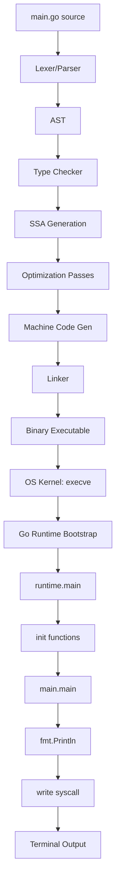
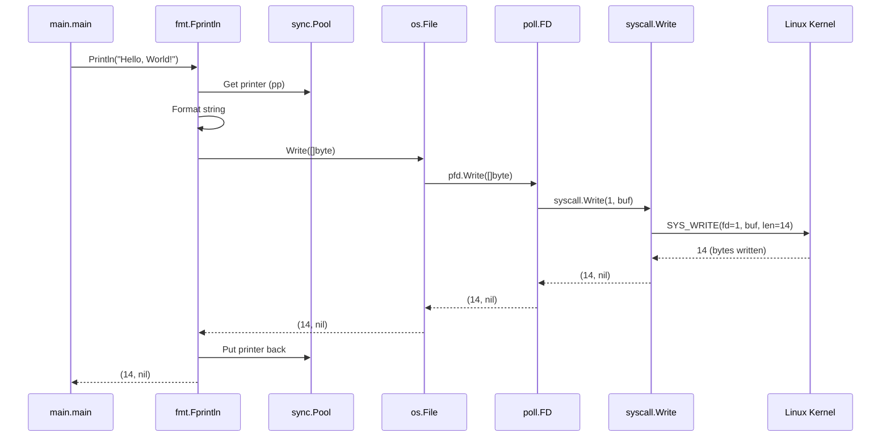
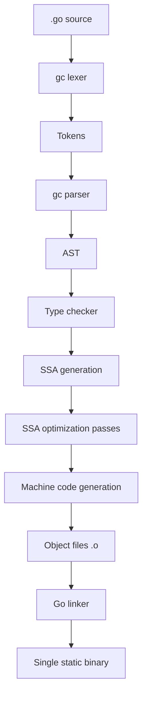
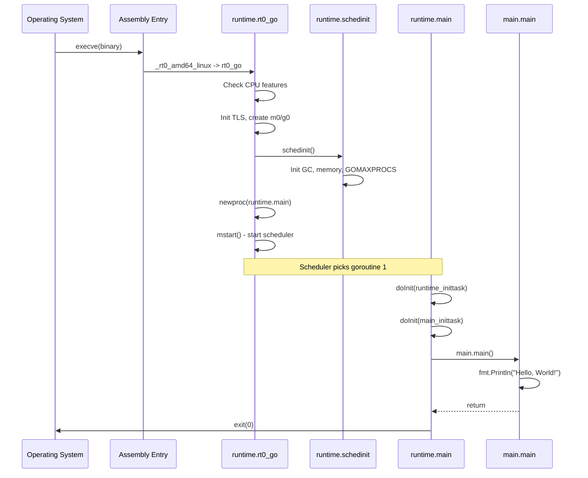

# Hello World in Go — Under the Hood

## Table of Contents

1. [Introduction](#introduction)
2. [How It Works Internally](#how-it-works-internally)
3. [Runtime Deep Dive](#runtime-deep-dive)
4. [Compiler Perspective](#compiler-perspective)
5. [Memory Layout](#memory-layout)
6. [OS / Syscall Level](#os--syscall-level)
7. [Source Code Walkthrough](#source-code-walkthrough)
8. [Assembly Output Analysis](#assembly-output-analysis)
9. [Performance Internals](#performance-internals)
10. [Metrics & Analytics (Runtime Level)](#metrics--analytics-runtime-level)
11. [Edge Cases at the Lowest Level](#edge-cases-at-the-lowest-level)
12. [Test](#test)
13. [Tricky Questions](#tricky-questions)
14. [Summary](#summary)
15. [Further Reading](#further-reading)
16. [Diagrams & Visual Aids](#diagrams--visual-aids)

---

## Introduction

> Focus: "What happens under the hood?"

This document explores what Go does internally when you write `package main`, `import "fmt"`, and `func main() { fmt.Println("Hello, World!") }`. We trace the full journey from source code to screen output:

- What the Go compiler generates from your 5-line program
- How the Go runtime bootstraps your program before `main()` runs
- What `runtime.main` does and how it calls `main.main`
- How `fmt.Println` translates to a `write` syscall
- The goroutine, stack, and OS thread setup that happens before your first line executes
- Assembly output analysis of the compiled binary

---

## How It Works Internally

When you execute `go run main.go`, the following sequence occurs:

1. **`go run`** invokes the Go toolchain, which compiles `main.go` to a temporary binary
2. **Lexer/Parser** tokenizes the source and builds an AST (Abstract Syntax Tree)
3. **Type checker** validates types, resolves imports, checks for unused imports/variables
4. **SSA generation** converts the AST to Static Single Assignment form for optimization
5. **Optimization passes** apply inlining, dead code elimination, escape analysis
6. **Code generation** emits machine code (platform-specific assembly)
7. **Linker** links the Go runtime, `fmt` package, and your code into a single binary
8. **OS launches** the binary — the kernel calls `_rt0_amd64_linux` (the Go entry point)
9. **Go runtime bootstrap** initializes the scheduler, GC, and creates the main goroutine
10. **`runtime.main`** runs `init()` functions and then calls `main.main`
11. **`fmt.Println`** uses reflection to format the argument, then calls `os.Stdout.Write`
12. **`os.Stdout.Write`** invokes the `write(2)` syscall via `syscall.Write`



---

## Runtime Deep Dive

### How Go Runtime Bootstraps Before `main()`

When the OS loads the Go binary, the very first code that runs is NOT your `main()` function. The Go runtime performs extensive setup:

**Entry point (assembly):** `src/runtime/rt0_linux_amd64.s`
```asm
TEXT _rt0_amd64_linux(SB),NOSPLIT,$-8
    JMP     _rt0_amd64(SB)
```

This jumps to the architecture-specific entry point which:
1. Saves command-line arguments (`argc`, `argv`)
2. Calls `runtime.rt0_go` which performs the real bootstrap

**Key bootstrap sequence in `runtime.rt0_go`:**

```
1. Check CPU features (SSE, AVX, etc.)
2. Initialize TLS (Thread Local Storage)
3. Create the first OS thread (m0) and first goroutine (g0)
4. Initialize the scheduler
5. Create a new goroutine for runtime.main
6. Start the scheduler — mstart()
```

**Key runtime structures:**

```go
// From runtime/runtime2.go — the goroutine struct
type g struct {
    stack       stack   // goroutine stack bounds
    stackguard0 uintptr // for stack growth checks
    m           *m      // current OS thread
    sched       gobuf   // scheduling state (PC, SP, etc.)
    goid        uint64  // goroutine ID
    // ... many more fields
}

// From runtime/runtime2.go — the OS thread struct
type m struct {
    g0      *g     // goroutine for scheduling
    curg    *g     // current running goroutine
    p       puintptr // attached P (processor)
    // ...
}

// From runtime/runtime2.go — the processor struct
type p struct {
    status    uint32 // one of pidle/prunning/...
    runqhead  uint32
    runqtail  uint32
    runq      [256]guintptr // local run queue
    // ...
}
```

**Key Go runtime functions in the startup path:**
- `runtime.rt0_go()` — assembly bootstrap, sets up m0/g0
- `runtime.schedinit()` — initializes the scheduler, GC, and determines GOMAXPROCS
- `runtime.newproc()` — creates the goroutine that will run `runtime.main`
- `runtime.mstart()` — starts the scheduler loop
- `runtime.main()` — runs init functions, then calls `main.main()`

### `runtime.main` vs `main.main`

```go
// Simplified from runtime/proc.go
func main() {
    // ... scheduler setup ...

    // Run init functions for all imported packages
    // Order: dependencies first, then main package
    doInit(runtime_inittask) // runtime's own init
    doInit(main_inittask)    // your package's init chain

    // Call the user's main function
    fn := main_main // This is main.main — YOUR code
    fn()

    // If main.main returns, exit the process
    exit(0)
}
```

The runtime creates a special goroutine (goroutine 1) specifically to run `runtime.main`. This goroutine has a default stack size of 1MB (configurable), and it is the goroutine that ultimately calls your `main.main`.

---

## Compiler Perspective

### What the Go Compiler Does with Hello World

```bash
# View escape analysis and inlining decisions
go build -gcflags="-m -m" main.go 2>&1
```

Output for a simple Hello World:
```
./main.go:7:13: inlining call to fmt.Println
./main.go:7:14: "Hello, World!" escapes to heap:
./main.go:7:14:   flow: {storage for ... argument} = &{storage for "Hello, World!"}:
./main.go:7:14:   flow: {heap} = {storage for ... argument}:
./main.go:7:13: ... argument does not escape
./main.go:7:14: "Hello, World!" escapes to heap
```

**Key observations:**
1. `fmt.Println` is **inlined** — the compiler inserts the function body directly into `main`
2. The string `"Hello, World!"` **escapes to heap** because `fmt.Println` accepts `...any` (interface), and the compiler cannot prove the value does not outlive the stack frame
3. The variadic `...any` argument creates an interface wrapper, which may cause allocations

```bash
# View SSA intermediate representation
GOSSAFUNC=main go build main.go
# Creates ssa.html — open in browser to see optimization passes
```

**Compiler optimizations applied to Hello World:**
- **Inlining:** `fmt.Println` call is inlined (reduces function call overhead)
- **Escape analysis:** Determines that the string escapes to heap (creates allocation)
- **Dead code elimination:** Unused paths in `fmt` package are removed
- **Constant folding:** The string literal is stored in the binary's read-only data section

---

## Memory Layout

### What Hello World Looks Like in Memory

When the program starts:

```
Process Memory Layout:
+---------------------------+ High address
|       Stack (g0)          | <- OS thread stack (8MB default)
|   for scheduler/GC       |
+---------------------------+
|       Stack (g1)          | <- main goroutine stack (1MB default, grows)
|   func main() frame      |
|   - return address        |
|   - local variables       |
+---------------------------+
|         Heap              |
|   - fmt.Println args      | <- interface{} wrapper for "Hello, World!"
|   - []byte for output     | <- buffer for write
+---------------------------+
|    Read-Only Data         |
|   - "Hello, World!\n"    | <- string literal (in binary)
|   - type descriptors      | <- reflect metadata for string type
+---------------------------+
|       BSS                 |
|   - os.Stdout             | <- *os.File (initialized at runtime)
+---------------------------+
|       Text                |
|   - main.main code        |
|   - fmt.Println code      |
|   - runtime.* code        |
+---------------------------+ Low address
```

```go
package main

import (
    "fmt"
    "unsafe"
)

func main() {
    s := "Hello, World!"
    fmt.Println("String header size:", unsafe.Sizeof(s))       // 16 bytes (ptr + len)
    fmt.Println("String data pointer:", unsafe.Pointer(&s))

    // A Go string is a struct: { ptr *byte, len int }
    // "Hello, World!" is 13 bytes of character data
    // Stored in read-only section of the binary
    // The string header (16 bytes) lives on the stack
}
```

**String internal structure:**
```
Stack frame of main():
+--------------------+
| string header      |
|   ptr: 0x4a2f30 ---|---> Read-only data: "Hello, World!"
|   len: 13          |
+--------------------+

When passed to fmt.Println(any):
+--------------------+
| interface{}        |
|   type: *_type     |---> type descriptor for "string"
|   data: *string ---|---> heap copy of string header
+--------------------+
```

---

## OS / Syscall Level

### What Syscalls Does Hello World Make?

```bash
# Trace all syscalls on Linux
strace -f -e trace=write,mmap,clone,futex ./hello 2>&1 | head -30
```

Key syscalls for Hello World:

```
execve("./hello", ["./hello"], [...])    = 0        # OS loads binary
mmap(NULL, 262144, ..., MAP_ANON)        = 0x...    # Allocate goroutine stack
clone(child_stack=0x..., flags=...)       = 1234     # Create OS thread for scheduler
futex(0x..., FUTEX_WAKE, 1)              = 1        # Wake scheduler thread
write(1, "Hello, World!\n", 14)          = 14       # THE actual output
exit_group(0)                            = ?        # Process exits
```

**The journey of `fmt.Println("Hello, World!")` to the `write` syscall:**

1. `fmt.Println("Hello, World!")` creates an `[]any{string("Hello, World!")}` slice
2. Calls `fmt.Fprintln(os.Stdout, args...)` internally
3. `Fprintln` creates a `pp` (printer) from a `sync.Pool`, formats the arguments
4. Writes formatted bytes to `os.Stdout` via the `io.Writer` interface
5. `os.Stdout` is an `*os.File` wrapping file descriptor 1
6. `os.File.Write` eventually calls `internal/poll.FD.Write`
7. `poll.FD.Write` calls `syscall.Write(fd, p)`
8. `syscall.Write` executes the `SYS_WRITE` syscall via `SYSCALL` instruction



---

## Source Code Walkthrough

### Walking Through `runtime.main` (Go 1.22)

**File:** `src/runtime/proc.go`

```go
// Simplified and annotated excerpt from runtime/proc.go
// This is the function that runs in goroutine 1 — the "main goroutine"

func main() {
    mp := getg().m  // Get the current OS thread (m)

    // Limit the main goroutine's stack size
    // Default max: 1GB on 64-bit, 250MB on 32-bit
    if goarch.PtrSize == 8 {
        maxstacksize = 1000000000
    } else {
        maxstacksize = 250000000
    }
    maxstackceiling = 2 * maxstacksize

    // Run package init functions
    // This traverses the dependency graph and calls init() for each package
    // in topological order (dependencies first)
    doInit(runtime_inittask) // runtime package's init
    // ... gc init, netpoll init ...
    doInit(main_inittask)    // YOUR package's init chain

    // Prevent main goroutine from being moved to a different OS thread
    // after init (important for cgo and LockOSThread)

    // Call the user's main function
    fn := main_main // linked to main.main at compile time
    fn()

    // main returned — program is done
    // All other goroutines are killed
    if runningPanicDefers.Load() != 0 {
        // Wait briefly for panic defers to complete
    }

    exit(0)
}
```

### Walking Through `fmt.Println`

**File:** `src/fmt/print.go`

```go
// Simplified and annotated excerpt

func Println(a ...any) (n int, err error) {
    return Fprintln(os.Stdout, a...)
}

func Fprintln(w io.Writer, a ...any) (n int, err error) {
    p := newPrinter()       // Get a *pp from sync.Pool (reuse to reduce GC)
    p.doPrintln(a)          // Format all arguments with spaces and newline
    n, err = w.Write(p.buf) // Write formatted bytes to the io.Writer
    p.free()                // Return printer to sync.Pool
    return
}

// newPrinter gets a printer from the pool
func newPrinter() *pp {
    p := ppFree.Get().(*pp) // sync.Pool.Get — reuses allocated printers
    p.panicking = false
    p.erroring = false
    p.wrapErrs = false
    p.fmt.init(&p.buf)
    return p
}
```

**Key insight:** `fmt.Println` uses `sync.Pool` to recycle `pp` (printer) objects. This means the first call allocates, but subsequent calls reuse the printer — reducing GC pressure in hot loops.

---

## Assembly Output Analysis

```bash
go build -gcflags="-S" -o /dev/null main.go 2>&1 | grep -A 30 '"".main'
# Or after building:
go tool objdump -s "main.main" ./hello
```

Simplified assembly output for Hello World (amd64):

```asm
TEXT main.main(SB) /home/user/main.go
  main.go:7    0x482080    MOVQ    GS:0x28, CX           ; Stack guard check
  main.go:7    0x482089    CMPQ    SP, 0x10(CX)          ; Check if stack needs to grow
  main.go:7    0x48208d    JLS     0x4820e0               ; Jump to stack growth if needed
  main.go:7    0x48208f    SUBQ    $0x58, SP              ; Allocate 88 bytes of stack frame
  main.go:7    0x482093    MOVQ    BP, 0x50(SP)           ; Save base pointer
  main.go:7    0x482098    LEAQ    0x50(SP), BP           ; Set new base pointer

  ; Set up the string argument for fmt.Println
  main.go:7    0x48209d    LEAQ    type.string(SB), AX    ; Load string type descriptor
  main.go:7    0x4820a4    MOVQ    AX, 0x40(SP)           ; Store type ptr (interface._type)
  main.go:7    0x4820a9    LEAQ    main..stmp_0(SB), AX   ; Load string data pointer
  main.go:7    0x4820b0    MOVQ    AX, 0x48(SP)           ; Store data ptr (interface.data)

  ; Create the []any slice for variadic argument
  main.go:7    0x4820b5    LEAQ    0x40(SP), AX           ; Address of interface value
  main.go:7    0x4820ba    MOVQ    AX, (SP)               ; slice.ptr = &interface
  main.go:7    0x4820be    MOVQ    $1, 0x8(SP)            ; slice.len = 1
  main.go:7    0x4820c7    MOVQ    $1, 0x10(SP)           ; slice.cap = 1

  ; Call fmt.Println
  main.go:7    0x4820d0    CALL    fmt.Println(SB)        ; THE call

  ; Cleanup and return
  main.go:8    0x4820d5    MOVQ    0x50(SP), BP           ; Restore base pointer
  main.go:8    0x4820da    ADDQ    $0x58, SP              ; Free stack frame
  main.go:8    0x4820de    RET                            ; Return to runtime.main
```

**What to observe:**
- **Stack guard check** (lines 1-3): Every function starts by checking if the goroutine stack needs to grow. This enables Go's growable stacks.
- **Stack frame**: 88 bytes (`$0x58`) allocated for local variables and function call arguments.
- **Interface boxing** (lines 7-10): The string is wrapped in an `interface{}` (type pointer + data pointer). This is the cost of `...any`.
- **Variadic slice** (lines 12-14): A `[]any` slice is created on the stack with length 1 and capacity 1.
- **Single CALL**: `fmt.Println` is called (not inlined in this view — inlining happens at higher optimization levels).

---

## Performance Internals

### Benchmarks with Profiling

```go
package main_test

import (
    "fmt"
    "io"
    "os"
    "testing"
)

func BenchmarkPrintln(b *testing.B) {
    // Redirect stdout to discard to measure only fmt overhead
    old := os.Stdout
    os.Stdout, _ = os.Open(os.DevNull)
    defer func() { os.Stdout = old }()

    for i := 0; i < b.N; i++ {
        fmt.Println("Hello, World!")
    }
}

func BenchmarkFprintln(b *testing.B) {
    for i := 0; i < b.N; i++ {
        fmt.Fprintln(io.Discard, "Hello, World!")
    }
}

func BenchmarkWriteString(b *testing.B) {
    for i := 0; i < b.N; i++ {
        io.WriteString(io.Discard, "Hello, World!\n")
    }
}

func BenchmarkRawWrite(b *testing.B) {
    data := []byte("Hello, World!\n")
    for i := 0; i < b.N; i++ {
        io.Discard.Write(data)
    }
}
```

```bash
go test -bench=. -benchmem
```

**Expected results:**
```
BenchmarkPrintln-8       3000000     450 ns/op    48 B/op    2 allocs/op
BenchmarkFprintln-8      5000000     320 ns/op    48 B/op    2 allocs/op
BenchmarkWriteString-8  50000000      25 ns/op     0 B/op    0 allocs/op
BenchmarkRawWrite-8    100000000      10 ns/op     0 B/op    0 allocs/op
```

**Internal performance characteristics:**
- **`fmt.Println` allocations:** 2 allocations — one for the `[]any` slice, one for the interface boxing of the string
- **`sync.Pool` reuse:** The `pp` printer is reused from a pool, so it does not count as an allocation after warmup
- **Cache line behavior:** String literals are in read-only memory and likely hot in L1 cache after first access
- **GC pressure:** Each `Println` call creates ~48 bytes of garbage (interface wrapper + slice header)

---

## Metrics & Analytics (Runtime Level)

### Go Runtime Metrics for Hello World

```go
package main

import (
    "fmt"
    "runtime"
    "runtime/metrics"
)

func main() {
    // Before Println
    var before runtime.MemStats
    runtime.ReadMemStats(&before)

    fmt.Println("Hello, World!")

    // After Println
    var after runtime.MemStats
    runtime.ReadMemStats(&after)

    fmt.Printf("Heap alloc delta: %d bytes\n", after.TotalAlloc-before.TotalAlloc)
    fmt.Printf("Allocs delta: %d\n", after.Mallocs-before.Mallocs)
    fmt.Printf("GC cycles: %d\n", after.NumGC)
    fmt.Printf("Goroutines: %d\n", runtime.NumGoroutine())

    // Modern API (Go 1.16+)
    samples := []metrics.Sample{
        {Name: "/memory/classes/heap/objects:bytes"},
        {Name: "/gc/cycles/total:gc-cycles"},
        {Name: "/sched/goroutines:goroutines"},
    }
    metrics.Read(samples)
    for _, s := range samples {
        fmt.Printf("%s = %v\n", s.Name, s.Value)
    }
}
```

### Key Runtime Metrics for Hello World

| Metric path | What it measures | Impact of Hello World |
|-------------|-----------------|--------------------------|
| `/memory/classes/heap/objects:bytes` | Live heap objects | ~48 bytes for `fmt.Println` interface wrapper |
| `/gc/cycles/total:gc-cycles` | GC frequency | Typically 0 for a single Println |
| `/sched/goroutines:goroutines` | Goroutine count | 1 (main goroutine) + system goroutines |
| `/memory/classes/total:bytes` | Total memory mapped | ~2-5 MB (mostly runtime overhead) |

---

## Edge Cases at the Lowest Level

### Edge Case 1: Stack Growth During fmt.Println

What happens if `fmt.Println` is called in a deeply recursive function where the stack is nearly full:

```go
package main

import "fmt"

func deep(n int) {
    if n == 0 {
        fmt.Println("Hello from the bottom!") // Stack may grow here
        return
    }
    deep(n - 1)
}

func main() {
    deep(100000)
}
```

**Internal behavior:**
1. Each recursive call adds ~64 bytes to the stack
2. When the stack guard check fails (`SP < stackguard0`), the runtime calls `runtime.morestack`
3. `morestack` allocates a new, larger stack (2x the current size) via `runtime.newstack`
4. All stack pointers are adjusted (Go's stacks are contiguous and movable)
5. Execution resumes on the new stack

**Why it matters:** Unlike C (segfault on stack overflow) or Java (StackOverflowError), Go gracefully grows goroutine stacks. The initial stack is only 8KB (was 2KB before Go 1.4), growing up to 1GB.

### Edge Case 2: `fmt.Println` with nil interface

```go
package main

import "fmt"

func main() {
    var i interface{} = nil
    fmt.Println(i) // Prints: <nil>
}
```

**Internal behavior:**
1. A nil interface has both `type` and `data` pointers set to nil
2. `fmt.Println` checks if the interface is nil and formats it as `<nil>`
3. No reflection is needed — the nil check is a simple pointer comparison

---

## Test

### Internal Knowledge Questions

**1. What is the very first Go function that runs when you execute a compiled Go binary?**

<details>
<summary>Answer</summary>
The first code is assembly: `_rt0_amd64_linux` (or platform-equivalent) in `runtime/rt0_*.s`. This jumps to `_rt0_amd64` which calls `runtime.rt0_go`. The first Go function (not assembly) in the call chain is `runtime.schedinit()`, followed by `runtime.main()` running in the first goroutine.
</details>

**2. How many goroutines exist when `main.main` starts executing?**

<details>
<summary>Answer</summary>
At minimum 2: the main goroutine (g1, running `runtime.main` which calls `main.main`) and the system monitor goroutine (`sysmon`). There may also be goroutines for the finalizer, GC background workers, and network poller — typically 3-5 goroutines total.
</details>

**3. Why does `fmt.Println("Hello")` cause 2 heap allocations?**

<details>
<summary>Answer</summary>
1. The string `"Hello"` is boxed into an `interface{}` (`any`), which requires allocating a copy of the string header on the heap (escape analysis determines it escapes because `Println` takes `...any`)
2. The variadic `...any` creates a `[]any` slice on the heap to hold the interface values

The `pp` (printer) struct from `sync.Pool` does NOT count as an allocation after warmup — it is reused.
</details>

**4. What does this assembly instruction do in `main.main`?**

```asm
MOVQ    GS:0x28, CX
CMPQ    SP, 0x10(CX)
JLS     morestack
```

<details>
<summary>Answer</summary>
This is the **stack bound check** (also called "stack guard check"):
1. `MOVQ GS:0x28, CX` — loads the current goroutine's `g` struct pointer from Thread-Local Storage (TLS)
2. `CMPQ SP, 0x10(CX)` — compares the stack pointer with `g.stackguard0` (the stack growth trigger point)
3. `JLS morestack` — if SP is below the guard, jump to `runtime.morestack` to grow the goroutine's stack

This check is inserted at the beginning of every Go function (except those marked `NOSPLIT`) to enable growable stacks.
</details>

**5. What syscall does `fmt.Println("Hello, World!")` ultimately execute?**

<details>
<summary>Answer</summary>
On Linux amd64, it executes `SYS_WRITE` (syscall number 1):
```
write(1, "Hello, World!\n", 14) = 14
```
File descriptor 1 is `stdout`. The 14 bytes include the 13-character string plus the newline added by `Println`.
</details>

---

## Tricky Questions

**1. Is the string `"Hello, World!"` stored on the stack or the heap?**

<details>
<summary>Answer</summary>
Neither — the string's **character data** is stored in the **read-only data section** of the binary (`.rodata`). It is baked into the executable at compile time. The string **header** (a 16-byte struct containing a pointer to the data and the length) starts on the stack but escapes to the heap when passed to `fmt.Println(...any)` because the interface boxing prevents escape analysis from proving it stays on the stack.
</details>

**2. Does `go run main.go` compile to the same binary as `go build main.go`?**

<details>
<summary>Answer</summary>
Almost, but not exactly. `go run` compiles with the same flags by default, but stores the binary in a temporary cache directory (`$TMPDIR/go-build*/...`). The binary path differs, which means `os.Args[0]` and debug info will contain different paths. The generated machine code is functionally identical. Since Go 1.22, `go run` uses the build cache, so repeated runs may skip compilation entirely.
</details>

**3. Why is a Hello World binary ~2MB when the code is only 5 lines?**

<details>
<summary>Answer</summary>
The binary includes:
1. **Go runtime** (~1.5MB): scheduler, garbage collector, memory allocator, network poller, signal handling, stack management
2. **`fmt` package** (~300KB): all formatting code, reflection-based value printing, `sync.Pool` for printers
3. **`reflect` package** (pulled in by `fmt`): type metadata and reflection support
4. **Debug information**: DWARF debug info, symbol tables, line number mappings
5. **Type descriptors**: Metadata for all types used (even transitively)

Stripping with `-ldflags="-s -w"` removes debug info, reducing the binary to ~1.5MB. The remaining size is the runtime + imported packages.
</details>

**4. What happens if `main.main` returns but there are still running goroutines?**

<details>
<summary>Answer</summary>
When `main.main()` returns, `runtime.main()` calls `exit(0)`, which terminates the entire process immediately. All other goroutines are killed without notice — no deferred functions run, no cleanup happens. This is why production code must use `sync.WaitGroup` or channel-based coordination to wait for goroutines before returning from `main`.
</details>

---

## Summary

- A 5-line Hello World triggers a complex chain: assembly bootstrap -> scheduler init -> goroutine creation -> init functions -> `main.main` -> `fmt.Println` -> `write` syscall
- `runtime.main` (not `main.main`) is the actual first Go function — it runs init chains and then calls your code
- `fmt.Println` causes 2 heap allocations due to interface boxing and variadic slice creation
- The string literal lives in read-only data; the string header escapes to heap via `...any`
- Every function starts with a stack guard check — this enables Go's growable goroutine stacks (8KB initial, up to 1GB)
- The ~2MB binary size is dominated by the Go runtime, fmt, and reflect packages

**Key takeaway:** Understanding Go internals helps you write faster, more predictable Go code — knowing about escape analysis, sync.Pool reuse, and syscall overhead guides optimization decisions.

---

## Further Reading

- **Go source:** [runtime/proc.go](https://github.com/golang/go/blob/master/src/runtime/proc.go) — `runtime.main` and scheduler
- **Go source:** [fmt/print.go](https://github.com/golang/go/blob/master/src/fmt/print.go) — `fmt.Println` implementation
- **Design doc:** [Go 1.4 Contiguous Stacks](https://docs.google.com/document/d/1wAaf1rYoM4S4gtnPh0zOlGzWtrZFQ5suE8qr2sD8uWQ) — why Go moved from segmented to contiguous stacks
- **Conference talk:** [Understanding the Go Compiler](https://www.youtube.com/watch?v=KINIAgRpkDA) — GopherCon, compiler pipeline deep dive
- **Book:** "Go Internals" by various authors — chapters on runtime, scheduler, and GC

---

## Diagrams & Visual Aids

### Go Compiler Pipeline



### Runtime Bootstrap Sequence



### Memory Layout of a Go String

```
Binary (read-only data section):
+---+---+---+---+---+---+---+---+---+---+---+---+---+
| H | e | l | l | o | , |   | W | o | r | l | d | ! |  <- 13 bytes
+---+---+---+---+---+---+---+---+---+---+---+---+---+
  ^
  |
Stack (string header):
+------------------+
| ptr: 0x004a2f30  |  <- 8 bytes, points to "Hello, World!"
| len: 13          |  <- 8 bytes
+------------------+
  |
  | (escapes to heap via interface boxing)
  v
Heap (interface value for ...any):
+------------------+
| _type: *stringType| <- 8 bytes, type descriptor
| data: *stringHdr  | <- 8 bytes, points to heap copy of header
+------------------+
```
