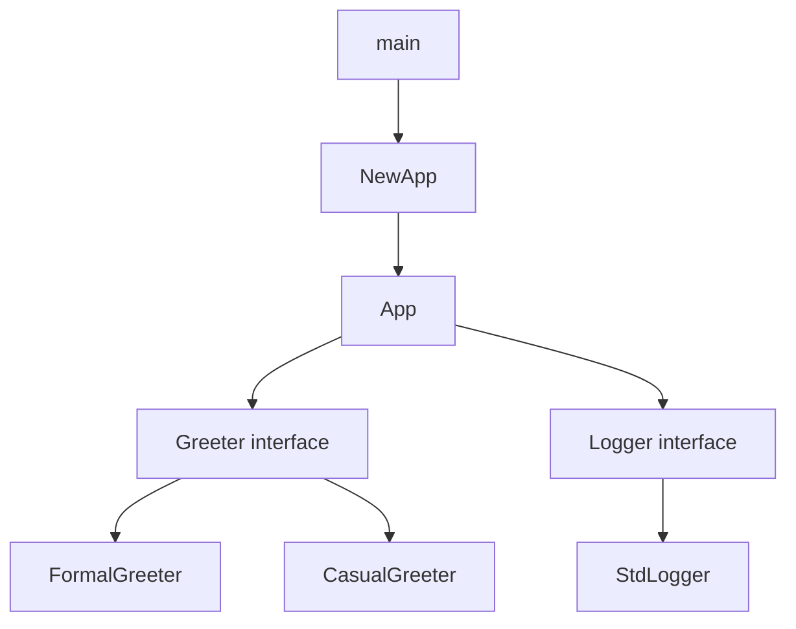

# Hello World in Go — Practical Tasks

## Table of Contents

1. [Junior Tasks](#junior-tasks)
2. [Middle Tasks](#middle-tasks)
3. [Senior Tasks](#senior-tasks)
4. [Questions](#questions)
5. [Mini Projects](#mini-projects)
6. [Challenge](#challenge)

---

## Junior Tasks

### Task 1: Personalized Greeting

**Type:** Code

**Goal:** Practice using `fmt.Printf` with format verbs and variables.

**Starter code:**

```go
package main

import "fmt"

// TODO: Create variables for your name and age,
// then print a greeting using fmt.Printf
func main() {
    // Your code here
}
```

**Expected output:**
```
Hello, my name is Alice and I am 25 years old.
Welcome to Go!
```

**Evaluation criteria:**
- [ ] Code compiles and runs with `go run main.go`
- [ ] Uses `fmt.Printf` with `%s` and `%d` format verbs
- [ ] Uses variables (not hardcoded strings in Printf)
- [ ] Output matches expected format

<details>
<summary>Solution</summary>

```go
package main

import "fmt"

func main() {
    name := "Alice"
    age := 25
    fmt.Printf("Hello, my name is %s and I am %d years old.\n", name, age)
    fmt.Println("Welcome to Go!")
}
```

</details>

---

### Task 2: Multi-Line ASCII Art

**Type:** Code

**Goal:** Practice using multiple `fmt.Println` calls and understand string literals.

**Starter code:**

```go
package main

import "fmt"

// TODO: Print the following ASCII art of a Go gopher
// Use fmt.Println for each line
func main() {
    // Your code here
}
```

**Expected output:**
```
  (\(\
  ( -.-)
  o_(")(")

  Hello, I am a Gopher!
```

**Evaluation criteria:**
- [ ] Code compiles and runs
- [ ] ASCII art displays correctly
- [ ] Uses `fmt.Println` (not `fmt.Print` for each character)

<details>
<summary>Solution</summary>

```go
package main

import "fmt"

func main() {
    fmt.Println(`  (\(\ `)
    fmt.Println("  ( -.-)")
    fmt.Println(`  o_(")(")`)
    fmt.Println()
    fmt.Println("  Hello, I am a Gopher!")
}
```

</details>

---

### Task 3: Format Verb Explorer

**Type:** Code

**Goal:** Understand different format verbs in `fmt.Printf`.

**Starter code:**

```go
package main

import "fmt"

// TODO: Given the variable below, print it using ALL of these format verbs:
// %v, %+v, %#v, %T, %d, %b, %o, %x
// Each on its own line with a label
func main() {
    number := 42
    _ = number // Remove this line and use 'number'
}
```

**Expected output:**
```
Default (%v):    42
Verbose (%+v):   42
Go syntax (%#v): 42
Type (%T):       int
Decimal (%d):    42
Binary (%b):     101010
Octal (%o):      52
Hex (%x):        2a
```

**Evaluation criteria:**
- [ ] All 8 format verbs are used correctly
- [ ] Output labels match the expected format
- [ ] Code compiles without warnings from `go vet`

<details>
<summary>Solution</summary>

```go
package main

import "fmt"

func main() {
    number := 42
    fmt.Printf("Default (%%v):    %v\n", number)
    fmt.Printf("Verbose (%%+v):   %+v\n", number)
    fmt.Printf("Go syntax (%%#v): %#v\n", number)
    fmt.Printf("Type (%%T):       %T\n", number)
    fmt.Printf("Decimal (%%d):    %d\n", number)
    fmt.Printf("Binary (%%b):     %b\n", number)
    fmt.Printf("Octal (%%o):      %o\n", number)
    fmt.Printf("Hex (%%x):        %x\n", number)
}
```

</details>

---

### Task 4: Build and Run

**Type:** Command-line

**Goal:** Practice the Go build toolchain.

**Instructions:**

1. Create a file `greet.go` with a Hello World program
2. Run it with `go run greet.go`
3. Build it into a binary called `greeter` using `go build`
4. Run the binary directly: `./greeter`
5. Check the binary size with `ls -lh greeter`
6. Build again with stripped debug info: `go build -ldflags="-s -w" -o greeter-small greet.go`
7. Compare sizes

**Expected result:**
```
$ go run greet.go
Hello, World!

$ go build -o greeter greet.go
$ ./greeter
Hello, World!

$ ls -lh greeter
-rwxr-xr-x  1 user  staff   1.8M  ...

$ go build -ldflags="-s -w" -o greeter-small greet.go
$ ls -lh greeter-small
-rwxr-xr-x  1 user  staff   1.2M  ...
```

**Evaluation criteria:**
- [ ] Both `go run` and `./greeter` produce the same output
- [ ] Can explain the difference between `go run` and `go build`
- [ ] Understands what `-ldflags="-s -w"` does (strips debug symbols)

---

## Middle Tasks

### Task 5: CLI Greeting Tool with Flags

**Type:** Code

**Goal:** Build a CLI tool using the `flag` package with proper error handling.

**Requirements:**
- [ ] Accept `-name` flag (string, required)
- [ ] Accept `-greeting` flag (string, default "Hello")
- [ ] Accept `-upper` flag (bool, default false) — converts output to uppercase
- [ ] Accept `-repeat` flag (int, default 1) — prints the greeting N times
- [ ] Print errors to `os.Stderr`
- [ ] Exit with code 1 on invalid input
- [ ] Exit with code 0 on success

**Starter code:**

```go
package main

import (
    "flag"
    "fmt"
    "os"
    "strings"
)

func run(args []string) error {
    fs := flag.NewFlagSet("greet", flag.ContinueOnError)
    // TODO: Define flags and implement logic
    _ = fs
    _ = fmt.Sprintf("")
    _ = strings.ToUpper("")
    return nil
}

func main() {
    if err := run(os.Args[1:]); err != nil {
        fmt.Fprintln(os.Stderr, "error:", err)
        os.Exit(1)
    }
}
```

**Example runs:**
```bash
$ go run main.go -name=Gopher
Hello, Gopher!

$ go run main.go -name=Gopher -greeting=Howdy -upper -repeat=3
HOWDY, GOPHER!
HOWDY, GOPHER!
HOWDY, GOPHER!

$ go run main.go
error: -name flag is required
```

<details>
<summary>Solution</summary>

```go
package main

import (
    "flag"
    "fmt"
    "os"
    "strings"
)

func run(args []string) error {
    fs := flag.NewFlagSet("greet", flag.ContinueOnError)
    name := fs.String("name", "", "name to greet (required)")
    greeting := fs.String("greeting", "Hello", "greeting word")
    upper := fs.Bool("upper", false, "output in uppercase")
    repeat := fs.Int("repeat", 1, "number of times to repeat")

    if err := fs.Parse(args); err != nil {
        return err
    }

    if *name == "" {
        return fmt.Errorf("-name flag is required")
    }

    if *repeat < 1 {
        return fmt.Errorf("-repeat must be >= 1, got %d", *repeat)
    }

    msg := fmt.Sprintf("%s, %s!", *greeting, *name)
    if *upper {
        msg = strings.ToUpper(msg)
    }

    for i := 0; i < *repeat; i++ {
        fmt.Println(msg)
    }
    return nil
}

func main() {
    if err := run(os.Args[1:]); err != nil {
        fmt.Fprintln(os.Stderr, "error:", err)
        os.Exit(1)
    }
}
```

</details>

---

### Task 6: Stdin Echo Tool

**Type:** Code

**Goal:** Read from stdin and format output, handling errors properly.

**Requirements:**
- [ ] Read lines from stdin until EOF
- [ ] Number each line
- [ ] Prefix each line with a timestamp
- [ ] Write output to stdout
- [ ] Handle read errors by writing to stderr

**Example run:**
```bash
$ echo -e "Hello\nWorld\nGo" | go run main.go
[2024-01-15 10:30:45] 1: Hello
[2024-01-15 10:30:45] 2: World
[2024-01-15 10:30:45] 3: Go
```

<details>
<summary>Solution</summary>

```go
package main

import (
    "bufio"
    "fmt"
    "os"
    "time"
)

func run() error {
    scanner := bufio.NewScanner(os.Stdin)
    lineNum := 0
    for scanner.Scan() {
        lineNum++
        timestamp := time.Now().Format("2006-01-02 15:04:05")
        fmt.Printf("[%s] %d: %s\n", timestamp, lineNum, scanner.Text())
    }
    if err := scanner.Err(); err != nil {
        return fmt.Errorf("reading stdin: %w", err)
    }
    return nil
}

func main() {
    if err := run(); err != nil {
        fmt.Fprintln(os.Stderr, "error:", err)
        os.Exit(1)
    }
}
```

</details>

---

### Task 7: Environment Variable Greeter

**Type:** Code

**Goal:** Build a program that loads configuration from multiple sources with precedence.

**Requirements:**
- [ ] Default greeting: "Hello, World!"
- [ ] `GREETING_NAME` env var overrides the name
- [ ] `GREETING_STYLE` env var (`formal`, `casual`) changes the format
- [ ] `-name` and `-style` flags override env vars
- [ ] Write tests for the `run()` function

**Precedence:** flags > env vars > defaults

<details>
<summary>Solution</summary>

```go
package main

import (
    "flag"
    "fmt"
    "os"
)

type Config struct {
    Name  string
    Style string
}

func loadConfig(args []string) (Config, error) {
    cfg := Config{
        Name:  "World",
        Style: "casual",
    }

    // Env vars override defaults
    if name := os.Getenv("GREETING_NAME"); name != "" {
        cfg.Name = name
    }
    if style := os.Getenv("GREETING_STYLE"); style != "" {
        cfg.Style = style
    }

    // Flags override env vars
    fs := flag.NewFlagSet("greet", flag.ContinueOnError)
    fs.StringVar(&cfg.Name, "name", cfg.Name, "name to greet")
    fs.StringVar(&cfg.Style, "style", cfg.Style, "greeting style: casual or formal")
    if err := fs.Parse(args); err != nil {
        return Config{}, err
    }

    if cfg.Style != "casual" && cfg.Style != "formal" {
        return Config{}, fmt.Errorf("invalid style %q: must be casual or formal", cfg.Style)
    }

    return cfg, nil
}

func greet(cfg Config) string {
    switch cfg.Style {
    case "formal":
        return fmt.Sprintf("Good day, %s. How do you do?", cfg.Name)
    default:
        return fmt.Sprintf("Hey %s, what's up!", cfg.Name)
    }
}

func run(args []string) error {
    cfg, err := loadConfig(args)
    if err != nil {
        return err
    }
    fmt.Println(greet(cfg))
    return nil
}

func main() {
    if err := run(os.Args[1:]); err != nil {
        fmt.Fprintln(os.Stderr, "error:", err)
        os.Exit(1)
    }
}
```

</details>

---

## Senior Tasks

### Task 8: Graceful Shutdown with Worker Pool

**Type:** Code

**Goal:** Build a program with a worker pool that shuts down gracefully on SIGTERM/SIGINT.

**Requirements:**
- [ ] Start N worker goroutines (configurable via `-workers` flag)
- [ ] Each worker prints "Worker X: Hello, World!" every second
- [ ] On SIGTERM/SIGINT, stop all workers gracefully (no force kill)
- [ ] Wait for all workers to finish with a 5-second timeout
- [ ] Print summary: how many tasks each worker completed
- [ ] Use `context.Context` for cancellation propagation
- [ ] No goroutine leaks (verify with `runtime.NumGoroutine()`)

**Evaluation criteria:**
- [ ] All goroutines exit cleanly
- [ ] Shutdown completes within timeout
- [ ] No race conditions (passes `go run -race`)

<details>
<summary>Solution</summary>

```go
package main

import (
    "context"
    "flag"
    "fmt"
    "os"
    "os/signal"
    "runtime"
    "sync"
    "sync/atomic"
    "syscall"
    "time"
)

type WorkerStats struct {
    ID        int
    Completed int64
}

func worker(ctx context.Context, id int, completed *int64) {
    for {
        select {
        case <-ctx.Done():
            return
        case <-time.After(1 * time.Second):
            atomic.AddInt64(completed, 1)
            fmt.Printf("Worker %d: Hello, World! (total: %d)\n", id, atomic.LoadInt64(completed))
        }
    }
}

func run(args []string) error {
    fs := flag.NewFlagSet("workers", flag.ContinueOnError)
    numWorkers := fs.Int("workers", 3, "number of workers")
    if err := fs.Parse(args); err != nil {
        return err
    }

    ctx, stop := signal.NotifyContext(context.Background(),
        syscall.SIGINT, syscall.SIGTERM)
    defer stop()

    var wg sync.WaitGroup
    stats := make([]WorkerStats, *numWorkers)

    for i := 0; i < *numWorkers; i++ {
        stats[i] = WorkerStats{ID: i + 1}
        wg.Add(1)
        go func(id int, completed *int64) {
            defer wg.Done()
            worker(ctx, id, completed)
        }(i+1, &stats[i].Completed)
    }

    fmt.Printf("Started %d workers. Press Ctrl+C to stop.\n", *numWorkers)
    <-ctx.Done()
    fmt.Println("\nShutdown signal received...")

    // Wait with timeout
    done := make(chan struct{})
    go func() {
        wg.Wait()
        close(done)
    }()

    select {
    case <-done:
        fmt.Println("All workers stopped cleanly.")
    case <-time.After(5 * time.Second):
        fmt.Println("Shutdown timeout exceeded!")
    }

    // Print stats
    fmt.Println("\n--- Worker Summary ---")
    for _, s := range stats {
        fmt.Printf("Worker %d: %d tasks completed\n", s.ID, atomic.LoadInt64(&s.Completed))
    }
    fmt.Printf("Goroutines remaining: %d\n", runtime.NumGoroutine())

    return nil
}

func main() {
    if err := run(os.Args[1:]); err != nil {
        fmt.Fprintln(os.Stderr, "error:", err)
        os.Exit(1)
    }
}
```

</details>

---

### Task 9: Dependency-Injected Application

**Type:** Code + Design

**Goal:** Design a Hello World application using dependency injection with interfaces.

**Requirements:**
- [ ] Define a `Greeter` interface with a `Greet(name string) string` method
- [ ] Implement `FormalGreeter` and `CasualGreeter`
- [ ] Define a `Logger` interface with `Info(msg string)` and `Error(msg string)` methods
- [ ] Wire everything in `main()` as a composition root
- [ ] Write table-driven tests for both greeters
- [ ] Use functional options for `App` configuration

**Architecture diagram:**



<details>
<summary>Solution</summary>

```go
package main

import (
    "fmt"
    "io"
    "os"
    "time"
)

// --- Interfaces ---

type Greeter interface {
    Greet(name string) string
}

type Logger interface {
    Info(msg string)
    Error(msg string)
}

// --- Greeter implementations ---

type FormalGreeter struct{}

func (g FormalGreeter) Greet(name string) string {
    return fmt.Sprintf("Good day, %s. It is a pleasure to meet you.", name)
}

type CasualGreeter struct{}

func (g CasualGreeter) Greet(name string) string {
    return fmt.Sprintf("Hey %s! What's up?", name)
}

// --- Logger implementation ---

type StdLogger struct {
    out io.Writer
    err io.Writer
}

func NewStdLogger(out, errOut io.Writer) *StdLogger {
    return &StdLogger{out: out, err: errOut}
}

func (l *StdLogger) Info(msg string) {
    fmt.Fprintf(l.out, "[INFO] %s\n", msg)
}

func (l *StdLogger) Error(msg string) {
    fmt.Fprintf(l.err, "[ERROR] %s\n", msg)
}

// --- App ---

type App struct {
    greeter Greeter
    logger  Logger
    timeout time.Duration
}

type Option func(*App)

func WithTimeout(d time.Duration) Option {
    return func(a *App) { a.timeout = d }
}

func NewApp(greeter Greeter, logger Logger, opts ...Option) *App {
    app := &App{
        greeter: greeter,
        logger:  logger,
        timeout: 30 * time.Second,
    }
    for _, opt := range opts {
        opt(app)
    }
    return app
}

func (a *App) Run(name string) {
    greeting := a.greeter.Greet(name)
    a.logger.Info(greeting)
}

// --- Composition Root ---

func main() {
    logger := NewStdLogger(os.Stdout, os.Stderr)
    greeter := CasualGreeter{}
    app := NewApp(greeter, logger, WithTimeout(10*time.Second))
    app.Run("Gopher")
}
```

</details>

---

### Task 10: Parallel Initializer

**Type:** Code

**Goal:** Build a program that initializes multiple "services" in parallel with error handling.

**Requirements:**
- [ ] Simulate 3 services: Database (500ms), Cache (300ms), API Client (200ms)
- [ ] Initialize all in parallel using `errgroup`
- [ ] If any service fails, cancel the others immediately
- [ ] Print total initialization time
- [ ] Add a `-fail` flag that makes one service fail (for testing)
- [ ] Benchmark sequential vs parallel initialization

<details>
<summary>Solution</summary>

```go
package main

import (
    "context"
    "flag"
    "fmt"
    "os"
    "time"

    "golang.org/x/sync/errgroup"
)

func initDB(ctx context.Context) error {
    select {
    case <-time.After(500 * time.Millisecond):
        fmt.Println("  Database: connected")
        return nil
    case <-ctx.Done():
        return ctx.Err()
    }
}

func initCache(ctx context.Context) error {
    select {
    case <-time.After(300 * time.Millisecond):
        fmt.Println("  Cache: warmed up")
        return nil
    case <-ctx.Done():
        return ctx.Err()
    }
}

func initAPI(ctx context.Context, shouldFail bool) error {
    select {
    case <-time.After(200 * time.Millisecond):
        if shouldFail {
            return fmt.Errorf("API client: connection refused")
        }
        fmt.Println("  API Client: ready")
        return nil
    case <-ctx.Done():
        return ctx.Err()
    }
}

func run(args []string) error {
    fs := flag.NewFlagSet("init", flag.ContinueOnError)
    fail := fs.Bool("fail", false, "simulate API failure")
    if err := fs.Parse(args); err != nil {
        return err
    }

    fmt.Println("Initializing services...")
    start := time.Now()

    ctx, cancel := context.WithTimeout(context.Background(), 5*time.Second)
    defer cancel()

    g, gctx := errgroup.WithContext(ctx)

    g.Go(func() error { return initDB(gctx) })
    g.Go(func() error { return initCache(gctx) })
    g.Go(func() error { return initAPI(gctx, *fail) })

    if err := g.Wait(); err != nil {
        return fmt.Errorf("initialization failed after %v: %w", time.Since(start), err)
    }

    fmt.Printf("All services ready in %v\n", time.Since(start))
    fmt.Println("Hello, World! Application is running.")
    return nil
}

func main() {
    if err := run(os.Args[1:]); err != nil {
        fmt.Fprintln(os.Stderr, "error:", err)
        os.Exit(1)
    }
}
```

</details>

---

## Questions

### 1. What is the difference between `fmt.Println` and `log.Println`?

**Answer:**
`fmt.Println` writes plain text to `os.Stdout`. `log.Println` writes to `os.Stderr` by default and adds a timestamp prefix:
```
fmt.Println("hello")     // Output: hello
log.Println("hello")     // Output: 2024/01/15 10:30:45 hello
```
Use `fmt` for program output, `log` for diagnostics.

### 2. Why does Go not allow unused imports?

**Answer:**
Go's designers chose to enforce clean dependencies. Unused imports slow down compilation (the imported package must still be compiled and linked) and indicate dead code. This is a trade-off: slight inconvenience during development for cleaner, faster production code.

### 3. Can you call `fmt.Println` from an `init()` function?

**Answer:**
Yes. `init()` runs after all package-level variables are initialized, and `fmt` is available at that point. However, using `init()` for I/O is generally discouraged because it makes the startup sequence harder to test and reason about.

### 4. What does `go vet` check for in Hello World code?

**Answer:**
`go vet` checks for common mistakes including:
- Incorrect `Printf` format verbs (`%d` with a string)
- Extra or missing arguments in format calls
- Unreachable code after `return`/`os.Exit`
- Suspicious use of `sync` primitives

### 5. What is the zero value of a string in Go?

**Answer:**
The zero value is an empty string `""`. `fmt.Println("")` prints an empty line (just a newline). This is different from `nil` — Go strings cannot be nil.

### 6. How do you print without a newline in Go?

**Answer:**
Use `fmt.Print` (no newline) or `fmt.Printf` without `\n`:
```go
fmt.Print("Hello, ")     // No newline
fmt.Print("World!")      // No newline
fmt.Println()            // Just a newline
```

### 7. What is the output of `fmt.Println(1, 2, 3)`?

**Answer:**
```
1 2 3
```
`Println` separates arguments with spaces and adds a newline. It is not the same as `Printf` — no format string is needed.

---

## Mini Projects

### Project 1: Fortune Cookie CLI

**Requirements:**
- [ ] Store 10+ fortune messages in a slice
- [ ] Print a random fortune when run with no arguments
- [ ] `-all` flag prints all fortunes numbered
- [ ] `-add "message"` flag adds a new fortune (for the current session only)
- [ ] `-format json` flag outputs fortune as JSON
- [ ] Errors go to stderr, fortune goes to stdout
- [ ] Tests with >80% coverage
- [ ] README with `go run` / `go test` instructions

**Difficulty:** Middle
**Estimated time:** 2-3 hours

**Starter structure:**
```
fortune/
├── main.go
├── fortune.go       <- Fortune logic
├── fortune_test.go  <- Tests
└── README.md
```

<details>
<summary>Solution skeleton</summary>

```go
// fortune.go
package main

import (
    "encoding/json"
    "fmt"
    "io"
    "math/rand"
)

type Fortune struct {
    messages []string
}

func NewFortune() *Fortune {
    return &Fortune{
        messages: []string{
            "The best time to plant a tree was 20 years ago. The second best time is now.",
            "Go is not just a language, it is a philosophy.",
            "Simplicity is the ultimate sophistication.",
            // ... more fortunes
        },
    }
}

func (f *Fortune) Random() string {
    return f.messages[rand.Intn(len(f.messages))]
}

func (f *Fortune) All(w io.Writer) {
    for i, msg := range f.messages {
        fmt.Fprintf(w, "%d. %s\n", i+1, msg)
    }
}

func (f *Fortune) Add(msg string) {
    f.messages = append(f.messages, msg)
}

func (f *Fortune) AsJSON(msg string) (string, error) {
    data, err := json.Marshal(map[string]string{"fortune": msg})
    if err != nil {
        return "", err
    }
    return string(data), nil
}
```

</details>

---

## Challenge

### Build a `go-echo` CLI Tool

Build a production-quality `echo` replacement in Go that mimics the Unix `echo` command with additional features.

**Requirements:**
- Accept any number of positional arguments and print them separated by spaces
- `-n` flag: do not print trailing newline
- `-e` flag: enable interpretation of escape sequences (`\n`, `\t`, `\\`)
- `-upper` flag: convert output to uppercase
- `-sep` flag: custom separator (default: space)
- `-color red|green|blue` flag: ANSI color output (terminal only)
- Read from stdin if no arguments provided (pipe support)

**Constraints:**
- Must run in under 5ms for simple cases
- Memory usage under 10 MB
- No external libraries (stdlib only)
- Must pass `go vet` and `go run -race` without issues

**Scoring:**
- Correctness: 50% — all flags work as specified
- Performance (benchmarks): 20% — simple cases under 5ms
- Code quality (`go vet`, readability, tests): 20%
- Edge cases (empty input, very long input, binary data): 10%

**Example runs:**
```bash
$ go-echo Hello World
Hello World

$ go-echo -n Hello World
Hello World$  # No newline

$ go-echo -e "Hello\tWorld\nGo"
Hello	World
Go

$ go-echo -upper -sep=", " Hello World Go
HELLO, WORLD, GO

$ echo "piped input" | go-echo
piped input
```
