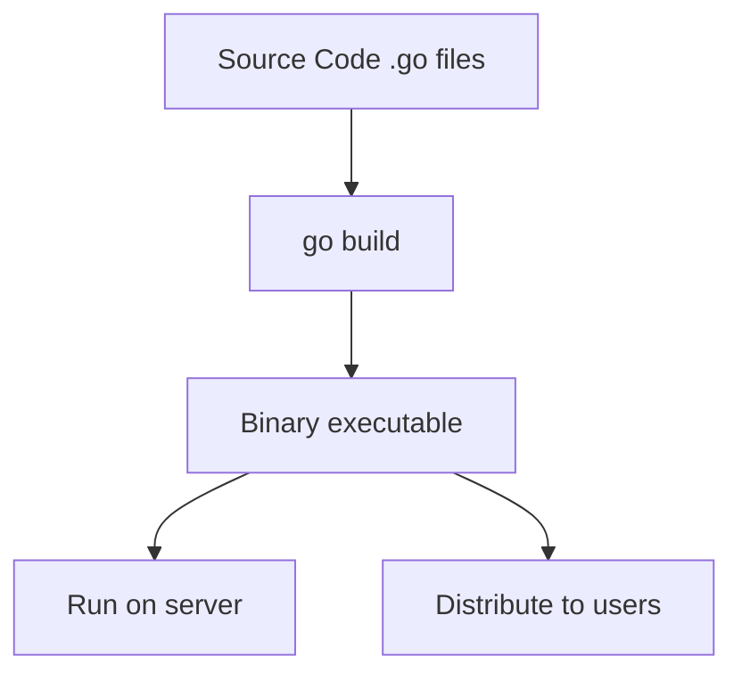
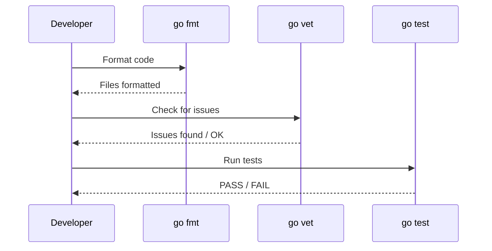
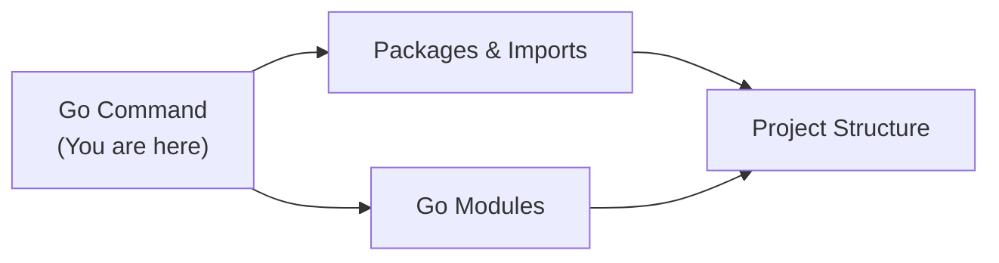
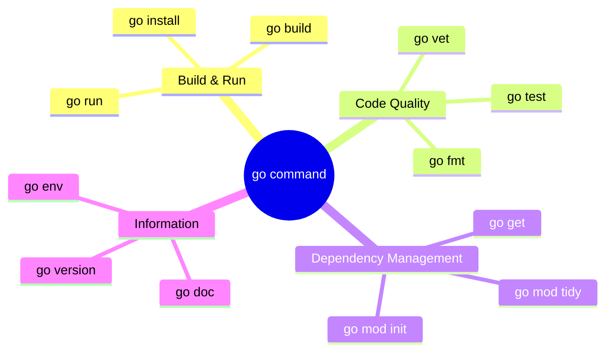
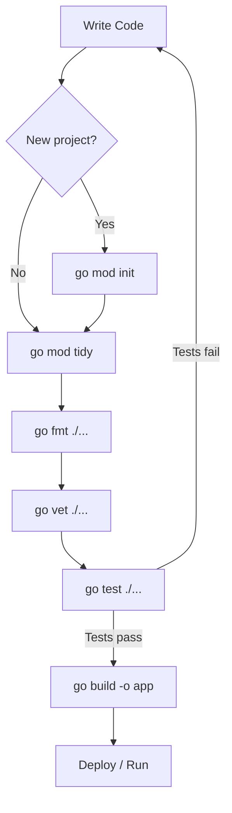

# Go Command — Junior Level

## Table of Contents

1. [Introduction](#introduction)
2. [Prerequisites](#prerequisites)
3. [Glossary](#glossary)
4. [Core Concepts](#core-concepts)
5. [Pros & Cons](#pros--cons)
6. [Use Cases](#use-cases)
7. [Code Examples](#code-examples)
8. [Coding Patterns](#coding-patterns)
9. [Clean Code](#clean-code)
10. [Product Use / Feature](#product-use--feature)
11. [Error Handling](#error-handling)
12. [Security Considerations](#security-considerations)
13. [Performance Tips](#performance-tips)
14. [Metrics & Analytics](#metrics--analytics)
15. [Best Practices](#best-practices)
16. [Edge Cases & Pitfalls](#edge-cases--pitfalls)
17. [Common Mistakes](#common-mistakes)
18. [Tricky Points](#tricky-points)
19. [Test](#test)
20. [Tricky Questions](#tricky-questions)
21. [Cheat Sheet](#cheat-sheet)
22. [Summary](#summary)
23. [What You Can Build](#what-you-can-build)
24. [Further Reading](#further-reading)
25. [Related Topics](#related-topics)
26. [Diagrams & Visual Aids](#diagrams--visual-aids)

---

## Introduction

> Focus: "What is it?" and "How to use it?"

The `go` command is the primary tool for managing Go source code. It is a single binary that bundles compiling, testing, formatting, dependency management, and much more. Unlike many other languages that require a separate build tool (Maven, Gradle, npm), Go ships everything you need in one CLI.

Every Go developer interacts with the `go` command dozens of times per day, so understanding its sub-commands is essential from day one.

---

## Prerequisites

- **Required:** Go installed on your system (`go1.21+`) — all commands depend on a working Go installation
- **Required:** Basic terminal / command-line skills — you will run all commands in a terminal
- **Helpful but not required:** Understanding of what a compiler does (turns source code into an executable)

---

## Glossary

| Term | Definition |
|------|-----------|
| **Module** | A collection of Go packages with a `go.mod` file at its root |
| **Package** | A directory of `.go` files that compile together |
| **Binary** | The executable file produced by `go build` |
| **Dependency** | An external module your code imports |
| **go.mod** | The file that declares the module path and its dependency requirements |
| **go.sum** | The file that stores cryptographic checksums of dependencies |
| **GOPATH** | The workspace directory for Go code (less important since Go modules) |
| **GOROOT** | The directory where Go itself is installed |

---

## Core Concepts

### Concept 1: `go run` — Run a program

`go run` compiles and immediately executes one or more `.go` files. It does not produce a permanent binary — the compiled output is placed in a temporary directory and deleted after execution.

```bash
go run main.go
go run .              # run the package in the current directory
go run ./cmd/server   # run a specific package
```

### Concept 2: `go build` — Compile a binary

`go build` compiles your code into an executable binary. By default the binary is named after the directory (or the `-o` flag overrides this).

```bash
go build              # produces binary named after directory
go build -o myapp     # produces binary named "myapp"
go build ./...        # compile all packages (check for errors)
```

### Concept 3: `go fmt` — Format code

`go fmt` rewrites your `.go` files to follow the standard Go formatting style. There is no configuration — every Go project looks the same.

```bash
go fmt ./...          # format all files in all packages
```

### Concept 4: `go vet` — Find suspicious code

`go vet` runs static analysis to find common mistakes that compile fine but are probably bugs.

```bash
go vet ./...          # vet all packages
```

### Concept 5: `go test` — Run tests

`go test` compiles and runs test functions (functions named `TestXxx` in `*_test.go` files).

```bash
go test ./...         # test all packages
go test -v ./...      # verbose output
go test -run TestFoo  # run only tests matching "TestFoo"
```

### Concept 6: `go mod init` — Initialize a module

Creates a new `go.mod` file in the current directory, declaring a new module.

```bash
go mod init github.com/user/project
```

### Concept 7: `go mod tidy` — Clean up dependencies

Adds missing dependencies and removes unused ones from `go.mod` and `go.sum`.

```bash
go mod tidy
```

### Concept 8: `go get` — Add or update dependencies

Downloads and installs packages and their dependencies, updating `go.mod`.

```bash
go get github.com/gin-gonic/gin           # add latest version
go get github.com/gin-gonic/gin@v1.9.1    # add specific version
go get -u ./...                            # update all dependencies
```

### Concept 9: `go install` — Install a binary

Compiles and installs a binary to `$GOPATH/bin` (or `$GOBIN`).

```bash
go install golang.org/x/tools/gopls@latest
```

### Concept 10: `go doc` — View documentation

Shows documentation for a package, function, type, or method.

```bash
go doc fmt              # package-level doc
go doc fmt.Println      # function doc
go doc -all fmt         # everything in the package
```

### Concept 11: `go version` and `go env`

```bash
go version              # prints Go version: go version go1.22.0 linux/amd64
go env                  # prints all Go environment variables
go env GOPATH           # print a specific variable
```

---

## Real-World Analogies

| Concept | Analogy |
|---------|--------|
| **`go run`** | Like pressing "Play" in an IDE — it compiles and runs in one step, but does not save the compiled result |
| **`go build`** | Like baking a cake and keeping it — you get a finished product (binary) you can share |
| **`go fmt`** | Like a spell-checker for code style — it automatically fixes formatting so everyone writes code the same way |
| **`go mod tidy`** | Like cleaning out your fridge — removes expired items (unused deps) and adds missing ingredients (needed deps) |

---

## Mental Models

**The intuition:** Think of the `go` command as a Swiss Army knife. Each sub-command (`run`, `build`, `test`, `fmt`, `vet`, etc.) is a different blade. You carry one tool, but it handles everything.

**Why this model helps:** It prevents beginners from looking for separate tools for each task. There is no separate formatter binary, no separate test runner, no separate package manager — the `go` command does it all.

---

## Pros & Cons

| Pros | Cons |
|------|------|
| All-in-one tool — no need for Makefiles or build tools | Limited customization — cannot change formatting rules |
| Fast compilation — Go compiles faster than most languages | `go get` behavior changed between Go versions (confusing history) |
| Built-in testing and benchmarking | No built-in task runner (like `npm run dev`) |
| Cross-compilation out of the box | Error messages can be cryptic for beginners |
| Standardized formatting with `go fmt` | No built-in watch mode (need third-party tools) |

### When to use:
- Always — the `go` command is how you work with Go code

### When NOT to use:
- When you need a complex multi-language build system — use Make, Bazel, or similar alongside the `go` command

---

## Use Cases

- **Use Case 1:** Quickly running a script — `go run main.go` lets you test ideas without a compile step
- **Use Case 2:** Building a production binary — `go build -o server` produces a deployable executable
- **Use Case 3:** Managing dependencies — `go mod init`, `go get`, `go mod tidy` handle your module's imports

---

## Code Examples

### Example 1: Hello World with `go run`

```go
// Save as main.go
package main

import "fmt"

func main() {
    fmt.Println("Hello, World!")
}
```

**What it does:** Prints "Hello, World!" to the terminal.
**How to run:** `go run main.go`

### Example 2: Building and running a binary

```go
// Save as main.go
package main

import (
    "fmt"
    "os"
)

func main() {
    name := "Go Developer"
    if len(os.Args) > 1 {
        name = os.Args[1]
    }
    fmt.Printf("Hello, %s!\n", name)
}
```

**What it does:** Greets the user by name (defaults to "Go Developer").
**How to run:**
```bash
go build -o greeter main.go
./greeter Alice
# Output: Hello, Alice!
```

### Example 3: Writing and running a test

```go
// Save as math.go
package main

func Add(a, b int) int {
    return a + b
}

func main() {}
```

```go
// Save as math_test.go
package main

import "testing"

func TestAdd(t *testing.T) {
    result := Add(2, 3)
    if result != 5 {
        t.Errorf("Add(2, 3) = %d; want 5", result)
    }
}
```

**How to run:** `go test -v`
**Output:**
```
=== RUN   TestAdd
--- PASS: TestAdd (0.00s)
PASS
ok      example 0.001s
```

### Example 4: Initializing a module and adding a dependency

```bash
# Create a new project
mkdir myproject && cd myproject
go mod init github.com/user/myproject

# Create main.go
cat > main.go << 'EOF'
package main

import (
    "fmt"
    "github.com/fatih/color"
)

func main() {
    color.Green("Hello in green!")
    fmt.Println("Regular text")
}
EOF

# Download the dependency
go mod tidy

# Run the program
go run main.go
```

---

## Coding Patterns

### Pattern 1: Build-then-run workflow

**Intent:** Separate compilation from execution for repeatable deployments.
**When to use:** When deploying to production or distributing binaries.

```bash
# Step 1: Build
go build -o server ./cmd/server

# Step 2: Run
./server --port=8080
```

**Diagram:**



**Remember:** Use `go run` for development, `go build` for production.

---

### Pattern 2: Test-format-vet cycle

**Intent:** Catch bugs and style issues before committing code.
**When to use:** Before every `git commit`.

```bash
# Format all code
go fmt ./...

# Run static analysis
go vet ./...

# Run all tests
go test ./...
```

**Diagram:**



---

## Clean Code

### Naming

```go
// Bad naming
func r(p string) {}
var m = make(map[string]string)

// Clean naming
func readConfig(path string) {}
var userCache = make(map[string]string)
```

**Rules:**
- Variables: describe WHAT they hold (`userCount`, not `n`, `x`, `tmp`)
- Functions: describe WHAT they do (`buildBinary`, not `do`, `run`)
- Booleans: use `is`, `has`, `can` prefix (`isValid`, `hasTests`)

---

### Functions

```go
// Too long, does too many things
func deploy(code string) error {
    // 60+ lines: build, test, push, notify...
    return nil
}

// Single responsibility
func buildBinary(src string) (string, error)  { return "", nil }
func runTests(dir string) error               { return nil }
func pushToRegistry(bin string) error         { return nil }
```

**Rule:** If you need to scroll to see a function — it does too much. Aim for 20 lines or fewer.

---

### Comments

```go
// Noise comment (states the obvious)
// build the binary
go build -o server

// Explains WHY, not WHAT
// Use -trimpath to remove local file paths from the binary (for security)
go build -trimpath -o server
```

**Rule:** Good code explains itself. Comments explain **why**, not **what**.

---

## Product Use / Feature

### 1. Docker Multi-Stage Builds

- **How it uses Go commands:** `go build` compiles a static binary inside a Docker builder stage, then the binary is copied to a minimal `scratch` or `alpine` image.
- **Why it matters:** Produces tiny container images (5-15 MB instead of 300+ MB).

### 2. CI/CD Pipelines (GitHub Actions, GitLab CI)

- **How it uses Go commands:** `go test ./...`, `go vet ./...`, and `go build` are the standard CI steps.
- **Why it matters:** Automated quality checks catch bugs before they reach production.

### 3. VS Code / GoLand IDE Integration

- **How it uses Go commands:** IDEs run `go fmt`, `go vet`, `go test`, and `go doc` automatically in the background.
- **Why it matters:** Developers get instant feedback as they type.

---

## Error Handling

### Error 1: `go: cannot find main module`

```bash
$ go build
go: cannot find main module; see 'go help modules'
```

**Why it happens:** You are in a directory without a `go.mod` file.
**How to fix:**

```bash
go mod init github.com/user/myproject
```

### Error 2: `package xxx is not in std`

```bash
$ go run main.go
main.go:5:2: package github.com/foo/bar is not in std
```

**Why it happens:** The dependency has not been downloaded.
**How to fix:**

```bash
go mod tidy
# or explicitly:
go get github.com/foo/bar
```

### Error 3: `cannot find package` after renaming

```bash
$ go build
cannot find package "myproject/utils" in any of: ...
```

**Why it happens:** The import path does not match the module path in `go.mod`.
**How to fix:**

```go
// Make sure go.mod says:
module github.com/user/myproject

// Then import as:
import "github.com/user/myproject/utils"
```

### Error Handling Pattern

```bash
# Always check if the command succeeded
go build -o server ./cmd/server
if [ $? -ne 0 ]; then
    echo "Build failed!"
    exit 1
fi
```

---

## Security Considerations

### 1. Dependency supply-chain attacks

```bash
# Insecure — blindly adding dependencies
go get github.com/random-user/unverified-lib

# Secure — verify checksums and use the Go checksum database
go get github.com/well-known/trusted-lib
go mod verify    # verify downloaded modules match go.sum
```

**Risk:** Malicious code hidden in dependencies can steal data or install backdoors.
**Mitigation:** Use `go mod verify`, review `go.sum` changes, and enable `GONOSUMCHECK` only for private modules.

### 2. Embedding sensitive data in binaries

```bash
# Insecure — hardcoded secrets compiled into binary
go build -ldflags="-X main.apiKey=secret123" -o server

# Secure — read secrets from environment at runtime
```

**Risk:** Anyone who decompiles the binary can extract secrets.
**Mitigation:** Never embed secrets via `-ldflags`. Use environment variables or a secrets manager.

---

## Performance Tips

### Tip 1: Use `go build ./...` to check compilation without producing binaries

```bash
# Slow approach — build each package separately
go build ./pkg/auth
go build ./pkg/db

# Faster approach — build all at once
go build ./...
```

**Why it's faster:** Go only compiles each package once and caches the results.

### Tip 2: The build cache

Go automatically caches compiled packages. To see cache statistics:

```bash
go env GOCACHE      # shows cache directory
go clean -cache     # clear the cache (rarely needed)
```

**Why it matters:** Second builds are near-instant because unchanged packages use the cache.

---

## Metrics & Analytics

### What to Measure

| Metric | Why it matters | Tool |
|--------|---------------|------|
| **Build time** | Slow builds reduce productivity | `time go build ./...` |
| **Test execution time** | Slow tests discourage running them | `go test -v ./... 2>&1 \| tail` |
| **Binary size** | Affects deployment speed and container image size | `ls -lh ./server` |

### Basic Instrumentation

```bash
# Measure build time
time go build -o server ./cmd/server

# Measure test time
go test -v -count=1 ./... 2>&1 | grep -E "ok|FAIL"
```

---

## Best Practices

- **Always run `go fmt ./...` before committing** — keeps code style consistent
- **Always run `go vet ./...` in CI** — catches bugs that compile fine but are wrong
- **Use `go mod tidy` regularly** — keeps `go.mod` clean and accurate
- **Use `go test -race ./...` in CI** — detects data races that cause intermittent bugs
- **Never commit `vendor/` unless required** — `go mod download` reproduces it

---

## Edge Cases & Pitfalls

### Pitfall 1: `go run` with multiple files

```bash
# This fails if main() uses functions from other files
go run main.go
# Error: undefined: helperFunction

# Fix: include all files
go run main.go helpers.go
# Better: run the whole package
go run .
```

**What happens:** `go run main.go` only compiles `main.go`, not other files in the package.
**How to fix:** Use `go run .` to compile the entire package.

### Pitfall 2: `go get` inside vs outside a module

```bash
# Inside a module directory (has go.mod) — adds dependency to go.mod
go get github.com/pkg/errors

# Outside a module directory — installs binary (Go 1.17+, use go install instead)
go install github.com/golangci/golangci-lint/cmd/golangci-lint@latest
```

---

## Common Mistakes

### Mistake 1: Forgetting `go mod tidy` after adding imports

```go
// You add a new import:
import "github.com/sirupsen/logrus"

// But forget to run:
// go mod tidy
// Result: build fails with "missing go.sum entry"
```

### Mistake 2: Using `go get` to install tools (deprecated since Go 1.17)

```bash
# Wrong way (deprecated)
go get golang.org/x/tools/gopls

# Correct way
go install golang.org/x/tools/gopls@latest
```

### Mistake 3: Running `go test` without `./...`

```bash
# Only tests the current directory
go test

# Tests ALL packages recursively
go test ./...
```

---

## Common Misconceptions

### Misconception 1: "`go run` is the same as `go build` + running the binary"

**Reality:** `go run` creates a temporary binary in a temp directory and deletes it afterward. It is NOT the same as `go build -o app && ./app` because the binary path and caching behavior differ.

**Why people think this:** The output looks the same, so it seems identical.

### Misconception 2: "`go fmt` is optional"

**Reality:** While `go fmt` does not affect compilation, it is considered mandatory in the Go community. Most CI pipelines reject code that is not properly formatted.

**Why people think this:** Other languages treat formatting as a preference, but Go enforces a single standard.

---

## Tricky Points

### Tricky Point 1: `go build` produces no output for library packages

```bash
cd mylib/   # a package without func main()
go build    # no binary produced, no error
```

**Why it's tricky:** Beginners expect a binary to appear. `go build` on a non-main package only checks for compilation errors.
**Key takeaway:** Only `package main` with `func main()` produces an executable.

### Tricky Point 2: `go test` caches results

```bash
go test ./...          # runs tests
go test ./...          # uses cached results (prints "ok (cached)")
go test -count=1 ./... # forces re-run
```

**Why it's tricky:** You might think tests ran again, but they used cached results.
**Key takeaway:** Use `-count=1` to force fresh test execution.

---

## Test

### Multiple Choice

**1. What does `go run main.go` do?**

- A) Compiles main.go and saves the binary in the current directory
- B) Compiles main.go into a temporary binary and executes it
- C) Interprets main.go line by line (like Python)
- D) Downloads dependencies and then runs main.go

<details>
<summary>Answer</summary>
**B)** — `go run` compiles to a temporary directory and executes the result. It does NOT save a binary in the current directory (that's `go build`), and Go is NOT an interpreted language.
</details>

### True or False

**2. `go fmt` can be configured to use tabs instead of spaces (or vice versa).**

<details>
<summary>Answer</summary>
**False** — `go fmt` has no configuration options. It always uses tabs for indentation. This is intentional — it eliminates style debates.
</details>

### What's the Output?

**3. What happens when you run this?**

```bash
mkdir newproject && cd newproject
echo 'package main; import "fmt"; func main() { fmt.Println("hi") }' > main.go
go build
```

<details>
<summary>Answer</summary>
Output: `go: cannot find main module` (or similar error about missing go.mod). You must run `go mod init` first to create a module.
</details>

**4. What does this command produce?**

```bash
go build -o "" ./...
```

<details>
<summary>Answer</summary>
It compiles all packages but discards the output (no binary is written). This is useful for checking that code compiles without errors.
</details>

**5. Which command adds missing dependencies AND removes unused ones?**

- A) `go get ./...`
- B) `go mod download`
- C) `go mod tidy`
- D) `go mod verify`

<details>
<summary>Answer</summary>
**C)** — `go mod tidy` both adds missing and removes unused dependencies. `go get` only adds, `go mod download` only downloads, and `go mod verify` only checks checksums.
</details>

---

## "What If?" Scenarios

**What if you delete `go.sum` and run `go build`?**
- **You might think:** The build will fail because checksums are missing.
- **But actually:** Go will re-download modules and regenerate `go.sum`. The build succeeds, but you should commit the new `go.sum`.

**What if you run `go fmt` on a file with syntax errors?**
- **You might think:** `go fmt` will format it anyway.
- **But actually:** `go fmt` will print the syntax error and leave the file unchanged. It only formats valid Go code.

---

## Tricky Questions

**1. What is the difference between `go build` and `go install`?**

- A) They are identical
- B) `go build` produces a binary in the current directory; `go install` puts it in `$GOPATH/bin`
- C) `go install` also downloads dependencies; `go build` does not
- D) `go build` only works for `package main`

<details>
<summary>Answer</summary>
**B)** — `go build` places the binary in the current directory (or a specified path with `-o`), while `go install` places it in `$GOPATH/bin` (or `$GOBIN`). Both compile; the difference is where the output goes.
</details>

**2. You run `go test ./...` twice in a row. The second run finishes instantly. Why?**

- A) Go is very fast at compiling
- B) Go caches test results and skips re-running unchanged tests
- C) The tests are empty
- D) The test binary is cached from the first run

<details>
<summary>Answer</summary>
**B)** — Go caches test results based on the test binary, inputs, and environment. If nothing changed, it prints `(cached)` instead of re-running tests.
</details>

---

## Cheat Sheet

| What | Syntax / Command | Example |
|------|-----------------|---------|
| Run a program | `go run <files>` | `go run .` |
| Build a binary | `go build -o <name>` | `go build -o server` |
| Format code | `go fmt <packages>` | `go fmt ./...` |
| Static analysis | `go vet <packages>` | `go vet ./...` |
| Run tests | `go test <packages>` | `go test -v ./...` |
| Init a module | `go mod init <path>` | `go mod init github.com/user/app` |
| Add dependency | `go get <module>` | `go get github.com/gin-gonic/gin` |
| Clean deps | `go mod tidy` | `go mod tidy` |
| Install tool | `go install <module>@<ver>` | `go install golang.org/x/tools/gopls@latest` |
| View docs | `go doc <symbol>` | `go doc fmt.Println` |
| Check Go version | `go version` | `go version` |
| Show env vars | `go env <var>` | `go env GOPATH` |

---

## Self-Assessment Checklist

### I can explain:
- [ ] What the `go` command is and why it is an all-in-one tool
- [ ] The difference between `go run`, `go build`, and `go install`
- [ ] What `go.mod` and `go.sum` are for

### I can do:
- [ ] Initialize a new Go module from scratch
- [ ] Add and remove dependencies using `go get` and `go mod tidy`
- [ ] Run tests, format code, and vet code with one command each
- [ ] Build a production binary with `go build -o`

### I can answer:
- [ ] All multiple choice questions in this document

---

## Summary

- The `go` command is Go's all-in-one tool for building, testing, formatting, and managing dependencies
- `go run` = compile + execute (temporary). `go build` = compile + save binary. `go install` = compile + save to `$GOPATH/bin`
- `go fmt`, `go vet`, and `go test` are the quality trifecta — run them before every commit
- `go mod init`, `go mod tidy`, and `go get` manage your module's dependencies

**Next step:** Learn about Go packages and imports — how to organize code across multiple files and directories.

---

## What You Can Build

### Projects you can create:
- **CLI calculator:** Practice `go build` and `go run` with a command-line tool
- **Unit-tested string library:** Practice `go test` with table-driven tests
- **Multi-file web server:** Practice module initialization and dependency management with `go get`

### Learning path — what to study next:



---

## Further Reading

- **Official docs:** [Command go](https://pkg.go.dev/cmd/go) — comprehensive reference for all sub-commands
- **Blog post:** [Using Go Modules](https://go.dev/blog/using-go-modules) — official guide to module workflow
- **Video:** [The Go Command — GopherCon](https://www.youtube.com/results?search_query=gophercon+go+command) — deep dive into the go tool

---

## Related Topics

- **[Packages & Imports](../06-packages/)** — how Go organizes code that the `go` command compiles
- **[Go Modules](../07-modules/)** — deep dive into `go.mod`, versioning, and dependency management

---

## Diagrams & Visual Aids

### Mind Map



### Go Command Workflow



### Build Pipeline — ASCII

```
+----------------+     +----------------+     +----------------+
|  Source Code   |     |  go build      |     |  Binary        |
|  (.go files)   | --> |  (compiler)    | --> |  (executable)  |
+----------------+     +----------------+     +----------------+
       |                                              |
       v                                              v
+----------------+                           +----------------+
|  go.mod        |                           |  Deploy to     |
|  go.sum        |                           |  server/Docker |
+----------------+                           +----------------+
```
