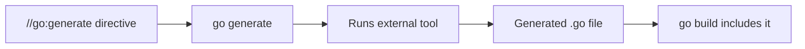
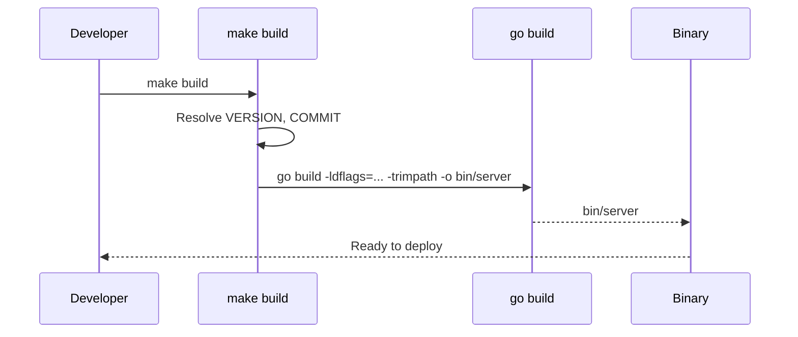
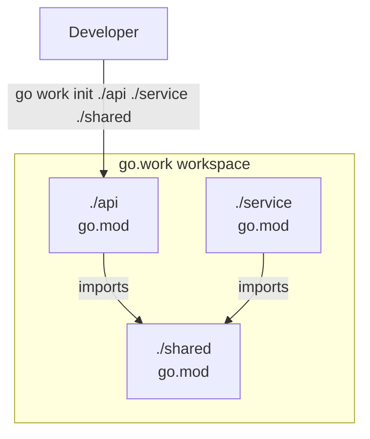
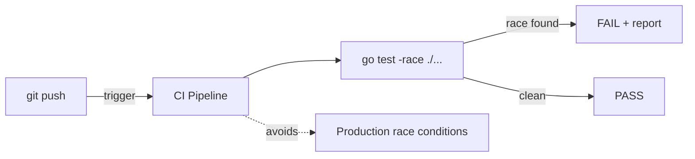
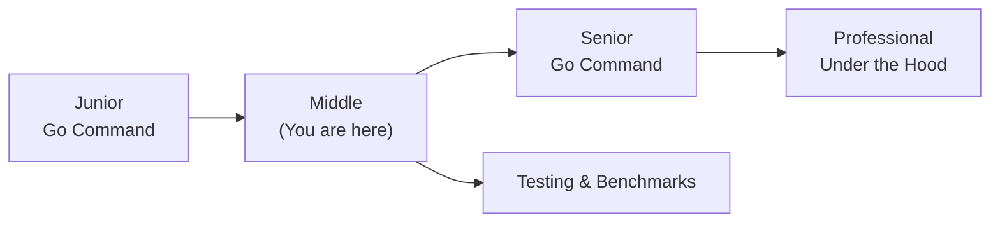
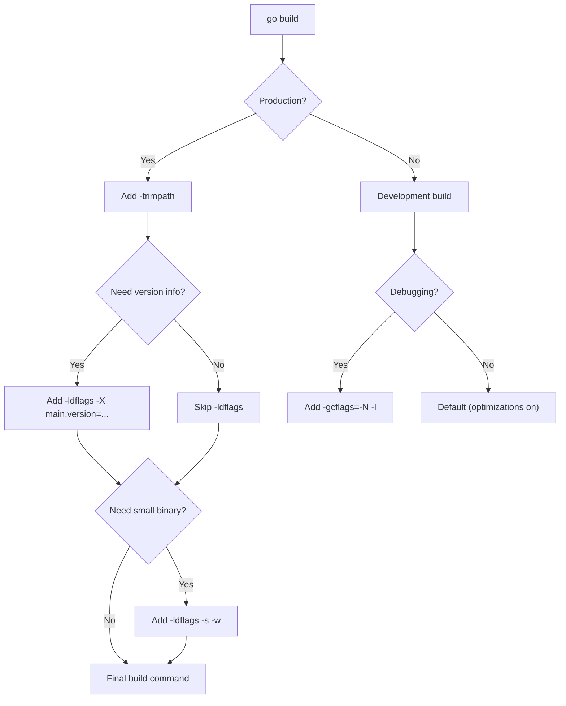
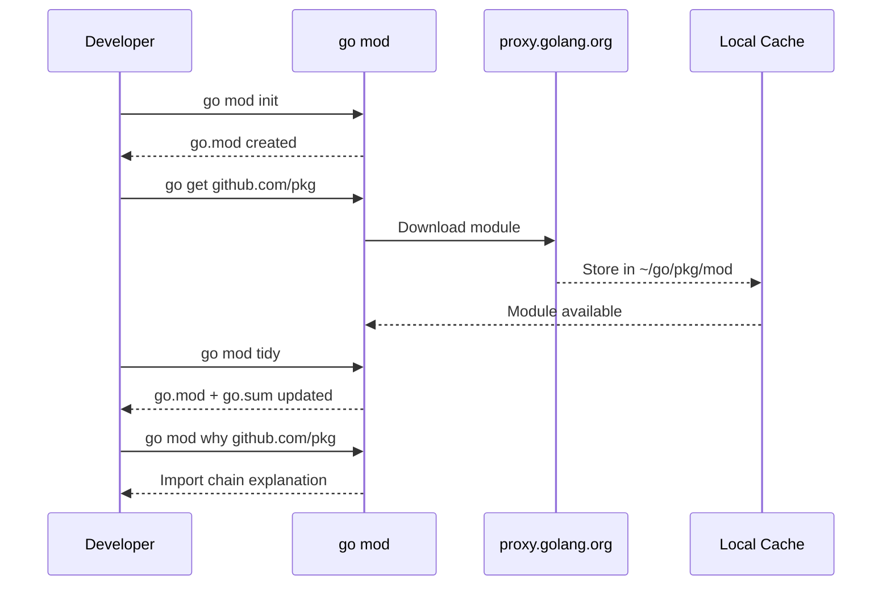

# Go Command — Middle Level

## Table of Contents

1. [Introduction](#introduction)
2. [Core Concepts](#core-concepts)
3. [Pros & Cons](#pros--cons)
4. [Use Cases](#use-cases)
5. [Code Examples](#code-examples)
6. [Coding Patterns](#coding-patterns)
7. [Clean Code](#clean-code)
8. [Product Use / Feature](#product-use--feature)
9. [Error Handling](#error-handling)
10. [Security Considerations](#security-considerations)
11. [Performance Optimization](#performance-optimization)
12. [Metrics & Analytics](#metrics--analytics)
13. [Debugging Guide](#debugging-guide)
14. [Best Practices](#best-practices)
15. [Edge Cases & Pitfalls](#edge-cases--pitfalls)
16. [Common Mistakes](#common-mistakes)
17. [Tricky Points](#tricky-points)
18. [Comparison with Other Languages](#comparison-with-other-languages)
19. [Test](#test)
20. [Tricky Questions](#tricky-questions)
21. [Cheat Sheet](#cheat-sheet)
22. [Summary](#summary)
23. [What You Can Build](#what-you-can-build)
24. [Further Reading](#further-reading)
25. [Related Topics](#related-topics)
26. [Diagrams & Visual Aids](#diagrams--visual-aids)

---

## Introduction

> Focus: "Why?" and "When to use?"

Assumes the reader already knows the basics (`go run`, `go build`, `go test`, `go mod`). This level covers:
- Advanced sub-commands: `go generate`, `go tool`, `go clean`, `go work`
- Build flags: `-ldflags`, `-gcflags`, `-race`, `-trimpath`
- Module commands: `go mod vendor`, `go mod why`, `go mod graph`
- Production patterns: CI/CD integration, reproducible builds, workspace workflows

---

## Core Concepts

### Concept 1: `go generate` — Code generation

`go generate` scans `.go` files for special `//go:generate` comments and runs the specified commands. It is NOT part of the build process — you run it manually when your generated code needs updating.

```go
//go:generate stringer -type=Color
//go:generate mockgen -source=repo.go -destination=mock_repo.go
//go:generate protoc --go_out=. proto/service.proto
```

```bash
go generate ./...   # run all generate directives
```



### Concept 2: Build flags — controlling compilation

Build flags let you inject values, enable analysis, and control output:

```bash
# -ldflags: inject values at link time
go build -ldflags="-X main.version=1.2.3 -X main.buildTime=$(date -u +%Y%m%d%H%M%S)" -o server

# -gcflags: control the Go compiler
go build -gcflags="-m"          # show escape analysis decisions
go build -gcflags="-m -m"       # more verbose escape analysis
go build -gcflags="-N -l"       # disable optimizations (for debugging)

# -race: enable the race detector
go build -race -o server
go test -race ./...

# -trimpath: remove local file paths from binary
go build -trimpath -o server

# -tags: build with custom build tags
go build -tags "integration,debug" -o server
```

### Concept 3: `go tool` — access internal tools

`go tool` provides access to lower-level tools bundled with Go:

```bash
go tool pprof cpu.prof          # profile analysis
go tool trace trace.out         # execution trace viewer
go tool objdump -s main.main ./server  # disassemble binary
go tool compile -S main.go     # show assembly output
go tool nm ./server             # list symbols
```

### Concept 4: `go clean` — remove build artifacts

```bash
go clean                # remove object files
go clean -cache         # remove build cache (~/.cache/go-build)
go clean -testcache     # remove test cache only
go clean -modcache      # remove downloaded modules ($GOPATH/pkg/mod)
```

### Concept 5: Module deep commands

```bash
# go mod vendor — copy dependencies into vendor/ directory
go mod vendor

# go mod why — explain why a dependency is needed
go mod why github.com/pkg/errors

# go mod graph — print module dependency graph
go mod graph

# go mod download — download modules to local cache
go mod download
```

### Concept 6: `go work` — multi-module workspaces

Workspaces let you work on multiple related modules simultaneously without publishing:

```bash
# Initialize a workspace
go work init ./api ./service ./shared

# Add a module to workspace
go work use ./newmodule

# Sync workspace with modules
go work sync
```

This creates a `go.work` file:

```
go 1.22

use (
    ./api
    ./service
    ./shared
)
```

---

## Evolution & Historical Context

**Before Go modules (pre-Go 1.11):**
- Developers used `GOPATH` — all Go code lived under a single directory
- Dependency management relied on third-party tools: `dep`, `glide`, `godep`
- No versioning — `go get` always fetched `master`

**How modules changed things:**
- `go.mod` introduced explicit versioning and reproducible builds
- `go mod tidy` replaced manual dependency management
- The checksum database (`sum.golang.org`) added supply-chain security
- `go work` (Go 1.18) enabled multi-module development without replace directives

---

## Pros & Cons

| Pros | Cons |
|------|------|
| `-race` flag detects data races automatically | Race detector slows execution 5-10x |
| `-ldflags` enables build-time injection | Complex ldflags strings are error-prone |
| `go generate` standardizes code generation | Generated files must be committed (no auto-generation at build time) |
| `go work` simplifies multi-module dev | `go.work` should NOT be committed to VCS |
| `go mod vendor` enables offline builds | `vendor/` directory adds significant repo size |

### Trade-off analysis:
- **Vendoring vs module proxy:** Vendor when you need air-gapped builds; use `GOPROXY` otherwise
- **Race detector in CI:** Always enable in tests; never in production builds (performance cost)

### Comparison with alternatives:

| Approach | Pros | Cons | Best for |
|----------|------|------|----------|
| `go mod tidy` | Auto-managed deps | Requires network | Most projects |
| `go mod vendor` | Offline builds, hermetic | Large repo size | Enterprise, air-gapped |
| `go work` | Local multi-module dev | Not for production builds | Monorepo development |

---

## Alternative Approaches (Plan B)

| Alternative | How it works | When you might be forced to use it |
|-------------|--------------|-----------------------------------|
| **Makefile** | Wraps `go` commands with variables and targets | Complex build pipelines with non-Go steps |
| **Bazel** | Hermetic build system with remote caching | Huge monorepos with multiple languages |

---

## Use Cases

- **Use Case 1:** Injecting version info at build time with `-ldflags` for production deployments
- **Use Case 2:** Using `go generate` with `mockgen` to generate test mocks automatically
- **Use Case 3:** Using `go work` to develop a shared library and a service that uses it simultaneously

---

## Code Examples

### Example 1: Version injection with `-ldflags`

```go
package main

import "fmt"

// These variables are set at build time via -ldflags
var (
    version   = "dev"
    buildTime = "unknown"
    gitCommit = "none"
)

func main() {
    fmt.Printf("Version:    %s\n", version)
    fmt.Printf("Build Time: %s\n", buildTime)
    fmt.Printf("Git Commit: %s\n", gitCommit)
}
```

**Build command:**
```bash
go build -ldflags="\
  -X main.version=1.2.3 \
  -X main.buildTime=$(date -u +%Y-%m-%dT%H:%M:%SZ) \
  -X main.gitCommit=$(git rev-parse --short HEAD)" \
  -o server
```

**Why this pattern:** Avoids hardcoding version info. The binary itself reports its version accurately.
**Trade-offs:** Build scripts become more complex; `-ldflags` strings are fragile.

### Example 2: `go generate` with stringer

```go
package main

import "fmt"

//go:generate stringer -type=Status

type Status int

const (
    Pending  Status = iota
    Active
    Inactive
    Deleted
)

func main() {
    fmt.Println(Active) // prints "Active" instead of "1"
}
```

```bash
# Install stringer
go install golang.org/x/tools/cmd/stringer@latest

# Generate the String() method
go generate ./...

# Build and run
go run .
```

---

## Coding Patterns

### Pattern 1: Makefile wrapper

**Category:** Idiomatic
**Intent:** Standardize build commands across the team.
**When to use:** When build commands have multiple flags or steps.
**When NOT to use:** Simple projects where `go build` suffices.

```makefile
# Makefile
VERSION  := $(shell git describe --tags --always)
COMMIT   := $(shell git rev-parse --short HEAD)
LDFLAGS  := -X main.version=$(VERSION) -X main.gitCommit=$(COMMIT)

.PHONY: build test lint

build:
	go build -ldflags="$(LDFLAGS)" -trimpath -o bin/server ./cmd/server

test:
	go test -race -count=1 -coverprofile=coverage.out ./...

lint:
	go fmt ./...
	go vet ./...
	staticcheck ./...

generate:
	go generate ./...

clean:
	go clean -cache -testcache
	rm -rf bin/
```

**Diagram:**



**Trade-offs:**

| Pros | Cons |
|---------|---------|
| One command for complex builds | Extra file to maintain |
| Consistent across team | Requires `make` installed |

---

### Pattern 2: Multi-module workspace

**Category:** Idiomatic Go
**Intent:** Develop multiple interdependent modules without publishing.



```bash
# Project structure
mkdir -p myproject/{api,service,shared}

# Initialize each module
cd myproject/shared && go mod init github.com/user/shared
cd ../api && go mod init github.com/user/api
cd ../service && go mod init github.com/user/service

# Create workspace at project root
cd ..
go work init ./api ./service ./shared

# Now changes to ./shared are immediately visible in ./api and ./service
go build ./...
```

---

### Pattern 3: Race detection in CI

**Category:** Idiomatic Go / Testing
**Intent:** Catch data races automatically.



```yaml
# .github/workflows/test.yml
name: Test
on: [push, pull_request]
jobs:
  test:
    runs-on: ubuntu-latest
    steps:
      - uses: actions/checkout@v4
      - uses: actions/setup-go@v5
        with:
          go-version: '1.22'
      - run: go test -race -count=1 ./...
```

---

## Clean Code

### Naming & Readability

```go
// Cryptic
func proc(d []byte, f bool) ([]byte, error) { return nil, nil }

// Self-documenting
func compressPayload(data []byte, includeHeader bool) ([]byte, error) { return nil, nil }
```

| Element | Rule | Example |
|---------|------|---------|
| Build targets | Descriptive make targets | `make build`, `make lint`, not `make b` |
| Binary names | Match the command they provide | `server`, `cli`, not `app`, `main` |
| Build flags | Document in Makefile or README | `LDFLAGS := -X main.version=...` |

---

### SOLID in Go

**Single Responsibility:**
```go
// One struct doing everything — builds, tests, deploys
type Pipeline struct { /* ... */ }

// Each step has its own function or type
func build(ctx context.Context, cfg BuildConfig) error  { return nil }
func test(ctx context.Context, cfg TestConfig) error     { return nil }
func deploy(ctx context.Context, cfg DeployConfig) error { return nil }
```

---

### Function Design

| Signal | Smell | Fix |
|--------|-------|-----|
| Makefile target > 5 lines | Does too much | Split into helper targets |
| `go build` with 8+ flags | Complex invocation | Move to Makefile or script |
| Build script modifies source | Side effect in build | Use `go generate` separately |

---

## Product Use / Feature

### 1. Kubernetes

- **How it uses Go commands:** Kubernetes uses `make` targets wrapping `go build` with complex `-ldflags` for version injection. They use `go generate` for deepcopy functions and protobuf code.
- **Scale:** 2M+ lines of Go code, 30+ binaries built from one repo.
- **Key insight:** Even the largest Go projects rely on the same `go` sub-commands — wrapped in Makefiles for consistency.

### 2. CockroachDB

- **How it uses Go commands:** Uses Bazel for hermetic builds but still relies on `go test -race` in CI. They use `go generate` extensively for protobuf and SQL parser code.
- **Why this approach:** Bazel provides reproducible builds across platforms; `go test -race` catches concurrency bugs.

### 3. Docker (Moby)

- **How it uses Go commands:** Multi-stage Docker builds with `go build -trimpath -ldflags` to produce minimal, secure binaries.
- **Key insight:** `-trimpath` removes local paths from stack traces, improving security.

---

## Error Handling

### Pattern 1: Error wrapping with context

```bash
# When go build fails, the error tells you exactly where
$ go build ./...
cmd/server/main.go:15:2: undefined: nonExistentFunction
```

Wrap build commands in scripts with clear error messages:

```bash
#!/bin/bash
set -euo pipefail

if ! go vet ./...; then
    echo "ERROR: go vet found issues. Fix them before building."
    exit 1
fi

if ! go build -o bin/server ./cmd/server; then
    echo "ERROR: Build failed."
    exit 1
fi

echo "Build successful: bin/server"
```

### Pattern 2: Handling `go mod` errors

```bash
# Module not found
go: github.com/user/private-lib@v1.0.0: reading https://...: 404 Not Found

# Fix: configure GOPRIVATE for private modules
go env -w GOPRIVATE=github.com/user/*
```

### Common Error Patterns

| Situation | Pattern | Example |
|-----------|---------|---------|
| Private module | Set `GOPRIVATE` | `go env -w GOPRIVATE=github.com/company/*` |
| Checksum mismatch | Verify + retidy | `go mod verify && go mod tidy` |
| Ambiguous import | Use explicit version | `go get pkg@v1.2.3` |
| Stale generated code | Regenerate | `go generate ./... && go build ./...` |

---

## Security Considerations

### 1. Supply-chain security with `GONOSUMCHECK`

**Risk level:** High

```bash
# Vulnerable — disables checksum verification for all modules
GONOSUMCHECK=* go get ./...

# Secure — only skip for your private modules
GONOSUMCHECK=github.com/your-company/* go get ./...
```

**Risk:** Disabling sum checks globally allows tampered modules.
**Mitigation:** Set `GONOSUMCHECK` narrowly; use `GONOSUMDB` for private modules; run `go mod verify` in CI.

### 2. Binary stripping and trimpath

**Risk level:** Medium

```bash
# Insecure — binary contains local paths
go build -o server

# Secure — strip paths and debug info
go build -trimpath -ldflags="-s -w" -o server
```

### Security Checklist

- [ ] `GOPRIVATE` is set for internal modules
- [ ] `go mod verify` runs in CI
- [ ] `-trimpath` used in production builds
- [ ] No secrets passed via `-ldflags`
- [ ] `govulncheck ./...` runs in CI

---

## Performance Optimization

### Optimization 1: Parallel test execution

```bash
# Slow — tests run sequentially
go test -p 1 ./...

# Fast — tests run in parallel (default: GOMAXPROCS packages at once)
go test ./...

# Even faster — increase parallelism within tests
go test -parallel 8 ./...
```

**Benchmark results:**
```
Sequential:  45s total
Parallel:    12s total (3.75x faster)
```

### Optimization 2: Build cache warming

```bash
# First build on CI is slow (cold cache)
# Warm the cache by caching ~/.cache/go-build between CI runs

# GitHub Actions example:
# - uses: actions/cache@v3
#   with:
#     path: |
#       ~/.cache/go-build
#       ~/go/pkg/mod
#     key: go-${{ hashFiles('**/go.sum') }}
```

### Performance Decision Matrix

| Scenario | Approach | Why |
|----------|----------|-----|
| CI builds slow | Cache `~/.cache/go-build` | Build cache avoids recompilation |
| Tests slow | `go test -parallel N` | Run test functions concurrently |
| Binary too large | `-ldflags="-s -w"` | Strip debug info (30-40% reduction) |
| Race detection needed | `-race` in CI only | 5-10x slower, do not ship to production |

---

## Metrics & Analytics

### Key Metrics

| Metric | Type | Description | Alert threshold |
|--------|------|-------------|-----------------|
| **Build time** | Gauge | Time to compile all packages | > 120s |
| **Test time** | Gauge | Time to run all tests | > 300s |
| **Binary size** | Gauge | Size of produced binary | > 100 MB |
| **Test coverage** | Gauge | Percentage of code covered | < 70% |

### Prometheus Instrumentation (for build pipelines)

```bash
# Measure build time in CI and export as metric
BUILD_START=$(date +%s)
go build -o bin/server ./cmd/server
BUILD_END=$(date +%s)
BUILD_DURATION=$((BUILD_END - BUILD_START))
echo "go_build_duration_seconds $BUILD_DURATION" >> metrics.txt
```

---

## Debugging Guide

### Problem 1: Build fails after updating Go version

**Symptoms:** Compilation errors that did not exist before.

**Diagnostic steps:**
```bash
go version                    # confirm Go version
go env GOVERSION             # expected version
go build -v ./...            # verbose build shows which package fails
```

**Root cause:** New Go versions may deprecate APIs or change behavior.
**Fix:** Check the Go release notes and update code accordingly.

### Problem 2: `go mod tidy` adds unexpected dependencies

**Symptoms:** `go.sum` grows with modules you never imported.

**Diagnostic steps:**
```bash
go mod why github.com/unexpected/module
go mod graph | grep unexpected
```

**Root cause:** Transitive dependencies — your dependency depends on it.
**Fix:** If unwanted, consider replacing the dependency or using `go mod vendor` to audit.

### Useful Tools

| Tool | Command | What it shows |
|------|---------|---------------|
| mod why | `go mod why -m <module>` | Why a dependency exists |
| mod graph | `go mod graph` | Full dependency tree |
| build verbose | `go build -v ./...` | Which packages are compiled |
| list | `go list -m all` | All modules in dependency graph |

---

## Best Practices

- **Use `-race` in CI tests:** `go test -race ./...` catches races before production
- **Use `-trimpath` in production builds:** Removes local file paths from binaries
- **Use `go mod tidy` as a CI check:** Run `go mod tidy && git diff --exit-code go.mod go.sum` to ensure dependencies are clean
- **Cache build artifacts in CI:** Persist `~/.cache/go-build` and `~/go/pkg/mod` between runs
- **Never commit `go.work`:** Workspace files are for local development only

---

## Edge Cases & Pitfalls

### Pitfall 1: `-ldflags` with special characters

```bash
# Breaks — spaces in value
go build -ldflags="-X main.name=My App"

# Works — use single quotes inside double quotes
go build -ldflags="-X 'main.name=My App'"
```

**Impact:** Build fails silently or injects wrong values.
**Detection:** Print injected variables at startup.
**Fix:** Use quoting or avoid spaces in injected values.

### Pitfall 2: `go.work` leaking into CI builds

```bash
# Developer has go.work locally
# CI clones repo and runs go build
# If go.work is committed, CI uses local paths that don't exist

# Fix: add go.work to .gitignore
echo "go.work*" >> .gitignore
```

---

## Common Mistakes

### Mistake 1: Running `go generate` in CI without checking results

```bash
# Wrong — generate but don't check if files changed
go generate ./...
go build ./...

# Correct — ensure generated files are committed
go generate ./...
git diff --exit-code
# If files changed, the developer forgot to run go generate
```

### Mistake 2: Using `-race` in production builds

```bash
# Wrong — race detector has 5-10x overhead
go build -race -o server
./server  # running in production with race detector

# Correct — race detector only in tests
go test -race ./...
go build -o server  # production build without -race
```

---

## Common Misconceptions

### Misconception 1: "`go generate` runs automatically during `go build`"

**Reality:** `go generate` is a completely separate step. `go build` never executes `//go:generate` directives. You must run `go generate` manually and commit the output.

**Evidence:**
```bash
# This does NOT run go generate
go build ./...
# You must explicitly run:
go generate ./...
go build ./...
```

### Misconception 2: "`go mod vendor` is required for all projects"

**Reality:** Vendoring is optional. Most projects use `go mod tidy` + `GOPROXY` (default: `proxy.golang.org`). Vendor is only needed for air-gapped environments or when you want zero-network builds.

---

## Anti-Patterns

### Anti-Pattern 1: Shell scripts instead of Makefile

```bash
# Anti-pattern — 5 different build scripts
./scripts/build.sh
./scripts/test.sh
./scripts/lint.sh
./scripts/generate.sh
./scripts/deploy.sh
```

**Why it's bad:** No dependency tracking, no parallel execution, harder to discover.
**The refactoring:** Use a single `Makefile` with documented targets.

---

## Tricky Points

### Tricky Point 1: `go test -count=1` disables caching

```bash
go test ./...          # second run uses cache
go test -count=1 ./... # forces re-execution
```

**What actually happens:** Any flag that changes test execution invalidates the cache. `-count=1` is the idiomatic way to disable caching.
**Why:** The test cache is content-addressed. Changing any input (flags, env, files) produces a cache miss.

### Tricky Point 2: `go build -race` changes binary behavior

```go
package main

import "sync"

var counter int

func main() {
    var wg sync.WaitGroup
    for i := 0; i < 100; i++ {
        wg.Add(1)
        go func() {
            defer wg.Done()
            counter++ // data race
        }()
    }
    wg.Wait()
}
```

```bash
go run main.go        # appears to work fine
go run -race main.go  # WARNING: DATA RACE detected
```

**Why:** The race detector instruments memory accesses. Without it, the race exists but Go does not report it.

---

## Comparison with Other Languages

| Aspect | Go (`go` command) | Rust (`cargo`) | Java (`maven/gradle`) | Python (`pip/poetry`) |
|--------|-----|------|------|--------|
| All-in-one tool | Yes | Yes | No (build + test separate) | No (pip + pytest separate) |
| Formatter | `go fmt` (built-in) | `rustfmt` (separate) | Various plugins | `black` (separate) |
| Race detector | `go test -race` | Not built-in | Not built-in | Not applicable |
| Dependency lock | `go.sum` | `Cargo.lock` | `pom.xml` / lock file | `poetry.lock` |
| Code generation | `go generate` | Proc macros (built-in) | Annotation processors | N/A |

### Key differences:
- **Go vs Rust:** Go has a simpler tool (`go` does everything); Rust's `cargo` is similar but has more sub-commands (publish, bench, clippy)
- **Go vs Java:** Go's single binary vs Java's ecosystem of separate tools (Maven, Gradle, JUnit, Checkstyle)
- **Go vs Python:** Go has built-in testing and formatting; Python requires pip-installing multiple tools

---

## Test

### Multiple Choice (harder)

**1. What does `go build -gcflags="-m"` show?**

- A) Garbage collection statistics
- B) Escape analysis decisions — which variables escape to the heap
- C) Memory allocation sizes
- D) Goroutine scheduling decisions

<details>
<summary>Answer</summary>
**B)** — `-gcflags="-m"` tells the Go compiler to print escape analysis results, showing which variables are allocated on the heap vs stack.
</details>

**2. What is the correct way to inject a version string at build time?**

- A) `go build -version=1.0.0`
- B) `go build -ldflags="-X main.version=1.0.0"`
- C) `go build -gcflags="-X main.version=1.0.0"`
- D) `go build --set main.version=1.0.0`

<details>
<summary>Answer</summary>
**B)** — `-ldflags="-X"` sets string variables at link time. `-gcflags` controls the compiler, not the linker.
</details>

### Debug This

**3. This CI pipeline sometimes passes and sometimes fails with the same code. Find the issue.**

```bash
go generate ./...
go build -o server ./cmd/server
go test ./...
```

<details>
<summary>Answer</summary>
Bug: `go generate` might produce different output on different machines (timestamps, different tool versions). The pipeline should check that generated files are committed: `go generate ./... && git diff --exit-code`.
</details>

**4. Why does this build produce a larger binary than expected?**

```bash
go build -race -o server ./cmd/server
ls -lh server  # 45 MB instead of expected 12 MB
```

<details>
<summary>Answer</summary>
The `-race` flag adds race detection instrumentation, which significantly increases binary size (often 3-4x). Remove `-race` for production builds. Use `-ldflags="-s -w"` to further reduce size by stripping debug info.
</details>

**5. What does `go mod why -m github.com/pkg/errors` tell you?**

- A) The version of the module
- B) The license of the module
- C) The shortest import chain that requires this module
- D) Whether the module has known vulnerabilities

<details>
<summary>Answer</summary>
**C)** — `go mod why -m` shows the shortest path from your code to the specified module, explaining why it is a dependency.
</details>

**6. What happens if you commit `go.work` to version control?**

- A) Nothing — it is ignored by `go build`
- B) Other developers will use your local module paths, which may not exist on their machine
- C) Go will automatically create the workspace structure
- D) Dependencies will be pinned to local versions

<details>
<summary>Answer</summary>
**B)** — `go.work` references local directories. If another developer clones the repo, those paths likely do not exist, breaking their build. Always add `go.work` and `go.work.sum` to `.gitignore`.
</details>

---

## Tricky Questions

**1. What is the difference between `go build -v` and `go build -x`?**

- A) `-v` shows verbose output; `-x` shows extra warnings
- B) `-v` lists packages being compiled; `-x` prints each command being executed
- C) They are aliases for the same flag
- D) `-v` enables verbose logging; `-x` enables experimental features

<details>
<summary>Answer</summary>
**B)** — `-v` prints the names of packages as they are compiled. `-x` prints the actual commands (`compile`, `link`, etc.) being run. Use `-x` to debug build tool invocations.
</details>

**2. You set `GOPROXY=off` and run `go build`. What happens?**

- A) Build fails immediately
- B) Build succeeds if all dependencies are in the local module cache
- C) Go falls back to direct download
- D) Go uses the vendor directory automatically

<details>
<summary>Answer</summary>
**B)** — `GOPROXY=off` disables all network access for modules. If dependencies are already cached locally (`$GOPATH/pkg/mod`), the build succeeds. Otherwise, it fails with a network error.
</details>

---

## Cheat Sheet

| Scenario | Pattern | Key consideration |
|----------|---------|-------------------|
| Inject version | `-ldflags="-X main.version=..."` | Quote carefully |
| Escape analysis | `-gcflags="-m"` | Look for "escapes to heap" |
| Race detection | `-race` | 5-10x overhead; CI only |
| Strip binary | `-ldflags="-s -w"` | Loses debug info |
| Remove paths | `-trimpath` | Security best practice |
| Offline build | `go mod vendor` | Commit vendor/ |
| Multi-module | `go work init ...` | Don't commit go.work |
| Code generation | `go generate ./...` | Run manually, commit output |

### Decision Matrix

| If you need... | Use... | Because... |
|----------------|--------|------------|
| Smaller binary | `-ldflags="-s -w"` | Strips symbol table and debug info |
| Reproducible build | `-trimpath` + vendoring | Removes machine-specific paths |
| Debug a race | `-race` in tests | Instruments memory accesses |
| Dependency audit | `go mod why`, `go mod graph` | Shows dependency chains |
| Local multi-module dev | `go work` | Avoids publishing intermediate versions |

---

## Self-Assessment Checklist

### I can explain:
- [ ] Why `go generate` is separate from `go build`
- [ ] The difference between `-ldflags` and `-gcflags`
- [ ] When to use `go mod vendor` vs module proxy

### I can do:
- [ ] Write a Makefile wrapping Go commands with `-ldflags`
- [ ] Set up `go work` for multi-module development
- [ ] Use `go mod why` and `go mod graph` to debug dependency issues
- [ ] Configure CI with `-race`, `-trimpath`, and build caching

---

## Summary

- `go generate` runs code generation tools but is NOT part of `go build`
- Build flags (`-ldflags`, `-gcflags`, `-race`, `-trimpath`) control compilation behavior
- `go mod vendor`, `go mod why`, and `go mod graph` provide advanced module management
- `go work` enables multi-module development without publishing

**Key difference from Junior:** Understanding WHY each flag exists and WHEN to use each module sub-command.
**Next step:** Explore build optimization, cross-compilation, and custom build constraints at Senior level.

---

## What You Can Build

### Production systems:
- **CI/CD pipeline:** Automated build, test, lint, and deploy with proper flags
- **Multi-module monorepo:** Using `go work` for shared libraries

### Learning path:



---

## Further Reading

- **Official docs:** [Go Command Reference](https://pkg.go.dev/cmd/go)
- **Blog post:** [Go Modules Reference](https://go.dev/ref/mod) — comprehensive module system documentation
- **Blog post:** [Go Generate](https://go.dev/blog/generate) — official guide to code generation
- **Conference talk:** [Go Build Modes](https://www.youtube.com/results?search_query=gophercon+go+build+modes) — advanced build configuration

---

## Related Topics

- **[Testing & Benchmarks](../06-testing/)** — deep dive into `go test` flags and patterns
- **[Go Modules](../07-modules/)** — versioning, proxies, and private modules

---

## Diagrams & Visual Aids

### Build Flags Decision Tree



### Module Commands Overview


