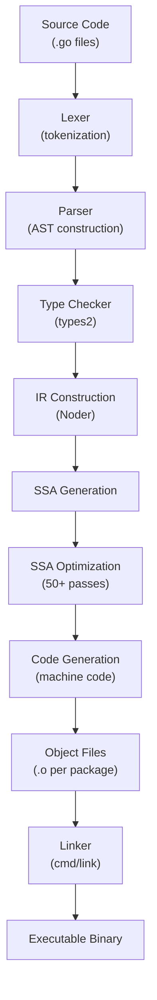
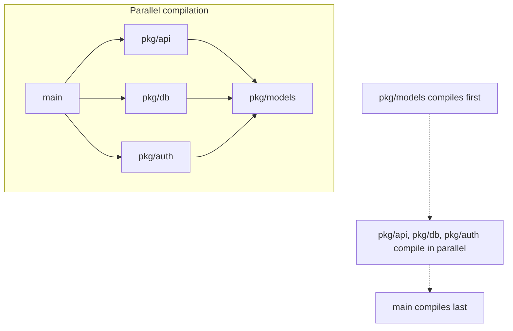
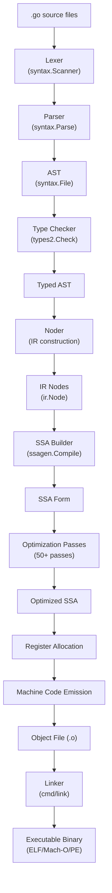

# Go Command — Under the Hood

## Table of Contents

1. [Introduction](#introduction)
2. [How It Works Internally](#how-it-works-internally)
3. [Runtime Deep Dive](#runtime-deep-dive)
4. [Compiler Perspective](#compiler-perspective)
5. [Memory Layout](#memory-layout)
6. [OS / Syscall Level](#os--syscall-level)
7. [Source Code Walkthrough](#source-code-walkthrough)
8. [Assembly Output Analysis](#assembly-output-analysis)
9. [Performance Internals](#performance-internals)
10. [Metrics & Analytics (Runtime Level)](#metrics--analytics-runtime-level)
11. [Edge Cases at the Lowest Level](#edge-cases-at-the-lowest-level)
12. [Test](#test)
13. [Tricky Questions](#tricky-questions)
14. [Summary](#summary)
15. [Further Reading](#further-reading)
16. [Diagrams & Visual Aids](#diagrams--visual-aids)

---

## Introduction

> Focus: "What happens under the hood?"

This document explores what the Go compiler and toolchain do internally when you run `go build`. For developers who want to understand:
- How Go source code becomes machine code (lexer, parser, type checker, SSA, codegen, linker)
- What each compiler phase produces
- How intermediate representations work
- What assembly the compiler generates
- How the linker assembles the final binary

---

## How It Works Internally

When you run `go build main.go`, the following pipeline executes:

1. **Lexer** (`cmd/compile/internal/syntax`) — tokenizes source into keywords, identifiers, literals
2. **Parser** (`cmd/compile/internal/syntax`) — builds an Abstract Syntax Tree (AST)
3. **Type Checker** (`cmd/compile/internal/types2`) — validates types, resolves names, checks assignments
4. **IR Construction** (`cmd/compile/internal/ir`) — converts AST to compiler internal representation
5. **SSA Generation** (`cmd/compile/internal/ssagen`) — converts IR to Static Single Assignment form
6. **SSA Optimization** (`cmd/compile/internal/ssa`) — applies 50+ optimization passes
7. **Code Generation** (`cmd/compile/internal/ssa`) — emits machine code from optimized SSA
8. **Object File** — per-package `.o` file with machine code + metadata
9. **Linker** (`cmd/link`) — combines object files into a single executable binary



### Pipeline Detail

```
Source: main.go
    |
    v
Tokens: [PACKAGE, IDENT("main"), IMPORT, STRING("fmt"), FUNC, ...]
    |
    v
AST:   File{
         Name: "main",
         Imports: [ImportDecl{Path: "fmt"}],
         Decls: [FuncDecl{Name: "main", Body: ...}]
       }
    |
    v
Typed AST: (all names resolved, types assigned)
    |
    v
SSA:   b1:
         v1 = InitMem
         v2 = StaticCall fmt.Println("Hello")
         v3 = Return v1
    |
    v
Machine Code (x86-64):
    MOVQ $"Hello", AX
    CALL fmt.Println
    RET
```

---

## Runtime Deep Dive

### How the Go Runtime Bootstraps Execution

When the linked binary starts, the OS calls the entry point, which is NOT `main.main`. The actual startup sequence is:

```
OS loads binary
    |
    v
_rt0_amd64_linux (arch-specific entry, asm)
    |
    v
runtime.rt0_go (runtime/asm_amd64.s)
    - Set up TLS
    - Initialize g0 (bootstrap goroutine)
    - Initialize m0 (bootstrap thread)
    - Call runtime.osinit()   — get CPU count
    - Call runtime.schedinit() — init scheduler, memory, GC
    - Create main goroutine
    - Call runtime.mstart()   — start scheduler
    |
    v
runtime.main (runtime/proc.go)
    - Run init() functions (in dependency order)
    - Call main.main()
    |
    v
main.main() — your code
    |
    v
runtime.exit(0)
```

**Key runtime structures involved in building and linking:**

```go
// From Go source: runtime/proc.go
type m struct {
    g0      *g     // goroutine for scheduling
    curg    *g     // current running goroutine
    p       puintptr // attached P
}

type g struct {
    stack       stack   // goroutine stack
    sched       gobuf   // scheduling state
    goid        uint64  // goroutine id
}

type p struct {
    status  uint32    // pidle, prunning, etc.
    runq    [256]guintptr // local run queue
}
```

**Key functions:**
- `runtime.schedinit()` — initializes the scheduler, sets GOMAXPROCS
- `runtime.newproc()` — creates a new goroutine (called for every `go` statement)
- `runtime.main()` — runs `init()` functions then `main.main()`

---

## Compiler Perspective

### Phase 1: Lexing and Parsing

The Go compiler uses a hand-written recursive descent parser (not a parser generator):

```bash
# View the AST of a Go file
go build -gcflags="-W" main.go 2>&1 | head -50
```

**Source file:** `src/cmd/compile/internal/syntax/scanner.go`

The lexer converts source text into tokens:

```
Input:  fmt.Println("Hello")
Tokens: IDENT("fmt") . IDENT("Println") ( STRING("Hello") )
```

### Phase 2: Type Checking

```bash
# View type checker decisions
go build -gcflags="-m" main.go
```

The type checker (`cmd/compile/internal/types2`, based on `go/types`) performs:
- Name resolution (which `fmt` does `fmt.Println` refer to?)
- Type inference (what type does `:=` infer?)
- Assignment compatibility checks
- Interface satisfaction checks
- Constant folding (compile-time arithmetic)

### Phase 3: SSA Generation and Optimization

```bash
# Generate SSA HTML visualization
GOSSAFUNC=main go build main.go
# Opens ssa.html showing all optimization passes
```

The SSA (Static Single Assignment) form has these properties:
- Every variable is assigned exactly once
- Each use refers to exactly one definition
- Enables efficient optimization passes

**Key optimization passes (in order):**

| Pass | What it does | Example |
|------|-------------|---------|
| `opt` | Constant folding, strength reduction | `x * 2` becomes `x << 1` |
| `generic deadcode` | Removes unreachable code | Dead branches after constant folding |
| `prove` | Range check elimination | Removes bounds checks when proven safe |
| `fuse` | Fuses consecutive basic blocks | Reduces branch overhead |
| `nilcheck` | Eliminates redundant nil checks | If already checked, skip |
| `lower` | Architecture-specific lowering | Generic ops to arch-specific ops |
| `regalloc` | Register allocation | Assigns variables to CPU registers |
| `schedule` | Instruction scheduling | Reorders for CPU pipeline |

### Phase 4: Code Generation

After SSA optimization, each SSA value is mapped to machine instructions:

```go
// SSA value: v5 = Add64 v3 v4
// x86-64:    ADDQ R8, R9
```

### Phase 5: Linking

The linker (`cmd/link`) performs:
- Symbol resolution (connect function calls to definitions)
- Relocation (fix up addresses)
- Dead code elimination (remove unused functions)
- DWARF debug info generation
- Binary format packaging (ELF on Linux, Mach-O on macOS, PE on Windows)

```bash
# View linker decisions
go build -ldflags="-v" -o server ./cmd/server 2>&1 | head -20

# View symbols in binary
go tool nm ./server | head -20

# View binary metadata
go version -m ./server
```

---

## Memory Layout

### How a Go binary is structured in memory (ELF format on Linux):

```
┌──────────────────────┐ 0x000000
│     ELF Header       │
│  (Magic, arch, entry)│
├──────────────────────┤
│   .text section      │ ← Machine code (functions)
│   (executable code)  │
├──────────────────────┤
│   .rodata section    │ ← String literals, constants
│   (read-only data)   │    go:embed data lives here
├──────────────────────┤
│   .data section      │ ← Initialized global variables
│   (read-write data)  │    var version = "dev"
├──────────────────────┤
│   .bss section       │ ← Zero-initialized globals
│   (uninitialized)    │    var counter int
├──────────────────────┤
│   .symtab            │ ← Symbol table (stripped by -s)
├──────────────────────┤
│   .debug_info        │ ← DWARF debug info (stripped by -w)
│   .debug_line        │
│   .debug_abbrev      │
├──────────────────────┤
│   Go-specific        │
│   - moduledata       │ ← Type info, itab, GC metadata
│   - pclntab          │ ← PC-to-line mapping (for stack traces)
│   - typelinks        │ ← Type reflection data
└──────────────────────┘
```

```bash
# Analyze binary sections
go tool objdump ./server | head -5
readelf -S ./server     # Linux: show all sections
size ./server           # show section sizes
```

```go
package main

import (
    "fmt"
    "unsafe"
)

var globalVar int = 42

func main() {
    localVar := 100
    fmt.Printf("globalVar address: %p (in .data section)\n", &globalVar)
    fmt.Printf("localVar address:  %p (on stack)\n", &localVar)
    fmt.Printf("int size: %d bytes\n", unsafe.Sizeof(globalVar))
}
```

---

## OS / Syscall Level

### What system calls does `go build` make?

```bash
# Trace the go build process
strace -f -e trace=file go build -o /dev/null main.go 2>&1 | head -30
```

**Key syscalls during compilation:**

| Syscall | When | Why |
|---------|------|-----|
| `openat` | Reading .go files | Lexer reads source files |
| `read` | Loading source | Parser processes content |
| `openat` | Cache lookup | Check if package is cached |
| `stat` | Modification check | Compare source timestamps to cache |
| `write` | Object file output | Write compiled .o file |
| `clone` | Parallel compilation | Spawn worker processes for packages |
| `execve` | Running linker | Execute `cmd/link` as subprocess |

**Key syscalls during execution of the compiled binary:**

```bash
# Trace a running Go program
strace -f ./server 2>&1 | head -20
```

| Syscall | When | Why |
|---------|------|-----|
| `mmap` | Startup | Allocate heap memory for GC |
| `clone` | Startup | Create OS threads for runtime (M's) |
| `futex` | Goroutine scheduling | Synchronization between M's |
| `epoll_create1` | Network init | Set up network poller |
| `sched_yield` | Scheduling | Yield CPU when spinning |

---

## Source Code Walkthrough

### File: `src/cmd/compile/internal/gc/main.go` (Go 1.22)

This is the compiler entry point:

```go
// Simplified flow from cmd/compile/internal/gc/main.go
func Main(archInit func(*ssagen.ArchInfo)) {
    // Phase 1: Parse
    noder.LoadPackage(flag.Args())

    // Phase 2: Type-check
    // (handled inside LoadPackage via types2)

    // Phase 3: Build IR
    // (noder converts syntax.File to ir.Node)

    // Phase 4: Compile each function
    compileFunctions()
    // Inside compileFunctions():
    //   - Build SSA for each function
    //   - Run optimization passes
    //   - Generate machine code

    // Phase 5: Write object file
    dumpobj()
}
```

### File: `src/cmd/compile/internal/ssa/compile.go`

```go
// Simplified from ssa/compile.go
func Compile(f *Func) {
    // Run optimization passes in order
    for _, p := range passes {
        p.fn(f)
        // Each pass transforms the SSA:
        // - "opt": constant folding
        // - "prove": range check elimination
        // - "lower": arch-specific lowering
        // - "regalloc": register allocation
    }
}
```

### File: `src/cmd/link/internal/ld/main.go`

```go
// Simplified linker flow
func Main(arch *sys.Arch, theArch Arch) {
    ctxt := linknew(arch)

    // Load object files
    loadlib(ctxt)

    // Resolve symbols
    // (connect function calls to definitions)

    // Dead code elimination
    deadcode(ctxt)

    // Relocations
    // (fix up addresses in machine code)

    // Write output binary
    // (ELF, Mach-O, or PE format)
    asmb(ctxt)
}
```

---

## Assembly Output Analysis

```bash
# View assembly for a specific function
go build -gcflags="-S" main.go 2>&1 | grep -A 20 '"".main STEXT'

# Or use objdump on the binary
go build -o server main.go
go tool objdump -s main.main ./server
```

### Example: Hello World assembly (amd64)

```go
package main

import "fmt"

func main() {
    fmt.Println("Hello, World!")
}
```

```asm
TEXT main.main(SB) /home/user/main.go
  main.go:5  MOVQ    (TLS), CX           ; Load goroutine pointer (g)
  main.go:5  CMPQ    SP, 16(CX)          ; Stack overflow check
  main.go:5  PCDATA  ...                  ; GC metadata
  main.go:5  JLS     morestack           ; Jump if stack needs growing
  main.go:5  SUBQ    $88, SP             ; Allocate 88 bytes of stack frame
  main.go:5  MOVQ    BP, 80(SP)          ; Save caller's base pointer
  main.go:5  LEAQ    80(SP), BP          ; Set up base pointer
  main.go:6  LEAQ    go:string."Hello, World!"(SB), AX  ; Load string pointer
  main.go:6  MOVQ    AX, (SP)            ; First arg: string data
  main.go:6  MOVQ    $13, 8(SP)          ; Second arg: string length
  main.go:6  CALL    fmt.Println(SB)     ; Call fmt.Println
  main.go:7  MOVQ    80(SP), BP          ; Restore base pointer
  main.go:7  ADDQ    $88, SP             ; Free stack frame
  main.go:7  RET                         ; Return
```

**What to look for:**
- **Stack frame size** (`SUBQ $88, SP`) — how much stack this function uses
- **Stack overflow check** — every function starts with this (except leaf functions)
- **String representation** — pointer + length (16 bytes on amd64), NOT null-terminated
- **Calling convention** — arguments passed on stack (Go's calling convention, not System V ABI)

### Comparing optimized vs unoptimized:

```bash
# Optimized (default)
go build -gcflags="" -o server main.go
go tool objdump -s main.main ./server | wc -l
# ~20 instructions

# Unoptimized
go build -gcflags="-N -l" -o server main.go
go tool objdump -s main.main ./server | wc -l
# ~40 instructions (no inlining, no optimizations)
```

---

## Performance Internals

### Build cache internals

The Go build cache (`~/.cache/go-build`) is a content-addressed store:

```bash
# Cache key computation (simplified):
# hash(package_import_path + source_file_hashes + dependency_hashes + build_flags)

# View cache location
go env GOCACHE

# Cache structure
ls ~/.cache/go-build/
# 00/ 01/ 02/ ... ff/ (hex-prefix directories)
# Each directory contains hash-named files:
# - actionID files (what needs to be built)
# - outputID files (compiled result)
```

### Compilation parallelism

```bash
# The go tool compiles packages in parallel based on the dependency graph
# Independent packages compile simultaneously

# View compilation order
go build -v ./... 2>&1
# Packages appear in dependency order
# Independent packages may interleave
```



### Inlining decisions

```bash
# View inlining decisions
go build -gcflags="-m -m" main.go 2>&1 | grep "inline"
```

```go
// This function WILL be inlined (small, simple)
func add(a, b int) int {
    return a + b
}

// This function will NOT be inlined (too complex or has loop)
func complexFunction(data []string) int {
    total := 0
    for _, s := range data {
        total += len(s)
    }
    return total
}
```

**Inlining budget:** Go has an inlining cost model. Functions with a "cost" under 80 are inlined. Costs:
- Simple operations: 1
- Function calls: 57
- Loops: too expensive (prevent inlining)

```bash
go build -gcflags="-m=2" main.go 2>&1 | grep "cost"
# Shows: "can inline add with cost 4 as: ..."
# Shows: "cannot inline complexFunction: function too complex"
```

---

## Metrics & Analytics (Runtime Level)

### Build Metrics

```bash
# Detailed build timing
go build -x -v ./... 2>&1 | grep "^#"
# Shows compilation time per package

# Profile the build itself
go build -toolexec="time" ./... 2>&1
```

### Key Runtime Metrics After Build

```go
package main

import (
    "fmt"
    "runtime"
    "runtime/debug"
)

func main() {
    // Build info embedded in binary
    info, ok := debug.ReadBuildInfo()
    if ok {
        fmt.Printf("Go version: %s\n", info.GoVersion)
        fmt.Printf("Module: %s\n", info.Main.Path)
        for _, setting := range info.Settings {
            fmt.Printf("  %s = %s\n", setting.Key, setting.Value)
        }
    }

    // Runtime info
    fmt.Printf("GOMAXPROCS: %d\n", runtime.GOMAXPROCS(0))
    fmt.Printf("NumCPU: %d\n", runtime.NumCPU())
    fmt.Printf("NumGoroutine: %d\n", runtime.NumGoroutine())
}
```

Output:
```
Go version: go1.22.0
Module: github.com/user/app
  -compiler = gc
  -ldflags = -s -w -X main.version=1.0.0
  -trimpath = true
  CGO_ENABLED = 0
  GOARCH = amd64
  GOOS = linux
GOMAXPROCS: 8
NumCPU: 8
NumGoroutine: 1
```

---

## Edge Cases at the Lowest Level

### Edge Case 1: Stack growth during compilation

When a function's stack frame exceeds the current stack allocation, the runtime grows the stack:

```go
// This function requires stack growth (large frame)
func largeStack() {
    var buf [1 << 20]byte // 1 MB on stack
    _ = buf
}
```

The preamble assembly:
```asm
CMPQ    SP, 16(CX)     ; Compare SP with stack guard
JLS     morestack       ; If too close to guard, grow stack
```

`runtime.morestack` allocates a new, larger stack (2x the size), copies the old stack contents, and updates all pointers. This is why Go stacks are "segmented" (actually contiguous, copyable).

### Edge Case 2: Binary includes unused runtime

Even a minimal Go program includes the runtime (GC, scheduler, memory allocator):

```go
package main

func main() {}
```

```bash
CGO_ENABLED=0 go build -ldflags="-s -w" -o minimal main.go
ls -lh minimal
# ~1.2 MB — that's the Go runtime
```

The runtime cannot be removed because even a program that "does nothing" needs:
- Goroutine scheduler (main runs as a goroutine)
- Garbage collector (memory management)
- Stack management (goroutine stacks grow dynamically)

---

## Test

### Internal Knowledge Questions

**1. What happens first when `go build` processes a `.go` file?**

<details>
<summary>Answer</summary>
The **lexer** (`cmd/compile/internal/syntax/scanner.go`) tokenizes the source file into tokens (keywords, identifiers, literals, operators). This is the first phase before parsing.
</details>

**2. What does the `GOSSAFUNC=main go build` command produce?**

<details>
<summary>Answer</summary>
It produces an `ssa.html` file that visualizes all SSA optimization passes applied to the `main` function. Each pass is shown side by side, allowing you to see how the compiler transforms your code through 50+ optimization passes.
</details>

**3. Why does every Go function start with a stack overflow check in the assembly?**

<details>
<summary>Answer</summary>
Go goroutines start with small stacks (typically 2-8 KB) that grow dynamically. The preamble `CMPQ SP, 16(CX)` compares the stack pointer to the stack guard. If the current stack is almost full, `runtime.morestack` allocates a larger stack (2x), copies the contents, and resumes execution. This enables millions of goroutines without pre-allocating large stacks.
</details>

**4. What does `-ldflags="-s -w"` actually strip from the binary?**

<details>
<summary>Answer</summary>
`-s` strips the symbol table (`.symtab` section) — removes function names and addresses used by debuggers and profilers. `-w` strips DWARF debug info (`.debug_*` sections) — removes line number mappings, type descriptions, and variable info. Together they reduce binary size by 25-40% but make debugging with `delve` impossible and stack traces less informative.
</details>

---

## Tricky Questions

**1. Can the Go compiler inline a function that contains a closure?**

<details>
<summary>Answer</summary>
Starting with Go 1.21, yes — the compiler can inline functions containing closures in some cases. Before Go 1.21, closures always prevented inlining. The inlining cost model assigns a higher cost to closures, so they are inlined only when the total cost is below the threshold. Use `go build -gcflags="-m=2"` to check.
</details>

**2. Why is a statically linked Go binary much larger than an equivalent C binary?**

<details>
<summary>Answer</summary>
The Go runtime (~1.2 MB stripped) is always linked into the binary. It includes:
- The goroutine scheduler (M:N threading)
- The garbage collector (concurrent, tri-color mark-sweep)
- The memory allocator (mcache, mcentral, mheap)
- The network poller (epoll/kqueue integration)
- Stack management (growable, copyable stacks)
- Reflection and type metadata

A C "hello world" has no runtime overhead, so it compiles to ~20 KB.
</details>

**3. What is `pclntab` in a Go binary and why is it often the largest section?**

<details>
<summary>Answer</summary>
`pclntab` (Program Counter to Line Number Table) maps machine code addresses to source file locations. It enables:
- Stack traces with file:line info
- `runtime.Callers()` and `runtime/pprof` profiling
- Panic messages showing the call stack

It is often 10-20% of the binary. It is NOT stripped by `-s -w` because Go needs it for stack traces at runtime. The only way to reduce it is to have fewer functions.
</details>

---

## Summary

- `go build` runs a 9-phase pipeline: Lexer, Parser, Type Checker, IR, SSA Gen, SSA Optimize (50+ passes), Codegen, Object File, Linker
- The Go compiler is a single-pass, self-hosted compiler written in Go
- SSA optimizations include constant folding, dead code elimination, bounds check elimination, inlining, and register allocation
- Every Go binary includes ~1.2 MB of runtime (scheduler, GC, memory allocator)
- `-ldflags="-s -w"` strips debug info but `pclntab` (stack traces) cannot be stripped

**Key takeaway:** Understanding the compiler pipeline helps you write code the compiler can optimize better — keep functions small (inlining), avoid unnecessary allocations (escape analysis), and use concrete types where possible (devirtualization).

---

## Further Reading

- **Go source:** [cmd/compile](https://github.com/golang/go/tree/master/src/cmd/compile) — the Go compiler source
- **Go source:** [cmd/link](https://github.com/golang/go/tree/master/src/cmd/link) — the linker source
- **Design doc:** [SSA Backend](https://github.com/golang/go/blob/master/src/cmd/compile/internal/ssa/README.md) — SSA design
- **Conference talk:** [Understanding the Go Compiler - GopherCon](https://www.youtube.com/results?search_query=gophercon+go+compiler+internals)
- **Book:** "Go Internals" by various authors — compiler and runtime chapters
- **Blog:** [Go compiler phases](https://go.dev/src/cmd/compile/README) — official compiler README

---

## Diagrams & Visual Aids

### Go Compiler Pipeline (Detailed)



### Binary Section Layout

```
Binary file (ELF format)
+------------------------------------------+
| ELF Header (64 bytes)                     |
|   Magic: 7f 45 4c 46                     |
|   Entry: 0x4614e0                        |
+------------------------------------------+
| .text (executable code)          ~40%    |
|   - runtime functions                    |
|   - your compiled functions              |
|   - stdlib functions used                |
+------------------------------------------+
| .rodata (read-only data)         ~15%    |
|   - string literals                      |
|   - go:embed data                        |
|   - type descriptors                     |
+------------------------------------------+
| .pclntab (PC-to-line table)      ~20%    |
|   - stack trace information              |
|   - function name mappings               |
+------------------------------------------+
| .data / .bss (globals)           ~5%     |
+------------------------------------------+
| .symtab (symbols)               ~10%     |  <- stripped by -s
| .debug_* (DWARF)                ~10%     |  <- stripped by -w
+------------------------------------------+
```

### Compilation Parallelism

```mermaid
gantt
    title Package Compilation Timeline
    dateFormat X
    axisFormat %s

    section Phase
    pkg/models      :a1, 0, 2
    pkg/api         :a2, after a1, 2
    pkg/db          :a3, after a1, 2
    pkg/auth        :a4, after a1, 2
    cmd/server      :a5, after a2 a3 a4, 1
    linking         :a6, after a5, 1
```


