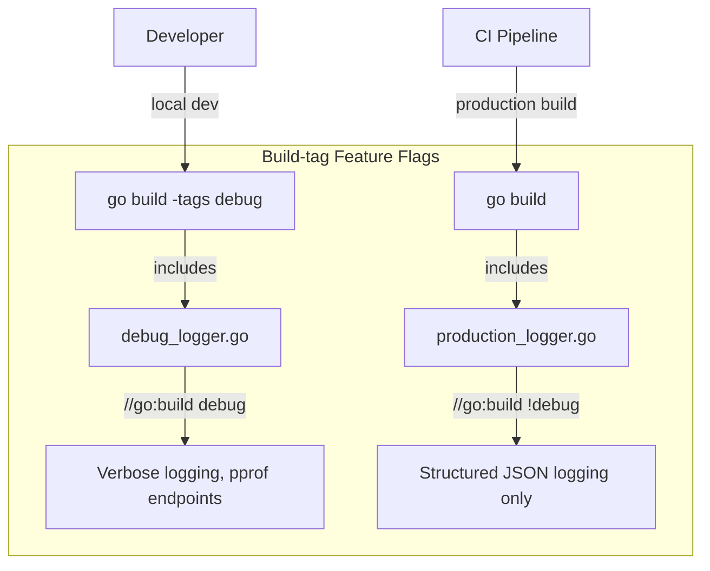
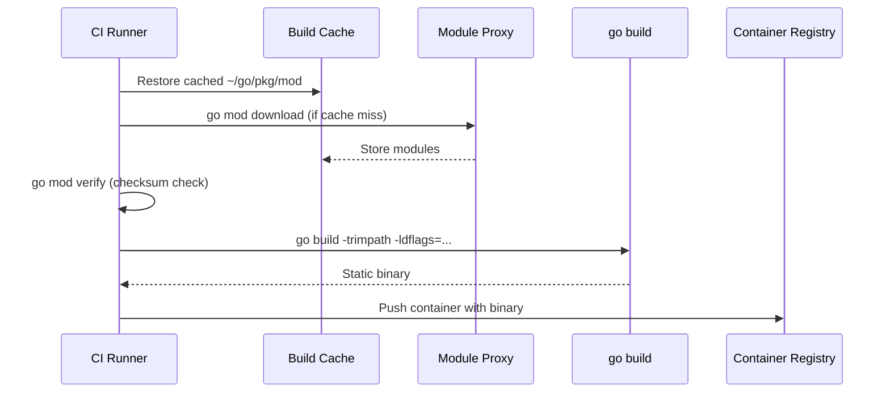
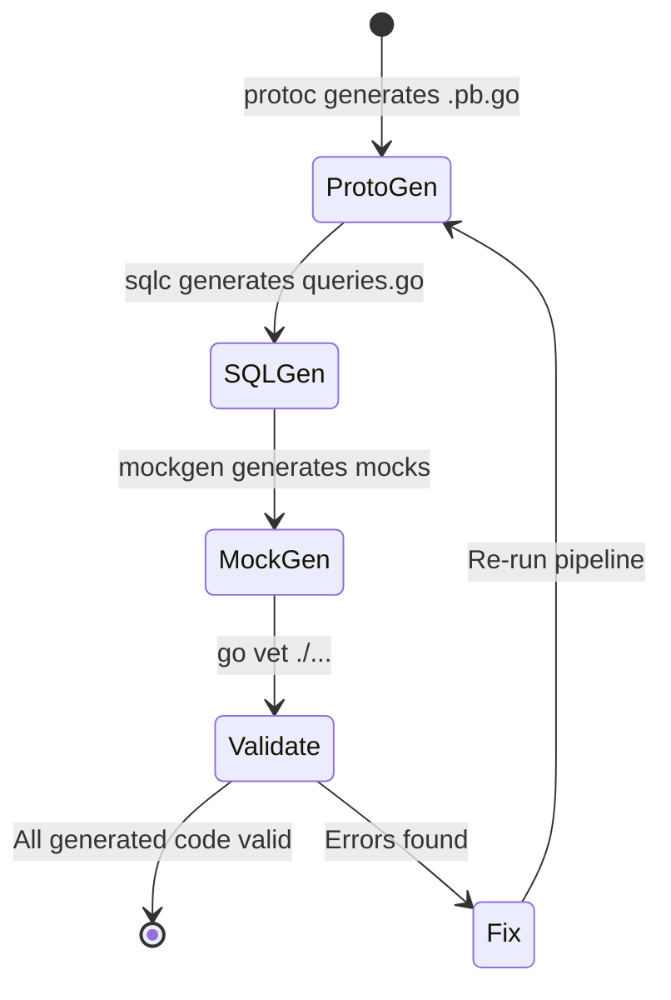
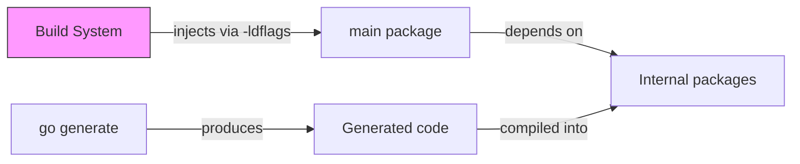
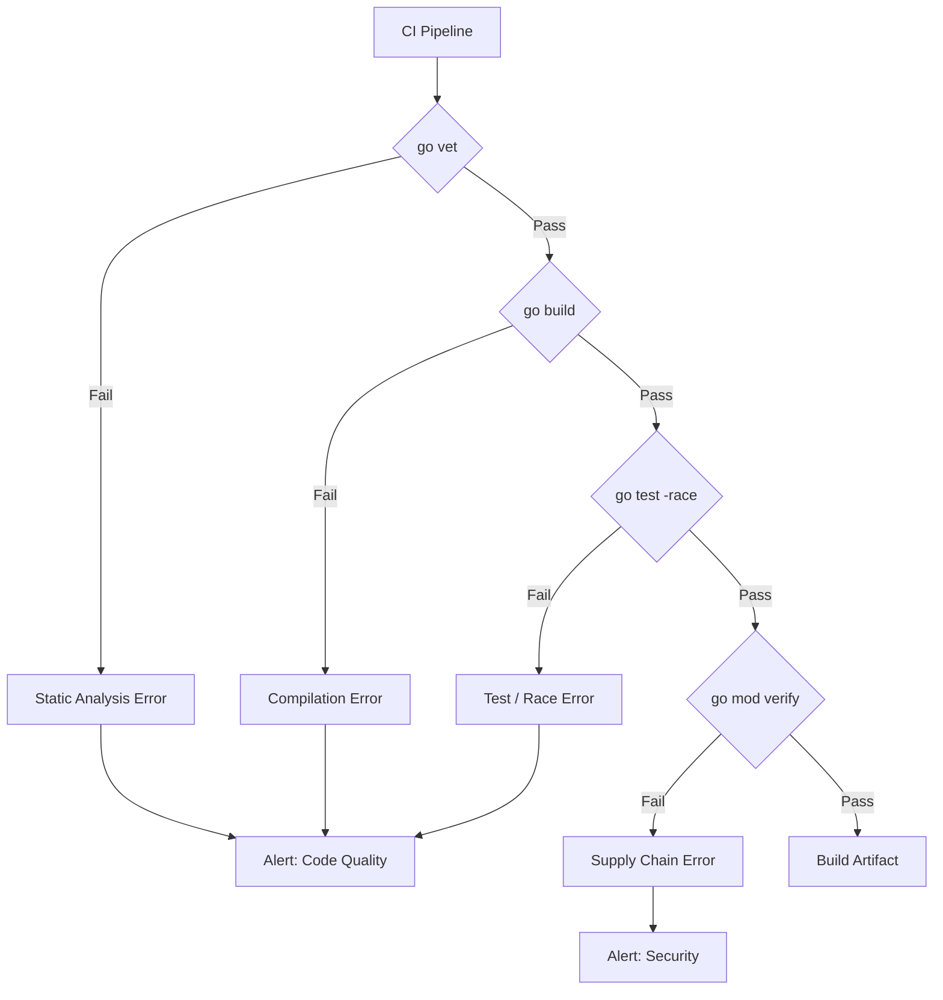
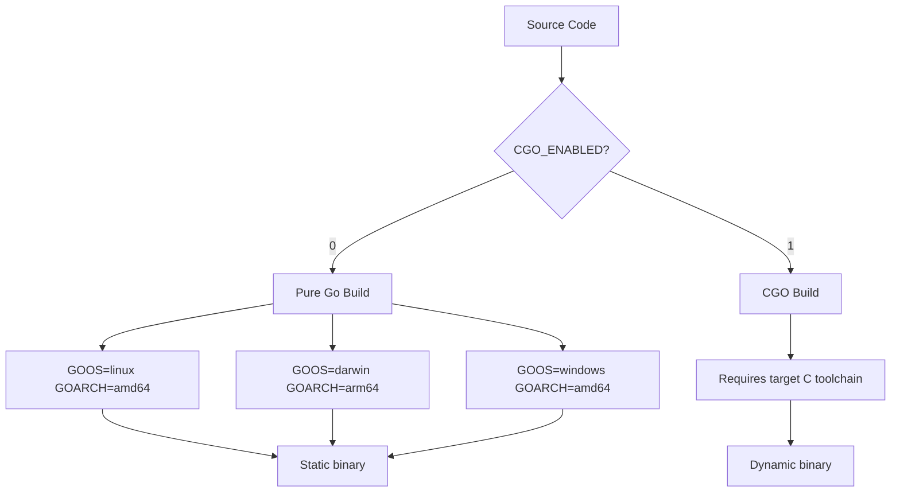
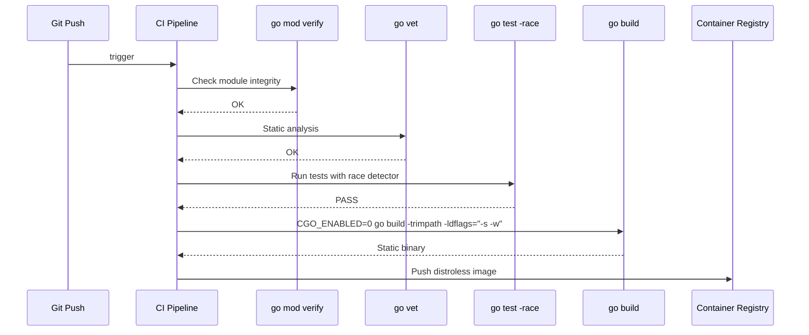

# Go Command — Senior Level

## Table of Contents

1. [Introduction](#introduction)
2. [Core Concepts](#core-concepts)
3. [Pros & Cons](#pros--cons)
4. [Use Cases](#use-cases)
5. [Code Examples](#code-examples)
6. [Coding Patterns](#coding-patterns)
7. [Clean Code](#clean-code)
8. [Best Practices](#best-practices)
9. [Product Use / Feature](#product-use--feature)
10. [Error Handling](#error-handling)
11. [Security Considerations](#security-considerations)
12. [Performance Optimization](#performance-optimization)
13. [Metrics & Analytics](#metrics--analytics)
14. [Debugging Guide](#debugging-guide)
15. [Edge Cases & Pitfalls](#edge-cases--pitfalls)
16. [Postmortems & System Failures](#postmortems--system-failures)
17. [Common Mistakes](#common-mistakes)
18. [Tricky Points](#tricky-points)
19. [Comparison with Other Languages](#comparison-with-other-languages)
20. [Test](#test)
21. [Tricky Questions](#tricky-questions)
22. [Cheat Sheet](#cheat-sheet)
23. [Summary](#summary)
24. [What You Can Build](#what-you-can-build)
25. [Further Reading](#further-reading)
26. [Related Topics](#related-topics)
27. [Diagrams & Visual Aids](#diagrams--visual-aids)

---

## Introduction

> Focus: "How to optimize?" and "How to architect?"

For developers who:
- Design build systems and CI/CD pipelines for large Go codebases
- Optimize build times, binary sizes, and cross-compilation strategies
- Understand build constraints, CGO considerations, and `go:embed`
- Mentor teams on `go generate` at scale and custom build pipelines

---

## Core Concepts

### Concept 1: Cross-compilation matrix

Go supports cross-compilation natively via `GOOS` and `GOARCH` environment variables:

```bash
# Cross-compile for multiple targets
GOOS=linux   GOARCH=amd64 go build -o bin/server-linux-amd64
GOOS=linux   GOARCH=arm64 go build -o bin/server-linux-arm64
GOOS=darwin  GOARCH=amd64 go build -o bin/server-darwin-amd64
GOOS=darwin  GOARCH=arm64 go build -o bin/server-darwin-arm64
GOOS=windows GOARCH=amd64 go build -o bin/server-windows-amd64.exe
```

```bash
# List all supported platforms
go tool dist list
```

### Concept 2: Build constraints (build tags)

Build constraints control which files are included in compilation:

```go
//go:build linux && amd64
// +build linux,amd64

package platform

func GetPlatformInfo() string {
    return "Linux AMD64"
}
```

```go
//go:build !linux

package platform

func GetPlatformInfo() string {
    return "Non-Linux Platform"
}
```

Custom build tags:

```go
//go:build integration

package myapp_test

import "testing"

func TestDatabaseIntegration(t *testing.T) {
    // Only runs with: go test -tags integration ./...
}
```

### Concept 3: CGO considerations

CGO enables calling C code from Go but introduces significant complexity:

```bash
# Default: CGO enabled when compiling for host platform
CGO_ENABLED=1 go build -o server

# Static binary without CGO
CGO_ENABLED=0 go build -o server

# Cross-compile with CGO requires a cross-compiler
CGO_ENABLED=1 CC=aarch64-linux-gnu-gcc GOOS=linux GOARCH=arm64 go build -o server
```

```go
package main

/*
#include <stdlib.h>
#include <stdio.h>
void hello() { printf("Hello from C!\n"); }
*/
import "C"

func main() {
    C.hello()
}
```

**Trade-offs:**

| CGO_ENABLED=1 | CGO_ENABLED=0 |
|:---:|:---:|
| Can use C libraries (SQLite, etc.) | Fully static binary |
| Requires C compiler | No C toolchain needed |
| Cross-compilation is hard | Cross-compilation is trivial |
| Dynamic linking by default | Static linking guaranteed |
| Slower build times | Faster build times |

### Concept 4: `go:embed` — embedding files at compile time

```go
package main

import (
    "embed"
    "fmt"
    "io/fs"
    "net/http"
)

//go:embed static/*
var staticFiles embed.FS

//go:embed version.txt
var version string

//go:embed config/defaults.json
var defaultConfig []byte

func main() {
    fmt.Printf("Version: %s\n", version)

    // Serve embedded static files
    subFS, _ := fs.Sub(staticFiles, "static")
    http.Handle("/", http.FileServer(http.FS(subFS)))
    http.ListenAndServe(":8080", nil)
}
```

### Concept 5: `go generate` at scale

For large codebases, organize generation with a top-level generate file:

```go
// generate.go at project root
package project

//go:generate go run ./cmd/gen-routes
//go:generate go run ./cmd/gen-mocks
//go:generate go run github.com/sqlc-dev/sqlc/cmd/sqlc@latest generate
//go:generate go run google.golang.org/protobuf/cmd/protoc-gen-go@latest
```

```bash
# Run all generators in dependency order
go generate ./internal/proto/...   # proto first
go generate ./internal/sqlc/...    # SQL second
go generate ./internal/mocks/...   # mocks last (depend on interfaces)
```

### Concept 6: Advanced build optimization flags

```bash
# Full production build command
go build \
  -trimpath \
  -ldflags="-s -w -X main.version=$(git describe --tags) \
    -X main.commit=$(git rev-parse --short HEAD) \
    -X main.buildTime=$(date -u +%Y-%m-%dT%H:%M:%SZ) \
    -extldflags '-static'" \
  -tags "production,jsoniter" \
  -o bin/server \
  ./cmd/server
```

| Flag | Purpose | Size impact |
|------|---------|:-----------:|
| `-s` | Strip symbol table | -10-15% |
| `-w` | Strip DWARF debug info | -15-25% |
| `-trimpath` | Remove file paths | Minimal |
| `-extldflags '-static'` | Static linking | +5-10% |
| `CGO_ENABLED=0` | No C dependencies | -20-40% |

---

## Pros & Cons

### Strategic analysis for architectural decisions:

| Pros | Cons | Impact |
|------|------|--------|
| Cross-compilation is trivial (no CGO) | CGO cross-compilation requires toolchains | Affects multi-platform delivery strategy |
| `go:embed` eliminates file deployment | Embedded files increase binary size | Simplifies Docker images, complicates updates |
| Build constraints enable platform code | Multiple files for same function is hard to maintain | Affects code organization decisions |
| `-ldflags` enables zero-config versioning | Complex flag strings break easily | Build system reliability |

### When Go's approach is the RIGHT choice:
- Deploying statically linked binaries to minimal containers (scratch/distroless)
- Cross-compiling CLI tools for multiple platforms from one CI runner

### When Go's approach is the WRONG choice:
- Heavy C library dependencies (computer vision, ML inference) — CGO complexity outweighs benefits
- Extremely large monorepos with 100+ binaries — consider Bazel for parallel distributed builds

---

## Use Cases

- **Use Case 1:** Building a single binary that embeds frontend assets, config, and migrations via `go:embed`
- **Use Case 2:** Cross-compiling a CLI tool for 6 platforms in a single CI job
- **Use Case 3:** Reducing GC pressure by stripping debug info and using build tags to exclude profiling code in production

---

## Code Examples

### Example 1: Multi-platform build pipeline

```go
// build.go — custom build script
package main

import (
    "fmt"
    "os"
    "os/exec"
    "runtime"
    "sync"
)

type Target struct {
    GOOS   string
    GOARCH string
}

var targets = []Target{
    {"linux", "amd64"},
    {"linux", "arm64"},
    {"darwin", "amd64"},
    {"darwin", "arm64"},
    {"windows", "amd64"},
}

func main() {
    version := "1.0.0"
    if v := os.Getenv("VERSION"); v != "" {
        version = v
    }

    ldflags := fmt.Sprintf("-s -w -X main.version=%s", version)

    var wg sync.WaitGroup
    sem := make(chan struct{}, runtime.NumCPU())

    for _, t := range targets {
        wg.Add(1)
        go func(t Target) {
            defer wg.Done()
            sem <- struct{}{}
            defer func() { <-sem }()

            ext := ""
            if t.GOOS == "windows" {
                ext = ".exe"
            }
            output := fmt.Sprintf("bin/server-%s-%s%s", t.GOOS, t.GOARCH, ext)

            cmd := exec.Command("go", "build",
                "-trimpath",
                "-ldflags", ldflags,
                "-o", output,
                "./cmd/server",
            )
            cmd.Env = append(os.Environ(),
                "GOOS="+t.GOOS,
                "GOARCH="+t.GOARCH,
                "CGO_ENABLED=0",
            )
            cmd.Stdout = os.Stdout
            cmd.Stderr = os.Stderr

            if err := cmd.Run(); err != nil {
                fmt.Fprintf(os.Stderr, "FAIL: %s/%s: %v\n", t.GOOS, t.GOARCH, err)
                return
            }
            fmt.Printf("OK: %s\n", output)
        }(t)
    }
    wg.Wait()
}
```

**Architecture decisions:** Parallel builds with semaphore-bounded concurrency. CGO disabled for all targets to ensure static linking.
**Alternatives considered:** Using a Makefile with `$(foreach ...)` — less flexible for error handling and parallelism.

### Example 2: `go:embed` for self-contained deployment

```go
package main

import (
    "database/sql"
    "embed"
    "fmt"
    "log"
    "strings"

    _ "github.com/mattn/go-sqlite3"
)

//go:embed migrations/*.sql
var migrations embed.FS

func runMigrations(db *sql.DB) error {
    entries, err := migrations.ReadDir("migrations")
    if err != nil {
        return fmt.Errorf("reading migrations dir: %w", err)
    }

    for _, entry := range entries {
        if !strings.HasSuffix(entry.Name(), ".sql") {
            continue
        }
        data, err := migrations.ReadFile("migrations/" + entry.Name())
        if err != nil {
            return fmt.Errorf("reading %s: %w", entry.Name(), err)
        }
        if _, err := db.Exec(string(data)); err != nil {
            return fmt.Errorf("executing %s: %w", entry.Name(), err)
        }
        log.Printf("Applied migration: %s", entry.Name())
    }
    return nil
}

func main() {
    log.Println("Migrations ready to apply")
}
```

---

## Coding Patterns

### Pattern 1: Build-tag driven feature flags

**Category:** Architectural / Feature Management
**Intent:** Enable or disable features at compile time with zero runtime cost.
**Trade-offs:** Compile-time flags require rebuilding; runtime flags are more flexible but add overhead.

**Architecture diagram:**



**Implementation:**

```go
//go:build debug
// debug_features.go

package main

import (
    "log"
    "net/http"
    _ "net/http/pprof"
)

func init() {
    log.Println("DEBUG MODE: pprof enabled on :6060")
    go func() {
        log.Println(http.ListenAndServe(":6060", nil))
    }()
}
```

```go
//go:build !debug
// production_features.go

package main

// No debug features in production — zero overhead
```

**When this pattern wins:**
- Features with significant overhead that should never exist in production binaries

**When to avoid:**
- Features that need runtime toggling (use config files or environment variables instead)

---

### Pattern 2: Reproducible build pipeline

**Category:** Infrastructure / DevOps
**Intent:** Ensure every build produces the same binary from the same source.

**Flow diagram:**



```bash
#!/bin/bash
set -euo pipefail

# Reproducible build script
export CGO_ENABLED=0
export GOFLAGS="-trimpath"

# Verify module integrity
go mod verify

# Build with version info
VERSION=$(git describe --tags --always --dirty)
COMMIT=$(git rev-parse --short HEAD)
BUILD_TIME=$(date -u +%Y-%m-%dT%H:%M:%SZ)

go build \
  -ldflags="-s -w \
    -X main.version=${VERSION} \
    -X main.commit=${COMMIT} \
    -X main.buildTime=${BUILD_TIME}" \
  -o bin/server \
  ./cmd/server

# Verify binary
sha256sum bin/server
```

---

### Pattern 3: Custom `go generate` pipeline

**Category:** Idiomatic Go / Code Generation
**Intent:** Orchestrate multi-step code generation with dependency ordering.

**State diagram:**



```makefile
# Makefile — ordered code generation
.PHONY: generate

generate: generate-proto generate-sqlc generate-mocks
	@echo "All code generated successfully"
	@go vet ./...

generate-proto:
	protoc --go_out=. --go-grpc_out=. proto/*.proto

generate-sqlc:
	sqlc generate

generate-mocks:
	go generate ./internal/mocks/...
```

### Pattern Comparison Matrix

| Pattern | Use When | Avoid When | Complexity |
|---------|----------|------------|------------|
| Build-tag feature flags | Zero-overhead prod features | Need runtime toggling | Low |
| Reproducible build pipeline | Auditable deployments | Rapid prototyping | Medium |
| Custom generate pipeline | Multi-step generation | Single generator | Medium |
| Cross-compile matrix | Multi-platform CLI | Server-only deployment | Low |

---

## Clean Code

### Clean Architecture Boundaries

```go
// Layering violation — build logic mixed with business logic
func main() {
    version := "hardcoded-1.0" // should be injected
    log.Printf("Starting v%s", version)
}

// Dependency inversion — version injected at build time
var version = "dev" // overridden by -ldflags

func main() {
    log.Printf("Starting v%s", version)
}
```

**Dependency flow must be:**


---

### Code Smells at Senior Level

| Smell | Symptom | Refactoring |
|-------|---------|-------------|
| **Build script in Go** | `go run ./cmd/build` that calls `exec.Command("go", "build")` | Use Makefile or shell script |
| **Embedded everything** | 100 MB binary because all assets embedded | Embed only essential files; serve others from CDN |
| **CGO for simple tasks** | Using CGO for JSON parsing or HTTP | Use pure Go alternatives |
| **Generate in build** | `go generate` as part of `go build` | Separate steps; commit generated code |

---

### Code Review Checklist (Senior)

- [ ] Build flags documented in Makefile or README
- [ ] `go:embed` only used for files that truly need to be in the binary
- [ ] CGO disabled unless absolutely necessary
- [ ] Build constraints use the new `//go:build` syntax (not `// +build`)
- [ ] No hardcoded version strings — all injected via `-ldflags`
- [ ] CI runs `go mod verify` and `go vet`

---

## Best Practices

### Must Do

1. **Use `CGO_ENABLED=0` for production builds** — produces truly static binaries
   ```bash
   CGO_ENABLED=0 go build -o server ./cmd/server
   ```

2. **Always use `-trimpath` in production** — removes local file system paths
   ```bash
   go build -trimpath -o server
   ```

3. **Verify modules in CI** — detect supply-chain tampering
   ```bash
   go mod verify
   govulncheck ./...
   ```

4. **Separate `go generate` from `go build`** — generated code must be committed
   ```bash
   go generate ./...
   git diff --exit-code  # fail if generated code is stale
   ```

5. **Use build tags for integration tests** — keep `go test ./...` fast
   ```go
   //go:build integration
   func TestDatabase(t *testing.T) { /* ... */ }
   ```

### Never Do

1. **Never embed large files** — a 50 MB binary takes 50 MB of RAM at startup
2. **Never use `CGO_ENABLED=1` for cross-compilation without a cross-compiler** — it silently falls back or fails
3. **Never commit `go.work`** — workspace files are local development tools

### Go Production Checklist

- [ ] `CGO_ENABLED=0` in production Dockerfile
- [ ] `-trimpath -ldflags="-s -w"` in production build
- [ ] `go mod verify` in CI pipeline
- [ ] `govulncheck ./...` in CI pipeline
- [ ] `go vet ./...` and `staticcheck ./...` in CI
- [ ] `go test -race -count=1 ./...` in CI
- [ ] Generated code checked for staleness in CI
- [ ] Build tags used for integration/e2e tests
- [ ] Multi-stage Dockerfile (builder + scratch/distroless)

---

## Product Use / Feature

### 1. Cloudflare

- **Architecture:** Uses `go build` with custom build tags to compile different features for different edge node types.
- **Scale:** Thousands of edge servers, each running Go binaries compiled with platform-specific tags.
- **Lessons learned:** Moved from CGO to pure Go implementations for portability across architectures.

### 2. HashiCorp (Terraform, Vault, Consul)

- **Architecture:** Uses GoReleaser for cross-compilation to 10+ platforms with `-ldflags` version injection.
- **Scale:** Each release produces 20+ binaries (OS x arch combinations).
- **Lessons learned:** Standardized on `CGO_ENABLED=0` to avoid C toolchain requirements on CI.

---

## Error Handling

### Strategy 1: Build failure categorization

```bash
#!/bin/bash
set -euo pipefail

# Categorize build failures
if ! go vet ./... 2>vet_errors.txt; then
    echo "CATEGORY: Static analysis failure"
    cat vet_errors.txt
    exit 1
fi

if ! go build -o /dev/null ./... 2>build_errors.txt; then
    echo "CATEGORY: Compilation failure"
    cat build_errors.txt
    exit 1
fi

if ! go test -race -count=1 ./... 2>test_errors.txt; then
    echo "CATEGORY: Test failure"
    cat test_errors.txt
    exit 1
fi
```

### Error Handling Architecture



---

## Security Considerations

### Security Architecture Checklist

- [ ] Input validation — `go vet` and `staticcheck` in CI
- [ ] `-trimpath` — no local paths in production binaries
- [ ] `go mod verify` — checksums match expected values
- [ ] `govulncheck ./...` — no known vulnerable dependencies
- [ ] `GONOSUMCHECK` narrowly scoped — only private modules
- [ ] No secrets in `-ldflags` — use runtime env vars instead
- [ ] Binary signed with cosign or similar for artifact integrity

### Threat Model

| Threat | Likelihood | Impact | Mitigation |
|--------|:---------:|:------:|------------|
| Dependency tampering | Medium | Critical | `go mod verify` + `GONOSUMCHECK` scoped |
| Path disclosure in stack traces | High | Medium | `-trimpath` in all builds |
| Vulnerable dependency | High | High | `govulncheck` in CI |
| Build server compromise | Low | Critical | Reproducible builds + artifact signing |

---

## Performance Optimization

### Optimization 1: Binary size reduction

```bash
# Baseline
go build -o server ./cmd/server
ls -lh server
# 25 MB

# Strip debug info
go build -ldflags="-s -w" -o server ./cmd/server
ls -lh server
# 17 MB (-32%)

# Disable CGO + strip
CGO_ENABLED=0 go build -ldflags="-s -w" -trimpath -o server ./cmd/server
ls -lh server
# 14 MB (-44%)

# UPX compression (optional, affects startup time)
upx --best server
ls -lh server
# 5 MB (-80%)
```

### Optimization 2: Build time reduction

```bash
# Measure baseline
time go build ./...
# real 45s

# Warm cache
time go build ./...
# real 2s (cached)

# Parallel tests
time go test -parallel $(nproc) ./...
# 30% faster than default

# Reduce test scope in development
go test -short ./...  # skip long-running tests
```

### Performance Architecture

| Layer | Optimization | Impact | Cost |
|:-----:|:------------|:------:|:----:|
| **Binary size** | `-ldflags="-s -w"` + CGO_ENABLED=0 | 30-50% smaller | No cost |
| **Build time** | CI cache + parallel tests | 50-80% faster CI | Cache storage cost |
| **Startup time** | Avoid UPX on server binaries | Faster cold starts | Larger binary |
| **Cross-compile** | CGO_ENABLED=0 | Trivial multi-platform | Lose C library access |

---

## Debugging Guide

### Advanced Tools & Techniques

| Tool | Use case | When to use |
|------|----------|-------------|
| `go build -gcflags="-m"` | Escape analysis | Find unexpected heap allocations |
| `go build -gcflags="-S"` | Assembly output | Understand generated code |
| `GOSSAFUNC=fn go build` | SSA visualization | Compiler optimization analysis |
| `go tool nm ./binary` | Symbol listing | Check what is linked |
| `go tool objdump -s main.main ./binary` | Disassembly | Verify optimizations |
| `go version -m ./binary` | Build info | Check how binary was built |

```bash
# Check build info of any Go binary
go version -m ./server
# Shows: Go version, module path, dependencies, build settings

# Check if binary has race detector
go version -m ./server | grep -race
```

---

## Edge Cases & Pitfalls

### Pitfall 1: `go:embed` with `.` files

```go
//go:embed templates/*
var templates embed.FS
// Does NOT include .hidden files or _prefixed files

//go:embed templates/* templates/.gitkeep
var templatesWithHidden embed.FS
// Must explicitly name hidden files
```

**At what scale it breaks:** When your template directory has `.env.template` or similar dotfiles.
**Root cause:** `go:embed` follows Go's file naming conventions by default.
**Solution:** Explicitly list hidden files or use `all:` prefix (Go 1.22+): `//go:embed all:templates`.

### Pitfall 2: CGO_ENABLED default varies by context

```bash
# On your machine (compiling for host):
go env CGO_ENABLED  # 1 (enabled)

# Cross-compiling:
GOOS=linux GOARCH=arm64 go env CGO_ENABLED  # 0 (disabled automatically)

# This can cause different behavior between local and CI builds
```

---

## Postmortems & System Failures

### The "Works on My Machine" Cross-compilation Incident

- **The goal:** Ship a Linux binary built on macOS developer machines
- **The mistake:** Developers had CGO_ENABLED=1 (default). The build silently linked against macOS system libraries. When deployed to Linux, the binary crashed with `exec format error`.
- **The impact:** 2 hours of production downtime while the correct binary was rebuilt.
- **The fix:** Added `CGO_ENABLED=0` to the Makefile and Dockerfile, plus CI verification that the binary is statically linked.

**Key takeaway:** Always build production binaries in the target environment (Docker) or with `CGO_ENABLED=0`.

---

## Common Mistakes

### Mistake 1: Embedding the entire project directory

```go
// Wrong — embeds everything including .git, vendor, test fixtures
//go:embed .
var everything embed.FS

// Correct — embed only what you need
//go:embed static/* templates/* migrations/*.sql
var assets embed.FS
```

**Why seniors still make this mistake:** It "just works" in development, but binary size explodes.

### Mistake 2: Not testing cross-compiled binaries

```bash
# Wrong — only build, never test
GOOS=linux GOARCH=arm64 go build -o server

# Correct — test in target environment
docker run --platform linux/arm64 -v $(pwd):/app alpine /app/server --health-check
```

---

## Tricky Points

### Tricky Point 1: `go build` caches are content-addressed

```bash
# Changing a comment does NOT invalidate the cache
# Changing whitespace does NOT invalidate the cache
# Only semantic changes to .go files trigger recompilation

# To verify:
go build -v ./...    # shows recompiled packages
go build -v ./...    # second run shows nothing (all cached)
```

**Go spec reference:** The build cache uses a content hash of the package source, dependencies, and build flags.
**Why this matters:** You can safely rebuild without cleaning — unchanged packages are instant.

### Tricky Point 2: `-ldflags` variable must be a `var`, not `const`

```go
// This CANNOT be set by -ldflags
const version = "dev"

// This CAN be set by -ldflags
var version = "dev"
```

**Why:** `-ldflags -X` modifies package-level string variables at link time. Constants are resolved at compile time and cannot be modified.

---

## Comparison with Other Languages

| Aspect | Go | Rust | Java | C++ |
|--------|:---:|:----:|:----:|:---:|
| Cross-compilation | Built-in (`GOOS/GOARCH`) | Via targets (`--target`) | JVM handles it | Requires cross-toolchains |
| Static binary | `CGO_ENABLED=0` | Default | Not possible (JVM) | Requires explicit flags |
| Asset embedding | `go:embed` | `include_bytes!` | Resources in JAR | Manual or `#embed` (C23) |
| Build constraints | `//go:build` tags | `cfg(target_os)` | Maven profiles | `#ifdef` preprocessor |
| Code generation | `go generate` (external) | Proc macros (built-in) | Annotation processors | Templates, macros |

### When Go's approach wins:
- Simple cross-compilation for CLI tools distributed on multiple platforms
- Single static binary deployment (no runtime, no dependencies)

### When Go's approach loses:
- Complex C library integrations where Rust's FFI or C++'s native support is cleaner
- Build-time metaprogramming where Rust's proc macros are more powerful than external `go generate`

---

## Test

### Architecture Questions

**1. You are designing a CI pipeline for a Go monorepo with 15 services. How do you optimize build time?**

<details>
<summary>Answer</summary>

1. **Cache `~/.cache/go-build` and `~/go/pkg/mod`** between CI runs — avoids recompilation and re-downloading
2. **Build only changed services** using `go list -m -json ./... | jq` to detect modified packages
3. **Run tests in parallel** with `go test -parallel $(nproc)`
4. **Use `-short` flag** for unit tests; run integration tests in a separate pipeline
5. **Consider Bazel** if build times exceed 10 minutes — it offers distributed caching and remote execution
</details>

### Performance Analysis

**2. This Docker build takes 8 minutes. How would you optimize it?**

```dockerfile
FROM golang:1.22
WORKDIR /app
COPY . .
RUN go build -o server ./cmd/server
CMD ["./server"]
```

<details>
<summary>Answer</summary>

1. **Layer caching:** Copy `go.mod` and `go.sum` first, then `go mod download`, then copy source
2. **Multi-stage build:** Use a builder stage and copy only the binary to `scratch` or `distroless`
3. **`CGO_ENABLED=0`:** Enables static binary for scratch base image
4. **Cache mount:** Use Docker BuildKit cache mounts for Go module and build caches

```dockerfile
FROM golang:1.22 AS builder
WORKDIR /app
COPY go.mod go.sum ./
RUN go mod download
COPY . .
RUN CGO_ENABLED=0 go build -trimpath -ldflags="-s -w" -o server ./cmd/server

FROM gcr.io/distroless/static:nonroot
COPY --from=builder /app/server /server
USER nonroot
ENTRYPOINT ["/server"]
```

Result: Build time drops to 2-3 minutes; image size drops from 1.2 GB to 8 MB.
</details>

### Code Review

**3. Find 3 issues in this build configuration:**

```makefile
build:
	go build -race -o server ./cmd/server

deploy: build
	scp server prod-server:/usr/local/bin/
	ssh prod-server "systemctl restart server"
```

<details>
<summary>Answer</summary>

1. **`-race` in production build:** Race detector adds 5-10x overhead. Remove it from production builds.
2. **Missing `-trimpath`:** Local file paths will appear in stack traces on production.
3. **Missing `-ldflags="-s -w"`:** Binary contains debug info, making it unnecessarily large.
4. **Bonus: No `CGO_ENABLED=0`:** Binary may dynamically link to C libraries that differ on the production server.
</details>

---

## Tricky Questions

**1. Why does `go build -ldflags="-X main.Version=1.0"` fail silently (no error, but variable is unchanged)?**

<details>
<summary>Answer</summary>
The variable name is case-sensitive and must match exactly, including the full package path. The correct format is `-X main.Version=1.0` only if the variable is declared as `var Version string` in `package main`. If it is in a sub-package, use the full import path: `-X github.com/user/app/config.Version=1.0`. Also, the variable must be a `var`, not a `const`, and must be of type `string`.
</details>

**2. You run `CGO_ENABLED=0 go build` and get `undefined: sqlite3_open`. What happened and how do you fix it?**

<details>
<summary>Answer</summary>
`CGO_ENABLED=0` disables CGO, which means any package that uses C code (like `go-sqlite3`) will fail. You have two options:
1. Use `CGO_ENABLED=1` and ensure a C compiler is available (complicates cross-compilation)
2. Replace `go-sqlite3` with a pure-Go SQLite implementation like `modernc.org/sqlite`

The second option is strongly preferred for production deployments.
</details>

---

## "What If?" Scenarios (Architecture)

**What if your `go.sum` checksum does not match the module proxy?**
- **Expected failure mode:** `go mod verify` fails, build stops, CI pipeline red.
- **Worst-case scenario:** If `go mod verify` is not in CI, a tampered module is silently compiled into production.
- **Mitigation:** Always run `go mod verify` in CI. Use `GONOSUMCHECK` only for private modules.

---

## Cheat Sheet

### Architecture Decision Matrix

| Scenario | Recommended pattern | Avoid | Why |
|----------|-------------------|-------|-----|
| Multi-platform CLI | `CGO_ENABLED=0` + GOOS/GOARCH matrix | CGO cross-compilation | Simplicity |
| Single-binary deployment | `go:embed` + static build | External config files | Operational simplicity |
| Large monorepo | Bazel or targeted builds | `go build ./...` every time | Build time |
| Feature flags | Build tags | Runtime config for zero-cost features | No overhead in binary |

### Heuristics & Rules of Thumb

- **The CGO Rule:** If you can avoid CGO, avoid it. Every CGO dependency is a cross-compilation headache.
- **The Embed Rule:** Only embed files under 10 MB. Larger assets belong on a CDN.
- **The Build Tag Rule:** Use build tags for compile-time decisions, environment variables for runtime decisions.

---

## Summary

- Cross-compilation is trivial with `GOOS`/`GOARCH` when `CGO_ENABLED=0`
- `go:embed` creates self-contained binaries but be mindful of binary size
- Build constraints (`//go:build`) enable platform-specific code and feature flags
- Custom build pipelines with `-ldflags`, `-gcflags`, and build tags give fine-grained control
- Always build production binaries with `-trimpath -ldflags="-s -w"` and `CGO_ENABLED=0`

**Senior mindset:** Not just "how to build" but "how to build reproducibly, securely, and efficiently across platforms."

---

## What You Can Build

### Career impact:
- **Staff/Principal Engineer** — design build systems for 50+ developer teams
- **Tech Lead** — standardize build pipelines and enforce quality gates
- **Open Source Maintainer** — use GoReleaser for professional multi-platform releases

---

## Further Reading

- **Go proposal:** [embed proposal](https://go.dev/issue/41191) — design decisions behind `go:embed`
- **Conference talk:** [Cross-compilation in Go](https://www.youtube.com/results?search_query=gophercon+cross+compilation) — platform matrix strategies
- **Source code:** [cmd/go source](https://github.com/golang/go/tree/master/src/cmd/go) — how the go tool works
- **Book:** "100 Go Mistakes and How to Avoid Them" — Chapter on build and tooling mistakes
- **Tool:** [GoReleaser](https://goreleaser.com/) — automates cross-compilation and release packaging

---

## Related Topics

- **Testing & Benchmarks** — advanced `go test` flags and profiling
- **Go Modules** — private modules, proxies, and dependency security

---

## Diagrams & Visual Aids

### Cross-Compilation Matrix



### Production Build Pipeline


