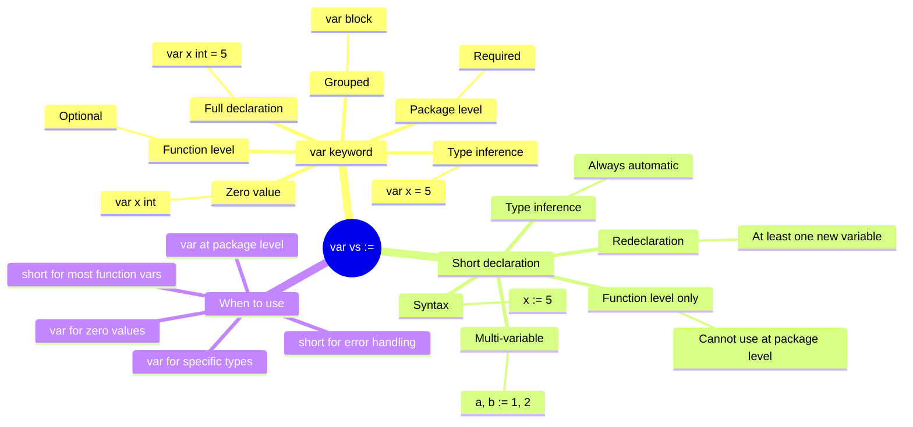
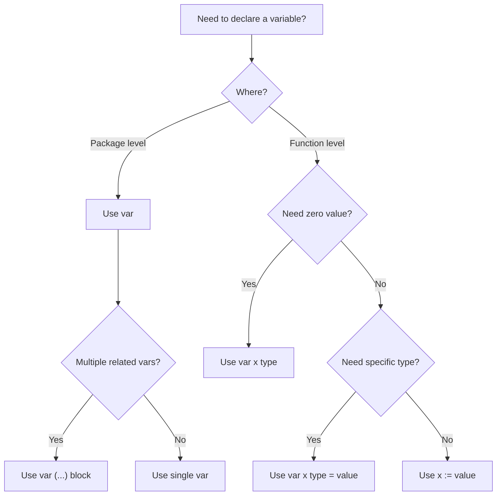
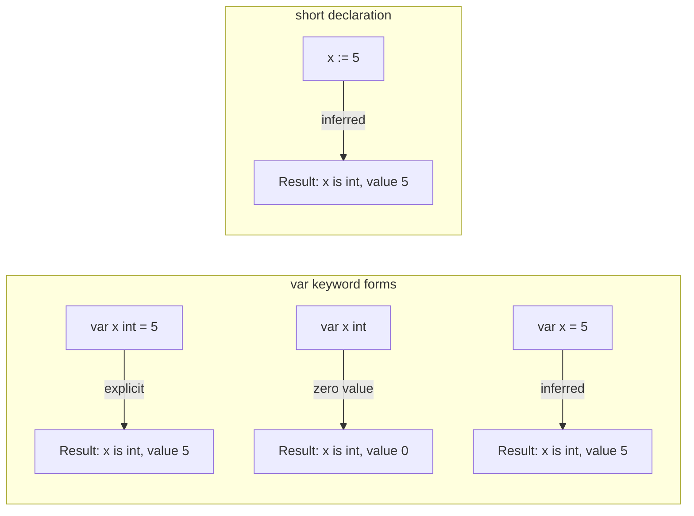

# var vs := — Junior Level

## Table of Contents

1. [Introduction](#introduction)
2. [Prerequisites](#prerequisites)
3. [Glossary](#glossary)
4. [Core Concepts](#core-concepts)
5. [Real-World Analogies](#real-world-analogies)
6. [Mental Models](#mental-models)
7. [Pros & Cons](#pros--cons)
8. [Use Cases](#use-cases)
9. [Code Examples](#code-examples)
10. [Coding Patterns](#coding-patterns)
11. [Clean Code](#clean-code)
12. [Product Use / Feature](#product-use--feature)
13. [Error Handling](#error-handling)
14. [Security Considerations](#security-considerations)
15. [Performance Tips](#performance-tips)
16. [Metrics & Analytics](#metrics--analytics)
17. [Best Practices](#best-practices)
18. [Edge Cases & Pitfalls](#edge-cases--pitfalls)
19. [Common Mistakes](#common-mistakes)
20. [Common Misconceptions](#common-misconceptions)
21. [Tricky Points](#tricky-points)
22. [Test](#test)
23. [Tricky Questions](#tricky-questions)
24. [Cheat Sheet](#cheat-sheet)
25. [Self-Assessment Checklist](#self-assessment-checklist)
26. [Summary](#summary)
27. [What You Can Build](#what-you-can-build)
28. [Further Reading](#further-reading)
29. [Related Topics](#related-topics)
30. [Diagrams & Visual Aids](#diagrams--visual-aids)

---

## Introduction

> Focus: "What is it?" and "How to use it?"

In Go, every variable must be declared before it can be used. Go provides **two primary ways** to declare variables:

1. **`var` keyword** — the explicit, formal way to declare variables
2. **`:=` short declaration** — a concise shorthand that only works inside functions

Understanding when and how to use each form is one of the first things every Go developer needs to master. Unlike many other languages that have only one way to create a variable (like Python's `x = 5` or JavaScript's `let x = 5`), Go offers these two distinct mechanisms for good reasons — each serves a specific purpose in different contexts.

This guide will teach you what each syntax does, how to use them correctly, and when to choose one over the other.

---

## Prerequisites

- **Required:** Basic understanding of what variables are — containers that store values in a program
- **Required:** Go installed on your machine (Go 1.21+) — needed to run the examples
- **Required:** Familiarity with basic data types (int, string, bool, float64) — variables always have a type in Go
- **Helpful:** Experience with any other programming language — helps compare Go's approach to variable declaration

---

## Glossary

| Term | Definition |
|------|-----------|
| **Variable** | A named storage location in memory that holds a value of a specific type |
| **Declaration** | The act of creating a new variable, specifying its name and type |
| **Initialization** | Assigning an initial value to a variable at the time of declaration |
| **Type Inference** | The compiler automatically determines the type based on the assigned value |
| **Zero Value** | The default value Go assigns to a variable when no explicit value is given |
| **Short Declaration (`:=`)** | A concise syntax that declares and initializes a variable in one step |
| **`var` keyword** | The formal keyword used to declare variables explicitly |
| **Package-level variable** | A variable declared outside of any function, accessible throughout the package |
| **Function-level variable** | A variable declared inside a function, only accessible within that function |
| **Scope** | The region of code where a variable is accessible |
| **Redeclaration** | Using `:=` to create a new variable alongside reassigning an existing one |
| **Block** | A pair of curly braces `{}` that defines a scope |

---

## Core Concepts

### Concept 1: The `var` Keyword — Explicit Declaration

The `var` keyword is the most explicit way to declare a variable. It comes in three forms:

```go
package main

import "fmt"

func main() {
    // Form 1: Full declaration with type and value
    var name string = "Alice"

    // Form 2: Declaration with type only (uses zero value)
    var age int // age is 0

    // Form 3: Declaration with value only (type inferred)
    var score = 95.5 // float64 inferred

    fmt.Println(name, age, score)
}
```

**What it does:** Each form creates a variable. Form 1 specifies everything explicitly. Form 2 relies on Go's zero value system (every type has a default: `0` for numbers, `""` for strings, `false` for bools, `nil` for pointers). Form 3 lets the compiler figure out the type from the value.

### Concept 2: The `:=` Short Declaration

The `:=` operator declares and initializes a variable in one concise step. The type is always inferred from the right-hand side.

```go
package main

import "fmt"

func main() {
    name := "Bob"       // string
    age := 30           // int
    price := 19.99      // float64
    active := true      // bool

    fmt.Println(name, age, price, active)
}
```

**What it does:** Each `:=` creates a new variable with the type determined by the value on the right. This is the most common way to declare variables inside functions because it is shorter and easier to read.

### Concept 3: Multiple Variable Declarations with `var (...)`

When you need to declare several variables at once, Go provides a grouped syntax using parentheses:

```go
package main

import "fmt"

var (
    appName    = "MyApp"
    appVersion = "1.0.0"
    maxRetries = 3
    debugMode  = false
)

func main() {
    fmt.Println(appName, appVersion, maxRetries, debugMode)
}
```

**What it does:** The `var (...)` block groups related variable declarations together. This is especially useful at the package level for configuration values and is considered cleaner than writing separate `var` lines.

### Concept 4: Package-Level vs Function-Level

The key restriction to remember: `:=` only works inside functions. At the package level (outside any function), you must use `var`.

```go
package main

import "fmt"

// Package level — must use var
var greeting = "Hello, World!"

// This would NOT compile:
// shortGreeting := "Hi!"  // syntax error

func main() {
    // Function level — both work
    var message = "Using var"
    shortMessage := "Using :="

    fmt.Println(greeting, message, shortMessage)
}
```

**What it does:** This demonstrates the scope rule — `var` works everywhere, but `:=` is only valid inside function bodies. This is because Go's package-level declarations must be unambiguous to the parser.

---

## Real-World Analogies

| Concept | Analogy |
|---------|--------|
| **`var name string = "Alice"`** | Like filling out a formal document: "Full name: Alice, Type: String" — everything is spelled out explicitly |
| **`var age int`** (zero value) | Like getting an empty form with pre-printed defaults — a number field starts at 0, a text field starts blank |
| **`name := "Alice"`** | Like a sticky note — quick, informal, just write the name and value; the type is obvious from context |
| **`var (...)` block** | Like a registration form with multiple fields grouped together — keeps related information organized |
| **Package-level `var`** | Like a company-wide memo — everyone in the package can see it, and it must follow the formal format |
| **Function-level `:=`** | Like a personal note in your desk — quick and only you (the function) need to read it |

---

## Mental Models

### Mental Model 1: The Formality Spectrum

Think of `var` and `:=` as two ends of a formality spectrum:

- **Most formal:** `var name string = "Alice"` — says everything: keyword, name, type, value
- **Medium formal:** `var name = "Alice"` — keyword, name, value (type inferred)
- **Least formal:** `name := "Alice"` — just name and value (everything else inferred)

Choose the level of formality based on how much clarity is needed.

### Mental Model 2: The "Where Am I?" Rule

- **Outside a function?** Use `var` — it is the only option
- **Inside a function, creating a new variable?** Use `:=` — it is shorter and idiomatic
- **Inside a function, but the zero value matters?** Use `var` — it makes the intent clear

---

## Pros & Cons

### `var` Keyword

| Pros | Cons |
|------|------|
| Works everywhere (package and function level) | More verbose than `:=` |
| Makes zero-value intent explicit | Can feel repetitive for simple assignments |
| Required for package-level variables | Beginners sometimes over-specify the type |
| Supports grouped declarations `var (...)` | Longer lines of code |
| Clear when type differs from literal (e.g., `var x int64 = 5`) | |

### `:=` Short Declaration

| Pros | Cons |
|------|------|
| Concise and fast to write | Only works inside functions |
| Idiomatic Go — most Go code uses `:=` inside functions | Cannot declare without initializing |
| Reduces boilerplate | Cannot specify type explicitly |
| Natural for error handling patterns (`result, err := ...`) | Can accidentally shadow variables |
| Allows redeclaration in multi-variable assignments | Default types may surprise (`42` is `int`, not `int32`) |

---

## Use Cases

| Use Case | Recommended Syntax | Why |
|----------|-------------------|-----|
| Quick variable inside a function | `:=` | Concise, idiomatic |
| Package-level configuration | `var (...)` | Only option at package level |
| Variable with zero value | `var count int` | Makes the "start at zero" intent clear |
| Specific type needed | `var x int64 = 5` | `:=` would infer `int`, not `int64` |
| Multiple returns from function | `result, err :=` | Clean multi-assignment |
| Loop iterator | `for i := 0; ...` | Standard Go loop pattern |
| Interface variable | `var w io.Writer` | Need to declare the interface type |

---

## Code Examples

### Example 1: Basic `var` Declaration

```go
package main

import "fmt"

func main() {
    var name string = "Alice"
    var age int = 25
    var height float64 = 5.6
    var active bool = true

    fmt.Printf("Name: %s, Age: %d, Height: %.1f, Active: %t\n",
        name, age, height, active)
}
```

**What it does:** Declares four variables with explicit types and values. Each variable's type is written out, making the code very readable but also verbose.

### Example 2: Zero Values

```go
package main

import "fmt"

func main() {
    var i int
    var f float64
    var b bool
    var s string

    fmt.Printf("int: %d, float64: %f, bool: %t, string: %q\n", i, f, b, s)
}
```

**What it does:** Shows Go's zero values — `int` defaults to `0`, `float64` to `0.0`, `bool` to `false`, and `string` to `""` (empty string). This is useful when you want a variable to start at its "empty" state.

### Example 3: Short Declaration with `:=`

```go
package main

import "fmt"

func main() {
    name := "Bob"
    age := 30
    temperature := 36.6
    isOnline := true

    fmt.Println(name, age, temperature, isOnline)
}
```

**What it does:** Creates four variables using short declaration. The compiler infers the types: `string`, `int`, `float64`, and `bool`. This is the most common pattern inside Go functions.

### Example 4: Grouped `var` Block

```go
package main

import "fmt"

var (
    dbHost     = "localhost"
    dbPort     = 5432
    dbUser     = "admin"
    dbPassword = "secret"
    dbName     = "myapp"
)

func main() {
    fmt.Printf("Connecting to %s:%d as %s\n", dbHost, dbPort, dbUser)
}
```

**What it does:** Groups related database configuration variables in a single `var` block at the package level. This is a common pattern for configuration constants and package-wide variables.

### Example 5: Multiple Assignment with `:=`

```go
package main

import (
    "fmt"
    "os"
)

func main() {
    file, err := os.Open("test.txt")
    if err != nil {
        fmt.Println("Error:", err)
        return
    }
    defer file.Close()

    info, err := file.Stat() // err is redeclared (reassigned)
    if err != nil {
        fmt.Println("Error:", err)
        return
    }

    fmt.Println("File size:", info.Size())
}
```

**What it does:** Shows the common error-handling pattern with `:=`. In the second `:=`, `info` is a new variable but `err` is reassigned (not re-declared) because it already exists in the same scope. Go allows this as long as at least one variable on the left is new.

### Example 6: Type Inference

```go
package main

import "fmt"

func main() {
    a := 42          // int (not int32 or int64)
    b := 3.14        // float64 (not float32)
    c := "hello"     // string
    d := 'A'         // int32 (rune)
    e := true        // bool
    f := 2 + 3i      // complex128

    fmt.Printf("a: %T, b: %T, c: %T, d: %T, e: %T, f: %T\n",
        a, b, c, d, e, f)
}
```

**What it does:** Demonstrates the default types Go infers for different literal values. Pay attention to `'A'` which becomes `int32` (rune), not `byte` or `string`. The `%T` format verb prints the type.

### Example 7: When `var` is Better Than `:=`

```go
package main

import "fmt"

func main() {
    // You want a specific type that differs from the default
    var smallNum int8 = 42   // := would give int
    var bigFloat float32 = 3.14 // := would give float64

    // You want zero value with clear intent
    var count int    // clearly starting from zero
    var message string // clearly starting empty

    fmt.Println(smallNum, bigFloat, count, message)
}
```

**What it does:** Shows scenarios where `var` is preferred over `:=`. When you need a specific numeric type or want to make zero-value intent obvious, `var` is the better choice.

---

## Coding Patterns

### Pattern 1: The Error-Check Pattern

```go
result, err := someFunction()
if err != nil {
    return err
}
```

This is the most common Go pattern. The `:=` operator perfectly fits multi-return functions.

### Pattern 2: The If-Init Pattern

```go
if value, ok := myMap[key]; ok {
    fmt.Println("Found:", value)
}
// value and ok are not accessible here
```

Declares variables directly in the `if` statement. The variables are scoped to the `if` block.

### Pattern 3: The Accumulator Pattern

```go
var total int // zero value: 0
for _, v := range numbers {
    total += v
}
```

Uses `var` to make the starting value explicit, then accumulates inside a loop.

---

## Clean Code

| Rule | Good | Bad |
|------|------|-----|
| Use `:=` inside functions | `name := "Alice"` | `var name string = "Alice"` |
| Use `var` for zero values | `var count int` | `count := 0` |
| Use `var` at package level | `var MaxSize = 1024` | N/A (`:=` not allowed) |
| Use `var` for interfaces | `var w io.Writer` | N/A |
| Group related vars | `var (a = 1; b = 2)` | `var a = 1` then `var b = 2` |
| Do not over-specify types | `var name = "Alice"` | `var name string = "Alice"` (when type is obvious) |

---

## Product Use / Feature

| Scenario | How `var` / `:=` is Used |
|----------|--------------------------|
| Web server setup | `var server http.Server` for configuration, then `:=` inside handlers |
| CLI tool flags | `var verbose bool` at package level with `flag` package |
| Database connection | `db, err := sql.Open(...)` inside init functions |
| JSON parsing | `var result map[string]interface{}` when the structure is unknown |
| Configuration | `var (...)` block for environment-based config values |

---

## Error Handling

The most common use of `:=` in Go is with error handling:

```go
package main

import (
    "encoding/json"
    "fmt"
)

func main() {
    data := []byte(`{"name": "Alice", "age": 30}`)

    var result map[string]interface{}
    err := json.Unmarshal(data, &result)
    if err != nil {
        fmt.Println("JSON error:", err)
        return
    }

    name, ok := result["name"].(string)
    if !ok {
        fmt.Println("name is not a string")
        return
    }

    fmt.Println("Name:", name)
}
```

**Key point:** Notice how `var result` is used because we need to declare the map type before passing its address to `json.Unmarshal`, while `:=` is used for the simple `err` and type-assertion assignments.

---

## Security Considerations

| Consideration | Explanation |
|--------------|-------------|
| Sensitive data in variables | Strings are immutable in Go — once a password is stored in a string variable, it stays in memory until GC collects it. Consider `[]byte` for sensitive data so you can zero it out manually. |
| Package-level variables | Package-level `var` declarations are accessible to all files in the package. Avoid storing secrets in exported package variables. |
| Zero values as defaults | Go's zero values can be a security feature — booleans default to `false`, so a `var isAdmin bool` starts as not-admin. |

---

## Performance Tips

| Tip | Explanation |
|-----|-------------|
| `:=` vs `var` is identical at runtime | The compiler produces the same code for both. Choose based on readability, not performance. |
| Declare variables close to usage | Helps the compiler with register allocation and keeps values in cache. |
| Use `var` for slices you will append to | `var items []string` creates a nil slice; `items := []string{}` creates an empty slice. Both work with `append`, but nil avoids an allocation. |

---

## Metrics & Analytics

| Metric | `var` | `:=` |
|--------|------|------|
| Compilation speed | Same | Same |
| Runtime performance | Same | Same |
| Code readability (inside functions) | Lower | Higher |
| Code readability (package level) | Only option | N/A |
| Lines of code | More | Fewer |

---

## Best Practices

1. **Use `:=` as the default inside functions** — it is the idiomatic Go style
2. **Use `var` when you want zero values** — `var count int` is clearer than `count := 0`
3. **Use `var` at the package level** — it is required and should be in `var (...)` blocks
4. **Use `var` when you need a specific type** — `var x int64 = 42` instead of guessing
5. **Do not mix `var` and `:=` randomly** — be consistent within a function
6. **Declare variables as close to their use as possible** — improves readability
7. **Use `:=` in `if` init statements** — `if err := doSomething(); err != nil {`

---

## Edge Cases & Pitfalls

### Pitfall 1: `:=` Cannot Be Used at Package Level

```go
package main

// This will NOT compile
// name := "Alice"  // syntax error: non-declaration statement outside function body

var name = "Alice" // This works

func main() {}
```

### Pitfall 2: `:=` Requires At Least One New Variable

```go
package main

func main() {
    x := 10
    // x := 20  // error: no new variables on left side of :=
    x = 20 // This works (assignment, not declaration)
    _ = x
}
```

### Pitfall 3: Variable Shadowing

```go
package main

import "fmt"

func main() {
    x := 10
    if true {
        x := 20 // This creates a NEW x, does not modify the outer x
        fmt.Println("Inner x:", x) // 20
    }
    fmt.Println("Outer x:", x) // 10 — unchanged!
}
```

---

## Common Mistakes

| Mistake | Problem | Fix |
|---------|---------|-----|
| Using `:=` outside a function | Compilation error | Use `var` at package level |
| Redeclaring with `:=` when no new vars exist | `no new variables on left side of :=` | Use `=` for reassignment |
| Accidentally shadowing with `:=` | Outer variable unchanged | Use `=` to assign to existing variable |
| Over-specifying types with `var` | `var x int = 5` is redundant | Use `var x = 5` or `x := 5` |
| Assuming `:=` always creates new variables | In multi-assign, existing vars are reassigned | Know the redeclaration rules |
| Using `var x = 0` instead of `var x int` | Less clear intent | Use zero-value form for clarity |

---

## Common Misconceptions

| Misconception | Reality |
|--------------|---------|
| `:=` is faster than `var` | Both produce identical compiled code. There is zero performance difference. |
| `var` is old-fashioned / should be avoided | `var` has specific use cases where it is the correct choice (zero values, package level, interface types). |
| `:=` creates a pointer or reference | `:=` creates a regular variable, same as `var`. The value semantics are identical. |
| You cannot redeclare with `:=` | You can, as long as at least one variable on the left is new and the rest are in the same scope. |
| `var x int` and `x := 0` are identical | Semantically yes, but `var x int` signals "I want the zero value" while `x := 0` says "I chose zero specifically." |

---

## Tricky Points

### Tricky Point 1: Redeclaration Rules

```go
package main

import "fmt"

func main() {
    a, b := 1, 2
    fmt.Println(a, b) // 1 2

    // b already exists, but c is new — this is valid
    b, c := 3, 4
    fmt.Println(a, b, c) // 1 3 4
}
```

With `:=`, if at least one variable on the left is new, the others are reassigned (not redeclared).

### Tricky Point 2: Default Types for Literals

```go
package main

import "fmt"

func main() {
    x := 42      // int (platform-dependent: 32 or 64 bit)
    y := 42.0    // float64 (not float32)
    z := 'A'     // int32 / rune (not byte, not string)
    w := "A"     // string

    fmt.Printf("%T %T %T %T\n", x, y, z, w)
}
```

Beginners often expect `'A'` to be a string or byte — it is actually `int32` (rune).

---

## Test

### Question 1

What is the zero value of a `string` variable declared with `var s string`?

- A) `nil`
- B) `"nil"`
- C) `""`
- D) `" "`

<details>
<summary>Answer</summary>

**C) `""`** — The zero value of a string in Go is an empty string, not nil. Only pointers, slices, maps, channels, interfaces, and functions have `nil` as their zero value.

</details>

### Question 2

Which of the following is valid Go code?

- A) `name := "Alice"` at package level
- B) `var name = "Alice"` at package level
- C) Both A and B
- D) Neither A nor B

<details>
<summary>Answer</summary>

**B) `var name = "Alice"` at package level** — The `:=` short declaration operator cannot be used at the package level. Only `var` declarations are allowed outside of functions.

</details>

### Question 3

What happens with this code?

```go
x := 10
x := 20
```

- A) `x` becomes 20
- B) Compilation error: no new variables on left side of `:=`
- C) Compilation error: `x` already declared
- D) Runtime panic

<details>
<summary>Answer</summary>

**B) Compilation error: no new variables on left side of `:=`** — When using `:=`, at least one variable on the left must be new. Since `x` already exists and it is the only variable, `:=` fails.

</details>

### Question 4

What type does `x := 3.14` infer?

- A) `float32`
- B) `float64`
- C) `double`
- D) `decimal`

<details>
<summary>Answer</summary>

**B) `float64`** — Go's default type for floating-point literals is `float64`. There is no `double` or `decimal` type in Go.

</details>

### Question 5

What is the output?

```go
x := 10
if true {
    x := 20
    _ = x
}
fmt.Println(x)
```

- A) 20
- B) 10
- C) Compilation error
- D) 0

<details>
<summary>Answer</summary>

**B) 10** — The `x := 20` inside the `if` block creates a new variable `x` that shadows the outer `x`. The outer `x` remains 10.

</details>

---

## Tricky Questions

### Question 1

```go
a, b := 1, 2
b, c := 3, 4
```

Is this valid? What are the final values of `a`, `b`, and `c`?

<details>
<summary>Answer</summary>

**Yes, it is valid.** In the second `:=`, `c` is a new variable, so Go allows `b` to be reassigned. Final values: `a = 1`, `b = 3`, `c = 4`.

</details>

### Question 2

```go
var x int
x := 5
```

Does this compile?

<details>
<summary>Answer</summary>

**No.** `x` is already declared with `var`, and `:=` with a single variable requires that variable to be new. This gives `no new variables on left side of :=`.

</details>

### Question 3

```go
var x = 5
var y int = 5
var z int
z = 5
```

Are `x`, `y`, and `z` all the same type and value?

<details>
<summary>Answer</summary>

**Yes.** All three are `int` with value `5`. The first uses type inference, the second is explicit, and the third uses zero value then assignment.

</details>

---

## Cheat Sheet

| Syntax | Where | Zero Value? | Type Inference? | Example |
|--------|-------|-------------|-----------------|---------|
| `var x type = value` | Anywhere | No | No | `var x int = 5` |
| `var x type` | Anywhere | Yes | No | `var x int` |
| `var x = value` | Anywhere | No | Yes | `var x = 5` |
| `x := value` | Inside functions only | No | Yes | `x := 5` |
| `var (...)` | Anywhere | Both | Both | `var (x = 5; y int)` |
| `x, y := v1, v2` | Inside functions only | No | Yes | `x, y := 1, "hi"` |

---

## Self-Assessment Checklist

- [ ] I can declare a variable with `var` in all three forms
- [ ] I can use `:=` to declare variables inside functions
- [ ] I know why `:=` cannot be used at package level
- [ ] I understand Go's zero value system
- [ ] I can use `var (...)` blocks for grouped declarations
- [ ] I know the default types for integer, float, rune, and string literals
- [ ] I can explain the redeclaration rule with `:=`
- [ ] I understand variable shadowing and how to avoid it
- [ ] I know when to use `var` vs `:=` in different situations
- [ ] I can use the if-init pattern with `:=`

---

## Summary

- **`var`** is the formal, explicit way to declare variables. It works at both the package and function level, supports zero values, and allows you to specify exact types.
- **`:=`** is the short declaration operator. It is concise, idiomatic, and the preferred way to declare variables inside functions. It always requires an initial value and infers the type.
- **Use `:=` by default inside functions** — it is the Go community standard.
- **Use `var` when you need zero values**, specific types, package-level variables, or interface types.
- Both produce **identical compiled code** — choose based on clarity, not performance.
- **Watch out for variable shadowing** when using `:=` inside nested blocks.

---

## What You Can Build

With a solid understanding of `var` and `:=`, you can:

- Write clean Go functions with proper variable declarations
- Handle multi-return functions with `result, err :=` patterns
- Create well-organized package-level configuration with `var (...)` blocks
- Use the `if-init` pattern for scoped variables
- Start building any Go program — variable declaration is the foundation of everything

---

## Further Reading

- [A Tour of Go — Variables](https://go.dev/tour/basics/8)
- [A Tour of Go — Short Variable Declarations](https://go.dev/tour/basics/10)
- [Effective Go — Variables](https://go.dev/doc/effective_go#variables)
- [Go Specification — Variable Declarations](https://go.dev/ref/spec#Variable_declarations)
- [Go Specification — Short Variable Declarations](https://go.dev/ref/spec#Short_variable_declarations)
- [Go Blog — Declaration Syntax](https://go.dev/blog/declaration-syntax)

---

## Related Topics

| Topic | Relationship |
|-------|-------------|
| [Zero Values](../../01-variables-and-constants/02-zero-values/) | Every `var` declaration without a value uses zero values |
| [Constants & iota](../../01-variables-and-constants/03-const-and-iota/) | `const` is the third declaration keyword in Go |
| [Scope & Shadowing](../../01-variables-and-constants/04-scope-and-shadowing/) | Understanding how `:=` can shadow variables |
| [Data Types](../../02-data-types/) | Type inference with `:=` depends on literal types |
| [Type Conversion](../../02-data-types/05-type-conversion/) | When inferred types do not match, you need conversions |

---

## Diagrams & Visual Aids

### Mind Map: var vs :=



### Flowchart: Choosing Between var and :=



### Flowchart: Variable Declaration Forms


