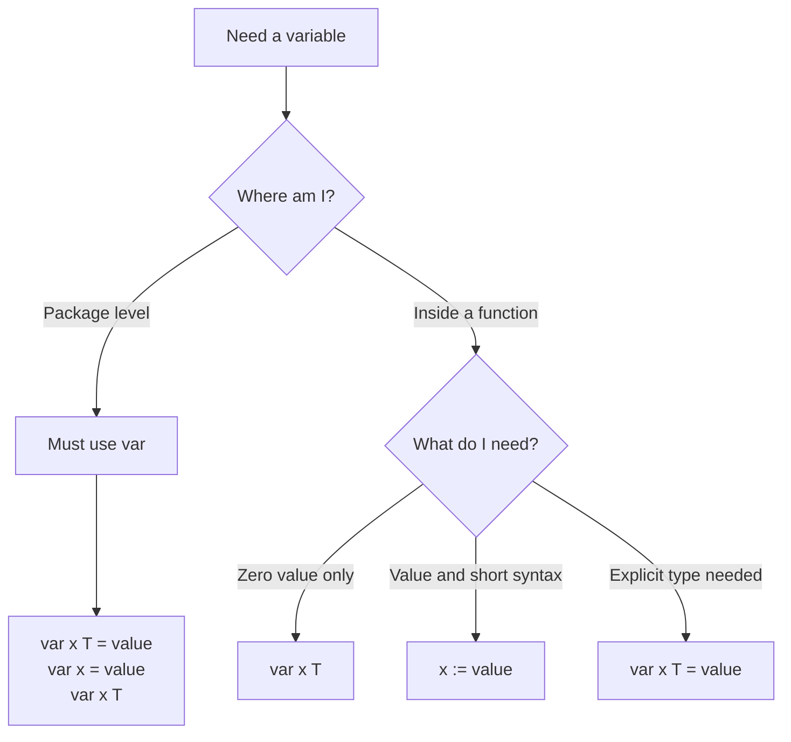
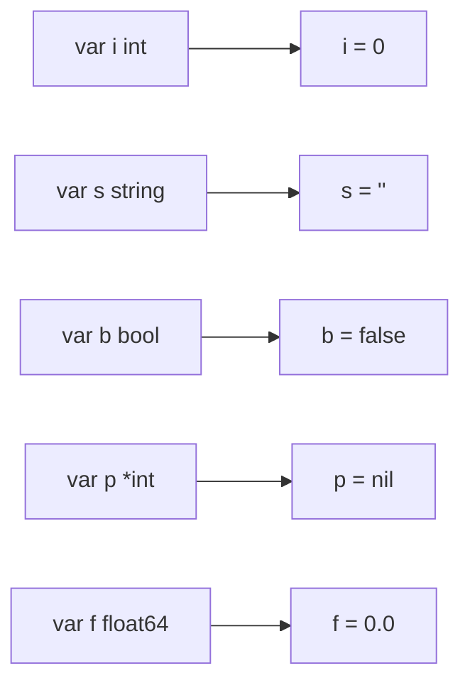
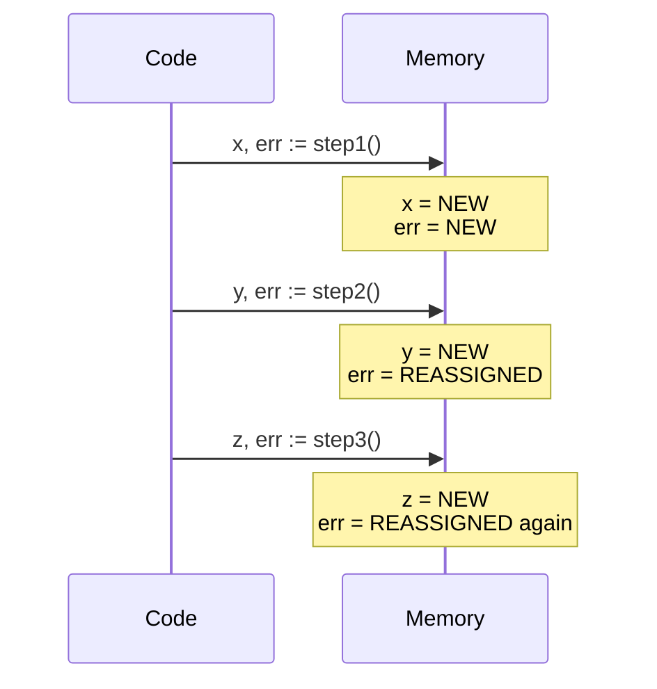

# var vs := (Short Variable Declaration) — Junior Level

## Table of Contents
1. [Introduction](#introduction)
2. [Prerequisites](#prerequisites)
3. [Glossary](#glossary)
4. [Core Concepts](#core-concepts)
5. [Real-World Analogies](#real-world-analogies)
6. [Mental Models](#mental-models)
7. [Pros & Cons](#pros--cons)
8. [Use Cases](#use-cases)
9. [Code Examples](#code-examples)
10. [Coding Patterns](#coding-patterns)
11. [Clean Code](#clean-code)
12. [Product Use / Feature](#product-use--feature)
13. [Error Handling](#error-handling)
14. [Security Considerations](#security-considerations)
15. [Performance Tips](#performance-tips)
16. [Metrics & Analytics](#metrics--analytics)
17. [Best Practices](#best-practices)
18. [Edge Cases & Pitfalls](#edge-cases--pitfalls)
19. [Common Mistakes](#common-mistakes)
20. [Common Misconceptions](#common-misconceptions)
21. [Tricky Points](#tricky-points)
22. [Test](#test)
23. [Tricky Questions](#tricky-questions)
24. [Cheat Sheet](#cheat-sheet)
25. [Self-Assessment Checklist](#self-assessment-checklist)
26. [Summary](#summary)
27. [What You Can Build](#what-you-can-build)
28. [Further Reading](#further-reading)
29. [Related Topics](#related-topics)
30. [Diagrams & Visual Aids](#diagrams--visual-aids)

---

## Introduction
> Focus: "What is it?" and "How to use it?"

Go gives you two ways to declare variables: the `var` keyword and the short declaration operator `:=`. If you are coming from Python, JavaScript, or another language, this might feel odd at first — why have two ways to do the same thing? The answer is that each has a specific purpose and a set of rules that makes Go code clearer and safer.

`var` is the classic, explicit form. You write `var x int = 5` and Go creates a variable named `x` of type `int` with value `5`. You can also let Go infer the type: `var x = 5`. You can even skip the value entirely and Go will give the variable its "zero value" — for `int` that is `0`, for `string` that is `""`, and for `bool` that is `false`.

`:=` is the short declaration operator. It is faster to type and reads naturally: `x := 5`. Go figures out the type automatically from the value on the right. The important rule is that `:=` can only be used **inside a function**. At the top of a file (package level), you must use `var`.

After reading this file you will be able to:
- Declare variables with both `var` and `:=`
- Understand when each is required
- Avoid the most common beginner mistakes
- Write idiomatic Go code from day one

---

## Prerequisites
- Basic understanding of what a variable is
- A working Go installation (`go version` should print output)
- Ability to run `go run main.go` from a terminal
- Familiarity with `fmt.Println`

---

## Glossary

| Term | Definition |
|------|-----------|
| **Declaration** | Telling Go that a variable exists and what type it is |
| **Initialization** | Giving a variable its first value |
| **Type inference** | Go figuring out the type from the value you provide |
| **Zero value** | The default value Go assigns when no value is given (`0`, `""`, `false`, `nil`) |
| **Package level** | Code written outside any function, at the top of the file |
| **Function level** | Code written inside a function body `{}` |
| **Scope** | The region of code where a variable is visible and usable |
| **Short declaration** | Using `:=` to declare and initialize a variable in one step |
| **Blank identifier** | The underscore `_` used to discard a value you do not need |

---

## Core Concepts

### The `var` Keyword

`var` has four forms:

```go
// Form 1: explicit type and value
var age int = 25

// Form 2: type inferred from value (Go figures out it's an int)
var age2 = 25

// Form 3: zero value (age3 becomes 0 automatically)
var age3 int

// Form 4: group declaration
var (
    name   string = "Alice"
    age4   int    = 25
    active bool   = true
)
```

### The Short Declaration Operator `:=`

```go
func main() {
    // Declare and initialize in one step
    age := 25
    name := "Alice"
    active := true

    fmt.Println(age, name, active)
}
```

`:=` does two things at once:
1. Declares the variable (tells Go it exists)
2. Initializes it (gives it the value on the right)

### The Golden Rule

```
var  → can be used anywhere (package level OR inside functions)
:=   → can ONLY be used inside functions
```

### Zero Values

When you declare a variable with `var` but do not give it a value, Go sets it to the zero value for that type:

```go
var i int       // i = 0
var f float64   // f = 0.0
var s string    // s = ""
var b bool      // b = false
var p *int      // p = nil
```

---

## Real-World Analogies

**Analogy 1 — Filling a form**

`var name string = "Alice"` is like filling a form completely: you write the field name, specify what kind of field it is (text), and write the value.

`name := "Alice"` is like a sticky note: you just write "name: Alice" quickly without a formal form. The sticky note is useful inside your office (inside a function) but the company database (package level) requires the formal form.

**Analogy 2 — A labeled box**

`var box int` creates an empty labeled box. The label says "box" and it holds integers. The box is empty (zero value = 0) until you put something in it.

`box := 42` creates a new labeled box AND immediately puts `42` inside it, all in one action.

**Analogy 3 — Whiteboard vs notebook**

`var` is like a notebook entry — formal, can be written on any page (anywhere in the program).
`:=` is like a quick whiteboard note — fast and convenient, but only valid in the meeting room (inside the function).

---

## Mental Models

### Model 1: Scope Boundaries

```
Package Level (outside functions)
├── var x int = 5       OK - allowed
├── x := 5              ERROR - NOT allowed
│
└── func main() {
        var y int = 10  OK - allowed
        y2 := 10        OK - allowed (inside function)
    }
```

### Model 2: The Declaration Checklist

When you need a variable, ask yourself:
1. Am I inside a function? → Yes → use `:=` (usually)
2. Do I need only a zero value? → Yes → use `var x int`
3. Is the type important for clarity? → Yes → use `var x int = value`
4. Am I at package level? → Yes → must use `var`

---

## Pros & Cons

### `var` Keyword

| Pros | Cons |
|------|------|
| Works everywhere (package + function level) | More verbose to type |
| Explicit — type is clearly visible | Can feel redundant when type is obvious |
| Great for zero-value declarations | Slightly more characters |
| Clearer intent when type matters | |

### `:=` Short Declaration

| Pros | Cons |
|------|------|
| Concise and fast to write | Only works inside functions |
| Reduces repetition (no need to repeat type) | Can hide the type from a quick reader |
| Idiomatic Go style | Can accidentally shadow variables |
| Natural for multiple return values | Requires at least one new variable on the left |

---

## Use Cases

### When to use `var`

```go
// 1. Package-level variables
var Version = "1.0.0"
var MaxRetries = 3

// 2. Zero-value initialization (intent is clear)
var count int
var buffer []byte

// 3. When type needs to be explicit
var timeout time.Duration = 30 * time.Second

// 4. Group related variables
var (
    host  = "localhost"
    port  = 8080
    debug = false
)
```

### When to use `:=`

```go
func processUser(id int) error {
    // 1. Quick local variables
    name := "Alice"

    // 2. Function return values
    user, err := fetchUser(id)
    if err != nil {
        return err
    }

    // 3. Loop variables
    for i := 0; i < 10; i++ {
        fmt.Println(i)
    }

    // 4. If-init statements
    if score := calculateScore(user); score > 100 {
        fmt.Println("High score!")
    }

    _ = name
    return nil
}
```

---

## Code Examples

### Example 1: Basic declarations

```go
package main

import "fmt"

func main() {
    // Using var with explicit type
    var firstName string = "Alice"

    // Using var with type inference
    var lastName = "Smith"

    // Using short declaration
    age := 30

    // Zero value declaration
    var score int // score is 0

    fmt.Println(firstName, lastName, age, score)
    // Output: Alice Smith 30 0
}
```

### Example 2: Multiple variables at once

```go
package main

import "fmt"

func main() {
    // Short declaration with multiple variables
    x, y := 10, 20

    // Swap values
    x, y = y, x

    fmt.Println(x, y) // Output: 20 10

    // Multiple var block
    var (
        width  int    = 100
        height int    = 200
        title  string = "Window"
    )

    fmt.Println(width, height, title)
    // Output: 100 200 Window
}
```

### Example 3: Package-level variable

```go
package main

import "fmt"

// Package-level: must use var
var appName = "MyApp"
var version = "1.0.0"

func main() {
    // Function-level: can use :=
    greeting := "Hello from " + appName
    fmt.Println(greeting)
    fmt.Println("Version:", version)
}
```

### Example 4: Zero values in action

```go
package main

import "fmt"

func main() {
    var name string
    var count int
    var ratio float64
    var active bool

    fmt.Printf("name=%q count=%d ratio=%f active=%v\n",
        name, count, ratio, active)
    // Output: name="" count=0 ratio=0.000000 active=false

    // Assign values
    name = "Bob"
    count = 5
    ratio = 3.14
    active = true

    fmt.Printf("name=%q count=%d ratio=%f active=%v\n",
        name, count, ratio, active)
    // Output: name="Bob" count=5 ratio=3.140000 active=true
}
```

### Example 5: Blank identifier

```go
package main

import (
    "fmt"
    "os"
)

func main() {
    // We only care about the error, not the file object
    _, err := os.Open("nonexistent.txt")
    if err != nil {
        fmt.Println("Error:", err)
    }
}
```

---

## Coding Patterns

### Pattern 1: Declare-then-assign

```go
// Use when the value is computed after some logic
var result int
if someCondition {
    result = 10
} else {
    result = 20
}
fmt.Println(result)
```

### Pattern 2: Inline declaration in if

```go
// Limit the variable scope to just the if block
if err := doSomething(); err != nil {
    fmt.Println("error:", err)
}
// err is NOT accessible here
```

### Pattern 3: Re-use err with `:=` and multiple returns

```go
func main() {
    // First call — both a and err are new
    a, err := strconv.Atoi("10")
    if err != nil {
        return
    }

    // Second call — b is new, err is re-assigned (not re-declared)
    b, err := strconv.Atoi("20")
    if err != nil {
        return
    }

    fmt.Println(a + b) // 30
}
```

---

## Clean Code

### Rule 1: Use the shortest form that is still clear

```go
// Verbose — type is obvious from value
var name string = "Alice"  // redundant type annotation

// Better inside a function
name := "Alice"

// Or at package level
var name2 = "Alice"
```

### Rule 2: Group related package-level vars

```go
// Scattered — hard to read
var host = "localhost"
var port = 8080
var timeout = 30

// Grouped — clear and organized
var (
    host2    = "localhost"
    port2    = 8080
    timeout2 = 30
)
```

### Rule 3: Prefer zero-value declarations when appropriate

```go
// Unnecessary initialization
var count int = 0  // 0 is already the zero value

// Clean
var count2 int     // clearly zero, intent is explicit
```

---

## Product Use / Feature

In a real web server, you might see:

```go
package main

import (
    "fmt"
    "net/http"
)

// Package-level configuration (var, because package level)
var (
    serverHost = "0.0.0.0"
    serverPort = "8080"
)

func handleHome(w http.ResponseWriter, r *http.Request) {
    // Local variable with :=
    message := "Welcome to the homepage!"
    fmt.Fprintln(w, message)
}

func main() {
    addr := serverHost + ":" + serverPort
    fmt.Println("Starting server on", addr)
    http.HandleFunc("/", handleHome)
    http.ListenAndServe(addr, nil)
}
```

---

## Error Handling

A very common Go pattern uses `:=` with multiple return values including an error:

```go
package main

import (
    "fmt"
    "strconv"
)

func main() {
    input := "42"

    // := is perfect here — two new variables in one line
    number, err := strconv.Atoi(input)
    if err != nil {
        fmt.Println("Could not convert:", err)
        return
    }

    fmt.Println("Converted number:", number)
    // Output: Converted number: 42
}
```

When calling multiple functions that return errors, `err` can be re-used:

```go
package main

import (
    "fmt"
    "strconv"
)

func main() {
    a, err := strconv.Atoi("10")
    if err != nil {
        fmt.Println(err)
        return
    }

    // err is re-assigned (not re-declared), b is new
    b, err := strconv.Atoi("20")
    if err != nil {
        fmt.Println(err)
        return
    }

    fmt.Println(a + b) // Output: 30
}
```

---

## Security Considerations

**Avoid accidental shadowing of security-sensitive values:**

```go
// DANGEROUS — shadowing makes the outer valid never change
func validate(token string) bool {
    valid := false
    if token != "" {
        valid := true  // BUG: shadows outer valid
        _ = valid
    }
    return valid // always returns false!
}

// CORRECT — assign to outer variable
func validateFixed(token string) bool {
    valid := false
    if token != "" {
        valid = true  // assigns to outer valid
    }
    return valid
}
```

**Zero values are safe:** Go always initializes variables. You will never read garbage memory from an uninitialized variable, unlike C or C++.

---

## Performance Tips

- For a beginner, there is **no meaningful performance difference** between `var` and `:=`. Both compile to equivalent machine code.
- The compiler decides whether to place the variable on the stack or heap based on how it is used — not based on whether you used `var` or `:=`.
- Focus on correctness and readability first. Performance optimization comes later.

---

## Metrics & Analytics

For beginner projects, variable declaration style does not directly affect runtime performance metrics. However, code clarity affects team velocity (how fast your team can understand and modify code). Clear variable declarations reduce code review time and lower the barrier for new contributors.

---

## Best Practices

1. **Use `:=` for local variables inside functions** — it is the idiomatic Go style.
2. **Use `var` at package level** — `:=` is not allowed there anyway.
3. **Use `var x T` for zero-value initialization** — signals intent clearly.
4. **Use grouped `var (...)` blocks** for related package-level variables.
5. **Never ignore errors** — always assign `err` and check it.
6. **Use `_`** to explicitly discard values you do not need.
7. **Do not repeat the type when it is obvious** — `var x int = 5` is redundant; prefer `x := 5`.

---

## Edge Cases & Pitfalls

### Pitfall 1: `:=` at package level

```go
package main

x := 10 // COMPILE ERROR: non-declaration statement outside function body

func main() {}
```

Fix: use `var x = 10`

### Pitfall 2: Shadowing with `:=`

```go
func main() {
    x := 10
    fmt.Println(x) // 10

    {
        x := 20    // new variable x, shadows outer x
        fmt.Println(x) // 20
    }

    fmt.Println(x) // still 10 — outer x was NOT changed
}
```

### Pitfall 3: `:=` requires at least one new variable

```go
func main() {
    x := 5
    x := 10 // COMPILE ERROR: no new variables on left side of :=
}
```

Fix: use `x = 10` (plain assignment)

---

## Common Mistakes

| Mistake | Wrong Code | Correct Code |
|---------|-----------|--------------|
| Using `:=` at package level | `x := 5` outside function | `var x = 5` |
| Redeclaring with `:=` | `x := 5; x := 10` | `x := 5; x = 10` |
| Assuming `var x int` has garbage | Don't check zero value | It is safely `0` |
| Shadowing unintentionally | `:=` inside inner scope when outer should update | Use `=` instead |

---

## Common Misconceptions

**Misconception 1: "`:=` and `var` produce different types of variables"**
False. Both create the same kind of variable. The difference is purely syntactic.

**Misconception 2: "`var` variables are global"**
False. `var` inside a function is still local to that function. Only `var` at package level is accessible across the package.

**Misconception 3: "`:=` is always better because it's shorter"**
False. Sometimes `var` is clearer, especially for zero-value declarations or when the type needs to be explicit.

**Misconception 4: "You can re-declare a variable with `:=`"**
Partially false. `:=` re-assigns an existing variable only if at least one other variable on the left is new. Otherwise it is a compile error.

---

## Tricky Points

### The `:=` re-use rule

```go
func main() {
    x, err := doA()   // x and err are NEW
    y, err := doB()   // y is NEW, err is RE-ASSIGNED (not re-declared)
    z, err := doC()   // z is NEW, err is RE-ASSIGNED again
    fmt.Println(x, y, z, err)
}
```

This is why `:=` is so convenient for error-handling chains.

### The if-init scope

```go
func main() {
    if x := 42; x > 10 {
        fmt.Println("big:", x)
    }
    // x is NOT accessible here
}
```

---

## Test

### Multiple Choice

**1. Where can you use `:=`?**
- a) Only at package level
- b) Only inside functions
- c) Anywhere
- d) Only inside `if` statements

**Answer: b**

**2. What is the zero value of a `string` in Go?**
- a) `nil`
- b) `0`
- c) `""`
- d) `" "`

**Answer: c**

**3. Which of the following is a valid package-level declaration?**
- a) `x := 5`
- b) `var x = 5`
- c) `x = 5`
- d) `int x = 5`

**Answer: b**

**4. What does this code print?**
```go
x := 5
{
    x := 10
    fmt.Println(x)
}
fmt.Println(x)
```
- a) 5 then 5
- b) 10 then 10
- c) 10 then 5
- d) Compile error

**Answer: c**

**5. Which line causes a compile error?**
```go
a := 1      // line 1
b := 2      // line 2
a, b := 3, 4 // line 3
```
- a) Line 1
- b) Line 2
- c) Line 3
- d) No error

**Answer: c — no new variable on the left side**

---

## Tricky Questions

**Q1: Can you use `var` inside a function?**
Yes. `var` works both at package level and inside functions. `var x int = 5` is valid inside `main()`.

**Q2: What happens when you declare `var x int` and then print it without assigning a value?**
Go prints `0` — the zero value for `int`. No error or panic.

**Q3: Is `var x = 5` the same as `x := 5`?**
Inside a function, they produce the same result. The difference is that `var x = 5` can also be used at package level while `x := 5` cannot.

**Q4: Can you use `_` on the left side of `:=`?**
Yes. `_, err := os.Open("file")` discards the first return value.

**Q5: Does `:=` always create a new variable?**
Not always. If a variable with that name already exists in the same scope and at least one other new variable is present, `:=` re-assigns the existing one. If all variables on the left already exist, it is a compile error.

---

## Cheat Sheet

```
SYNTAX QUICK REFERENCE
───────────────────────────────────────────────
var x int = 5       explicit type + value
var x = 5           type inferred
var x int           zero value (x = 0)
x := 5              short (only in functions)

var (               group declaration
    x int
    y string
)

a, b := 1, 2        multiple assignment
_, err := f()       blank identifier

RULES
───────────────────────────────────────────────
:= only inside functions
var anywhere
:= needs at least one NEW variable on left
zero values: int=0, string="", bool=false, ptr=nil

WHEN TO USE WHICH
───────────────────────────────────────────────
Package level    -> var
Zero value only  -> var x T
Quick local var  -> :=
Multiple returns -> :=
Type clarity     -> var x T = value
```

---

## Self-Assessment Checklist

- [ ] I can declare a variable using `var` with explicit type
- [ ] I can declare a variable using `var` with type inference
- [ ] I can declare a variable using `var` for zero value
- [ ] I can use `:=` inside a function
- [ ] I know that `:=` cannot be used at package level
- [ ] I understand zero values for `int`, `string`, `bool`, `pointer`
- [ ] I can use the blank identifier `_`
- [ ] I can declare multiple variables at once with `:=`
- [ ] I can use grouped `var (...)` blocks
- [ ] I understand the shadowing pitfall

---

## Summary

Go provides two syntaxes for variable declaration:

- `var` is the explicit, keyword-based form. It works everywhere — package level and inside functions. Use it for zero-value declarations, when type clarity matters, and always at package level.
- `:=` is the short declaration operator. It is concise and idiomatic for local variables inside functions. It cannot be used at package level.

Both forms are correct Go — the choice is about context and clarity. Use `:=` inside functions for most local variables, and `var` at package level.

---

## What You Can Build

With variable declaration knowledge you can:
- Write any Go function that holds local state
- Store HTTP request data, user input, configuration values
- Handle errors from file I/O, network calls, database queries
- Build counters, accumulators, and state machines
- Write any program that needs to remember values between steps

---

## Further Reading

- [Go Tour — Variables](https://tour.golang.org/basics/8)
- [Effective Go — Variables](https://go.dev/doc/effective_go#variables)
- [Go Specification — Short variable declarations](https://go.dev/ref/spec#Short_variable_declarations)
- [Go Specification — Variable declarations](https://go.dev/ref/spec#Variable_declarations)

---

## Related Topics

- Constants (`const`) — immutable values in Go
- Types — Go's type system and type inference
- Scope — how variable visibility works in Go
- Functions — where `:=` lives and breathes
- Error handling — the most common use of `:=` with multiple returns

---

## Diagrams & Visual Aids

### Diagram 1: Where each declaration is allowed



### Diagram 2: Zero values by type



### Diagram 3: The `:=` re-use rule


