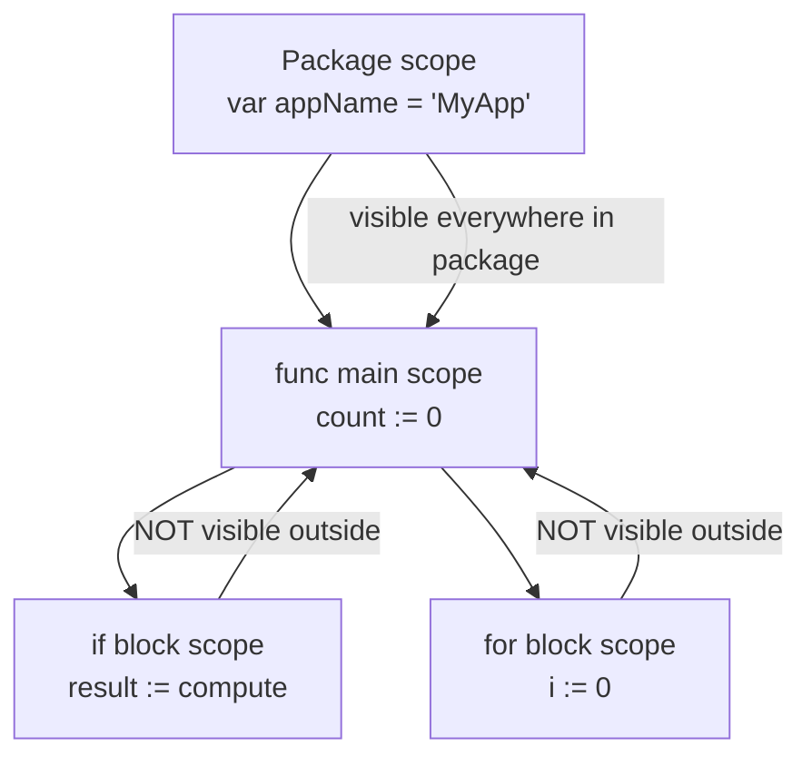
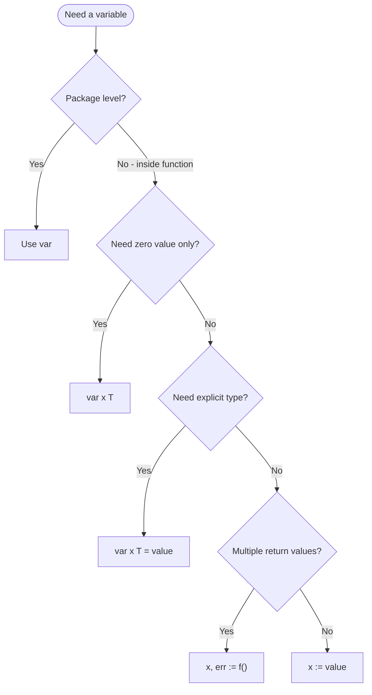
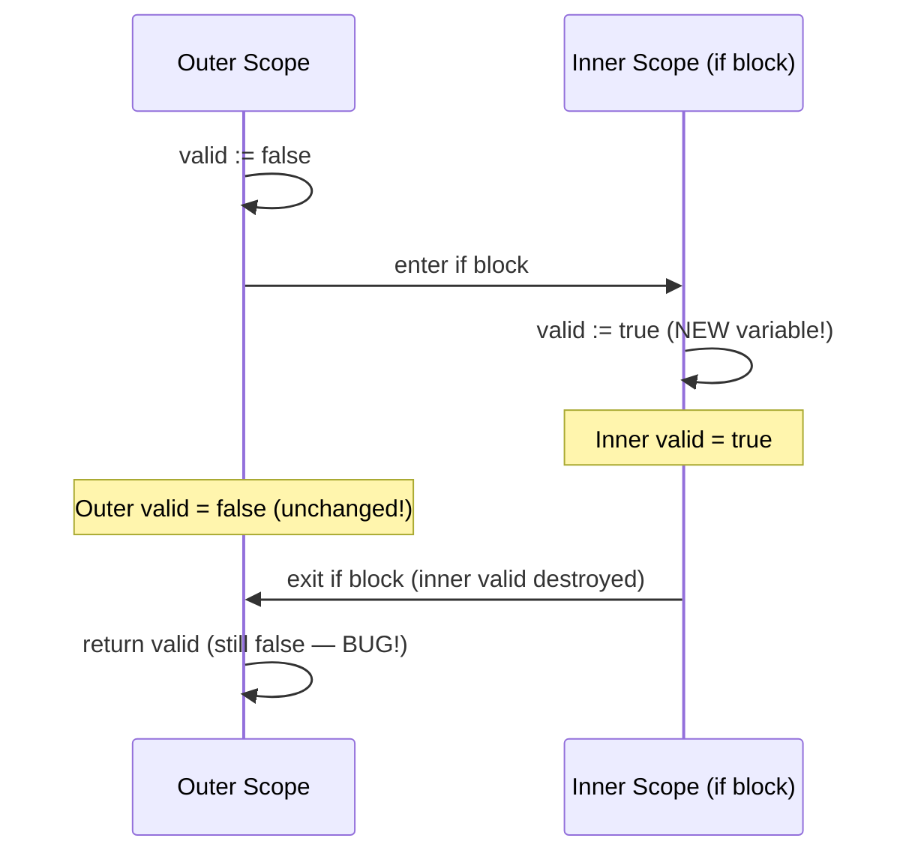

# var vs := (Short Variable Declaration) — Middle Level

## Table of Contents
1. [Introduction](#introduction)
2. [Prerequisites](#prerequisites)
3. [Glossary](#glossary)
4. [Core Concepts](#core-concepts)
5. [Evolution & Historical Context](#evolution--historical-context)
6. [Real-World Analogies](#real-world-analogies)
7. [Mental Models](#mental-models)
8. [Pros & Cons](#pros--cons)
9. [Alternative Approaches / Plan B](#alternative-approaches--plan-b)
10. [Use Cases](#use-cases)
11. [Code Examples](#code-examples)
12. [Coding Patterns](#coding-patterns)
13. [Clean Code](#clean-code)
14. [Product Use / Feature](#product-use--feature)
15. [Error Handling](#error-handling)
16. [Security Considerations](#security-considerations)
17. [Performance Tips](#performance-tips)
18. [Metrics & Analytics](#metrics--analytics)
19. [Best Practices](#best-practices)
20. [Anti-Patterns](#anti-patterns)
21. [Debugging Guide](#debugging-guide)
22. [Edge Cases & Pitfalls](#edge-cases--pitfalls)
23. [Common Mistakes](#common-mistakes)
24. [Common Misconceptions](#common-misconceptions)
25. [Tricky Points](#tricky-points)
26. [Comparison with Other Languages](#comparison-with-other-languages)
27. [Test](#test)
28. [Tricky Questions](#tricky-questions)
29. [Cheat Sheet](#cheat-sheet)
30. [Self-Assessment Checklist](#self-assessment-checklist)
31. [Summary](#summary)
32. [What You Can Build](#what-you-can-build)
33. [Further Reading](#further-reading)
34. [Related Topics](#related-topics)
35. [Diagrams & Visual Aids](#diagrams--visual-aids)

---

## Introduction
> Focus: "Why?" and "When to use?"

At middle level, the question is no longer "how do I declare a variable?" but "why does Go have two ways, and when should I choose each one deliberately?"

Go's designers made a pragmatic choice: `var` provides explicitness and works everywhere; `:=` provides conciseness and only works inside functions. This separation is intentional. Package-level code is more permanent and more likely to be read by other developers — explicitness is valuable there. Function-level code is local and transient — conciseness is valuable there.

Understanding this distinction deeply allows you to:
- Write code that other Go developers read without friction
- Use scoping rules to your advantage for cleaner, safer code
- Avoid the subtle bugs that arise from shadowing and scope confusion
- Make deliberate choices instead of defaulting to one form always

The middle-level insight is that `var` vs `:=` is not just syntax — it encodes **intent** and **scope**. When you write `var count int`, you signal "this variable starts at zero by design." When you write `count := fetchCount()`, you signal "this variable is immediately useful and comes from a computation."

This file covers production patterns, scoping rules in depth, debugging common issues, and comparisons with how other languages handle similar concepts.

---

## Prerequisites
- Completed junior-level understanding of `var` and `:=`
- Familiarity with Go functions, error handling basics
- Understanding of Go scope rules at a basic level
- Experience writing small Go programs

---

## Glossary

| Term | Definition |
|------|-----------|
| **Scope** | The lexical region where a variable is visible; defined by `{}` braces |
| **Shadowing** | A new variable in an inner scope has the same name as one in an outer scope, hiding the outer one |
| **SSA** | Static Single Assignment — a compiler IR form where each variable is assigned exactly once |
| **Escape analysis** | The compiler's process of deciding whether a variable lives on the stack or heap |
| **Idiomatic Go** | Code that follows conventions the Go community has agreed on as clear and maintainable |
| **Zero value** | The default value for an uninitialized variable (`0`, `""`, `false`, `nil`) |
| **Type inference** | The compiler determining the type of a variable from the right-hand side expression |
| **Re-assignment** | Giving an existing variable a new value without redeclaring it |
| **Block** | Any `{}` region — function body, if body, for body, etc. |

---

## Core Concepts

### Full Syntax Reference

```go
// ── var forms ──────────────────────────────────
var x int           // zero value: x = 0
var x int = 5       // explicit type + value
var x = 5           // inferred type (int)

var (               // grouped declaration
    host string = "localhost"
    port int    = 8080
    debug bool
)

// ── := forms ───────────────────────────────────
x := 5              // inside function only
x, y := 1, 2        // multiple assignment
_, err := f()       // blank identifier

// ── special forms ──────────────────────────────
if x := compute(); x > 0 { }      // if-init
for i := 0; i < n; i++ { }        // for-init
switch v := expr.(type) { }       // type switch
```

### The Scoping Model

Go uses **block scoping**. Each pair of `{}` creates a new scope. Variables declared in an inner scope are not visible in the outer scope.

```go
func demo() {
    x := 1             // scope: entire function from here

    if true {
        y := 2         // scope: only this if block
        x = 100        // modifies outer x
        fmt.Println(x, y) // 100 2
    }

    // y is not accessible here
    fmt.Println(x) // 100
}
```

### The `:=` "At Least One New" Rule

`:=` on the left side must introduce at least one new variable. If all variables already exist in the current scope, it is a compile error.

```go
func demo() {
    x, err := call1()      // x: new, err: new
    y, err := call2()      // y: new, err: reassigned OK
    // z, err := call3()   // would work: z is new
    // x, err := call4()   // COMPILE ERROR: both already declared
    fmt.Println(x, y, err)
}
```

---

## Evolution & Historical Context

Go was designed at Google between 2007 and 2009 by Robert Griesemer, Rob Pike, and Ken Thompson. The language's design philosophy was shaped by their frustration with C++, Java, and Python at scale.

The `:=` operator was directly inspired by **Pascal's** `:=` assignment and the practical need to reduce boilerplate in a statically typed language. In languages like C or Java, you must write:

```c
// C
int result = computeSomething();
```

Go's designers wanted the conciseness of dynamic languages for local variables while keeping the type safety of a static language. The solution: let the compiler infer the type but keep it static.

The `var` keyword was kept for explicitness — particularly important at package level where variables act as module-level state, where readability during code review matters most, and where IDE tooling and static analysis tools need clear anchors.

The `:=` restriction (functions only) was a deliberate design decision. Package-level declarations run during program initialization (`init()`), and the designers felt that more ceremony (using `var`) was appropriate there to signal the higher-stakes nature of package-level state.

---

## Real-World Analogies

**Analogy 1 — Environment variables vs local variables in a shell**

`var HOST="localhost"` at the top of a shell script (exported, global scope) is like Go's package-level `var`. It is formal and visible everywhere.

`result=$(compute)` inside a function is like `:=` — quick, local, and scoped to that function.

**Analogy 2 — Contracts vs sticky notes**

Package-level `var` is a signed contract between your package and the rest of the program. It is formal.
`:=` inside a function is a sticky note on your monitor — convenient, local, and temporary.

**Analogy 3 — The intent signal**

`var count int` says: "I am creating a counter that starts at zero by design — zero is meaningful here."
`count := fetchCount()` says: "I need the result of this computation immediately — the value matters, not its starting state."

---

## Mental Models

### Model 1: Scope as nested boxes

```
┌─── Package scope ──────────────────────────────┐
│  var appName = "MyApp"   (package-level)        │
│                                                  │
│  ┌── func main() ────────────────────────────┐  │
│  │  count := 0           (function-level)    │  │
│  │                                            │  │
│  │  ┌── if block ───────────────────────┐    │  │
│  │  │  result := compute()  (if-level)  │    │  │
│  │  └───────────────────────────────────┘    │  │
│  └────────────────────────────────────────────┘  │
└──────────────────────────────────────────────────┘
```

Each inner box can see outer variables. Outer boxes cannot see inner variables.

### Model 2: Decision tree for declaration

```
Need a variable?
    │
    ├─► At package level? ──────────────► use var
    │
    └─► Inside function?
            │
            ├─► Need zero value? ────────► var x T
            ├─► Need explicit type? ──────► var x T = v
            ├─► Quick assignment? ────────► x := v
            └─► Multiple returns? ────────► x, err := f()
```

---

## Pros & Cons

### `var` in production code

| Pros | Cons |
|------|------|
| Required at package level | Verbose for simple function-local vars |
| Signals zero-value intent clearly | Type repetition can clutter simple code |
| Better for structured initialization | |
| Easier to grep/search in large codebases | |
| Works well with `go doc` and IDE tooltips | |

### `:=` in production code

| Pros | Cons |
|------|------|
| Concise — less noise in function bodies | Shadowing bugs are harder to spot |
| Idiomatic for Go functions | Type is implicit — reader must infer |
| Ideal for error-handling chains | Can create unintended new variables |
| Reduces cognitive load in short functions | |

---

## Alternative Approaches / Plan B

### Alternative 1: Using `=` for reassignment instead of `:=`

Sometimes developers reflexively use `:=` when they should use `=`. Use `=` when:
- The variable is already declared
- You are updating state, not creating a new variable

```go
func updateConfig(cfg *Config) {
    // WRONG: creates a new local timeout, does not update cfg
    cfg.Timeout, err := time.ParseDuration("30s")

    // RIGHT: separate declaration and assignment
    d, err := time.ParseDuration("30s")
    if err == nil {
        cfg.Timeout = d
    }
}
```

### Alternative 2: Typed `nil` with `var`

When you need a nil pointer or nil interface, `var` is cleaner than `:=`:

```go
// Idiomatic nil declaration
var mu sync.Mutex    // zero value is an unlocked mutex
var buf bytes.Buffer // zero value is an empty buffer
var once sync.Once   // zero value is ready to use

// Less idiomatic
mu := sync.Mutex{}   // works but unnecessary
```

### Alternative 3: Multi-value assignment without `:=`

```go
var x, y, z int
x, y, z = 1, 2, 3 // assign to already-declared variables
```

---

## Use Cases

### Production pattern 1: Service configuration

```go
package server

var (
    defaultTimeout  = 30 * time.Second
    defaultMaxConns = 100
    defaultAddr     = ":8080"
)

func NewServer(opts ...Option) *Server {
    // local vars with :=
    s := &Server{
        timeout:  defaultTimeout,
        maxConns: defaultMaxConns,
        addr:     defaultAddr,
    }
    for _, opt := range opts {
        opt(s)
    }
    return s
}
```

### Production pattern 2: Error chain

```go
func loadConfig(path string) (*Config, error) {
    data, err := os.ReadFile(path)
    if err != nil {
        return nil, fmt.Errorf("read config: %w", err)
    }

    var cfg Config
    err = json.Unmarshal(data, &cfg)
    if err != nil {
        return nil, fmt.Errorf("parse config: %w", err)
    }

    return &cfg, nil
}
```

Notice: `data` is declared with `:=`, but `cfg` is declared with `var` (zero-value struct) and then populated with `json.Unmarshal`. After the first `:=` for `err`, subsequent calls reuse `err` with `:=` + a new variable.

### Production pattern 3: Conditional initialization

```go
func getCache(key string) ([]byte, bool) {
    var result []byte // zero value: nil slice

    if v, ok := cache.Get(key); ok {
        result = v
    }

    return result, result != nil
}
```

---

## Code Examples

### Example 1: Scoping with for and if

```go
package main

import "fmt"

func main() {
    // for-init variable — scoped to the loop
    for i := 0; i < 3; i++ {
        fmt.Println(i)
    }
    // i is not accessible here

    // if-init variable — scoped to the if/else block
    if n := compute(); n > 10 {
        fmt.Println("large:", n)
    } else {
        fmt.Println("small:", n)
    }
    // n is not accessible here
}

func compute() int { return 15 }
```

### Example 2: The shadowing trap in error handling

```go
package main

import (
    "errors"
    "fmt"
)

func riskyA() (int, error) { return 1, nil }
func riskyB() (string, error) { return "ok", nil }

func process() error {
    result, err := riskyA()
    if err != nil {
        return err
    }

    // err is safely re-used here (new variable: msg)
    msg, err := riskyB()
    if err != nil {
        return err
    }

    fmt.Println(result, msg)
    return nil
}

func main() {
    if err := process(); err != nil {
        fmt.Println("error:", err)
    } else {
        fmt.Println("success")
    }
    _ = errors.New // suppress unused import
}
```

### Example 3: Shadowing with if-init (intentional use)

```go
package main

import "fmt"

func divide(a, b float64) (float64, error) {
    if b == 0 {
        return 0, fmt.Errorf("division by zero")
    }
    return a / b, nil
}

func main() {
    // result is scoped to the if block
    if result, err := divide(10, 2); err != nil {
        fmt.Println("Error:", err)
    } else {
        fmt.Printf("10 / 2 = %.1f\n", result)
    }
    // result and err are not accessible here
    // This keeps the outer scope clean
}
```

### Example 4: var with interfaces

```go
package main

import (
    "fmt"
    "io"
    "strings"
)

func processReader(r io.Reader) {
    var buf strings.Builder
    // strings.Builder's zero value is ready to use

    tmp := make([]byte, 1024)
    for {
        n, err := r.Read(tmp)
        if n > 0 {
            buf.Write(tmp[:n])
        }
        if err == io.EOF {
            break
        }
        if err != nil {
            fmt.Println("read error:", err)
            return
        }
    }
    fmt.Println(buf.String())
}

func main() {
    processReader(strings.NewReader("hello world"))
}
```

---

## Coding Patterns

### Pattern 1: Named return values with var

```go
// Named returns implicitly declare variables with var semantics
func divide(a, b int) (result int, err error) {
    if b == 0 {
        err = fmt.Errorf("cannot divide by zero")
        return // naked return uses named values
    }
    result = a / b
    return
}
```

### Pattern 2: Mutex-protected state

```go
type Counter struct {
    mu    sync.Mutex
    value int       // zero value = 0, ready to use
}

func (c *Counter) Increment() {
    c.mu.Lock()
    defer c.mu.Unlock()
    c.value++
}
```

### Pattern 3: Chained error handling with `:=`

```go
func pipeline(input string) (string, error) {
    step1, err := validateInput(input)
    if err != nil {
        return "", fmt.Errorf("validate: %w", err)
    }

    step2, err := transformData(step1)
    if err != nil {
        return "", fmt.Errorf("transform: %w", err)
    }

    result, err := formatOutput(step2)
    if err != nil {
        return "", fmt.Errorf("format: %w", err)
    }

    return result, nil
}
```

---

## Clean Code

### Principle 1: Declare close to use

```go
// BAD: all declarations up top (C-style)
func processOrder(id int) {
    var user *User
    var order *Order
    var total float64
    var err error

    user, err = getUser(id)
    // ... 20 lines later
    order, err = getOrder(id)
    // ... 20 more lines later
    total = calculateTotal(order)
    _ = user
    _ = total
    _ = err
}

// GOOD: declare where needed
func processOrderClean(id int) {
    user, err := getUser(id)
    if err != nil {
        return
    }

    order, err := getOrder(id)
    if err != nil {
        return
    }

    total := calculateTotal(order)
    _ = user
    _ = total
}
```

### Principle 2: Use var for zero-value signals

```go
// This signals "I intend count to start at zero"
var count int
for _, item := range items {
    if item.Valid() {
        count++
    }
}

// This also works but is noisier
count := 0
```

### Principle 3: Avoid nested := that shadow important state

```go
// DANGEROUS pattern
func checkAuth(r *http.Request) error {
    err := validateToken(r)
    if err != nil {
        // This := creates a NEW err, does not update outer err
        if logErr := logFailure(r); logErr != nil {
            return logErr // returns wrong error!
        }
    }
    return err
}

// CORRECT
func checkAuthFixed(r *http.Request) error {
    if err := validateToken(r); err != nil {
        logFailure(r) // ignore log error, return auth error
        return err
    }
    return nil
}
```

---

## Product Use / Feature

### Feature: Configuration loader with validation

```go
package config

import (
    "encoding/json"
    "fmt"
    "os"
    "time"
)

var (
    defaultHost    = "localhost"
    defaultPort    = 8080
    defaultTimeout = 10 * time.Second
)

type Config struct {
    Host    string        `json:"host"`
    Port    int           `json:"port"`
    Timeout time.Duration `json:"timeout"`
}

func Load(path string) (*Config, error) {
    cfg := &Config{
        Host:    defaultHost,
        Port:    defaultPort,
        Timeout: defaultTimeout,
    }

    if path == "" {
        return cfg, nil
    }

    data, err := os.ReadFile(path)
    if err != nil {
        if os.IsNotExist(err) {
            return cfg, nil // use defaults
        }
        return nil, fmt.Errorf("config.Load: %w", err)
    }

    if err = json.Unmarshal(data, cfg); err != nil {
        return nil, fmt.Errorf("config.Load parse: %w", err)
    }

    return cfg, nil
}
```

---

## Error Handling

### The canonical Go error pattern

```go
func fetchUser(id int) (*User, error) {
    row := db.QueryRow("SELECT * FROM users WHERE id = ?", id)

    var u User
    err := row.Scan(&u.ID, &u.Name, &u.Email)
    if err != nil {
        return nil, fmt.Errorf("fetchUser %d: %w", id, err)
    }

    return &u, nil
}
```

### When `:=` can hide errors

```go
func riskyPattern() {
    // BAD: err from inner scope shadows outer err
    result, err := step1()
    if err == nil {
        extra, err := step2(result)  // new err shadows outer
        if err == nil {
            fmt.Println(extra)
        }
        // outer err is never re-checked here
    }
    _ = err
}

// GOOD: flatten with early returns
func safePattern() error {
    result, err := step1()
    if err != nil {
        return err
    }

    extra, err := step2(result)
    if err != nil {
        return err
    }

    fmt.Println(extra)
    return nil
}
```

---

## Security Considerations

### Shadowing can nullify security checks

```go
// VULNERABLE: permission check result is shadowed
func secureAction(userID int) error {
    allowed := false

    if user, err := loadUser(userID); err == nil {
        allowed := user.HasPermission("admin") // NEW variable!
        _ = allowed
    }

    if !allowed { // always false — outer allowed never changed
        return errors.New("forbidden")
    }
    return doAction()
}

// FIXED
func secureActionFixed(userID int) error {
    allowed := false

    if user, err := loadUser(userID); err == nil {
        allowed = user.HasPermission("admin") // = not :=
    }

    if !allowed {
        return errors.New("forbidden")
    }
    return doAction()
}
```

### Sensitive variable lifecycle

Use the smallest possible scope for sensitive data (tokens, passwords):

```go
func authenticate(r *http.Request) error {
    // token is scoped to this if block only
    if token := r.Header.Get("Authorization"); token == "" {
        return errors.New("missing token")
    }
    // token is not accessible here — leaked scope minimized
    return validateToken(r.Header.Get("Authorization"))
}
```

---

## Performance Tips

### Stack vs heap considerations

Variables declared with both `var` and `:=` may end up on the stack or heap — the compiler decides via escape analysis, not based on the declaration syntax. However, some patterns encourage heap allocation:

```go
// These stay on the stack (usually)
x := 42
name := "hello"

// This escapes to heap (returned pointer forces it)
func newInt(v int) *int {
    x := v    // x escapes because its address is returned
    return &x
}
```

To inspect: `go build -gcflags='-m' ./...`

### Pre-declared vs re-used buffers

```go
// INEFFICIENT in a hot loop: new allocation every iteration
for i := 0; i < 10000; i++ {
    buf := make([]byte, 1024) // allocates each time
    process(buf)
}

// EFFICIENT: declare once, re-use
var buf [1024]byte
for i := 0; i < 10000; i++ {
    process(buf[:])
}
```

---

## Metrics & Analytics

In larger codebases, variable declaration hygiene correlates with these measurable outcomes:

| Metric | Impact |
|--------|--------|
| Code review time | Fewer shadowing bugs → faster reviews |
| Bug rate (nil deref, wrong value) | Proper scope → fewer logic errors |
| Onboarding time | Clear declarations → new devs ramp faster |
| Linter pass rate | Consistent style → fewer `go vet` / `staticcheck` warnings |

Run `go vet ./...` and `staticcheck ./...` to catch common declaration issues automatically.

---

## Best Practices

1. **Use `:=` for nearly all local variables** inside functions — this is idiomatic Go.
2. **Use `var` for zero-value initialization** — `var buf bytes.Buffer` signals the zero value is intentional.
3. **Never shadow important outer variables** — especially `err`, `ctx`, and authentication results.
4. **Use `var` at package level** — always required, and the ceremony is appropriate.
5. **Limit `:=` scope** with `if x := ...; condition` to keep outer scope clean.
6. **Prefer `=` over `:=` when updating existing variables** — be explicit about intent.
7. **Group package-level `var` blocks** by domain (config, metrics, defaults).
8. **Run `go vet` and `staticcheck`** to catch shadowing and unused variables.

---

## Anti-Patterns

### Anti-pattern 1: C-style declaration at top

```go
// BAD (C-style)
func handleRequest(r *http.Request) {
    var user *User
    var err error
    var data []byte
    var response Response

    user, err = getUser(r)
    // ... 40 lines of code
}

// GOOD (Go style)
func handleRequestGo(r *http.Request) {
    user, err := getUser(r)
    if err != nil { return }
    data, err := fetchData(user)
    if err != nil { return }
    response := buildResponse(data)
    _ = response
}
```

### Anti-pattern 2: Ignoring the second return value

```go
// BAD
result, _ := json.Marshal(data)  // silently ignores marshal error

// GOOD
result, err := json.Marshal(data)
if err != nil {
    return fmt.Errorf("marshal: %w", err)
}
```

### Anti-pattern 3: Confusing `:=` with `=` in struct fields

```go
type Config struct{ Host string }

// This does NOT set cfg.Host — it creates a new local variable
func setHost(cfg Config) {
    cfg.Host, err := "localhost", nil // COMPILE ERROR anyway
    _ = err
}

// Correct
func setHostFixed(cfg *Config) {
    cfg.Host = "localhost"
}
```

---

## Debugging Guide

### Issue 1: "declared but not used" compile error

```go
func main() {
    x := 5  // ERROR if x is never used
}
```
Fix: use the variable or replace with `_`.

### Issue 2: Variable has unexpected zero/nil value

Symptom: code runs but a variable is `0` or `nil` when it should have been set.

Diagnosis steps:
1. Check if `:=` created a new variable instead of assigning to the outer one.
2. Use `fmt.Printf("%T %v\n", x, x)` to print type and value at the point of use.
3. Use `go vet` — it catches some shadowing patterns.
4. Use `staticcheck` — catches more subtle shadowing.

```go
// Hard to spot:
func buggy() bool {
    ok := false
    if check() {
        ok := true   // shadows outer ok
        _ = ok
    }
    return ok        // always false!
}
```

### Issue 3: `:=` error in short variable declarations

Error: `no new variables on left side of :=`

```go
a := 1
b := 2
a, b := 3, 4  // COMPILE ERROR: both a and b already declared
```

Fix: use `a, b = 3, 4` (assignment without `:=`).

### Issue 4: Unintended loop variable capture (classic bug)

```go
// BUGGY: all goroutines capture the same i
for i := 0; i < 5; i++ {
    go func() {
        fmt.Println(i) // all print 5
    }()
}

// FIXED: capture a local copy
for i := 0; i < 5; i++ {
    i := i  // new variable i in inner scope
    go func() {
        fmt.Println(i) // each prints its own value
    }()
}
```

---

## Edge Cases & Pitfalls

### Pitfall 1: `:=` in switch cases

```go
switch {
case x > 10:
    result := "big"    // scoped to this case only
    fmt.Println(result)
case x > 5:
    result := "medium" // different variable, same name
    fmt.Println(result)
}
```

### Pitfall 2: Named return + `:=` conflict

```go
func tricky() (err error) {
    // This creates a NEW local err, not the named return
    result, err := compute()  // OK: result is new, err is the named return
    _ = result
    return
}
```

Wait — actually when using `:=` in a function with named returns, if `err` is already in scope as a named return, `:=` will re-assign it (not create a new one) as long as at least one other variable is new. This is correct behavior.

### Pitfall 3: Type assertion with `:=`

```go
var i interface{} = "hello"
s, ok := i.(string)  // s = "hello", ok = true
fmt.Println(s, ok)
```

---

## Common Mistakes

| Mistake | Code | Fix |
|---------|------|-----|
| `:=` at package level | `x := 5` outside func | `var x = 5` |
| Shadow-and-forget | `:=` in inner scope, forget outer | Use `=` instead |
| All-`_` error ignore | `result, _ := f()` everywhere | Always handle errors |
| C-style all-at-top | `var x, y, z int` at function top | Declare close to use |
| Forgetting re-assign rule | `x, y := ...; x, y := ...` | `x, y = ...` on second line |

---

## Common Misconceptions

**"`:=` is faster than `var`"** — False. The generated machine code is identical.

**"You need `var` for mutable variables and `:=` for immutable ones"** — False. Both declare mutable variables. Use `const` for immutable values.

**"`:=` always creates a new variable"** — False. When a variable already exists in the same scope and at least one new variable is on the left, `:=` re-assigns the existing one.

**"You can't mix `var` and `:=` in the same function"** — False. You can use both freely in the same function.

---

## Tricky Points

### The for-range variable sharing (pre-Go 1.22)

In Go versions before 1.22, the loop variable was shared across all iterations:

```go
// Go < 1.22: all closures capture same address
funcs := make([]func(), 5)
for i := 0; i < 5; i++ {
    i := i  // create new variable per iteration
    funcs[i] = func() { fmt.Println(i) }
}

// Go 1.22+: each iteration gets its own variable automatically
for i := range 5 {
    funcs[i] = func() { fmt.Println(i) } // works correctly
}
```

### Multiple assignment in select

```go
func main() {
    ch1 := make(chan int, 1)
    ch2 := make(chan string, 1)
    ch1 <- 42
    ch2 <- "hello"

    select {
    case v := <-ch1:
        fmt.Println("int:", v)
    case s := <-ch2:
        fmt.Println("string:", s)
    }
}
```

---

## Comparison with Other Languages

| Language | Declaration | Notes |
|----------|------------|-------|
| Go | `x := 5` or `var x int = 5` | Two syntaxes, static types |
| Rust | `let x = 5;` | Immutable by default, `let mut` for mutable |
| Python | `x = 5` | Dynamic typing, no declaration keyword |
| JavaScript | `let x = 5` / `const x = 5` | `let` for mutable, `const` for immutable binding |
| TypeScript | `let x: number = 5` | Type annotation optional |
| C | `int x = 5;` | Must declare type explicitly |
| Java | `int x = 5;` | Must declare type explicitly |
| Kotlin | `var x = 5` / `val x = 5` | `val` immutable, `var` mutable |
| Swift | `var x = 5` / `let x = 5` | Similar to Kotlin |

**Key Go differentiators:**
1. Go's `:=` is the only form that is **context-restricted** (functions only) — other languages allow their short forms everywhere.
2. Go has no `const`-like keyword for function-local immutability — all `:=` variables are mutable.
3. Go's zero-value guarantee is stronger than most languages — no uninitialized memory.

---

## Test

**1. What does this print?**
```go
x := "outer"
func() {
    x := "inner"
    fmt.Println(x)
}()
fmt.Println(x)
```
Answer: `inner` then `outer` — the anonymous function creates its own `x`.

**2. Does this compile?**
```go
var x = 10
var x = 20
```
Answer: No — `x` is redeclared in the same scope.

**3. Which linter catches unintentional shadowing?**
Answer: `staticcheck` (SA1001), `go vet` (partially), and the `shadow` analyzer.

**4. True or false: `var x int` and `var x int = 0` are functionally identical.**
Answer: True — the zero value for `int` is `0`.

**5. What is the scope of `n` in `if n := len(s); n > 0 {}`?**
Answer: `n` is scoped to the entire `if/else` block, not just the `if` body.

---

## Tricky Questions

**Q: Can `:=` introduce a variable in the same scope as an existing one?**
Only if at least one other variable on the left is new. Otherwise compile error.

**Q: Is `var x = nil` valid?**
No — Go cannot infer the type of `nil`. Use `var x *int` or `var x interface{}`.

**Q: What is the difference between `var s []string` and `s := []string{}`?**
`var s []string` gives a `nil` slice. `s := []string{}` gives an empty (non-nil) slice. They behave the same for `len`, `append`, and ranging, but differ in JSON marshaling (`null` vs `[]`).

**Q: Can you use `:=` to declare a variable of a specific interface type?**
Yes, if the right-hand side implements the interface. But the inferred type will be the concrete type, not the interface. Use `var` to get the interface type:
```go
var w io.Writer = os.Stdout  // type is io.Writer
w2 := os.Stdout              // type is *os.File
```

---

## Cheat Sheet

```
DECLARATION FORMS
────────────────────────────────────────────────────
var x int              zero value
var x int = 5          explicit type + value
var x = 5              inferred type
x := 5                 short (function only)
var (x int; y string)  group

SCOPING RULES
────────────────────────────────────────────────────
Package level:  only var allowed
Function:       var or :=
if/for init:    :=  (scoped to block)
Inner block:    := creates new variable (shadow risk)

THE := RULE
────────────────────────────────────────────────────
At least one NEW variable on left side required
err re-used across calls as long as something is new

COMMON PATTERNS
────────────────────────────────────────────────────
result, err := f()     multi-return
_, err := f()          discard non-error value
var buf bytes.Buffer   zero-value ready-to-use type
if v := f(); v > 0 {}  scoped init
for i := range n {}    loop variable

GOTCHAS
────────────────────────────────────────────────────
:= in inner scope SHADOWS outer variable
:= does NOT work at package level
var x = nil is INVALID (no type inference for nil)
```

---

## Self-Assessment Checklist

- [ ] I understand why Go has both `var` and `:=`
- [ ] I can explain the `:=` re-use rule with an example
- [ ] I understand how scope boundaries affect variable visibility
- [ ] I can explain the shadowing trap and give an example
- [ ] I know the difference between `nil` slice and empty slice
- [ ] I understand why `:=` is restricted to function scope
- [ ] I can read and understand named return values
- [ ] I use `var` for zero-value signals intentionally
- [ ] I can debug "unexpected nil" caused by shadowing
- [ ] I understand how loop variable capture works (pre/post Go 1.22)

---

## Summary

At the middle level, `var` vs `:=` is not merely a syntax choice — it is a tool for expressing intent and managing scope:

- **`var`** at package level is mandatory and signals module-level state. Inside functions, it signals zero-value intent.
- **`:=`** is idiomatic for function-local variables, especially with multiple return values and error chains.
- **Shadowing** is the most dangerous pitfall — always use `=` when updating an existing variable from an outer scope.
- **Scope minimization** using if-init `if x := f(); ...` is a powerful Go idiom that keeps outer scopes clean.
- **The `:=` re-use rule** enables clean error-handling chains without redeclaring `err` each time.

---

## What You Can Build

With this depth of understanding you can:
- Build production-quality APIs with correct error propagation
- Write secure authentication middleware without shadowing vulnerabilities
- Create configuration loaders with proper zero-value semantics
- Design services with clean package-level state management
- Pass Go code reviews with idiomatic variable usage

---

## Further Reading

- [Effective Go — Variables](https://go.dev/doc/effective_go#variables)
- [Go Specification — Declarations and scope](https://go.dev/ref/spec#Declarations_and_scope)
- [staticcheck documentation — SA1001 (shadowing)](https://staticcheck.dev/)
- [Go Blog — The Go Memory Model](https://go.dev/ref/mem)
- [Go 1.22 release notes — loop variable semantics](https://go.dev/doc/go1.22)

---

## Related Topics

- `const` — immutable values and iota
- Named return values — interplay with `:=` and `var`
- Closures — variable capture and scope
- Goroutines — loop variable capture issue
- `sync.Mutex` and `sync.Once` — zero-value-ready types
- `bytes.Buffer` — zero-value-ready type

---

## Diagrams & Visual Aids

### Diagram 1: Scope nesting and variable visibility



### Diagram 2: Declaration decision flow



### Diagram 3: Shadowing — what actually happens


