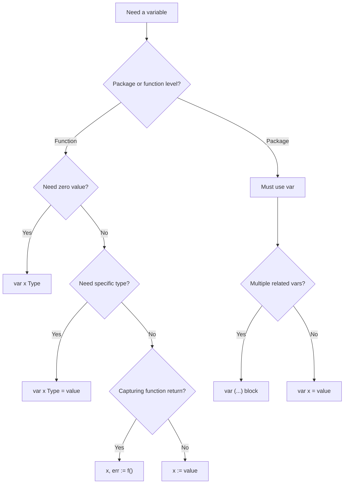
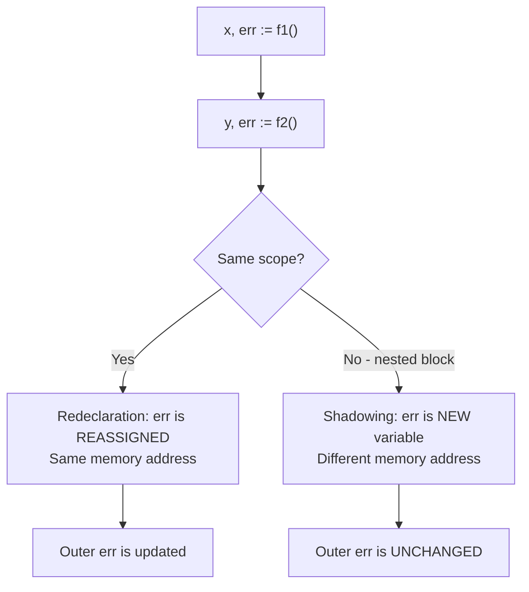

# var vs := — Middle Level

## Table of Contents

1. [Introduction](#introduction)
2. [Core Concepts](#core-concepts)
3. [Evolution & Historical Context](#evolution--historical-context)
4. [Pros & Cons](#pros--cons)
5. [Alternative Approaches](#alternative-approaches)
6. [Use Cases](#use-cases)
7. [Code Examples](#code-examples)
8. [Coding Patterns](#coding-patterns)
9. [Clean Code](#clean-code)
10. [Product Use / Feature](#product-use--feature)
11. [Error Handling](#error-handling)
12. [Security Considerations](#security-considerations)
13. [Performance Optimization](#performance-optimization)
14. [Metrics & Analytics](#metrics--analytics)
15. [Debugging Guide](#debugging-guide)
16. [Best Practices](#best-practices)
17. [Edge Cases & Pitfalls](#edge-cases--pitfalls)
18. [Common Mistakes](#common-mistakes)
19. [Anti-Patterns](#anti-patterns)
20. [Tricky Points](#tricky-points)
21. [Comparison with Other Languages](#comparison-with-other-languages)
22. [Test](#test)
23. [Tricky Questions](#tricky-questions)
24. [Cheat Sheet](#cheat-sheet)
25. [Summary](#summary)
26. [What You Can Build](#what-you-can-build)
27. [Further Reading](#further-reading)
28. [Related Topics](#related-topics)
29. [Diagrams & Visual Aids](#diagrams--visual-aids)

---

## Introduction

> Focus: "Why?" and "When to use?"

At the middle level, you already know the syntax of `var` and `:=`. Now the question shifts to **why** Go has two declaration mechanisms, **when** to use each, and **how** the compiler handles them under the hood.

Go's design philosophy centers on clarity and simplicity. The existence of both `var` and `:=` is not redundant — each encodes **different intent**:

- `var x int` signals: "I need a variable of this type, starting at its zero value"
- `x := computeSomething()` signals: "I'm capturing a result and letting the compiler figure out the type"

Understanding the compiler's type inference rules, the subtle behavior of redeclaration with `:=`, and how shadowing interacts with scoping will help you write code that is not only correct but also communicates intent clearly to other developers.

---

## Core Concepts

### Concept 1: Compiler Type Inference Rules

When you use `:=` or `var x = value`, the compiler applies these rules to determine the type:

```go
package main

import "fmt"

func main() {
    // Untyped constants get default types
    a := 42         // int (not int8, int16, int32, int64)
    b := 3.14       // float64 (not float32)
    c := 1 + 2i     // complex128 (not complex64)
    d := true       // bool
    e := "hello"    // string
    f := 'A'        // int32 (rune)

    // From function returns — type matches the return type
    g := fmt.Sprintf("x") // string (Sprintf returns string)

    // From typed expressions — type propagates
    var h int32 = 10
    i := h + 1 // int32 (not int, because h is int32)

    fmt.Printf("a:%T b:%T c:%T d:%T e:%T f:%T g:%T i:%T\n",
        a, b, c, d, e, f, g, i)
}
```

**Key rule:** Untyped integer literals default to `int`, untyped float literals default to `float64`. But when used in an expression with a typed value, the literal adopts that type.

### Concept 2: Redeclaration Semantics with `:=`

The `:=` operator has a special redeclaration rule defined in the Go specification:

```go
package main

import (
    "fmt"
    "os"
)

func main() {
    // First declaration
    file, err := os.Open("file1.txt")
    if err != nil {
        fmt.Println(err)
        return
    }
    file.Close()

    // Redeclaration: err already exists, but data is new
    // err is REASSIGNED (same variable), data is DECLARED (new variable)
    data, err := os.ReadFile("file2.txt")
    if err != nil {
        fmt.Println(err)
        return
    }
    fmt.Println(string(data))
}
```

The rules for `:=` redeclaration:
1. At least one variable on the left side must be **new**
2. Existing variables must be in the **same scope** (not an outer scope)
3. The existing variable must be **assignable** from the right-side value (same type)

### Concept 3: Shadowing vs Redeclaration

These are two different concepts that beginners often confuse:

```go
package main

import "fmt"

func main() {
    x := 10
    fmt.Println(&x) // address A

    // REDECLARATION (same scope) — same variable, same address
    x, y := 20, 30
    fmt.Println(&x) // address A (same!)
    fmt.Println(x, y)

    // SHADOWING (new scope) — different variable, different address
    {
        x := 99
        fmt.Println(&x) // address B (different!)
        fmt.Println(x)  // 99
    }
    fmt.Println(x) // 20 (unchanged)
}
```

**Redeclaration** reuses the existing variable. **Shadowing** creates an entirely new variable that happens to have the same name.

### Concept 4: The `var` Block as Documentation

At the middle level, `var` blocks serve as a form of documentation:

```go
package main

// Configuration — grouped by purpose
var (
    // Server settings
    serverHost = "0.0.0.0"
    serverPort = 8080

    // Database settings
    dbConnStr  = "postgres://localhost:5432/mydb"
    dbMaxConns = 25

    // Feature flags
    enableCache   = true
    enableMetrics = false
)
```

Comments within `var` blocks help organize package-level state into logical groups. This is more readable than scattered `var` declarations.

---

## Evolution & Historical Context

Go's variable declaration syntax was influenced by several design decisions:

| Year | Event | Impact |
|------|-------|--------|
| 2007 | Go design begins | Rob Pike and Ken Thompson wanted simpler declarations than C/C++ |
| 2009 | Go made public | Both `var` and `:=` available from the start |
| 2012 | Go 1.0 released | Declaration semantics frozen by Go 1 compatibility guarantee |
| 2022 | Go 1.18 (generics) | Type inference extended to generic functions, building on same principles |
| 2023 | Go 1.21 | Improved type inference for generic functions |

Go's declaration syntax was intentionally designed to read left-to-right: `var name type` puts the name first (what you care about most), then the type. This is the opposite of C's `type name` syntax, and was explained in Rob Pike's blog post "Go's Declaration Syntax."

The `:=` operator was borrowed from languages like Pascal and was included to reduce verbosity inside functions where types are usually obvious from context.

---

## Pros & Cons

### When `var` Wins

| Advantage | Example | Why It Matters |
|-----------|---------|---------------|
| Zero-value semantics | `var m sync.Mutex` | Mutex is ready to use at zero value |
| Interface declarations | `var w io.Writer` | Cannot use `:=` without a concrete value |
| Package-level scope | `var Version = "1.0"` | `:=` is not allowed |
| Explicit type control | `var id int64 = getUserID()` | When return type differs from what you need |
| Grouped declarations | `var (...) ` | Organizes related variables |

### When `:=` Wins

| Advantage | Example | Why It Matters |
|-----------|---------|---------------|
| Conciseness | `name := getName()` | Less boilerplate |
| Error handling | `val, err := doWork()` | Clean multi-return pattern |
| If-init scoping | `if err := run(); err != nil` | Variable scoped to if block |
| Loop variables | `for i := 0; i < n; i++` | Standard loop idiom |
| Type assertion | `s, ok := val.(string)` | Clean type assertion pattern |

---

## Alternative Approaches

### Approach 1: `new()` Function

```go
package main

import "fmt"

func main() {
    // new() returns a pointer to a zero-value variable
    p := new(int) // *int, pointing to 0
    *p = 42

    // Equivalent to:
    var x int
    q := &x

    fmt.Println(*p, *q)
}
```

`new(T)` allocates a zero-value `T` and returns `*T`. Rarely used in practice — most Go code uses `var` or composite literals.

### Approach 2: Composite Literal Initialization

```go
package main

import "fmt"

type Config struct {
    Host string
    Port int
}

func main() {
    // Using var with zero value, then assign
    var c1 Config
    c1.Host = "localhost"
    c1.Port = 8080

    // Using := with composite literal (preferred)
    c2 := Config{
        Host: "localhost",
        Port: 8080,
    }

    fmt.Println(c1, c2)
}
```

### Approach 3: `make()` for Built-in Types

```go
package main

import "fmt"

func main() {
    // var gives nil slice/map
    var s1 []int           // nil, len=0, cap=0
    var m1 map[string]int  // nil (cannot write to it!)

    // make gives initialized slice/map
    s2 := make([]int, 0, 10)       // empty, cap=10
    m2 := make(map[string]int, 10) // empty, 10 buckets preallocated

    fmt.Println(s1 == nil, s2 == nil) // true, false
    fmt.Println(m1 == nil, m2 == nil) // true, false

    // Both work with append
    s1 = append(s1, 1)
    s2 = append(s2, 1)

    // Only m2 can be written to directly
    // m1["key"] = 1  // panic: assignment to entry in nil map
    m2["key"] = 1
}
```

---

## Use Cases

| Use Case | Pattern | Rationale |
|----------|---------|-----------|
| HTTP handler locals | `name := r.URL.Query().Get("name")` | Concise, type is obvious |
| Mutex declaration | `var mu sync.Mutex` | Zero value is a valid unlocked mutex |
| Buffered writer | `var buf bytes.Buffer` | Zero value is ready-to-use buffer |
| Test table | `tests := []struct{...}{...}` | Clear test structure |
| Context propagation | `ctx, cancel := context.WithTimeout(...)` | Standard context pattern |
| Database scan | `var name string; rows.Scan(&name)` | Need address of typed variable |
| Accumulator | `var total int64` | Explicit zero start, specific type |

---

## Code Examples

### Example 1: Type Inference with Complex Expressions

```go
package main

import "fmt"

func divide(a, b float64) (float64, error) {
    if b == 0 {
        return 0, fmt.Errorf("division by zero")
    }
    return a / b, nil
}

func main() {
    // result is float64 (from function return type)
    result, err := divide(10, 3)
    if err != nil {
        fmt.Println(err)
        return
    }
    fmt.Printf("Result: %.2f (type: %T)\n", result, result)

    // Careful: integer division vs float division
    a := 10 / 3     // int division = 3
    b := 10.0 / 3.0 // float64 division = 3.333...
    c := 10.0 / 3   // float64 (untyped 3 adopts float64)

    fmt.Println(a, b, c)
}
```

**What it does:** Demonstrates how `:=` infers types from function returns and how untyped constants interact with typed expressions.

### Example 2: Redeclaration Across Multiple Error Checks

```go
package main

import (
    "encoding/json"
    "fmt"
    "os"
)

func main() {
    // First declaration of err
    data, err := os.ReadFile("config.json")
    if err != nil {
        fmt.Println("read error:", err)
        return
    }

    // Redeclaration: config is new, err is reassigned
    var config map[string]interface{}
    err = json.Unmarshal(data, &config) // Note: = not :=
    if err != nil {
        fmt.Println("parse error:", err)
        return
    }

    // Redeclaration with := : formatted is new, err is reassigned
    formatted, err := json.MarshalIndent(config, "", "  ")
    if err != nil {
        fmt.Println("format error:", err)
        return
    }

    fmt.Println(string(formatted))
}
```

**What it does:** Shows a realistic chain of operations where `err` is reused via both `=` and `:=` redeclaration.

### Example 3: Interface Variable Declaration

```go
package main

import (
    "fmt"
    "io"
    "os"
    "strings"
)

func processReader(r io.Reader) {
    buf := make([]byte, 1024)
    n, _ := r.Read(buf)
    fmt.Printf("Read %d bytes: %s\n", n, string(buf[:n]))
}

func main() {
    // Must use var for interface type without concrete value
    var reader io.Reader

    // Assign different concrete types
    reader = strings.NewReader("from string")
    processReader(reader)

    reader = os.Stdin // can reassign to different implementation
    _ = reader
}
```

**What it does:** Shows why `var` is necessary for interface types — you cannot use `:=` without a concrete value, and sometimes you want to declare the interface first and assign later.

### Example 4: Shadowing in Error Handling

```go
package main

import (
    "fmt"
    "strconv"
)

func main() {
    err := fmt.Errorf("initial error")

    // BAD: This shadows err, does not reassign it
    if true {
        value, err := strconv.Atoi("not-a-number")
        if err != nil {
            fmt.Println("Inner err:", err) // strconv error
        }
        _ = value
    }

    fmt.Println("Outer err:", err) // Still "initial error"!

    // GOOD: Use = to reassign existing err
    if true {
        var value int
        var parseErr error
        value, parseErr = strconv.Atoi("not-a-number")
        if parseErr != nil {
            err = parseErr // Explicitly assign to outer err
        }
        _ = value
    }

    fmt.Println("Outer err:", err) // Now contains strconv error
}
```

**What it does:** Demonstrates the dangerous shadowing trap where `:=` inside a block creates a new `err` instead of updating the outer one.

### Example 5: Switch with Short Declaration

```go
package main

import "fmt"

func getStatus() (int, string) {
    return 200, "OK"
}

func main() {
    switch code, msg := getStatus(); {
    case code >= 200 && code < 300:
        fmt.Printf("Success: %d %s\n", code, msg)
    case code >= 400 && code < 500:
        fmt.Printf("Client error: %d %s\n", code, msg)
    case code >= 500:
        fmt.Printf("Server error: %d %s\n", code, msg)
    }
    // code and msg are not accessible here
}
```

**What it does:** Uses `:=` in a switch init statement to scope variables to the switch block. This is similar to the if-init pattern.

---

## Coding Patterns

### Pattern 1: The Guard Clause

```go
func processOrder(orderID string) error {
    order, err := fetchOrder(orderID)
    if err != nil {
        return fmt.Errorf("fetch order: %w", err)
    }

    user, err := fetchUser(order.UserID)
    if err != nil {
        return fmt.Errorf("fetch user: %w", err)
    }

    payment, err := processPayment(user, order)
    if err != nil {
        return fmt.Errorf("process payment: %w", err)
    }

    _ = payment
    return nil
}
```

Each `:=` redeclares `err` while introducing a new variable. This creates a clean, linear flow of error handling.

### Pattern 2: The Accumulator with Specific Type

```go
func sumInt64(values []int64) int64 {
    var total int64 // Explicit type, zero value
    for _, v := range values {
        total += v
    }
    return total
}
```

Using `var total int64` is preferred over `total := int64(0)` because it signals "starting from zero" more clearly.

### Pattern 3: The Lazy Initialization

```go
var (
    instance *Database
    once     sync.Once
)

func GetDatabase() *Database {
    once.Do(func() {
        instance = &Database{} // assigned, not declared
    })
    return instance
}
```

Package-level `var` with `sync.Once` for thread-safe lazy initialization.

### Pattern 4: The Type-Switch Pattern

```go
func describe(i interface{}) string {
    switch v := i.(type) {
    case int:
        return fmt.Sprintf("integer: %d", v)
    case string:
        return fmt.Sprintf("string: %q", v)
    case bool:
        return fmt.Sprintf("boolean: %t", v)
    default:
        return fmt.Sprintf("unknown: %v", v)
    }
}
```

The `v := i.(type)` uses `:=` to bind the type-asserted value in each case branch.

---

## Clean Code

### Go Style Guide Rules for Declarations

| Rule | Example | Explanation |
|------|---------|-------------|
| Prefer `:=` inside functions | `x := getValue()` | Idiomatic, reduces noise |
| Use `var` for zero-value structs | `var buf bytes.Buffer` | Signals "zero value is useful" |
| Avoid `var x = value` inside functions | Use `x := value` instead | `var` with value inside function is non-idiomatic |
| Group package-level vars | `var (...) ` | Organizes related declarations |
| Declare close to first use | Move declaration down | Improves readability, reduces scope |
| One `var` block per logical group | Separate config from state | Do not dump all vars in one block |

### Before/After

```go
// BAD: verbose, Java-like style
func processData(input string) (string, error) {
    var result string
    var err error
    var parser Parser
    parser = NewParser()
    result, err = parser.Parse(input)
    if err != nil {
        return "", err
    }
    return result, nil
}

// GOOD: idiomatic Go
func processData(input string) (string, error) {
    parser := NewParser()
    result, err := parser.Parse(input)
    if err != nil {
        return "", err
    }
    return result, nil
}
```

---

## Product Use / Feature

| Product Pattern | Declaration Style | Why |
|----------------|-------------------|-----|
| HTTP middleware chain | `:=` for request-scoped vars | Short-lived, local context |
| Database connection pool | `var db *sql.DB` package-level | Shared across handlers |
| Feature flag system | `var (flags...)` grouped | Clear configuration section |
| Logger initialization | `var logger *slog.Logger` | Package-wide singleton |
| gRPC service impl | `:=` in method bodies | Standard request handling |
| Worker pool | `var wg sync.WaitGroup` | Zero-value ready |

---

## Error Handling

### The err Redeclaration Chain

```go
func pipeline(path string) error {
    // Step 1: err is new
    data, err := os.ReadFile(path)
    if err != nil {
        return fmt.Errorf("read: %w", err)
    }

    // Step 2: err is reassigned (result is new)
    var result Config
    err = json.Unmarshal(data, &result)
    if err != nil {
        return fmt.Errorf("parse: %w", err)
    }

    // Step 3: err is reassigned via := (conn is new)
    conn, err := db.Connect(result.DSN)
    if err != nil {
        return fmt.Errorf("connect: %w", err)
    }
    defer conn.Close()

    return nil
}
```

### Named Return Values as Declaration

```go
func loadConfig(path string) (cfg Config, err error) {
    // cfg and err are already declared by the named returns
    // Use = (not :=) to assign to them
    data, err := os.ReadFile(path) // err is reassigned, data is new
    if err != nil {
        return // returns zero cfg and the error
    }

    err = json.Unmarshal(data, &cfg)
    return // returns cfg and err
}
```

Named return values act as `var` declarations at the top of the function. Be aware that `:=` inside the function body can shadow them.

---

## Security Considerations

| Issue | Description | Mitigation |
|-------|-------------|-----------|
| Secret leaking via package vars | `var apiKey = os.Getenv("API_KEY")` is set at init time and lives for program lifetime | Load secrets at the point of use, not at package init |
| String immutability | `password := getUserPassword()` — string stays in memory | Use `[]byte` and zero it: `copy(pw, make([]byte, len(pw)))` |
| Shadowed error variables | Inner `:=` shadows outer `err`, hiding errors | Use `go vet -shadow` or `shadow` linter |
| Exported package variables | `var Debug = false` can be modified by any importing package | Use unexported vars with getter functions |
| Race conditions on package vars | Concurrent reads/writes to `var counter int` | Use `sync.Mutex`, `sync/atomic`, or `sync.Once` |

---

## Performance Optimization

### Nil Slice vs Empty Slice

```go
package main

import (
    "fmt"
    "unsafe"
)

func main() {
    var s1 []int          // nil slice: no allocation
    s2 := []int{}         // empty slice: allocates slice header
    s3 := make([]int, 0)  // empty slice: allocates slice header

    fmt.Println(s1 == nil) // true
    fmt.Println(s2 == nil) // false
    fmt.Println(s3 == nil) // false

    // All have the same behavior with append
    s1 = append(s1, 1)
    s2 = append(s2, 1)
    s3 = append(s3, 1)

    fmt.Println(unsafe.Sizeof(s1)) // 24 bytes (slice header)
}
```

**Use `var s []int`** when you might not append anything — it avoids an unnecessary allocation.

### Pre-allocation with make

```go
func collectNames(users []User) []string {
    // BAD: grows dynamically
    var names []string
    for _, u := range users {
        names = append(names, u.Name)
    }
    return names

    // GOOD: pre-allocate when length is known
    // names := make([]string, 0, len(users))
    // for _, u := range users {
    //     names = append(names, u.Name)
    // }
    // return names
}
```

---

## Metrics & Analytics

| What to Measure | Tool | Why |
|----------------|------|-----|
| Allocations per operation | `go test -benchmem` | `var` vs `make` vs `:=` for slices/maps |
| Escape analysis | `go build -gcflags="-m"` | See if variables escape to heap |
| Variable shadowing | `go vet -shadow` | Detect accidental shadowing |
| Unused variables | `go build` (compiler) | Go refuses to compile with unused vars |
| Code style consistency | `golangci-lint` | Enforce `var` vs `:=` conventions |

---

## Debugging Guide

### Problem: "no new variables on left side of :="

```go
// Error scenario
x := 10
x := 20 // error!

// Fix 1: Use = for reassignment
x = 20

// Fix 2: Introduce a new variable
x, y := 20, 30
```

### Problem: "variable declared and not used"

```go
// Error scenario
func example() {
    x := 42 // error: x declared and not used
}

// Fix 1: Use the variable
func example() {
    x := 42
    fmt.Println(x)
}

// Fix 2: Use blank identifier
func example() {
    _ = 42
}
```

### Problem: Shadowed variable changes are lost

```go
// Debugging: print addresses to detect shadowing
func debug() {
    x := 10
    fmt.Printf("outer x: %p = %d\n", &x, x)

    if true {
        x := 20
        fmt.Printf("inner x: %p = %d\n", &x, x) // different address!
    }

    fmt.Printf("outer x: %p = %d\n", &x, x) // still 10
}
```

### Using go vet for Shadow Detection

```bash
go install golang.org/x/tools/go/analysis/passes/shadow/cmd/shadow@latest
go vet -vettool=$(which shadow) ./...
```

---

## Best Practices

1. **Use `:=` for most function-local variables** — it is idiomatic and concise
2. **Use `var` when zero value is the intended initial value** — `var wg sync.WaitGroup`, `var buf bytes.Buffer`
3. **Use `var` when you need a specific type** — `var id int64 = getID()` when getID returns `int`
4. **Use `var (...)` blocks to group package-level state** — separate by logical purpose
5. **Do not use `var x = value` inside functions** — use `x := value` instead
6. **Watch for shadowing in nested scopes** — use `go vet -shadow` in CI
7. **Keep `:=` chains readable** — if you have 5+ redeclarations of `err`, consider refactoring
8. **Prefer named returns sparingly** — they act as `var` declarations and can be shadowed
9. **Use `make` with capacity for slices/maps when size is known** — avoids repeated allocations
10. **Never leave `var` declarations at function top "just in case"** — declare close to first use

---

## Edge Cases & Pitfalls

### Pitfall 1: Multi-Return Shadowing

```go
package main

import "fmt"

func getData() (int, error) {
    return 42, nil
}

func main() {
    err := fmt.Errorf("previous error")

    if true {
        data, err := getData() // SHADOWS outer err
        fmt.Println(data, err) // 42 <nil>
    }

    fmt.Println(err) // "previous error" — NOT nil
}
```

### Pitfall 2: Short Declaration in For Loop

```go
package main

import "fmt"

func main() {
    // i is new on each iteration? No — it is the SAME variable, mutated
    for i := 0; i < 3; i++ {
        fmt.Printf("i=%d addr=%p\n", i, &i) // Same address each time
    }

    // But range creates a copy (Go 1.22+ changes this)
    nums := []int{10, 20, 30}
    for i, v := range nums {
        fmt.Printf("i=%d v=%d addr_v=%p\n", i, v, &v) // Same address for v (pre-1.22)
    }
}
```

### Pitfall 3: `:=` with nil

```go
package main

import "fmt"

func main() {
    // This does NOT compile:
    // x := nil  // error: use of untyped nil in short variable declaration

    // Must specify the type:
    var x *int = nil       // OK
    var y error = nil      // OK
    var z []string = nil   // OK

    fmt.Println(x, y, z)
}
```

You cannot use `:=` with `nil` because `nil` has no type — the compiler cannot infer what you mean.

---

## Common Mistakes

| Mistake | Code | Problem | Fix |
|---------|------|---------|-----|
| Shadowing in if blocks | `if x, err := f(); err != nil { }` | `x` scoped to if block | Declare before if when needed outside |
| Unused declaration | `x := compute()` with no use of `x` | Does not compile | Use `_` or remove |
| Wrong type assumption | `x := 1 << 32` on 32-bit | Overflow on 32-bit int | `var x int64 = 1 << 32` |
| Nil short declaration | `x := nil` | Untyped nil | Use `var x *T` |
| Redundant type in var | `var x int = int(5)` | Double typing | `var x int = 5` or `x := 5` |
| Package var mutation | Concurrent write to `var counter int` | Race condition | Use `atomic.Int64` |

---

## Anti-Patterns

### Anti-Pattern 1: Java-Style Top-of-Function Declarations

```go
// BAD: declaring everything at the top
func process(input string) error {
    var result string
    var err error
    var count int
    var items []Item

    // ... 50 lines later, items is first used ...
    items, err = fetchItems()
    _ = result
    _ = count
    return err
}

// GOOD: declare at point of use
func process(input string) error {
    items, err := fetchItems()
    if err != nil {
        return err
    }
    result := transform(items)
    count := len(result)
    _ = count
    return nil
}
```

### Anti-Pattern 2: Overusing `var` Inside Functions

```go
// BAD: unnecessarily verbose
func handle(r *http.Request) {
    var name string = r.URL.Query().Get("name")
    var age string = r.URL.Query().Get("age")
    var page string = r.URL.Query().Get("page")
    _ = name; _ = age; _ = page
}

// GOOD: use :=
func handle(r *http.Request) {
    name := r.URL.Query().Get("name")
    age := r.URL.Query().Get("age")
    page := r.URL.Query().Get("page")
    _ = name; _ = age; _ = page
}
```

### Anti-Pattern 3: Ignoring Shadowing Warnings

```go
// BAD: silently losing error state
func riskyFunction() error {
    err := validate()
    if err != nil {
        return err
    }

    if someCondition {
        result, err := compute() // shadows outer err
        if err != nil {
            return err
        }
        _ = result
    }
    // If compute succeeds, outer err still holds validate's nil
    return err // This is always nil here — but was it intentional?
}
```

---

## Tricky Points

### Tricky Point 1: Blank Identifier with `:=`

```go
package main

func main() {
    // _ is not a variable — it is the blank identifier
    // It does NOT count as a "new variable" for := purposes

    x := 10
    // _, x := 20, 30  // The _ does not count as "new"
    // but actually this DOES work because _ is writable

    // This works because y is genuinely new:
    _, y := 20, 30
    _ = x; _ = y
}
```

### Tricky Point 2: `:=` Inside Switch/Select Cases

```go
package main

import "fmt"

func main() {
    x := 10

    switch {
    case x > 5:
        y := x * 2 // y is scoped to this case
        fmt.Println(y)
    case x > 0:
        y := x * 3 // different y, scoped to this case
        fmt.Println(y)
    }
    // y is not accessible here
}
```

Each `case` clause has its own scope — `:=` declarations do not leak between cases.

### Tricky Point 3: Named Returns and `:=`

```go
package main

import "fmt"

func example() (result int, err error) {
    // result and err are already declared
    // Using := with err creates a SHADOW if in a new scope
    if true {
        result, err := 42, fmt.Errorf("oops")
        // This shadows both result and err!
        _ = result
        _ = err
    }
    return // returns 0, nil — the named returns are unchanged
}
```

---

## Comparison with Other Languages

| Feature | Go | Python | JavaScript | Rust | C++ |
|---------|-----|--------|-----------|------|-----|
| Explicit declaration | `var x int = 5` | N/A (dynamic) | `let x = 5` | `let x: i32 = 5` | `int x = 5` |
| Type inference | `x := 5` | `x = 5` | `const x = 5` | `let x = 5` | `auto x = 5` |
| Zero value | `var x int` (= 0) | N/A | `let x` (= undefined) | N/A (must init) | Undefined behavior |
| Multiple return | `a, b := f()` | `a, b = f()` | `const [a, b] = f()` | `let (a, b) = f()` | `auto [a, b] = f()` |
| Redeclaration | `:=` with new var | N/A | N/A | Shadowing with `let` | N/A |
| Must use variable | Yes (compile error) | No | No | Yes (warning) | No (warning) |
| Scope rule | `:=` functions only | N/A | `let` is block-scoped | `let` is block-scoped | Block-scoped |

Key differences:
- **Go is unique** in requiring all declared variables to be used
- **Go's zero values** are well-defined, unlike C++ where uninitialized variables are UB
- **Rust's shadowing** with `let` is similar to Go's `:=` in a new scope
- **Go's `:=` redeclaration** (reusing existing vars in multi-assign) has no direct equivalent

---

## Test

### Question 1

What happens when you write `x := nil`?

- A) `x` becomes a nil pointer of type `*interface{}`
- B) `x` becomes `interface{}` with value nil
- C) Compilation error: use of untyped nil
- D) `x` becomes a nil `error`

<details>
<summary>Answer</summary>

**C) Compilation error: use of untyped nil** — `nil` has no default type, so the compiler cannot infer what type `x` should be. You must use `var x *T = nil` or `var x error = nil`.

</details>

### Question 2

```go
x, y := 1, 2
y, z := 3, 4
```

What are the final values and is `y` the same variable or a new one?

- A) x=1, y=3, z=4 — `y` is the same variable (reassigned)
- B) x=1, y=3, z=4 — `y` is a new variable (redeclared)
- C) Compilation error
- D) x=1, y=2, z=4

<details>
<summary>Answer</summary>

**A) x=1, y=3, z=4 — `y` is the same variable (reassigned)** — Since `z` is new, `:=` is valid. `y` is reassigned (not redeclared) — it is the same memory location.

</details>

### Question 3

```go
func example() (err error) {
    if true {
        _, err := fmt.Println("hello")
        if err != nil {
            return
        }
    }
    return
}
```

What does `example()` return?

- A) `nil`
- B) The error from `fmt.Println`
- C) Compilation error
- D) Panic

<details>
<summary>Answer</summary>

**A) `nil`** — The `:=` inside the `if` block creates a new `err` that shadows the named return. The named return `err` is never modified, so it remains `nil`.

</details>

### Question 4

Which declaration allocates memory on the heap?

- A) `var x int`
- B) `x := 42`
- C) `x := new(int)`
- D) It depends on escape analysis

<details>
<summary>Answer</summary>

**D) It depends on escape analysis** — The Go compiler's escape analysis determines whether a variable lives on the stack or heap. Even `new(int)` can be stack-allocated if the pointer does not escape the function.

</details>

### Question 5

Can you use `:=` in a `select` statement?

- A) No, only `var` is allowed
- B) Yes, in the case clause
- C) Yes, in the select init statement
- D) Both B and C

<details>
<summary>Answer</summary>

**B) Yes, in the case clause** — `select` does not have an init statement like `if` or `switch`. But you can use `:=` inside a case: `case msg := <-ch:`.

</details>

---

## Tricky Questions

### Question 1

```go
var x int = 010
fmt.Println(x)
```

What is printed?

<details>
<summary>Answer</summary>

**8** — In Go, a leading `0` indicates an octal literal. `010` in octal is `8` in decimal. Note: Go 1.13+ also supports `0o10` for clarity. This is unrelated to `var` vs `:=`, but catches people who use `var x int = 010`.

</details>

### Question 2

```go
func f() {
    var err error
    {
        var err error = fmt.Errorf("inner")
        _ = err
    }
    fmt.Println(err)
}
```

What is printed?

<details>
<summary>Answer</summary>

**`<nil>`** — The inner `var err error` declares a new variable in the inner block scope. The outer `err` is never assigned, so it remains `nil`.

</details>

### Question 3

Is `for i := range slice` the same as `for i, _ := range slice`?

<details>
<summary>Answer</summary>

**Yes, functionally identical.** Both declare `i` as the index variable. The single-variable form `for i := range slice` only captures the index, which is equivalent to `for i, _ := range slice` where the value is explicitly discarded.

</details>

---

## Cheat Sheet

| Scenario | Use | Syntax |
|----------|-----|--------|
| New variable inside function | `:=` | `x := value` |
| Zero-value variable | `var` | `var x int` |
| Package-level variable | `var` | `var x = value` |
| Specific type needed | `var` | `var x int64 = 5` |
| Interface type | `var` | `var w io.Writer` |
| Multi-return function | `:=` | `val, err := f()` |
| If-init pattern | `:=` | `if err := f(); err != nil {}` |
| Switch-init pattern | `:=` | `switch v := x.(type) {}` |
| For loop | `:=` | `for i := 0; i < n; i++` |
| Range loop | `:=` | `for i, v := range slice` |
| Reassignment | `=` | `x = newValue` |
| Multiple related vars | `var (...)` | `var (x = 1; y = 2)` |
| Mutex/WaitGroup | `var` | `var mu sync.Mutex` |
| nil variable | `var` | `var p *int` |

---

## Summary

- **`:=` is the default choice** inside functions — concise, idiomatic, and clear
- **`var` serves specific roles**: zero values, package level, specific types, interfaces
- **Redeclaration with `:=`** reuses existing variables when at least one variable is new
- **Shadowing is the biggest trap** — `:=` in a nested scope creates a new variable, not an assignment
- **The compiler treats `var` and `:=` identically** after type checking — no runtime difference
- **Go's type inference rules** follow clear patterns: literals get default types, expressions propagate types
- **Use tools** (`go vet -shadow`, `golangci-lint`) to catch declaration-related bugs
- **Named returns** act as `var` declarations and can be shadowed by `:=`

---

## What You Can Build

With middle-level understanding of `var` vs `:=`, you can:

- Design clean package APIs with well-organized `var` blocks
- Write robust error handling chains with proper redeclaration
- Create thread-safe singletons using `var` + `sync.Once`
- Build middleware chains with scoped variables
- Structure test tables with clear variable declarations
- Avoid subtle bugs caused by variable shadowing

---

## Further Reading

- [Go Specification — Variable Declarations](https://go.dev/ref/spec#Variable_declarations)
- [Go Specification — Short Variable Declarations](https://go.dev/ref/spec#Short_variable_declarations)
- [Go Blog — Go's Declaration Syntax](https://go.dev/blog/declaration-syntax)
- [Effective Go — Variables](https://go.dev/doc/effective_go#variables)
- [Go FAQ — Why does Go have := syntax?](https://go.dev/doc/faq)
- [CodeReviewComments — Variable Names](https://github.com/golang/go/wiki/CodeReviewComments#variable-names)

---

## Related Topics

| Topic | Relationship |
|-------|-------------|
| [Zero Values](../../01-variables-and-constants/02-zero-values/) | Zero values determine behavior of `var x type` |
| [Scope & Shadowing](../../01-variables-and-constants/04-scope-and-shadowing/) | Shadowing is the main pitfall of `:=` |
| [Constants & iota](../../01-variables-and-constants/03-const-and-iota/) | `const` is similar to `var` but immutable |
| [Type Conversion](../../02-data-types/05-type-conversion/) | Needed when `:=` infers wrong type |
| [Data Types](../../02-data-types/) | Type inference rules depend on Go's type system |

---

## Diagrams & Visual Aids

### Flowchart: Declaration Decision Tree



### Flowchart: Redeclaration vs Shadowing



### Mind Map: When to Use What

```mermaid
mindmap
  root((var vs :=))
    Use var
      Package level
        var Version = "1.0"
        var blocks
      Zero values
        var mu sync.Mutex
        var buf bytes.Buffer
        var count int
      Specific types
        var id int64
        var small int8
      Interfaces
        var w io.Writer
        var r io.Reader
      nil values
        var p *int
        var err error
    Use short declaration
      Function locals
        name := "Alice"
      Error handling
        val, err := f()
      If init
        if err := f(); err != nil
      Switch init
        switch v := x.(type)
      For loops
        for i := 0
      Range loops
        for k, v := range m
    Avoid
      var x = v inside functions
      x := 0 when zero value intent
      := at package level
      Shadowing in nested blocks
```
