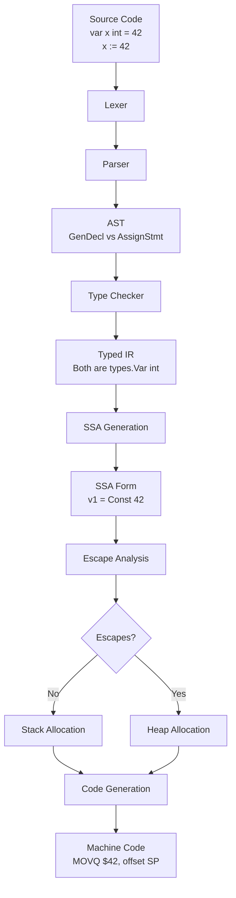
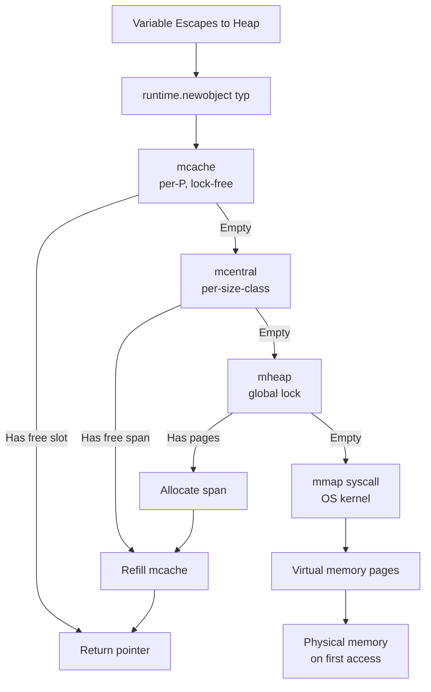
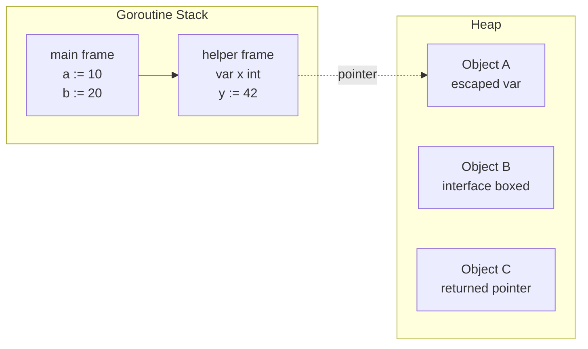

# var vs := — Under the Hood

## Table of Contents

1. [Introduction](#introduction)
2. [How It Works Internally](#how-it-works-internally)
3. [Runtime Deep Dive](#runtime-deep-dive)
4. [Compiler Perspective](#compiler-perspective)
5. [Memory Layout](#memory-layout)
6. [OS / Syscall Level](#os--syscall-level)
7. [Source Code Walkthrough](#source-code-walkthrough)
8. [Assembly Output Analysis](#assembly-output-analysis)
9. [Performance Internals](#performance-internals)
10. [Metrics & Analytics (Runtime Level)](#metrics--analytics-runtime-level)
11. [Edge Cases at the Lowest Level](#edge-cases-at-the-lowest-level)
12. [Test](#test)
13. [Tricky Questions](#tricky-questions)
14. [Self-Assessment Checklist](#self-assessment-checklist)
15. [Summary](#summary)
16. [Further Reading](#further-reading)
17. [Diagrams & Visual Aids](#diagrams--visual-aids)

---

## Introduction

> Focus: "What happens under the hood?"

When you write `x := 42` or `var x int = 42`, these are purely syntactic constructs. By the time the compiler finishes its work, the distinction is completely erased. This guide explores what actually happens at each stage of the compiler pipeline, the runtime, and the operating system when a variable is declared.

We will walk through:
- How the Go compiler parses `var` and `:=` into AST nodes
- How the SSA (Static Single Assignment) intermediate representation treats them identically
- How escape analysis determines memory placement
- What the final machine instructions look like
- How the OS provides the stack and heap memory that variables live in

---

## How It Works Internally

### The Compilation Pipeline

When you run `go build`, the source file passes through these phases:

1. **Lexing** — Source text is broken into tokens
2. **Parsing** — Tokens are organized into an AST (Abstract Syntax Tree)
3. **Type Checking** — Types are resolved and verified
4. **SSA Generation** — AST is lowered to SSA form
5. **Optimization Passes** — Dead code elimination, inlining, escape analysis
6. **Code Generation** — SSA is lowered to machine instructions
7. **Linking** — Object files are combined into a binary

### Phase 1: Lexing

The lexer sees these tokens differently:

For `var x int = 42`:
```
VAR IDENT(x) IDENT(int) ASSIGN INT_LITERAL(42)
```

For `x := 42`:
```
IDENT(x) DEFINE INT_LITERAL(42)
```

The `:=` is a single token (`DEFINE`), not a colon followed by equals.

### Phase 2: Parsing into AST

Both forms produce different AST node types that ultimately represent the same operation:

```go
// var x int = 42 produces:
// ast.GenDecl{
//   Tok: token.VAR,
//   Specs: []ast.Spec{
//     &ast.ValueSpec{
//       Names: []*ast.Ident{{Name: "x"}},
//       Type:  &ast.Ident{Name: "int"},
//       Values: []ast.Expr{&ast.BasicLit{Value: "42"}},
//     },
//   },
// }

// x := 42 produces:
// ast.AssignStmt{
//   Lhs: []ast.Expr{&ast.Ident{Name: "x"}},
//   Tok: token.DEFINE,  // := token
//   Rhs: []ast.Expr{&ast.BasicLit{Value: "42"}},
// }
```

At the AST level, `var` creates a `GenDecl` (general declaration) while `:=` creates an `AssignStmt` with `DEFINE` token. However, during type checking, both resolve to the same typed variable.

### Phase 3: Type Checking

The type checker (`go/types` package) processes both forms and produces a `types.Var` object:

```go
// Both var x int = 42 and x := 42 result in:
// types.Var{
//   name: "x",
//   typ:  types.Typ[types.Int],
//   pos:  ...,
// }
```

After type checking, the distinction between `var` and `:=` is **completely gone**. They are the same variable with the same type.

---

## Runtime Deep Dive

### Stack Frame Layout

When a function is called, the runtime allocates a stack frame. Local variables live in this frame:

```go
func example() {
    a := 10      // offset -8 from BP
    b := 20      // offset -16 from BP
    var c int    // offset -24 from BP (zero initialized)
    _ = a + b + c
}
```

The stack frame looks like:

```
High address
+---------------------+
|   Return address     | <- Stack Pointer at call
+---------------------+
|   Saved BP           |
+---------------------+
|   a = 10             | BP - 8
+---------------------+
|   b = 20             | BP - 16
+---------------------+
|   c = 0              | BP - 24
+---------------------+
Low address
```

For `var c int`, the compiler generates code to store 0 at offset -24. For `a := 10`, it stores 10 at offset -8. The mechanism is identical — a `MOV` instruction to a stack offset.

### Goroutine Stack

Each goroutine starts with a small stack (typically 2-8 KB in Go 1.21+). When variables are declared, they consume stack space:

```go
func deepRecursion(n int) {
    var buffer [16]byte  // 16 bytes on stack
    x := n * 2          // 8 bytes on stack
    _ = buffer
    if n > 0 {
        deepRecursion(n - 1)
    }
    _ = x
}
```

If the stack runs out of space, Go's runtime performs **stack copying** — it allocates a larger stack (2x), copies everything, and adjusts all pointers. This is transparent to the programmer.

### Heap Allocation

When escape analysis determines a variable must live on the heap:

```go
func createUser(name string) *User {
    u := User{Name: name} // u escapes — allocated on heap
    return &u
}
```

The runtime calls `runtime.newobject(typ)` which:
1. Checks the thread-local `mcache` for a free slot in the appropriate size class
2. If mcache is empty, refills from the central `mcentral`
3. If mcentral is empty, requests a new span from `mheap`
4. If mheap has no free spans, calls `runtime.mmap` to get memory from the OS

---

## Compiler Perspective

### SSA (Static Single Assignment) Form

After type checking, the compiler converts the typed AST into SSA form. In SSA, every variable is assigned exactly once:

```go
// Source:
func add(a, b int) int {
    c := a + b    // := form
    var d int     // var form
    d = c * 2
    return d
}

// Conceptual SSA:
// v1 = Parameter a
// v2 = Parameter b
// v3 = Add v1 v2       <- c := a + b
// v4 = Const 0          <- var d int (zero value)
// v5 = Mul v3 (Const 2) <- d = c * 2
// Return v5
```

Notice: `c` (from `:=`) and `d` (from `var`) are both just SSA values. The declaration syntax is irrelevant.

### Escape Analysis Algorithm

The compiler uses a data-flow analysis to determine if a variable escapes:

```go
func example() {
    // Case 1: Does not escape
    x := 42
    fmt.Println(x) // x is passed by value

    // Case 2: Escapes via return
    y := 42
    globalPtr = &y // y's address stored in global

    // Case 3: Escapes via interface
    z := 42
    var i interface{} = z // boxing requires heap allocation
    _ = i
}
```

The escape analysis output with `-gcflags="-m -m"` shows the reasoning:

```
./main.go:5:2: x does not escape
./main.go:9:2: moved to heap: y
./main.go:13:6: z escapes to heap
```

### Inlining and Variable Elimination

The compiler can inline small functions and eliminate intermediate variables:

```go
func square(x int) int {
    result := x * x
    return result
}

func main() {
    val := square(5) // after inlining: val = 25 (constant folded)
    fmt.Println(val)
}
```

After inlining, the `result` variable never existed in the final code.

---

## Memory Layout

### Value Types on Stack

```go
func example() {
    var a int32  = 10   // 4 bytes, aligned to 4
    var b int64  = 20   // 8 bytes, aligned to 8
    var c bool   = true // 1 byte, aligned to 1
    var d string = "hi" // 16 bytes (pointer + length), aligned to 8
    _, _, _, _ = a, b, c, d
}
```

Memory layout (with alignment padding):

```
Offset  Size  Variable    Value
--------------------------------------
0       4     a (int32)   10
4       4     padding     ---
8       8     b (int64)   20
16      1     c (bool)    1
17      7     padding     ---
24      8     d.ptr       -> "hi"
32      8     d.len       2
--------------------------------------
Total: 40 bytes
```

### Struct Layout

```go
type Example struct {
    A bool    // 1 byte
    B int64   // 8 bytes
    C bool    // 1 byte
    D int32   // 4 bytes
}
// sizeof = 24 bytes (with padding)

type ExampleOptimized struct {
    B int64   // 8 bytes
    D int32   // 4 bytes
    A bool    // 1 byte
    C bool    // 1 byte
    // 2 bytes padding
}
// sizeof = 16 bytes (optimized layout)
```

The compiler does NOT reorder struct fields in Go. You must manually optimize field order.

### Slice and Map Headers

```go
func main() {
    // var s []int creates this header on stack (24 bytes):
    // ptr  (8 bytes) = nil
    // len  (8 bytes) = 0
    // cap  (8 bytes) = 0
    var s []int

    // s := make([]int, 0, 10) creates:
    // ptr  = -> [heap array of 80 bytes]
    // len  = 0
    // cap  = 10
    s = make([]int, 0, 10)

    // var m map[string]int creates:
    // ptr  (8 bytes) = nil  (not initialized, panics on write)
    var m map[string]int

    _ = s; _ = m
}
```

---

## OS / Syscall Level

### Stack Memory

The OS provides the initial thread stack via `mmap`:

```go
// Simplified view of goroutine stack allocation
// File: runtime/stack.go
func stackalloc(n uint32) stack {
    // Small stacks come from a per-P cache
    // Large stacks come from the heap
    // The OS provides backing memory via mmap
}
```

System calls involved:
1. `mmap(NULL, size, PROT_READ|PROT_WRITE, MAP_PRIVATE|MAP_ANONYMOUS, -1, 0)` — allocates virtual memory
2. The kernel lazily maps physical pages on first access (demand paging)

### Heap Memory

When variables escape to the heap, the Go runtime's memory allocator requests memory from the OS:

```
User Code
    |
runtime.newobject(typ)
    |
mcache (per-P, lock-free)
    |
mcentral (per-size-class, locked)
    |
mheap (global, locked)
    |
runtime.mmap (OS syscall)
    |
Kernel virtual memory manager
    |
Physical memory pages
```

### Memory Release

The Go runtime uses `MADV_DONTNEED` (Linux) to advise the OS that freed heap pages can be reclaimed, without actually unmapping them.

---

## Source Code Walkthrough

### Go Compiler Source: Parsing `:=`

In the Go compiler source (`src/cmd/compile/internal/syntax/parser.go`):

```go
// Simplified from the actual source
func (p *parser) simpleStmt(lhs Expr, keyword token) SimpleStmt {
    switch p.tok {
    case _Define: // :=
        p.next()
        rhs := p.exprList()
        return p.newAssignStmt(lhs, DefineOp, rhs)
    case _Assign: // =
        p.next()
        rhs := p.exprList()
        return p.newAssignStmt(lhs, AssignOp, rhs)
    }
}
```

### Go Compiler Source: Type Checking Declarations

In `src/cmd/compile/internal/types2/decl.go`:

```go
// Simplified from actual source
func (check *Checker) varDecl(obj *Var, lhs []*Var, typ ast.Expr, init ast.Expr) {
    if typ != nil {
        obj.typ = check.typ(typ)
    } else if init != nil {
        obj.typ = check.expr(init).Type()
    }
}
```

Both `var x int = 42` and `x := 42` eventually call similar type resolution code.

### Go Compiler Source: Escape Analysis

In `src/cmd/compile/internal/escape/escape.go`:

```go
// Simplified escape analysis
func (e *escape) addr(n ir.Node) {
    if n.Esc() == ir.EscNone {
        n.SetEsc(ir.EscHeap)
    }
}
```

The escape analysis does not distinguish between `var`-declared and `:=`-declared variables.

---

## Assembly Output Analysis

### Generating Assembly

```bash
go tool compile -S main.go          # AT&T syntax
go tool compile -S -N -l main.go    # disable optimization and inlining
```

### Example: var vs := Assembly Output

Source:
```go
package main

func varDecl() int {
    var x int = 42
    return x
}

func shortDecl() int {
    x := 42
    return x
}
```

Assembly (amd64, optimized):
```asm
; func varDecl() int
TEXT main.varDecl(SB), NOSPLIT, $0-8
    MOVQ    $42, ret+0(FP)    ; return 42 directly
    RET

; func shortDecl() int
TEXT main.shortDecl(SB), NOSPLIT, $0-8
    MOVQ    $42, ret+0(FP)    ; return 42 directly — IDENTICAL
    RET
```

**The assembly is byte-for-byte identical.**

### Example: Zero Value Assembly

```go
func zeroVar() int {
    var x int  // zero value
    return x
}

func zeroShort() int {
    x := 0     // explicit zero
    return x
}
```

Assembly (optimized):
```asm
; Both produce:
TEXT main.zeroVar(SB), NOSPLIT, $0-8
    MOVQ    $0, ret+0(FP)
    RET

TEXT main.zeroShort(SB), NOSPLIT, $0-8
    MOVQ    $0, ret+0(FP)
    RET
```

Again, identical.

### Example: Escape to Heap Assembly

```go
func heapAlloc() *int {
    x := 42
    return &x  // x escapes
}
```

Assembly (amd64):
```asm
TEXT main.heapAlloc(SB), $16-8
    LEAQ    type.int(SB), AX
    CALL    runtime.newobject(SB)  ; AX = pointer to new int
    MOVQ    $42, (AX)              ; *ptr = 42
    MOVQ    AX, ret+0(FP)         ; return pointer
    RET
```

The `runtime.newobject` call is the heap allocation.

---

## Performance Internals

### Allocation Size Classes

The Go runtime uses size classes for heap allocations:

| Size Class | Object Size | Span Size | Objects per Span |
|-----------|-------------|-----------|-----------------|
| 1 | 8 bytes | 8 KB | 1024 |
| 2 | 16 bytes | 8 KB | 512 |
| 3 | 24 bytes | 8 KB | 341 |
| 4 | 32 bytes | 8 KB | 256 |
| 5 | 48 bytes | 8 KB | 170 |
| ... | ... | ... | ... |
| 67 | 32 KB | 32 KB | 1 |

When a variable escapes to the heap, it is placed in the appropriate size class.

### GC Impact of Declaration Patterns

```go
// Pattern 1: Stack-only — zero GC impact
func stackOnly() {
    x := 42
    y := x * 2
    fmt.Println(y)
}

// Pattern 2: Heap allocation — GC must track
func heapAlloc() *int {
    x := 42
    return &x
}

// Pattern 3: Interface boxing — hidden heap allocation
func interfaceBox() {
    var x interface{} = 42  // int is boxed: heap alloc
    fmt.Println(x)
}
```

### TLB and Cache Behavior

Stack variables benefit from spatial locality:

```go
func cacheOptimized() {
    // All contiguous on the stack — single cache line
    a := 1
    b := 2
    c := 3
    d := a + b + c
    _ = d
}

func cachePessimized() {
    // Each pointer dereference may be a cache miss
    a := new(int)  // heap: random location
    b := new(int)  // heap: may be in different cache line
    c := new(int)  // heap: may be in different page
    *a = 1; *b = 2; *c = 3
    d := *a + *b + *c
    _ = d
}
```

---

## Metrics & Analytics (Runtime Level)

### Tracking Allocations with runtime.MemStats

```go
package main

import (
    "fmt"
    "runtime"
)

func measure(label string, fn func()) {
    var before, after runtime.MemStats
    runtime.ReadMemStats(&before)
    fn()
    runtime.ReadMemStats(&after)

    fmt.Printf("[%s] Allocs: %d, Bytes: %d, GC cycles: %d\n",
        label,
        after.Mallocs-before.Mallocs,
        after.TotalAlloc-before.TotalAlloc,
        after.NumGC-before.NumGC,
    )
}

func main() {
    measure("stack", func() {
        for i := 0; i < 1000; i++ {
            x := i * 2
            _ = x
        }
    })

    measure("heap", func() {
        for i := 0; i < 1000; i++ {
            x := new(int)
            *x = i * 2
            _ = x
        }
    })
}
```

### Profiling Heap Allocations

```go
package main

import (
    "net/http"
    _ "net/http/pprof"
)

func main() {
    go func() {
        http.ListenAndServe("localhost:6060", nil)
    }()
    // Profile at: http://localhost:6060/debug/pprof/heap
    // Command: go tool pprof http://localhost:6060/debug/pprof/heap
    select {}
}
```

---

## Edge Cases at the Lowest Level

### Edge Case 1: Stack Overflow from Large Local Variables

```go
func stackOverflow() {
    var huge [1024 * 1024]byte // 1MB array on the stack
    _ = huge
    // May trigger stack growth or overflow if recursive
}
```

### Edge Case 2: Compiler Optimization Eliminating Variables

```go
func deadCode() int {
    x := 42    // dead code — never used in output
    y := 100   // dead code
    z := x + y // dead code
    _ = z
    return 0
}
// Optimized assembly: just returns 0
```

### Edge Case 3: SSA Phi Nodes at Control Flow Merges

```go
func conditional(flag bool) int {
    var x int
    if flag {
        x = 10
    } else {
        x = 20
    }
    return x
}

// SSA representation:
// entry: If flag -> then, else
// then: goto merge
// else: goto merge
// merge: v3 = Phi(10, 20)  <- x is a Phi node
// Return v3
```

### Edge Case 4: Interface Boxing Internals

```go
func box() interface{} {
    x := 42
    return x
    // Internally:
    // 1. Allocate 8 bytes on heap for the int value
    // 2. Store 42 in that allocation
    // 3. Create interface value: {type: *_type(int), data: *heapInt}
    // 4. Return the 16-byte interface value
}
```

Small scalar values may sometimes be stored directly in the interface's data word, avoiding heap allocation. This varies by architecture and Go version.

---

## Test

### Question 1

At what phase of compilation does the distinction between `var x = 42` and `x := 42` disappear?

- A) Lexing
- B) Parsing
- C) Type checking
- D) SSA generation

<details>
<summary>Answer</summary>

**C) Type checking** — After the type checker resolves both forms to a `types.Var` with type `int`, the distinction is erased.

</details>

### Question 2

What system call does the Go runtime use on Linux to allocate heap memory?

- A) `malloc`
- B) `brk`
- C) `mmap`
- D) `sbrk`

<details>
<summary>Answer</summary>

**C) `mmap`** — The Go runtime uses `mmap` with `MAP_ANONYMOUS`. It does not use libc's `malloc`.

</details>

### Question 3

In SSA form, what represents a variable that may have different values depending on control flow?

- A) Sigma node
- B) Phi node
- C) Branch node
- D) Merge node

<details>
<summary>Answer</summary>

**B) Phi node** — A Phi node selects between values based on which predecessor block the control flow came from.

</details>

### Question 4

What is the initial goroutine stack size in Go 1.21+?

- A) 1 KB
- B) 2 KB
- C) 4 KB
- D) 8 KB

<details>
<summary>Answer</summary>

**C) 4 KB** — As of Go 1.21, the default initial goroutine stack size is 4 KB. The stack grows dynamically as needed.

</details>

---

## Tricky Questions

### Question 1

Can the Go compiler place a variable declared with `new()` on the stack?

<details>
<summary>Answer</summary>

**Yes.** If the pointer does not escape the function, escape analysis places the backing value on the stack. `new` is not special — it follows the same escape rules as `&x`.

</details>

### Question 2

If `var x int` produces `MOVQ $0` and `x := 0` also produces `MOVQ $0`, is there any scenario where they produce different assembly?

<details>
<summary>Answer</summary>

**No.** After optimization, both produce byte-identical machine code. The difference exists only in the AST and early compiler stages.

</details>

### Question 3

When does `runtime.newobject` get called for a local variable?

<details>
<summary>Answer</summary>

When escape analysis determines the variable must live on the heap. This happens when:
1. The variable's address is returned from the function
2. The variable is stored in a heap-allocated structure
3. The variable is passed to an interface (boxing)
4. The variable is captured by a goroutine closure that outlives the function
5. The variable is too large for stack allocation

The declaration syntax (`var` vs `:=`) has zero influence.

</details>

---

## Self-Assessment Checklist

- [ ] I can explain the Go compiler pipeline from source to binary
- [ ] I understand how `var` and `:=` produce different AST nodes but identical SSA
- [ ] I can read escape analysis output and predict behavior
- [ ] I understand SSA form and Phi nodes
- [ ] I can read Go assembly output and identify stack vs heap allocations
- [ ] I know how goroutine stacks grow and when stack copying occurs
- [ ] I understand the Go memory allocator: mcache -> mcentral -> mheap -> mmap
- [ ] I can use `runtime.MemStats` to measure allocation impact
- [ ] I understand size classes and how they affect memory efficiency
- [ ] I know when interface boxing causes hidden heap allocations
- [ ] I can use `go tool trace` and `pprof` to analyze allocation behavior

---

## Summary

- **`var` and `:=` are purely syntactic** — they produce different AST nodes but identical compiled output
- **The distinction vanishes at type checking** — both resolve to the same `types.Var`
- **Escape analysis determines memory placement** — not the declaration syntax
- **Stack allocation is free** (just moving the stack pointer); **heap allocation costs ~15-25 ns**
- **The Go memory allocator** uses a three-tier system: mcache -> mcentral -> mheap
- **Interface boxing is the most common hidden allocation** — converts stack values to heap
- **Assembly output confirms identical code** — `go tool compile -S` shows no difference
- **Runtime metrics** (`MemStats`, `pprof`, `trace`) are essential for understanding allocation behavior
- **The OS provides memory via `mmap`** — the Go runtime manages it with spans and size classes

---

## Further Reading

- [Go Compiler Source — `cmd/compile`](https://github.com/golang/go/tree/master/src/cmd/compile)
- [Go Runtime Source — `runtime`](https://github.com/golang/go/tree/master/src/runtime)
- [Go Spec — Variable Declarations](https://go.dev/ref/spec#Variable_declarations)
- [SSA in the Go Compiler](https://github.com/golang/go/blob/master/src/cmd/compile/internal/ssa/README.md)
- [Dave Cheney — Escape Analysis](https://dave.cheney.net/tag/escape-analysis)
- [Go Assembly Primer](https://go.dev/doc/asm)
- [Go Memory Allocator Design](https://go.googlesource.com/go/+/master/src/runtime/mheap.go)

---

## Diagrams & Visual Aids

### Compilation Pipeline



### Memory Allocator Architecture



### Stack vs Heap Memory Layout


