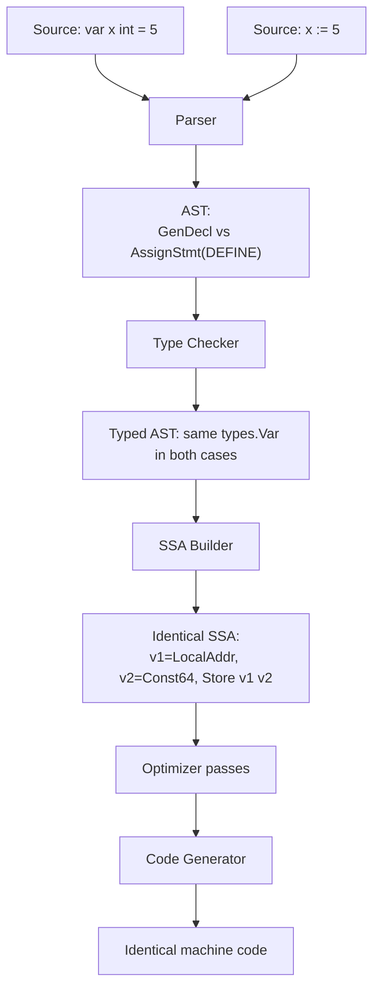
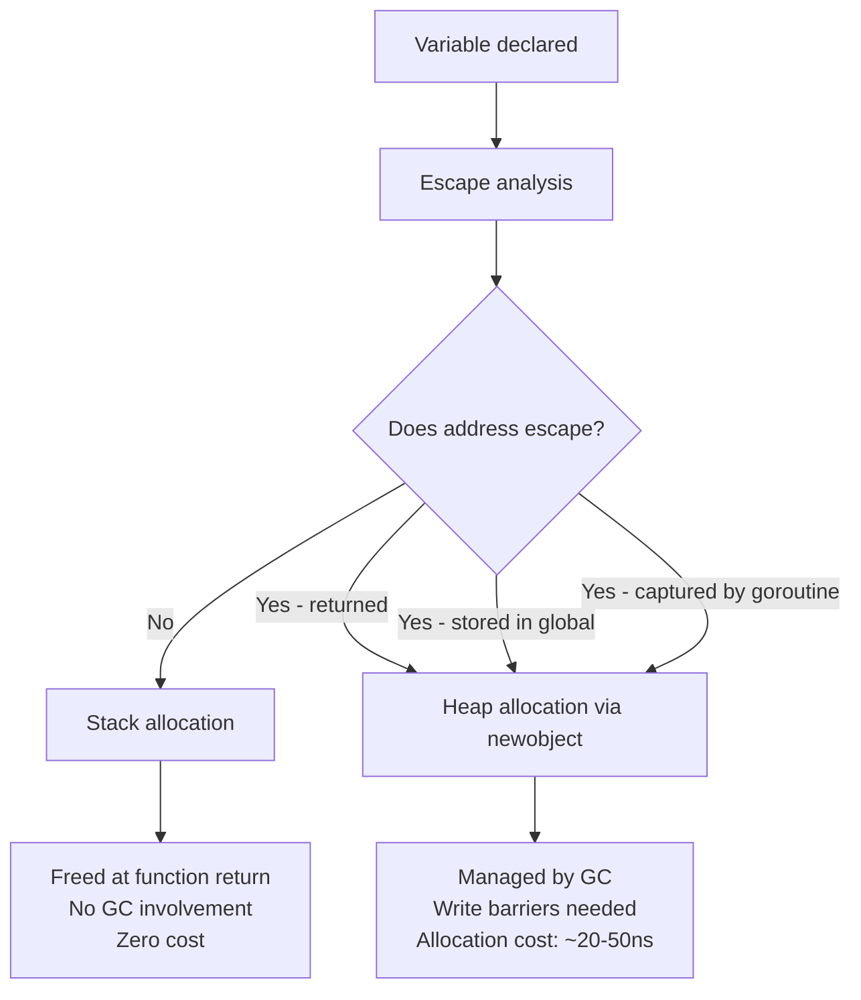
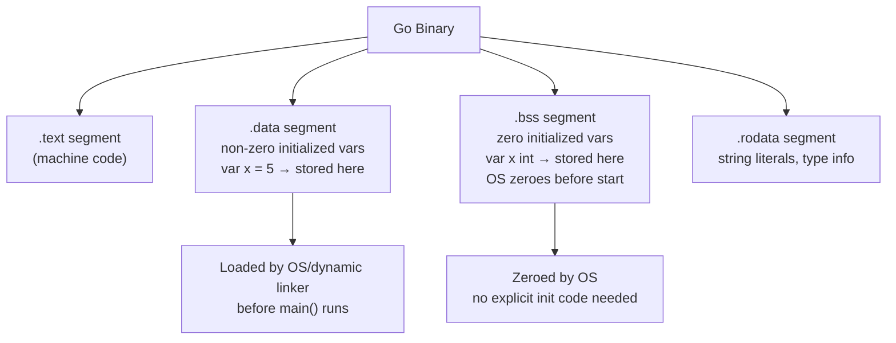

# var vs := (Short Variable Declaration) — Under the Hood

## Table of Contents
1. [Introduction](#introduction)
2. [How It Works Internally](#how-it-works-internally)
3. [Runtime Deep Dive](#runtime-deep-dive)
4. [Compiler Perspective](#compiler-perspective)
5. [Memory Layout](#memory-layout)
6. [OS / Syscall Level](#os--syscall-level)
7. [Source Code Walkthrough](#source-code-walkthrough)
8. [Assembly Output Analysis](#assembly-output-analysis)
9. [Performance Internals](#performance-internals)
10. [Metrics & Analytics (Runtime Level)](#metrics--analytics-runtime-level)
11. [Edge Cases at the Lowest Level](#edge-cases-at-the-lowest-level)
12. [Test](#test)
13. [Tricky Questions](#tricky-questions)
14. [Summary](#summary)
15. [Further Reading](#further-reading)
16. [Diagrams & Visual Aids](#diagrams--visual-aids)

---

## Introduction
> Focus: "What happens under the hood?"

From the programmer's perspective, `var x int = 5` and `x := 5` are two ways to do the same thing inside a function. But from the compiler's perspective, they both go through the same pipeline: parsing, type-checking, SSA construction, optimization passes, and finally code generation.

This file answers:
- What does the Go compiler actually do differently (if anything) with `var` vs `:=`?
- How does type inference work at the compiler level?
- What determines whether a variable lands on the stack or heap?
- What does the generated assembly look like?
- How does the Go runtime track variable lifetimes for garbage collection?
- What are the lowest-level edge cases and traps?

Understanding this level makes you capable of:
- Predicting and controlling allocation behavior
- Writing benchmarks that accurately measure variable declaration costs
- Understanding compiler warnings and escape analysis output
- Making informed decisions in performance-critical code paths

---

## How It Works Internally

### The Go Compiler Pipeline

```
Source (.go)
    │
    ▼
Lexer/Scanner   (go/scanner)
    │  tokens: VAR, IDENT, ASSIGN, DEFINE(:=), etc.
    ▼
Parser          (go/parser)
    │  AST: *ast.GenDecl (var), *ast.AssignStmt (with Tok=DEFINE)
    ▼
Type Checker    (go/types)
    │  resolves types, checks scope, performs type inference
    ▼
IR / SSA        (cmd/compile/internal/ir, ssa)
    │  intermediate representation, optimizer passes
    ▼
Code Generator  (cmd/compile/internal/amd64, arm64, etc.)
    │  platform-specific machine code
    ▼
Linker          (cmd/link)
    │
    ▼
Binary (.exe / ELF / Mach-O)
```

### AST Representation

```go
// var x int = 5
// Represented as: *ast.GenDecl with Tok=token.VAR
// Contains *ast.ValueSpec with Names, Type, Values

// x := 5
// Represented as: *ast.AssignStmt with Tok=token.DEFINE
// Contains Lhs (list of idents), Rhs (list of exprs)
```

You can inspect this yourself:

```go
package main

import (
    "go/ast"
    "go/parser"
    "go/token"
    "fmt"
)

func main() {
    src := `package p
func f() {
    var x int = 5
    y := 10
    _, _ = x, y
}`
    fset := token.NewFileSet()
    f, _ := parser.ParseFile(fset, "", src, 0)
    ast.Print(fset, f)
}
```

Run this and you will see `*ast.GenDecl` for `var x int = 5` and `*ast.AssignStmt` with `Tok: 47 (DEFINE)` for `y := 10`.

### Type Inference at Compiler Level

When the compiler sees `x := 5`, it:
1. Recognizes this is a `DEFINE` assignment
2. Evaluates the right-hand side expression `5`
3. Determines the **default type** of the untyped constant `5` → `int`
4. Creates a new variable `x` of type `int` in the current scope
5. Generates an initialization assignment `x = 5`

The key: untyped constants in Go have default types:
- Integer literal → `int`
- Float literal → `float64`
- Complex literal → `complex128`
- Rune literal → `rune` (alias for `int32`)
- String literal → `string`
- Boolean → `bool`

```go
x := 42        // x is int
y := 3.14      // y is float64
z := 'A'       // z is int32 (rune)
w := "hello"   // w is string
```

If the right-hand side is a typed expression, the variable gets that type:
```go
var n int32 = 5
x := n          // x is int32 (not int!)
y := n + 1      // y is int32
```

---

## Runtime Deep Dive

### Stack Frames and Variable Allocation

The Go runtime (written in Go and Plan 9 assembly, in `src/runtime/`) manages goroutine stacks. A goroutine starts with a small stack (currently 8KB on most platforms) that grows dynamically via **stack copying** (not segmented stacks since Go 1.4).

Variables declared with `var` or `:=` are placed on the **goroutine's stack** by default. The garbage collector does NOT manage stack variables — they are freed automatically when the function returns.

```
Goroutine Stack (grows downward):
┌──────────────────────┐  ← stack pointer (SP)
│  local variables     │  x := 5, y := "hello"
│  saved registers     │
│  return address      │
├──────────────────────┤
│  caller's frame      │
└──────────────────────┘
```

### Heap Allocation via Escape Analysis

The compiler performs escape analysis during compilation. If a variable's address "escapes" the function (returned as pointer, stored in a global, sent to goroutine, etc.), the variable is allocated on the heap instead.

```go
// Stack-allocated: result does not escape
func addStack(a, b int) int {
    result := a + b  // stays on stack
    return result    // value returned, not pointer
}

// Heap-allocated: result escapes via pointer
func addHeap(a, b int) *int {
    result := a + b  // escapes to heap
    return &result   // pointer returned
}
```

The escape analysis pass is in `src/cmd/compile/internal/escape/escape.go`.

### Variable Lifetime in the GC

Stack variables: freed when function returns (no GC involvement).
Heap variables: managed by the Go GC (tricolor mark-and-sweep, concurrent).

The GC uses write barriers to track pointer assignments. This is relevant when you assign a pointer variable:

```go
x := &SomeLargeStruct{}  // x is a pointer, SomeLargeStruct is on heap
// GC write barrier fires when x is stored anywhere
```

---

## Compiler Perspective

### SSA (Static Single Assignment) Form

After type checking, the compiler converts the code to SSA form, where each variable is assigned exactly once. Multiple assignments to the same variable become different SSA values (v1, v2, etc.).

For `var x int = 5` and `x := 5` inside a function, the SSA representation is **identical**:

```
// Both var x int = 5 and x := 5 produce:
v1 = LocalAddr <*int> {x} SP
v2 = Const64 <int> [5]
Store {int} v1 v2
```

This is why there is **no performance difference** between the two forms — they produce identical IR.

### The `var` at package level: a different path

Package-level `var` declarations do NOT go through function SSA. They are:
1. Stored in the data segment of the binary (if constant values)
2. Or initialized via the `init()` function generated by the compiler
3. Subject to zero initialization (BSS segment for zero values)

```go
var x int = 5    // goes to .data segment (non-zero initialized)
var y int        // goes to .bss segment (zero initialized)
```

The linker and OS loader handle initialization of these segments before `main()` runs.

### Type Checking and the `var` keyword

The type checker in `go/types` handles the two forms differently at the AST level, but produces the same typed variable in both cases:

```go
// var x int = 5
// TypeChecker: creates types.Var{name: "x", type: types.Typ[types.Int]}
// Checks: right-hand side is assignable to int

// x := 5
// TypeChecker: infers type of 5 → int
// Creates: types.Var{name: "x", type: types.Typ[types.Int]}
```

The end result in the type info is identical.

---

## Memory Layout

### Stack variable layout

For a simple function:
```go
func f() {
    a := 1
    b := 2
    c := a + b
    fmt.Println(c)
}
```

Stack frame (simplified, AMD64):
```
High address
┌──────────┐
│ c (int)  │  8 bytes
├──────────┤
│ b (int)  │  8 bytes
├──────────┤
│ a (int)  │  8 bytes
├──────────┤
│ ret addr │  8 bytes
└──────────┘
Low address (SP points here)
```

The compiler allocates space for all local variables at function entry. The `:=` or `var` syntax does not change the layout — the compiler decides the stack frame size at compile time.

### Heap variable layout

When a variable escapes to the heap, the runtime calls `mallocgc` (in `src/runtime/malloc.go`):

```
Heap object:
┌────────────────────┐
│ object header      │  (managed by runtime internally)
│ type info pointer  │
├────────────────────┤
│ actual data        │  int = 8 bytes
└────────────────────┘
```

The GC needs to know the type to scan pointers inside the object. This metadata is stored in the type descriptor.

### Zero initialization

Go guarantees all memory is zero-initialized. This is implemented at the hardware level:
- Stack frames: the compiler generates `MOVQ $0, offset(SP)` for each zero-initialized variable
- Heap objects: `mallocgc` uses `memclrNoHeapPointers` for zero initialization
- BSS segment: OS zeroes it before the program starts

```go
var x int    // guaranteed 0 — either BSS (package-level) or
             // explicit zeroing (function-level)
```

---

## OS / Syscall Level

### How Go requests memory from the OS

The Go runtime manages its own memory allocator, built on top of OS memory:

1. **mmap syscall** (Linux) or **VirtualAlloc** (Windows): the runtime requests large chunks (arenas, typically 64MB) from the OS.
2. The runtime's **span allocator** divides arenas into spans of various size classes.
3. Individual allocations are served from spans — no syscall per allocation.

For stack variables, no syscall happens — the goroutine's stack is pre-allocated.
For heap variables, only very large allocations (> 32KB) may trigger a syscall directly.

### Stack growth

If a goroutine's stack overflows its current size, the runtime:
1. Allocates a new, larger stack (2x the current size)
2. Copies all stack frames to the new stack
3. Updates all pointers to variables within the stack
4. Frees the old stack

This is transparent to the programmer. Variable addresses change during stack growth, which is why Go does NOT allow interior pointers to stack variables to escape (escape analysis prevents this).

---

## Source Code Walkthrough

### Where type inference happens

File: `src/cmd/compile/internal/typecheck/typecheck.go`

```go
// Simplified — actual code is more complex
func tcShortVarDecl(n *ir.AssignStmt) ir.Node {
    // For each name on the left side:
    // 1. Check if it already exists in current scope
    // 2. If not: create new variable, infer type from RHS
    // 3. If yes: verify at least one new variable exists
    // 4. Generate assignment
}
```

### Where escape analysis runs

File: `src/cmd/compile/internal/escape/escape.go`

The key function: `Batch.walkAll()` — traverses all function bodies and tracks whether variables' addresses escape.

### Where zero initialization happens

File: `src/cmd/compile/internal/walk/stmt.go`

The `zeroVal` function generates zero-initialization code for variables declared with `var x T` (no initializer).

---

## Assembly Output Analysis

### Comparing var vs := at assembly level

```go
package main

func varDecl() int {
    var x int = 5
    return x
}

func shortDecl() int {
    x := 5
    return x
}
```

Compile with: `go tool compile -S main.go`

Both functions produce **identical assembly** on AMD64:

```asm
"".varDecl STEXT nosplit size=8 args=0x8 locals=0x0
    MOVQ    $5, "".~r0+8(SP)
    RET

"".shortDecl STEXT nosplit size=8 args=0x8 locals=0x0
    MOVQ    $5, "".~r0+8(SP)
    RET
```

The compiler optimizes both to a constant move — no stack allocation even happens for the local variable because the compiler proves it is never mutated.

### With a mutable variable

```go
func mutableVar() int {
    var x int = 0
    x += 5
    x *= 2
    return x
}
```

Assembly (simplified):
```asm
"".mutableVar STEXT nosplit
    MOVQ    $0, x+0(SP)    // initialize x to 0
    ADDQ    $5, x+0(SP)    // x += 5
    SHLQ    $1, x+0(SP)    // x *= 2 (shift left by 1)
    MOVQ    x+0(SP), AX
    MOVQ    AX, "".~r0+8(SP)
    RET
```

### Heap escape example

```go
func escapingVar() *int {
    x := 42   // x escapes
    return &x
}
```

Assembly (simplified):
```asm
"".escapingVar STEXT
    // call runtime.newobject to allocate int on heap
    LEAQ    type.int(SB), AX
    CALL    runtime.newobject(SB)
    MOVQ    $42, (AX)       // store 42 into heap allocation
    MOVQ    AX, "".~r0+16(SP)  // return pointer
    RET
```

---

## Performance Internals

### Allocation costs

| Location | Cost |
|----------|------|
| Stack variable (non-escaping) | Zero — already allocated at function entry |
| Heap variable (small, < 32KB) | ~20-50 ns (span allocation, no syscall) |
| Heap variable (large, > 32KB) | ~1-5 μs (may trigger mmap syscall) |
| GC pressure from heap vars | Proportional to allocation rate and live set |

### Reducing allocations with var patterns

```go
// ALLOCATES every call (string escapes to interface for fmt.Println)
func logMessage(msg string) {
    fmt.Println(msg)
}

// Use a pre-allocated buffer for high-frequency logging
var logBuf bytes.Buffer  // zero-value ready

func logMessageFast(msg string) {
    logBuf.Reset()
    logBuf.WriteString(msg)
    logBuf.WriteByte('\n')
    os.Stdout.Write(logBuf.Bytes())
}
```

### sync.Pool for reducing GC pressure

```go
var bufPool = sync.Pool{
    New: func() interface{} {
        return new(bytes.Buffer)
    },
}

func processRequest(data []byte) []byte {
    buf := bufPool.Get().(*bytes.Buffer)
    defer func() {
        buf.Reset()
        bufPool.Put(buf)
    }()

    buf.Write(data)
    // process...
    result := make([]byte, buf.Len())
    copy(result, buf.Bytes())
    return result
}
```

### Memory profiling

```go
import "runtime/pprof"

// Write heap profile
f, _ := os.Create("heap.pprof")
defer f.Close()
pprof.WriteHeapProfile(f)
```

Then analyze: `go tool pprof heap.pprof`

---

## Metrics & Analytics (Runtime Level)

### Runtime statistics for allocations

```go
package main

import (
    "fmt"
    "runtime"
)

func measureAllocations(f func()) (allocs uint64, bytes uint64) {
    var before, after runtime.MemStats
    runtime.GC()
    runtime.ReadMemStats(&before)
    f()
    runtime.ReadMemStats(&after)
    return after.Mallocs - before.Mallocs,
        after.TotalAlloc - before.TotalAlloc
}

func main() {
    allocs, bytes := measureAllocations(func() {
        for i := 0; i < 1000; i++ {
            x := i * 2  // stack allocated — should not show up
            _ = x
        }
    })
    fmt.Printf("Allocations: %d, Bytes: %d\n", allocs, bytes)
    // Should print: Allocations: 0, Bytes: 0
}
```

### Benchmarking allocation differences

```go
package bench_test

import (
    "testing"
)

func BenchmarkStackAlloc(b *testing.B) {
    b.ReportAllocs()
    for i := 0; i < b.N; i++ {
        x := i * 2
        _ = x
    }
}

func BenchmarkHeapAlloc(b *testing.B) {
    b.ReportAllocs()
    for i := 0; i < b.N; i++ {
        x := new(int)
        *x = i * 2
        _ = x
    }
}
```

Run: `go test -bench=. -benchmem -count=5`

Expected:
```
BenchmarkStackAlloc-8    1000000000    0.27 ns/op    0 B/op    0 allocs/op
BenchmarkHeapAlloc-8       50000000   22.00 ns/op    8 B/op    1 allocs/op
```

---

## Edge Cases at the Lowest Level

### Edge case 1: Untyped constant propagation

```go
const c = 5  // untyped integer constant

func f() {
    x := c        // x is int (default type of untyped int constant)
    var y float64 = c  // c converted to float64
    _ = x
    _ = y
}
```

At the compiler level, untyped constants are carried as arbitrary-precision values until they are assigned to a typed variable. The type is resolved at the point of use.

### Edge case 2: Zero-size types

```go
type Empty struct{}

func f() {
    x := Empty{}   // zero-size type
    y := Empty{}   // zero-size type
    // x and y may have the same address!
    fmt.Println(&x == &y) // may print true
}
```

The Go specification allows the compiler to give zero-size variables the same address. This is an observable behavior at the machine level.

### Edge case 3: Compiler-generated initialization order

```go
var (
    x = initX()   // function call at init time
    y = x + 1     // depends on x
)

func initX() int {
    return 42
}
// Compiler guarantees: initX() runs, x = 42, then y = 43
// But if initX() panics, y is never initialized
```

### Edge case 4: `var` inside closure captures by reference

```go
func makeAdders() []func() int {
    result := make([]func() int, 3)
    for i := 0; i < 3; i++ {
        i := i  // NEW variable per iteration
        result[i] = func() int {
            return i  // each captures its own i
        }
    }
    return result
}
```

Without `i := i`, all closures share the same `i` variable (the loop variable). The `i := i` in the inner scope creates a NEW stack variable per iteration, and each closure captures its own copy.

At the assembly level, each closure holds a pointer to its captured variable (which lives on the heap after escape analysis determines closures outlive the function).

### Edge case 5: `var` in `select` with goroutines

```go
func producer() {
    ch := make(chan int)  // ch is stack-allocated initially

    go func() {
        ch <- 42  // ch escapes to heap because goroutine captures it
    }()

    v := <-ch
    fmt.Println(v)
}
```

`ch` escapes to heap because it is captured by a goroutine that outlives the `select` statement. The escape analysis detects this.

---

## Test

**Q1: Do `var x int = 5` and `x := 5` produce different assembly inside a function?**
No. The compiler generates identical machine code for both. You can verify with `go tool compile -S`.

**Q2: What Go runtime function is called when a variable escapes to the heap?**
`runtime.newobject` for single allocations, or `runtime.mallocgc` for the general allocator. You can see this in the assembly output.

**Q3: What is the zero-initialization mechanism for package-level `var x int`?**
The variable is placed in the `.bss` segment of the binary. The OS or dynamic linker zeroes this segment before the program starts — no explicit Go code is needed.

**Q4: How can you verify whether a variable is stack or heap allocated?**
Use `go build -gcflags='-m'` or `go build -gcflags='-m=2'` for more detail. Lines like `x escapes to heap` indicate heap allocation.

**Q5: What is SSA and why does it make var vs := equivalent?**
SSA (Static Single Assignment) is an IR form where each variable is assigned exactly once. Both `var x int = 5` and `x := 5` are lowered to the same SSA instruction: create binding for `x`, assign constant `5`. The compiler never sees the original syntax distinction.

---

## Tricky Questions

**Q: Can the Go compiler reorder package-level variable initializations?**
Yes — the compiler resolves dependency order. Variables without dependencies are initialized in source order, but when dependencies exist, the compiler reorders to satisfy them. Cycles are a compile error.

**Q: Why do zero-size types potentially share addresses?**
The Go specification explicitly allows this optimization: "Pointers to distinct zero-size variables may or may not be equal." The compiler can avoid allocating memory for zero-size types entirely, pointing all instances to a single global address (`runtime.zerobase`).

**Q: What does `runtime.zerobase` represent?**
It is a single global zero-byte variable at address `0x...` that all zero-size allocations can share. See `src/runtime/malloc.go`.

**Q: How does the write barrier interact with variable assignment?**
When a pointer value is stored to a variable that the GC might scan (heap variables or global variables), the compiler inserts a write barrier call. This notifies the GC that a new pointer relationship exists. Stack variables that do not escape do NOT require write barriers, which is another reason to prefer stack-allocated variables in hot paths.

**Q: What happens to `var x sync.Mutex` at the machine level?**
The compiler allocates space for the `sync.Mutex` struct (which is `{state int32; sema uint32}`, 8 bytes total) either on the stack or heap. The zero initialization sets both fields to 0. `state=0` means unlocked, `sema=0` means no waiters — the mutex is immediately usable.

---

## Summary

At the machine level:
- `var x int = 5` and `x := 5` inside a function compile to **identical machine code**.
- The distinction is **purely syntactic** — it exists in the AST and type checker but is eliminated by the time SSA is generated.
- **Package-level `var`** is fundamentally different: it creates symbols in binary segments (`.data` for non-zero, `.bss` for zero), initialized by the OS/runtime before `main()`.
- **Escape analysis** determines stack vs heap — not the declaration syntax. The key factor is whether the variable's address outlives the function.
- **Zero values** are guaranteed by the runtime: `memclrNoHeapPointers` for heap, `MOVQ $0` instructions or BSS segment for stack/global.
- **Type inference** works by determining the default type of untyped constants at the point of assignment.
- All of this means: choose `var` vs `:=` based on **clarity and idiom**, not performance. The compiler makes them equivalent.

---

## Further Reading

- [Go Specification — Variables](https://go.dev/ref/spec#Variables)
- [Go Compiler Internals (SSA)](https://github.com/golang/go/blob/master/src/cmd/compile/internal/ssa/README.md)
- [Escape Analysis in Go](https://go.dev/src/cmd/compile/internal/escape/escape.go)
- [Go Memory Allocator](https://go.dev/src/runtime/malloc.go)
- [Go Blog — The Go Memory Model](https://go.dev/ref/mem)
- [Go Blog — Profiling Go Programs](https://go.dev/blog/pprof)
- [Dave Cheney — High Performance Go Workshop](https://dave.cheney.net/high-performance-go-workshop/dotgo-paris.html)

---

## Diagrams & Visual Aids

### Diagram 1: Compiler pipeline — var vs :=



### Diagram 2: Stack vs Heap allocation decision



### Diagram 3: Binary segment layout for package-level variables


