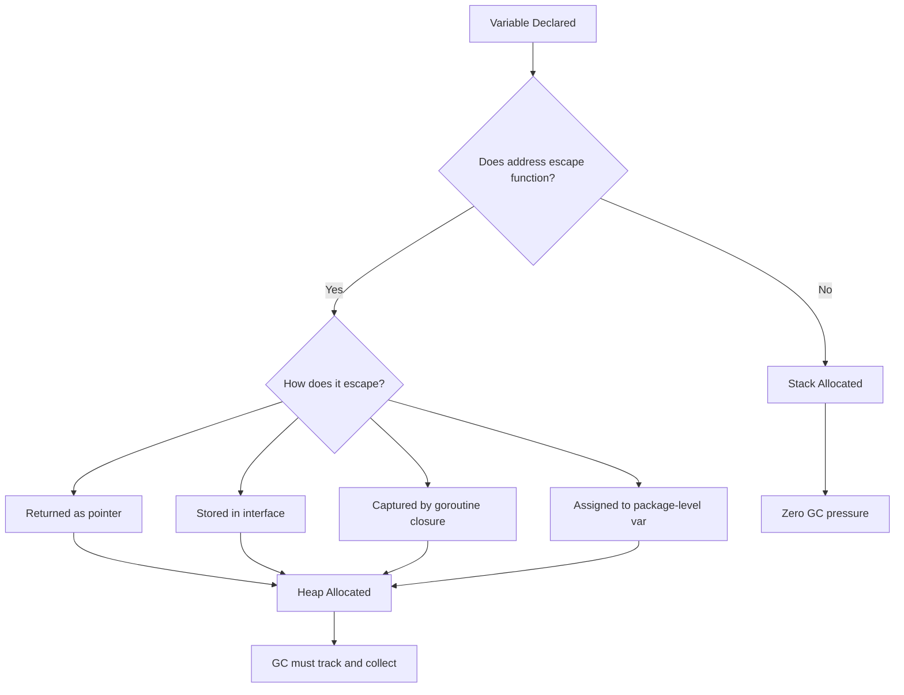
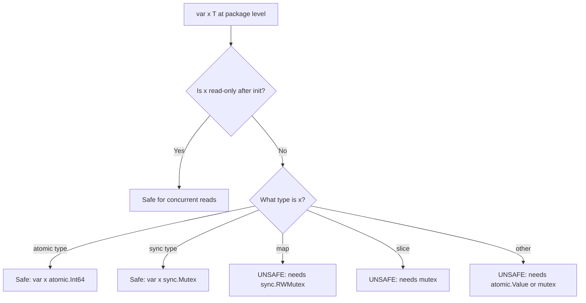
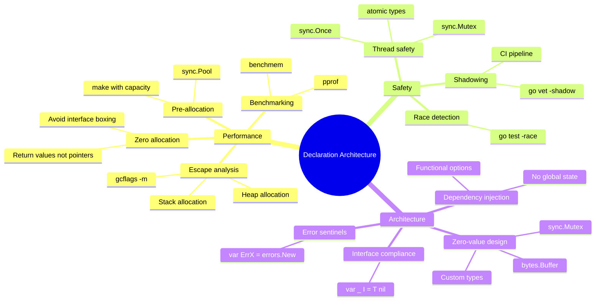

# var vs := — Senior Level

## Table of Contents

1. [Introduction](#introduction)
2. [Core Concepts](#core-concepts)
3. [Pros & Cons](#pros--cons)
4. [Use Cases](#use-cases)
5. [Code Examples](#code-examples)
6. [Coding Patterns](#coding-patterns)
7. [Clean Code](#clean-code)
8. [Best Practices](#best-practices)
9. [Product Use / Feature](#product-use--feature)
10. [Error Handling](#error-handling)
11. [Security Considerations](#security-considerations)
12. [Performance Optimization](#performance-optimization)
13. [Metrics & Analytics](#metrics--analytics)
14. [Debugging Guide](#debugging-guide)
15. [Edge Cases & Pitfalls](#edge-cases--pitfalls)
16. [Postmortems & System Failures](#postmortems--system-failures)
17. [Common Mistakes](#common-mistakes)
18. [Tricky Points](#tricky-points)
19. [Comparison with Other Languages](#comparison-with-other-languages)
20. [Test](#test)
21. [Tricky Questions](#tricky-questions)
22. [Cheat Sheet](#cheat-sheet)
23. [Summary](#summary)
24. [What You Can Build](#what-you-can-build)
25. [Further Reading](#further-reading)
26. [Related Topics](#related-topics)
27. [Diagrams & Visual Aids](#diagrams--visual-aids)

---

## Introduction

> Focus: "How to optimize?" and "How to architect?"

At the senior level, `var` vs `:=` is no longer about syntax — it is about **performance implications**, **escape analysis**, **memory layout**, and **architectural decisions** that affect large-scale Go systems.

You need to understand:
- How the compiler's escape analysis decides stack vs heap allocation based on declaration patterns
- How variable declaration affects cache behavior and memory pressure
- How architectural decisions about package-level state affect testability and concurrency safety
- How declaration patterns interact with Go's garbage collector

A senior engineer does not just write correct code — they write code that is predictable, benchmarkable, and maintainable at scale. Variable declaration might seem basic, but its implications ripple through the entire runtime behavior of your application.

---

## Core Concepts

### Concept 1: Escape Analysis and Variable Declarations

Every variable in Go is initially a candidate for stack allocation. The compiler's escape analysis determines whether it must "escape" to the heap:

```go
package main

import "fmt"

// Stack-allocated: x does not escape
func stackVar() int {
    x := 42
    return x // value is copied, x stays on stack
}

// Heap-allocated: x escapes via pointer
func heapVar() *int {
    x := 42
    return &x // x escapes to heap because pointer outlives function
}

// Heap-allocated: x escapes via interface
func interfaceVar() interface{} {
    x := 42
    return x // x escapes — interface boxing requires heap allocation
}

func main() {
    a := stackVar()
    b := heapVar()
    c := interfaceVar()
    fmt.Println(a, *b, c)
}
```

Run escape analysis:

```bash
go build -gcflags="-m -m" ./main.go
```

Output shows:
```
./main.go:9:2: x does not escape
./main.go:14:2: moved to heap: x
./main.go:20:2: x escapes to heap
```

**Key insight:** `var` vs `:=` does not affect escape analysis. What matters is how the variable is used after declaration.

### Concept 2: Stack vs Heap — Performance Impact

```go
package main

import "testing"

// BenchmarkStack — variable stays on stack
func BenchmarkStack(b *testing.B) {
    for i := 0; i < b.N; i++ {
        x := 42 // stack-allocated
        _ = x
    }
}

// BenchmarkHeap — variable escapes to heap
func BenchmarkHeap(b *testing.B) {
    var sink *int
    for i := 0; i < b.N; i++ {
        x := 42
        sink = &x // forces escape to heap
    }
    _ = sink
}
```

Expected results:
```
BenchmarkStack-8    1000000000    0.29 ns/op    0 B/op    0 allocs/op
BenchmarkHeap-8     100000000     15.2 ns/op    8 B/op    1 allocs/op
```

Heap allocation is ~50x slower and creates GC pressure.

### Concept 3: Package-Level Variables and Initialization Order

Go's package-level `var` declarations follow a strict initialization order defined in the specification:

```go
package config

import (
    "fmt"
    "os"
)

// Initialization order: dependencies first, then lexical order
var (
    // Step 1: Simple values (no dependencies)
    defaultPort = 8080

    // Step 2: Depends on defaultPort
    serverAddr = fmt.Sprintf(":%d", defaultPort)

    // Step 3: Depends on environment (evaluated at init time)
    env = os.Getenv("GO_ENV")

    // Step 4: Depends on env
    isProduction = env == "production"
)
```

The compiler performs topological sorting of package-level `var` declarations based on their dependencies. Circular dependencies cause a compile error.

### Concept 4: Zero-Value Design Pattern

Go's zero-value philosophy is a key architectural pattern. Many standard library types are designed to be useful at zero value:

```go
package main

import (
    "bytes"
    "net/http"
    "sync"
)

// All of these are ready to use without initialization:
var (
    mu     sync.Mutex     // unlocked
    wg     sync.WaitGroup // zero goroutines
    once   sync.Once      // not yet executed
    buf    bytes.Buffer   // empty, ready for writes
    client http.Client    // uses default transport
)

// Your types should follow the same pattern:
type ConnectionPool struct {
    mu    sync.Mutex
    conns []*Connection
    max   int // 0 means use default
}

func (p *ConnectionPool) maxConns() int {
    if p.max == 0 {
        return 10 // default
    }
    return p.max
}

// Usage: var pool ConnectionPool — ready to use
```

---

## Pros & Cons

### Architectural Trade-offs

| Decision | Pro | Con | Mitigation |
|----------|-----|-----|-----------|
| Package-level `var` for singletons | Simple, zero-init | Untestable, global state | Use dependency injection |
| `var` with `sync.Once` | Thread-safe lazy init | Complex teardown | Use context-based lifecycle |
| `:=` everywhere in functions | Concise | May hide type mismatches | Use linters for type safety |
| Explicit `var x Type` | Self-documenting types | Verbose | Only where type is non-obvious |
| `var` blocks for config | Organized, readable | Mutable global state | Use `const` where possible, or functional options |

---

## Use Cases

| Scenario | Declaration Pattern | Rationale |
|----------|-------------------|-----------|
| High-throughput server | Stack-only locals via `:=` | Minimize GC pressure |
| Object pool | `var pool = sync.Pool{...}` | Package-level, zero-init |
| gRPC service | `var` for interceptors, `:=` in handlers | Separate lifecycle concerns |
| Database layer | `var db *sql.DB` + `sync.Once` | Lazy, thread-safe init |
| Metrics collector | `var (metrics...)` block | Grouped, package-level |
| Hot path in parser | Pre-declare buffers with `var` | Reuse allocations |
| Configuration | Functional options, no package vars | Testable, immutable |

---

## Code Examples

### Example 1: Escape Analysis Control

```go
package main

import "fmt"

type Result struct {
    Value int
    Error string
}

// GOOD: Returns by value — Result stays on stack
func computeValue(input int) Result {
    r := Result{Value: input * 2}
    return r // copied, r does not escape
}

// BAD: Returns pointer — Result escapes to heap
func computePointer(input int) *Result {
    r := Result{Value: input * 2}
    return &r // r escapes to heap
}

// PATTERN: Accept pointer parameter to avoid allocation
func computeInto(input int, r *Result) {
    r.Value = input * 2
    r.Error = ""
}

func main() {
    // Stack path
    v := computeValue(21)
    fmt.Println(v)

    // Heap path
    p := computePointer(21)
    fmt.Println(p)

    // Pre-allocated path
    var r Result
    computeInto(21, &r)
    fmt.Println(r)
}
```

### Example 2: Reducing Allocations with `var` Pre-declaration

```go
package main

import (
    "encoding/json"
    "io"
    "net/http"
    "sync"
)

type APIResponse struct {
    Status string `json:"status"`
    Data   []Item `json:"data"`
}

type Item struct {
    ID   int    `json:"id"`
    Name string `json:"name"`
}

// GOOD: Use sync.Pool for hot-path allocations
var responsePool = sync.Pool{
    New: func() interface{} {
        return &APIResponse{}
    },
}

func handleGood(w http.ResponseWriter, r *http.Request) {
    resp := responsePool.Get().(*APIResponse)
    defer func() {
        resp.Status = ""
        resp.Data = resp.Data[:0] // reset but keep capacity
        responsePool.Put(resp)
    }()

    decoder := json.NewDecoder(r.Body)
    if err := decoder.Decode(resp); err != nil {
        http.Error(w, err.Error(), 400)
        return
    }
    io.WriteString(w, "ok")
}
```

### Example 3: Thread-Safe Package State

```go
package database

import (
    "database/sql"
    "sync"
)

var (
    db      *sql.DB
    once    sync.Once
    initErr error
)

// GetDB returns a lazily-initialized database connection.
// Thread-safe: sync.Once guarantees exactly one initialization.
func GetDB(dsn string) (*sql.DB, error) {
    once.Do(func() {
        db, initErr = sql.Open("postgres", dsn)
        if initErr != nil {
            return
        }
        initErr = db.Ping()
    })
    return db, initErr
}
```

### Example 4: Functional Options (Avoiding Package-Level var)

```go
package server

import "time"

type Server struct {
    host         string
    port         int
    readTimeout  time.Duration
    writeTimeout time.Duration
    maxConns     int
}

type Option func(*Server)

func WithPort(port int) Option {
    return func(s *Server) { s.port = port }
}

func WithTimeouts(read, write time.Duration) Option {
    return func(s *Server) {
        s.readTimeout = read
        s.writeTimeout = write
    }
}

func WithMaxConns(n int) Option {
    return func(s *Server) { s.maxConns = n }
}

// New creates a server with functional options.
// No package-level var needed — everything is explicit.
func New(host string, opts ...Option) *Server {
    s := &Server{
        host:         host,
        port:         8080,
        readTimeout:  30 * time.Second,
        writeTimeout: 30 * time.Second,
        maxConns:     100,
    }
    for _, opt := range opts {
        opt(s)
    }
    return s
}
```

### Example 5: Benchmark-Driven Declaration Choices

```go
package main

import (
    "fmt"
    "strings"
    "testing"
)

// Benchmark: var with pre-allocated buffer
func BenchmarkVarBuffer(b *testing.B) {
    for i := 0; i < b.N; i++ {
        var buf strings.Builder
        buf.Grow(1024) // pre-allocate
        for j := 0; j < 100; j++ {
            fmt.Fprintf(&buf, "item-%d,", j)
        }
        _ = buf.String()
    }
}

// Benchmark: := with no pre-allocation
func BenchmarkShortDecl(b *testing.B) {
    for i := 0; i < b.N; i++ {
        buf := strings.Builder{}
        for j := 0; j < 100; j++ {
            fmt.Fprintf(&buf, "item-%d,", j)
        }
        _ = buf.String()
    }
}
```

Note: `var buf strings.Builder` and `buf := strings.Builder{}` produce identical results. The performance difference comes from `Grow()`, not from `var` vs `:=`.

---

## Coding Patterns

### Pattern 1: The Builder Pattern with Zero Values

```go
type QueryBuilder struct {
    table   string
    wheres  []string
    args    []interface{}
    orderBy string
    limit   int
}

// Zero value is a valid starting point
func (q *QueryBuilder) From(table string) *QueryBuilder {
    q.table = table
    return q
}
// Usage: var q QueryBuilder — immediately usable
```

### Pattern 2: The Registry Pattern

```go
var (
    mu       sync.RWMutex
    handlers = make(map[string]http.Handler)
)

func Register(path string, h http.Handler) {
    mu.Lock()
    defer mu.Unlock()
    handlers[path] = h
}

func Get(path string) (http.Handler, bool) {
    mu.RLock()
    defer mu.RUnlock()
    h, ok := handlers[path]
    return h, ok
}
```

### Pattern 3: Hot-Path Variable Reuse

```go
func processRequests(reqs <-chan Request) {
    var (
        buf    bytes.Buffer
        result Result
    )
    for req := range reqs {
        buf.Reset()
        result = Result{}
        encode(&buf, req)
        decode(buf.Bytes(), &result)
        send(result)
    }
}
```

### Pattern 4: Compile-Time Interface Checks

```go
var _ Service = (*MyService)(nil)

type Service interface {
    Start() error
    Stop() error
}

type MyService struct{}
func (s *MyService) Start() error { return nil }
func (s *MyService) Stop() error  { return nil }
```

---

## Clean Code

| Principle | Guideline | Example |
|-----------|-----------|---------|
| Minimize package state | Avoid mutable package-level `var` | Use dependency injection instead |
| Zero-value readiness | Design types to work at zero value | `var buf bytes.Buffer` |
| Explicit over implicit | Use `var x Type` when type matters | `var id int64` not `id := int64(v)` |
| Scope reduction | Declare in smallest possible scope | `if err := f(); err != nil {}` |
| Testability | Inject dependencies, not global vars | Pass `*sql.DB` as parameter |
| Interface compliance | Use `var _ Interface = (*Type)(nil)` | Catches missing methods at compile time |
| Const over var | If value never changes, use `const` | `const maxRetries = 3` |

---

## Best Practices

1. **Benchmark before optimizing declarations** — `var` vs `:=` has zero runtime difference; focus on escape analysis
2. **Use `var _ Interface = (*Type)(nil)` for compile-time checks** — catches interface compliance early
3. **Design zero-value-ready types** — reduce initialization boilerplate
4. **Minimize package-level `var`** — each one is a potential concurrency bug and testing obstacle
5. **Use `sync.Pool` with `var` for hot-path object reuse** — reduces GC pressure
6. **Run `go build -gcflags="-m"` regularly** — understand what escapes to heap
7. **Use functional options over package-level config vars** — more testable, more explicit
8. **Prefer `const` over `var` when value never changes** — compiler can optimize better
9. **Group `var` declarations by lifecycle** — separate init-time config from runtime state
10. **Use `go vet -shadow` in CI** — catch shadowing bugs before production

---

## Product Use / Feature

| System Component | Declaration Architecture | Why |
|-----------------|-------------------------|-----|
| Load balancer | `var` for shared pools, `:=` in goroutines | Separate shared state from request-local |
| Message queue consumer | `var` for connection, `:=` for messages | Long-lived connection, short-lived processing |
| Metrics pipeline | `var (prometheus collectors)` | Must be registered at init time |
| Rate limiter | `var` for `sync.Map` or atomic counters | Shared mutable state needs careful declaration |
| Circuit breaker | Zero-value struct design | `var cb CircuitBreaker` ready to use |
| gRPC server | Dependency injection, minimal globals | Testable service implementations |

---

## Error Handling

### Pattern: Error Variable Sentinels

```go
package mypackage

import "errors"

var (
    ErrNotFound     = errors.New("not found")
    ErrUnauthorized = errors.New("unauthorized")
    ErrTimeout      = errors.New("operation timed out")
)

func GetItem(id string) (*Item, error) {
    item, err := db.Find(id)
    if err != nil {
        if errors.Is(err, sql.ErrNoRows) {
            return nil, ErrNotFound
        }
        return nil, fmt.Errorf("get item %s: %w", id, err)
    }
    return item, nil
}
```

### Pattern: Wrapping Errors in Declaration Chains

```go
func processOrder(ctx context.Context, orderID string) (err error) {
    defer func() {
        if err != nil {
            err = fmt.Errorf("processOrder(%s): %w", orderID, err)
        }
    }()

    order, err := fetchOrder(ctx, orderID)
    if err != nil {
        return err
    }

    payment, err := chargeCustomer(ctx, order)
    if err != nil {
        return err
    }

    _, err = shipOrder(ctx, order, payment)
    return err
}
```

---

## Security Considerations

| Threat | Declaration Pattern | Mitigation |
|--------|-------------------|-----------|
| Secrets in memory | `var secret string` lives in memory | Zero out `[]byte` secrets: `clear(secret)` (Go 1.21+) |
| Race on package vars | `var config Config` accessed concurrently | Use `sync.RWMutex` or `atomic.Value` |
| Exported mutable vars | `var Debug = false` in library | Make unexported, add getter |
| Init-order attacks | `var x = os.Getenv("KEY")` at init | Load secrets lazily with `sync.Once` |
| Reflection exposure | `var` fields accessible via reflect | Use unexported fields |

---

## Performance Optimization

### Benchmark: Stack vs Heap Allocation

```go
package bench

import "testing"

type Point struct{ X, Y float64 }

func BenchmarkStackAlloc(b *testing.B) {
    for i := 0; i < b.N; i++ {
        p := Point{X: 1.0, Y: 2.0}
        _ = p.X + p.Y
    }
}

func BenchmarkHeapAlloc(b *testing.B) {
    var sink *Point
    for i := 0; i < b.N; i++ {
        p := &Point{X: 1.0, Y: 2.0}
        sink = p
    }
    _ = sink
}
```

Expected results:
```
BenchmarkStackAlloc-8    1000000000    0.3 ns/op     0 B/op    0 allocs/op
BenchmarkHeapAlloc-8     50000000      24 ns/op      16 B/op   1 allocs/op
```

### Benchmark: Slice Declaration Patterns

```go
package bench

import "testing"

func BenchmarkNilSlice(b *testing.B) {
    for i := 0; i < b.N; i++ {
        var s []int
        for j := 0; j < 100; j++ {
            s = append(s, j)
        }
        _ = s
    }
}

func BenchmarkMakeSlice(b *testing.B) {
    for i := 0; i < b.N; i++ {
        s := make([]int, 0, 100)
        for j := 0; j < 100; j++ {
            s = append(s, j)
        }
        _ = s
    }
}
```

Expected results:
```
BenchmarkNilSlice-8     500000     3200 ns/op    2040 B/op    8 allocs/op
BenchmarkMakeSlice-8    2000000    780 ns/op     896 B/op     1 allocs/op
```

---

## Metrics & Analytics

| Metric | Tool | What It Tells You |
|--------|------|-------------------|
| Heap allocations | `go test -benchmem` | How many objects escape per operation |
| Escape analysis | `go build -gcflags="-m"` | Which variables escape and why |
| GC pause time | `runtime.ReadMemStats()` | Impact of heap allocations on latency |
| Memory profile | `pprof -alloc_space` | Which declarations cause most allocations |
| CPU profile | `pprof -cpu` | Time spent in allocation vs computation |

---

## Debugging Guide

### Debugging Escape Analysis

```bash
# Basic escape analysis
go build -gcflags="-m" ./...

# Verbose escape analysis (shows reasoning)
go build -gcflags="-m -m" ./...
```

### Debugging Variable Shadowing

```bash
go install golang.org/x/tools/go/analysis/passes/shadow/cmd/shadow@latest
go vet -vettool=$(which shadow) ./...
```

### Debugging Race Conditions on Package Variables

```bash
go test -race ./...
```

Fix with atomic:
```go
var counter atomic.Int64
go func() { counter.Add(1) }()
```

---

## Edge Cases & Pitfalls

### Pitfall 1: Named Return Shadowing in Deferred Functions

```go
func readFile(path string) (data []byte, err error) {
    f, err := os.Open(path)
    if err != nil {
        return nil, err
    }
    defer func() {
        closeErr := f.Close()
        if err == nil {
            err = closeErr // assigns to named return
        }
    }()
    data, err = io.ReadAll(f)
    return
}
```

### Pitfall 2: init() Function Variable Scope

```go
var db *sql.DB

func init() {
    // BAD: shadows package-level db
    db, err := sql.Open("postgres", dsn)

    // GOOD: use = to assign to package-level db
    var err error
    db, err = sql.Open("postgres", dsn)
}
```

### Pitfall 3: Goroutine Closure Over Loop Variable (pre-Go 1.22)

```go
for i := 0; i < 5; i++ {
    i := i // create new variable per iteration
    go func() { fmt.Println(i) }()
}
```

---

## Postmortems & System Failures

### Postmortem 1: Package-Level Map Race Condition

**Incident:** Production server crashed with concurrent map write panic.

**Root cause:** `var handlers = map[string]Handler{}` written to by multiple goroutines.

**Fix:**
```go
var (
    handlerMu sync.RWMutex
    handlers  = map[string]Handler{}
)
```

**Lesson:** Every mutable package-level `var` is a potential race condition.

### Postmortem 2: Shadowed Error in Init

**Incident:** Database connection was nil at runtime despite successful `init()`.

**Root cause:** `db, err := sql.Open(...)` in init() shadowed package-level `db`.

**Fix:** Use `var err error` then `db, err = sql.Open(...)`.

### Postmortem 3: Memory Leak from Slice Header

**Incident:** Worker process OOM after running for days.

**Root cause:** `cache = data[:10]` kept reference to entire underlying array.

**Fix:** `cache = make([]byte, 10); copy(cache, data[:10])`

---

## Common Mistakes

| Mistake | Impact | Detection | Fix |
|---------|--------|-----------|-----|
| Shadowed `err` in init() | nil pointer at runtime | `go vet -shadow` | Use `=` with separate `var err error` |
| Unsynchronized package var | Data race, crash | `go test -race` | `sync.Mutex` or `atomic` |
| Escape to heap via interface{} | GC pressure | `go build -gcflags="-m"` | Type-specific functions |
| Mutable exported var | External modification | Code review | Unexported + getter |
| Not pre-allocating slices | Repeated allocs in loop | `benchmem` | `make([]T, 0, n)` |

---

## Tricky Points

### Tricky Point 1: The `i := i` Idiom

```go
for i := 0; i < 5; i++ {
    i := i // creates per-iteration copy (pre-Go 1.22)
    go func() { fmt.Println(i) }()
}
```

### Tricky Point 2: var for Compile-Time Interface Assertion

```go
var _ fmt.Stringer = (*MyType)(nil)
var _ io.ReadCloser = (*MyFile)(nil)
```

### Tricky Point 3: Type Assertion with `:=`

```go
var i interface{} = "hello"
if s, ok := i.(string); ok {
    fmt.Println(s)
}
s := i.(string) // panics if wrong type
```

---

## Comparison with Other Languages

| Feature | Go | Rust | C++ | Java |
|---------|-----|------|-----|------|
| Stack/heap decision | Compiler (escape analysis) | Explicit (Box, Rc) | Explicit (stack/new) | Always heap (objects) |
| Zero values | Defined for all types | Must initialize | Undefined behavior | null/0/false |
| Type inference | `:=` / `var x = v` | `let x = v` | `auto x = v` | `var x = v` (10+) |
| Global state | `var` at package level | `static` | Global scope | `static` fields |
| Thread safety | Manual (mutex/atomic) | Compiler-enforced | Manual | Manual |

---

## Test

### Question 1

What does `go build -gcflags="-m"` tell you about variable declarations?

- A) Runtime performance of each variable
- B) Which variables escape to the heap
- C) Memory size of each variable
- D) Variable naming violations

<details>
<summary>Answer</summary>

**B) Which variables escape to the heap** — The `-m` flag enables escape analysis output.

</details>

### Question 2

Which package-level declaration is thread-safe without additional synchronization?

```go
var A = 42
var B = map[string]int{}
var C sync.Mutex
var D atomic.Int64
```

- A) All of them
- B) Only A and C
- C) Only C and D
- D) Only D

<details>
<summary>Answer</summary>

**C) Only C and D** — `sync.Mutex` and `atomic.Int64` are designed for concurrent use.

</details>

### Question 3

Why is `var _ io.Writer = (*MyType)(nil)` useful?

- A) It creates a nil writer for testing
- B) It validates interface compliance at compile time
- C) It initializes MyType's writer methods
- D) It registers MyType with the io package

<details>
<summary>Answer</summary>

**B) It validates interface compliance at compile time.**

</details>

### Question 4

In a hot loop processing 1M items, which is likely faster?

```go
// Option A: new variable per iteration
for _, item := range items {
    result := process(item)
    send(result)
}

// Option B: reused variable
var result Result
for _, item := range items {
    result = process(item)
    send(result)
}
```

- A) Option A
- B) Option B
- C) Same
- D) Depends on whether Result escapes

<details>
<summary>Answer</summary>

**D) Depends on whether Result escapes** — If Result stays on stack, both are equivalent. Always benchmark.

</details>

---

## Tricky Questions

### Question 1

```go
var x = func() int { return 42 }()
```

Is this valid? What is `x`?

<details>
<summary>Answer</summary>

**Yes.** `x` is `int` with value `42`. It is an immediately-invoked function expression.

</details>

### Question 2

```go
var (
    a = b + 1
    b = 1
)
```

Does this compile? What are the values?

<details>
<summary>Answer</summary>

**Yes.** Go uses dependency analysis for package-level init. `b = 1` first, then `a = 2`.

</details>

### Question 3

Can you use `:=` to declare a variable of type `[]int` with length 0 and capacity 100?

<details>
<summary>Answer</summary>

**Yes:** `s := make([]int, 0, 100)`.

</details>

---

## Cheat Sheet

| Situation | Pattern | Reason |
|-----------|---------|--------|
| Interface compliance | `var _ I = (*T)(nil)` | Compile-time check |
| Thread-safe singleton | `var x; sync.Once` | Lazy, safe init |
| Error sentinels | `var ErrX = errors.New(...)` | Package-level, exported |
| Hot-path reuse | `var buf T; for { buf.Reset() }` | Reduce allocations |
| Escape prevention | Return value, not pointer | Stack allocation |
| Pre-allocation | `s := make([]T, 0, n)` | Avoid repeated growth |
| Atomic counter | `var c atomic.Int64` | Lock-free thread safety |
| Zero-value type | `var x sync.Mutex` | Ready to use |
| Config injection | Functional options | No global state |
| CI safety | `go vet -shadow` | Catch shadowing |

---

## Summary

- **`var` vs `:=` produces identical machine code** — performance difference is zero
- **Escape analysis is what matters** — usage pattern determines stack vs heap
- **Package-level `var` is global state** — prefer dependency injection
- **Zero-value design** is a senior pattern — `var x MyType` should be immediately useful
- **Pre-allocation with `make`** is the biggest performance win
- **`sync.Pool`**, **`sync.Once`**, and **`atomic`** manage shared `var` safely
- **`go vet -shadow`** and **`go build -gcflags="-m"`** belong in every CI pipeline
- **Benchmarks, not assumptions** — always measure before optimizing

---

## What You Can Build

With senior-level understanding of variable declarations, you can:

- Design zero-allocation hot paths by controlling escape analysis
- Build thread-safe package APIs with proper synchronization
- Create zero-value-ready types that minimize boilerplate
- Architect systems with minimal global state and maximum testability
- Optimize memory-intensive applications by pre-allocating and pooling
- Set up CI pipelines that catch shadowing and race conditions

---

## Further Reading

- [Go Specification — Variable Declarations](https://go.dev/ref/spec#Variable_declarations)
- [Go Specification — Package Initialization](https://go.dev/ref/spec#Package_initialization)
- [Go Blog — Profiling Go Programs](https://go.dev/blog/pprof)
- [Dave Cheney — Escape Analysis](https://dave.cheney.net/2015/10/09/padding-is-hard)
- [William Kennedy — Escape Analysis](https://www.ardanlabs.com/blog/2017/05/language-mechanics-on-escape-analysis.html)
- [Go Wiki — CodeReviewComments](https://github.com/golang/go/wiki/CodeReviewComments)

---

## Related Topics

| Topic | Relationship |
|-------|-------------|
| [Zero Values](../../01-variables-and-constants/02-zero-values/) | Foundation of `var x Type` pattern |
| [Scope & Shadowing](../../01-variables-and-constants/04-scope-and-shadowing/) | Critical for avoiding `:=` bugs |
| [Constants & iota](../../01-variables-and-constants/03-const-and-iota/) | `const` avoids mutability issues of `var` |
| [Type Conversion](../../02-data-types/05-type-conversion/) | When `:=` infers the wrong type |
| Memory Management | Escape analysis, stack vs heap |
| Concurrency | sync.Mutex, atomic for package-level vars |

---

## Diagrams & Visual Aids

### Flowchart: Escape Analysis Decision



### Flowchart: Package-Level var Safety



### Mind Map: Senior Declaration Architecture


