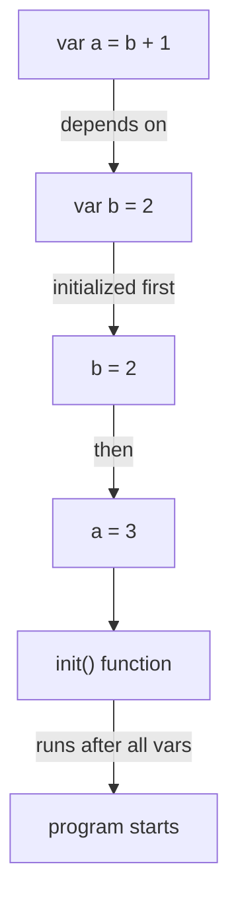
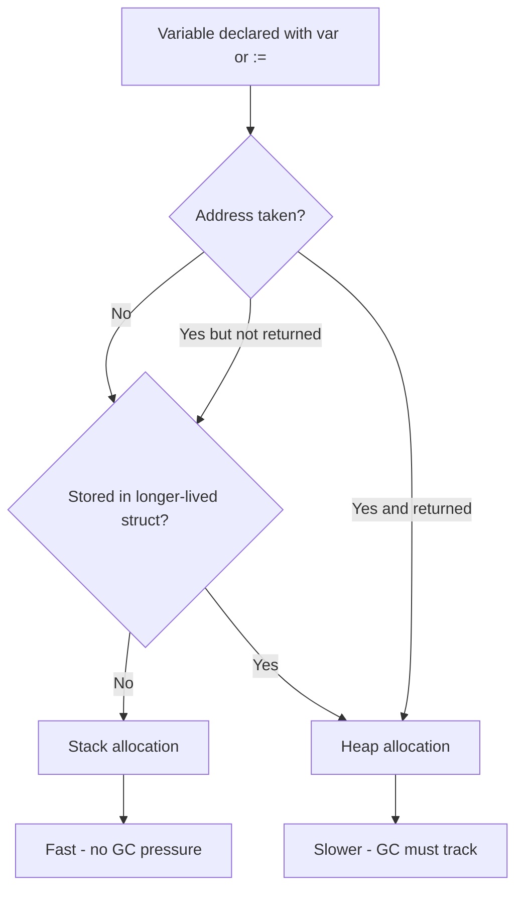
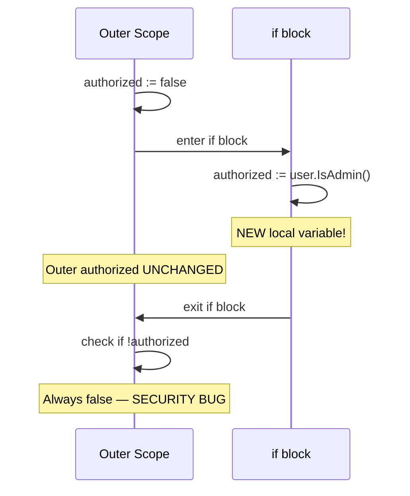

# var vs := (Short Variable Declaration) — Senior Level

## Table of Contents
1. [Introduction](#introduction)
2. [Core Concepts](#core-concepts)
3. [Pros & Cons](#pros--cons)
4. [Use Cases](#use-cases)
5. [Code Examples](#code-examples)
6. [Coding Patterns](#coding-patterns)
7. [Clean Code](#clean-code)
8. [Best Practices](#best-practices)
9. [Product Use / Feature](#product-use--feature)
10. [Error Handling](#error-handling)
11. [Security Considerations](#security-considerations)
12. [Performance Optimization](#performance-optimization)
13. [Metrics & Analytics](#metrics--analytics)
14. [Debugging Guide](#debugging-guide)
15. [Edge Cases & Pitfalls](#edge-cases--pitfalls)
16. [Postmortems & System Failures](#postmortems--system-failures)
17. [Common Mistakes](#common-mistakes)
18. [Tricky Points](#tricky-points)
19. [Comparison with Other Languages](#comparison-with-other-languages)
20. [Test](#test)
21. [Tricky Questions](#tricky-questions)
22. [Cheat Sheet](#cheat-sheet)
23. [Summary](#summary)
24. [What You Can Build](#what-you-can-build)
25. [Further Reading](#further-reading)
26. [Related Topics](#related-topics)
27. [Diagrams & Visual Aids](#diagrams--visual-aids)

---

## Introduction
> Focus: "How to architect?" "How to optimize?" "How to lead a team?"

At the senior level, `var` vs `:=` is a lens for broader architectural thinking. The question is not "which syntax do I use?" but:

- How does variable declaration style affect the **readability of large codebases** under production pressure?
- How do **linter rules and CI enforcement** ensure team consistency?
- How do **scoping choices influence correctness** of concurrent code?
- What are the **compiler and runtime implications** for performance-critical paths?
- How do I **conduct code reviews** that catch declaration-related bugs before they reach production?

Senior engineers set standards. They write style guides, configure linters, design interfaces, and review code from dozens of contributors. Understanding `var` vs `:=` at a deep level enables you to make principled decisions, explain them clearly, and enforce them consistently.

Key architectural insights at this level:
- **Package-level `var` declarations are initialization order-sensitive** — the compiler resolves dependency order, but cycles cause runtime panics.
- **Escape analysis is affected by how you use variables, not how you declare them** — but declaration placement affects escape analysis outcomes.
- **The blank identifier `_` is a communication tool** — it tells the reader (and the compiler) that a value is intentionally discarded.
- **In concurrent code, variable declaration placement affects whether a race condition is possible** — declaring inside a goroutine versus outside it has fundamentally different semantics.

---

## Core Concepts

### Package Initialization Order

Go initializes package-level variables in dependency order. Variables without dependencies are initialized in the order they appear in source.

```go
package main

import "fmt"

var (
    a = b + 1   // a depends on b
    b = 2       // b has no dependencies
)
// Initialization order: b=2, then a=3

func main() {
    fmt.Println(a, b) // 3 2
}
```

**Cycle detection:** If `a` depends on `b` and `b` depends on `a`, the compiler rejects it:
```
initialization loop: a refers to b refers to a
```

### Escape Analysis and Variable Placement

The Go compiler performs escape analysis to determine whether a variable lives on the stack or heap. Declaration style (`var` vs `:=`) does not change this — but usage patterns do.

```go
// Both of these are equivalent from escape analysis perspective:
func f1() *int {
    x := 42     // x escapes to heap (address taken and returned)
    return &x
}

func f2() *int {
    var x int = 42  // same — x escapes to heap
    return &x
}
```

To verify: `go build -gcflags='-m=2' ./...`

### The `init()` Function and Package-Level State

```go
package db

var pool *sql.DB  // declared, zero value = nil

func init() {
    var err error
    pool, err = sql.Open("postgres", dsn)
    if err != nil {
        panic(fmt.Sprintf("db.init: %v", err))
    }
}
```

Note: `pool` is declared with `var` (package level). Inside `init()`, the assignment uses `=` (not `:=`) because `pool` is already declared.

### Concurrent Access Patterns

```go
// RACE CONDITION: x declared outside goroutine, written inside
func racyCode() {
    x := 0
    go func() {
        x = 42  // writes to x without synchronization
    }()
    fmt.Println(x) // reads x — potential race
}

// CORRECT: each goroutine has its own variable
func safeCode() {
    for i := 0; i < 10; i++ {
        i := i  // declare new i per iteration (pre-Go 1.22)
        go func() {
            fmt.Println(i)
        }()
    }
}
```

---

## Pros & Cons

### Senior perspective on `var`

| Situation | Use `var` because... |
|-----------|---------------------|
| Package-level state | Required; signals module-level lifetime |
| Zero-value-ready types (`sync.Mutex`, `bytes.Buffer`) | Communicates design intent — zero value is meaningful |
| Long functions with deferred use | Declares variable far from its initialization — clear separation |
| Interface-typed variables | `var w io.Writer = os.Stdout` preserves interface type |
| Generated code | Explicitness prevents ambiguity |

### Senior perspective on `:=`

| Situation | Use `:=` because... |
|-----------|---------------------|
| Error chains in handlers | Re-assigns `err`, introduces new vars cleanly |
| Complex multi-return logic | Concise, natural |
| Short-lived local state | Minimum scope, maximum clarity |
| Loop variables | Natural for `for i := range ...` |

---

## Use Cases

### Architectural Use Case 1: Middleware chain

```go
package middleware

import (
    "context"
    "net/http"
    "time"
)

type contextKey string

const requestIDKey contextKey = "requestID"

func RequestID(next http.Handler) http.Handler {
    return http.HandlerFunc(func(w http.ResponseWriter, r *http.Request) {
        requestID := generateID()  // := for local var
        ctx := context.WithValue(r.Context(), requestIDKey, requestID)
        r = r.WithContext(ctx)
        next.ServeHTTP(w, r)
    })
}

func Logging(next http.Handler) http.Handler {
    return http.HandlerFunc(func(w http.ResponseWriter, r *http.Request) {
        start := time.Now()      // := for timing
        next.ServeHTTP(w, r)
        duration := time.Since(start)  // := for computed value
        log(r, duration)
    })
}

func generateID() string { return "id-123" }
func log(r *http.Request, d time.Duration) {}
```

### Architectural Use Case 2: Repository pattern with zero-value

```go
package repo

import "database/sql"

type UserRepository struct {
    db *sql.DB
}

func (r *UserRepository) FindByID(id int) (*User, error) {
    var u User  // zero value — will be populated by Scan

    err := r.db.QueryRow(
        "SELECT id, name, email FROM users WHERE id = $1", id,
    ).Scan(&u.ID, &u.Name, &u.Email)

    if err == sql.ErrNoRows {
        return nil, nil
    }
    if err != nil {
        return nil, fmt.Errorf("UserRepository.FindByID: %w", err)
    }

    return &u, nil
}
```

---

## Code Examples

### Example 1: Interface type preservation

```go
package main

import (
    "fmt"
    "io"
    "os"
)

func writeData(w io.Writer, data []byte) error {
    _, err := w.Write(data)
    return err
}

func main() {
    // var preserves interface type — w is io.Writer
    var w io.Writer = os.Stdout

    // := infers concrete type — f is *os.File
    f, err := os.Create("/tmp/test.txt")
    if err != nil {
        fmt.Println(err)
        return
    }
    defer f.Close()

    // Both work as io.Writer
    writeData(w, []byte("stdout\n"))
    writeData(f, []byte("file\n"))
}
```

### Example 2: Concurrent worker pattern

```go
package main

import (
    "fmt"
    "sync"
)

func main() {
    var wg sync.WaitGroup  // zero value is ready
    results := make([]int, 10)

    for i := 0; i < 10; i++ {
        wg.Add(1)
        i := i  // capture loop var (pre-Go 1.22)
        go func() {
            defer wg.Done()
            results[i] = i * i
        }()
    }

    wg.Wait()
    fmt.Println(results)
}
```

### Example 3: Functional options pattern

```go
package server

import "time"

type Server struct {
    addr    string
    timeout time.Duration
    maxConn int
}

type Option func(*Server)

var (
    defaultAddr    = ":8080"
    defaultTimeout = 30 * time.Second
    defaultMaxConn = 1000
)

func New(opts ...Option) *Server {
    s := &Server{
        addr:    defaultAddr,
        timeout: defaultTimeout,
        maxConn: defaultMaxConn,
    }
    for _, opt := range opts {
        opt(s)
    }
    return s
}

func WithAddr(addr string) Option {
    return func(s *Server) {
        s.addr = addr
    }
}

func WithTimeout(t time.Duration) Option {
    return func(s *Server) {
        s.timeout = t
    }
}
```

### Example 4: Context propagation (correct scoping)

```go
package main

import (
    "context"
    "fmt"
    "time"
)

func processWithTimeout(parent context.Context, task func(context.Context) error) error {
    ctx, cancel := context.WithTimeout(parent, 5*time.Second)
    defer cancel()

    errCh := make(chan error, 1)
    go func() {
        errCh <- task(ctx)
    }()

    select {
    case err := <-errCh:
        return err
    case <-ctx.Done():
        return ctx.Err()
    }
}

func main() {
    err := processWithTimeout(context.Background(), func(ctx context.Context) error {
        fmt.Println("task running")
        return nil
    })
    if err != nil {
        fmt.Println("error:", err)
    }
}
```

---

## Coding Patterns

### Pattern 1: Table-driven test setup

```go
func TestProcess(t *testing.T) {
    tests := []struct {
        name  string
        input int
        want  int
    }{
        {"zero", 0, 0},
        {"positive", 5, 25},
        {"negative", -3, 9},
    }

    for _, tt := range tests {
        tt := tt  // capture (pre-Go 1.22)
        t.Run(tt.name, func(t *testing.T) {
            t.Parallel()
            got := square(tt.input)
            if got != tt.want {
                t.Errorf("square(%d) = %d, want %d", tt.input, got, tt.want)
            }
        })
    }
}

func square(n int) int { return n * n }
```

### Pattern 2: Builder with var zero-value

```go
type QueryBuilder struct {
    table      string
    conditions []string
    limit      int
    offset     int
}

func NewQuery(table string) *QueryBuilder {
    return &QueryBuilder{table: table}
    // conditions is nil (zero value) — valid for append
    // limit and offset are 0 — valid defaults
}

func (q *QueryBuilder) Where(cond string) *QueryBuilder {
    q.conditions = append(q.conditions, cond)
    return q
}
```

---

## Clean Code

### Principle: Declaration tells a story

```go
// This declaration tells a complete story:
// "I'm creating a buffer that starts empty and grows as needed"
var buf bytes.Buffer

// This is noisier and less idiomatic:
buf := bytes.Buffer{}

// This adds unnecessary complexity:
buf := new(bytes.Buffer)
*buf = bytes.Buffer{}
```

### Code review checklist for variable declarations

When reviewing Go code, check:
1. Are package-level variables using `var`? (Required)
2. Are local variables using `:=` where appropriate? (Idiomatic)
3. Is there accidental shadowing of `err`, `ctx`, or security-sensitive values?
4. Are zero-value signals (`var x T` without initialization) used intentionally?
5. Are variables declared close to their first use?
6. Are all declared variables actually used? (Compiler enforces this, but check `_`)
7. Are interface types preserved with `var`?

---

## Best Practices

### Team standards and linter configuration

```yaml
# .golangci.yml
linters:
  enable:
    - govet          # catches shadow with -shadow flag
    - staticcheck    # SA1001: variable shadowing
    - revive         # var-declaration style checks
    - exhaustive     # ensures completeness

linters-settings:
  govet:
    enable:
      - shadow
```

### Standard library patterns to emulate

```go
// From net/http — zero-value Server is usable
var DefaultServeMux = &ServeMux{}
var DefaultClient = &Client{}

// From sync — zero value is a valid unlocked mutex
var mu sync.Mutex

// From bytes — zero value is empty buffer
var buf bytes.Buffer
```

---

## Product Use / Feature

### Feature: Distributed tracing context

```go
package tracing

import (
    "context"
    "fmt"
)

type spanKey struct{}

type Span struct {
    TraceID string
    SpanID  string
    Name    string
}

func StartSpan(ctx context.Context, name string) (context.Context, *Span) {
    span := &Span{
        TraceID: generateTraceID(),
        SpanID:  generateSpanID(),
        Name:    name,
    }
    return context.WithValue(ctx, spanKey{}, span), span
}

func SpanFromContext(ctx context.Context) (*Span, bool) {
    span, ok := ctx.Value(spanKey{}).(*Span)
    return span, ok
}

func generateTraceID() string { return fmt.Sprintf("trace-%d", 1) }
func generateSpanID() string  { return fmt.Sprintf("span-%d", 1) }
```

### Feature: Rate limiter with package-level state

```go
package ratelimit

import (
    "sync"
    "time"
)

var (
    mu       sync.Mutex
    counters = make(map[string]*counter)
)

type counter struct {
    count    int
    resetAt  time.Time
}

func Allow(key string, limit int, window time.Duration) bool {
    mu.Lock()
    defer mu.Unlock()

    c, ok := counters[key]
    if !ok || time.Now().After(c.resetAt) {
        counters[key] = &counter{
            count:   1,
            resetAt: time.Now().Add(window),
        }
        return true
    }

    if c.count >= limit {
        return false
    }
    c.count++
    return true
}
```

---

## Error Handling

### Wrapping errors with context

```go
func (s *Service) CreateUser(ctx context.Context, req *CreateUserRequest) (*User, error) {
    if err := req.Validate(); err != nil {
        return nil, fmt.Errorf("CreateUser validate: %w", err)
    }

    hashedPwd, err := bcrypt.GenerateFromPassword([]byte(req.Password), bcrypt.DefaultCost)
    if err != nil {
        return nil, fmt.Errorf("CreateUser hash: %w", err)
    }

    user, err := s.repo.Create(ctx, &User{
        Name:         req.Name,
        Email:        req.Email,
        PasswordHash: string(hashedPwd),
    })
    if err != nil {
        return nil, fmt.Errorf("CreateUser persist: %w", err)
    }

    return user, nil
}
```

Each `:=` introduces a new variable alongside re-using `err`. The pattern chains cleanly.

---

## Security Considerations

### Critical: Do not shadow authentication/authorization results

```go
// SECURITY BUG: authorized is shadowed
func handleAdminAction(w http.ResponseWriter, r *http.Request) {
    authorized := false

    if claims, err := parseJWT(r); err == nil {
        authorized := claims.Role == "admin"  // shadows outer!
        _ = authorized
    }

    if !authorized {  // always false — authorization bypassed!
        http.Error(w, "Forbidden", http.StatusForbidden)
        return
    }

    performAdminAction(w)
}

// FIXED
func handleAdminActionFixed(w http.ResponseWriter, r *http.Request) {
    authorized := false

    if claims, err := parseJWT(r); err == nil {
        authorized = claims.Role == "admin"  // = not :=
    }

    if !authorized {
        http.Error(w, "Forbidden", http.StatusForbidden)
        return
    }

    performAdminAction(w)
}
```

### Input validation scope

```go
func processPayment(amount float64, currency string) error {
    // Validate and scope the sanitized value
    if sanitized, err := validateAmount(amount, currency); err != nil {
        return fmt.Errorf("invalid amount: %w", err)
    } else {
        return chargeCard(sanitized)  // uses validated value, not raw amount
    }
}
```

---

## Performance Optimization

### Stack allocation patterns

Prefer stack-allocated variables by:
1. Not returning pointers to local variables unless necessary
2. Not storing locals in long-lived data structures
3. Using value receivers where appropriate

```go
// Escapes to heap — &result is returned
func sumPtr(nums []int) *int {
    result := 0
    for _, n := range nums {
        result += n
    }
    return &result
}

// Stays on stack — result is returned by value
func sumVal(nums []int) int {
    result := 0
    for _, n := range nums {
        result += n
    }
    return result
}
```

### Pre-allocating with var vs make

```go
// For slices that will grow: use make with capacity hint
func collectResults(n int) []int {
    results := make([]int, 0, n)  // pre-allocated
    for i := 0; i < n; i++ {
        results = append(results, i*i)
    }
    return results
}

// For maps: pre-allocate when size is known
func buildIndex(items []Item) map[string]Item {
    index := make(map[string]Item, len(items))
    for _, item := range items {
        index[item.Key] = item
    }
    return index
}
```

### Benchmark: stack vs heap

```go
package bench

import "testing"

func BenchmarkStackVar(b *testing.B) {
    for i := 0; i < b.N; i++ {
        x := sumVal([]int{1, 2, 3, 4, 5})
        _ = x
    }
}

func BenchmarkHeapVar(b *testing.B) {
    for i := 0; i < b.N; i++ {
        x := sumPtr([]int{1, 2, 3, 4, 5})
        _ = x
    }
}
```

Run: `go test -bench=. -benchmem ./...`

---

## Metrics & Analytics

### Code quality metrics related to variable declarations

```go
// Instrument function complexity
// High variable count in one function = code smell
// Refactor if a function declares > 10 variables

// Use go/analysis to write custom analyzers:
package shadow

import (
    "go/ast"
    "golang.org/x/tools/go/analysis"
)

var Analyzer = &analysis.Analyzer{
    Name: "shadow",
    Doc:  "check for shadowed variables",
    Run:  run,
}

func run(pass *analysis.Pass) (interface{}, error) {
    for _, file := range pass.Files {
        ast.Inspect(file, func(n ast.Node) bool {
            // Check for := in inner scope that shadows outer var
            return true
        })
    }
    return nil, nil
}
```

---

## Debugging Guide

### Tool 1: go vet with shadow

```bash
go vet -vettool=$(which shadow) ./...
```

### Tool 2: staticcheck

```bash
staticcheck -checks=SA1001 ./...
```

### Tool 3: delve debugger

```bash
# Set breakpoint at variable declaration to inspect value
dlv debug ./cmd/server
(dlv) break main.go:42
(dlv) continue
(dlv) print x
(dlv) locals
```

### Tool 4: escape analysis

```bash
go build -gcflags='-m=2' ./... 2>&1 | grep "escapes to heap"
```

### Tool 5: race detector

```bash
go test -race ./...
go run -race main.go
```

The race detector catches cases where variables are accessed concurrently without synchronization — often caused by incorrect scoping (variable declared outside goroutine, written inside).

---

## Edge Cases & Pitfalls

### Pitfall 1: Package init order cycle

```go
// COMPILE ERROR: initialization cycle
var a = f()
var b = g()

func f() int { return b + 1 } // a depends on b (via f)
func g() int { return a + 1 } // b depends on a (via g)
```

### Pitfall 2: Goroutine + `:=` capturing

```go
// BUG in Go < 1.22
for _, item := range items {
    go func() {
        process(item) // all goroutines may see the last item
    }()
}

// CORRECT for all Go versions
for _, item := range items {
    item := item  // or pass as argument
    go func() {
        process(item)
    }()
}
```

### Pitfall 3: defer + loop variable

```go
// BUG: all defers close the same f (last iteration value)
for _, name := range names {
    f, err := os.Open(name)
    if err != nil { continue }
    defer f.Close()  // deferred to function end, captures last f
}

// CORRECT: wrap in function
for _, name := range names {
    func(name string) {
        f, err := os.Open(name)
        if err != nil { return }
        defer f.Close()  // correct — closed when this func returns
    }(name)
}
```

### Pitfall 4: Interface vs concrete type

```go
func setup() {
    // BUG: w is *os.File, not io.Writer
    // If later code expects io.Writer, passing w works BUT
    // type assertion w.(io.Writer) is unnecessary and confusing
    w := os.Stdout

    // CORRECT when interface behavior is needed:
    var w2 io.Writer = os.Stdout
    _ = w
    _ = w2
}
```

---

## Postmortems & System Failures

### Postmortem 1: Authorization bypass via shadowing

**Incident:** Production system allowed unauthorized access to admin endpoints.

**Root cause:**
```go
// Simplified version of the bug
func adminHandler(r *http.Request) bool {
    isAdmin := false
    if user, _ := auth.Parse(r.Header.Get("Token")); user != nil {
        isAdmin := user.Role == "admin"  // shadowed!
        _ = isAdmin
    }
    return isAdmin // always false — everyone allowed through?
    // Wait — actually this would return false = NOT allowed
    // But the logic was inverted in the real code
}
```

**Lesson:** Shadowing bugs are silent. They do not panic or return errors. CI must include `go vet -vettool=$(which shadow)` and `staticcheck`.

### Postmortem 2: Goroutine loop variable race

**Incident:** Worker pool processed duplicate jobs and skipped others.

**Root cause:** Loop variable `task` captured by reference in goroutines.
```go
for _, task := range tasks {
    go func() {
        worker.Process(task)  // task was same for all goroutines
    }()
}
```

**Fix:** `task := task` inside loop body (or pass as argument).
**Lesson:** Add `-race` flag to all CI test runs.

### Postmortem 3: Package-level init panic in production

**Root cause:** `init()` function used `:=` when it should have used `=`, creating a local variable instead of initializing the package-level one.
```go
var db *sql.DB

func init() {
    db, err := sql.Open("postgres", dsn)  // db is LOCAL, not package-level!
    if err != nil {
        panic(err)
    }
    _ = db // suppressed "declared and not used" — hid the bug
}

// db remained nil — first handler call panicked
```

**Fix:** Use `=` or declare `err` separately.
**Lesson:** Never use `:=` to initialize package-level variables inside `init()`.

---

## Common Mistakes

### Mistake: Shadow in init()

```go
var conn net.Conn

func init() {
    conn, err := net.Dial("tcp", "localhost:8080")  // conn is LOCAL!
    if err != nil { panic(err) }
    _ = conn // silences compiler, hides bug
}
// Package-level conn is still nil
```

### Mistake: Multiple return shadowing

```go
func process() error {
    result, err := stepA()
    if err != nil { return err }

    if result > 0 {
        // This err shadows the outer err AND creates new result
        result, err := stepB()
        // But outer result is not updated!
        if err != nil { return err }
        _ = result
    }

    return nil
}
```

---

## Tricky Points

### Type of the declared variable with `:=`

```go
x := 1       // type is int (not int8, int32, etc.)
y := 1.0     // type is float64 (not float32)
z := "hi"    // type is string
w := true    // type is bool
```

For numeric constants, if you need a specific type:
```go
var x int32 = 1   // explicit
x := int32(1)     // conversion — same effect
```

### The walrus operator semantics

`:=` in Go is called "short variable declaration" — NOT "walrus operator" (that is Python's `:=`). Go's `:=` always **declares** at least one new variable. Python's `:=` can be used in expressions.

---

## Comparison with Other Languages

| Language | Equivalent | Notes |
|----------|-----------|-------|
| Go `var x int` | C `int x;` | Go guarantees zero value; C has undefined behavior |
| Go `x := 5` | Rust `let x = 5;` | Rust: immutable by default; Go: mutable |
| Go `var x = 5` | JS `let x = 5` | JS: dynamic type; Go: inferred but static |
| Go shadowing | Python (function scope) | Go is more granular (block scope) |
| Go interface var | Java `interface type` | Go infers at runtime via duck typing |
| Go `:=` in loop | Java `for(var x : list)` | Similar intent, different scope rules |

---

## Test

**Q1:** What does `go build -gcflags='-m'` show about variable declarations?
**A:** It shows escape analysis results — which variables escape to the heap.

**Q2:** What is wrong with this init()?
```go
var db *sql.DB
func init() {
    db, err := connect()
    if err != nil { log.Fatal(err) }
    _ = db
}
```
**A:** `db` inside `init()` is a new local variable (`:=` creates it). The package-level `db` remains `nil`.

**Q3:** How does Go 1.22 change loop variable semantics?
**A:** Each loop iteration gets its own copy of the loop variable, eliminating the need for `i := i` inside the loop body.

**Q4:** What linter checks catch unintentional shadowing?
**A:** `go vet -vettool=$(which shadow)`, `staticcheck` (SA1001), `revive` (redefines-builtin-id).

---

## Tricky Questions

**Q: Can you use `:=` in a type switch?**
Yes: `switch v := x.(type) { case int: ... }` — `v` is bound to the concrete type in each case.

**Q: What happens to named return values when `:=` is used inside the function?**
If `:=` introduces a variable with the same name as a named return, and at least one other variable is new, it re-assigns the named return. If it is the only variable, compile error.

**Q: Is it possible to write Go code without using `:=` at all?**
Yes, using `var` everywhere. This is valid but not idiomatic. Some generated code does this.

**Q: What does the Go spec say about short variable declaration scope?**
The Go specification states: "Unlike regular variable declarations, a short variable declaration may redeclare variables provided they were originally declared earlier in the same block."

---

## Cheat Sheet

```
SENIOR-LEVEL RULES
──────────────────────────────────────────────────────
Package-level var → checked by compiler for init cycles
init() function   → use = not := for package-level vars
Goroutines        → declare loop vars inside goroutine
Race detector     → go test -race catches scoping bugs
Escape analysis   → go build -gcflags='-m'
Interface types   → var w io.Writer = x preserves interface
Linters           → staticcheck, shadow, revive

CODE REVIEW CHECKLIST
──────────────────────────────────────────────────────
[ ] No := in init() for package-level vars
[ ] No shadowing of err, ctx, auth results
[ ] Loop vars captured correctly (pre-1.22: i := i)
[ ] Interface types preserved with var where needed
[ ] Variables declared close to first use
[ ] No C-style all-at-top declarations
[ ] Blank identifier used intentionally (not to silence errors)

PERFORMANCE
──────────────────────────────────────────────────────
var vs := : no performance difference
Stack vs heap : determined by escape analysis, not syntax
Pre-allocate  : make([]T, 0, n) and make(map[K]V, n)
Benchmark     : go test -bench=. -benchmem
```

---

## Summary

At the senior level, `var` vs `:=` is about:

1. **Architecture**: Package-level state management with `var`, initialization order, and `init()` patterns.
2. **Safety**: Avoiding shadowing of security-critical variables, using the race detector, understanding concurrent variable access.
3. **Performance**: Escape analysis, stack allocation, pre-allocation patterns.
4. **Team standards**: Linter configuration, code review checklists, CI enforcement.
5. **Postmortems**: Real-world failures caused by shadowing bugs and their prevention.

The senior developer writes code that is not just correct today but remains correct as the team grows, requirements change, and code is refactored under pressure.

---

## What You Can Build

- Production-grade HTTP services with correct middleware chaining
- Authorization systems immune to shadowing vulnerabilities
- High-performance data pipelines with controlled allocations
- Concurrent worker pools with correct variable capture
- Custom static analysis tools for your codebase

---

## Further Reading

- [Go Specification — Package initialization](https://go.dev/ref/spec#Package_initialization)
- [Go Blog — Data races and the race detector](https://go.dev/doc/articles/race_detector)
- [Go Blog — Profiling Go Programs](https://go.dev/blog/pprof)
- [staticcheck documentation](https://staticcheck.dev/docs/)
- [Go internals — escape analysis](https://github.com/golang/go/blob/master/src/cmd/compile/internal/escape/escape.go)
- [golangci-lint configuration](https://golangci-lint.run/usage/configuration/)

---

## Related Topics

- `sync.Mutex` and `sync.Once` — zero-value-ready concurrency primitives
- `context.Context` — correct scoping of request-scoped values
- `init()` functions — package initialization sequencing
- Escape analysis — compiler optimization related to variable placement
- Race detector — runtime tool for concurrency bugs
- Custom linters with `go/analysis`

---

## Diagrams & Visual Aids

### Diagram 1: Package initialization order



### Diagram 2: Escape analysis outcomes



### Diagram 3: Shadowing in security code


