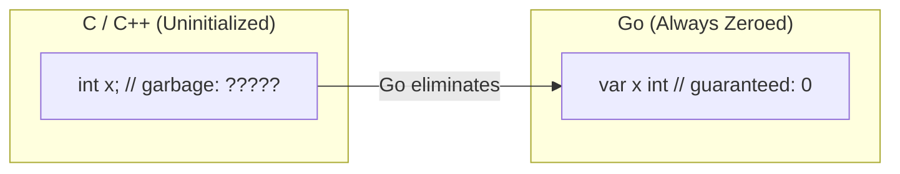
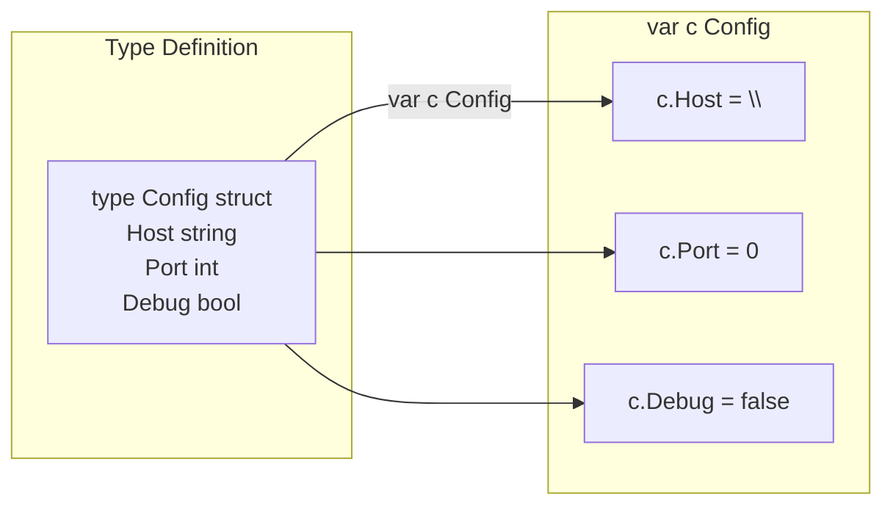

# Zero Values — Junior Level

## Table of Contents
1. [Introduction](#introduction)
2. [Prerequisites](#prerequisites)
3. [Glossary](#glossary)
4. [Core Concepts](#core-concepts)
5. [Real-World Analogies](#real-world-analogies)
6. [Mental Models](#mental-models)
7. [Pros & Cons](#pros--cons)
8. [Use Cases](#use-cases)
9. [Code Examples](#code-examples)
10. [Coding Patterns](#coding-patterns)
11. [Clean Code](#clean-code)
12. [Product Use / Feature](#product-use--feature)
13. [Error Handling](#error-handling)
14. [Security Considerations](#security-considerations)
15. [Performance Tips](#performance-tips)
16. [Metrics & Analytics](#metrics--analytics)
17. [Best Practices](#best-practices)
18. [Edge Cases & Pitfalls](#edge-cases--pitfalls)
19. [Common Mistakes](#common-mistakes)
20. [Common Misconceptions](#common-misconceptions)
21. [Tricky Points](#tricky-points)
22. [Test](#test)
23. [Tricky Questions](#tricky-questions)
24. [Cheat Sheet](#cheat-sheet)
25. [Self-Assessment Checklist](#self-assessment-checklist)
26. [Summary](#summary)
27. [What You Can Build](#what-you-can-build)
28. [Further Reading](#further-reading)
29. [Related Topics](#related-topics)
30. [Diagrams & Visual Aids](#diagrams--visual-aids)

---

## Introduction
> Focus: "What is it?" and "How to use it?"

In Go, every variable declared without an explicit value is automatically initialized to its **zero value**. This is one of Go's most important safety features — you never have uninitialized memory like in C or C++. This prevents entire classes of bugs where programs crash due to reading garbage values.

When you write:
```go
var x int
var s string
var b bool
```
Go guarantees that `x` is `0`, `s` is `""`, and `b` is `false` — not random garbage from memory.

This feature makes Go programs predictable and safe from the very beginning.

---

## Prerequisites

Before diving into zero values, make sure you understand:
- Basic Go variable declarations (`var`, `:=`)
- Go's built-in types: `int`, `string`, `bool`, `float64`
- What a pointer is (basic concept)
- What a slice is (basic concept)

---

## Glossary

| Term | Definition |
|------|------------|
| **Zero value** | The default value Go assigns to a variable when no explicit value is given |
| **nil** | The zero value for pointers, slices, maps, channels, functions, and interfaces |
| **Uninitialized** | A variable declared but never assigned a value (in Go, always has zero value) |
| **Pointer** | A variable that stores the memory address of another variable |
| **Slice** | A dynamic sequence of elements in Go |
| **Map** | A collection of key-value pairs in Go |
| **Struct** | A composite type that groups fields together |

---

## Core Concepts

### Every Type Has a Zero Value

Go defines a specific zero value for every type:

| Type | Zero Value |
|------|-----------|
| `bool` | `false` |
| `int`, `int8`, `int16`, `int32`, `int64` | `0` |
| `uint`, `uint8`, `uint16`, `uint32`, `uint64` | `0` |
| `float32`, `float64` | `0.0` |
| `complex64`, `complex128` | `(0+0i)` |
| `string` | `""` (empty string) |
| `pointer` | `nil` |
| `slice` | `nil` |
| `map` | `nil` |
| `channel` | `nil` |
| `func` | `nil` |
| `interface` | `nil` |
| `array` | each element has its zero value |
| `struct` | each field has its own zero value |

### Zero Values Are SAFE

Unlike C where uninitialized memory contains random bits, Go's zero values are well-defined and safe to read. You will never encounter garbage values.

```go
package main

import "fmt"

func main() {
    var i int
    var f float64
    var b bool
    var s string

    fmt.Println(i) // 0
    fmt.Println(f) // 0
    fmt.Println(b) // false
    fmt.Println(s) // ""  (empty string, prints as blank)
}
```

### Structs Get Zero Values Field by Field

When you declare a struct without initializing it, each field gets its zero value:

```go
type Person struct {
    Name string
    Age  int
    Active bool
}

var p Person
// p.Name == ""
// p.Age  == 0
// p.Active == false
```

### Arrays Get Zero Values Element by Element

```go
var arr [5]int
// arr == [0, 0, 0, 0, 0]
```

---

## Real-World Analogies

### Analogy 1: A New Notebook
Imagine buying a new notebook. Every page is blank (zero value). You don't need to erase anything before writing — it's already clean. In C, it's like getting a used notebook where old text might still be visible (garbage values). Go gives you a fresh notebook every time.

### Analogy 2: A New Bank Account
When you open a bank account, the balance starts at `$0`. You don't need to set it to zero — it is already zero. Similarly, in Go, a new `int` variable always starts at `0`.

### Analogy 3: A Light Switch
A new `bool` variable is like a light switch that always starts in the `OFF` position (`false`). You know exactly what state it's in without checking.

### Analogy 4: An Empty Form
A new struct in Go is like a blank form with all fields empty. You can fill in the fields you need, and the ones you don't fill in remain as their default (zero) values.

---

## Mental Models

### Model 1: Memory as Clean Slate
Think of Go's memory allocation as always giving you a clean slate. When Go allocates memory for your variable, it fills every byte with `0` before handing it to you. This is the foundation of zero values.

```
Memory before Go: [ ? ][ ? ][ ? ][ ? ]  (garbage)
Memory in Go:     [ 0 ][ 0 ][ 0 ][ 0 ]  (zeroed)
```

### Model 2: Default Factory Settings
Like a phone that comes with factory settings, Go variables start with their "factory default" settings. You can change them, but you always know what they are by default.

### Model 3: Truth Table of Zeroes
Every "nothing" in Go has a specific type:
- "Nothing" for `bool` = `false`
- "Nothing" for `int` = `0`
- "Nothing" for `string` = `""`
- "Nothing" for pointers/slices/maps = `nil`

---

## Pros & Cons

### Pros
1. **Safety**: No uninitialized memory bugs — a major source of bugs in C/C++ is eliminated
2. **Predictability**: You always know what a variable contains, even before assigning
3. **Simplicity**: Less boilerplate code — you don't need to initialize everything
4. **Debuggability**: Easier to understand program state; zero values are obvious
5. **Consistency**: Same behavior everywhere in the language

### Cons
1. **Nil pitfalls**: `nil` maps and some `nil` pointer uses can still cause panics
2. **Semantic ambiguity**: Is a `0` int "not set" or intentionally zero? Sometimes you need extra flags
3. **JSON issues**: Zero values serialize to JSON which may not be desired (use `omitempty`)
4. **Subtle bugs**: A `nil` map can be read from (returns zero) but writing panics — this asymmetry surprises beginners

---

## Use Cases

### Use Case 1: Counters
```go
func countWords(text string) int {
    var count int  // starts at 0, no need to write count = 0
    for _, word := range strings.Fields(text) {
        _ = word
        count++
    }
    return count
}
```

### Use Case 2: Flags / Status Variables
```go
type Job struct {
    Name     string
    Done     bool    // starts false — job not done yet
    Errors   int     // starts 0 — no errors yet
    Result   string  // starts "" — no result yet
}
```

### Use Case 3: Optional Fields in Structs
```go
type Config struct {
    Host     string // "" means "use default host"
    Port     int    // 0 means "use default port"
    Debug    bool   // false means "not in debug mode"
    Timeout  int    // 0 means "use default timeout"
}
```

### Use Case 4: Building Up Slices
```go
var results []string  // nil slice, but safe to append to
for _, item := range data {
    if item.Valid {
        results = append(results, item.Name)
    }
}
// results is nil if nothing was valid, or a slice with data
```

---

## Code Examples

### Example 1: Basic Zero Values
```go
package main

import "fmt"

func main() {
    // Numeric types
    var i int
    var i8 int8
    var i16 int16
    var i32 int32
    var i64 int64

    var u uint
    var f32 float32
    var f64 float64

    // Text
    var s string

    // Logic
    var b bool

    fmt.Printf("int:     %v\n", i)    // 0
    fmt.Printf("int8:    %v\n", i8)   // 0
    fmt.Printf("int16:   %v\n", i16)  // 0
    fmt.Printf("int32:   %v\n", i32)  // 0
    fmt.Printf("int64:   %v\n", i64)  // 0
    fmt.Printf("uint:    %v\n", u)    // 0
    fmt.Printf("float32: %v\n", f32)  // 0
    fmt.Printf("float64: %v\n", f64)  // 0
    fmt.Printf("string:  %q\n", s)    // ""
    fmt.Printf("bool:    %v\n", b)    // false
}
```

### Example 2: Struct Zero Values
```go
package main

import "fmt"

type User struct {
    ID       int
    Username string
    Email    string
    Active   bool
    Score    float64
}

func main() {
    var u User
    fmt.Printf("ID:       %d\n", u.ID)        // 0
    fmt.Printf("Username: %q\n", u.Username)  // ""
    fmt.Printf("Email:    %q\n", u.Email)     // ""
    fmt.Printf("Active:   %v\n", u.Active)    // false
    fmt.Printf("Score:    %v\n", u.Score)     // 0
}
```

### Example 3: Nil Values (Pointers, Slices, Maps)
```go
package main

import "fmt"

func main() {
    var p *int          // nil pointer
    var s []int         // nil slice
    var m map[string]int // nil map

    fmt.Println(p == nil) // true
    fmt.Println(s == nil) // true
    fmt.Println(m == nil) // true

    // Nil slice length and capacity are 0
    fmt.Println(len(s), cap(s)) // 0 0

    // Nil slice can be appended to
    s = append(s, 1, 2, 3)
    fmt.Println(s) // [1 2 3]

    // Reading from nil map is safe (returns zero value)
    val := m["key"]
    fmt.Println(val) // 0
}
```

### Example 4: Array Zero Values
```go
package main

import "fmt"

func main() {
    var arr [5]int
    var bools [3]bool
    var strs [4]string

    fmt.Println(arr)   // [0 0 0 0 0]
    fmt.Println(bools) // [false false false]
    fmt.Println(strs)  // [   ] (four empty strings)
}
```

### Example 5: Checking for Zero Values
```go
package main

import "fmt"

type Config struct {
    Host    string
    Port    int
    Debug   bool
}

func main() {
    cfg := Config{
        Host: "localhost",
        // Port and Debug use zero values
    }

    // Check if fields were set
    if cfg.Port == 0 {
        cfg.Port = 8080 // use default
    }
    if cfg.Host == "" {
        cfg.Host = "localhost" // use default
    }

    fmt.Printf("Host: %s, Port: %d, Debug: %v\n", cfg.Host, cfg.Port, cfg.Debug)
}
```

---

## Coding Patterns

### Pattern 1: Default Value Pattern
Use zero values to represent "not configured" or "use default":
```go
type ServerConfig struct {
    Host    string // "" = use "localhost"
    Port    int    // 0  = use 8080
    Timeout int    // 0  = use 30 seconds
}

func (c *ServerConfig) normalize() {
    if c.Host == "" {
        c.Host = "localhost"
    }
    if c.Port == 0 {
        c.Port = 8080
    }
    if c.Timeout == 0 {
        c.Timeout = 30
    }
}
```

### Pattern 2: Accumulator Pattern
```go
func sum(numbers []int) int {
    var total int  // 0 by default
    for _, n := range numbers {
        total += n
    }
    return total
}
```

### Pattern 3: Nil Slice as Empty Result
```go
func findUsers(active bool, users []User) []User {
    var result []User  // nil — return nil if nothing found
    for _, u := range users {
        if u.Active == active {
            result = append(result, u)
        }
    }
    return result  // nil or populated slice
}
```

---

## Clean Code

### Do: Let Zero Values Do the Work
```go
// Good: zero value means "not started"
type Task struct {
    Name    string
    Done    bool   // false = not done
    Retries int    // 0 = no retries yet
}

// Bad: redundant initialization
t := Task{
    Name:    "deploy",
    Done:    false,  // unnecessary
    Retries: 0,      // unnecessary
}

// Good: let zero values handle it
t := Task{Name: "deploy"}
```

### Do: Use Meaningful Zero Values
Design your structs so that the zero value represents a sensible default state:
```go
// Good design: zero value means "disconnected" (sensible default)
type Connection struct {
    Address   string
    Connected bool  // false = disconnected (zero value is the right default)
    Retries   int   // 0 = no retries yet
}

// Bad design: zero value is meaningless
type Status struct {
    Code int // 0 could mean "success", "not set", or "error" — ambiguous!
}
```

---

## Product Use / Feature

### Real Product Example: User Registration
When a new user registers, many fields don't need initialization:
```go
type User struct {
    ID           int       // auto-increment from DB
    Email        string    // provided at registration
    DisplayName  string    // optional — "" is fine
    Bio          string    // optional — "" is fine
    PostCount    int       // 0 posts to start
    Verified     bool      // false — not verified yet
    Premium      bool      // false — not premium yet
    FollowerCount int      // 0 followers to start
}

func NewUser(email string) User {
    return User{Email: email}
    // All other fields are zero — that's correct behavior
}
```

### Real Product Example: Shopping Cart
```go
type Cart struct {
    UserID    int
    Items     []CartItem  // nil slice = empty cart
    Coupon    string      // "" = no coupon applied
    TotalCost float64     // 0.0 = empty cart total
}

func NewCart(userID int) Cart {
    return Cart{UserID: userID}
    // Zero values make sense: empty cart, no coupon, zero cost
}
```

---

## Error Handling

### Nil Check Before Pointer Use
```go
func printAge(p *Person) {
    if p == nil {
        fmt.Println("no person provided")
        return
    }
    fmt.Println(p.Age)
}
```

### Safe Map Access
```go
// Reading from nil map is SAFE — returns zero value
var m map[string]int
val := m["key"]  // val = 0, no panic

// But writing to nil map PANICS
// m["key"] = 1  // PANIC: assignment to entry in nil map

// Always check or initialize map before writing
if m == nil {
    m = make(map[string]int)
}
m["key"] = 1  // safe now
```

---

## Security Considerations

### Zero Values Prevent Information Leakage
In C, an uninitialized variable might contain data from a previous function call (stack reuse). In Go, zeroed memory means:
- No leftover passwords or keys in memory by accident
- No sensitive data from previous operations bleeding into new variables

### Nil Pointer Dereferencing
Even though Go has zero values, nil pointers still exist and can cause panics:
```go
var p *int
// *p   // PANIC: dereference of nil pointer
// p.x  // PANIC if p is a nil struct pointer

// Always check before dereferencing
if p != nil {
    fmt.Println(*p)
}
```

---

## Performance Tips

1. **Avoid redundant initialization**: If zero value is what you want, don't write `var x int = 0` — just `var x int`.
2. **Nil slice is free**: `var s []int` costs nothing. Only allocate with `make` when you know the size.
3. **Zero-value structs**: Return `MyStruct{}` instead of `MyStruct{Field: zero_value}` — it's the same but cleaner.

---

## Metrics & Analytics

When working with analytics, zero values serve as neutral starting points:
```go
type UserMetrics struct {
    PageViews    int     // 0 = no views yet
    SessionTime  float64 // 0.0 = no time spent
    Conversions  int     // 0 = no conversions
    BounceRate   float64 // 0.0 = not calculated yet
    Active       bool    // false = not active
}

// Start tracking a new user — zero values are perfect defaults
metrics := UserMetrics{}
```

---

## Best Practices

1. **Design structs for usable zero values**: The zero value of a struct should represent a valid, usable (or sensible "empty") state.
2. **Don't initialize to zero explicitly**: `var x int = 0` is redundant. Write `var x int`.
3. **Use nil slice over empty slice when returning empty**: `return nil` vs `return []int{}` — prefer `nil` for "no results".
4. **Always initialize maps before writing**: Check for nil or use `make(map[...])`.
5. **Check pointers before dereferencing**: Always guard pointer dereferences with nil checks.
6. **Leverage zero value for toggles**: Use `bool` fields that start `false` for "disabled" features.

---

## Edge Cases & Pitfalls

### Pitfall 1: Writing to nil map
```go
var m map[string]int
m["key"] = 1  // PANIC! must initialize first
// Fix:
m = make(map[string]int)
m["key"] = 1  // OK
```

### Pitfall 2: Nil pointer dereference
```go
var p *Person
fmt.Println(p.Name)  // PANIC! p is nil
// Fix:
if p != nil {
    fmt.Println(p.Name)
}
```

### Pitfall 3: Zero value vs "not set"
```go
type Score struct {
    Value int  // Is 0 a real score or "not set"?
}
// Problem: can't tell if score was set to 0 or never set
// Fix option 1: use pointer
type Score struct {
    Value *int  // nil = not set, 0 = zero score
}
// Fix option 2: use a sentinel/flag
type Score struct {
    Value int
    IsSet bool
}
```

---

## Common Mistakes

### Mistake 1: Forgetting to initialize a map
```go
// Wrong
var counts map[string]int
counts["apple"]++  // PANIC

// Right
counts := make(map[string]int)
counts["apple"]++  // OK
```

### Mistake 2: Assuming nil slice is broken
```go
// Many beginners think you can't use a nil slice
var s []int
// s is nil, but it's perfectly fine to append to it!
s = append(s, 1, 2, 3)
fmt.Println(s) // [1 2 3]
```

### Mistake 3: Redundant zero initialization
```go
// Verbose and unnecessary
var counter int = 0
var name string = ""
var active bool = false

// Clean and idiomatic Go
var counter int
var name string
var active bool
```

---

## Common Misconceptions

### Misconception 1: "nil means broken/error"
nil is not an error — it's a valid zero value for pointer, slice, map, channel, function, and interface types. A nil slice is a completely valid, usable slice.

### Misconception 2: "Zero values waste memory"
Go only zeroes memory it actually allocates. The zeroing is done at allocation time and is very fast (the OS usually provides zeroed pages anyway).

### Misconception 3: "I need to always initialize structs fully"
No. If the zero value of each field makes sense for your use case, you can just do `var s MyStruct` or `MyStruct{}`.

---

## Tricky Points

1. **`nil` slice vs empty slice**: Both have `len() == 0`, but `nil` slice `== nil` is `true` while `[]int{} == nil` is `false`. Both work with `append`, `range`, and `len`.

2. **Nil map reads are safe, writes are not**: Reading returns zero value; writing panics. This asymmetry trips up many beginners.

3. **Zero value of interface**: An interface is nil only when both its type AND value are nil. This can be subtle.

4. **Struct comparison**: A struct equals its zero value only if all fields equal their zero values.

---

## Test

**Question 1**: What is the zero value of `string` in Go?
- A) `nil`
- B) `0`
- C) `""` (empty string)
- D) `" "` (space)

**Answer**: C

**Question 2**: Which of the following will cause a panic?
```go
var m map[string]int
a := m["key"]    // Line A
m["key"] = 1     // Line B
```
- A) Line A
- B) Line B
- C) Both lines
- D) Neither

**Answer**: B (Writing to nil map panics; reading is safe)

**Question 3**: What is printed?
```go
var s []int
fmt.Println(len(s), s == nil)
```
- A) `0 false`
- B) `0 true`
- C) panic
- D) `nil true`

**Answer**: B

---

## Tricky Questions

**Q: Can you append to a nil slice?**
Yes! `append` handles nil slices just like empty slices. `var s []int; s = append(s, 1)` works perfectly.

**Q: What happens when you range over a nil slice?**
The loop body never executes — ranging over a nil slice is safe and simply iterates 0 times.

**Q: Is `var x int = 0` the same as `var x int`?**
Yes, exactly the same. The second form is preferred in Go.

**Q: What is the zero value of a function type?**
`nil`. A `nil` function can be declared but calling it will panic.

---

## Cheat Sheet

```
bool       → false
int/uint/* → 0
float*/    → 0.0
complex*/  → (0+0i)
string     → ""
pointer    → nil  (dereference = PANIC)
slice      → nil  (read/append = SAFE, len=0)
map        → nil  (read = SAFE returns 0, write = PANIC)
channel    → nil  (send/receive blocks forever)
func       → nil  (call = PANIC)
interface  → nil
array      → [zero, zero, ...]
struct     → {zero, zero, ...}
```

---

## Self-Assessment Checklist

- [ ] I can name the zero value of every basic Go type
- [ ] I understand why nil slice is safe to append to
- [ ] I know why writing to a nil map panics
- [ ] I can design a struct whose zero value is a useful default state
- [ ] I know the difference between `var s []int` and `s := []int{}`
- [ ] I can identify when zero values cause bugs (nil pointer dereference)
- [ ] I avoid redundant zero initialization in my code

---

## Summary

Go's zero values are one of its most beginner-friendly features. Every variable always starts with a well-defined, safe value:
- Numbers start at `0`, booleans at `false`, strings at `""`
- Pointer types (`pointer`, `slice`, `map`, `channel`, `func`, `interface`) start at `nil`
- Structs and arrays initialize each field/element to its zero value

Key rules to remember:
1. You never need to write `var x int = 0` — just `var x int`
2. A nil slice is safe to append to
3. A nil map can be read from (returns zero) but NOT written to
4. Always nil-check pointers before dereferencing

---

## What You Can Build

With understanding of zero values, you can:
- Build user registration systems where sensible defaults are zero values
- Create configuration structs that work without full initialization
- Write clean accumulator patterns (counters, sums)
- Build optional field patterns in APIs
- Design safe data collection pipelines using nil slices

---

## Further Reading

- [Go Specification: Zero values](https://go.dev/ref/spec#The_zero_value)
- [Go Tour: Zero values](https://go.dev/tour/basics/12)
- [Effective Go](https://go.dev/doc/effective_go)
- [Go Blog: The Go Memory Model](https://go.dev/ref/mem)

---

## Related Topics

- Variables and Constants in Go
- Pointers in Go
- Slices in Go
- Maps in Go
- Structs in Go
- nil in Go
- Memory Management in Go

---

## Diagrams & Visual Aids

### Zero Value Memory Diagram



### nil vs Zero Value Decision Tree

```mermaid
flowchart TD
    A[Declared variable] --> B{Is it pointer/slice/map/chan/func/interface?}
    B -->|Yes| C["Zero value = nil\nMust check before use!"]
    B -->|No| D{What type?}
    D -->|int/float/complex| E["Zero value = 0"]
    D -->|bool| F["Zero value = false"]
    D -->|string| G["Zero value = \"\" (empty)"]
    D -->|struct| H["Zero value = all fields zeroed"]
    D -->|array| I["Zero value = all elements zeroed"]
```

### Struct Zero Value Expansion


