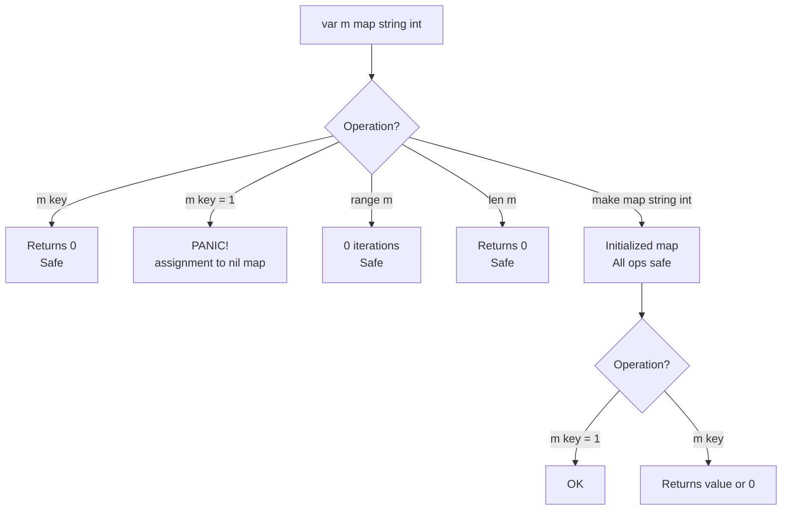

# Zero Values — Middle Level

## Table of Contents
1. [Introduction](#introduction)
2. [Prerequisites](#prerequisites)
3. [Glossary](#glossary)
4. [Core Concepts](#core-concepts)
5. [Evolution & Historical Context](#evolution--historical-context)
6. [Real-World Analogies](#real-world-analogies)
7. [Mental Models](#mental-models)
8. [Pros & Cons](#pros--cons)
9. [Alternative Approaches / Plan B](#alternative-approaches--plan-b)
10. [Use Cases](#use-cases)
11. [Code Examples](#code-examples)
12. [Coding Patterns](#coding-patterns)
13. [Clean Code](#clean-code)
14. [Product Use / Feature](#product-use--feature)
15. [Error Handling](#error-handling)
16. [Security Considerations](#security-considerations)
17. [Performance Tips](#performance-tips)
18. [Metrics & Analytics](#metrics--analytics)
19. [Best Practices](#best-practices)
20. [Anti-Patterns](#anti-patterns)
21. [Debugging Guide](#debugging-guide)
22. [Edge Cases & Pitfalls](#edge-cases--pitfalls)
23. [Common Mistakes](#common-mistakes)
24. [Common Misconceptions](#common-misconceptions)
25. [Tricky Points](#tricky-points)
26. [Comparison with Other Languages](#comparison-with-other-languages)
27. [Test](#test)
28. [Tricky Questions](#tricky-questions)
29. [Cheat Sheet](#cheat-sheet)
30. [Self-Assessment Checklist](#self-assessment-checklist)
31. [Summary](#summary)
32. [What You Can Build](#what-you-can-build)
33. [Further Reading](#further-reading)
34. [Related Topics](#related-topics)
35. [Diagrams & Visual Aids](#diagrams--visual-aids)

---

## Introduction
> Focus: "Why?" and "When to use?"

Zero values in Go aren't just a safety feature — they are a **design philosophy**. Go forces you to think about what "nothing" or "empty" means for each type you design. When you understand zero values deeply, you write APIs and data structures that are instantly usable without configuration.

The question a mid-level Go developer should always ask: **"Is the zero value of this type useful and safe?"** If yes, your API is clean. If no, you need to add a constructor or change the design.

This level covers:
- Why the zero value design decision was made
- How to leverage zero values in API design
- The subtle difference between nil and empty
- JSON serialization behavior
- How `sync.Mutex` and `bytes.Buffer` use zero values as a design pattern

---

## Prerequisites

- Solid understanding of all Go types
- Experience with struct design
- Familiarity with interfaces
- Basic understanding of JSON marshaling in Go
- Understanding of Go's concurrency primitives (Mutex concepts)

---

## Glossary

| Term | Definition |
|------|------------|
| **Zero value pattern** | Designing a type so its zero value represents a valid, ready-to-use state |
| **nil slice** | A slice variable declared without allocation (`var s []int`) — type is set, no backing array |
| **empty slice** | A slice with a backing array but zero elements (`s := []int{}`) |
| **omitempty** | JSON struct tag that omits fields equal to their zero value during serialization |
| **Nil interface** | An interface where both the type and value are nil |
| **Non-nil nil** | An interface with a nil concrete value but a non-nil type — a common Go gotcha |
| **Sentinel value** | A special value used to represent "not set" or "end of data" |

---

## Core Concepts

### The Zero Value Contract

Go's specification states: *"Each element of such a variable or value is set to the zero value for its type: false for booleans, 0 for integers, 0.0 for floats, "" for strings, and nil for pointers, functions, interfaces, slices, channels, and maps."*

This is a **contract** — guaranteed by the language spec, not an implementation detail.

### nil vs Zero Value: The Distinction

`nil` IS the zero value for reference types, but `nil` and "zero value" are not synonyms:

```go
// These are zero values but NOT nil:
var i int       // 0 (not nil, not nilable)
var s string    // "" (not nil, not nilable)
var b bool      // false (not nil, not nilable)

// These are zero values AND nil:
var p *int      // nil
var sl []int    // nil
var m map[string]int // nil
```

### nil Slice vs Empty Slice

This is one of the most important distinctions in Go:

```go
var nilSlice []int      // nil == true,  len == 0, cap == 0
emptySlice := []int{}  // nil == false, len == 0, cap == 0

// Behavior is nearly identical:
fmt.Println(len(nilSlice))   // 0
fmt.Println(len(emptySlice)) // 0

// But they differ in nil check:
fmt.Println(nilSlice == nil)   // true
fmt.Println(emptySlice == nil) // false

// And in JSON marshaling:
import "encoding/json"
n, _ := json.Marshal(nilSlice)   // null
e, _ := json.Marshal(emptySlice) // []
```

### nil Map Asymmetry

```go
var m map[string]int

// Reading: SAFE — returns zero value
v := m["key"]     // v = 0, no panic
v, ok := m["key"] // v = 0, ok = false, no panic

// Writing: PANIC
m["key"] = 1  // panic: assignment to entry in nil map

// Iteration: SAFE — iterates 0 times
for k, v := range m { // safe, never executes body
    _ = k
    _ = v
}
```

### The Zero Value Pattern in Standard Library

Go's standard library was designed around usable zero values:

```go
// sync.Mutex: zero value is unlocked — ready to use
var mu sync.Mutex
mu.Lock()    // works immediately without New() or init
mu.Unlock()

// bytes.Buffer: zero value is empty buffer — ready to use
var buf bytes.Buffer
buf.WriteString("hello")  // works immediately
fmt.Println(buf.String()) // "hello"

// sync.WaitGroup: zero value is "no goroutines to wait for"
var wg sync.WaitGroup
wg.Add(1)
go func() { wg.Done() }()
wg.Wait()
```

---

## Evolution & Historical Context

### Why Go Made This Choice

Before Go, languages took different approaches:

- **C**: No initialization — memory contains whatever bits were there previously (garbage). This is fast but dangerous.
- **Java**: Instance variables are initialized to defaults (`0`, `false`, `null`), but local variables are NOT. The compiler flags uninitialized local variables.
- **C++**: Same split as Java, with the added complexity of uninitialized member variables if constructors don't set them.
- **Python/Ruby**: Everything is an object with a defined state, but `None` assignment is manual.

### Go's Design Decision (2009–2012)

Rob Pike and the Go team decided that **all variables must always be initialized**. The reasoning:
1. Eliminates a whole class of bugs
2. Makes programs deterministic — same source always produces same initial state
3. Simplifies the mental model — no special rules for "sometimes initialized"
4. The cost (zeroing memory) is minimal since the OS often provides zero pages anyway

### The Impact on API Design

This decision shaped how Gophers design APIs. The canonical example is `sync.Mutex`:

```go
// Old C-style approach (NOT Go style):
mu := NewMutex()   // required constructor
defer mu.Destroy() // required cleanup

// Go style (zero value pattern):
var mu sync.Mutex  // just declare it
mu.Lock()          // immediately usable
```

This pattern is now called the **"zero value is useful"** design principle and is the standard for Go library design.

---

## Real-World Analogies

### Analogy 1: Empty Inbox vs No Inbox
- `var msgs []Message` (nil slice): like having a mailbox that hasn't been installed yet, but you can still put letters in it and they materialize the mailbox.
- `msgs := []Message{}` (empty slice): like having an installed, empty mailbox.
For most purposes they're the same, but they look different in JSON.

### Analogy 2: Unlocked Door (sync.Mutex)
A new `sync.Mutex` is like a door that starts unlocked. You can immediately lock/unlock it without any setup ceremony.

### Analogy 3: Template in a CMS
A nil string in a config struct is like a template field that says "use the default template" — the zero value carries semantic meaning (use default).

---

## Mental Models

### Model 1: The Three Questions
When you see `nil` in Go, ask:
1. Is this a pointer? → "Points to nothing, don't dereference"
2. Is this a slice/map/chan? → "Empty container, handle before writing to map"
3. Is this an interface? → "Careful! Type might be set even if value is nil"

### Model 2: The Nil Flow Diagram

```
variable declared
      |
      v
   nilable type?
    /       \
  YES        NO
   |          |
   nil     zero value
   |       (0, "", false)
   |
   |-- read? --> returns zero value (safe)
   |-- write map? --> PANIC
   |-- deref pointer? --> PANIC
   |-- append slice? --> OK (creates new backing array)
   |-- range? --> OK (0 iterations)
```

### Model 3: Interface nil vs concrete nil

```go
// This is a common trap:
type MyError struct{ msg string }
func (e *MyError) Error() string { return e.msg }

func mayFail(fail bool) error {
    var err *MyError  // typed nil
    if fail {
        err = &MyError{"something went wrong"}
    }
    return err  // DANGER: returns non-nil interface even when err is nil!
}

// Check:
e := mayFail(false)
fmt.Println(e == nil) // false! interface is not nil even though *MyError is nil
```

---

## Pros & Cons

### Pros
1. **Eliminates uninitialized memory bugs** — a massive improvement over C/C++
2. **Simpler API design** — zero value pattern means fewer constructors needed
3. **Consistent behavior** — predictable initial state everywhere
4. **Better for concurrent code** — `sync.Mutex{}` zero value is immediately usable
5. **Standard library consistency** — `bytes.Buffer`, `sync.WaitGroup`, etc. all follow this pattern

### Cons
1. **"Not set" ambiguity** — can't distinguish "value is 0" from "value was never set"
2. **nil map write panic** — the asymmetry between read (safe) and write (panic) is surprising
3. **Interface nil trap** — typed nil interface values are not equal to untyped nil
4. **JSON zero values** — zero values serialize to JSON, which can leak defaults or require `omitempty`
5. **Pointer semantics required for "optional"** — must use `*int` to express "optional integer"

---

## Alternative Approaches / Plan B

### When Zero Value Isn't Enough: Use a Pointer

```go
// Problem: can't tell if age was set to 0 or never set
type Profile struct {
    Age int
}

// Solution: use pointer for optional fields
type Profile struct {
    Age *int  // nil = not set, &0 = explicitly set to 0
}

// Usage:
age := 0
p := Profile{Age: &age}  // explicitly set to 0
q := Profile{}            // not set
```

### When Zero Value Isn't Enough: Use a Sentinel

```go
// Use -1 or some sentinel value for "not set"
type Score struct {
    Value int // -1 = not set, >= 0 = actual score
}

const ScoreNotSet = -1

func (s Score) IsSet() bool {
    return s.Value != ScoreNotSet
}
```

### When Zero Value Isn't Enough: Use a Boolean Flag

```go
type OptionalInt struct {
    Value int
    Valid bool  // false = not set
}

// Similar to sql.NullInt64 pattern
type NullInt64 struct {
    Int64 int64
    Valid bool
}
```

### When Zero Value Isn't Enough: Use a Constructor

```go
type Cache struct {
    data    map[string]string
    maxSize int
}

// Zero value is NOT usable (nil map)
// Use a constructor:
func NewCache(maxSize int) *Cache {
    return &Cache{
        data:    make(map[string]string),
        maxSize: maxSize,
    }
}
```

---

## Use Cases

### Use Case 1: API Config with Defaults
```go
type APIConfig struct {
    BaseURL    string
    Timeout    int    // 0 = use 30s default
    MaxRetries int    // 0 = use 3 retries default
    Debug      bool   // false = production mode
    RateLimit  int    // 0 = no rate limit
}

func (c *APIConfig) defaults() {
    if c.BaseURL == "" {
        c.BaseURL = "https://api.example.com"
    }
    if c.Timeout == 0 {
        c.Timeout = 30
    }
    if c.MaxRetries == 0 {
        c.MaxRetries = 3
    }
}
```

### Use Case 2: Lazy Initialization with nil Check
```go
type Service struct {
    cache map[string][]byte
}

func (s *Service) getFromCache(key string) ([]byte, bool) {
    if s.cache == nil {
        return nil, false  // not initialized yet
    }
    v, ok := s.cache[key]
    return v, ok
}

func (s *Service) setCache(key string, val []byte) {
    if s.cache == nil {
        s.cache = make(map[string][]byte)
    }
    s.cache[key] = val
}
```

### Use Case 3: JSON with omitempty
```go
type UserResponse struct {
    ID       int    `json:"id"`
    Name     string `json:"name"`
    Email    string `json:"email,omitempty"` // omit if ""
    Bio      string `json:"bio,omitempty"`   // omit if ""
    Premium  bool   `json:"premium"`         // always include
    Score    *int   `json:"score,omitempty"` // omit if nil
}
```

---

## Code Examples

### Example 1: Zero Value Pattern in Library Design
```go
package counter

// Counter uses the zero value pattern:
// var c Counter works without initialization
type Counter struct {
    value int
    mu    sync.Mutex  // zero value is unlocked
}

func (c *Counter) Increment() {
    c.mu.Lock()
    defer c.mu.Unlock()
    c.value++
}

func (c *Counter) Value() int {
    c.mu.Lock()
    defer c.mu.Unlock()
    return c.value
}

// Usage:
// var c counter.Counter  -- works immediately!
// c.Increment()
```

### Example 2: nil vs empty slice in JSON
```go
package main

import (
    "encoding/json"
    "fmt"
)

type Response struct {
    Items    []string `json:"items"`
    Tags     []string `json:"tags,omitempty"`
}

func main() {
    // nil slice in Items -> null in JSON
    // nil slice in Tags (omitempty) -> omitted from JSON
    r1 := Response{}
    b1, _ := json.Marshal(r1)
    fmt.Println(string(b1))
    // {"items":null}

    // empty slice in Items -> [] in JSON
    r2 := Response{Items: []string{}, Tags: []string{}}
    b2, _ := json.Marshal(r2)
    fmt.Println(string(b2))
    // {"items":[],"tags":[]}
}
```

### Example 3: Interface nil trap
```go
package main

import "fmt"

type Error interface {
    Error() string
}

type MyError struct {
    msg string
}

func (e *MyError) Error() string { return e.msg }

func getError(fail bool) error {
    var e *MyError  // typed nil
    if fail {
        e = &MyError{"oops"}
    }
    // BAD: returning typed nil as interface — interface won't be nil!
    return e
}

func main() {
    err := getError(false)
    if err != nil {
        fmt.Println("Error:", err) // This WILL print even though *MyError is nil!
    }
}
```

Fix:
```go
func getError(fail bool) error {
    if fail {
        return &MyError{"oops"}
    }
    return nil  // return untyped nil, not *MyError(nil)
}
```

### Example 4: Checking Struct for Zero Value
```go
package main

import "fmt"

type Point struct {
    X, Y float64
}

func main() {
    var p Point  // zero value: {0, 0}
    zero := Point{}

    fmt.Println(p == zero)           // true
    fmt.Println(p == (Point{0, 0}))  // true

    p.X = 1.0
    fmt.Println(p == zero)           // false
}
```

### Example 5: new() and zero values
```go
package main

import "fmt"

func main() {
    // new() allocates zeroed memory and returns a pointer
    p := new(int)
    fmt.Println(*p)      // 0
    fmt.Println(p == nil) // false — p points to a valid zero int

    s := new(struct {
        Name string
        Age  int
    })
    fmt.Println(s.Name) // ""
    fmt.Println(s.Age)  // 0
}
```

---

## Coding Patterns

### Pattern 1: Functional Options with Zero Values
```go
type ServerOptions struct {
    Host        string
    Port        int
    MaxConns    int
    TLSEnabled  bool
}

type Option func(*ServerOptions)

func WithHost(h string) Option {
    return func(o *ServerOptions) { o.Host = h }
}

func WithPort(p int) Option {
    return func(o *ServerOptions) { o.Port = p }
}

func NewServer(opts ...Option) *Server {
    o := &ServerOptions{
        Host:     "localhost",  // override zero value default
        Port:     8080,
        MaxConns: 100,
    }
    for _, opt := range opts {
        opt(o)
    }
    return &Server{options: o}
}
```

### Pattern 2: Lazy Map Initialization
```go
type Registry struct {
    handlers map[string]Handler
}

func (r *Registry) Register(name string, h Handler) {
    if r.handlers == nil {
        r.handlers = make(map[string]Handler)
    }
    r.handlers[name] = h
}

func (r *Registry) Get(name string) (Handler, bool) {
    h, ok := r.handlers[name]  // safe even if nil
    return h, ok
}
```

### Pattern 3: Builder with Zero Value Start
```go
type QueryBuilder struct {
    table      string
    conditions []string
    orderBy    string
    limit      int
}

func (q *QueryBuilder) From(table string) *QueryBuilder {
    q.table = table
    return q
}

func (q *QueryBuilder) Where(cond string) *QueryBuilder {
    q.conditions = append(q.conditions, cond)  // nil slice is fine
    return q
}

func (q *QueryBuilder) OrderBy(field string) *QueryBuilder {
    q.orderBy = field
    return q
}

// Usage: var qb QueryBuilder; qb.From("users").Where("active=true")
```

---

## Clean Code

### Do: Make zero value represent "empty/default" state
```go
// Good: zero value means "empty event"
type Event struct {
    Type    string    // "" = no type
    Payload []byte    // nil = no payload
    Sent    bool      // false = not sent
}

// Good: zero value means "no result yet"
type Result struct {
    Value   int
    Error   error
    Done    bool  // false = not complete
}
```

### Do: Use sync.Mutex without initialization
```go
// Good
type SafeMap struct {
    mu   sync.Mutex
    data map[string]int
}

// Bad: unnecessary initialization
type SafeMap struct {
    mu   *sync.Mutex  // pointer is unnecessary
    data map[string]int
}
func NewSafeMap() *SafeMap {
    return &SafeMap{mu: &sync.Mutex{}}  // over-engineered
}
```

---

## Product Use / Feature

### Feature: Rate Limiter Using Zero Values
```go
type RateLimiter struct {
    mu       sync.Mutex       // zero value = unlocked
    count    int              // zero value = 0 requests
    window   time.Duration    // zero value = 0, normalized to default
    maxCount int              // zero value = 0, normalized to default
    lastReset time.Time      // zero value = time.Time{}
}

func (r *RateLimiter) Allow() bool {
    r.mu.Lock()
    defer r.mu.Unlock()

    if r.maxCount == 0 {
        r.maxCount = 100  // default
    }
    if r.window == 0 {
        r.window = time.Minute
    }

    now := time.Now()
    if r.lastReset.IsZero() || now.Sub(r.lastReset) > r.window {
        r.count = 0
        r.lastReset = now
    }

    if r.count >= r.maxCount {
        return false
    }
    r.count++
    return true
}
```

---

## Error Handling

### Pattern: Return nil on no-error, non-nil on error
```go
func processUser(id int) (*User, error) {
    if id <= 0 {
        return nil, fmt.Errorf("invalid user id: %d", id)
    }

    user := &User{ID: id}
    // ... process
    return user, nil  // nil error = success
}

// Check:
user, err := processUser(42)
if err != nil {
    log.Printf("error: %v", err)
    return
}
// user is valid here
```

### Pattern: error interface nil trap (avoid this)
```go
// DANGEROUS: typed nil
func validate(s string) error {
    var ve *ValidationError  // nil pointer to ValidationError
    if s == "" {
        ve = &ValidationError{"empty string"}
    }
    return ve  // ALWAYS returns non-nil interface!
}

// SAFE: return explicit nil
func validate(s string) error {
    if s == "" {
        return &ValidationError{"empty string"}
    }
    return nil  // untyped nil — interface is nil
}
```

---

## Security Considerations

### Zero Values and Sensitive Data
```go
// GOOD: zero value for token is "" — safe default
type Session struct {
    Token    string
    UserID   int
    IsAdmin  bool  // false = not admin — safe default!
}

// DANGER: If your system uses zero value = "admin":
type BadDesign struct {
    Role int  // 0 = admin?! That's the zero value — dangerous default
}

// BETTER: use explicit constants
const (
    RoleGuest  = 0
    RoleUser   = 1
    RoleAdmin  = 2
)
// OR use a string:
type GoodDesign struct {
    Role string  // "" = not set, "user" = regular user, "admin" = admin
}
```

---

## Performance Tips

### nil Slice vs make for Known Size
```go
// If you don't know the size, nil slice + append is fine:
var results []string
for _, item := range input {
    if item.Valid {
        results = append(results, item.Name)
    }
}

// If you know the size, pre-allocate:
results := make([]string, 0, len(input))
for _, item := range input {
    if item.Valid {
        results = append(results, item.Name)
    }
}
// Avoids multiple reallocations
```

### sync.Mutex Zero Value Avoids Allocation
```go
// Bad: allocates on heap
mu := new(sync.Mutex)

// Good: stack-allocated, zero value works
var mu sync.Mutex

// In a struct (both work, but value is more cache-friendly):
type Good struct {
    mu sync.Mutex  // embedded by value
    // ...
}
type Okay struct {
    mu *sync.Mutex  // pointer — extra indirection, extra allocation
}
```

---

## Metrics & Analytics

```go
type AnalyticsEvent struct {
    EventName  string    // "" = unset
    UserID     int       // 0 = anonymous
    SessionID  string    // "" = no session
    Properties map[string]interface{} // nil = no properties
    Timestamp  time.Time // zero = use time.Now() when sending
    Count      int       // 0 = 1 occurrence (default)
}

func (e *AnalyticsEvent) normalize() {
    if e.Timestamp.IsZero() {
        e.Timestamp = time.Now()
    }
    if e.Count == 0 {
        e.Count = 1
    }
}
```

---

## Best Practices

1. **Design for usable zero values**: Ask "does the zero value make sense?" when creating structs.
2. **Use `sync.Mutex` by value, not pointer**: Zero value pattern makes pointer unnecessary.
3. **Prefer nil slice for "no results"**: More idiomatic than returning `[]T{}`.
4. **Return explicit `nil` from error functions**: Never return typed nil as an error interface.
5. **Use `omitempty` in JSON tags when zero value shouldn't appear in output**.
6. **Check maps for nil before writing**: Use lazy initialization pattern.
7. **Use `new(T)` to get a pointer to zero-valued T**: Cleaner than `var x T; return &x`.

---

## Anti-Patterns

### Anti-Pattern 1: Checking if nil slice == empty
```go
// Wrong: this check is unnecessary
if results == nil || len(results) == 0 {
    // handle empty
}

// Right: len handles nil gracefully
if len(results) == 0 {
    // handles both nil and empty slice
}
```

### Anti-Pattern 2: Returning typed nil as error
```go
// ANTI-PATTERN
func doWork() error {
    var err *MyError
    // ... if no error, return nil MyError pointer
    return err  // This is a non-nil interface!
}

// CORRECT
func doWork() error {
    // ... if no error
    return nil  // explicit untyped nil
}
```

### Anti-Pattern 3: Initializing to zero explicitly
```go
// Verbose anti-pattern
type Config struct {
    Debug   bool
    Retries int
}

c := Config{
    Debug:   false, // unnecessary
    Retries: 0,     // unnecessary
}

// Clean
c := Config{}  // or even: var c Config
```

### Anti-Pattern 4: Unnecessary pointer for mutex
```go
// Anti-pattern
type Worker struct {
    mu *sync.Mutex  // unnecessary pointer
}
func NewWorker() *Worker {
    return &Worker{mu: &sync.Mutex{}}
}

// Clean
type Worker struct {
    mu sync.Mutex  // zero value works perfectly
}
```

---

## Debugging Guide

### Debugging nil Pointer Panics
```
panic: runtime error: invalid memory address or nil pointer dereference
```
Steps:
1. Look at the stack trace to identify which line panicked
2. Check what variable was nil on that line
3. Trace back to where the variable was declared/assigned
4. Add nil check OR ensure the variable is initialized before use

```go
// Debug: print before dereference
fmt.Printf("pointer is nil: %v\n", p == nil)
if p == nil {
    log.Fatal("unexpected nil pointer at line X")
}
fmt.Println(*p)
```

### Debugging nil Map Panics
```
panic: assignment to entry in nil map
```
```go
// Add at the beginning of a function that modifies a map:
if m == nil {
    log.Printf("map is nil, initializing")
    m = make(map[string]int)
}
```

### Debugging Interface nil Confusion
```go
// Add explicit type printing to understand interface state
var err error = getError()
fmt.Printf("err type: %T, err value: %v, err == nil: %v\n",
    err, err, err == nil)
```

---

## Edge Cases & Pitfalls

### Pitfall 1: time.Time zero value
```go
var t time.Time
fmt.Println(t)           // 0001-01-01 00:00:00 +0000 UTC
fmt.Println(t.IsZero())  // true — use IsZero() not t == time.Time{}
```

### Pitfall 2: Struct with non-comparable fields
```go
type BadStruct struct {
    Data []int  // slices are not comparable
}

var a, b BadStruct
// a == b  // COMPILE ERROR: struct contains non-comparable field
```

### Pitfall 3: nil channel operations
```go
var ch chan int

// Sending to nil channel blocks forever
// go func() { ch <- 1 }()  // goroutine leak

// Receiving from nil channel blocks forever
// val := <-ch  // blocks forever

// But: nil channel in select is simply ignored
select {
case v := <-ch:  // never selected if ch is nil
    fmt.Println(v)
default:
    fmt.Println("no message")
}
```

### Pitfall 4: Copy of sync.Mutex
```go
type Worker struct {
    mu   sync.Mutex
    data string
}

// WRONG: copying Worker copies the Mutex — undefined behavior!
w1 := Worker{data: "hello"}
w2 := w1  // copies mutex!

// RIGHT: use pointer receiver or pointer to struct
w1 := &Worker{data: "hello"}
// pass w1 around by pointer
```

---

## Common Mistakes

### Mistake 1: Using zero value for missing optional config
```go
// Problem: 0 port is ambiguous
type Config struct {
    Port int  // 0 could mean "not set" or "use default" or "port 0"
}

// Better:
type Config struct {
    Port *int  // nil = not set, &0 = explicitly 0
}
```

### Mistake 2: Not using `IsZero()` for time.Time
```go
// Wrong
var t time.Time
if t == (time.Time{}) { /* zero check */ }

// Right — use the provided method
if t.IsZero() { /* zero check */ }
```

---

## Common Misconceptions

### Misconception: nil means "uninitialized" or "broken"
nil is a valid, defined zero value. A nil slice, nil error, nil pointer — these are valid states that carry meaning.

### Misconception: nil interface == nil pointer
```go
var p *MyError = nil
var err error = p   // err is NOT nil — the interface has a type!
fmt.Println(err == nil) // false — surprising but correct
```

---

## Tricky Points

1. **`time.Time` zero value** is `0001-01-01 00:00:00 UTC` — use `t.IsZero()` to check, not `t == time.Time{}` (though both work).
2. **`sync.Mutex` must not be copied after first use** — even though its zero value works, copying a locked mutex is a bug.
3. **nil interface vs nil pointer** — an interface holding a nil pointer is NOT nil.
4. **`new(T)` vs `&T{}`** — both give a pointer to a zero-valued T; they are equivalent.
5. **Struct fields with maps** — if a struct has a map field, that field is nil by default and must be initialized before use.

---

## Comparison with Other Languages

| Feature | Go | Java | C | Python | Rust |
|---------|-----|------|---|--------|------|
| Variable init | Always zero | Varies | Never | N/A | Compile error if used uninit |
| Null safety | nil exists | null exists | N/A | None exists | Option<T> |
| Uninitialized memory | Impossible | Local vars may be | Common | N/A | Impossible |
| Default struct values | Zero values | All fields default | Garbage | N/A | Must impl Default |
| nil/null write safe? | Map write panics | NullPointerException | Undefined behavior | AttributeError | N/A |

### Go vs Java
- Java: instance fields get default values (0, false, null), but local variables must be explicitly initialized
- Go: ALL variables (local and fields) get zero values — consistent rule

### Go vs C
- C: uninitialized memory contains garbage — source of endless security vulnerabilities
- Go: all memory zeroed — no garbage values ever

### Go vs Rust
- Rust: compiler prevents use of uninitialized variables at compile time
- Go: runtime guarantees all variables are initialized to zero
- Rust requires explicit `Default` trait for "default" values; Go provides it automatically

---

## Test

**Q1**: What does `json.Marshal` produce for a nil slice vs empty slice?
- A) Both produce `null`
- B) nil → `null`, empty → `[]`
- C) Both produce `[]`
- D) nil is omitted, empty → `[]`

**Answer**: B

**Q2**: You have `var mu sync.Mutex`. Can you call `mu.Lock()` immediately?
- A) No, you need `mu = sync.Mutex{}` first
- B) No, you need `mu = new(sync.Mutex)` first
- C) Yes, zero value of sync.Mutex is unlocked
- D) It depends on the Go version

**Answer**: C

**Q3**: What is the result of this code?
```go
var err error
var e *MyError = nil
err = e
fmt.Println(err == nil)
```
- A) `true`
- B) `false`
- C) Compile error
- D) Panic

**Answer**: B

---

## Tricky Questions

**Q: Can you copy a sync.Mutex?**
Technically yes (it's a value type), but you must NEVER copy it after first use. The `go vet` tool catches this.

**Q: What is `new(sync.Mutex)` vs `var mu sync.Mutex`?**
`new` returns `*sync.Mutex` (pointer to zeroed Mutex). `var mu sync.Mutex` gives you a value. Both work; use value unless you need pointer semantics.

**Q: Why does nil map read return zero value but write panics?**
This is a deliberate design choice. Reading is always safe (zero value is well-defined). Writing requires a backing hash table structure that doesn't exist for nil. The inconsistency is considered a minor design wart by the Go team.

---

## Cheat Sheet

```
nil slice:  var s []T
  - s == nil: true
  - len(s): 0
  - append(s, x): OK
  - range s: OK (0 iters)
  - json: null

empty slice: s := []T{}
  - s == nil: false
  - len(s): 0
  - append(s, x): OK
  - json: []

nil map:  var m map[K]V
  - m["k"]: returns zero value (safe)
  - m["k"] = v: PANIC
  - range m: OK (0 iters)
  - len(m): 0

sync.Mutex zero value: unlocked, ready to use
bytes.Buffer zero value: empty buffer, ready to use
sync.WaitGroup zero value: zero counter, ready to use

Interface nil trap:
  var p *T = nil
  var i Interface = p
  i == nil -> false  (type is set)
```

---

## Self-Assessment Checklist

- [ ] I understand the difference between nil slice and empty slice
- [ ] I know when nil map reads are safe and when writes panic
- [ ] I can design a struct with a usable zero value
- [ ] I understand the interface nil trap
- [ ] I know why sync.Mutex zero value is unlocked
- [ ] I can use `omitempty` correctly for JSON serialization
- [ ] I understand why typed nil != untyped nil for interfaces
- [ ] I know the alternative patterns when zero value isn't enough

---

## Summary

At the middle level, zero values become a design tool:
- **Ask**: "Is the zero value of my type useful?"
- **Know**: nil slice vs empty slice have different JSON representations but similar behavior
- **Avoid**: the interface nil trap — return explicit `nil`, not typed nil pointers
- **Use**: `sync.Mutex` zero value pattern for clean concurrent types
- **Apply**: `omitempty` to control JSON serialization of zero-value fields

---

## What You Can Build

- Thread-safe counters and caches using `sync.Mutex` zero value
- JSON APIs with proper `omitempty` handling
- Lazy-initialized data structures
- Builder patterns starting from zero value
- Optional field types (sql.NullString pattern)

---

## Further Reading

- [Go Specification: The zero value](https://go.dev/ref/spec#The_zero_value)
- [Go Blog: JSON and Go](https://go.dev/blog/json)
- [Effective Go: Constructors and composite literals](https://go.dev/doc/effective_go#composite_literals)
- [Dave Cheney: The zero value is an important Go design principle](https://dave.cheney.net/2013/01/19/what-is-the-zero-value-and-why-is-it-useful)

---

## Related Topics

- `sync.Mutex` and concurrent types
- JSON marshaling/unmarshaling
- Pointer semantics
- Interface design
- Error handling patterns
- Functional options pattern
- `bytes.Buffer` and io interfaces

---

## Diagrams & Visual Aids

### nil vs Empty Slice Memory Layout

```
var s []int          (nil slice)
┌──────────────────────────────┐
│ ptr: nil  len: 0  cap: 0     │  <- no backing array
└──────────────────────────────┘

s := []int{}         (empty slice)
┌──────────────────────────────┐
│ ptr: 0xABC  len: 0  cap: 0  │  <- points to zerosize alloc
└──────────────────────────────┘
         │
         v
    [backing array - empty]
```

### Interface nil Anatomy

```
Interface Value:
┌─────────────┬─────────────┐
│  type ptr   │  data ptr   │
└─────────────┴─────────────┘

nil interface:
┌─────────────┬─────────────┐
│     nil     │     nil     │  <- both nil
└─────────────┴─────────────┘

typed nil interface (NOT nil):
┌─────────────┬─────────────┐
│  *MyError   │     nil     │  <- type is set!
└─────────────┴─────────────┘
```

### nil Map vs Initialized Map


