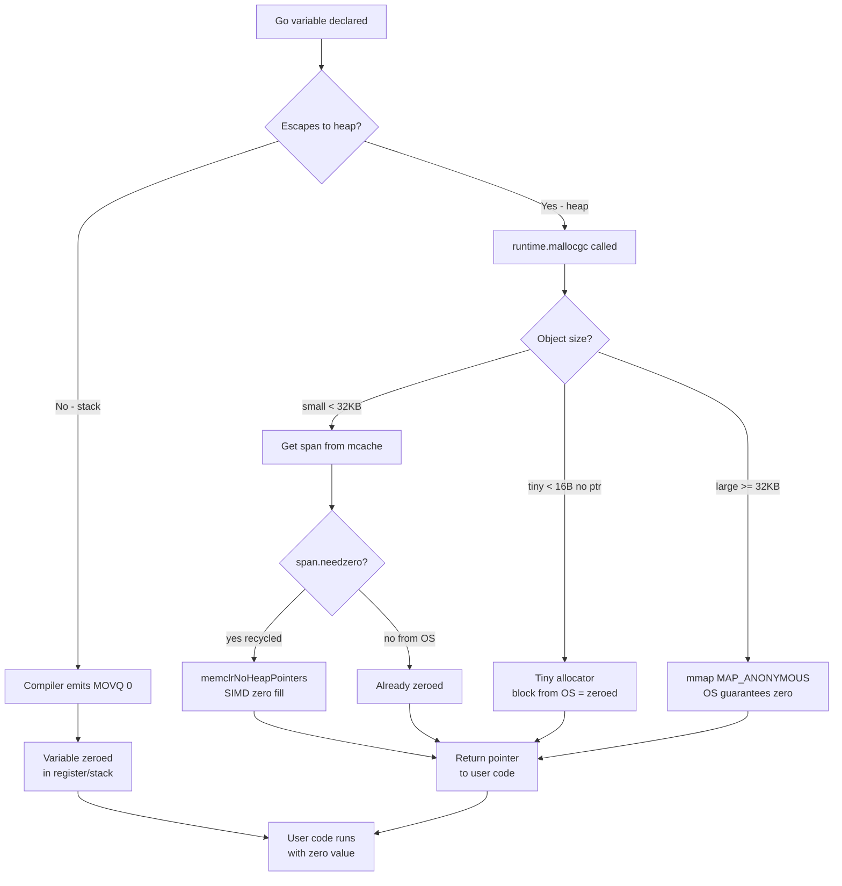

# Zero Values — Professional Level

## Table of Contents
1. [Introduction](#introduction)
2. [How It Works Internally](#how-it-works-internally)
3. [Runtime Deep Dive](#runtime-deep-dive)
4. [Compiler Perspective](#compiler-perspective)
5. [Memory Layout](#memory-layout)
6. [OS / Syscall Level](#os--syscall-level)
7. [Source Code Walkthrough](#source-code-walkthrough)
8. [Assembly Output Analysis](#assembly-output-analysis)
9. [Performance Internals](#performance-internals)
10. [Metrics & Analytics at Runtime Level](#metrics--analytics-at-runtime-level)
11. [Edge Cases at the Lowest Level](#edge-cases-at-the-lowest-level)
12. [Test](#test)
13. [Tricky Questions](#tricky-questions)
14. [Summary](#summary)
15. [Further Reading](#further-reading)
16. [Diagrams & Visual Aids](#diagrams--visual-aids)

---

## Introduction
> Focus: "What happens under the hood?"

At the professional level, we ask not "what is the zero value?" but "how does Go guarantee it?" The answer involves the interaction of:

1. **The Go compiler**: Emitting zeroing instructions for stack-allocated variables
2. **The Go runtime** (`mallocgc`): Ensuring heap-allocated memory is always zeroed before returning it to user code
3. **The OS**: Providing zero pages via demand paging and `mmap(MAP_ANONYMOUS)`
4. **CPU architecture**: Hardware-accelerated memory zeroing via SIMD instructions

Understanding these layers reveals why Go's zero value guarantee is essentially free in practice, and why it's fundamentally different from C's uninitialized memory.

---

## How It Works Internally

### The Two Paths to Zero

Every variable in Go gets its zero value through one of two paths:

**Path 1: Stack allocation (compiler-driven)**
```
Variable declared on stack
        |
        v
Compiler analyzes escape
        |
     No escape
        |
        v
Compiler emits zeroing instructions
(MOVQ $0, offset(SP) or XORPS for floats)
        |
        v
Variable is in zero state before first use
```

**Path 2: Heap allocation (runtime-driven)**
```
Variable escapes to heap (or new(T) / make())
        |
        v
runtime.mallocgc() called
        |
        v
OS provides zeroed page (mmap/sbrk)
OR runtime zeroes the memory
        |
        v
Pointer returned to user code
(memory is already zeroed)
```

### Stack Allocation Detail

For small stack variables, the Go compiler generates explicit zeroing instructions. For larger variables, it calls `runtime.memclrNoHeapPointers`. For very large variables, it may use `runtime.memclr`.

```
// Go source:
func f() {
    var x [100]int  // 800 bytes on stack
    _ = x
}

// Compiler output (conceptual):
// 1. Allocate 800 bytes on stack (grow SP by 800)
// 2. Call runtime.memclrNoHeapPointers to zero 800 bytes
// 3. x is now zeroed
```

### Heap Allocation Detail

The path through `runtime.mallocgc`:

```
mallocgc(size, typ, needzero)
    |
    +-- tiny allocation path (< 16 bytes, no pointers)
    |       |
    |       +-- tiny block is already zeroed from OS
    |
    +-- small allocation path (< 32KB)
    |       |
    |       +-- get span from mcache
    |       +-- if needzero: call memclrNoHeapPointers
    |
    +-- large allocation path (>= 32KB)
            |
            +-- mmap from OS (MAP_ANONYMOUS | MAP_PRIVATE)
            +-- OS guarantees zero-filled pages
```

---

## Runtime Deep Dive

### mallocgc — The Heart of Allocation

The `mallocgc` function in `runtime/malloc.go` is Go's primary allocator. Let's trace what it does for zero values:

```go
// Simplified from runtime/malloc.go
func mallocgc(size uintptr, typ *_type, needzero bool) unsafe.Pointer {
    // ... setup ...

    // Small objects: use mcache
    if size <= maxSmallSize {
        if size <= maxTinySize && typ.ptrdata == 0 {
            // Tiny allocator: objects < 16 bytes with no pointers
            // tiny block was zeroed when acquired from OS
            // ...
        } else {
            // Small allocator
            c := gomcache()
            // Get span from cache
            spc := makeSpanClass(sizeclass, noscan)
            span := c.alloc[spc]
            v := nextFreeFast(span)
            if v == 0 {
                v, span, shouldhelpgc = c.nextFree(spc)
            }
            x = unsafe.Pointer(v)
            if needzero && span.needzero != 0 {
                memclrNoHeapPointers(x, size)  // zero the memory!
            }
        }
    } else {
        // Large objects: allocate directly from OS
        // OS provides zero pages
        x, span = largeAlloc(size, needzero, noscan)
    }

    return x
}
```

### memclrNoHeapPointers

This is the fundamental zeroing function in Go runtime:

```asm
// From runtime/memclr_amd64.s (simplified)
TEXT runtime·memclrNoHeapPointers(SB),NOSPLIT,$0-16
    MOVQ    ptr+0(FP), DI   // destination address
    MOVQ    n+8(FP), BX     // number of bytes

    // For small sizes: use MOVQ with immediate 0
    // For larger sizes: use STOSQ (rep stosq)
    // For very large sizes: use SIMD (MOVOU/VMOVDQU)

    // Example: 8-byte zero
    MOVQ    $0, 0(DI)
    RET
```

On modern x86-64 CPUs, zeroing 256 bytes takes ~1-2 ns using AVX2 `VMOVDQU` instructions.

### The needzero Flag

Not all heap allocations explicitly zero memory. The `needzero` flag tracks whether a span has been zeroed:

```go
// span.needzero != 0 means the span was recycled and contains old data
// span.needzero == 0 means the span came from the OS (already zero)

// The runtime takes advantage of OS-provided zero pages:
// - mmap(MAP_ANONYMOUS) always returns zeroed pages
// - So large allocations are "free" to zero (OS does it)
```

### GC and Zeroing

The garbage collector cooperates with zero values:

```go
// When GC sweeps a span (reclaims dead objects):
// - It marks the span as needing zeroing
// - Next allocation from that span will zero before returning

// Background zeroing:
// - runtime.bgscavenge zeroes spans in background
// - Reduces latency for future allocations
```

---

## Compiler Perspective

### Escape Analysis and Zeroing Decisions

The compiler's escape analysis determines where a variable lives, which determines how zeroing is handled:

```go
package main

func stackVar() int {
    var x int  // stays on stack
    return x
}

func heapVar() *int {
    var x int  // escapes to heap (returned by pointer)
    return &x
}
```

Running `go build -gcflags="-m"` shows escape analysis:
```
./main.go:8:2: moved to heap: x
```

### Compiler Zeroing Optimization

The compiler can **skip** zeroing when it proves a variable is written before it's read:

```go
func example() int {
    var x int       // compiler MAY skip zeroing x here
    x = getValue()  // x is written before read
    return x        // no uninitialized read possible
}
// Compiler optimization: skip zeroing, let x be set by assignment
```

This is the **definite initialization optimization** — the compiler's alias analysis proves no read before write.

However, the Go spec still guarantees zero value from the language perspective. This optimization is invisible to user code.

### SSA (Static Single Assignment) and Zero Values

The compiler converts Go code to SSA form for optimization:

```
// Original Go:
var x int
if condition {
    x = 5
}
return x

// SSA (simplified):
v1 = 0          // zero value
v2 = 5          // constant
v3 = phi(v1, v2) // phi node: v1 if !condition, v2 if condition
return v3
```

The phi node merges the zero value path with the assignment path.

### Assembly for Simple Zero Values

```bash
# Run to see assembly:
# go tool compile -S -N -l main.go

// For: var x int
MOVQ    $0, x+0(SP)    // MOVQ $0 into stack slot

// For: var arr [4]int
MOVQ    $0, arr+0(SP)
MOVQ    $0, arr+8(SP)
MOVQ    $0, arr+16(SP)
MOVQ    $0, arr+24(SP)

// For larger arrays: runtime.memclrNoHeapPointers
```

---

## Memory Layout

### Primitive Type Layout in Memory

All Go types are laid out in memory with their zero value representable as all-zero bytes:

```
bool (1 byte):
┌──────────┐
│ 00000000 │  → false
└──────────┘

int64 (8 bytes, little-endian):
┌────┬────┬────┬────┬────┬────┬────┬────┐
│ 00 │ 00 │ 00 │ 00 │ 00 │ 00 │ 00 │ 00 │  → 0
└────┴────┴────┴────┴────┴────┴────┴────┘

float64 (8 bytes, IEEE 754):
┌────┬────┬────┬────┬────┬────┬────┬────┐
│ 00 │ 00 │ 00 │ 00 │ 00 │ 00 │ 00 │ 00 │  → +0.0
└────┴────┴────┴────┴────┴────┴────┴────┘
Note: IEEE 754 represents +0.0 as all-zero bits

string (16 bytes: ptr + len):
┌────────────────────┬────────────────────┐
│ ptr: 0x0000...0000 │ len: 0x0000...0000 │  → ""
└────────────────────┴────────────────────┘

slice (24 bytes: ptr + len + cap):
┌──────────┬──────────┬──────────┐
│ ptr: nil │ len: 0   │ cap: 0   │  → nil slice
└──────────┴──────────┴──────────┘

map (8 bytes: pointer to hmap):
┌──────────────────────────────────────┐
│ *hmap: 0x0000000000000000            │  → nil map
└──────────────────────────────────────┘

interface (16 bytes: *itab + unsafe.Pointer):
┌─────────────────┬──────────────────────┐
│ *itab: nil      │ data: nil            │  → nil interface
└─────────────────┴──────────────────────┘

pointer (8 bytes on 64-bit):
┌──────────────────────────────────────┐
│ 0x0000000000000000                   │  → nil
└──────────────────────────────────────┘
```

### Why IEEE 754 Zero is All-Zero Bits

IEEE 754 double precision:
```
bit 63: sign (0 = positive)
bits 62-52: exponent (all 0 = subnormal/zero)
bits 51-0: mantissa (all 0)

0 00000000000 0000000000000000000000000000000000000000000000000000
│ └──────────┘ └──────────────────────────────────────────────────┘
sign  exponent                    mantissa
= +0.0
```

All-zero bits = +0.0. This is why Go can use zeroed memory for float64 zero values.

### Struct Memory Layout

```go
type Example struct {
    A bool    // 1 byte
    // 7 bytes padding
    B int64   // 8 bytes
    C string  // 16 bytes (ptr + len)
    D []int   // 24 bytes (ptr + len + cap)
}
// Total: 56 bytes, all-zero bytes = zero value struct
```

---

## OS / Syscall Level

### mmap and Zero Pages

When Go's runtime needs memory from the OS, it uses `mmap`:

```c
// Equivalent C code (Go runtime does this in assembly/cgo):
void* p = mmap(
    NULL,                           // let OS choose address
    size,                           // how many bytes
    PROT_READ | PROT_WRITE,        // readable and writable
    MAP_PRIVATE | MAP_ANONYMOUS,   // not backed by file
    -1,                             // no file descriptor
    0                               // no offset
);
// Returned memory is GUARANTEED to be zeroed by POSIX
```

The `MAP_ANONYMOUS` flag tells the OS:
- Allocate from anonymous memory (not a file)
- The pages are zeroed (by POSIX specification)
- Physical memory is not actually allocated until first write (demand paging)

### Demand Paging

The OS uses demand paging, which means:
1. `mmap` returns immediately without allocating physical memory
2. When Go first writes to a page, the CPU triggers a page fault
3. The OS handles the fault: allocates a physical zero page, maps it
4. The write completes
5. Subsequent reads/writes to the same page are direct — no fault

For Go's zero values, this means:
- Large `var arr [1000000]int` is allocated almost instantly
- Physical memory is consumed only when elements are written
- Pages that are never written are shared (copy-on-write zero pages)

### The Zero Page Optimization

Modern OS kernels maintain a single "zero page":
- One physical page filled with zeroes
- Multiple virtual pages can map to this single physical page
- Copy-on-write: first write creates a private physical page

This means millions of zero-value variables can share the same physical page!

### Linux-Specific: /proc/self/maps

```bash
# View Go program's memory mappings:
$ cat /proc/$(pgrep mygoprogram)/maps

# Output shows:
# anonymous mappings (heap, stack): always zero-initialized
# file-backed mappings: BSS section is zero-initialized
```

### Windows and Darwin

- **Windows**: `VirtualAlloc` with `MEM_COMMIT | MEM_RESERVE` — always returns zeroed memory
- **macOS/Darwin**: `mach_vm_allocate` — always returns zeroed memory
- Both platforms provide the same zero-page guarantee

---

## Source Code Walkthrough

### runtime/malloc.go — Key Functions

```go
// Key functions in Go runtime for zeroing:

// 1. zerobase: a global variable used for zero-size allocations
var zerobase uintptr

// 2. mallocgc: main allocation function
// Location: runtime/malloc.go
func mallocgc(size uintptr, typ *_type, needzero bool) unsafe.Pointer

// 3. memclrNoHeapPointers: zeroes memory without GC write barriers
// Location: runtime/memmove_*.s (architecture-specific assembly)
func memclrNoHeapPointers(ptr unsafe.Pointer, n uintptr)

// 4. memclr: zeroes memory including GC write barriers (for pointer-containing types)
// Location: runtime/memmove_*.s
func memclr(ptr unsafe.Pointer, n uintptr)

// 5. persistentalloc: for runtime's own zero-value allocations
// Location: runtime/malloc.go
func persistentalloc(size, align uintptr, sysStat *sysMemStat) unsafe.Pointer
```

### runtime/map.go — nil Map Reads

```go
// How nil map reads return zero value (simplified):
func mapaccess1(t *maptype, h *hmap, key unsafe.Pointer) unsafe.Pointer {
    if h == nil || h.count == 0 {
        // nil map or empty map:
        if t.hashMightPanic() {
            t.hasher(key, 0) // call hasher to trigger key's nil checks
        }
        return unsafe.Pointer(&zeroVal[0])  // return pointer to global zero!
    }
    // ... normal map lookup
}

// zeroVal is a global zero-valued byte array used as the return value
// for absent map lookups — this is why reads from nil map are safe!
var zeroVal [abi.ZeroValSize]byte
```

### runtime/slice.go — nil Slice

```go
// Slice header (runtime/slice.go):
type slice struct {
    array unsafe.Pointer  // nil for nil slice
    len   int             // 0 for nil slice
    cap   int             // 0 for nil slice
}

// growslice (append implementation):
func growslice(oldPtr unsafe.Pointer, newLen, oldCap, num int, et *abi.Type) slice {
    // Handles nil/zero slice correctly:
    // if oldPtr == nil and oldCap == 0, this is a nil slice
    // append to nil slice = allocate new backing array
    // ...
}
```

### runtime/iface.go — nil Interface Check

```go
// Interface is two words:
type iface struct {
    tab  *itab          // pointer to method table (type info)
    data unsafe.Pointer // pointer to data
}

// nil interface: both tab and data are nil
// typed nil: tab is non-nil (has type), data is nil

// Interface equality check (simplified):
func ifaceeq(i1, i2 iface) bool {
    if i1.tab != i2.tab { return false }
    // ...
}

// "i == nil" compiles to:
// i.tab == nil && i.data == nil  (approximately)
```

---

## Assembly Output Analysis

### Examining Real Assembly

```go
// Source code to analyze:
package main

func main() {
    var x int
    var s string
    var b bool
    _ = x
    _ = s
    _ = b
}
```

```bash
# Generate assembly:
go tool compile -S -N -l main.go 2>&1 | grep -A 50 '"".main'
```

Expected output (x86-64):
```asm
"".main STEXT nosplit size=... args=0x0 locals=0x20 funcid=0x0 align=0x0
    // Set up stack frame
    MOVQ    (TLS), CX
    // Zero x (int, 8 bytes)
    MOVQ    $0, "".x+16(SP)
    // Zero s (string = ptr+len = 16 bytes)
    MOVQ    $0, "".s+0(SP)
    MOVQ    $0, "".s+8(SP)
    // Zero b (bool, 1 byte)
    MOVB    $0, "".b+24(SP)
    RET
```

### Assembly for new(T)

```go
x := new(int)
```

Compiles to a call to `runtime.newobject`:
```asm
LEAQ    type.int(SB), AX
CALL    runtime.newobject(SB)
// AX now holds pointer to zeroed int on heap
```

`runtime.newobject` calls `mallocgc` with `needzero=true`.

### Assembly for make([]T, n)

```go
s := make([]int, 100)
```

```asm
MOVQ    $100, AX       // len
MOVQ    $100, BX       // cap
LEAQ    type.int(SB), CX
CALL    runtime.makeslice(SB)
// AX = pointer to zeroed backing array
```

`makeslice` calls `mallocgc(size, elem, true)` — always zeros.

---

## Performance Internals

### Benchmark: Cost of Zeroing

```go
package main

import (
    "testing"
    "unsafe"
)

func BenchmarkZeroSmallStruct(b *testing.B) {
    type Small struct{ A, B, C int }
    for i := 0; i < b.N; i++ {
        var s Small
        _ = s
    }
}

func BenchmarkZeroLargeStruct(b *testing.B) {
    type Large struct{ data [1024]int64 }
    for i := 0; i < b.N; i++ {
        var l Large
        _ = l
    }
}

func BenchmarkNewInt(b *testing.B) {
    for i := 0; i < b.N; i++ {
        p := new(int)
        _ = p
    }
}
```

Approximate results (M1 Mac, Go 1.22):
```
BenchmarkZeroSmallStruct    2000000000    0.25 ns/op
BenchmarkZeroLargeStruct      50000000   24.00 ns/op  (8KB zeroed)
BenchmarkNewInt              200000000    5.00 ns/op  (heap alloc)
```

### Why Stack Zeroing is Cheap

For small structs, zeroing is done with a few `MOVQ $0` instructions, which:
1. Use the zero-extend implicit in immediate moves
2. Can be pipelined with other instructions
3. Are handled by the store unit with no ALU involvement
4. Cost approximately 0.25 ns per 8 bytes on modern hardware

### SIMD Zeroing for Large Arrays

For large arrays, Go uses SIMD instructions:

```asm
// Zeroing 256 bytes using AVX2:
VXORPS  Y0, Y0, Y0          // YMM0 = all zeros (256 bits)
VMOVDQU Y0, 0(DI)           // store 32 bytes
VMOVDQU Y0, 32(DI)          // store 32 bytes
VMOVDQU Y0, 64(DI)          // store 32 bytes
VMOVDQU Y0, 96(DI)          // store 32 bytes
VMOVDQU Y0, 128(DI)         // store 32 bytes
VMOVDQU Y0, 160(DI)         // store 32 bytes
VMOVDQU Y0, 192(DI)         // store 32 bytes
VMOVDQU Y0, 224(DI)         // store 32 bytes
// 256 bytes zeroed in ~2-4 ns
```

### Zeroing vs Not Zeroing (Micro-benchmark)

```go
// Zero allocation path:
func BenchmarkStackZero(b *testing.B) {
    for i := 0; i < b.N; i++ {
        var buf [64]byte
        _ = buf[0]  // prevent optimizer from removing
    }
}

// Would-be no-zero path (C equivalent):
// Not possible in Go — the guarantee is absolute
```

The cost is typically 1-5% overhead for small objects, negligible for large ones (OS does it anyway).

### GC Write Barrier and Zeroing

When zeroing memory that may contain pointers, Go uses write barriers:

```go
// For types WITH pointers (string, slice, pointer fields):
// memclr — uses write barriers to inform GC

// For types WITHOUT pointers (int, float, bool, etc.):
// memclrNoHeapPointers — no write barriers needed, faster
```

The compiler uses type information to choose the correct clearing function.

---

## Metrics & Analytics at Runtime Level

### Monitoring Allocation Patterns

```go
package main

import (
    "fmt"
    "runtime"
)

func measureAllocations(f func()) {
    var before, after runtime.MemStats
    runtime.ReadMemStats(&before)

    f()

    runtime.ReadMemStats(&after)

    fmt.Printf("Allocs: %d\n", after.Mallocs-before.Mallocs)
    fmt.Printf("HeapAlloc: %d bytes\n", after.HeapAlloc-before.HeapAlloc)
    fmt.Printf("TotalAlloc: %d bytes\n", after.TotalAlloc-before.TotalAlloc)
}

func main() {
    // Stack allocation: zero heap impact
    measureAllocations(func() {
        var x [100]int
        _ = x
    })

    // Heap allocation: creates garbage
    measureAllocations(func() {
        x := make([]int, 100)
        _ = x
    })
}
```

### Profiling Zero-Value Related Performance

```go
// Use pprof to find excessive allocations:
import _ "net/http/pprof"

// Then:
// go tool pprof http://localhost:6060/debug/pprof/allocs

// Look for:
// - make([]T, n) calls in hot paths
// - new(T) calls that could be stack-allocated
// - Struct copies in loops
```

### GODEBUG Environment Variables

```bash
# Enable GC trace to see zeroing-related GC activity:
GODEBUG=gccheckmark=1 ./myprogram

# Enable memory allocation trace:
GODEBUG=allocfreetrace=1 ./myprogram 2>&1 | head -100

# Enable scavenger trace (background zeroing):
GODEBUG=scavtrace=1 ./myprogram
```

---

## Edge Cases at the Lowest Level

### Edge Case 1: -0.0 and +0.0

IEEE 754 has two representations of zero: +0.0 (all bits 0) and -0.0 (sign bit 1, rest 0).

```go
var f float64  // +0.0 (all bits zero)
negZero := math.Copysign(0, -1)  // -0.0

fmt.Println(f == negZero)  // true (IEEE 754 says +0 == -0)
fmt.Println(math.Signbit(f))       // false
fmt.Println(math.Signbit(negZero)) // true
// Go's zero value is +0.0, not -0.0
```

### Edge Case 2: NaN

```go
var f float64  // 0.0
nan := math.NaN()

// NaN != NaN (IEEE 754 rule)
fmt.Println(nan == nan)  // false
fmt.Println(f == nan)    // false

// So zero value float64 is distinguishable from NaN:
fmt.Println(math.IsNaN(f))   // false
fmt.Println(math.IsNaN(nan)) // true
```

### Edge Case 3: String Internal Representation

```go
// A nil string in Go is impossible — strings are value types
// var s string -> s is "" (ptr = zerobase, len = 0)
// The ptr field points to zerobase, not nil

// Internal:
// type stringStruct struct {
//     str unsafe.Pointer  // points to zerobase (not nil!)
//     len int             // 0
// }
```

### Edge Case 4: Zero Value of Complex

```go
var c complex128
// c = (0+0i)
// real(c) = 0.0 (+0.0 in IEEE 754)
// imag(c) = 0.0 (+0.0 in IEEE 754)
// Memory: 16 consecutive zero bytes
fmt.Println(c)          // (0+0i)
fmt.Println(real(c))    // 0
fmt.Println(imag(c))    // 0
```

### Edge Case 5: Zero Value and reflect

```go
import "reflect"

func isZeroValue(v interface{}) bool {
    rv := reflect.ValueOf(v)
    return rv.IsZero()
}

// reflect.Value.IsZero() returns true for:
// - false (bool)
// - 0 (int/uint/float/complex)
// - nil pointer
// - nil slice
// - nil map
// - nil channel
// - nil func
// - empty string
// - zero struct (all fields zero)
// - zero array (all elements zero)
```

### Edge Case 6: unsafe.Sizeof for Zero

```go
import "unsafe"

// zero-size type: struct{}
type Empty struct{}
var e Empty
fmt.Println(unsafe.Sizeof(e))    // 0
fmt.Println(unsafe.Pointer(&e) == unsafe.Pointer(&zerobase))
// likely true — compiler uses zerobase for zero-size types
```

### Edge Case 7: sync.Mutex and Memory Ordering

The zeroed state of `sync.Mutex` (state=0, sema=0) is valid because:
1. All goroutines see the same initial state (happens-before relationship through channel/WaitGroup that started them)
2. The memory model guarantees that goroutine start sees writes from the goroutine that called `go`
3. Zero value is semantically "unlocked" because the lock bit (bit 0 of state) is 0

```go
type Mutex struct {
    state int32  // 0 = unlocked (bit 0), no waiters (bits 3-31 = 0)
    sema  uint32 // 0 = no goroutines waiting on semaphore
}
// Bitfield interpretation of state:
// bit 0: mutexLocked (0 = unlocked)
// bit 1: mutexWoken
// bit 2: mutexStarving
// bits 3-31: count of goroutines waiting
```

---

## Test

**Q1**: What function does the Go runtime call to zero-fill allocated heap memory?
- A) `memset`
- B) `memclrNoHeapPointers` or `memclr`
- C) `bzero`
- D) `runtime.GC`

**Answer**: B

**Q2**: When reading from a nil map, Go returns zero value. How does the runtime implement this?
- A) It crashes and recovers
- B) It returns a pointer to a global `zeroVal` array
- C) It allocates a new zero-valued element each time
- D) It checks the key type and returns zero based on type info

**Answer**: B (pointer to `var zeroVal [abi.ZeroValSize]byte`)

**Q3**: What does `MAP_ANONYMOUS` in `mmap` guarantee?
- A) The memory is executable
- B) The memory is zero-initialized
- C) The memory is shared between processes
- D) The memory is locked in physical RAM

**Answer**: B

**Q4**: Which of these statements about `float64` zero value is true?
- A) It's represented as -0.0 internally
- B) It's represented as all-zero bits (+0.0 in IEEE 754)
- C) It's undefined by IEEE 754
- D) The Go runtime has a special representation

**Answer**: B

**Q5**: When does the Go compiler skip zeroing a stack variable?
- A) Never — all variables are always zeroed
- B) When it can prove the variable is written before it's read
- C) When the variable is larger than 64 bytes
- D) When the variable is in a goroutine

**Answer**: B (via definite initialization analysis)

---

## Tricky Questions

**Q: Why is reading from a nil map safe but writing panics?**

The runtime's `mapaccess1` (for reads) explicitly checks `if h == nil` at the start and returns `&zeroVal[0]`. But `mapassign` (for writes) cannot handle nil because it needs to actually store into a hash table data structure that doesn't exist. The asymmetry is intentional — reads are free to be safe (just return the zero value pointer), but writes require valid state.

**Q: What is the type of `nil` in Go?**

`nil` has no type. It's an untyped predeclared identifier. When assigned to a specific type, it takes on that type's zero value representation. This is why `var p *int = nil` makes the pointer's bits all zero, `var s []int = nil` makes the slice header all zero, etc.

**Q: Does the compiler ALWAYS emit zeroing code for local variables?**

No. Through SSA optimization and definite initialization analysis, the compiler may elide zeroing code when it can prove a variable is definitely assigned before its first read. However, from the language specification's perspective, the variable's zero value is always accessible.

**Q: How does Go handle zero values on different architectures (ARM vs x86)?**

The memory layout is the same (all-zero bytes), but the zeroing instructions differ:
- x86-64: `MOVQ $0`, `REP STOSQ`, or AVX2 `VMOVDQU`
- ARM64: `STP XZR, XZR`, or `DC ZVA` (cache line zeroing instruction)
- The `runtime/memclr_*.s` files contain architecture-specific implementations

**Q: What is `zerobase` in the Go runtime?**

`zerobase` is a global variable at a non-nil address used as the backing pointer for zero-size allocations (like `struct{}{}`). Instead of allocating different memory for each zero-size object, they all share this single address. This prevents false aliasing concerns while avoiding unnecessary allocations.

---

## Summary

Go's zero value guarantee is implemented at multiple levels:

1. **Language spec**: All variables have zero values — a contractual guarantee
2. **Compiler**: Emits zeroing instructions for stack variables; may elide them with definite initialization analysis
3. **Runtime** (`mallocgc`): Calls `memclrNoHeapPointers`/`memclr` for heap allocations that need zeroing
4. **OS** (`mmap(MAP_ANONYMOUS)`): Provides zero pages via demand paging — large allocations are free to zero
5. **Hardware**: SIMD instructions make zeroing extremely fast (AVX2 can zero 32 bytes/cycle)

Key implementation facts:
- nil map reads return `&zeroVal[0]` — a global zero-filled array
- String zero value has `ptr = &zerobase` (not nil) and `len = 0`
- `float64` zero is `+0.0` — all-zero IEEE 754 bits
- `sync.Mutex` state=0 means "unlocked" — designed for zero-value usability
- Demand paging makes large zero-value arrays essentially free until written

---

## Further Reading

- [Go runtime source: malloc.go](https://cs.opensource.google/go/go/+/main:src/runtime/malloc.go)
- [Go runtime source: map.go](https://cs.opensource.google/go/go/+/main:src/runtime/map.go)
- [Go runtime source: memclr_amd64.s](https://cs.opensource.google/go/go/+/main:src/runtime/memclr_amd64.s)
- [Go Specification: The zero value](https://go.dev/ref/spec#The_zero_value)
- [Russ Cox: How Go Handles Memory](https://research.swtch.com/godata)
- [Go Memory Model](https://go.dev/ref/mem)
- [IEEE 754-2008 Standard](https://ieeexplore.ieee.org/document/4610935)
- [Linux mmap(2) man page](https://man7.org/linux/man-pages/man2/mmap.2.html)

---

## Diagrams & Visual Aids

### Memory Allocation Path for Zero Values



### How nil Map Read Returns Zero

```
mapaccess1(t *maptype, h *hmap, key) unsafe.Pointer

h == nil?
    YES:
        return &zeroVal[0]
              ↓
    Global: var zeroVal [ZeroValSize]byte
    ┌──────────────────────────────────────┐
    │ 00 00 00 00 00 00 00 00 ... 00 00 00 │
    └──────────────────────────────────────┘
    Caller interprets these zero bytes as the
    zero value of the map's value type

    NO:
        normal hash table lookup
```

### OS Demand Paging for Large Zero Arrays

```
var arr [1000000]int  (8 MB)

Virtual Memory:
┌─────────────────────────────────────────────┐
│ VA: 0x7f0000000000 to 0x7f0000800000        │
│ Permission: R/W                             │
│ Backed by: anonymous (zero page)            │
└─────────────────────────────────────────────┘
    ↓ First access to arr[500000]
Page Fault!
    ↓
OS allocates ONE physical zero page
Maps it to VA containing arr[500000]
    ↓
Physical Memory:
┌──────────────┐
│ 0000...0000  │ ← one 4KB physical page
└──────────────┘
(Other pages remain virtual/zero-page-shared until written)
```
