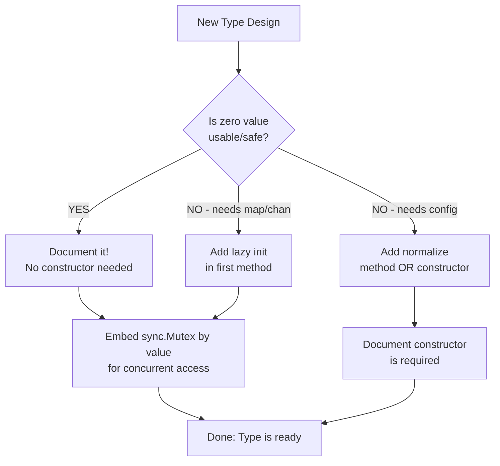

# Zero Values — Senior Level

## Table of Contents
1. [Introduction](#introduction)
2. [Core Concepts — Architectural View](#core-concepts--architectural-view)
3. [Zero Value Pattern in Standard Library](#zero-value-pattern-in-standard-library)
4. [Designing APIs with Usable Zero Values](#designing-apis-with-usable-zero-values)
5. [Performance of Zero Initialization](#performance-of-zero-initialization)
6. [Struct Design Principles](#struct-design-principles)
7. [Concurrency and Zero Values](#concurrency-and-zero-values)
8. [Advanced nil Semantics](#advanced-nil-semantics)
9. [JSON and Serialization Architecture](#json-and-serialization-architecture)
10. [Zero Values in Generic Code](#zero-values-in-generic-code)
11. [Code Review Guide](#code-review-guide)
12. [Refactoring Towards Zero Value Pattern](#refactoring-towards-zero-value-pattern)
13. [Testing Strategies](#testing-strategies)
14. [Production Patterns](#production-patterns)
15. [Security Architecture](#security-architecture)
16. [Performance Benchmarks](#performance-benchmarks)
17. [Anti-Patterns at Scale](#anti-patterns-at-scale)
18. [Edge Cases in Production](#edge-cases-in-production)
19. [Comparison with Other Languages](#comparison-with-other-languages)
20. [Interview-Level Insights](#interview-level-insights)
21. [Cheat Sheet](#cheat-sheet)
22. [Self-Assessment Checklist](#self-assessment-checklist)
23. [Summary](#summary)
24. [What You Can Build](#what-you-can-build)
25. [Further Reading](#further-reading)
26. [Diagrams & Visual Aids](#diagrams--visual-aids)

---

## Introduction
> Focus: Architectural use of zero values

At the senior level, zero values stop being a language feature you "know about" and become a **design tool you actively apply**. The question is no longer "what is the zero value of X?" but rather:

1. **How do I design my types so their zero value is the right default?**
2. **When does the zero value pattern break down and what do I use instead?**
3. **How does Go's zero value guarantee affect performance at scale?**
4. **How do I design concurrent types that are safe at zero value?**

Senior-level understanding means you look at a type like `sync.Mutex` and understand *why* it was designed to have a usable zero value — not just that it does. You apply the same principle to your own library and application code.

---

## Core Concepts — Architectural View

### The Zero Value Contract as API Guarantee

When you publish a Go type, you implicitly make a guarantee about its zero value. If the zero value is usable, you're saying: "Just declare this type — no constructor needed." This is a form of API design.

```go
// Good API: zero value is usable
type Limiter struct {
    mu       sync.Mutex
    count    int
    max      int
}

func (l *Limiter) SetMax(n int) { l.max = n }
func (l *Limiter) Allow() bool {
    l.mu.Lock()
    defer l.mu.Unlock()
    if l.max == 0 { l.max = 100 }  // normalize zero value
    if l.count >= l.max { return false }
    l.count++
    return true
}

// Users can do:
var limiter Limiter
limiter.SetMax(50)
limiter.Allow()
```

### Invariant Design Around Zero Values

A well-designed type maintains its invariants even from the zero state:

```go
type SafeCounter struct {
    mu    sync.Mutex
    value int64
    // Invariant: value >= 0 always
    // Invariant: zero value represents count=0 (valid initial state)
}

func (c *SafeCounter) Increment() {
    c.mu.Lock()
    defer c.mu.Unlock()
    c.value++
}

func (c *SafeCounter) Reset() {
    c.mu.Lock()
    defer c.mu.Unlock()
    c.value = 0  // back to zero value — still valid
}
```

### When Zero Value Needs "Normalization"

Sometimes the zero value isn't the final usable state but needs one pass of normalization:

```go
type Pool struct {
    mu      sync.Mutex
    items   chan interface{}
    maxSize int
    factory func() interface{}
}

func (p *Pool) get() interface{} {
    p.mu.Lock()
    defer p.mu.Unlock()

    // Normalize zero values on first use
    if p.items == nil {
        if p.maxSize == 0 {
            p.maxSize = 10
        }
        p.items = make(chan interface{}, p.maxSize)
    }

    select {
    case item := <-p.items:
        return item
    default:
        if p.factory != nil {
            return p.factory()
        }
        return nil
    }
}
```

---

## Zero Value Pattern in Standard Library

### sync.Mutex — The Canonical Example

```go
// sync.Mutex source (simplified):
type Mutex struct {
    state int32   // 0 = unlocked
    sema  uint32  // 0 = no waiters
}
// Zero state means: unlocked, no waiters — perfectly usable
```

Key lesson: The internal state representation was chosen so that `0` means "unlocked". This is a deliberate design choice, not a coincidence.

### bytes.Buffer

```go
// bytes.Buffer (simplified):
type Buffer struct {
    buf      []byte // nil = empty
    off      int    // 0 = read from beginning
    lastRead readOp // 0 = opInvalid
}

// Zero value is an empty buffer:
var b bytes.Buffer  // ready to use
b.WriteString("hello")
```

The buffer lazily allocates when first written to. The nil slice is handled by `grow()` internally.

### sync.WaitGroup

```go
// WaitGroup (simplified):
type WaitGroup struct {
    noCopy noCopy
    state  atomic.Uint64 // 0 = no goroutines running
    sema   uint32
}
// Zero value = "all goroutines done" — ready to use immediately
```

### sync.Once

```go
type Once struct {
    done atomic.Uint32 // 0 = not done
    m    Mutex
}
// Zero value = "function not yet called" — exactly right
```

### http.Client

```go
var client http.Client  // zero value is a valid HTTP client with defaults
resp, err := client.Get("https://example.com")  // works!
```

### Pattern: Defensive Initialization
All these types follow the pattern: **operations normalize the zero value on first use**.

---

## Designing APIs with Usable Zero Values

### Principle 1: Make Zero Represent "Empty/Default"

```go
// GOOD DESIGN
type Cache struct {
    mu      sync.Mutex
    items   map[string]cacheItem
    maxSize int  // 0 = use default (1000)
    ttl     time.Duration  // 0 = no expiry
}

func (c *Cache) Set(key string, val interface{}) {
    c.mu.Lock()
    defer c.mu.Unlock()

    // Lazy init
    if c.items == nil {
        size := c.maxSize
        if size == 0 {
            size = 1000
        }
        c.items = make(map[string]cacheItem, size)
    }
    // ...
}
```

### Principle 2: Normalize in First Operation, Not Constructor

```go
// Instead of requiring a New() constructor for normalization,
// normalize in the first operation that needs the value:

type Logger struct {
    mu     sync.Mutex
    output io.Writer  // nil = use os.Stderr
    level  int        // 0 = INFO
}

func (l *Logger) writer() io.Writer {
    if l.output == nil {
        return os.Stderr
    }
    return l.output
}

func (l *Logger) Info(msg string) {
    l.mu.Lock()
    defer l.mu.Unlock()
    fmt.Fprintf(l.writer(), "[INFO] %s\n", msg)
}
```

### Principle 3: Document Zero Value Semantics

```go
// Package cache provides a thread-safe cache.
//
// A Cache's zero value is a valid, empty cache with default settings.
// A Cache must not be copied after first use.
type Cache struct {
    // ...
}
```

### Principle 4: Prevent Copy After Use (for types with sync primitives)

```go
// Embed noCopy to get go vet warnings on copy:
type noCopy struct{}
func (*noCopy) Lock()   {}
func (*noCopy) Unlock() {}

type SafeType struct {
    noCopy noCopy
    mu     sync.Mutex
    data   map[string]int
}
```

---

## Performance of Zero Initialization

### The Cost of Zeroing

Zeroing memory is extremely fast in modern systems:
- The CPU has hardware support for setting memory to zero (rep stosb/movsb on x86)
- The OS provides zero pages to processes — first access doesn't cost extra
- Go's allocator zeroes memory from the OS, so `mallocgc` often gets pre-zeroed pages

```go
// Benchmark: allocation with zero values
func BenchmarkNewStruct(b *testing.B) {
    for i := 0; i < b.N; i++ {
        var s struct {
            A, B, C int
            D, E    string
            F       bool
        }
        _ = s
    }
}
// Result: ~0.3ns per iteration — essentially free
```

### Stack vs Heap Zeroing

- **Stack variables**: zeroed by Go runtime before function call (or compiler may skip if it can prove no read before write)
- **Heap variables**: zeroed by `mallocgc` which calls `memclrNoHeapPointers` for pointer-free types

### Escape Analysis and Zero Values

```go
// Stack allocated — zeroed by register clearing
func stackExample() int {
    var x int  // compiler: x on stack, zero via MOVQ $0, ...
    return x
}

// Heap allocated — zeroed by runtime
func heapExample() *int {
    x := new(int)  // runtime.newobject -> mallocgc -> zeroed
    return x
}
```

### Zero Value and CPU Cache

Zeroed memory that hasn't been written to may be represented as "zero pages" by the OS and CPU:
- No physical memory page allocated until first write (demand paging)
- Large zero-value allocations are essentially free until used

---

## Struct Design Principles

### Rule 1: Field Order Matters for Zero Value Semantics

```go
// Good: bool fields with correct zero value semantics
type Feature struct {
    Enabled  bool   // false = disabled (zero = sensible default)
    Debug    bool   // false = no debug (zero = sensible default)
    Required bool   // false = optional (zero = sensible default)
}

// Problematic: bool field where true would be the better default
type Connection struct {
    Reconnect bool  // false = don't reconnect? That's usually wrong!
}
// Solution: rename to reflect the zero value semantic
type Connection struct {
    DisableReconnect bool  // false = reconnection enabled (better default)
}
```

### Rule 2: Use int for Enums Carefully

```go
// DANGER: zero value has no semantic meaning
type Status int
const (
    StatusPending  Status = 0  // this IS the zero value — is that right?
    StatusActive   Status = 1
    StatusInactive Status = 2
)
// var s Status — s is StatusPending — is that correct?

// BETTER: 0 = unset, then define your first real value as 1
type Status int
const (
    StatusUnknown  Status = iota  // 0 = zero value = "not set"
    StatusPending                 // 1
    StatusActive                  // 2
    StatusInactive                // 3
)
```

### Rule 3: Embed Value Types, Not Pointers, for Zero Value Safety

```go
// BAD: need to initialize the mutex pointer
type BadServer struct {
    mu   *sync.Mutex  // nil at zero value
    data map[string]int
}

// GOOD: mutex has usable zero value as embedded value
type GoodServer struct {
    mu   sync.Mutex  // zero value = unlocked
    data map[string]int
}
```

---

## Concurrency and Zero Values

### Thread-Safe Zero Value Pattern

The combination of `sync.Mutex` (usable at zero value) and `sync.Once` (usable at zero value) enables powerful concurrent types:

```go
type LazyDB struct {
    once sync.Once
    mu   sync.Mutex
    db   *sql.DB
    dsn  string
}

func (l *LazyDB) getDB() (*sql.DB, error) {
    var err error
    l.once.Do(func() {
        l.db, err = sql.Open("postgres", l.dsn)
    })
    return l.db, err
}

func (l *LazyDB) Query(q string) (*sql.Rows, error) {
    db, err := l.getDB()
    if err != nil {
        return nil, err
    }
    return db.Query(q)
}
```

### sync.Map — A Counter-Example

`sync.Map` has a usable zero value but is NOT recommended for all use cases:

```go
// sync.Map zero value works:
var m sync.Map
m.Store("key", "value")
v, ok := m.Load("key")

// But sync.Map is optimized for specific read-heavy use cases
// For general use, sync.Mutex + regular map is better
```

### atomic Types (Go 1.19+)

```go
// atomic.Int64 zero value is 0 — immediately usable
var counter atomic.Int64
counter.Add(1)
fmt.Println(counter.Load())  // 1

// atomic.Bool zero value is false — immediately usable
var flag atomic.Bool
flag.Store(true)
fmt.Println(flag.Load())  // true
```

---

## Advanced nil Semantics

### nil as Sentinel for Optional Values

```go
type Config struct {
    Port     *int          // nil = use default (8080)
    Timeout  *time.Duration // nil = use default (30s)
    Debug    *bool         // nil = use env var
}

func (c Config) port() int {
    if c.Port == nil {
        return 8080
    }
    return *c.Port
}
```

### nil Interfaces: The Rule

An interface is nil IFF:
1. Its type pointer is nil AND
2. Its data pointer is nil

```go
// Testing interface nil:
func isNilInterface(i interface{}) bool {
    if i == nil {
        return true  // both type and value are nil
    }

    // Check if the value is nil using reflection
    v := reflect.ValueOf(i)
    return v.Kind() == reflect.Ptr && v.IsNil()
}
```

### nil Function Values

```go
type Handler struct {
    OnSuccess func(result string)  // nil = no callback
    OnError   func(err error)      // nil = log and continue
}

func (h *Handler) handleResult(result string, err error) {
    if err != nil {
        if h.OnError != nil {
            h.OnError(err)
        } else {
            log.Printf("error: %v", err)
        }
        return
    }
    if h.OnSuccess != nil {
        h.OnSuccess(result)
    }
}
```

---

## JSON and Serialization Architecture

### Architectural Decisions for JSON APIs

```go
// Problem: zero values serialize to JSON
type UserResponse struct {
    ID      int     `json:"id"`
    Name    string  `json:"name"`
    Score   int     `json:"score"`   // 0 serialized even if unset
    Email   string  `json:"email"`   // "" serialized even if unset
}

// Solution 1: omitempty for optional fields
type UserResponse struct {
    ID      int     `json:"id"`
    Name    string  `json:"name"`
    Score   int     `json:"score,omitempty"`  // omit if 0
    Email   string  `json:"email,omitempty"`  // omit if ""
}

// Solution 2: pointer for truly optional fields (distinguish 0 from unset)
type UserResponse struct {
    ID      int     `json:"id"`
    Name    string  `json:"name"`
    Score   *int    `json:"score,omitempty"`  // null if unset, number if set
    Email   *string `json:"email,omitempty"`  // null if unset
}
```

### Custom JSON Marshaling for Zero Value Control

```go
type Status int

const (
    StatusUnknown Status = iota
    StatusActive
    StatusInactive
)

func (s Status) MarshalJSON() ([]byte, error) {
    switch s {
    case StatusActive:
        return []byte(`"active"`), nil
    case StatusInactive:
        return []byte(`"inactive"`), nil
    default:
        return []byte(`"unknown"`), nil
    }
}
```

---

## Zero Values in Generic Code

### Using Zero Value with Generics

```go
// Get zero value of any type:
func Zero[T any]() T {
    var zero T
    return zero
}

// Optional type using generics:
type Optional[T any] struct {
    value T
    valid bool
}

func Some[T any](v T) Optional[T] {
    return Optional[T]{value: v, valid: true}
}

func None[T any]() Optional[T] {
    return Optional[T]{}  // zero value = invalid
}

func (o Optional[T]) Get() (T, bool) {
    return o.value, o.valid
}

func (o Optional[T]) OrDefault(def T) T {
    if o.valid {
        return o.value
    }
    return def
}
```

### Generic Cache with Zero Values

```go
type Cache[K comparable, V any] struct {
    mu    sync.Mutex
    items map[K]V
}

func (c *Cache[K, V]) Set(key K, val V) {
    c.mu.Lock()
    defer c.mu.Unlock()
    if c.items == nil {
        c.items = make(map[K]V)
    }
    c.items[key] = val
}

func (c *Cache[K, V]) Get(key K) (V, bool) {
    c.mu.Lock()
    defer c.mu.Unlock()
    v, ok := c.items[key]  // safe even if nil
    return v, ok
}

// Usage: var cache Cache[string, User]  — immediately usable
```

---

## Code Review Guide

### What to Look For in Code Reviews

**Red flags related to zero values:**

1. Writing to a map field without initialization check:
```go
// Flag this:
type Store struct { data map[string]int }
func (s *Store) Set(k string, v int) { s.data[k] = v }  // panic if zero value
```

2. Returning typed nil as error interface:
```go
// Flag this:
func check() error {
    var e *MyError
    return e  // non-nil interface!
}
```

3. Unnecessary pointer for sync primitives:
```go
// Flag this:
type Safe struct { mu *sync.Mutex }
```

4. Copying structs with mutex:
```go
// Flag this:
a := SafeStruct{}
b := a  // copies mutex!
```

5. Not checking nil before func call:
```go
// Flag this:
type Handler struct { callback func(int) }
func (h *Handler) run() { h.callback(42) }  // panic if callback is nil
```

---

## Refactoring Towards Zero Value Pattern

### Before: Constructor-heavy API
```go
type OldServer struct {
    mu       *sync.Mutex
    handlers map[string]Handler
    done     chan struct{}
    config   *Config
}

func NewServer(cfg *Config) (*OldServer, error) {
    if cfg == nil {
        return nil, errors.New("config required")
    }
    return &OldServer{
        mu:       &sync.Mutex{},
        handlers: make(map[string]Handler),
        done:     make(chan struct{}),
        config:   cfg,
    }, nil
}
```

### After: Zero Value Pattern
```go
type Server struct {
    mu       sync.Mutex              // zero = unlocked
    handlers map[string]Handler     // lazy init on first Register
    once     sync.Once              // zero = not started
    done     chan struct{}           // lazy init on Start
    host     string                 // "" = use "localhost"
    port     int                    // 0 = use 8080
}

func (s *Server) Register(path string, h Handler) {
    s.mu.Lock()
    defer s.mu.Unlock()
    if s.handlers == nil {
        s.handlers = make(map[string]Handler)
    }
    s.handlers[path] = h
}

func (s *Server) Start() error {
    var startErr error
    s.once.Do(func() {
        s.done = make(chan struct{})
        host := s.host
        if host == "" { host = "localhost" }
        port := s.port
        if port == 0 { port = 8080 }
        // start listening...
    })
    return startErr
}
```

---

## Testing Strategies

### Testing Zero Value Behavior

```go
func TestZeroValueUsable(t *testing.T) {
    // Test that zero value can be used without initialization
    var c Counter  // no New() needed

    c.Increment()
    c.Increment()

    if got := c.Value(); got != 2 {
        t.Errorf("expected 2, got %d", got)
    }
}

func TestZeroValueIsSensibleDefault(t *testing.T) {
    var cfg Config  // zero value should be valid config

    // Normalize
    cfg.normalize()

    if cfg.Port == 0 {
        t.Error("normalized config should have a port")
    }
    if cfg.Host == "" {
        t.Error("normalized config should have a host")
    }
}

func TestNilSliceReturnedForEmpty(t *testing.T) {
    results := findMatching([]int{})
    // We prefer nil for "nothing found"
    if results != nil {
        t.Error("expected nil slice for no results")
    }
}
```

### Table-Driven Tests for Zero Value Edge Cases

```go
func TestZeroValueEdgeCases(t *testing.T) {
    tests := []struct {
        name  string
        input Config
        want  Config
    }{
        {
            name:  "zero value gets defaults",
            input: Config{},
            want:  Config{Host: "localhost", Port: 8080, Timeout: 30},
        },
        {
            name:  "partial config keeps non-zero values",
            input: Config{Port: 9090},
            want:  Config{Host: "localhost", Port: 9090, Timeout: 30},
        },
    }

    for _, tt := range tests {
        t.Run(tt.name, func(t *testing.T) {
            tt.input.normalize()
            if tt.input != tt.want {
                t.Errorf("got %+v, want %+v", tt.input, tt.want)
            }
        })
    }
}
```

---

## Production Patterns

### Pattern: Concurrent Lazy Initialization

```go
type DBPool struct {
    once sync.Once
    mu   sync.Mutex
    pool *sql.DB
    dsn  string
    err  error
}

func (p *DBPool) DB() (*sql.DB, error) {
    p.once.Do(func() {
        p.pool, p.err = sql.Open("postgres", p.dsn)
        if p.err == nil {
            p.err = p.pool.Ping()
        }
    })
    return p.pool, p.err
}
```

### Pattern: Read-Heavy Cache

```go
type ROCache struct {
    mu    sync.RWMutex
    items map[string]interface{}
}

func (c *ROCache) Get(key string) (interface{}, bool) {
    c.mu.RLock()
    defer c.mu.RUnlock()
    if c.items == nil {
        return nil, false
    }
    v, ok := c.items[key]
    return v, ok
}

func (c *ROCache) Set(key string, val interface{}) {
    c.mu.Lock()
    defer c.mu.Unlock()
    if c.items == nil {
        c.items = make(map[string]interface{})
    }
    c.items[key] = val
}
```

---

## Security Architecture

### Safe Defaults Through Zero Values

Design security-critical types so that the zero value is the MOST RESTRICTIVE state:

```go
type AccessControl struct {
    AllowRead    bool  // false = deny (safe default)
    AllowWrite   bool  // false = deny (safe default)
    AllowDelete  bool  // false = deny (safe default)
    AllowAdmin   bool  // false = deny (safe default)
}

// Zero value = deny everything — correct for security
var ac AccessControl
// ac.AllowRead, AllowWrite, etc. are all false
```

---

## Performance Benchmarks

```go
package main

import (
    "testing"
    "sync"
)

// Benchmark: zero value mutex vs allocated mutex
func BenchmarkMutexValue(b *testing.B) {
    var mu sync.Mutex
    for i := 0; i < b.N; i++ {
        mu.Lock()
        mu.Unlock()
    }
}

func BenchmarkMutexPointer(b *testing.B) {
    mu := new(sync.Mutex)
    for i := 0; i < b.N; i++ {
        mu.Lock()
        mu.Unlock()
    }
}

// Both should be similar in steady state
// But value avoids one heap allocation
```

---

## Anti-Patterns at Scale

### Anti-Pattern: Mutable Global State Without Protection
```go
// BAD: global nil map — easy to forget initialization
var globalCache map[string]string

func getFromCache(key string) string {
    return globalCache[key]  // safe read, but...
}

func setCache(key, val string) {
    globalCache[key] = val  // PANIC if not initialized
}

// GOOD: zero-value-safe global
var globalCache sync.Map  // zero value is ready to use
```

### Anti-Pattern: Checking nil Before length
```go
// Unnecessary: len() handles nil
if items == nil || len(items) == 0 { ... }

// Idiomatic:
if len(items) == 0 { ... }
```

---

## Edge Cases in Production

### Edge Case 1: time.Time in Database

```go
type Record struct {
    CreatedAt time.Time  // zero = 0001-01-01 — stored as such in DB!
    UpdatedAt *time.Time // nil = NULL in DB — usually better
}
```

### Edge Case 2: Integer Overflow from Zero

```go
// Accumulating unsigned values starting from zero:
var total uint64
for _, v := range bigNumbers {
    total += uint64(v)  // careful: if v is negative int, this wraps
}
```

### Edge Case 3: Concurrent map initialization race

```go
// BAD: race condition
type Store struct {
    data map[string]int
}
func (s *Store) Set(k string, v int) {
    if s.data == nil {
        s.data = make(map[string]int)  // race!
    }
    s.data[k] = v
}

// GOOD: protect with mutex
func (s *Store) Set(k string, v int) {
    s.mu.Lock()
    defer s.mu.Unlock()
    if s.data == nil {
        s.data = make(map[string]int)
    }
    s.data[k] = v
}
```

---

## Postmortems & System Failures

### Postmortem 1: nil Map Write Panic in Production (Financial System)

**Incident:** A payment processing service crashed with a nil map assignment panic after a configuration reload. The bug had been in production for six months before a rarely-triggered code path exposed it.

**Root Cause:**
```go
type PaymentProcessor struct {
    cache map[string]*PaymentResult  // nil until Reload() is called
}

func (p *PaymentProcessor) Process(id string) *PaymentResult {
    result := compute(id)
    p.cache[id] = result  // PANIC: assignment to entry in nil map
    return result
}

// Reload() wasn't called on the hot path — cache was never initialized
```

**Fix:**
```go
// Zero value of sync.Map is usable — no initialization needed
type PaymentProcessor struct {
    cache sync.Map
}

func (p *PaymentProcessor) Process(id string) *PaymentResult {
    if v, ok := p.cache.Load(id); ok {
        return v.(*PaymentResult)
    }
    result := compute(id)
    p.cache.Store(id, result)  // safe — sync.Map zero value is ready
    return result
}
```

**Lesson:** Design structs so their zero value is usable. A nil map is not usable; a `sync.Map` zero value is. This prevents entire classes of initialization-order bugs.

### Postmortem 2: time.Time Zero Value Stored as "Year 0001" in Database

**Incident:** A reporting service showed records from "year 0001" in dashboards after a migration. Thousands of rows were affected.

**Root Cause:**
```go
type AuditLog struct {
    UserID    int
    Action    string
    ExpiresAt time.Time  // zero value: 0001-01-01 00:00:00 UTC
}

// When ExpiresAt was not set, it stored the zero time in the database.
// The reporting query treated any date < 2000 as "never expires", but
// the dashboard displayed the literal "year 0001" date.
```

**Fix:**
```go
type AuditLog struct {
    UserID    int
    Action    string
    ExpiresAt *time.Time  // nil = no expiry; non-nil = specific time
}

// Null in database, not "year 0001"
```

**Lesson:** Use pointer types (`*time.Time`) when "no value" is semantically different from the zero time. The zero value of `time.Time` is a real timestamp, not a sentinel.

### Postmortem 3: Interface nil vs Typed nil (Subtle Production Bug)

**Incident:** An error-checking function always reported "no error" even when errors occurred, causing silent data corruption in a batch processor.

**Root Cause:**
```go
type DBError struct{ msg string }
func (e *DBError) Error() string { return e.msg }

func process() error {
    var dbErr *DBError  // typed nil pointer
    if somethingFailed {
        dbErr = &DBError{"connection lost"}
    }
    return dbErr  // WRONG: returns a non-nil interface containing a nil *DBError
}

// Caller:
err := process()
if err != nil {  // This is ALWAYS true! interface is non-nil even if *DBError is nil
    log.Fatal(err)
}
```

**Fix:**
```go
func process() error {
    if somethingFailed {
        return &DBError{"connection lost"}
    }
    return nil  // return untyped nil, not typed *DBError nil
}
```

**Lesson:** Never return a typed nil pointer as an `error` (or any interface). The zero value of a concrete pointer type (`*T`) is nil, but wrapping it in an interface creates a non-nil interface value. Always return the untyped `nil` for "no error".

---

## Comparison with Other Languages

### Rust: compile-time vs Go: runtime

```rust
// Rust: uninitialized variables caught at compile time
let x: i32;  // declared but not initialized
println!("{}", x);  // COMPILE ERROR: use of possibly uninitialized `x`

// Rust: Default trait for zero-like values
#[derive(Default)]
struct Config {
    host: String,  // Default = ""
    port: u16,     // Default = 0
}
```

```go
// Go: runtime guarantee of zero initialization
var x int  // always 0, guaranteed
```

### Java: partial zero values

```java
class Example {
    int field;      // zero value: 0 (class field)
    String str;     // zero value: null (class field)

    void method() {
        int local;  // NOT initialized — compiler error if used
    }
}
```

Go's advantage: consistent rule — ALL variables always have zero values, no exceptions.

---

## Interview-Level Insights

1. **Zero value as API contract**: The decision to have usable zero values for `sync.Mutex` means you can embed it in any struct without initialization.

2. **Why nil map reads are safe**: Go's map implementation checks for nil before any read operation, returning the zero value of the value type. This is a runtime check built into the map runtime code.

3. **The interface nil problem is fundamental**: It arises from Go's interface representation as two words (type, value). To have a nil interface, BOTH must be nil.

4. **Zero value and GC**: Zeroed memory gives the GC accurate pointer information. Garbage values might look like pointers, causing incorrect GC behavior. Zero values eliminate this.

5. **`new(T)` vs `&T{}`**: Semantically identical. The compiler may optimize either to a stack allocation if it doesn't escape.

---

## Cheat Sheet

```
Zero Value Design Checklist:
[ ] Does var T{} compile and represent a valid empty state?
[ ] Does zero value for bool field mean the right default?
[ ] Are map fields initialized lazily (with nil check + make)?
[ ] Is sync.Mutex embedded by value (not pointer)?
[ ] Is the type documented as "zero value is usable"?
[ ] Does it avoid returning typed nil as error interface?
[ ] Is copy-after-use prevented (noCopy embed for sync types)?
[ ] Are JSON tags using omitempty where zero value should be absent?

Common Zero Value States:
sync.Mutex     = unlocked
bytes.Buffer   = empty buffer
sync.WaitGroup = no goroutines
sync.Once      = not run yet
http.Client    = default HTTP client
atomic.Int64   = 0
atomic.Bool    = false
```

---

## Self-Assessment Checklist

- [ ] I can design a type with a usable zero value
- [ ] I understand the performance implications of zeroed memory
- [ ] I know when to use sync.Mutex by value vs pointer
- [ ] I understand the interface nil trap at the type-system level
- [ ] I can write generics that leverage zero values
- [ ] I know how to test zero value semantics
- [ ] I can identify zero value anti-patterns in code review
- [ ] I understand the security implications of zero value design

---

## Summary

At the senior level, zero values are a design philosophy:
- Design types whose zero value is the correct "empty" or "default" state
- Follow the `sync.Mutex` pattern: embed by value, lazily initialize internal resources
- Avoid returning typed nil as error — always return explicit untyped `nil`
- Use normalization functions to convert zero values to operational defaults
- Design security-critical types where zero = most restrictive
- Document zero value usability as part of your API contract

---

## What You Can Build

- Production-ready concurrent data structures using zero value patterns
- Generic containers (Optional, Result, Cache) using zero value semantics
- Zero-config libraries that work out of the box
- Secure permission systems defaulting to deny-all
- Lazy-initialization patterns safe for concurrent use

---

## Further Reading

- [sync package source code](https://cs.opensource.google/go/go/+/main:src/sync/)
- [bytes package source code](https://cs.opensource.google/go/go/+/main:src/bytes/buffer.go)
- [Russ Cox: Go Data Structures](https://research.swtch.com/godata)
- [Dave Cheney: Practical Go](https://dave.cheney.net/practical-go/presentations/qcon-china.html)
- [Go Design Documents](https://github.com/golang/proposal)

---

## Diagrams & Visual Aids

### Zero Value API Design Decision Tree



### sync.Mutex Internal State

```
sync.Mutex memory layout (8 bytes):
┌──────────────────────────────────────────────────────────┐
│  state: int32 (4 bytes)  │  sema: uint32 (4 bytes)       │
│  0000...0000             │  0000...0000                   │
│  ^                       │  ^                             │
│  bit 0: locked flag      │  semaphore for waiters         │
│  bit 1: woken flag       │                                │
│  bit 2: starving flag    │                                │
│  remaining bits: waiter count                             │
└──────────────────────────────────────────────────────────┘

Zero state = state:0, sema:0 = unlocked, no waiters = ready to use
```

### Lazy Initialization Pattern

```
struct field is nil (zero value)
           |
           v
    first operation called
           |
    +------+------+
    |             |
  READ          WRITE
    |             |
  return        acquire lock
  zero value      |
  (safe)     initialize field
               (make/new)
                  |
              perform write
```
