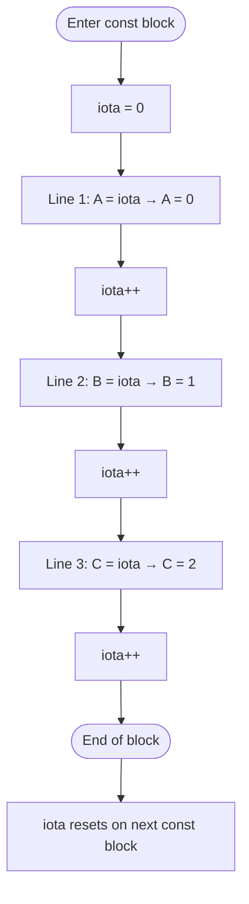
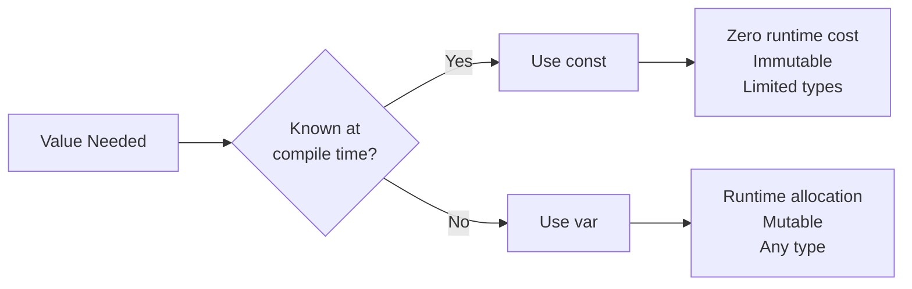

# const and iota — Junior Level

## Table of Contents
1. [Introduction](#introduction)
2. [Prerequisites](#prerequisites)
3. [Glossary](#glossary)
4. [Core Concepts](#core-concepts)
5. [Real-World Analogies](#real-world-analogies)
6. [Mental Models](#mental-models)
7. [Pros & Cons](#pros--cons)
8. [Use Cases](#use-cases)
9. [Code Examples](#code-examples)
10. [Coding Patterns](#coding-patterns)
11. [Clean Code](#clean-code)
12. [Product Use / Feature](#product-use--feature)
13. [Error Handling](#error-handling)
14. [Security Considerations](#security-considerations)
15. [Performance Tips](#performance-tips)
16. [Metrics & Analytics](#metrics--analytics)
17. [Best Practices](#best-practices)
18. [Edge Cases & Pitfalls](#edge-cases--pitfalls)
19. [Common Mistakes](#common-mistakes)
20. [Common Misconceptions](#common-misconceptions)
21. [Tricky Points](#tricky-points)
22. [Test](#test)
23. [Tricky Questions](#tricky-questions)
24. [Cheat Sheet](#cheat-sheet)
25. [Self-Assessment Checklist](#self-assessment-checklist)
26. [Summary](#summary)
27. [What You Can Build](#what-you-can-build)
28. [Further Reading](#further-reading)
29. [Related Topics](#related-topics)
30. [Diagrams & Visual Aids](#diagrams--visual-aids)

---

## Introduction

In Go, `const` lets you define values that never change after they are declared. Think of them as labels glued onto fixed values — once the label is printed, it cannot be peeled off and replaced. The `iota` identifier is a special helper that lives inside `const` blocks and automatically generates sequential integer values, making it very easy to create enumerated types (enums).

These two features work hand-in-hand to let you write code that is safer, more readable, and less error-prone than code full of raw numbers scattered everywhere.

---

## Prerequisites

Before learning `const` and `iota` you should be comfortable with:

- Declaring variables with `var` and `:=`
- Basic Go types: `int`, `float64`, `string`, `bool`
- Writing and running simple Go programs
- Understanding what a package is

---

## Glossary

| Term | Meaning |
|------|---------|
| **constant** | A value fixed at compile time that cannot be changed at runtime |
| **iota** | A predeclared identifier in Go that generates incrementing integers inside a `const` block |
| **untyped constant** | A constant with no explicit type; Go gives it a "default type" when needed |
| **typed constant** | A constant declared with an explicit type like `const X int = 5` |
| **enum** | A named set of related constants (Go does not have a built-in enum keyword) |
| **compile time** | The phase when the Go compiler translates your source code into an executable |
| **magic number** | A literal number in code whose meaning is not obvious without context |
| **const block** | A group of constants declared together with `const ( ... )` |

---

## Core Concepts

### 1. Declaring a Constant

```go
const Pi = 3.14159
const Greeting = "Hello, Go!"
const MaxRetries = 3
```

These are **untyped constants**. Go figures out their type when you use them.

### 2. Typed Constants

```go
const Pi float64 = 3.14159
const MaxRetries int = 3
```

Here you explicitly say what type the constant is.

### 3. Group Declaration

You can group multiple constants together:

```go
const (
    StatusOK       = 200
    StatusNotFound = 404
    StatusError    = 500
)
```

### 4. const vs var

```go
var score = 10   // can change: score = 20 is fine
const limit = 10 // cannot change: limit = 20 will NOT compile
```

The key rule: **`const` values must be known at compile time**. You cannot do:

```go
// ERROR: runtime function call is not a constant expression
const now = time.Now()
```

### 5. What iota Does

`iota` is a counter that starts at **0** inside every new `const` block and increases by **1** for each line:

```go
const (
    A = iota // 0
    B = iota // 1
    C = iota // 2
)
```

Because the pattern is repeated, Go lets you write it more concisely — once you write an expression with `iota`, every following line in the same block **repeats that expression** with the new iota value:

```go
const (
    A = iota // 0
    B        // 1
    C        // 2
)
```

Both snippets produce the same result.

### 6. iota Resets in Each Block

```go
const (
    X = iota // 0
    Y        // 1
)

const (
    P = iota // 0 again — new block, iota resets
    Q        // 1
)
```

---

## Real-World Analogies

### Analogy 1 — Constants as Printed Signs

Imagine a sign on a motorway that says "Speed Limit: 100 km/h". That sign was printed once and cannot be changed by passers-by. A `const` is exactly like that sign — printed at compile time, readable by everyone, but never writable.

### Analogy 2 — iota as a Ticket Machine

Picture a ticket dispenser at a bakery. Every time someone pulls a ticket, the number increases by 1: 0, 1, 2, 3 ... When the bakery opens the next day (new `const` block), the machine resets to 0.

### Analogy 3 — Group const as a Menu

A restaurant menu lists items in order: starter, main, dessert. Each item has a fixed price. A `const` block is like a laminated menu — all values are fixed, printed in order, and cannot be changed by the waiter.

---

## Mental Models

**Model 1 — The Whiteboard That Cannot Be Erased**
A constant is written on a whiteboard in permanent marker. You can look at it, copy it, use it in calculations, but you can never erase or overwrite it.

**Model 2 — iota as Row Numbers in a Spreadsheet**
When you list items in a const block, think of each row getting an automatic row number starting from 0. That row number is `iota`.

```
Row 0 → North
Row 1 → East
Row 2 → South
Row 3 → West
```

---

## Pros & Cons

### Pros

| Benefit | Description |
|---------|-------------|
| Safety | The compiler prevents accidental modification |
| Readability | Named constants make code self-documenting |
| Performance | Constants are resolved at compile time — no runtime overhead |
| Maintenance | Change a constant in one place; all uses update automatically |
| Type safety (typed consts) | Typed constants prevent mixing unrelated values |

### Cons

| Limitation | Description |
|-----------|-------------|
| Not dynamic | Cannot hold a value computed at runtime |
| Limited types | Cannot be slices, maps, arrays, or most structs |
| iota can be fragile | Inserting a new constant in the middle shifts all following values |

---

## Use Cases

1. **HTTP status codes** — `StatusOK = 200`, `StatusNotFound = 404`
2. **Days of the week** — `Monday`, `Tuesday`, ... using `iota`
3. **Directions** — `North`, `East`, `South`, `West`
4. **File permissions** — Read, Write, Execute as bit flags
5. **Mathematical constants** — `Pi`, `E`, `GoldenRatio`
6. **Configuration limits** — `MaxConnections = 100`, `TimeoutSeconds = 30`
7. **Byte sizes** — `KB`, `MB`, `GB` using `iota`

---

## Code Examples

### Example 1 — Simple Constants

```go
package main

import "fmt"

const (
    AppName    = "MyApp"
    AppVersion = "1.0.0"
    MaxUsers   = 1000
)

func main() {
    fmt.Println("Application:", AppName)
    fmt.Println("Version:", AppVersion)
    fmt.Printf("Supports up to %d users\n", MaxUsers)
}
```

Output:
```
Application: MyApp
Version: 1.0.0
Supports up to 1000 users
```

### Example 2 — Days of the Week with iota

```go
package main

import "fmt"

type Day int

const (
    Sunday Day = iota // 0
    Monday            // 1
    Tuesday           // 2
    Wednesday         // 3
    Thursday          // 4
    Friday            // 5
    Saturday          // 6
)

func main() {
    today := Wednesday
    fmt.Println("Today is day number:", today) // 3
}
```

### Example 3 — Skipping iota Value 0

A common pattern: skip 0 so that the zero value of the type means "unknown" or "unset":

```go
package main

import "fmt"

type Color int

const (
    _     Color = iota // 0 — skip, means "unknown"
    Red                // 1
    Green              // 2
    Blue               // 3
)

func main() {
    var c Color // zero value = 0 = unknown
    fmt.Println("Default color:", c) // 0
    fmt.Println("Red:", Red)         // 1
}
```

### Example 4 — File Size Constants

```go
package main

import "fmt"

const (
    KB = 1024
    MB = 1024 * KB
    GB = 1024 * MB
)

func main() {
    fileSize := 5 * MB
    fmt.Printf("File size: %d bytes\n", fileSize)
    fmt.Printf("That is %d MB\n", fileSize/MB)
}
```

### Example 5 — HTTP Status Codes

```go
package main

import "fmt"

const (
    StatusOK        = 200
    StatusCreated   = 201
    StatusBadReq    = 400
    StatusNotFound  = 404
    StatusInternal  = 500
)

func handleStatus(code int) {
    switch code {
    case StatusOK:
        fmt.Println("Success!")
    case StatusNotFound:
        fmt.Println("Resource not found.")
    case StatusInternal:
        fmt.Println("Server error.")
    default:
        fmt.Println("Unknown status:", code)
    }
}

func main() {
    handleStatus(StatusOK)
    handleStatus(StatusNotFound)
    handleStatus(503)
}
```

---

## Coding Patterns

### Pattern 1 — Enum with Named Type

Always give your iota constants a named type. This prevents mixing unrelated constants:

```go
type Status int

const (
    StatusPending  Status = iota
    StatusActive
    StatusInactive
    StatusDeleted
)
```

### Pattern 2 — Skip Zero Value

```go
type Priority int

const (
    _               Priority = iota // unused zero value
    PriorityLow                     // 1
    PriorityMedium                  // 2
    PriorityHigh                    // 3
    PriorityCritical                // 4
)
```

### Pattern 3 — Simple Bit Flags

```go
type Permission int

const (
    Read    Permission = 1 << iota // 1
    Write                          // 2
    Execute                        // 4
)

func main() {
    userPerm := Read | Write // 3
    if userPerm&Read != 0 {
        fmt.Println("Can read")
    }
    if userPerm&Execute != 0 {
        fmt.Println("Can execute")
    } else {
        fmt.Println("Cannot execute")
    }
}
```

---

## Clean Code

### Do: Use Named Constants Instead of Magic Numbers

```go
// Bad
if retries > 3 {
    return error
}

// Good
const MaxRetries = 3
if retries > MaxRetries {
    return error
}
```

### Do: Group Related Constants Together

```go
// Good
const (
    MinAge = 0
    MaxAge = 150
    DefaultAge = 25
)
```

### Do: Use Descriptive Names

```go
// Bad
const (
    A = iota
    B
    C
)

// Good
const (
    DirectionNorth Direction = iota
    DirectionEast
    DirectionSouth
    DirectionWest
)
```

---

## Product Use / Feature

In a real application, constants are used for:

- **Feature flags** (as typed boolean constants if the value is known at compile time)
- **Configuration defaults** like timeout values, retry limits, max page sizes
- **API response codes** so every part of the code uses the same named value
- **Roles and permissions** using bit flags for compact storage

Example — a user role system:

```go
type Role int

const (
    RoleGuest Role = iota
    RoleUser
    RoleEditor
    RoleAdmin
)

func canEdit(r Role) bool {
    return r >= RoleEditor
}
```

---

## Error Handling

Constants themselves do not cause runtime errors. However, common pitfalls include:

1. **Using the zero value of an iota enum** — if you forget to skip 0, the zero value of any variable of that type will silently equal the first constant.

```go
type Direction int
const (
    North Direction = iota // North is 0
    East
    South
    West
)

var d Direction // d == 0 == North — is that what you wanted?
```

2. **Typed constant assignment mismatch**

```go
const limit int = 10
var x float64 = limit // ERROR: cannot use limit (type int) as type float64
```

Fix by using an untyped constant or explicit conversion:

```go
const limit = 10       // untyped — works as any numeric type
var x float64 = limit  // OK
```

---

## Security Considerations

- **Sensitive values should not be constants** — API keys, passwords, and tokens must come from environment variables or secret managers, never from source-code constants.
- **iota-based permission flags** must be designed carefully; accidentally leaving a permission at 0 may grant or deny access unexpectedly.

---

## Performance Tips

- Constants are resolved entirely at compile time. There is **zero runtime cost** to using them.
- Replacing repeated literal values with constants does not slow the program — the compiler substitutes the literal value at each use site.
- Using constants in expressions (like `5 * MB`) allows the compiler to fold the expression into a single literal — this is called **constant folding**.

---

## Metrics & Analytics

When building analytics or logging systems, named constants improve log readability:

```go
type EventType int

const (
    EventLogin EventType = iota
    EventLogout
    EventPurchase
    EventRefund
)

func logEvent(e EventType) {
    fmt.Printf("Event code: %d\n", e)
}
```

You can map constant values to strings for dashboards by implementing `String()`.

---

## Best Practices

1. Always use a named type with iota-based enums.
2. Skip the zero value (`_ = iota`) if the zero value should mean "unset" or "unknown".
3. Group related constants in a single `const` block.
4. Use `UPPER_CASE` only for exported constants that follow existing conventions (e.g., `MaxRetries`). Go generally uses `CamelCase`.
5. Never hard-code magic numbers — use named constants.
6. Add a comment for each constant group explaining what it represents.
7. Do not put secrets in constants.

---

## Edge Cases & Pitfalls

### Pitfall 1 — Inserting a Constant in the Middle

If you insert a new constant in an `iota` block, all following constants shift by 1. This can silently break switch statements or stored database values.

```go
const (
    Small  = iota // 0
    Medium        // 1
    // insert Large here later — shifts all following values!
    Large         // 2 → becomes 2 after insert
    XLarge        // 3 → becomes 3 after insert
)
```

**Mitigation**: Assign explicit values when the order matters and values are stored or communicated externally.

### Pitfall 2 — iota Only Works Inside const Blocks

```go
var x = iota // ERROR: iota outside const block
```

### Pitfall 3 — Constants Must Be Computable at Compile Time

```go
var runtime = 42
const bad = runtime + 1 // ERROR: const initializer is not a constant
```

---

## Common Mistakes

| Mistake | Explanation |
|---------|-------------|
| Trying to assign to a constant | `Pi = 3` — compile error |
| Using `iota` in a `var` block | `iota` is only valid inside `const` blocks |
| Forgetting to skip zero for enums | The zero value of a type is the first constant, which may not represent "nothing" |
| Using untyped int constants with typed parameters | May need explicit type conversion |
| Storing iota values in a database without explicit assignment | Inserting a new constant shifts stored values |

---

## Common Misconceptions

**"const is the same as a final variable in Java"**
Not quite. Go constants must be computable at compile time. Java `final` fields can hold runtime values. Go constants cannot.

**"iota is a function"**
No. `iota` is a predeclared identifier (like `true`, `false`, `nil`). It is not a function call.

**"All constants are int"**
No. Constants can be integers, floats, complex numbers, runes, and strings. Untyped constants are not limited to `int`.

**"You can use iota anywhere"**
No. `iota` is only valid inside a `const` block.

---

## Tricky Points

1. **Repeated expression**: Once you write `iota` in a const block expression, every subsequent line (that has no explicit value) repeats that same expression formula but with the incremented `iota`.

```go
const (
    A = iota * 2 // 0 * 2 = 0
    B            // 1 * 2 = 2
    C            // 2 * 2 = 4
)
```

2. **iota is the line number within the block**, not the order of assignment:

```go
const (
    x = 5    // iota is 0 here, but x is 5 (not using iota)
    y = iota // iota is 1, so y = 1
    z        // iota is 2, so z = 2
)
```

---

## Test

**Question 1**: What is the value of `C` in the following code?

```go
const (
    A = iota
    B
    C
)
```

<details>
<summary>Answer</summary>
C = 2
</details>

**Question 2**: Will this code compile? Why or why not?

```go
var limit = 10
const max = limit + 5
```

<details>
<summary>Answer</summary>
No. `const` initializer must be a compile-time constant expression. `limit` is a variable, so `limit + 5` is not constant.
</details>

**Question 3**: What is the value of `y`?

```go
const (
    x = 5
    y = iota
    z = iota
)
```

<details>
<summary>Answer</summary>
y = 1 (iota counts the position in the const block, starting from 0. x is position 0, y is position 1, z is position 2).
</details>

---

## Tricky Questions

**Q: Can you have a constant of type `[]int` (slice)?**
No. Slices are reference types and require runtime memory allocation. Constants must be simple scalar values (numbers, strings, booleans, runes).

**Q: What happens if you declare two separate const blocks — does iota continue?**
No. `iota` resets to 0 in each new `const` block.

**Q: Can a constant have the value of another constant?**

```go
const A = 10
const B = A * 2 // Yes — perfectly valid!
```

Yes, as long as `A` is already a constant, `B = A * 2` is a constant expression.

---

## Cheat Sheet

```go
// Untyped constant
const Pi = 3.14159

// Typed constant
const Pi float64 = 3.14159

// String constant
const Greeting = "Hello"

// Group constant
const (
    A = 1
    B = 2
    C = 3
)

// iota — sequential integers
const (
    Zero = iota // 0
    One         // 1
    Two         // 2
)

// iota with named type
type Day int
const (
    Sunday Day = iota // 0
    Monday            // 1
    // ...
)

// Skip zero
const (
    _    = iota // 0 — unused
    One         // 1
    Two         // 2
)

// Bit flags
const (
    Read    = 1 << iota // 1
    Write               // 2
    Execute             // 4
)

// File sizes
const (
    KB = 1024
    MB = 1024 * KB
    GB = 1024 * MB
)
```

---

## Self-Assessment Checklist

- [ ] I can declare a constant using `const`
- [ ] I know the difference between typed and untyped constants
- [ ] I can write a `const` block
- [ ] I understand what `iota` does and where it starts
- [ ] I know that `iota` resets to 0 in each new `const` block
- [ ] I can create a simple enum using `iota` and a named type
- [ ] I know why skipping zero (using `_`) is useful
- [ ] I understand that constants are resolved at compile time
- [ ] I know that constants cannot hold slices, maps, or arrays
- [ ] I can replace magic numbers with named constants

---

## Summary

- `const` declares values that are fixed at compile time and can never be changed.
- Use `const` for values that never change: math constants, limits, status codes.
- `iota` is a predeclared identifier in `const` blocks that starts at 0 and increases by 1 per line.
- `iota` resets to 0 in every new `const` block.
- Always pair `iota` with a named type to create a type-safe enum.
- Skip the zero value with `_` when the zero value should mean "unset" or "unknown".
- Constants have no runtime overhead — they are folded by the compiler.

---

## What You Can Build

With `const` and `iota` you can build:

- Type-safe enumerations (days, months, directions, states)
- HTTP status code libraries
- Permission and role systems
- Color palettes
- Configuration defaults
- Byte size helpers (KB, MB, GB)
- Game tile types, item categories, event types

---

## Further Reading

- Official Go specification: [Constants](https://go.dev/ref/spec#Constants)
- Go Tour: [Constants](https://go.dev/tour/basics/15)
- Effective Go: [Constants](https://go.dev/doc/effective_go#constants)
- Blog: [Go constants and enums patterns](https://yourbasic.org/golang/iota/)

---

## Related Topics

- `var` and variable declarations
- Types and type conversions
- Stringer interface (`fmt.Stringer`)
- Bit manipulation in Go
- Go's type system and named types

---

## Diagrams & Visual Aids

### Diagram 1 — iota Counter in a const Block



### Diagram 2 — const vs var Comparison



### Diagram 3 — iota Reset Across Blocks

```
Block 1              Block 2
---------            ---------
iota=0  → A          iota=0  → X
iota=1  → B          iota=1  → Y
iota=2  → C          iota=2  → Z
```
