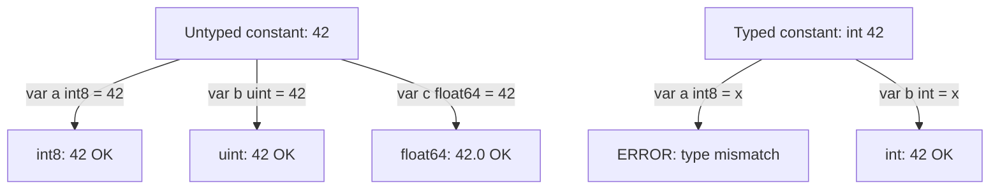
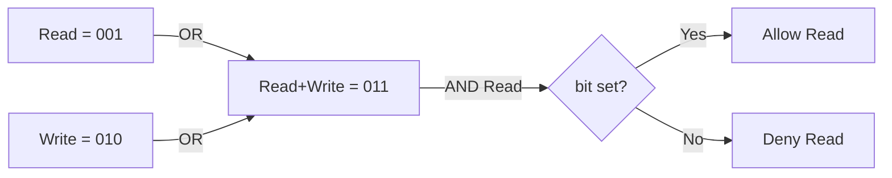

# const and iota — Middle Level

## Table of Contents
1. [Introduction](#introduction)
2. [Prerequisites](#prerequisites)
3. [Glossary](#glossary)
4. [Core Concepts](#core-concepts)
5. [Real-World Analogies](#real-world-analogies)
6. [Mental Models](#mental-models)
7. [Pros & Cons](#pros--cons)
8. [Use Cases](#use-cases)
9. [Code Examples](#code-examples)
10. [Coding Patterns](#coding-patterns)
11. [Clean Code](#clean-code)
12. [Product Use / Feature](#product-use--feature)
13. [Error Handling](#error-handling)
14. [Security Considerations](#security-considerations)
15. [Performance Tips](#performance-tips)
16. [Metrics & Analytics](#metrics--analytics)
17. [Best Practices](#best-practices)
18. [Edge Cases & Pitfalls](#edge-cases--pitfalls)
19. [Common Mistakes](#common-mistakes)
20. [Common Misconceptions](#common-misconceptions)
21. [Tricky Points](#tricky-points)
22. [Test](#test)
23. [Tricky Questions](#tricky-questions)
24. [Cheat Sheet](#cheat-sheet)
25. [Self-Assessment Checklist](#self-assessment-checklist)
26. [Summary](#summary)
27. [What You Can Build](#what-you-can-build)
28. [Further Reading](#further-reading)
29. [Related Topics](#related-topics)
30. [Diagrams & Visual Aids](#diagrams--visual-aids)
31. [Evolution & Historical Context](#evolution--historical-context)
32. [Alternative Approaches](#alternative-approaches)
33. [Anti-Patterns](#anti-patterns)
34. [Debugging Guide](#debugging-guide)
35. [Comparison with Other Languages](#comparison-with-other-languages)

---

## Introduction

At the middle level, you move beyond simply declaring constants and start asking deeper questions: Why are untyped constants flexible enough to work in almost any numeric context? How does Go's constant type system differ from every other major language? What makes `iota` more powerful than it first appears?

This file covers the subtleties of typed versus untyped constants, the full expressiveness of `iota` expressions, type-safe enum design, and why Go's designers made the choices they did.

---

## Prerequisites

- Comfortable with all junior-level constant concepts
- Understanding of Go's type system and named types
- Familiarity with bitwise operators (`<<`, `&`, `|`, `^`)
- Understanding of interfaces and method sets
- Experience with `fmt.Stringer`

---

## Glossary

| Term | Meaning |
|------|---------|
| **constant expression** | An expression composed entirely of constants, evaluatable at compile time |
| **untyped constant** | A constant without an explicit type; has a "kind" (integer, float, complex, rune, string, bool) but adapts to context |
| **default type** | The type an untyped constant gets when used in a context that requires a concrete type |
| **constant folding** | Compiler optimization that evaluates constant expressions at compile time |
| **bit flag** | A single bit within an integer used as a boolean flag |
| **Stringer** | The `fmt.Stringer` interface — any type with a `String() string` method |
| **type assertion** | Checking whether an interface value holds a specific underlying type |
| **iota expression** | Any compile-time expression that uses `iota` as an operand |
| **const spec** | A single line inside a `const` block |

---

## Core Concepts

### Typed vs Untyped Constants — The Full Picture

This is the most important concept at the middle level.

**Untyped constants** have a "kind" but no concrete type. They are said to have a *default type* which is used when a concrete type is needed:

| Kind | Default Type |
|------|-------------|
| Integer | `int` |
| Float | `float64` |
| Complex | `complex128` |
| Rune | `rune` (`int32`) |
| String | `string` |
| Boolean | `bool` |

```go
const x = 42      // untyped integer constant, default type int
const y = 3.14    // untyped float constant, default type float64
const z = "hello" // untyped string constant, default type string
```

The flexibility of untyped constants:

```go
const n = 100 // untyped integer

var a int8   = n  // OK — 100 fits in int8
var b int16  = n  // OK
var c int32  = n  // OK
var d int64  = n  // OK
var e uint   = n  // OK
var f float64 = n // OK — untyped integer can become float64
```

With a *typed* constant, only the declared type is accepted:

```go
const n int = 100

var a int8 = n  // ERROR: cannot use n (type int) as type int8
var b int  = n  // OK — exact type match
```

### How iota Expressions Work

The key insight: Go remembers the **expression template** from the first constant in a block, and re-applies it for each subsequent constant, substituting the new `iota` value:

```go
const (
    _  = iota             // 0: expression is just "iota"
    KB = 1 << (10 * iota) // 1: 1 << (10*1) = 1024
    MB                    // 2: 1 << (10*2) = 1048576
    GB                    // 3: 1 << (10*3) = 1073741824
    TB                    // 4: 1 << (10*4) = 1099511627776
)
```

Wait — there's a subtlety here. The expression is evaluated using the value of `iota` at the position of each spec. So for `MB` (position 2), Go evaluates `1 << (10 * 2)`.

### Multiple Values on One Line

Each *spec* (line) in a const block increments `iota`, even if a line assigns multiple constants:

```go
const (
    a, b = iota, iota * 10 // iota=0: a=0, b=0
    c, d                   // iota=1: c=1, d=10
    e, f                   // iota=2: e=2, f=20
)
```

Both `a` and `b` on the first line see `iota = 0`. The entire line is one *spec*, so `iota` increments once per line, not per variable.

### Implementing fmt.Stringer for iota Enums

This is the standard Go pattern for giving readable names to iota values:

```go
package main

import "fmt"

type Direction int

const (
    North Direction = iota
    East
    South
    West
)

func (d Direction) String() string {
    return [...]string{"North", "East", "South", "West"}[d]
}

func main() {
    d := South
    fmt.Println(d)        // South
    fmt.Printf("%v\n", d) // South
    fmt.Printf("%d\n", d) // 2
}
```

### Constants in Expressions

Constants can be combined in expressions that are also constants:

```go
const (
    SecondsPerMinute = 60
    SecondsPerHour   = 60 * SecondsPerMinute
    SecondsPerDay    = 24 * SecondsPerHour
    SecondsPerWeek   = 7 * SecondsPerDay
)
```

All of these are evaluated at compile time. The Go compiler is even smarter: it can handle expressions involving very large numbers (arbitrary precision) because untyped constants are computed at compile-time with full precision.

---

## Evolution & Historical Context

Go's constant system was designed by Rob Pike, Ken Thompson, and Robert Griesemer in 2007-2009. The key design decisions were:

1. **No `enum` keyword** — The designers believed a separate `enum` construct adds complexity. `iota` within typed const blocks achieves the same effect with fewer keywords.

2. **Untyped constants with arbitrary precision** — Unlike C's `#define` macros (which are text substitution) or Java's final fields (which are runtime values), Go constants are true compile-time values computed with arbitrary precision. This was inspired by the observation that `1 << 30` should not overflow just because the target platform uses 32-bit integers.

3. **iota was inspired by APL** — The name `iota` comes from the APL programming language (and the Greek letter ι), where it generates a sequence of integers.

4. **No `const` functions** — Go deliberately excludes compile-time constant functions (unlike C++ `constexpr` or Rust `const fn`). This keeps the language simpler and the compiler faster.

---

## Real-World Analogies

### Analogy 1 — Untyped Constants as Universal Adapters

An untyped integer constant is like a universal adapter plug. When you plug it into a socket (context), it takes on the shape needed for that socket. A typed constant is like a plug already shaped for one specific socket — it won't fit others without an adapter (conversion).

### Analogy 2 — iota as a Zipper Pull

Each constant declaration is a tooth on a zipper. As the compiler processes each tooth (spec), the pull (iota) advances by one position. The pull always starts at the top (0) of a new zipper (const block).

### Analogy 3 — Bit Flags as Light Switches

Each bit flag is an independent light switch on a panel. `Read`, `Write`, `Execute` are three switches. You can turn on any combination by OR-ing them together. You check if a switch is on by AND-ing with its mask.

---

## Mental Models

**Model 1 — The Constant Evaluator**
Think of the Go compiler carrying a notebook. When it sees a `const` block, it opens a fresh page, writes "iota = 0" at the top, then processes each line, incrementing the page number as it goes. At the end of the block, it closes the notebook. The next `const` block opens a fresh page again.

**Model 2 — Untyped Constants as Pure Mathematics**
Untyped constants live in a world of pure mathematics. The constant `42` is just the abstract number 42 — not an `int`, not a `uint8`. Only when you assign it to a variable does it get pinned to a concrete type.

---

## Pros & Cons

### Pros

| Benefit | Detail |
|---------|--------|
| Untyped constants are flexible | A single constant works across many numeric types without casts |
| Arbitrary precision at compile time | `1 << 62` is valid as a constant even on 32-bit systems |
| iota reduces maintenance | Adding a constant doesn't require renumbering |
| Bit flags are compact | 8 flags in one byte |
| Type safety with named types | Prevents mixing `Direction` and `Color` values |

### Cons

| Limitation | Detail |
|-----------|--------|
| No native enum | No built-in `enum` keyword; iota is a workaround |
| iota is order-dependent | Inserting in the middle breaks values unless using explicit assignment |
| String() must be maintained manually | No automatic name generation for iota constants |
| Typed constant limits use | Cannot pass `Direction` where `int` is expected without conversion |

---

## Use Cases

1. **Bit flag permission systems** — combining multiple boolean options in one integer
2. **Protocol state machines** — enum states for TCP/HTTP state machines
3. **Log levels** — `DEBUG`, `INFO`, `WARN`, `ERROR`, `FATAL`
4. **Configuration schemas** — grouping related limits
5. **Color enums** in graphics libraries
6. **Weekday calculations** using Sunday=0 or Monday=0
7. **Unit conversions** (KB/MB/GB) using iota expressions
8. **Compile-time size constraints** — `const MaxBufferSize = 4 * KB`

---

## Alternative Approaches (Plan B)

### Alternative 1 — Map of String Names

```go
var directionNames = map[Direction]string{
    North: "North",
    East:  "East",
    South: "South",
    West:  "West",
}
```

Pro: Easy to add; no array index concern. Con: Runtime map lookup, not compile-time safe.

### Alternative 2 — String Constants (Not iota)

```go
type Direction string

const (
    North Direction = "North"
    East  Direction = "East"
    South Direction = "South"
    West  Direction = "West"
)
```

Pro: Self-documenting, directly printable. Con: Larger memory footprint, slower comparison than int.

### Alternative 3 — Explicit Integer Values

```go
const (
    North Direction = 1
    East  Direction = 2
    South Direction = 3
    West  Direction = 4
)
```

Pro: Stable values regardless of insertion order — critical when values are stored in databases or external systems. Con: Manual maintenance required.

---

## Code Examples

### Example 1 — Bit Flags with iota

```go
package main

import "fmt"

type FileMode uint

const (
    ModeRead    FileMode = 1 << iota // 1   binary: 001
    ModeWrite                        // 2   binary: 010
    ModeExecute                      // 4   binary: 100
)

func (m FileMode) String() string {
    s := ""
    if m&ModeRead != 0 {
        s += "r"
    } else {
        s += "-"
    }
    if m&ModeWrite != 0 {
        s += "w"
    } else {
        s += "-"
    }
    if m&ModeExecute != 0 {
        s += "x"
    } else {
        s += "-"
    }
    return s
}

func main() {
    perm := ModeRead | ModeWrite
    fmt.Println(perm)                       // rw-
    fmt.Println(perm&ModeExecute != 0)      // false
    fmt.Println(perm&ModeRead != 0)         // true
}
```

### Example 2 — Log Level Enum with Stringer

```go
package main

import "fmt"

type LogLevel int

const (
    DEBUG LogLevel = iota
    INFO
    WARN
    ERROR
    FATAL
)

var logLevelNames = [...]string{"DEBUG", "INFO", "WARN", "ERROR", "FATAL"}

func (l LogLevel) String() string {
    if l < DEBUG || int(l) >= len(logLevelNames) {
        return fmt.Sprintf("LogLevel(%d)", int(l))
    }
    return logLevelNames[l]
}

func log(level LogLevel, message string) {
    fmt.Printf("[%s] %s\n", level, message)
}

func main() {
    log(INFO, "Server started")
    log(WARN, "High memory usage")
    log(ERROR, "Database connection failed")
}
```

Output:
```
[INFO] Server started
[WARN] High memory usage
[ERROR] Database connection failed
```

### Example 3 — Byte Size Constants Using iota Expression

```go
package main

import "fmt"

type ByteSize float64

const (
    _           = iota                   // ignore first value (iota=0)
    KB ByteSize = 1 << (10 * iota)       // 1 << 10 = 1024
    MB                                   // 1 << 20 = 1048576
    GB                                   // 1 << 30
    TB                                   // 1 << 40
    PB                                   // 1 << 50
)

func (b ByteSize) String() string {
    switch {
    case b >= PB:
        return fmt.Sprintf("%.2fPB", b/PB)
    case b >= TB:
        return fmt.Sprintf("%.2fTB", b/TB)
    case b >= GB:
        return fmt.Sprintf("%.2fGB", b/GB)
    case b >= MB:
        return fmt.Sprintf("%.2fMB", b/MB)
    case b >= KB:
        return fmt.Sprintf("%.2fKB", b/KB)
    }
    return fmt.Sprintf("%.2fB", b)
}

func main() {
    fmt.Println(ByteSize(1024))           // 1.00KB
    fmt.Println(ByteSize(1024 * 1024 * 3)) // 3.00MB
    fmt.Println(KB)                       // 1.00KB
    fmt.Println(GB)                       // 1.00GB
}
```

### Example 4 — Days of Week with Methods

```go
package main

import "fmt"

type Weekday int

const (
    Sunday Weekday = iota
    Monday
    Tuesday
    Wednesday
    Thursday
    Friday
    Saturday
)

func (w Weekday) String() string {
    names := [...]string{
        "Sunday", "Monday", "Tuesday", "Wednesday",
        "Thursday", "Friday", "Saturday",
    }
    if w < Sunday || w > Saturday {
        return fmt.Sprintf("Weekday(%d)", int(w))
    }
    return names[w]
}

func (w Weekday) IsWeekend() bool {
    return w == Saturday || w == Sunday
}

func main() {
    day := Wednesday
    fmt.Printf("Today is %s\n", day)
    fmt.Printf("Is weekend: %v\n", day.IsWeekend())
    fmt.Printf("Is weekend: %v\n", Saturday.IsWeekend())
}
```

### Example 5 — Untyped Constant Flexibility

```go
package main

import "fmt"

const bigNumber = 1 << 62  // untyped integer constant

func main() {
    var a int64  = bigNumber // OK
    var b uint64 = bigNumber // OK — same constant, different target type
    fmt.Println(a, b)

    // Untyped float constant usable as int or float
    const pi = 3.14159
    var x float32 = pi  // OK
    var y float64 = pi  // OK
    fmt.Println(x, y)
}
```

---

## Coding Patterns

### Pattern 1 — Valid Range Check for Enum

```go
type Status int

const (
    StatusUnknown Status = iota
    StatusPending
    StatusActive
    StatusClosed
    statusMax // unexported sentinel
)

func (s Status) IsValid() bool {
    return s > StatusUnknown && s < statusMax
}
```

### Pattern 2 — Combining Bit Flags

```go
type Options uint

const (
    OptVerbose   Options = 1 << iota // 1
    OptDebug                          // 2
    OptDryRun                         // 4
    OptForce                          // 8
)

func run(opts Options) {
    if opts&OptVerbose != 0 {
        fmt.Println("Verbose mode on")
    }
    if opts&OptDryRun != 0 {
        fmt.Println("Dry run — no changes made")
    }
}

func main() {
    run(OptVerbose | OptDryRun) // prints both lines
}
```

### Pattern 3 — Sentinel Value at End of Enum

```go
type Color int

const (
    Red Color = iota
    Green
    Blue
    colorCount // not exported; used for array sizing
)

// Use colorCount to make a fixed-size array indexed by color
var colorNames = [colorCount]string{"Red", "Green", "Blue"}

func (c Color) Name() string {
    if c < 0 || c >= colorCount {
        return "Unknown"
    }
    return colorNames[c]
}
```

---

## Clean Code

### Use `go generate` + `stringer` Tool

The `golang.org/x/tools/cmd/stringer` tool auto-generates `String()` methods for iota enums. Add this comment above your type:

```go
//go:generate stringer -type=Direction
type Direction int

const (
    North Direction = iota
    East
    South
    West
)
```

Running `go generate` creates a file with the `String()` method automatically.

### Avoid Unexported Constants That Leak Through Public API

```go
// Bad: public function returns a constant whose type is unexported
type internalState int
const active internalState = 1
func GetState() internalState { return active } // forces callers to use int
```

```go
// Good: keep enum type exported
type State int
const StateActive State = 1
func GetState() State { return StateActive }
```

---

## Product Use / Feature

### Real-World: HTTP Method Constants

```go
type HTTPMethod string

const (
    GET    HTTPMethod = "GET"
    POST   HTTPMethod = "POST"
    PUT    HTTPMethod = "PUT"
    DELETE HTTPMethod = "DELETE"
    PATCH  HTTPMethod = "PATCH"
)

type Route struct {
    Method  HTTPMethod
    Path    string
    Handler func()
}
```

### Real-World: Configuration Tiers

```go
type Tier int

const (
    TierFree Tier = iota
    TierBasic
    TierPro
    TierEnterprise
)

func (t Tier) MaxProjects() int {
    limits := [...]int{3, 10, 50, 1000}
    if int(t) >= len(limits) {
        return 0
    }
    return limits[t]
}
```

---

## Error Handling

### Validating Enum Input

Always validate enum values received from external sources (API, database):

```go
type Status int

const (
    StatusPending Status = iota + 1
    StatusActive
    StatusClosed
)

func StatusFromInt(n int) (Status, error) {
    s := Status(n)
    switch s {
    case StatusPending, StatusActive, StatusClosed:
        return s, nil
    }
    return 0, fmt.Errorf("invalid status value: %d", n)
}
```

### Graceful String() for Out-of-Range

```go
func (s Status) String() string {
    switch s {
    case StatusPending:
        return "Pending"
    case StatusActive:
        return "Active"
    case StatusClosed:
        return "Closed"
    default:
        return fmt.Sprintf("Status(%d)", int(s))
    }
}
```

---

## Security Considerations

- **Never derive permissions purely from iota ordering** without explicit values. If a deployment has a cached binary that defines permissions differently than a new binary, the bit values may conflict.
- **Use explicit bit assignments for security-critical flags** to prevent accidental rearrangement.
- **Validate incoming enum values** before using them to index arrays or control access.

```go
// Safer: explicit values for permissions that may be persisted
const (
    PermRead    = 0x01
    PermWrite   = 0x02
    PermExecute = 0x04
    PermAdmin   = 0x80
)
```

---

## Performance Tips

- `iota` constants compile to literal integers — there is no function call or lookup at runtime.
- A `String()` method using a fixed-size array lookup (`[...]string{...}[d]`) is O(1) and extremely fast.
- Using bit flags reduces memory: 8 boolean flags fit in 1 byte vs 8 bytes for `[8]bool`.
- Constant expressions (like `5 * MB`) are folded at compile time — the runtime sees only `5242880`.

---

## Metrics & Analytics

Track enum distribution in production metrics:

```go
var eventCounts [colorCount]int64

func recordEvent(c Color) {
    if c >= 0 && c < colorCount {
        eventCounts[c]++
    }
}

func printMetrics() {
    for i := Color(0); i < colorCount; i++ {
        fmt.Printf("%s: %d\n", i.Name(), eventCounts[i])
    }
}
```

---

## Best Practices

1. Always implement `String()` for iota enums used in logs or user output.
2. Use `go generate` + `stringer` for large enums to avoid manual maintenance.
3. Use `_ = iota` or `_ Status = iota` to skip zero when zero should mean "undefined".
4. Export enum types; only mark the trailing sentinel (e.g., `colorCount`) as unexported.
5. Use explicit integer values instead of iota when values are persisted (DB, wire format).
6. Document each constant with a comment for exported packages.
7. Add a `IsValid()` method to enum types used in API input.

---

## Edge Cases & Pitfalls

### Pitfall 1 — iota in Nested Functions

You cannot use `iota` inside a function even if you're inside a const block:

```go
const (
    A = iota // OK
    B = func() int { return iota }() // ERROR: iota is not defined here
)
```

`iota` is only meaningful at the top level of a `const` block spec.

### Pitfall 2 — Mixed Expression Restart

Once you break the pattern in a const block with an explicit value, subsequent lines still follow the new expression:

```go
const (
    A = iota    // 0
    B           // 1
    C = 100     // explicit: 100, iota is now 2 but unused
    D           // D repeats the last expression: 100
)
```

`D` is `100`, not `3`! It repeats the last explicitly set expression.

### Pitfall 3 — Constant Overflow

```go
const tooBig = 1 << 100         // OK as untyped constant
var x int = 1 << 100            // ERROR: overflow
var y int64 = 1 << 62           // OK — fits in int64
```

Untyped constants can be arbitrarily large, but assigning to a typed variable may overflow.

---

## Common Mistakes

| Mistake | Correct Approach |
|---------|----------------|
| Using plain `int` for iota enum | Use a named type: `type Status int` |
| Forgetting `String()` makes output readable | Implement `fmt.Stringer` |
| Using iota for values stored in DB without explicit assignment | Use explicit `= 1`, `= 2`, etc. |
| Not validating enum values from external input | Always add range check |
| Relying on iota across packages | Each package that imports the type uses the same value |

---

## Anti-Patterns

### Anti-Pattern 1 — Unprotected Zero Value

```go
// Dangerous: StatusUnknown == 0, the zero value of Status
type Status int
const (
    StatusUnknown Status = iota // 0 — every uninitialized Status is "Unknown"
    StatusActive
)
// A freshly declared variable looks like StatusUnknown, which could
// accidentally pass as a valid state check.
```

Fix: Use `iota + 1` so zero means "truly unset/uninitialized".

### Anti-Pattern 2 — Using Raw int Instead of Named Type

```go
func setMode(mode int) { /* ... */ }    // any int accepted — no type safety
func setMode(mode FileMode) { /* ... */ } // only FileMode accepted — safe
```

### Anti-Pattern 3 — iota for Values That Are Stored

```go
// Bad: iota values stored in a DB can shift on code change
const (
    RoleAdmin  = iota // 0 stored in DB
    RoleEditor        // 1 stored in DB
    RoleViewer        // 2 stored in DB
)
// If you insert RoleSuperAdmin at position 0, all DB roles are wrong.
```

---

## Debugging Guide

| Problem | Symptom | Solution |
|---------|---------|---------|
| iota value is wrong | Constant has unexpected value | Print `int(ConstName)` to verify; count lines from top of block |
| String() shows integer | `fmt.Println(dir)` shows `2` not `"South"` | Implement `String() string` method |
| Enum value from DB is wrong | Logic behaves incorrectly on loaded values | Switch to explicit integer values; don't rely on iota ordering |
| Type mismatch with typed const | Compiler error on assignment | Use untyped constant or explicit type conversion |
| Bit flag check always false | `if perm & Read` seems wrong | Use `!= 0`: `if perm & Read != 0` |

---

## Comparison with Other Languages

| Feature | Go | Java | C/C++ | Rust | Python |
|---------|-----|------|-------|------|--------|
| Enum keyword | No (use iota) | `enum` | `enum` | `enum` | No (use class/IntEnum) |
| Compile-time constants | Yes (arbitrary precision) | Partial (`final`) | Yes (`constexpr`) | Yes (`const`) | No |
| Auto-increment enum | `iota` | Implicit ordinal | Manual | Implicit discriminant | Manual |
| Enum methods | Named type methods | Enum methods | No | Enum `impl` blocks | Class methods |
| Bit flags built-in | Manual `1 << iota` | `EnumSet` | Manual | `bitflags!` crate | Manual |
| String representation | Manual `String()` or `stringer` | `toString()` auto | Manual | `#[derive(Debug)]` | `__str__` |
| Type-safe enum | Named type | Strong | Weak (C-style) | Strong | Weak |

---

## Common Misconceptions

**"iota advances per variable in a line"**
No. iota advances per *spec* (line), not per variable. `a, b = iota, iota` both see the same `iota` value on the same line.

**"Untyped constants are always int"**
No. Untyped constants have *kinds*: integer, float, string, etc. A float literal `3.14` is an untyped float constant.

**"You must use iota = 0 explicitly"**
No. `iota` automatically starts at 0 in each new const block.

---

## Tricky Points

### Tricky Point 1 — The Expression Repetition Rule

In a const block, each spec without an explicit expression repeats the **previous** expression (with the new iota value):

```go
const (
    a = iota * 3  // 0 * 3 = 0
    b             // 1 * 3 = 3
    c             // 2 * 3 = 6
)
```

This means `b` and `c` are NOT just `iota` — they are `iota * 3`.

### Tricky Point 2 — Blank Identifier in Const Block

`_` in a const block still advances `iota`:

```go
const (
    _  = iota // iota=0, skipped
    _          // iota=1, skipped
    Third      // iota=2, Third=2
)
```

---

## Test

**Question 1**: What does the following print?

```go
const (
    a = iota + 1
    b
    c
)
fmt.Println(a, b, c)
```

<details>
<summary>Answer</summary>
1 2 3
(iota starts at 0; expression is `iota+1`; so 0+1=1, 1+1=2, 2+1=3)
</details>

**Question 2**: What is the value of `D`?

```go
const (
    A = iota  // 0
    B         // 1
    C = 10    // 10
    D         // ?
)
```

<details>
<summary>Answer</summary>
D = 10. After an explicit value, subsequent specs repeat the last expression. C = 10, and D has no expression, so D = 10.
</details>

**Question 3**: Does this compile?

```go
const x uint8 = 300
```

<details>
<summary>Answer</summary>
No. 300 overflows uint8 (max 255). Even though 300 is an untyped constant, assigning it to uint8 causes an overflow compile error.
</details>

---

## Tricky Questions

**Q: If `iota` is the second line of a const block, does `iota` equal 1?**
Yes. `iota` equals the index of the current spec (0-based). If the second line uses `iota`, the value is 1.

**Q: Can you define constants with the same name in two different packages?**
Yes. Constant names are scoped to their package. Two packages can both have `const MaxRetries = 3`.

**Q: What is the type of `1 << iota` when iota is 0?**
`1 << 0 = 1`. The type follows the expression: if declared as `const x = 1 << iota`, `x` is an untyped integer constant with value 1.

---

## Cheat Sheet

```go
// Typed vs untyped
const x = 42          // untyped integer, default type int
const y int = 42      // typed integer

// iota patterns
const (
    A = iota          // 0
    B                 // 1 (repeats iota expression)
)

const (
    A = iota + 1      // 1
    B                 // 2
    C                 // 3
)

const (
    _  = iota         // skip 0
    A                 // 1
    B                 // 2
)

// Bit flags
const (
    R = 1 << iota     // 1
    W                  // 2
    X                  // 4
)

// Stringer
func (d Direction) String() string {
    return [...]string{"North","East","South","West"}[d]
}

// Byte sizes
const (
    _  = iota
    KB = 1 << (10 * iota)
    MB
    GB
)

// Explicit expression repetition
const (
    A = iota * 2  // 0
    B             // 2
    C             // 4
)
```

---

## Self-Assessment Checklist

- [ ] I understand why untyped constants are more flexible than typed constants
- [ ] I can explain why `D` repeats the previous expression in a const block
- [ ] I can implement `fmt.Stringer` for an iota enum
- [ ] I understand how bit flags work with `1 << iota`
- [ ] I can use iota expressions like `1 << (10 * iota)` for byte sizes
- [ ] I know that iota advances per spec (line), not per variable
- [ ] I can explain the default type of an untyped constant
- [ ] I know when to use explicit values instead of iota
- [ ] I can add an `IsValid()` method to an enum
- [ ] I understand constant folding and its performance implications

---

## Summary

- Untyped constants have a kind but no concrete type; they adapt to their context, making them highly flexible.
- Typed constants are exact and prevent accidental mixing of unrelated types.
- `iota` in a const block increments per spec (line), not per variable; once you write an expression, subsequent lines repeat it.
- Breaking the pattern with an explicit value causes subsequent lines to repeat that new expression.
- Implement `fmt.Stringer` or use `go generate stringer` to give readable names to iota enums.
- Use explicit values (not iota) for constants that are serialized or stored in databases.

---

## What You Can Build

- A type-safe HTTP router using typed `HTTPMethod` constants
- A log level filtering system
- A Unix-style file permission system with bit flags
- A configuration tier system with per-tier method dispatch
- A state machine using typed state constants

---

## Further Reading

- [Go spec: Constants](https://go.dev/ref/spec#Constants)
- [Go spec: Constant expressions](https://go.dev/ref/spec#Constant_expressions)
- [golang.org/x/tools/cmd/stringer](https://pkg.go.dev/golang.org/x/tools/cmd/stringer)
- [Russ Cox on constants](https://research.swtch.com/constants)

---

## Related Topics

- Named types and type conversion
- `fmt.Stringer` interface
- `go generate` and code generation
- Bitwise operations in Go
- Enum patterns across Go projects

---

## Diagrams & Visual Aids

### Diagram 1 — Typed vs Untyped Constant Assignment



### Diagram 2 — Bit Flags Combination


