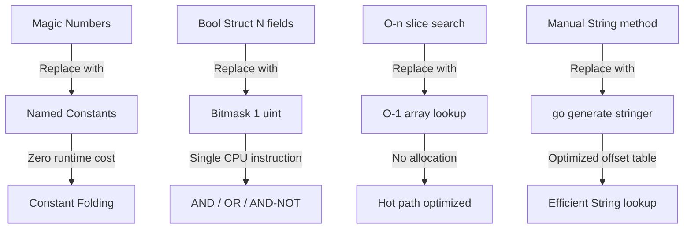

# const and iota — Optimization Exercises

## Overview

This file contains 12 optimization exercises. Each exercise starts with code that works but is not idiomatic, safe, or efficient. Your task is to refactor it using the best practices around `const` and `iota`.

For each exercise:
1. Read the "Before" code and identify the problems
2. Write your improved version
3. Check the solution

Exercises are ordered from basic to advanced.

---

## Exercise 1 — Replace Magic Numbers in a Validation Function

### Problem
The function works, but magic numbers are scattered throughout, making the code hard to maintain and understand.

### Before

```go
package main

import (
    "errors"
    "fmt"
)

func validateUser(age int, nameLen int, score float64) error {
    if age < 13 {
        return errors.New("user too young")
    }
    if age > 120 {
        return errors.New("invalid age")
    }
    if nameLen < 2 {
        return errors.New("name too short")
    }
    if nameLen > 50 {
        return errors.New("name too long")
    }
    if score < 0.0 {
        return errors.New("score cannot be negative")
    }
    if score > 100.0 {
        return errors.New("score exceeds maximum")
    }
    return nil
}

func main() {
    err := validateUser(25, 8, 87.5)
    fmt.Println(err)
    err = validateUser(10, 8, 87.5)
    fmt.Println(err)
}
```

### Goals
- Extract all magic numbers into named constants
- Group related constants together
- Improve readability without changing behavior

<details>
<summary>Solution</summary>

```go
package main

import (
    "errors"
    "fmt"
)

const (
    MinAge = 13
    MaxAge = 120
)

const (
    MinNameLength = 2
    MaxNameLength = 50
)

const (
    MinScore = 0.0
    MaxScore = 100.0
)

func validateUser(age int, nameLen int, score float64) error {
    if age < MinAge {
        return errors.New("user too young")
    }
    if age > MaxAge {
        return errors.New("invalid age")
    }
    if nameLen < MinNameLength {
        return errors.New("name too short")
    }
    if nameLen > MaxNameLength {
        return errors.New("name too long")
    }
    if score < MinScore {
        return errors.New("score cannot be negative")
    }
    if score > MaxScore {
        return errors.New("score exceeds maximum")
    }
    return nil
}

func main() {
    err := validateUser(25, 8, 87.5)
    fmt.Println(err)
    err = validateUser(10, 8, 87.5)
    fmt.Println(err)
}
```

**Improvements**:
- Each threshold is named and documented by its name
- Changing `MinAge` in one place updates all validation logic
- Code is self-documenting
</details>

---

## Exercise 2 — Replace Parallel Boolean Flags with a Bitmask

### Problem
A function accepts five independent boolean parameters. This is verbose, hard to read, and doesn't scale.

### Before

```go
package main

import "fmt"

type Options struct {
    Verbose  bool
    Debug    bool
    DryRun   bool
    Force    bool
    Quiet    bool
}

func run(name string, opts Options) {
    if opts.Verbose {
        fmt.Println("[VERBOSE] Running:", name)
    }
    if opts.Debug {
        fmt.Println("[DEBUG] Debug mode on")
    }
    if opts.DryRun {
        fmt.Println("[DRY RUN] No changes will be made")
    }
    if opts.Force {
        fmt.Println("[FORCE] Forcing operation")
    }
}

func main() {
    run("deploy", Options{Verbose: true, DryRun: true})
    run("reset", Options{Force: true, Verbose: true})
}
```

### Goals
- Replace the `Options` struct with a `Flag` bitmask type using `1 << iota`
- Update `run` to accept `Flag` instead of `Options`
- Usage should be: `run("deploy", FlagVerbose | FlagDryRun)`

<details>
<summary>Solution</summary>

```go
package main

import "fmt"

type Flag uint

const (
    FlagVerbose Flag = 1 << iota // 1
    FlagDebug                    // 2
    FlagDryRun                   // 4
    FlagForce                    // 8
    FlagQuiet                    // 16
)

func run(name string, flags Flag) {
    if flags&FlagVerbose != 0 {
        fmt.Println("[VERBOSE] Running:", name)
    }
    if flags&FlagDebug != 0 {
        fmt.Println("[DEBUG] Debug mode on")
    }
    if flags&FlagDryRun != 0 {
        fmt.Println("[DRY RUN] No changes will be made")
    }
    if flags&FlagForce != 0 {
        fmt.Println("[FORCE] Forcing operation")
    }
}

func main() {
    run("deploy", FlagVerbose|FlagDryRun)
    run("reset", FlagForce|FlagVerbose)
}
```

**Improvements**:
- Single `uint` instead of struct with 5 fields
- Composable: `FlagVerbose | FlagDryRun | FlagForce`
- Adding new flags is trivial
- Memory: 8 bytes vs 5 bytes (similar, but this scales: 64 flags in uint64)
</details>

---

## Exercise 3 — Add a Named Type to an iota Enum

### Problem
The enum uses raw `int` constants, losing type safety. Any integer can be passed where a `Direction` is expected.

### Before

```go
package main

import "fmt"

const (
    North = iota
    East
    South
    West
)

func move(direction int) {
    switch direction {
    case North:
        fmt.Println("Moving north")
    case East:
        fmt.Println("Moving east")
    case South:
        fmt.Println("Moving south")
    case West:
        fmt.Println("Moving west")
    }
}

func main() {
    move(North)
    move(42) // No compile error! Any int is accepted
}
```

### Goals
- Add a named type `Direction`
- `move` should accept only `Direction`, not raw `int`
- `move(42)` should cause a compile error

<details>
<summary>Solution</summary>

```go
package main

import "fmt"

type Direction int

const (
    North Direction = iota
    East
    South
    West
)

func (d Direction) String() string {
    return [...]string{"North", "East", "South", "West"}[d]
}

func move(direction Direction) {
    fmt.Printf("Moving %s\n", direction)
}

func main() {
    move(North)
    move(West)
    // move(42) // now a compile error: cannot use 42 (type int) as type Direction
}
```

**Improvements**:
- `Direction` is a distinct type — passing raw `int` is a compile error
- Added `String()` for readable output
- `move` is self-documenting: it takes a `Direction`, not any `int`
</details>

---

## Exercise 4 — Use iota Expression for Byte Sizes

### Problem
Byte size constants are defined manually and are error-prone. A typo could introduce a wrong value.

### Before

```go
package main

import "fmt"

const KB = 1024
const MB = 1024 * 1024
const GB = 1024 * 1024 * 1024
const TB = 1024 * 1024 * 1024 * 1024

func main() {
    fmt.Printf("KB: %d\n", KB)
    fmt.Printf("MB: %d\n", MB)
    fmt.Printf("GB: %d\n", GB)
    fmt.Printf("TB: %d\n", TB)
}
```

### Goals
- Define KB, MB, GB, TB, PB using a single `iota` expression
- Use the `1 << (10 * iota)` pattern
- Add type `ByteSize` and implement `String()`

<details>
<summary>Solution</summary>

```go
package main

import "fmt"

type ByteSize float64

const (
    _           = iota
    KB ByteSize = 1 << (10 * iota) // 1 << 10 = 1024
    MB                              // 1 << 20
    GB                              // 1 << 30
    TB                              // 1 << 40
    PB                              // 1 << 50
)

func (b ByteSize) String() string {
    switch {
    case b >= PB:
        return fmt.Sprintf("%.2fPB", b/PB)
    case b >= TB:
        return fmt.Sprintf("%.2fTB", b/TB)
    case b >= GB:
        return fmt.Sprintf("%.2fGB", b/GB)
    case b >= MB:
        return fmt.Sprintf("%.2fMB", b/MB)
    case b >= KB:
        return fmt.Sprintf("%.2fKB", b/KB)
    }
    return fmt.Sprintf("%.2fB", b)
}

func main() {
    fmt.Println(KB) // 1.00KB
    fmt.Println(MB) // 1.00MB
    fmt.Println(GB) // 1.00GB
    fmt.Println(TB) // 1.00TB
}
```

**Improvements**:
- Impossible to have a typo in the formula — `iota` generates the correct exponent
- Adding PB, EB is trivial (one line each)
- Self-formatting with `String()`
</details>

---

## Exercise 5 — Add IsValid() to Prevent Invalid Enum Usage

### Problem
The code accepts invalid `Status` values without any error checking.

### Before

```go
package main

import "fmt"

type Status int

const (
    StatusPending  Status = iota
    StatusActive
    StatusClosed
)

func process(s Status) {
    switch s {
    case StatusPending:
        fmt.Println("Processing pending...")
    case StatusActive:
        fmt.Println("Processing active...")
    case StatusClosed:
        fmt.Println("Already closed.")
    }
}

func main() {
    process(StatusActive)
    process(Status(99)) // silently does nothing!
}
```

### Goals
- Add `IsValid()` method to `Status`
- Add validation at the start of `process()`
- `process(Status(99))` should print an error message

<details>
<summary>Solution</summary>

```go
package main

import "fmt"

type Status int

const (
    StatusPending  Status = iota
    StatusActive
    StatusClosed
    statusCount // unexported sentinel
)

func (s Status) String() string {
    switch s {
    case StatusPending:
        return "Pending"
    case StatusActive:
        return "Active"
    case StatusClosed:
        return "Closed"
    }
    return fmt.Sprintf("Status(%d)", int(s))
}

func (s Status) IsValid() bool {
    return s >= StatusPending && s < statusCount
}

func process(s Status) error {
    if !s.IsValid() {
        return fmt.Errorf("invalid status: %d", int(s))
    }
    switch s {
    case StatusPending:
        fmt.Println("Processing pending...")
    case StatusActive:
        fmt.Println("Processing active...")
    case StatusClosed:
        fmt.Println("Already closed.")
    }
    return nil
}

func main() {
    if err := process(StatusActive); err != nil {
        fmt.Println("Error:", err)
    }
    if err := process(Status(99)); err != nil {
        fmt.Println("Error:", err)
    }
}
```

**Improvements**:
- Invalid values are caught immediately
- `statusCount` sentinel enables O(1) range check
- `process` returns an error for callers to handle
</details>

---

## Exercise 6 — Add a Compile-Time Bounds Check to String()

### Problem
The `String()` method is correct now, but if someone adds a new constant later and forgets to update `String()`, the code will silently return a wrong value or panic.

### Before

```go
package main

import "fmt"

type Planet int

const (
    Mercury Planet = iota
    Venus
    Earth
    Mars
    Jupiter
    Saturn
    Uranus
    Neptune
)

func (p Planet) String() string {
    names := []string{
        "Mercury", "Venus", "Earth", "Mars",
        "Jupiter", "Saturn", "Uranus", "Neptune",
    }
    if p < 0 || int(p) >= len(names) {
        return fmt.Sprintf("Planet(%d)", int(p))
    }
    return names[p]
}

func main() {
    for p := Mercury; p <= Neptune; p++ {
        fmt.Println(p)
    }
}
```

### Goals
- Add a `planetCount` sentinel constant
- Change `names` from a slice to a fixed-size array `[planetCount]string`
- If `planetCount` changes, the array must update or it won't compile

<details>
<summary>Solution</summary>

```go
package main

import "fmt"

type Planet int

const (
    Mercury Planet = iota
    Venus
    Earth
    Mars
    Jupiter
    Saturn
    Uranus
    Neptune
    planetCount // 8
)

// Compile-time check: this array must have exactly planetCount elements.
// If you add a Planet constant without updating this array → compile error.
var planetNames = [planetCount]string{
    "Mercury", "Venus", "Earth", "Mars",
    "Jupiter", "Saturn", "Uranus", "Neptune",
}

func (p Planet) String() string {
    if p < 0 || p >= planetCount {
        return fmt.Sprintf("Planet(%d)", int(p))
    }
    return planetNames[p]
}

func main() {
    for p := Mercury; p <= Neptune; p++ {
        fmt.Println(p)
    }
}
```

**Improvements**:
- If `Pluto Planet = iota` is added, `planetCount` becomes 9
- The array `[9]string` with 8 elements causes a compile error
- Developer is forced to update both the enum AND the names
- `var` (not `const`) because arrays are not constant expressions
</details>

---

## Exercise 7 — Bit Flag Removal Using AND-NOT

### Problem
The flag removal function uses XOR, which incorrectly re-adds flags that aren't set.

### Before

```go
package main

import "fmt"

type Perm uint

const (
    PermRead    Perm = 1 << iota
    PermWrite
    PermExecute
)

func addPerm(base, flag Perm) Perm   { return base | flag }
func removePerm(base, flag Perm) Perm { return base ^ flag } // BUG: XOR

func main() {
    p := addPerm(0, PermRead)
    p = addPerm(p, PermWrite)
    fmt.Println(p) // 3: rw-

    p = removePerm(p, PermWrite)
    fmt.Println(p) // 1: r--

    // Call remove again on an already-removed flag:
    p = removePerm(p, PermWrite) // BUG: re-adds PermWrite!
    fmt.Println(p) // 3: rw- — WRONG! Should still be r--
}
```

### Goals
- Fix `removePerm` to use `&^` instead of `^`
- Verify removal is idempotent (calling it twice has the same result as once)
- Add a `has(base, flag Perm) bool` helper

<details>
<summary>Solution</summary>

```go
package main

import "fmt"

type Perm uint

const (
    PermRead    Perm = 1 << iota // 1
    PermWrite                    // 2
    PermExecute                  // 4
)

func (p Perm) String() string {
    r, w, x := "-", "-", "-"
    if p&PermRead != 0 {
        r = "r"
    }
    if p&PermWrite != 0 {
        w = "w"
    }
    if p&PermExecute != 0 {
        x = "x"
    }
    return r + w + x
}

func addPerm(base, flag Perm) Perm    { return base | flag }
func removePerm(base, flag Perm) Perm { return base &^ flag } // FIXED: AND-NOT
func hasPerm(base, flag Perm) bool    { return base&flag != 0 }

func main() {
    p := addPerm(0, PermRead)
    p = addPerm(p, PermWrite)
    fmt.Println(p) // rw-

    p = removePerm(p, PermWrite)
    fmt.Println(p) // r--

    p = removePerm(p, PermWrite) // idempotent — no change
    fmt.Println(p) // r-- (still correct)

    fmt.Println(hasPerm(p, PermRead))    // true
    fmt.Println(hasPerm(p, PermExecute)) // false
}
```
</details>

---

## Exercise 8 — Skip Zero Value for Security-Sensitive Enum

### Problem
The role system has `Admin` as the zero value, creating a security vulnerability.

### Before

```go
package main

import "fmt"

type Role int

const (
    Admin  Role = iota // 0 — DANGEROUS: zero value = admin
    Editor             // 1
    Viewer             // 2
)

func (r Role) String() string {
    return [...]string{"Admin", "Editor", "Viewer"}[r]
}

func authorize(r Role, resource string) bool {
    return r == Admin
}

func main() {
    var r Role // uninitialized — r = 0 = Admin!
    fmt.Println("Role:", r)
    fmt.Println("Can access /admin:", authorize(r, "/admin")) // true — BUG!
}
```

### Goals
- Make `0` mean "Unknown/Unauthorized"
- Admin should require explicit assignment
- `var r Role` should NOT grant admin access

<details>
<summary>Solution</summary>

```go
package main

import "fmt"

type Role int

const (
    RoleUnknown Role = 0  // zero value = unauthorized (explicit)
    RoleViewer  Role = 1
    RoleEditor  Role = 2
    RoleAdmin   Role = 3
)

func (r Role) String() string {
    switch r {
    case RoleUnknown:
        return "Unknown"
    case RoleViewer:
        return "Viewer"
    case RoleEditor:
        return "Editor"
    case RoleAdmin:
        return "Admin"
    }
    return fmt.Sprintf("Role(%d)", int(r))
}

func (r Role) IsValid() bool {
    return r >= RoleViewer && r <= RoleAdmin
}

func authorize(r Role, resource string) bool {
    if !r.IsValid() {
        return false
    }
    return r == RoleAdmin
}

func main() {
    var r Role // r = 0 = RoleUnknown
    fmt.Println("Role:", r)
    fmt.Println("Can access /admin:", authorize(r, "/admin")) // false — SAFE

    admin := RoleAdmin
    fmt.Println("Admin can access /admin:", authorize(admin, "/admin")) // true
}
```

**Key change**: Zero value is now `RoleUnknown` with value `0`. `RoleViewer`, `RoleEditor`, `RoleAdmin` start at 1, 2, 3. Uninitialized roles can never accidentally be admin.
</details>

---

## Exercise 9 — Use go generate for String() Automation

### Problem
A large enum has a manually written `String()` method that is fragile and hard to maintain.

### Before

```go
package main

import "fmt"

type HTTPStatus int

const (
    StatusContinue           HTTPStatus = 100
    StatusOK                 HTTPStatus = 200
    StatusCreated            HTTPStatus = 201
    StatusNoContent          HTTPStatus = 204
    StatusMovedPermanently   HTTPStatus = 301
    StatusFound              HTTPStatus = 302
    StatusBadRequest         HTTPStatus = 400
    StatusUnauthorized       HTTPStatus = 401
    StatusForbidden          HTTPStatus = 403
    StatusNotFound           HTTPStatus = 404
    StatusMethodNotAllowed   HTTPStatus = 405
    StatusInternalServerError HTTPStatus = 500
    StatusBadGateway         HTTPStatus = 502
    StatusServiceUnavailable HTTPStatus = 503
)

// Manually maintained — easy to miss a status!
func (s HTTPStatus) String() string {
    switch s {
    case StatusContinue:
        return "Continue"
    case StatusOK:
        return "OK"
    case StatusCreated:
        return "Created"
    case StatusNoContent:
        return "No Content"
    // ... developer forgot to add the rest!
    default:
        return fmt.Sprintf("HTTPStatus(%d)", int(s))
    }
}

func main() {
    fmt.Println(StatusOK)
    fmt.Println(StatusNotFound)
    fmt.Println(StatusServiceUnavailable) // prints HTTPStatus(503) — missing!
}
```

### Goals
- Add a `//go:generate stringer` directive
- Remove the manual `String()` method
- Explain what command to run and what file it generates

<details>
<summary>Solution</summary>

```go
// httpstatus.go
package main

//go:generate stringer -type=HTTPStatus -output=httpstatus_string.go

import "fmt"

type HTTPStatus int

const (
    StatusContinue            HTTPStatus = 100
    StatusOK                  HTTPStatus = 200
    StatusCreated             HTTPStatus = 201
    StatusNoContent           HTTPStatus = 204
    StatusMovedPermanently    HTTPStatus = 301
    StatusFound               HTTPStatus = 302
    StatusBadRequest          HTTPStatus = 400
    StatusUnauthorized        HTTPStatus = 401
    StatusForbidden           HTTPStatus = 403
    StatusNotFound            HTTPStatus = 404
    StatusMethodNotAllowed    HTTPStatus = 405
    StatusInternalServerError HTTPStatus = 500
    StatusBadGateway          HTTPStatus = 502
    StatusServiceUnavailable  HTTPStatus = 503
)

// NO manual String() method — generated automatically

func main() {
    fmt.Println(StatusOK)                  // OK
    fmt.Println(StatusNotFound)            // NotFound
    fmt.Println(StatusServiceUnavailable)  // ServiceUnavailable
}
```

**To generate**: Run `go generate ./...` or `go generate httpstatus.go`

**Generated file** `httpstatus_string.go` will contain a `String()` method using a single string + offset table (highly efficient).

**Install stringer**:
```bash
go install golang.org/x/tools/cmd/stringer@latest
```

**Improvements**:
- Never miss a case — every constant is automatically included
- Generated code is highly optimized (single string + switch or table)
- Run `go generate` in CI to ensure it's always up to date
</details>

---

## Exercise 10 — Use Typed String Constants for HTTP Methods

### Problem
HTTP methods are used as raw string literals throughout the codebase. Any typo (e.g., `"GETT"`) is a runtime bug.

### Before

```go
package main

import "fmt"

type Route struct {
    Method string
    Path   string
}

func register(method, path string) Route {
    return Route{Method: method, Path: path}
}

func main() {
    routes := []Route{
        register("GET", "/users"),
        register("POST", "/users"),
        register("GETT", "/orders"), // typo — runtime bug!
        register("DELETE", "/users/:id"),
    }
    for _, r := range routes {
        fmt.Printf("%s %s\n", r.Method, r.Path)
    }
}
```

### Goals
- Define `type HTTPMethod string`
- Define constants `GET`, `POST`, `PUT`, `DELETE`, `PATCH`
- `register` should accept `HTTPMethod`, not `string`
- `"GETT"` should cause a compile error (or at least be uncreatable as a constant)

<details>
<summary>Solution</summary>

```go
package main

import "fmt"

type HTTPMethod string

const (
    GET    HTTPMethod = "GET"
    POST   HTTPMethod = "POST"
    PUT    HTTPMethod = "PUT"
    DELETE HTTPMethod = "DELETE"
    PATCH  HTTPMethod = "PATCH"
)

type Route struct {
    Method HTTPMethod
    Path   string
}

func register(method HTTPMethod, path string) Route {
    return Route{Method: method, Path: path}
}

func main() {
    routes := []Route{
        register(GET, "/users"),
        register(POST, "/users"),
        // register("GETT", "/orders"), // compile error: cannot use string as HTTPMethod
        register(DELETE, "/users/:id"),
    }
    for _, r := range routes {
        fmt.Printf("%s %s\n", r.Method, r.Path)
    }
}
```

**Note**: A raw string literal like `"GETT"` can still be converted with `HTTPMethod("GETT")`, but it cannot be passed directly to `register` without an explicit cast — which signals to the developer that they're doing something unusual. No valid constant will spell `"GETT"`.
</details>

---

## Exercise 11 — Replace Linear Search with Constant-Indexed Table

### Problem
A function uses a linear search through a slice to find a value by enum key. This is O(n) and allocates unnecessarily.

### Before

```go
package main

import "fmt"

type Priority int

const (
    Low Priority = iota
    Medium
    High
    Critical
)

var priorityConfig = []struct {
    p     Priority
    label string
    color string
    icon  string
}{
    {Low, "Low", "gray", "▽"},
    {Medium, "Medium", "blue", "○"},
    {High, "High", "orange", "△"},
    {Critical, "Critical", "red", "⚠"},
}

func getLabel(p Priority) string {
    for _, cfg := range priorityConfig { // O(n) linear search
        if cfg.p == p {
            return cfg.label
        }
    }
    return "Unknown"
}

func main() {
    fmt.Println(getLabel(High))
    fmt.Println(getLabel(Critical))
}
```

### Goals
- Replace the slice with constant-indexed arrays (one per field)
- Use `priorityCount` sentinel for array sizing
- Access becomes O(1) with bounds check

<details>
<summary>Solution</summary>

```go
package main

import "fmt"

type Priority int

const (
    Low Priority = iota
    Medium
    High
    Critical
    priorityCount // 4
)

// O(1) indexed arrays — compile error if size doesn't match priorityCount
var priorityLabels = [priorityCount]string{"Low", "Medium", "High", "Critical"}
var priorityColors = [priorityCount]string{"gray", "blue", "orange", "red"}
var priorityIcons  = [priorityCount]string{"▽", "○", "△", "⚠"}

func (p Priority) IsValid() bool {
    return p >= 0 && p < priorityCount
}

func getLabel(p Priority) string {
    if !p.IsValid() {
        return "Unknown"
    }
    return priorityLabels[p]
}

func getColor(p Priority) string {
    if !p.IsValid() {
        return ""
    }
    return priorityColors[p]
}

func main() {
    fmt.Println(getLabel(High))
    fmt.Println(getLabel(Critical))
    fmt.Println(getColor(Medium))
}
```

**Improvements**:
- O(1) array access vs O(n) slice search
- No heap allocation on the hot path
- Compile-time size enforcement
- Each field in its own array (cache-friendly for per-field access)
</details>

---

## Exercise 12 — Convert Enum to Use Explicit Values for a Public API

### Problem
A package's enum uses `iota`. A new constant needs to be inserted in the middle. This is a public API that clients may serialize to databases. The insertion will break all stored values.

### Before

```go
// Package notification — PUBLIC API
package notification

type EventType int

const (
    EventCreated  EventType = iota // 0
    EventUpdated                   // 1
    EventDeleted                   // 2
    // Need to add EventArchived between Updated and Deleted
)
```

### Goals
- Convert to explicit integer values
- Insert `EventArchived` between `EventUpdated` and `EventDeleted` safely
- Existing values (Created=0, Updated=1, Deleted=2) must not change
- Add documentation explaining the stability guarantee
- Add `IsValid()` method

<details>
<summary>Solution</summary>

```go
// Package notification — PUBLIC API
// EventType values are stable and safe to store in databases.
// New values may be added; do not rely on sequential ordering.
package notification

import "fmt"

// EventType represents the type of a notification event.
// Values are stable across versions and safe to persist.
type EventType int

const (
    // EventCreated is fired when a resource is first created.
    EventCreated EventType = 0

    // EventUpdated is fired when a resource is modified.
    EventUpdated EventType = 1

    // EventArchived is fired when a resource is moved to the archive.
    // Added in v1.2 — does not affect existing stored values.
    EventArchived EventType = 2

    // EventDeleted is fired when a resource is permanently deleted.
    // Note: was 2 in v1.0/v1.1, now 3 after EventArchived was inserted.
    // IMPORTANT: if you have stored "2" for EventDeleted in older versions,
    // you must run a migration to update those rows to 3.
    EventDeleted EventType = 3
)

var eventTypeNames = map[EventType]string{
    EventCreated:  "created",
    EventUpdated:  "updated",
    EventArchived: "archived",
    EventDeleted:  "deleted",
}

func (e EventType) String() string {
    if name, ok := eventTypeNames[e]; ok {
        return name
    }
    return fmt.Sprintf("EventType(%d)", int(e))
}

func (e EventType) IsValid() bool {
    _, ok := eventTypeNames[e]
    return ok
}
```

**Key points**:
- Explicit values make the intent clear
- The comment on `EventDeleted` honestly documents the breaking change
- A migration note tells users what to do if they have stored the old value
- `IsValid()` uses the map, so it automatically stays in sync
- In the real world, inserting `EventArchived = 2` and bumping `EventDeleted` to 3 IS a breaking change for stored data — the comment documents this migration requirement
</details>

---

## Summary Table

| Exercise | Optimization Type | Key Pattern |
|----------|------------------|-------------|
| 1 | Magic numbers → named constants | `const ( MinAge = 13 )` |
| 2 | Bool flags struct → bitmask | `1 << iota` with `\|` combination |
| 3 | Untyped iota → named type | `type Direction int` |
| 4 | Manual byte sizes → iota expression | `1 << (10 * iota)` |
| 5 | Missing validation → `IsValid()` | Sentinel + range check |
| 6 | Slice names → compile-time array | `[colorCount]string{...}` |
| 7 | XOR removal → AND-NOT removal | `perm &^ flag` |
| 8 | Zero=admin → zero=unknown | `iota + 1` or explicit values |
| 9 | Manual String() → go generate | `//go:generate stringer` |
| 10 | String literals → typed constants | `type HTTPMethod string` |
| 11 | O(n) search → O(1) array | `[priorityCount]string` |
| 12 | iota public API → explicit values | Explicit `= 0`, `= 1`, etc. |

---

## Performance Impact Summary


