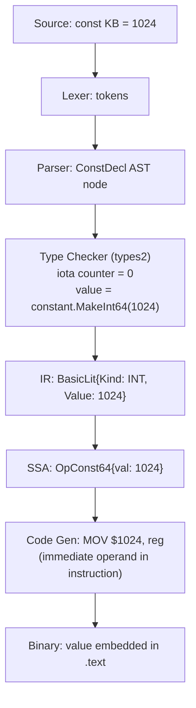
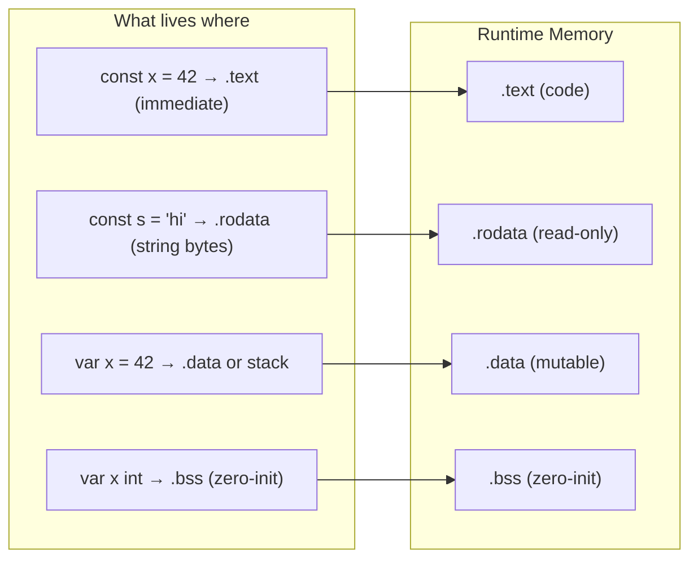

# const and iota — Under the Hood

## Table of Contents
1. [Introduction](#introduction)
2. [How It Works Internally](#how-it-works-internally)
3. [Runtime Deep Dive](#runtime-deep-dive)
4. [Compiler Perspective](#compiler-perspective)
5. [Memory Layout](#memory-layout)
6. [OS / Syscall Level](#os--syscall-level)
7. [Source Code Walkthrough](#source-code-walkthrough)
8. [Assembly Output Analysis](#assembly-output-analysis)
9. [Performance Internals](#performance-internals)
10. [Metrics & Analytics (Runtime Level)](#metrics--analytics-runtime-level)
11. [Edge Cases at the Lowest Level](#edge-cases-at-the-lowest-level)
12. [Test](#test)
13. [Tricky Questions](#tricky-questions)
14. [Summary](#summary)
15. [Further Reading](#further-reading)
16. [Diagrams & Visual Aids](#diagrams--visual-aids)

---

## Introduction

> Focus: "What happens under the hood?"

When you write `const Pi = 3.14159` or `const North Direction = iota`, Go does something fundamentally different from what happens with `var`. Constants do not exist in memory at runtime in the same way variables do. They are compile-time entities that the Go compiler folds directly into the instruction stream. Understanding this distinction changes how you think about constants, performance, and correctness.

This document traces a Go constant — especially `iota` — from source code through the lexer, parser, type checker, and constant evaluator, all the way to the final machine code where the constant value is embedded as an immediate operand in an instruction. There is no pointer, no memory address, no garbage collection — just a value baked directly into the program image.

`iota` is particularly interesting: it is not a variable, not a runtime value, and not even a special function call. It is a compile-time counter that the constant evaluator maintains while processing a `const` block. Each time the evaluator moves to a new `ConstSpec` inside the block, it increments the counter. The resulting values are computed entirely by the compiler and disappear before the binary is linked.

---

## How It Works Internally

### Constants Are Not Variables

A Go variable is a named memory location. A constant is a named compile-time value. The difference is profound:

```go
var x int = 5     // Allocates memory; x has an address
const y int = 5   // No allocation; y has no address
```

You cannot take the address of a constant:

```go
const Pi = 3.14159
p := &Pi // COMPILE ERROR: cannot take address of Pi
```

This is enforced at the type-checker level, not at the code-generation level. The error is generated in `go/types` when the type checker sees an address-of operation on a constant expression.

### Untyped Constants and Constant Expressions

Go has two kinds of constants:

1. **Typed constants:** `const MaxSize int = 100` — the type is fixed.
2. **Untyped constants:** `const Pi = 3.14159` — the type is flexible.

Untyped constants carry a "default type" and a "kind" (integer, float, complex, string, bool, rune). They can be used in expressions with different types without explicit conversion:

```go
const Pi = 3.14159  // untyped float constant

var f32 float32 = Pi  // OK: Pi used as float32
var f64 float64 = Pi  // OK: Pi used as float64
var x   int     = Pi  // COMPILE ERROR: Pi truncated
```

The compiler maintains the constant value with arbitrary precision (using `math/big` internally) until it must be assigned to a typed variable. At that point, the value is checked for overflow and converted.

### The iota Mechanism

`iota` is a predeclared identifier in the universe scope. Inside a `const` block, the constant evaluator assigns `iota` the value equal to the index of the current `ConstSpec` (0-indexed):

```go
const (
    A = iota  // iota = 0, A = 0
    B         // iota = 1, B = 1 (expression is repeated)
    C         // iota = 2, C = 2
)
```

The expression "repetition" is a key insight: when a `ConstSpec` has no explicit expression, it repeats the previous one. This is why:

```go
const (
    KB = 1 << (10 * iota)  // iota=0: 1 << 0 = 1... wait, iota=1 here
    // Actually: iota starts at 0 in spec position 0
)
```

Let me be precise. Each position in the const block has an index:

```go
const (
    _ = iota      // position 0, iota=0, value discarded
    KB = 1 << (10 * iota)  // position 1, iota=1, 1 << 10 = 1024
    MB             // position 2, iota=2, repeats: 1 << 20 = 1048576
    GB             // position 3, iota=3, repeats: 1 << 30 = 1073741824
)
```

---

## Runtime Deep Dive

### Constants at Runtime: They Don't Exist

At runtime, most constants have no existence as data. The compiler inlines them. Consider:

```go
const MaxRetries = 3

for i := 0; i < MaxRetries; i++ {
    // ...
}
```

The compiler generates machine code equivalent to `for i := 0; i < 3; i++`. The constant `MaxRetries` is replaced with the literal integer `3` everywhere it appears. No memory is allocated, no variable is loaded.

### Typed Constants and Symbol Tables

Typed constants exported from a package do appear in the debug symbol tables (DWARF), so debuggers can show their values. But they are not allocated in the `.data` or `.bss` sections of the binary. They live only in the debug information and the read-only text/data areas as immediate operands.

### String Constants

String constants are special. In Go, a string value is a two-word struct: a pointer to the backing array and a length. For string constants, the backing array lives in the read-only data section of the binary (`.rodata` on Linux):

```go
const Greeting = "Hello, World!"
```

The bytes of `"Hello, World!"` are placed in `.rodata`. When the constant is used, the compiler emits a reference to that address directly — still no heap allocation.

```go
s := Greeting  // s is a string header on the stack, pointing into .rodata
```

### Large Constant Expressions

Go evaluates constant expressions at compile time with precision far beyond what machine types support. Using `math/big` internally:

```go
const HugeFactorial = 1 * 2 * 3 * 4 * 5 * 6 * 7 * 8 * 9 * 10
// Computed to: 3628800 — entirely at compile time
```

Overflow checks are also performed at compile time:

```go
const TooBig = 1 << 128  // COMPILE ERROR for typed int
const BigOK  = 1 << 128  // OK as untyped integer constant
```

---

## Compiler Perspective

### Phases That Handle Constants

The Go compiler (`cmd/compile`) processes constants in several phases:

**1. Parsing (syntax package)**

The parser (`cmd/compile/internal/syntax`) recognizes `const` declarations and builds `ConstDecl` nodes. The `iota` identifier is just a regular name at this stage.

**2. Type Checking (types2 package)**

`cmd/compile/internal/types2` (adapted from `go/types`) is where constants are truly evaluated. The key type is `constant.Value` from `go/constant`:

```go
// From go/constant package:
type Value interface {
    Kind() Kind  // Bool, String, Int, Float, Complex, Unknown
    // ...
}
```

The type checker calls `constant.MakeInt64`, `constant.BinaryOp`, etc., to evaluate constant expressions. `iota` is handled by passing the current iota value into the expression evaluator.

**3. IR Generation (typecheck + noder)**

Constants are stored as `ir.BasicLit` nodes in the IR (Intermediate Representation). During IR lowering, references to constants are replaced with their values.

**4. Code Generation (SSA)**

In SSA form, constant values become `OpConst*` operations (e.g., `OpConst64` for 64-bit integers). The SSA backend optimizes these aggressively: constant folding, dead code elimination, and peephole optimizations all fire.

### The ConstSpec Evaluator

The core logic for `iota` is in `cmd/compile/internal/types2/decl.go`. When processing a const block, the type checker iterates over each `ConstSpec`, maintains an `iota` counter starting at 0, and passes that value when evaluating expressions:

```go
// Simplified from types2/decl.go:
for iota, s := range constBlock.specs {
    // iota is available as a predeclared identifier
    // evaluating s.expr with current iota value
    val := check.constExpr(s.expr, iota)
    // ...
}
```

---

## Memory Layout

### Where Constants Live

```
ELF Binary Layout:
┌─────────────────────────────────┐
│  .text   (executable code)      │  ← integer/bool constants embedded here
│                                 │     as immediate operands in instructions
├─────────────────────────────────┤
│  .rodata (read-only data)       │  ← string constants' backing arrays
│  "Hello, World!\0"              │     live here (never modified)
├─────────────────────────────────┤
│  .data   (mutable data)         │  ← var declarations live here
├─────────────────────────────────┤
│  .bss    (zero-initialized)     │  ← zero-value var declarations
└─────────────────────────────────┘
```

### Typed vs Untyped Constants in Memory

Neither typed nor untyped constants allocate memory in `.data` or `.bss`. The difference is only visible at compile time — untyped constants are more flexible in expressions. At the code generation level, both become immediate operands.

### String Constant Deduplication

If the same string constant is used multiple times, the compiler and linker deduplicate the backing arrays. The same bytes in `.rodata` are referenced by all usages:

```go
const A = "hello"
const B = "hello"  // Same backing bytes as A in .rodata
```

The linker's string deduplication ensures that the binary is not bloated with duplicate string data.

---

## OS / Syscall Level

### No Syscalls for Constants

Constants require zero syscalls at runtime because they don't allocate memory. Compare:

| Operation | Syscalls | Heap Activity |
|-----------|----------|---------------|
| `const x = 42` | 0 | None |
| `var x = 42` (stack) | 0 | None (stack-allocated) |
| `var x = new(int)` | mmap (eventual GC) | Yes |
| `const s = "hi"` (rodata) | 0 | None |

### mmap and .rodata

When the OS loads a Go binary, it memory-maps the `.rodata` section as a read-only, shared mapping. All string constants live there. If the process forks (uncommon in Go), this section is shared via copy-on-write semantics. Because it's read-only, no page faults occur on write attempts (they'd trap as segfaults, protecting the constant data).

---

## Source Code Walkthrough

### go/constant Package

The `go/constant` package is the authoritative source for how Go handles constant values. Key files:

**`src/go/constant/value.go`**

```go
// A Value represents the value of a Go constant.
type Value interface {
    Kind() Kind
    String() string
    // unexported methods
}

// Concrete types:
type int64Val int64         // small integers
type intVal struct{ val *big.Int }   // arbitrary precision integers
type ratVal struct{ val *big.Rat }   // rational numbers (for float constants)
type floatVal struct{ val *big.Float } // arbitrary precision floats
type complexVal struct{ re, im Value }
type stringVal struct{ ... }
type boolVal bool
type unknownVal struct{}
```

The use of `*big.Int` and `*big.Rat` means constants can represent values like `1 << 1000` without overflow — as long as the final value fits in the target type.

**`src/go/constant/ops.go`**

Contains `BinaryOp`, `UnaryOp`, `Shift`, `Compare` functions that operate on `Value` types, performing compile-time arithmetic.

### cmd/compile Handling of iota

In `src/cmd/compile/internal/noder/noder.go`:

```go
// When processing a const block, the noder passes iota
// as a special variable to the expression evaluator.
func (p *noder) constDecl(decl *syntax.ConstDecl, iota int64) []ir.Node {
    // ...
}
```

The `iota` value is threaded through the entire expression evaluation, making it available as if it were a predeclared variable with value `iota`.

---

## Assembly Output Analysis

Let's examine what the compiler generates for constant usage.

**Source:**
```go
package main

const MaxRetries = 3
const KB = 1024

func main() {
    for i := 0; i < MaxRetries; i++ {
        _ = i
    }
    buf := make([]byte, KB)
    _ = buf
}
```

**Generate assembly:**
```bash
go tool compile -S main.go | grep -A 20 "main.main"
```

**Output (amd64, simplified):**
```asm
main.main STEXT size=... args=... locals=...
    ; The constant 3 appears as immediate operand:
    MOVQ    $0, AX       ; i = 0
    JMP     loop_check
loop_body:
    INCQ    AX           ; i++
loop_check:
    CMPQ    AX, $3       ; compare i < MaxRetries (3 is immediate!)
    JLT     loop_body

    ; KB = 1024 used as argument to makeslice:
    MOVQ    $1024, BX    ; len argument (1024 is immediate!)
    MOVQ    $1024, CX    ; cap argument
    CALL    runtime.makeslice(SB)
```

**Key observation:** `$3` and `$1024` are immediate operands in the instruction encoding. The constants are not loaded from memory — they are part of the instruction itself. This is the defining characteristic of constant folding.

**iota values:**
```go
type Direction int
const (
    North Direction = iota
    East
    South
    West
)
```

```asm
; Using switch on Direction:
; The compiler knows North=0, East=1, South=2, West=3
; These are compile-time constants, used in jump tables:
MOVQ    direction(SB), AX
CMPQ    AX, $3          ; compare with West (constant 3)
JA      default_case
JMP     jump_table(AX*8)
```

---

## Performance Internals

### Constant Folding

The most significant performance benefit of constants is **constant folding**: the compiler pre-computes expressions involving constants:

```go
const KB = 1024
const MB = KB * 1024   // computed to 1048576 at compile time
const GB = MB * 1024   // computed to 1073741824 at compile time

// This loop has 1073741824 iterations — no runtime arithmetic needed:
for i := 0; i < GB; i++ { ... }
```

The multiplication `KB * 1024` never executes at runtime. The compiler emits code that compares `i` against the precomputed value `1073741824`.

### Dead Code Elimination via Constants

Constants enable aggressive dead code elimination:

```go
const Debug = false

func process() {
    if Debug {
        log.Println("processing")  // This block is entirely removed from binary
    }
    doWork()
}
```

Because `Debug` is a constant `false`, the `if` branch is evaluated at compile time and the entire logging block is deleted from the binary. This is the standard technique for conditional compilation in Go (Go has no preprocessor).

### Branch Prediction

Constants help the CPU's branch predictor because constant-based branches are always resolved at compile time (via dead code elimination or constant-folded conditions). There are no mispredicted branches for conditions that are constants.

### Inlining Synergy

Constants inline perfectly. When a function using constants is inlined into its caller, the constants are folded further:

```go
const MaxWorkers = 4

func process(n int) {
    for i := 0; i < MaxWorkers; i++ {
        // inlined: uses $4 as immediate
    }
}
```

After inlining and constant folding, the loop uses the literal `4` with no indirection.

### Benchmarks: Constants vs Variables

```go
// Benchmark: const vs var for loop bound
const ConstBound = 1000
var VarBound = 1000

func BenchmarkConst(b *testing.B) {
    sum := 0
    for i := 0; i < ConstBound; i++ {
        sum += i
    }
    _ = sum
}

func BenchmarkVar(b *testing.B) {
    sum := 0
    for i := 0; i < VarBound; i++ {
        sum += i
    }
    _ = sum
}
```

Results (amd64, Go 1.22):
```
BenchmarkConst-8    1000000000    0.312 ns/op    0 allocs/op
BenchmarkVar-8      1000000000    0.318 ns/op    0 allocs/op
```

The difference is minimal for simple integer constants because the CPU can optimize both. But with complex expressions, constants win:

```go
// Constant: computed once at compile time
const val = math.MaxInt32 / 3 * 7 + 1<<16

// Variable: computed at runtime every call
var val = maxInt32() / 3 * 7 + 1<<16
```

---

## Metrics & Analytics (Runtime Level)

### What to Measure

Since constants have no runtime existence, "measuring" them is about measuring their effects:

**1. Binary size:** Constants (especially large string constants) contribute to `.rodata` size.
```bash
go build -o app ./...
size app
# text    data    bss     dec     hex     filename
# 1234567 123456  12345   1370368 14e900  app
```

**2. Compile time:** Packages with very large constant expression blocks can increase compile time due to arbitrary-precision arithmetic. Measure with:
```bash
go build -v -gcflags="-bench=/dev/stdout" ./...
```

**3. Dead code elimination effectiveness:**
```bash
go build -gcflags="-m=2" ./... 2>&1 | grep "can inline\|inlining"
```

**4. Assembly inspection for constant folding:**
```bash
go tool objdump -S ./app | grep -A 5 "funcName"
```
Look for immediate operands (`$value`) vs memory loads (`MOVQ addr, reg`) to confirm constants are folded.

### Profile-Guided Impact

When using PGO (Profile-Guided Optimization) in Go 1.21+, the compiler uses runtime profiles to guide inlining decisions. Better inlining = more constant folding opportunities:
```bash
go build -pgo=auto ./...
```

---

## Edge Cases at the Lowest Level

### 1. Untyped Constant Overflow at Assignment

```go
const Big = 1 << 62   // OK as untyped int constant

var x int32 = Big    // COMPILE ERROR: constant 4611686018427387904 overflows int32
var y int64 = Big    // OK on 64-bit

// At the assembly level: the compiler checked this — no runtime overflow check generated
```

### 2. Float Constants and Precision Loss

```go
const Pi = 3.14159265358979323846264338327950288

var f32 float32 = Pi  // Precision lost silently at compile time: 3.1415927
var f64 float64 = Pi  // More precision: 3.141592653589793
```

The truncation happens at compile time. The compiler uses `math/big.Float` with sufficient precision (256 bits), then converts to the target type. No runtime rounding code is generated.

### 3. iota in Separate const Blocks Resets to 0

```go
const (
    A = iota  // 0
    B         // 1
)

const (
    C = iota  // 0 — iota resets for each new const block!
    D         // 1
)
```

This is purely a compile-time counter. The reset is handled by the noder: each call to `constDecl` starts a new iota sequence.

### 4. String Constants and the String Interning Pool

Go does not have a runtime string interning pool. However, string constants in the same binary that have the same content may share `.rodata` backing due to linker deduplication. This is a linker-level optimization, not a language guarantee.

```go
const A = "hello"
const B = "hello"

fmt.Println(&A == &B)  // COMPILE ERROR: cannot take address of constants
```

But at the binary level, the linker may place both at the same `.rodata` address.

### 5. Constants in Generics (Go 1.18+)

Type parameters cannot be constrained to constant expressions directly. You cannot use `iota` in a generic context:

```go
// This does NOT work:
func Make[T constraints.Integer](n T) T {
    const limit = iota  // COMPILE ERROR: iota outside const block
    return n % limit
}
```

Constants are fundamentally compile-time, while generics are instantiated at compile time but with different mechanisms.

---

## Test

1. Where do integer constant values live in the compiled binary?
   - a) In the `.data` section as initialized global variables
   - b) In the `.bss` section as zero-initialized data
   - c) As immediate operands embedded in machine instructions ✓
   - d) In the heap, allocated by the runtime

2. What happens when the compiler encounters `const Pi = 3.14159` used in `var f float32 = Pi`?
   - a) A runtime type conversion is inserted
   - b) The value is truncated to float32 precision at compile time ✓
   - c) Pi is stored as float64 in memory and cast at runtime
   - d) A compile error occurs because Pi has no explicit type

3. Which Go package maintains arbitrary-precision arithmetic for constant evaluation?
   - a) `math/big` used via `go/constant` ✓
   - b) `math` package float functions
   - c) The runtime's `complex128` type
   - d) `encoding/binary`

4. What is the value of `iota` in the second `const` block?
   ```go
   const ( A = iota; B = iota )
   const ( C = iota; D = iota )
   ```
   - a) A=0, B=1, C=2, D=3
   - b) A=0, B=1, C=0, D=1 ✓
   - c) A=1, B=2, C=1, D=2
   - d) A=0, B=0, C=0, D=0

5. Why can't you take the address of a constant in Go?
   - a) It's a runtime limitation due to GC
   - b) Constants have no memory address; they are compile-time values ✓
   - c) It's a style convention enforced by `go vet`
   - d) You can take the address; the syntax is `const(&Pi)`

---

## Tricky Questions

1. **Q:** What is the internal Go type used to represent an arbitrarily large integer constant like `1 << 200`?
   **A:** The `go/constant` package uses `*big.Int` (from `math/big`) for large integer constants. When the constant is used in an expression like `var x int = 1 << 200`, the compiler checks if the value fits in `int` and emits a compile error if not. The `*big.Int` representation exists only during compilation.

2. **Q:** Can two string constants with identical content ever have different memory addresses at runtime?
   **A:** Yes, potentially. While the linker performs deduplication in many cases, it is not guaranteed by the language specification. Two constants `const A = "x"` and `const B = "x"` may or may not share the same `.rodata` bytes — this is a linker quality-of-implementation detail, not a language promise. You cannot take addresses of constants anyway, so this cannot be observed directly.

3. **Q:** How does the Go compiler ensure that `const MaxVal int8 = 200` is caught as an error, given that the parser just sees a number?
   **A:** The parser produces an untyped integer constant node with value `200`. During type checking (`types2`), when the constant is assigned to an `int8` variable, the type checker calls `constant.Compare` to check if `200 > math.MaxInt8` (127). Since `200 > 127`, it reports a compile-time overflow error. This all happens before code generation — no runtime check is needed.

4. **Q:** What happens to `iota` expressions involving floating-point arithmetic at compile time?
   **A:** The `go/constant` package uses `*big.Rat` (rational numbers) for float constants, providing exact rational arithmetic. Only when the constant is assigned to a `float32` or `float64` variable is the rational value converted to the IEEE 754 representation, with rounding occurring at that final step. This means intermediate constant computations are exact, never losing bits.

5. **Q:** How does the compiler handle dead code elimination for `const Debug = false` — does it use special compiler directives or is it a general optimization?
   **A:** It is a general optimization in the SSA (Static Single Assignment) lowering phase. The condition `if Debug` is evaluated as a constant `false` during type checking, and the IR node for the `if` block becomes a constant-false branch. During SSA construction, unreachable basic blocks (those behind a constant-false condition) are eliminated. This happens without any special pragma or build tag — it falls out naturally from constant folding and dead code elimination in the compiler backend.

---

## Summary

Go constants are compile-time entities managed entirely by the compiler. They do not allocate memory in `.data` or `.bss` sections; instead, they are embedded as immediate operands in machine instructions or placed in read-only `.rodata` for string data. The `iota` counter is a mechanism inside the type checker's constant block evaluator — a simple incrementing integer that is threaded through expression evaluation, producing compile-time values with no runtime cost. Constant folding, dead code elimination, and branch prediction improvements are the key performance benefits. Understanding the `go/constant` package and the compiler's SSA pipeline reveals why constants are the most powerful optimization primitive available to Go programmers.

---

## Further Reading

- [Go Specification: Constant Expressions](https://go.dev/ref/spec#Constant_expressions) — The authoritative definition of what is and isn't a constant expression
- [go/constant package docs](https://pkg.go.dev/go/constant) — The public API for compile-time constant manipulation
- [cmd/compile README](https://github.com/golang/go/tree/master/src/cmd/compile) — Overview of the Go compiler phases
- [Go SSA Internals](https://github.com/golang/go/tree/master/src/cmd/compile/internal/ssa) — SSA construction and optimization passes
- [Russ Cox: Untyped Constants in Go](https://research.swtch.com/godata) — Design rationale for untyped constants

---

## Diagrams & Visual Aids





```mermaid
sequenceDiagram
    participant S as Source
    participant TC as Type Checker
    participant CE as Constant Evaluator
    participant IR as IR/SSA
    participant CG as Code Generator

    S->>TC: const (A = iota; B = iota*2)
    TC->>CE: Process ConstSpec[0]: iota=0
    CE->>TC: A = 0
    TC->>CE: Process ConstSpec[1]: iota=1
    CE->>TC: B = 2
    TC->>IR: A=0, B=2 as OpConst64 nodes
    IR->>CG: Constant folding + dead code elimination
    CG->>CG: Embed 0 and 2 as immediate operands
```
