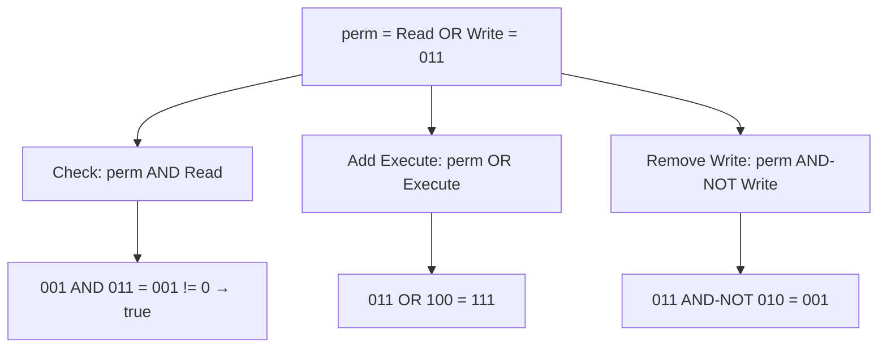
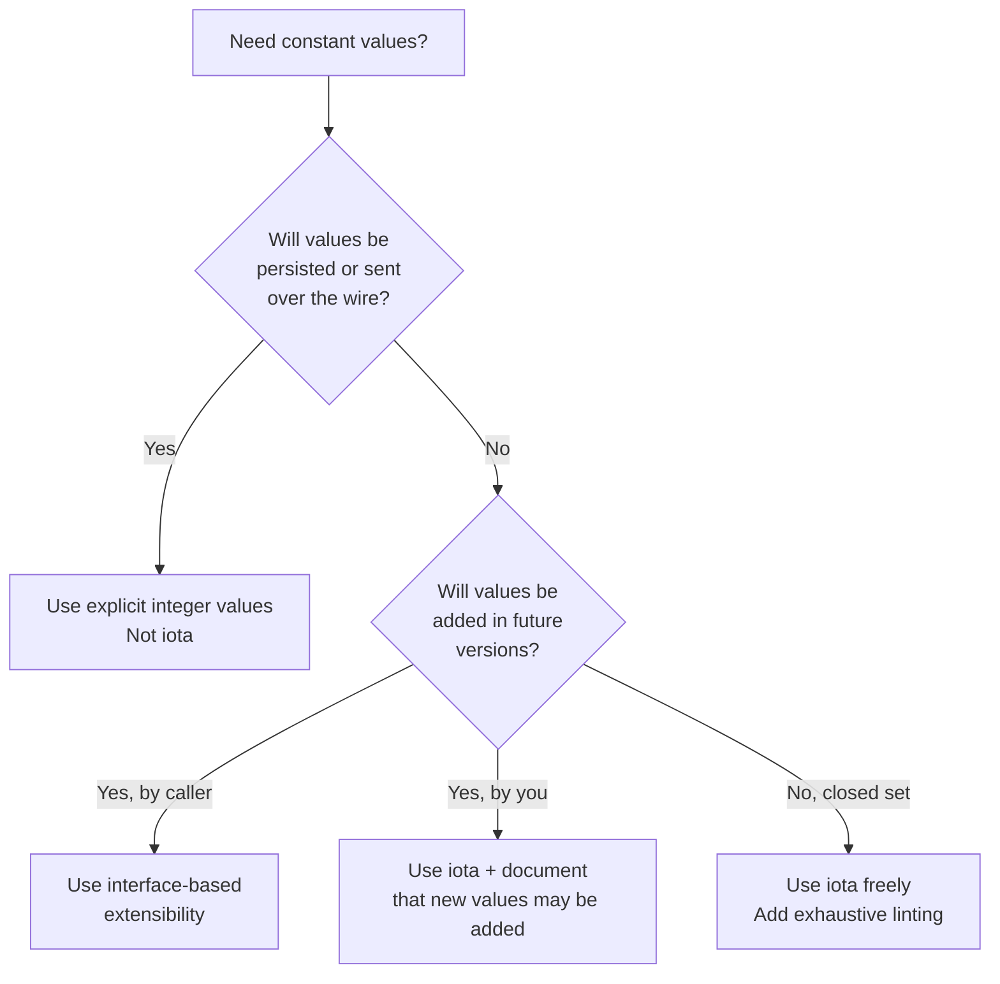

# const and iota — Senior Level

## Table of Contents
1. [Introduction](#introduction)
2. [Prerequisites](#prerequisites)
3. [Glossary](#glossary)
4. [Core Concepts](#core-concepts)
5. [Real-World Analogies](#real-world-analogies)
6. [Mental Models](#mental-models)
7. [Pros & Cons](#pros--cons)
8. [Use Cases](#use-cases)
9. [Code Examples](#code-examples)
10. [Coding Patterns](#coding-patterns)
11. [Clean Code](#clean-code)
12. [Product Use / Feature](#product-use--feature)
13. [Error Handling](#error-handling)
14. [Security Considerations](#security-considerations)
15. [Performance Tips](#performance-tips)
16. [Metrics & Analytics](#metrics--analytics)
17. [Best Practices](#best-practices)
18. [Edge Cases & Pitfalls](#edge-cases--pitfalls)
19. [Common Mistakes](#common-mistakes)
20. [Common Misconceptions](#common-misconceptions)
21. [Tricky Points](#tricky-points)
22. [Test](#test)
23. [Tricky Questions](#tricky-questions)
24. [Cheat Sheet](#cheat-sheet)
25. [Self-Assessment Checklist](#self-assessment-checklist)
26. [Summary](#summary)
27. [What You Can Build](#what-you-can-build)
28. [Further Reading](#further-reading)
29. [Related Topics](#related-topics)
30. [Diagrams & Visual Aids](#diagrams--visual-aids)

---

## Introduction

At the senior level, you stop thinking about `const` and `iota` as individual features and start thinking about them as tools for **API design**. The questions become: How do you design an enum-based API that is safe, extensible, and backwards-compatible? When should you use typed constants vs typed string constants vs interface-based extensibility? How do you use bit flags to create composable option patterns? How does Go's lack of a native `enum` keyword shape package design?

This file covers advanced patterns including exhaustive switch checking, the functional options pattern, typed constant APIs that are version-safe, and the design decisions behind Go's constant system.

---

## Prerequisites

- Strong understanding of Go's type system
- Experience designing public-facing packages
- Understanding of interface design and the Go embedding pattern
- Familiarity with `go generate` and code generation
- Knowledge of backwards-compatibility constraints in Go packages

---

## Glossary

| Term | Meaning |
|------|---------|
| **exhaustive switch** | A switch statement that handles every possible enum value |
| **functional options** | A pattern where function options are passed as `func(*Config)` values |
| **version stability** | The property that existing code does not break when a package is updated |
| **sentinal value** | A constant used to detect a specific condition (e.g., `io.EOF`) |
| **constant pool** | The compiler's storage for string constants used in binary |
| **wire format** | The serialized binary or text representation exchanged between services |
| **discriminated union** | A type that can hold one of several distinct variants (Go uses interfaces for this) |
| **option bitmask** | An integer used as a set of boolean options packed into individual bits |

---

## Core Concepts

### 1. Designing Enum-Based APIs

When designing a public API with iota constants, you face two conflicting forces:

- **Consumers** want exhaustive switches — they want the compiler to warn them when a new value is added.
- **Producers** want to add new values without breaking existing users.

Go has no built-in exhaustive enum switch. Tools like `exhaustive` (a linter) can detect non-exhaustive switches. As an API designer, you must communicate your intent:

```go
// In your package documentation:
// Status represents the lifecycle state of an order.
// New Status values may be added in future versions.
// Switches over Status should include a default case.
type Status int

const (
    StatusPending  Status = iota + 1
    StatusShipped
    StatusDelivered
    StatusCancelled
)
```

### 2. Typed Constants for Type-Safe Configuration

Typed constants are the foundation of type-safe option systems:

```go
type Algorithm int

const (
    AlgorithmSHA256 Algorithm = iota + 1
    AlgorithmSHA512
    AlgorithmMD5 // deprecated
)

type Config struct {
    Algorithm Algorithm
    // ...
}
```

This prevents a caller from passing arbitrary `int` values — they must use one of the defined `Algorithm` constants.

### 3. Functional Options vs Bit Flag Options

Two major patterns for passing options to constructors:

**Bit Flags** — compact, composable, but harder to read:

```go
type OpenFlag int

const (
    FlagRead   OpenFlag = 1 << iota // 1
    FlagWrite                        // 2
    FlagCreate                       // 4
    FlagAppend                       // 8
    FlagTrunc                        // 16
)

func OpenFile(path string, flags OpenFlag) (*File, error) { ... }

// Usage
f, err := OpenFile("data.txt", FlagRead|FlagWrite|FlagCreate)
```

**Functional Options** — verbose, but self-documenting and extensible:

```go
type ServerConfig struct {
    port    int
    timeout time.Duration
    debug   bool
}

type ServerOption func(*ServerConfig)

func WithPort(p int) ServerOption {
    return func(c *ServerConfig) { c.port = p }
}

func WithTimeout(d time.Duration) ServerOption {
    return func(c *ServerConfig) { c.timeout = d }
}

func NewServer(opts ...ServerOption) *Server {
    cfg := &ServerConfig{port: 8080, timeout: 30 * time.Second}
    for _, opt := range opts {
        opt(cfg)
    }
    return &Server{cfg: cfg}
}
```

Choose bit flags when options are truly binary and orthogonal. Use functional options when options are complex or have parameters.

### 4. Implementing the `go generate` + stringer Pipeline

For large enums, never write `String()` by hand. Use the `stringer` tool:

```go
package status

//go:generate stringer -type=OrderStatus -linecomment

type OrderStatus int

const (
    OrderStatusPending   OrderStatus = iota + 1 // pending
    OrderStatusShipped                           // shipped
    OrderStatusDelivered                         // delivered
    OrderStatusCancelled                         // cancelled
)
```

The `-linecomment` flag uses the comment text as the string value.

### 5. Bit Flag Manipulation Pattern

```go
type Permission uint32

const (
    PermNone    Permission = 0
    PermRead    Permission = 1 << iota // 1
    PermWrite                          // 2
    PermExecute                        // 4
    PermAdmin   Permission = 1 << 7   // explicit, stable value: 128
)

func (p Permission) Has(flag Permission) bool {
    return p&flag == flag
}

func (p Permission) Add(flag Permission) Permission {
    return p | flag
}

func (p Permission) Remove(flag Permission) Permission {
    return p &^ flag // AND NOT
}

func (p Permission) String() string {
    if p == PermNone {
        return "none"
    }
    s := ""
    if p.Has(PermRead) {
        s += "r"
    } else {
        s += "-"
    }
    if p.Has(PermWrite) {
        s += "w"
    } else {
        s += "-"
    }
    if p.Has(PermExecute) {
        s += "x"
    } else {
        s += "-"
    }
    if p.Has(PermAdmin) {
        s += "a"
    } else {
        s += "-"
    }
    return s
}
```

### 6. Backwards-Compatible Enum Extension

When you must add new enum values to a public API without breaking existing code:

```go
// v1
type Feature int
const (
    FeatureDarkMode Feature = iota + 1
    FeatureMultiTab
)

// v1.1 — safe to add at the end
const (
    // ... previous constants unchanged ...
    FeatureCustomTheme Feature = iota + 1 // DON'T use iota here across packages!
)
```

The safe way: explicitly assign values for public APIs:

```go
const (
    FeatureDarkMode    Feature = 1
    FeatureMultiTab    Feature = 2
    FeatureCustomTheme Feature = 3 // added in v1.1
)
```

---

## Real-World Analogies

### Analogy 1 — API Enum as a Traffic Signal Protocol

A traffic signal has exactly three states: Red, Yellow, Green. Every driver knows these. When the city adds a new signal (like a flashing white for pedestrians), all existing drivers must still understand the old three. This is the enum extension problem: new values must not break old consumers.

### Analogy 2 — Bit Flags as Feature Toggles

A feature toggle board in a control room has banks of binary switches. Each switch is independent. You can activate any combination. The state of all switches is stored in a single integer. That integer is your bitmask.

### Analogy 3 — Functional Options as a Custom Burger Order

"I'll have a burger with extra cheese, no tomato, and add bacon." Each option is a function that modifies the burger. You can add new options (jalapeños) without changing the existing options. Bit flags would be like checking boxes on a form — fine for simple binary choices, but limited for complex configurations.

---

## Mental Models

**Model 1 — The Stable Protocol**
When designing a public enum, ask: "If someone stores this value in a database row today and reads it back in 3 years, will it mean the same thing?" If yes, use explicit values. If the enum is only in-memory and never serialized, iota is fine.

**Model 2 — Permission as a Bitmask Register**
Visualize permissions as a CPU register: 32 bits, each a binary flag. Combining permissions is bitwise OR. Checking is bitwise AND. Removing is AND-NOT. This mental model makes bit flag code intuitive.

---

## Pros & Cons

### Senior-Level Pros

| Benefit | Why It Matters at Scale |
|---------|------------------------|
| Typed constants enforce API contracts | Callers cannot pass arbitrary integers |
| Bit flags enable composable option systems | One integer encodes N independent options |
| Stringer + go generate eliminates boilerplate | Large enums are maintained automatically |
| Exhaustive linting catches missing cases | Prevents bugs when new values are added |

### Senior-Level Cons

| Limitation | Architectural Impact |
|-----------|---------------------|
| No native exhaustive switch | Must use linter or sentinel pattern |
| iota ordering fragility | Public enums should not use iota |
| No enum method dispatch | Switch statements replace virtual dispatch |
| String() must be regenerated | `go generate` must be part of CI pipeline |

---

## Use Cases

1. **CLI flag systems** — combining flags like `--verbose --dry-run` into a bitmask
2. **Database query builders** — typed constants for query operators
3. **Permission systems** — user/group/other read/write/execute
4. **Feature flag systems** — typed constants for features
5. **Network protocol state machines** — typed TCP state constants
6. **Rendering pipelines** — shader flags, render pass options
7. **Configuration tiers** — SaaS subscription levels
8. **Codec selection** — typed constants for compression algorithms

---

## Code Examples

### Example 1 — Full Enum Package Design

```go
package order

import "fmt"

// Status represents the lifecycle state of an order.
// New status values may be added. Always include a default case in switches.
type Status int

const (
    StatusPending   Status = iota + 1
    StatusConfirmed
    StatusShipped
    StatusDelivered
    StatusCancelled
    StatusRefunded

    statusMin = StatusPending
    statusMax = StatusRefunded
)

var statusStrings = map[Status]string{
    StatusPending:   "Pending",
    StatusConfirmed: "Confirmed",
    StatusShipped:   "Shipped",
    StatusDelivered: "Delivered",
    StatusCancelled: "Cancelled",
    StatusRefunded:  "Refunded",
}

func (s Status) String() string {
    if name, ok := statusStrings[s]; ok {
        return name
    }
    return fmt.Sprintf("Status(%d)", int(s))
}

func (s Status) IsValid() bool {
    return s >= statusMin && s <= statusMax
}

func (s Status) IsTerminal() bool {
    return s == StatusDelivered || s == StatusCancelled || s == StatusRefunded
}

func StatusFromString(name string) (Status, bool) {
    for k, v := range statusStrings {
        if v == name {
            return k, true
        }
    }
    return 0, false
}
```

### Example 2 — Bit Flag System with Fluent API

```go
package perm

import (
    "fmt"
    "strings"
)

type Scope uint32

const (
    ScopeNone    Scope = 0
    ScopeRead    Scope = 1 << iota // 1
    ScopeWrite                     // 2
    ScopeDelete                    // 4
    ScopeAdmin                     // 8
    ScopeAudit                     // 16
)

var scopeNames = map[Scope]string{
    ScopeRead:   "read",
    ScopeWrite:  "write",
    ScopeDelete: "delete",
    ScopeAdmin:  "admin",
    ScopeAudit:  "audit",
}

func (s Scope) Has(flag Scope) bool {
    if flag == ScopeNone {
        return s == ScopeNone
    }
    return s&flag == flag
}

func (s Scope) With(flag Scope) Scope {
    return s | flag
}

func (s Scope) Without(flag Scope) Scope {
    return s &^ flag
}

func (s Scope) String() string {
    if s == ScopeNone {
        return "none"
    }
    var parts []string
    for flag, name := range scopeNames {
        if s.Has(flag) {
            parts = append(parts, name)
        }
    }
    return strings.Join(parts, "+")
}

func ParseScope(input string) (Scope, error) {
    if input == "none" || input == "" {
        return ScopeNone, nil
    }
    parts := strings.Split(input, "+")
    var result Scope
    for _, part := range parts {
        found := false
        for flag, name := range scopeNames {
            if name == part {
                result = result.With(flag)
                found = true
                break
            }
        }
        if !found {
            return ScopeNone, fmt.Errorf("unknown scope: %q", part)
        }
    }
    return result, nil
}
```

### Example 3 — Typed Constants for Database Column Types

```go
package schema

type ColumnType int

const (
    TypeUnknown  ColumnType = iota
    TypeInt
    TypeBigInt
    TypeFloat
    TypeDouble
    TypeVarchar
    TypeText
    TypeBoolean
    TypeTimestamp
    TypeJSON
)

var columnTypeSQL = map[ColumnType]string{
    TypeInt:       "INT",
    TypeBigInt:    "BIGINT",
    TypeFloat:     "FLOAT",
    TypeDouble:    "DOUBLE",
    TypeVarchar:   "VARCHAR",
    TypeText:      "TEXT",
    TypeBoolean:   "BOOLEAN",
    TypeTimestamp: "TIMESTAMP",
    TypeJSON:      "JSON",
}

func (c ColumnType) SQL() string {
    if s, ok := columnTypeSQL[c]; ok {
        return s
    }
    return "UNKNOWN"
}

func (c ColumnType) IsNumeric() bool {
    switch c {
    case TypeInt, TypeBigInt, TypeFloat, TypeDouble:
        return true
    }
    return false
}
```

### Example 4 — Versioned Enum with Explicit Values

```go
package api

// UserRole defines access level. Values are stable and safe to persist.
type UserRole int32

const (
    // RoleUnknown means the role is unset or invalid. Zero value.
    RoleUnknown UserRole = 0
    // RoleViewer can read content.
    RoleViewer UserRole = 10
    // RoleEditor can read and write content.
    RoleEditor UserRole = 20
    // RoleAdmin has full access.
    RoleAdmin UserRole = 30
    // RoleSuperAdmin was added in v2.3.
    RoleSuperAdmin UserRole = 40
)

func (r UserRole) CanWrite() bool {
    return r >= RoleEditor
}

func (r UserRole) CanAdmin() bool {
    return r >= RoleAdmin
}
```

Note: spacing (10, 20, 30) allows inserting new roles in between without conflicting with existing values.

### Example 5 — Using Constants for Compile-Time Configuration

```go
package config

const (
    // MaxRequestSize is the maximum HTTP request body size (4MB).
    MaxRequestSize = 4 * MB
    // SessionTimeout is the default session duration.
    SessionTimeout = 30 * 60 // 30 minutes in seconds
    // BCryptCost is the bcrypt work factor.
    BCryptCost = 12
)

const (
    _  = iota
    KB = 1 << (10 * iota)
    MB
    GB
)
```

---

## Coding Patterns

### Pattern 1 — Enum with Interface for Extensibility

When you need enums that callers can extend:

```go
type EventType interface {
    Code() int
    Name() string
}

type builtinEvent int

func (e builtinEvent) Code() int    { return int(e) }
func (e builtinEvent) Name() string { return eventNames[e] }

const (
    EventCreated builtinEvent = iota + 1
    EventUpdated
    EventDeleted
)

var eventNames = map[builtinEvent]string{
    EventCreated: "created",
    EventUpdated: "updated",
    EventDeleted: "deleted",
}
```

Callers can implement their own `EventType` without modifying the package.

### Pattern 2 — Compile-Time Bounds Using const Array

```go
type Priority int

const (
    PriorityLow Priority = iota
    PriorityMedium
    PriorityHigh
    priorityCount
)

// Compile-time check: this array must have exactly priorityCount entries
var priorityNames = [priorityCount]string{"low", "medium", "high"}

func (p Priority) String() string {
    if p < 0 || p >= priorityCount {
        return fmt.Sprintf("Priority(%d)", int(p))
    }
    return priorityNames[p]
}
```

If you add a constant to the enum but forget to update `priorityNames`, the code will fail to compile (array size mismatch). This is a compile-time safety check.

### Pattern 3 — Flags with Validation

```go
type BuildFlag uint

const (
    BuildFlagOptimize BuildFlag = 1 << iota
    BuildFlagDebug
    BuildFlagStrip
    BuildFlagVerbose

    buildFlagAll = BuildFlagOptimize | BuildFlagDebug | BuildFlagStrip | BuildFlagVerbose
)

func ValidateBuildFlags(f BuildFlag) error {
    if f & ^buildFlagAll != 0 {
        return fmt.Errorf("unknown build flags: %b", f & ^buildFlagAll)
    }
    if f.Has(BuildFlagOptimize) && f.Has(BuildFlagDebug) {
        return fmt.Errorf("cannot combine optimize and debug flags")
    }
    return nil
}

func (f BuildFlag) Has(flag BuildFlag) bool {
    return f&flag == flag
}
```

---

## Clean Code

### Use Doc Comments on Each Exported Constant

```go
// MaxConnections is the maximum number of simultaneous database connections.
// Exceeding this limit causes requests to queue. Default: 100.
const MaxConnections = 100

// DefaultTimeout is the default request timeout in seconds.
const DefaultTimeout = 30
```

### Group Related Constants, Separate Unrelated Groups

```go
// HTTP status families
const (
    StatusOK       = 200
    StatusCreated  = 201
    StatusAccepted = 202
)

const (
    StatusBadRequest  = 400
    StatusUnauthorized = 401
    StatusForbidden   = 403
    StatusNotFound    = 404
)

const (
    StatusInternalError = 500
    StatusBadGateway   = 502
)
```

---

## Product Use / Feature

### Feature: Subscription Tier System

```go
package subscription

type Tier int

const (
    TierFree       Tier = iota
    TierStarter
    TierPro
    TierEnterprise
)

type Limits struct {
    Projects   int
    Users      int
    StorageGB  int
    APICallsPerDay int
}

var tierLimits = [...]Limits{
    {Projects: 3,    Users: 1,    StorageGB: 1,    APICallsPerDay: 100},
    {Projects: 10,   Users: 5,    StorageGB: 10,   APICallsPerDay: 1000},
    {Projects: 50,   Users: 20,   StorageGB: 100,  APICallsPerDay: 10000},
    {Projects: -1,   Users: -1,   StorageGB: -1,   APICallsPerDay: -1}, // unlimited
}

func (t Tier) Limits() Limits {
    if t < 0 || int(t) >= len(tierLimits) {
        return Limits{}
    }
    return tierLimits[t]
}

func (t Tier) CanAddProject(current int) bool {
    limit := t.Limits().Projects
    return limit == -1 || current < limit
}
```

---

## Error Handling

### Typed Errors as Constants

```go
type ErrCode int

const (
    ErrCodeOK          ErrCode = iota
    ErrCodeNotFound
    ErrCodeUnauthorized
    ErrCodeRateLimit
    ErrCodeInternal
)

type AppError struct {
    Code    ErrCode
    Message string
}

func (e *AppError) Error() string {
    return fmt.Sprintf("[%d] %s", e.Code, e.Message)
}

func NewNotFoundError(resource string) *AppError {
    return &AppError{Code: ErrCodeNotFound, Message: resource + " not found"}
}
```

---

## Security Considerations

### Principle: Never Derive Authorization from Iota Position

```go
// Dangerous: Admin is 0 (zero value) — a newly declared variable is an Admin!
type Role int
const (
    Admin Role = iota // 0
    User              // 1
)

// Safe: Admin requires explicit assignment
type Role int
const (
    RoleUnknown Role = 0  // zero value = unauthorized
    RoleUser    Role = 1
    RoleAdmin   Role = 2
)
```

### Defense in Depth: Validate All Incoming Role/Permission Values

```go
func ParseRole(n int) (Role, error) {
    r := Role(n)
    switch r {
    case RoleUser, RoleAdmin:
        return r, nil
    }
    return RoleUnknown, fmt.Errorf("invalid role: %d", n)
}
```

---

## Performance Tips

- Bit flags are extremely fast: bitwise AND/OR are single CPU instructions.
- Named type method dispatch (like `p.Has(flag)`) inlines to a few instructions.
- Using `[priorityCount]string` instead of a map for String() avoids heap allocation on the hot path.
- `go generate stringer` produces a highly optimized implementation using a single string and offset table.

---

## Metrics & Analytics

```go
type HTTPStatus int

const (
    HTTP1xx HTTPStatus = iota
    HTTP2xx
    HTTP3xx
    HTTP4xx
    HTTP5xx
    httpStatusCount
)

var statusCounters [httpStatusCount]int64

func RecordStatus(code int) {
    family := HTTPStatus(code/100 - 1)
    if family >= 0 && family < httpStatusCount {
        statusCounters[family]++
    }
}
```

---

## Best Practices

1. **Public enum constants should have explicit integer values** — do not rely on iota for values that cross API boundaries.
2. **Use spacing** (e.g., 10, 20, 30) for public enum values to allow future insertions.
3. **Always implement `fmt.Stringer`** for public enum types. Use `go generate stringer`.
4. **Document when new values may be added** — callers must know whether to use a default case.
5. **Use bit flags for composable boolean options**; use functional options for complex configurations.
6. **Validate incoming enum values** from all external sources.
7. **Never use 0 as a valid "authorized" state** — zero is the default and may be reached accidentally.
8. **Add a `colorCount` or `statusMax` sentinel** to enable compile-time bounds checking.
9. **Consider the `exhaustive` linter** in CI to detect non-exhaustive switches.
10. **Use AND-NOT (`&^`) for flag removal** — a common pattern that is easy to miss.

---

## Edge Cases & Pitfalls

### Pitfall 1 — Stringer Array Out of Bounds

```go
func (c Color) String() string {
    return [...]string{"Red", "Green", "Blue"}[c] // panics if c > 2
}
```

Fix: add bounds check.

### Pitfall 2 — Bit Flag Confusion: `Has` vs `==`

```go
perm := Read | Write
if perm == Read { ... }  // WRONG: perm is 3, Read is 1 — never true
if perm&Read != 0 { ... } // CORRECT
```

### Pitfall 3 — Overlapping Bit Flags

```go
const (
    FlagA = 1 << iota // 1 = 0001
    FlagB             // 2 = 0010
    FlagC             // 4 = 0100
    FlagAB = FlagA | FlagB // 3 = 0011 — composite flag
)

// Checking FlagAB with Has:
func Has(perm, flag int) bool { return perm & flag == flag }
// Has(FlagA, FlagAB) → 0001 & 0011 == 0011? → false (correct: FlagA doesn't include FlagB)
// Has(FlagAB, FlagA) → 0011 & 0001 == 0001? → true (correct: FlagAB includes FlagA)
```

Make sure your `Has` function checks that ALL bits of the flag are set.

---

## Common Mistakes

| Mistake | Impact | Fix |
|---------|--------|-----|
| iota for public API values | Inserting a constant breaks clients | Use explicit values |
| Missing default in String() | Panics on out-of-range | Add bounds check or default |
| Checking flags with `==` | Silent logic bug | Use `&` bitwise AND |
| Zero value is a valid role | Security bypass | Start roles at 1 or use named zero |
| Not regenerating stringer | Outdated String() output | Run `go generate` in CI |

---

## Common Misconceptions

**"Bit flags are an optimization"**
They can be, but their primary value is expressiveness — combining multiple independent boolean options in one parameter or database column.

**"iota must always start at 0"**
No. `iota + 1` is a valid pattern. You control the starting value by the expression.

**"go generate stringer can handle non-iota enums"**
Yes, as long as the constants are of the same named type, stringer works regardless of whether iota was used.

---

## Tricky Points

### Tricky Point 1 — AND-NOT for Flag Removal

The `&^` operator is bitwise AND-NOT (or "bit clear"). It clears specific bits:

```go
perm := Read | Write | Execute // 7 = 0111
perm = perm &^ Write           // clear Write bit: 5 = 0101
```

### Tricky Point 2 — Composite Flags in Has()

When you define `FlagAB = FlagA | FlagB` as a composite, the `Has` check works differently:

```go
Has(FlagA, FlagAB) // "does FlagA have both FlagA and FlagB?" → false
Has(FlagAB, FlagA) // "does FlagAB have FlagA?" → true
```

Document composite flags clearly.

### Tricky Point 3 — Zero Value of Flag Type Is "No Flags"

This is correct behavior, but must be documented:

```go
var p Permission // p = 0 = PermNone
// p.Has(PermRead) → false
// This is the desired behavior for an "empty" permission set
```

---

## Postmortems & System Failures

### Postmortem 1: iota Values Stored in Database, Then Reordered

**Incident:** A role-based access control system granted admin privileges to regular users after a seemingly innocent refactoring that added a new role.

**Timeline:**
- Week 1: System deployed with `RoleUser=0, RoleAdmin=1` in database
- Week 4: Developer added `RoleModerator` between User and Admin
- Week 4: `RoleAdmin` iota value shifted from `1` to `2`
- Week 4: All existing `RoleAdmin=1` records in database now map to `RoleModerator`
- Week 4: All `RoleModerator=1` users have admin privileges

**Root Cause:**
```go
// Before refactoring:
const (
    RoleUser  Role = iota  // 0 — stored in DB
    RoleAdmin              // 1 — stored in DB
)

// After adding RoleModerator:
const (
    RoleUser      Role = iota  // 0 — DB value unchanged: OK
    RoleModerator              // 1 — NEW: DB had RoleAdmin=1 here!
    RoleAdmin                  // 2 — SHIFTED: existing DB records broken!
)
```

**Fix — Explicit Values:**
```go
const (
    RoleUser      Role = 0  // explicit: never shifts
    RoleModerator Role = 5  // use non-sequential for future insertions
    RoleAdmin     Role = 10 // gap allows adding roles between
)
```

**Lesson:** Never use `iota` for constants that are persisted (database, files, network protocols). Use explicit values and leave gaps for future additions.

### Postmortem 2: Bit Flag Confusion — Wrong Permission Granted

**Incident:** A file sharing system granted write permissions to read-only users because a developer added a new permission flag without checking existing bit assignments.

**Root Cause:**
```go
// Original:
const (
    PermRead  = 1 << iota  // 1
    PermWrite              // 2
    PermExec               // 4
)

// Developer added PermShare between Read and Write:
const (
    PermRead  = 1 << iota  // 1
    PermShare              // 2  ← NEW — but now PermWrite is 4!
    PermWrite              // 4  ← SHIFTED
    PermExec               // 8  ← SHIFTED
)
// Stored permissions with PermWrite=2 now mean PermShare!
```

**Fix:**
```go
// Always use explicit powers of 2 for persisted flags:
const (
    PermRead  = 1 << 0  // 1
    PermWrite = 1 << 1  // 2
    PermExec  = 1 << 2  // 4
    PermShare = 1 << 3  // 8  ← safe to add; doesn't shift others
)
```

**Lesson:** Use `iota` for in-memory, ephemeral constants (log levels, state machine states within a process). Use explicit bit masks for flags that must be stable across deployments.

### Postmortem 3: Debug Build Toggle — Wrong Constant in Production

**Incident:** A high-traffic API shipped with debug logging enabled in production for 3 days, causing 10x log volume and disk exhaustion.

**Root Cause:**
```go
// config/debug.go — accidentally committed with Debug = true
const Debug = true  // developer forgot to change back

func handleRequest(w http.ResponseWriter, r *http.Request) {
    if Debug {
        log.Printf("Full request dump: %+v", r)  // logs every header, body ref
    }
    // ...
}
```

**Fix — Build Tag Approach:**
```go
// debug_off.go (default build)
//go:build !debug

package config
const Debug = false

// debug_on.go (debug build)
//go:build debug

package config
const Debug = true
```

```bash
# Development:
go run -tags debug .

# Production build (never has debug enabled):
go build .
```

**Lesson:** Use build tags to control debug constants, not source code edits. Source edits are prone to accidental commits. Build tags make the production build structurally safe.

---

## Test

**Question 1**: Why is the `&^` operator used to remove a flag?

<details>
<summary>Answer</summary>
`&^` is bitwise AND-NOT. `x &^ y` clears all bits in `x` that are set in `y`. This is the correct way to remove a flag: `perm = perm &^ FlagWrite` clears the Write bit while leaving others unchanged.
</details>

**Question 2**: How do you make a compile-time check that your String() array has the correct number of entries?

<details>
<summary>Answer</summary>
Use a fixed-size array type indexed by a sentinel constant:
```go
var names = [priorityCount]string{"low", "medium", "high"}
```
If `priorityCount` changes but the array literal has the wrong number of elements, the compiler reports an error.
</details>

**Question 3**: Why should public API enum values use explicit integers instead of iota?

<details>
<summary>Answer</summary>
iota values depend on insertion order. If a new constant is inserted in the middle of a const block, all following values shift. Clients who stored old values (in a database, config file, or wire format) will misinterpret them. Explicit values are stable regardless of insertion order.
</details>

---

## Tricky Questions

**Q: Can you have a bit flag that requires TWO other flags to both be set?**
Yes — define a composite constant:

```go
const RequiredPair = FlagA | FlagB
// Check: p.Has(RequiredPair) — true only if both FlagA and FlagB are set
```

**Q: How do you check if a permission set has EXACTLY one specific flag and nothing else?**

```go
if p == FlagRead { ... } // exact equality — p must be exactly 001
```

**Q: Can constants be used as struct field types?**
Yes — use a typed constant as a default value in a factory function, or as a struct field type's values in switch statements. Constants cannot be struct field values directly in the struct literal without assignment.

---

## Cheat Sheet

```go
// Stable public enum — use explicit values
const (
    RoleUnknown = 0
    RoleUser    = 1
    RoleAdmin   = 2
)

// Internal enum — iota is fine
const (
    stateIdle = iota
    stateRunning
    stateStopped
)

// Bit flags
const (
    FlagA = 1 << iota // 1
    FlagB              // 2
    FlagC              // 4
)

// Check flag
if perm&FlagA != 0 { ... }

// Add flag
perm = perm | FlagB

// Remove flag
perm = perm &^ FlagC

// Composite flag
const FlagAB = FlagA | FlagB

// Compile-time bounds check
var names = [colorCount]string{"red", "green", "blue"}

// Stringer
//go:generate stringer -type=Status
```

---

## Self-Assessment Checklist

- [ ] I can design a public enum API with stable, documented values
- [ ] I know when to use explicit values vs iota for public constants
- [ ] I can implement a full bit flag system with Has/Add/Remove methods
- [ ] I understand the `&^` AND-NOT operator
- [ ] I can use a sentinel constant for compile-time array bounds checking
- [ ] I know the difference between bit flags and functional options patterns
- [ ] I can set up `go generate stringer` for auto-generated String() methods
- [ ] I know how to validate enum values from external sources
- [ ] I understand the security implications of zero-value enum design
- [ ] I can design an enum that is backwards-compatible when extended

---

## Summary

- Public API enums should use explicit values, not iota, to ensure stability across versions.
- Bit flags with `1 << iota` create composable option systems; use `&`, `|`, `&^` for manipulation.
- A trailing sentinel constant (`colorCount`) enables compile-time bounds checks.
- Use `go generate stringer` to automate `String()` for large enums.
- Zero value of an enum type should mean "unset" or "unknown" — never a valid privileged state.
- Choose bit flags for boolean options, functional options for complex parametric configurations.

---

## What You Can Build

- A production-grade permission system for a multi-tenant SaaS
- A typed configuration system for a CLI tool
- A state machine with typed transition constants
- A subscription tier system with per-tier capability checks
- A database query builder with typed column type constants

---

## Further Reading

- [Dave Cheney — Constant Errors](https://dave.cheney.net/2016/04/07/constant-errors)
- [Go proposal: sum types](https://github.com/golang/go/issues/19412)
- [exhaustive linter](https://github.com/nishanths/exhaustive)
- [golang.org/x/tools/cmd/stringer](https://pkg.go.dev/golang.org/x/tools/cmd/stringer)
- [Russ Cox on iota](https://research.swtch.com/iota)

---

## Related Topics

- Interface-based extensibility vs enum-based exhaustive dispatch
- Functional options pattern
- `go generate` and code generation pipelines
- Go module versioning and breaking changes
- Error types as constants (`io.EOF`, `os.ErrNotExist`)

---

## Diagrams & Visual Aids

### Diagram 1 — Bit Flag Manipulation



### Diagram 2 — Enum API Design Decision Tree


