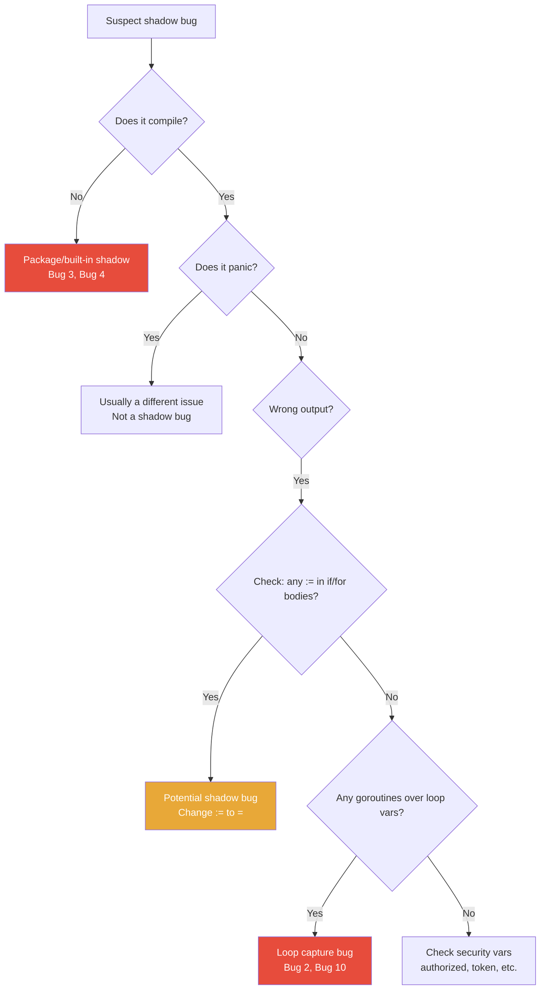
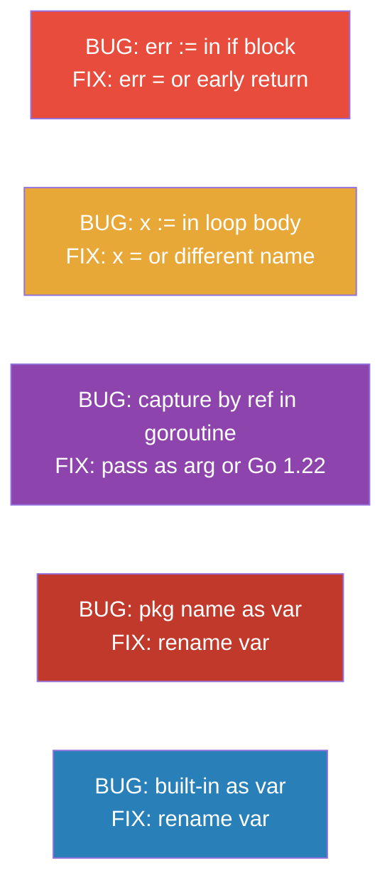

# Scope and Shadowing — Find the Bug

## Instructions

Each bug scenario contains Go code with one or more scope/shadowing-related bugs. Your task:
1. Read the code carefully
2. Identify the bug(s)
3. Understand WHY it is a bug
4. Write the fixed version

Click the `<details>` section to reveal hints and solutions.

**Bugs covered:**
- Shadowed `err` in if block
- Loop variable captured by goroutine
- Shadowed package name
- Shadowed built-in
- Variable declared but never effectively used (due to shadowing)
- Wrong variable modified due to same name
- Named return value shadowed
- Security bypass via shadowing
- Accumulator reset in loop
- Context shadowed in goroutine

---

## Bug 1: The Disappearing Error

```go
package main

import (
    "errors"
    "fmt"
)

func connectDB() error {
    return errors.New("connection refused")
}

func pingDB() error {
    return nil
}

func initDatabase() error {
    err := connectDB()
    if err != nil {
        err := fmt.Errorf("db connect: %w", err)
        return err
    }

    if err := pingDB(); err != nil {
        return fmt.Errorf("db ping: %w", err)
    }

    fmt.Println("database initialized successfully")
    return nil
}

func main() {
    if err := initDatabase(); err != nil {
        fmt.Println("FATAL:", err)
    }
}
```

**Question:** The program should print `FATAL: db connect: connection refused`. Does it? If not, what prints and why?

<details>
<summary>Hint</summary>

Look at the first `if err != nil` block. How is `err` declared inside it?

</details>

<details>
<summary>Solution</summary>

**Bug:** The code actually works correctly here — both errors are properly handled. However, the style is inconsistent and potentially dangerous because the first `err := fmt.Errorf(...)` shadows the outer `err`. This is a common review concern.

Let me show a version with an actual bug:

```go
// ACTUAL BUG VERSION:
func initDatabaseBuggy() error {
    err := connectDB()
    if err != nil {
        // BUG: err is shadowed here but we only return the inner err
        // What if fmt.Errorf itself could fail? (it can't, but the pattern
        // is still dangerous because it hides the outer err from this point)
        err := fmt.Errorf("db connect: %w", err) // new err
        fmt.Println("will return:", err)
    }
    // if we fall through (we don't due to return, but consider):
    return err // outer err — still holds connectDB()'s error
}
```

**A cleaner version without shadowing:**
```go
func initDatabase() error {
    if err := connectDB(); err != nil {
        return fmt.Errorf("db connect: %w", err)
    }

    if err := pingDB(); err != nil {
        return fmt.Errorf("db ping: %w", err)
    }

    fmt.Println("database initialized successfully")
    return nil
}
```

Using `if err := ...; err != nil` properly scopes each error to its check without any shadow issues.

</details>

---

## Bug 2: The Goroutine That Only Prints One Thing

```go
package main

import (
    "fmt"
    "sync"
)

func main() {
    messages := []string{"hello", "world", "foo", "bar"}
    var wg sync.WaitGroup

    for _, msg := range messages {
        wg.Add(1)
        go func() {
            defer wg.Done()
            fmt.Println(msg)
        }()
    }

    wg.Wait()
}
```

**Question:** What does this program print? What does it SHOULD print? Explain the bug and provide all three fixes.

<details>
<summary>Hint</summary>

What happens to the `msg` variable after the loop ends? How many goroutines share the same `msg` variable?

</details>

<details>
<summary>Solution</summary>

**Expected output:** Four lines with "hello", "world", "foo", "bar" (in any order)

**Actual output (pre-Go 1.22):** Four copies of "bar" (the last element) — or some random subset depending on timing.

**Why:** All goroutines capture the same `msg` variable by reference. The loop advances `msg` to the next value faster than goroutines run. When goroutines finally execute, `msg` holds "bar" (the last value).

**Fix 1: Pass as argument**
```go
for _, msg := range messages {
    wg.Add(1)
    go func(m string) {
        defer wg.Done()
        fmt.Println(m)
    }(msg)
}
```

**Fix 2: Create per-iteration copy**
```go
for _, msg := range messages {
    msg := msg  // creates a new msg each iteration
    wg.Add(1)
    go func() {
        defer wg.Done()
        fmt.Println(msg)
    }()
}
```

**Fix 3: Use Go 1.22**
```go
// go.mod: go 1.22
// No code change needed — range automatically creates per-iteration copies
for _, msg := range messages {
    wg.Add(1)
    go func() {
        defer wg.Done()
        fmt.Println(msg) // safe in Go 1.22
    }()
}
```

</details>

---

## Bug 3: The Package That Disappeared

```go
package main

import (
    "fmt"
    "os"
)

func writeLog(filename, message string) error {
    f, err := os.Create(filename)
    if err != nil {
        return err
    }
    defer f.Close()

    fmt.Fprintf(f, "%s\n", message)
    return nil
}

func processFiles(files []string) {
    for _, file := range files {
        os := file + ".processed"    // "output file" variable
        if err := writeLog(os, "done"); err != nil {
            fmt.Fprintf(os.Stderr, "error: %v\n", err) // BUG
        }
    }
}

func main() {
    processFiles([]string{"report", "data", "audit"})
}
```

**Question:** This code will not compile. Why? What should you rename to fix it?

<details>
<summary>Hint</summary>

Look at the variable named `os` inside the loop, and then look at how `os.Stderr` is used.

</details>

<details>
<summary>Solution</summary>

**Bug:** `os := file + ".processed"` shadows the `os` package. After this declaration, `os` in this scope refers to the string variable, not the `os` package. Therefore `os.Stderr` is a compile error — you can't access `.Stderr` on a string.

**Error message:**
```
./main.go:22:17: os.Stderr undefined (type string has no field or method Stderr)
```

**Fix: Use a descriptive variable name**
```go
func processFiles(files []string) {
    for _, file := range files {
        outputFile := file + ".processed"  // descriptive name
        if err := writeLog(outputFile, "done"); err != nil {
            fmt.Fprintf(os.Stderr, "error: %v\n", err) // os package accessible
        }
    }
}
```

**Rule:** Never use standard library package names (`fmt`, `os`, `io`, `http`, `sync`, `time`, `json`, `log`, `math`, `rand`, `url`, `net`) as variable names.

</details>

---

## Bug 4: The Built-in That Stopped Working

```go
package main

import "fmt"

func countLongStrings(strs []string, minLen int) int {
    len := 0    // count variable
    for _, s := range strs {
        if len(s) >= minLen {  // BUG
            len++
        }
    }
    return len
}

func main() {
    words := []string{"go", "rust", "python", "java", "c"}
    count := countLongStrings(words, 4)
    fmt.Println("words with 4+ chars:", count)
}
```

**Question:** This code will not compile. Identify the error and fix it.

<details>
<summary>Hint</summary>

What is `len` on line 6? What is `len` being used as on line 8?

</details>

<details>
<summary>Solution</summary>

**Bug:** `len := 0` shadows the built-in `len` function. After this declaration, `len` refers to the integer variable, not the built-in. So `len(s)` on the next line tries to call an integer as a function — which is a compile error.

**Error message:**
```
./main.go:8:6: cannot call non-function len (variable of type int)
```

**Fix: Use a different name for the counter**
```go
func countLongStrings(strs []string, minLen int) int {
    count := 0
    for _, s := range strs {
        if len(s) >= minLen {  // built-in len() is accessible now
            count++
        }
    }
    return count
}
```

**Rule:** Never shadow built-in functions: `len`, `cap`, `make`, `new`, `append`, `copy`, `delete`, `close`, `panic`, `recover`.

</details>

---

## Bug 5: The Security Check That Always Fails

```go
package main

import "fmt"

func checkToken(token string) bool {
    return token == "secret-token-12345"
}

func hasAdminPrivilege(token string) bool {
    return token == "admin-secret-99999"
}

func authorize(token string, requireAdmin bool) bool {
    authorized := false

    if token != "" {
        authorized := checkToken(token)  // BUG: shadows outer
        if requireAdmin {
            authorized := hasAdminPrivilege(token)  // BUG: shadows again
            _ = authorized
        }
        _ = authorized
    }

    return authorized  // always false!
}

func main() {
    tests := []struct {
        token        string
        requireAdmin bool
        want         bool
    }{
        {"secret-token-12345", false, true},
        {"admin-secret-99999", true, true},
        {"wrong-token", false, false},
        {"", false, false},
    }

    for _, tt := range tests {
        got := authorize(tt.token, tt.requireAdmin)
        status := "PASS"
        if got != tt.want {
            status = "FAIL"
        }
        fmt.Printf("%s: authorize(%q, admin=%v) = %v (want %v)\n",
            status, tt.token, tt.requireAdmin, got, tt.want)
    }
}
```

**Question:** This is a security bug. The `authorize` function always returns `false`, effectively denying all access. Find all shadow instances and write a correct implementation.

<details>
<summary>Hint</summary>

Count how many times `authorized` is declared with `:=` in this function.

</details>

<details>
<summary>Solution</summary>

**Bugs:**
1. `authorized := checkToken(token)` — shadows outer `authorized` (line with `false`)
2. `authorized := hasAdminPrivilege(token)` — shadows the middle `authorized`

Both inner declarations are discarded when their blocks end. The outer `authorized` is never updated, so the function always returns `false`.

**Security impact:** All users are denied access, regardless of token validity. OR in an alternate version where the logic is inverted, all users might be granted access.

**Fix:**
```go
func authorize(token string, requireAdmin bool) bool {
    if token == "" {
        return false
    }

    if requireAdmin {
        return hasAdminPrivilege(token)
    }

    return checkToken(token)
}
```

**Alternative fix maintaining original structure (using `=`):**
```go
func authorize(token string, requireAdmin bool) bool {
    authorized := false

    if token != "" {
        authorized = checkToken(token)  // = not :=
        if requireAdmin {
            authorized = hasAdminPrivilege(token)  // = not :=
        }
    }

    return authorized
}
```

</details>

---

## Bug 6: The Accumulator That Never Accumulates

```go
package main

import "fmt"

func runningTotal(data []float64) []float64 {
    totals := make([]float64, len(data))
    sum := 0.0

    for i, v := range data {
        sum := sum + v  // BUG
        totals[i] = sum
    }

    return totals
}

func main() {
    data := []float64{1.0, 2.0, 3.0, 4.0, 5.0}
    result := runningTotal(data)
    fmt.Println(result)
    // Expected: [1 3 6 10 15]
    // Actual:   ?
}
```

**Question:** What does this print? What is the bug, and how do you fix it?

<details>
<summary>Hint</summary>

What does `sum := sum + v` do vs `sum = sum + v`?

</details>

<details>
<summary>Solution</summary>

**Bug:** `sum := sum + v` creates a NEW `sum` variable in the loop body each iteration. The outer `sum` (initialized to `0.0`) is never modified. Each iteration, `sum` on the right side evaluates to the OUTER `sum` (which is always `0.0`), and the result is stored in the INNER `sum` which is immediately discarded.

**Actual output:** `[1 2 3 4 5]` — each element equals just its own value (running total never accumulates).

**Fix:**
```go
func runningTotal(data []float64) []float64 {
    totals := make([]float64, len(data))
    sum := 0.0

    for i, v := range data {
        sum += v        // = not :=, updates outer sum
        totals[i] = sum
    }

    return totals
}
```

**Output:** `[1 3 6 10 15]` ✓

</details>

---

## Bug 7: The Loop That Closes the Wrong Files

```go
package main

import (
    "fmt"
    "os"
)

func processLogs(logFiles []string) error {
    for _, filename := range logFiles {
        f, err := os.Open(filename)
        if err != nil {
            return fmt.Errorf("open %s: %w", filename, err)
        }
        defer f.Close()  // BUG: deferred to function end, not loop iteration

        if err := processFile(f); err != nil {
            return fmt.Errorf("process %s: %w", filename, err)
        }
    }
    return nil
}

func processFile(f *os.File) error {
    fmt.Println("processing:", f.Name())
    return nil
}

func main() {
    // Create test files
    files := []string{"a.log", "b.log", "c.log"}
    for _, f := range files {
        os.WriteFile(f, []byte("log data"), 0644)
        defer os.Remove(f)
    }
    processLogs(files)
}
```

**Question:** There are two issues here — one is scope/defer related, and one is a goroutine-style loop variable issue. Identify both and fix them.

<details>
<summary>Hint</summary>

1. When does `defer f.Close()` execute relative to the loop?
2. In the `main` function, is there a loop variable capture issue with `defer os.Remove(f)`?

</details>

<details>
<summary>Solution</summary>

**Bug 1: defer in a loop**
`defer f.Close()` is deferred to the **end of the function**, not the end of the loop iteration. So all files are opened but none are closed until `processLogs` returns. With many files, this exhausts file descriptors.

**Bug 2: Loop variable capture in defer**
In `main`, `defer os.Remove(f)` captures `f` by reference (pre-Go 1.22). After the loop, `f` == "c.log", so all three `defer os.Remove` calls try to remove "c.log".

**Fix:**
```go
func processLogs(logFiles []string) error {
    for _, filename := range logFiles {
        if err := processLogFile(filename); err != nil {
            return err
        }
    }
    return nil
}

// Extract to separate function — defer executes when THIS function returns
func processLogFile(filename string) error {
    f, err := os.Open(filename)
    if err != nil {
        return fmt.Errorf("open %s: %w", filename, err)
    }
    defer f.Close()  // now correctly deferred to processLogFile's return

    if err := processFile(f); err != nil {
        return fmt.Errorf("process %s: %w", filename, err)
    }
    return nil
}

func main() {
    files := []string{"a.log", "b.log", "c.log"}
    for _, name := range files {
        os.WriteFile(name, []byte("log data"), 0644)
    }
    processLogs(files)
    // Clean up explicitly (or use defer in a wrapper)
    for _, name := range files {
        os.Remove(name)
    }
}
```

</details>

---

## Bug 8: The Named Return That Returns Zero

```go
package main

import (
    "fmt"
    "strconv"
)

func parseAndDouble(s string) (result int, err error) {
    if n, err := strconv.Atoi(s); err != nil {
        return 0, fmt.Errorf("parse %q: %w", s, err)
    } else {
        result, err := n*2, error(nil)
        _ = err
        return result, nil
    }
}

func main() {
    tests := []string{"5", "abc", "-3", "100"}
    for _, s := range tests {
        r, err := parseAndDouble(s)
        if err != nil {
            fmt.Printf("parseAndDouble(%q) error: %v\n", s, err)
        } else {
            fmt.Printf("parseAndDouble(%q) = %d\n", s, r)
        }
    }
}
```

**Question:** This compiles. Does it work correctly? Trace through `parseAndDouble("5")` and explain what happens to the named return `result`.

<details>
<summary>Hint</summary>

In the `else` block, look at `result, err := n*2, error(nil)`. Are these the named returns, or new variables?

</details>

<details>
<summary>Solution</summary>

**Bug:** The `else` block creates a NEW `result` and `err` (because of `:=`). These shadow the named return values. The named return `result` is never assigned.

However, the function uses explicit `return result, nil` — which returns the **inner** `result` (from `:=`). So the code accidentally works because of the explicit return statement!

But this is fragile and confusing. If someone changed it to a bare `return`, it would return `0` (the zero value of the named return).

**The real danger:**
```go
func parseAndDouble(s string) (result int, err error) {
    if n, err := strconv.Atoi(s); err != nil {
        return 0, fmt.Errorf("parse %q: %w", s, err)
    } else {
        result, err = n*2, nil  // using = assigns to named returns
        _ = err
    }
    return  // bare return — works because named returns are assigned
}
```

**Clean version:**
```go
func parseAndDouble(s string) (int, error) {
    n, err := strconv.Atoi(s)
    if err != nil {
        return 0, fmt.Errorf("parse %q: %w", s, err)
    }
    return n * 2, nil
}
```

</details>

---

## Bug 9: The Config That Never Updates

```go
package main

import "fmt"

type Config struct {
    Host    string
    Port    int
    Debug   bool
    Timeout int
}

func defaultConfig() Config {
    return Config{
        Host:    "localhost",
        Port:    8080,
        Debug:   false,
        Timeout: 30,
    }
}

func applyOverrides(cfg Config, overrides map[string]interface{}) Config {
    for key, value := range overrides {
        switch key {
        case "host":
            if host, ok := value.(string); ok {
                cfg := cfg  // BUG: shadows the parameter!
                cfg.Host = host
                _ = cfg
            }
        case "port":
            if port, ok := value.(int); ok {
                cfg := cfg  // BUG
                cfg.Port = port
                _ = cfg
            }
        case "debug":
            if debug, ok := value.(bool); ok {
                cfg := cfg  // BUG
                cfg.Debug = debug
                _ = cfg
            }
        }
    }
    return cfg
}

func main() {
    cfg := defaultConfig()
    overrides := map[string]interface{}{
        "host":  "production.example.com",
        "port":  443,
        "debug": true,
    }

    result := applyOverrides(cfg, overrides)
    fmt.Printf("host: %s\n", result.Host)   // Should be: production.example.com
    fmt.Printf("port: %d\n", result.Port)   // Should be: 443
    fmt.Printf("debug: %v\n", result.Debug) // Should be: true
}
```

**Question:** Every override is silently ignored. Why? Fix the function.

<details>
<summary>Hint</summary>

Count how many `cfg` variables exist in the function. Which one is returned?

</details>

<details>
<summary>Solution</summary>

**Bug:** `cfg := cfg` in each case block creates a new `cfg` variable that is a COPY of the parameter `cfg`. Modifications to this copy are local to the case block and discarded. The parameter `cfg` (which is returned) is never modified.

**Fix:**
```go
func applyOverrides(cfg Config, overrides map[string]interface{}) Config {
    for key, value := range overrides {
        switch key {
        case "host":
            if host, ok := value.(string); ok {
                cfg.Host = host  // directly modify cfg
            }
        case "port":
            if port, ok := value.(int); ok {
                cfg.Port = port
            }
        case "debug":
            if debug, ok := value.(bool); ok {
                cfg.Debug = debug
            }
        }
    }
    return cfg
}
```

**Output:**
```
host: production.example.com
port: 443
debug: true
```

</details>

---

## Bug 10: The Classic Goroutine Loop Bug (Extended Version)

```go
package main

import (
    "fmt"
    "sync"
    "time"
)

type Worker struct {
    ID   int
    Name string
}

func (w Worker) DoWork() {
    time.Sleep(10 * time.Millisecond)
    fmt.Printf("Worker %d (%s) completed\n", w.ID, w.Name)
}

func runWorkers(workers []Worker) {
    var wg sync.WaitGroup
    results := make([]string, len(workers))

    for i, worker := range workers {
        wg.Add(1)
        go func() {
            defer wg.Done()
            worker.DoWork()
            results[i] = fmt.Sprintf("worker-%d-done", worker.ID)
        }()
    }

    wg.Wait()
    fmt.Println("Results:", results)
}

func main() {
    workers := []Worker{
        {ID: 1, Name: "Alice"},
        {ID: 2, Name: "Bob"},
        {ID: 3, Name: "Carol"},
    }
    runWorkers(workers)
}
```

**Question:**
1. What does this print? (Be specific about what `results` contains)
2. Is there a data race? Use `go test -race` logic to reason about it.
3. Fix it for pre-Go 1.22 and for Go 1.22.

<details>
<summary>Hint</summary>

Two loop variables are captured: `worker` AND `i`. Both may have the wrong value when goroutines execute.

</details>

<details>
<summary>Solution</summary>

**What it prints (pre-1.22, without race detector):**

The goroutines likely all see the last values: `worker = {ID: 3, Name: "Carol"}` and `i = 2`. So the output might be:
```
Worker 3 (Carol) completed
Worker 3 (Carol) completed
Worker 3 (Carol) completed
Results: [worker-3-done worker-3-done worker-3-done]
```

**Is there a data race?** Yes — multiple goroutines read from `worker` and `i` while the main goroutine's loop modifies them. The race detector would report this.

**Fix for pre-Go 1.22:**
```go
func runWorkersFixed(workers []Worker) {
    var wg sync.WaitGroup
    results := make([]string, len(workers))

    for i, worker := range workers {
        i, worker := i, worker  // create per-iteration copies
        wg.Add(1)
        go func() {
            defer wg.Done()
            worker.DoWork()
            results[i] = fmt.Sprintf("worker-%d-done", worker.ID)
        }()
    }

    wg.Wait()
    fmt.Println("Results:", results)
}
```

**Fix using function arguments:**
```go
func runWorkersArgs(workers []Worker) {
    var wg sync.WaitGroup
    results := make([]string, len(workers))

    for i, worker := range workers {
        wg.Add(1)
        go func(idx int, w Worker) {
            defer wg.Done()
            w.DoWork()
            results[idx] = fmt.Sprintf("worker-%d-done", w.ID)
        }(i, worker)
    }

    wg.Wait()
    fmt.Println("Results:", results)
}
```

**Fix for Go 1.22:**
```go
// go.mod: go 1.22
// Original code works correctly — range creates per-iteration copies
func runWorkers(workers []Worker) {
    var wg sync.WaitGroup
    results := make([]string, len(workers))

    for i, worker := range workers {  // i and worker are per-iteration in Go 1.22
        wg.Add(1)
        go func() {
            defer wg.Done()
            worker.DoWork()
            results[i] = fmt.Sprintf("worker-%d-done", worker.ID)
        }()
    }

    wg.Wait()
    fmt.Println("Results:", results)
}
```

**Note on results slice writes:** Writing to different indices of a slice from different goroutines is safe in Go (no data race) because each goroutine writes to a different memory location. But if two goroutines could write to the same index, a mutex would be needed.

</details>

---

## Bug 11: The Switch That Doesn't Switch

```go
package main

import "fmt"

func getStatusText(code int) string {
    status := "unknown"

    switch code {
    case 200:
        status := "OK"
        _ = status
    case 404:
        status := "Not Found"
        _ = status
    case 500:
        status := "Internal Server Error"
        _ = status
    }

    return status
}

func main() {
    codes := []int{200, 404, 500, 999}
    for _, code := range codes {
        fmt.Printf("%d: %s\n", code, getStatusText(code))
    }
}
```

**Question:** What does this print for each code? Fix it.

<details>
<summary>Hint</summary>

Look at how `status` is declared in each case block.

</details>

<details>
<summary>Solution</summary>

**What it prints:**
```
200: unknown
404: unknown
500: unknown
999: unknown
```

Every code returns "unknown" because each `status :=` in the case blocks creates a new local variable that shadows the outer `status`. The outer `status` is never updated.

**Fix — Option 1: Use `=`**
```go
func getStatusText(code int) string {
    status := "unknown"
    switch code {
    case 200:
        status = "OK"
    case 404:
        status = "Not Found"
    case 500:
        status = "Internal Server Error"
    }
    return status
}
```

**Fix — Option 2: Return directly**
```go
func getStatusText(code int) string {
    switch code {
    case 200:
        return "OK"
    case 404:
        return "Not Found"
    case 500:
        return "Internal Server Error"
    default:
        return "unknown"
    }
}
```

</details>

---

## Bug 12: The Context That Wasn't Cancelled

```go
package main

import (
    "context"
    "fmt"
    "time"
)

func doWork(ctx context.Context, name string) {
    select {
    case <-time.After(100 * time.Millisecond):
        fmt.Printf("%s: completed\n", name)
    case <-ctx.Done():
        fmt.Printf("%s: cancelled\n", name)
    }
}

func runWithTimeout(parentCtx context.Context) {
    ctx, cancel := context.WithTimeout(parentCtx, 50*time.Millisecond)
    defer cancel()

    // Spawn work in goroutine
    go func() {
        // BUG: creating a new context but shadowing the outer ctx
        ctx, cancel := context.WithTimeout(ctx, 200*time.Millisecond)
        defer cancel()
        doWork(ctx, "worker")
    }()

    doWork(ctx, "main")
}

func main() {
    ctx := context.Background()
    runWithTimeout(ctx)
    time.Sleep(300 * time.Millisecond) // wait for goroutine
}
```

**Question:** The intent is for both `main` and `worker` to be cancelled after 50ms. Does the worker respect the 50ms timeout? Why or why not?

<details>
<summary>Hint</summary>

The goroutine creates a new 200ms context from the outer `ctx`. But what is the outer `ctx` at that point?

</details>

<details>
<summary>Solution</summary>

**Bug:** The goroutine creates `ctx, cancel := context.WithTimeout(ctx, 200*time.Millisecond)`. At this point, `ctx` on the right side refers to the outer `ctx` (with 50ms timeout). The resulting context has `min(50ms, 200ms) = 50ms` deadline — so this actually works by accident!

But the shadow is still a problem because:
1. The outer `cancel` is also shadowed — if the inner cancel runs first, the outer one is still deferred
2. The naming is confusing — the reader cannot easily tell which `ctx` is which
3. In a more complex scenario, the inner timeout could be shorter and bypass the parent

**Clear version:**
```go
func runWithTimeout(parentCtx context.Context) {
    timeoutCtx, cancelTimeout := context.WithTimeout(parentCtx, 50*time.Millisecond)
    defer cancelTimeout()

    go func() {
        // Explicit: derive from timeoutCtx (inherits the 50ms deadline)
        workerCtx, cancelWorker := context.WithTimeout(timeoutCtx, 200*time.Millisecond)
        defer cancelWorker()
        doWork(workerCtx, "worker")
    }()

    doWork(timeoutCtx, "main")
}
```

With explicit naming, it's clear that the worker inherits the parent timeout, and both cancels are properly distinct.

</details>

---

## Summary

| Bug # | Pattern | Severity |
|-------|---------|---------|
| 1 | Shadowed err in nested if | Medium |
| 2 | Goroutine loop variable capture | High |
| 3 | Package name shadowed (os) | Compile Error |
| 4 | Built-in shadowed (len) | Compile Error |
| 5 | Security check bypassed | Critical |
| 6 | Accumulator reset in loop | High |
| 7 | Defer in loop + loop var capture | Medium-High |
| 8 | Named return shadowed | Medium |
| 9 | Config copy not applied | Medium |
| 10 | Goroutine + index shadow (extended) | High |
| 11 | Switch case shadow | Medium |
| 12 | Context shadowed in goroutine | Medium |

## Diagrams

### How to Detect These Bugs



### Quick Reference: Shadow Patterns


