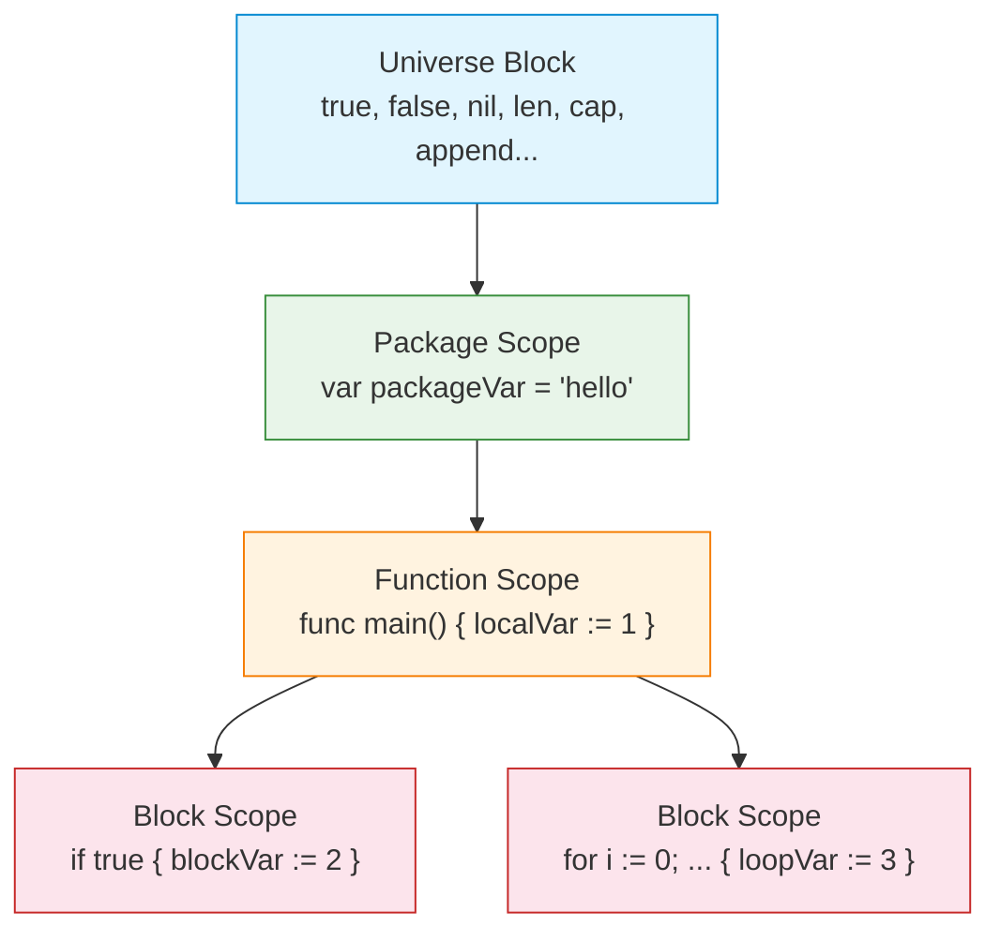
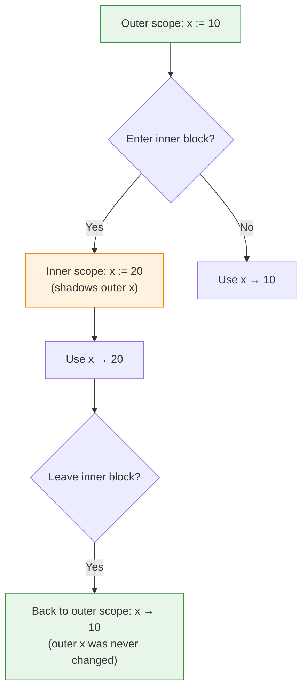
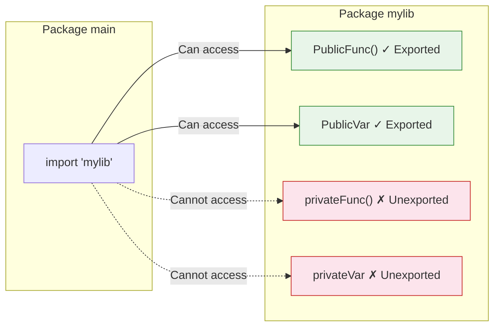

# Scope and Shadowing — Junior Level

## Table of Contents

1. [Introduction](#introduction)
2. [Prerequisites](#prerequisites)
3. [Glossary](#glossary)
4. [Core Concepts](#core-concepts)
5. [Real-World Analogies](#real-world-analogies)
6. [Mental Models](#mental-models)
7. [Pros & Cons](#pros--cons)
8. [Use Cases](#use-cases)
9. [Code Examples](#code-examples)
10. [Coding Patterns](#coding-patterns)
11. [Clean Code](#clean-code)
12. [Product Use / Feature](#product-use--feature)
13. [Error Handling](#error-handling)
14. [Security Considerations](#security-considerations)
15. [Performance Tips](#performance-tips)
16. [Metrics & Analytics](#metrics--analytics)
17. [Best Practices](#best-practices)
18. [Edge Cases & Pitfalls](#edge-cases--pitfalls)
19. [Common Mistakes](#common-mistakes)
20. [Common Misconceptions](#common-misconceptions)
21. [Tricky Points](#tricky-points)
22. [Test](#test)
23. [Tricky Questions](#tricky-questions)
24. [Cheat Sheet](#cheat-sheet)
25. [Self-Assessment Checklist](#self-assessment-checklist)
26. [Summary](#summary)
27. [What You Can Build](#what-you-can-build)
28. [Further Reading](#further-reading)
29. [Related Topics](#related-topics)
30. [Diagrams & Visual Aids](#diagrams--visual-aids)

---

## Introduction

> Focus: "What is it?"

**Scope** determines where a variable is visible and accessible in your Go program. When you declare a variable, it does not exist everywhere — it only exists within the curly braces `{}` where it was created. Once you leave those braces, the variable is gone.

**Shadowing** happens when you declare a new variable with the same name as an existing one in an outer scope. The inner variable "shadows" (hides) the outer one — the outer variable still exists, but you cannot see it while you are inside the inner scope.

Understanding scope and shadowing is critical because it prevents bugs where you think you are modifying one variable but are actually working with a completely different one that happens to share the same name.

---

## Prerequisites

- **Required:** Go installed (version 1.21+) — needed to compile and run examples
- **Required:** Understanding of variables and `:=` short declarations — scope rules apply to all variables
- **Required:** Understanding of `if`, `for`, and `switch` statements — these create new scopes
- **Helpful but not required:** Basic understanding of functions — functions create their own scope

---

## Glossary

| Term | Definition |
|------|-----------|
| **Scope** | The region of code where a variable is accessible and visible |
| **Block** | A section of code enclosed in curly braces `{}` |
| **Shadowing** | Declaring a new variable with the same name as one in an outer scope, hiding the outer one |
| **Package scope** | Variables declared outside any function, visible to the entire package |
| **Function scope** | Variables declared inside a function, visible only within that function |
| **Block scope** | Variables declared inside `if`, `for`, `switch`, or any `{}` block |
| **Exported** | An identifier starting with an uppercase letter, accessible from other packages |
| **Unexported** | An identifier starting with a lowercase letter, only accessible within its own package |
| **Universe block** | The outermost scope containing built-in identifiers like `true`, `false`, `nil`, `len` |
| **Short variable declaration** | Using `:=` to declare and assign a variable in one step |

---

## Core Concepts

### Concept 1: The Four Levels of Scope

Go has four levels of scope, from broadest to narrowest:

```go
// 1. Universe block — built-in identifiers (true, false, nil, len, cap, etc.)
// These are available everywhere without importing anything.

// 2. Package scope — declared outside any function
var packageVar = "I am visible in the entire package"

// 3. Function scope — declared inside a function
func main() {
    functionVar := "I am visible only inside main()"

    // 4. Block scope — declared inside if/for/switch/{}
    if true {
        blockVar := "I am visible only inside this if block"
        fmt.Println(blockVar)      // OK
        fmt.Println(functionVar)   // OK — outer scope is visible
        fmt.Println(packageVar)    // OK — package scope is visible
    }
    // fmt.Println(blockVar) // ERROR — blockVar is not visible here
}
```

### Concept 2: Package Scope vs Function Scope

```go
package main

import "fmt"

// Package-level variable — visible to ALL functions in this package
var greeting = "Hello"

func main() {
    // Function-level variable — visible only inside main()
    name := "Alice"
    fmt.Println(greeting, name) // Hello Alice
    sayHello()
}

func sayHello() {
    fmt.Println(greeting) // OK — greeting is package-level
    // fmt.Println(name)  // ERROR — name is only in main()
}
```

### Concept 3: Exported vs Unexported Names

```go
package mypackage

// Exported — starts with uppercase, visible from other packages
var PublicName = "anyone can see me"

// Unexported — starts with lowercase, only visible within this package
var privateName = "only this package can see me"

// Exported function
func Calculate() int { return 42 }

// Unexported function
func helper() int { return 10 }
```

### Concept 4: Variable Shadowing Basics

```go
package main

import "fmt"

func main() {
    x := 10
    fmt.Println("outer x:", x) // outer x: 10

    if true {
        x := 20 // This creates a NEW variable x, shadowing the outer one
        fmt.Println("inner x:", x) // inner x: 20
    }

    fmt.Println("outer x after if:", x) // outer x after if: 10
    // The outer x was never changed!
}
```

### Concept 5: Shadowing with := in Control Structures

```go
package main

import "fmt"

func main() {
    err := "original error"
    fmt.Println("before if:", err) // before if: original error

    if x := 5; x > 0 {
        err := "new error" // SHADOWED — this is a new variable
        fmt.Println("inside if:", err) // inside if: new error
    }

    fmt.Println("after if:", err) // after if: original error
    // The outer err was not modified
}
```

### Concept 6: Universe Block — Built-in Identifiers

```go
package main

import "fmt"

func main() {
    // These are from the universe block — always available:
    fmt.Println(true)       // bool constant
    fmt.Println(false)      // bool constant
    fmt.Println(len("abc")) // built-in function

    // DANGER: You can shadow built-in identifiers!
    true := "this is a string now" // Shadows the built-in true
    fmt.Println(true)              // prints: this is a string now
    // The built-in true is now hidden in this scope!
}
```

---

## Real-World Analogies

| Concept | Analogy |
|---------|---------|
| **Scope** | A building with rooms — you can only use furniture (variables) in the room you are currently in |
| **Package scope** | The lobby of a building — everyone in the building can access it |
| **Function scope** | A private office — only people inside can use the desk and chair |
| **Block scope** | A closet inside the office — only accessible when the closet door is open |
| **Shadowing** | A person named "John" in your office hides the "John" in the lobby — when you say "John", you mean the one closest to you |
| **Exported names** | A public sign on the building — anyone walking by can read it |
| **Unexported names** | An internal memo — only employees inside the building can read it |
| **Universe block** | The sun and air — they exist everywhere, you do not need to create them |

---

## Mental Models

**Think of scope as nesting dolls (Matryoshka):**
- The outermost doll is the universe block (built-ins)
- The next doll is the package scope
- Inside that is the function scope
- The smallest dolls are block scopes (if, for, switch)

Each doll can see everything in the dolls that contain it, but NOT the dolls inside it.

**Think of shadowing as name tags:**
When two people wear the same name tag, you always talk to the one closest to you. The other person still exists — you just cannot see their name tag from where you are standing.

---

## Pros & Cons

| Pros | Cons |
|------|------|
| Limits variable lifetime, reducing memory usage | Can accidentally shadow and miss modifications |
| Prevents name collisions between functions | Shadowed variables cause subtle bugs |
| Exported/unexported provides simple encapsulation | New developers may not understand `:=` shadowing |
| Block scope keeps temporary variables contained | Error variable shadowing is a common trap |
| Makes code easier to reason about locally | No compiler warning for shadowing by default |

---

## Use Cases

1. **Temporary loop variables** — Loop counters only exist inside the loop
2. **Error handling chains** — Each `if err := ...` creates a scoped error variable
3. **Package encapsulation** — Unexported names hide implementation details
4. **API design** — Exported names form the public API of a package
5. **Resource cleanup** — Variables scoped to blocks are garbage-collected sooner

---

## Code Examples

### Example 1: Basic Scope Demonstration

```go
package main

import "fmt"

var global = "I am global"

func main() {
    local := "I am local to main"

    {
        inner := "I am in a bare block"
        fmt.Println(global) // OK
        fmt.Println(local)  // OK
        fmt.Println(inner)  // OK
    }

    fmt.Println(global) // OK
    fmt.Println(local)  // OK
    // fmt.Println(inner) // ERROR: undefined: inner
}
```

### Example 2: Shadowing in For Loop

```go
package main

import "fmt"

func main() {
    x := "outer"

    for i := 0; i < 3; i++ {
        x := fmt.Sprintf("loop-%d", i) // shadows outer x
        fmt.Println(x) // loop-0, loop-1, loop-2
    }

    fmt.Println(x) // outer — unchanged
}
```

### Example 3: Error Variable Shadowing Trap

```go
package main

import (
    "errors"
    "fmt"
)

func riskyOperation() error {
    return errors.New("something went wrong")
}

func main() {
    var err error // outer err

    if true {
        err := riskyOperation() // SHADOWED! This is a new err
        fmt.Println("inside:", err)
    }

    // outer err is still nil — the error was lost!
    fmt.Println("outside:", err) // outside: <nil>
}
```

### Example 4: Correct Way — Assign Without Shadowing

```go
package main

import (
    "errors"
    "fmt"
)

func riskyOperation() error {
    return errors.New("something went wrong")
}

func main() {
    var err error

    if true {
        err = riskyOperation() // Use = instead of := to modify outer err
        fmt.Println("inside:", err)
    }

    fmt.Println("outside:", err) // outside: something went wrong
}
```

### Example 5: Shadowing Built-in Identifiers

```go
package main

import "fmt"

func main() {
    // BAD: Shadowing the built-in len function
    len := 42
    fmt.Println(len) // 42

    // Now you cannot use the built-in len()!
    // size := len("hello") // ERROR: len is int, not a function

    // BAD: Shadowing nil
    // nil := "nothing" // This compiles but is very confusing
}
```

### Example 6: Function Parameters Create Their Own Scope

```go
package main

import "fmt"

var x = 100

func printX(x int) {
    // Parameter x shadows the package-level x
    fmt.Println("parameter x:", x)
}

func main() {
    printX(42)            // parameter x: 42
    fmt.Println("global x:", x) // global x: 100
}
```

### Example 7: Switch Case Scope

```go
package main

import "fmt"

func main() {
    value := 2

    switch value {
    case 1:
        msg := "one"
        fmt.Println(msg)
    case 2:
        msg := "two" // This msg is scoped to case 2 only
        fmt.Println(msg)
    case 3:
        // fmt.Println(msg) // ERROR: undefined — msg from case 2 is not visible
        msg := "three"
        fmt.Println(msg)
    }
}
```

---

## Coding Patterns

### Pattern 1: Scoped Resource Handling

```go
func processFile(path string) error {
    file, err := os.Open(path)
    if err != nil {
        return err
    }
    defer file.Close()

    // file is scoped to this function — cleaned up when function returns
    scanner := bufio.NewScanner(file)
    for scanner.Scan() {
        fmt.Println(scanner.Text())
    }
    return scanner.Err()
}
```

### Pattern 2: If-Scoped Variables

```go
func getUser(id int) (*User, error) {
    // user is scoped to this if block
    if user, err := db.FindUser(id); err != nil {
        return nil, fmt.Errorf("finding user %d: %w", id, err)
    } else {
        return user, nil
    }
}
```

---

## Clean Code

- **Keep variables as close to their usage as possible** — declare in the narrowest scope needed
- **Avoid reusing variable names in nested scopes** — prevents accidental shadowing
- **Use short names for short scopes** — `i`, `j`, `k` for loop counters is fine
- **Use descriptive names for wider scopes** — package-level variables need clear names
- **Never shadow built-in identifiers** — do not use `len`, `cap`, `true`, `false`, `nil` as variable names

---

## Product Use / Feature

Scope and shadowing directly impact how you structure Go applications:

- **HTTP handlers** — Request-scoped variables are created per request and garbage-collected after
- **Middleware chains** — Each middleware creates its own scope for request processing
- **Configuration** — Package-level variables hold app-wide config; function-level holds request-specific data
- **Goroutines** — Variables captured by closures follow scope rules; shadowing in goroutines is a common bug source

---

## Error Handling

```go
package main

import (
    "fmt"
    "os"
)

func readConfig(path string) (string, error) {
    // CORRECT: declare err once, reuse with =
    data, err := os.ReadFile(path)
    if err != nil {
        return "", fmt.Errorf("reading config: %w", err)
    }

    config := string(data)

    // CORRECT: err is reused here (not shadowed) because data is new
    // but if both variables existed, := would NOT create a new err
    return config, nil
}

func main() {
    config, err := readConfig("config.json")
    if err != nil {
        fmt.Println("Error:", err)
        os.Exit(1)
    }
    fmt.Println("Config:", config)
}
```

---

## Security Considerations

- **Do not shadow security-critical variables** — a shadowed `isAdmin` or `isAuthenticated` can bypass checks
- **Unexported fields protect internal state** — use lowercase names for sensitive data
- **Avoid package-level mutable state** — it can be modified from anywhere in the package, creating race conditions
- **Review shadowed error variables** — a lost error can hide security failures

```go
// DANGEROUS: Shadowing security variable
func checkAccess(userRole string) bool {
    isAllowed := false

    if userRole == "admin" {
        isAllowed := true // SHADOWED — outer isAllowed stays false
        _ = isAllowed     // suppresses unused warning
    }

    return isAllowed // Always returns false!
}
```

---

## Performance Tips

- **Narrow scope = earlier garbage collection** — variables in small blocks can be freed sooner
- **Package-level variables persist for the program lifetime** — use only when truly needed
- **Avoid unnecessary allocations in wide scopes** — declare large structures in the narrowest block
- **Compiler optimizations** — the Go compiler can optimize variables with shorter lifetimes more effectively
- **Stack vs heap** — narrowly scoped variables are more likely to stay on the stack

---

## Metrics & Analytics

| Metric | How to Measure |
|--------|---------------|
| Shadowed variables in codebase | Run `go vet -shadow ./...` (with shadow analyzer) |
| Scope depth | Count nesting levels — aim for max 3-4 levels |
| Package-level variables | Count `var` declarations outside functions — fewer is better |
| Exported identifiers | Count uppercase names — this is your public API surface |

---

## Best Practices

1. **Declare variables in the narrowest scope possible**
2. **Use `=` instead of `:=` when you want to modify an outer variable**
3. **Never shadow built-in identifiers** (`len`, `cap`, `true`, `false`, `nil`, `append`, `make`, `new`)
4. **Run `go vet` with the shadow analyzer regularly**
5. **Use `if init; condition {}` syntax to limit variable scope**
6. **Keep package-level variables to a minimum**
7. **Name exported identifiers carefully — they are your public API**
8. **When in doubt, use a different variable name**

---

## Edge Cases & Pitfalls

### Pitfall 1: := With Multiple Return Values

```go
func main() {
    x := 10
    // This does NOT shadow x because y is new — Go reuses existing x
    x, y := 20, 30
    fmt.Println(x, y) // 20 30
}
```

### Pitfall 2: Named Return Values and Shadowing

```go
func divide(a, b float64) (result float64, err error) {
    if b == 0 {
        err := fmt.Errorf("division by zero") // SHADOWED named return
        _ = err
        return // returns 0, nil — NOT what you want!
    }
    return a / b, nil
}
```

### Pitfall 3: Loop Variable Scope (Pre-Go 1.22)

```go
func main() {
    funcs := make([]func(), 3)
    for i := 0; i < 3; i++ {
        funcs[i] = func() {
            fmt.Println(i) // Before Go 1.22: all print 3
        }                  // Go 1.22+: prints 0, 1, 2
    }
    for _, f := range funcs {
        f()
    }
}
```

---

## Common Mistakes

| Mistake | Why It Happens | Fix |
|---------|---------------|-----|
| Using `:=` when `=` is intended | Habit of always using `:=` | Check if the variable already exists in outer scope |
| Shadowing `err` in if blocks | Each `if err := ...` creates a new err | Declare `err` once, use `=` in subsequent assignments |
| Shadowing built-in names | Using `len`, `cap` as variable names | Choose different names: `length`, `capacity` |
| Expecting inner change to affect outer | Not understanding block scope | Use `=` to modify outer variables |
| Not realizing `for` creates a scope | Init statement variables are scoped to the loop | This is by design — embrace it |

---

## Common Misconceptions

| Misconception | Reality |
|--------------|---------|
| "`:=` always creates a new variable" | If at least one variable on the left is new, `:=` reuses existing ones |
| "Shadowing is always bad" | Sometimes it is intentional — e.g., scoping `err` to an if block |
| "Package-level variables are global" | They are visible to the package, not the entire program |
| "The compiler warns about shadowing" | Go compiler does NOT warn — you need `go vet -shadow` |
| "Exported means public to everyone" | Exported means public to other packages that import yours |

---

## Tricky Points

1. **`:=` reuse rule** — In `a, b := expr`, if `a` already exists in the current scope, it is reused (not shadowed). But if `a` exists only in an outer scope, a new `a` is created (shadowing).

2. **Named returns are in function scope** — Named return values are variables at the function scope level. You can accidentally shadow them inside blocks.

3. **`if init; cond` scope** — The variable declared in the init part of `if` is visible in both the `if` body and the `else` body, but NOT outside the `if` statement.

```go
if x := compute(); x > 0 {
    fmt.Println(x) // OK
} else {
    fmt.Println(x) // OK — x is visible in else too
}
// fmt.Println(x) // ERROR — x is out of scope
```

---

## Test

<details>
<summary><strong>Question 1:</strong> What will this code print?</summary>

```go
x := 5
if true {
    x := 10
    fmt.Println(x)
}
fmt.Println(x)
```

**Answer:** It prints `10` then `5`. The inner `x := 10` shadows the outer `x`, and the outer `x` remains unchanged.

</details>

<details>
<summary><strong>Question 2:</strong> True or False — The Go compiler gives a warning when you shadow a variable.</summary>

**Answer:** False. The Go compiler does not warn about shadowing. You need to use `go vet` with the shadow analyzer to detect it.

</details>

<details>
<summary><strong>Question 3:</strong> What is the universe block?</summary>

**Answer:** The universe block is the outermost scope in Go that contains all built-in identifiers: `true`, `false`, `nil`, `len`, `cap`, `append`, `make`, `new`, `copy`, `delete`, `panic`, `recover`, `print`, `println`, and all built-in types like `int`, `string`, `bool`, `error`.

</details>

<details>
<summary><strong>Question 4:</strong> Can you shadow the built-in identifier <code>true</code>?</summary>

**Answer:** Yes, Go allows you to shadow any built-in identifier. Writing `true := 42` is valid but extremely dangerous and confusing.

</details>

<details>
<summary><strong>Question 5:</strong> What will this code print?</summary>

```go
x := 1
x, y := 2, 3
fmt.Println(x, y)
```

**Answer:** It prints `2 3`. Because `y` is new, `:=` reuses the existing `x` (assigns to it) instead of creating a new one.

</details>

---

## Tricky Questions

1. **Q:** If you declare `err` with `:=` inside an `if` block, does the outer `err` get modified?
   **A:** No. `:=` inside a new block always creates a new variable, even if one with the same name exists outside.

2. **Q:** Can two functions in the same package have local variables with the same name?
   **A:** Yes. Each function has its own scope, so there is no conflict.

3. **Q:** What happens if you shadow `len` and then try to use `len()` on a slice?
   **A:** You get a compile error because `len` now refers to your variable, not the built-in function.

4. **Q:** Is a variable declared in a `for` loop's init statement visible outside the loop?
   **A:** No. The variable `i` in `for i := 0; ...` is scoped to the loop.

5. **Q:** Does Go have file-level scope?
   **A:** Not exactly. Package-level declarations are visible across all files in the same package. However, import statements are file-scoped.

---

## Cheat Sheet

| Scope Level | Declared Where | Visible Where |
|------------|---------------|--------------|
| Universe | Built into language | Everywhere |
| Package | Outside any function | All files in the package |
| File | `import` statements | Only the declaring file |
| Function | Inside a function | Entire function body |
| Block | Inside `{}` | Only within those braces |

| Action | Syntax | Shadows? |
|--------|--------|----------|
| New variable in same scope | `x := 5` | No (reuse if exists) |
| New variable in inner scope | `x := 5` inside `{}` | Yes |
| Modify outer variable | `x = 5` | No |
| Multiple return with existing var | `x, y := f()` | No (reuses x if in same scope) |
| Exported name | `MyVar` (uppercase) | Visible to other packages |
| Unexported name | `myVar` (lowercase) | Package-only |

---

## Self-Assessment Checklist

- [ ] I can explain the four levels of scope in Go
- [ ] I understand the difference between `:=` and `=` regarding shadowing
- [ ] I know what exported and unexported names mean
- [ ] I can identify when a variable is being shadowed
- [ ] I know what the universe block contains
- [ ] I understand why shadowing `err` is dangerous
- [ ] I know how to use `go vet` to detect shadowing
- [ ] I can explain why `if init; cond {}` is useful for scope
- [ ] I understand the loop variable capture issue (pre-Go 1.22)

---

## Summary

- **Scope** determines where a variable is visible — Go has universe, package, file (imports), function, and block scopes
- **Shadowing** occurs when an inner scope declares a variable with the same name as an outer scope
- The `:=` operator is the most common source of accidental shadowing
- **Exported** names (uppercase) are visible outside the package; **unexported** (lowercase) are not
- **Never shadow built-in identifiers** like `len`, `cap`, `true`, `false`, `nil`
- Use `go vet -shadow` to detect shadowing in your code
- When you want to modify an outer variable, use `=` instead of `:=`
- Go 1.22+ fixed the loop variable capture issue with per-iteration scoping

---

## What You Can Build

With a solid understanding of scope and shadowing, you can:

- **Write bug-free error handling** — properly propagate errors without losing them
- **Design clean package APIs** — export only what is necessary
- **Structure middleware** — use request-scoped variables safely
- **Avoid common interview pitfalls** — scope questions are frequent in Go interviews
- **Read and review others' code** — spot shadowing bugs in code reviews

---

## Further Reading

- [Go Specification: Declarations and scope](https://go.dev/ref/spec#Declarations_and_scope)
- [Effective Go: Names](https://go.dev/doc/effective_go#names)
- [Go Blog: Fixing For Loops in Go 1.22](https://go.dev/blog/loopvar-preview)
- [Go Vet: Shadow Analyzer](https://pkg.go.dev/golang.org/x/tools/go/analysis/passes/shadow)
- [A Tour of Go: Variables](https://go.dev/tour/basics/8)

---

## Related Topics

- [Variables and Constants](/golang/02-language-basics/01-variables-and-constants/) — where scope rules first apply
- [Functions](/golang/02-language-basics/03-functions/) — function scope and closures
- [Packages](/golang/03-packages/) — package scope and exported names
- [Error Handling](/golang/04-error-handling/) — error variable shadowing
- [Goroutines](/golang/05-concurrency/) — scope and closures in goroutines

---

## Diagrams & Visual Aids

### Scope Nesting Diagram



### Shadowing Flow



### Exported vs Unexported


