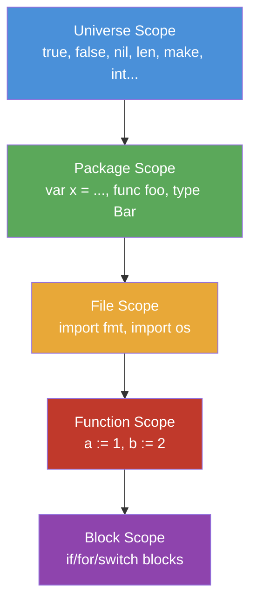
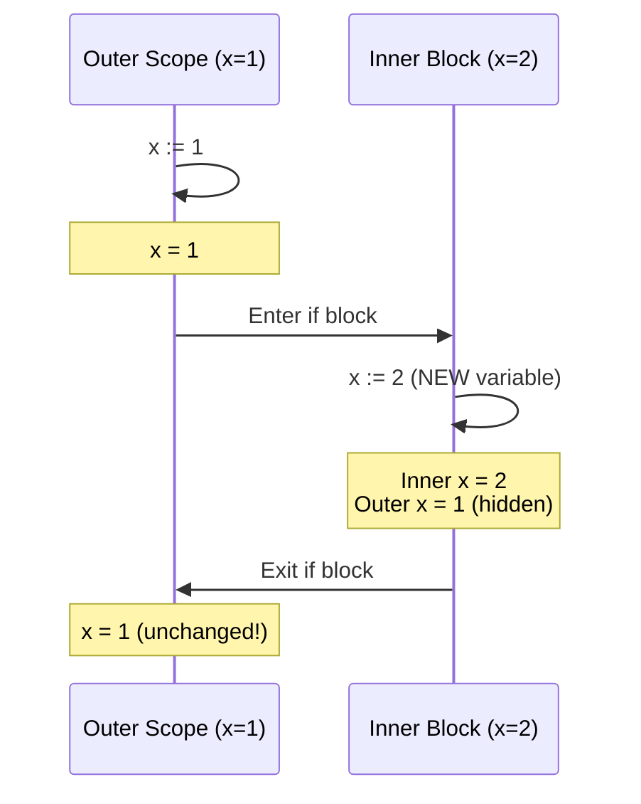
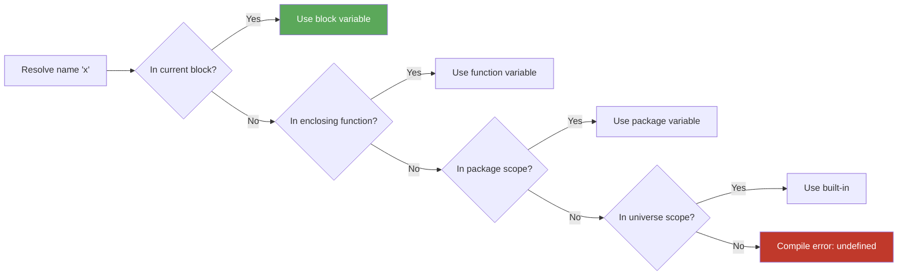

# Scope and Shadowing — Junior Level

## Table of Contents
1. [Introduction](#introduction)
2. [Prerequisites](#prerequisites)
3. [Glossary](#glossary)
4. [Core Concepts](#core-concepts)
5. [Real-World Analogies](#real-world-analogies)
6. [Mental Models](#mental-models)
7. [Pros & Cons](#pros--cons)
8. [Use Cases](#use-cases)
9. [Code Examples](#code-examples)
10. [Coding Patterns](#coding-patterns)
11. [Clean Code](#clean-code)
12. [Product Use / Feature](#product-use--feature)
13. [Error Handling](#error-handling)
14. [Security Considerations](#security-considerations)
15. [Performance Tips](#performance-tips)
16. [Metrics & Analytics](#metrics--analytics)
17. [Best Practices](#best-practices)
18. [Edge Cases & Pitfalls](#edge-cases--pitfalls)
19. [Common Mistakes](#common-mistakes)
20. [Common Misconceptions](#common-misconceptions)
21. [Tricky Points](#tricky-points)
22. [Test](#test)
23. [Tricky Questions](#tricky-questions)
24. [Cheat Sheet](#cheat-sheet)
25. [Self-Assessment Checklist](#self-assessment-checklist)
26. [Summary](#summary)
27. [What You Can Build](#what-you-can-build)
28. [Further Reading](#further-reading)
29. [Related Topics](#related-topics)
30. [Diagrams & Visual Aids](#diagrams--visual-aids)

---

## Introduction

> Focus: "What is it?" and "How to use it?"

Scope and shadowing are two foundational concepts every Go programmer must understand. They determine **where** a variable is visible and **which** variable is referred to when two variables share the same name.

**Scope** answers: "Can I use this variable here?"

**Shadowing** answers: "If two variables have the same name, which one am I using?"

These are not unique to Go — every programming language has scope rules — but Go's combination of block scoping and the `:=` short declaration operator creates a particular category of bugs that trips up beginners and even experienced developers.

Understanding these concepts will:
- Help you write correct code the first time
- Help you read other people's code accurately
- Save you hours of debugging mysterious bugs

---

## Prerequisites

- Basic Go syntax (variables, functions)
- Understanding of `var` and `:=` declarations
- Familiarity with `if`, `for`, and function blocks
- Basic understanding of packages

---

## Glossary

| Term | Definition |
|------|-----------|
| **Scope** | The region of code where a variable or identifier is accessible |
| **Block** | A sequence of code enclosed in `{}` curly braces |
| **Shadowing** | When an inner variable hides an outer variable with the same name |
| **Identifier** | A name given to a variable, function, type, or constant |
| **Predeclared** | Identifiers built into Go (like `true`, `false`, `nil`, `len`) |
| **Package scope** | Declarations accessible from any file in the same package |
| **Universe scope** | The outermost scope containing all built-in Go identifiers |
| **Short declaration** | Using `:=` to declare and initialize a variable |
| **Exported** | Identifier starting with uppercase, accessible from other packages |
| **Unexported** | Identifier starting with lowercase, only accessible within its package |

---

## Core Concepts

### 1. What is Scope?

Scope defines the **lifetime and visibility** of a variable. In Go, every variable is only visible within the block where it was declared (and any nested blocks inside that block).

Go has four levels of scope, from outermost to innermost:

```
Universe Scope
  └── Package Scope
        └── File Scope (only for imports)
              └── Function Scope
                    └── Block Scope (if, for, switch...)
```

#### Universe Scope
These are Go's predeclared identifiers — they exist everywhere in every Go program:
- Types: `bool`, `int`, `string`, `byte`, `rune`, `float64`, etc.
- Constants: `true`, `false`, `iota`
- Zero value: `nil`
- Functions: `len`, `cap`, `make`, `new`, `append`, `copy`, `delete`, `close`, `panic`, `recover`, `print`, `println`

You can use `len` or `true` in any Go file without declaring them — they come from the universe scope.

#### Package Scope
Variables, constants, types, and functions declared at the top level of a file (outside any function) belong to the package scope. They are accessible from **any file** in the same package.

```go
package main

// This variable is in package scope — visible everywhere in this package
var globalMessage = "Hello from package scope"

func main() {
    fmt.Println(globalMessage) // Works fine
}

func anotherFunc() {
    fmt.Println(globalMessage) // Also works fine
}
```

#### File Scope
Only `import` declarations have file scope. An import statement in `file_a.go` is NOT visible in `file_b.go`. Each file must import its own packages.

```go
// file_a.go
import "fmt"  // Only visible in file_a.go

// file_b.go
// Must also import "fmt" independently
import "fmt"
```

#### Function Scope
Variables declared inside a function are visible throughout that function (after the point of declaration).

```go
func greet() {
    name := "Alice"        // function scope
    greeting := "Hello"    // function scope
    fmt.Println(greeting, name)
}
```

#### Block Scope
Variables declared inside `{}` blocks are only visible within that block.

```go
func example() {
    x := 10  // function scope

    if x > 5 {
        y := 20  // block scope — only visible inside this if block
        fmt.Println(x, y)  // both accessible here
    }

    // fmt.Println(y)  // ERROR: y is not defined here
    fmt.Println(x)     // x is still accessible
}
```

### 2. What is Shadowing?

Shadowing happens when you declare a new variable with the same name as a variable in an outer scope. The inner variable **shadows** (hides) the outer one within that inner block.

```go
package main

import "fmt"

func main() {
    x := 1
    fmt.Println(x) // prints: 1

    if true {
        x := 2           // NEW variable x — shadows the outer x
        fmt.Println(x)   // prints: 2
    }

    fmt.Println(x) // prints: 1 — outer x was NEVER changed!
}
```

The outer `x` was never modified. The `x := 2` inside the `if` block created a completely new variable that happened to share the same name.

### 3. How Go Resolves Names

When Go sees a variable name, it looks for it starting from the **innermost scope** and moving outward:

1. Current block
2. Enclosing block(s)
3. Function scope
4. Package scope
5. Universe scope

The first match it finds is the one it uses.

---

## Real-World Analogies

### Analogy 1: Nested Rooms
Imagine a house with nested rooms:
- The house is the **package scope**
- Each room is a **function**
- A closet inside a room is a **block** (if/for block)

A poster hanging in the closet is only visible inside the closet. A poster in the room is visible everywhere in the room, including the closet. A sign on the front of the house is visible from outside (exported).

If you hang a "Welcome" poster in both the room and the closet, someone in the closet sees the closet's poster — the room's poster is hidden (shadowed) for that person.

### Analogy 2: Variable Names as Name Tags
Imagine a family reunion with people wearing name tags:
- Your grandmother's house = package scope
- A specific room = function scope
- A corner of that room = block scope

If both your cousin and uncle are named "Bob", when you're standing in the corner with your cousin, you mean your cousin when you say "Bob". Your uncle (the outer Bob) is shadowed.

### Analogy 3: Stack of Papers
Scope is like a stack of papers. When you look up a name, you check the paper on top first. If you find the name there, you use it — even if the same name appears on a paper lower in the stack.

---

## Mental Models

### The "Bubble" Model
Each `{}` block creates a new bubble. Variables inside a bubble are invisible outside it. Inner bubbles can see outer bubbles, but not vice versa.

```
Outer bubble {
    x := 1       // visible in outer and all inner bubbles

    Inner bubble {
        y := 2   // only visible in inner bubble
        x := 3   // NEW x in this bubble — shadows outer x
        // Inside here: x = 3, y = 2
    }

    // Here: x = 1, y is gone
}
```

### The "Stack" Model
Think of scopes as a stack of lookup tables. When resolving a name, Go searches from top to bottom — innermost scope first.

```
[Block scope table: x=3, y=2]   ← search here first
[Function scope table: x=1]      ← then here
[Package scope table: ...]        ← then here
[Universe scope table: len, true] ← finally here
```

---

## Pros & Cons

### Benefits of Block Scoping
| Benefit | Description |
|---------|-------------|
| Encapsulation | Variables only exist where needed |
| Reduced naming conflicts | Same name can be used in different scopes |
| Garbage collection | Variables go out of scope and can be collected |
| Readability | Smaller scope = easier to track variable lifetime |

### Risks of Shadowing
| Risk | Description |
|------|-------------|
| Silent bugs | Code compiles but does wrong thing |
| Misleading logic | You think you're using the outer variable |
| Hard to debug | No compiler error, just wrong behavior |

---

## Use Cases

### When Scope is Your Friend
1. **Loop variables** — `i` in a for loop doesn't pollute outer scope
2. **Error handling** — `err` in an if block is contained
3. **Temporary calculations** — helper variables only live as long as needed

### When Shadowing Helps (Intentionally)
```go
// Intentional shadowing: narrowing a type
var result interface{} = fetchData()

if data, ok := result.(string); ok {
    // data is string here, shadows nothing harmful
    fmt.Println(data)
}
```

---

## Code Examples

### Example 1: Basic Scope Levels

```go
package main

import "fmt"

// Package scope
var packageVar = "I am package-scoped"

func main() {
    // Function scope
    funcVar := "I am function-scoped"

    {
        // Block scope
        blockVar := "I am block-scoped"
        fmt.Println(packageVar) // OK
        fmt.Println(funcVar)    // OK
        fmt.Println(blockVar)   // OK
    }

    fmt.Println(packageVar) // OK
    fmt.Println(funcVar)    // OK
    // fmt.Println(blockVar) // ERROR: blockVar is undefined here
}
```

### Example 2: The Classic Shadow Bug

```go
package main

import "fmt"

func main() {
    x := 1
    fmt.Println("Before if:", x) // 1

    if true {
        x := 2 // Shadow! New variable, NOT assignment to outer x
        fmt.Println("Inside if:", x) // 2
    }

    fmt.Println("After if:", x) // 1 — outer x unchanged!
}
```

### Example 3: Shadow with err (Common Bug)

```go
package main

import (
    "errors"
    "fmt"
)

func doA() error { return errors.New("error from A") }
func doB() error { return nil }

func buggyVersion() {
    err := doA()
    fmt.Println("err from A:", err) // error from A

    if err != nil {
        err := doB() // BUG: new err! outer err still holds doA's error
        fmt.Println("err from B:", err) // nil
        _ = err
    }

    fmt.Println("final err:", err) // still error from A — not what we wanted?
}

func correctVersion() {
    err := doA()
    fmt.Println("err from A:", err) // error from A

    if err != nil {
        err = doB() // Correct: assign to existing err (= not :=)
        fmt.Println("err from B:", err) // nil
    }

    fmt.Println("final err:", err) // nil — as expected
}

func main() {
    fmt.Println("--- Buggy version ---")
    buggyVersion()
    fmt.Println("--- Correct version ---")
    correctVersion()
}
```

### Example 4: For Loop Scope

```go
package main

import "fmt"

func main() {
    // i is scoped to the for loop
    for i := 0; i < 3; i++ {
        fmt.Println(i)
    }
    // fmt.Println(i) // ERROR: i is undefined here

    // Short variable declaration in if initializer
    if value := computeValue(); value > 10 {
        fmt.Println("Large value:", value)
    }
    // value is not accessible here
}

func computeValue() int {
    return 42
}
```

### Example 5: Shadowing Built-in Identifiers

```go
package main

import "fmt"

func main() {
    // DO NOT do this in real code!
    // This compiles but is very confusing:
    len := 5          // shadows the built-in len function
    fmt.Println(len)  // prints 5

    // Now you can't use len() as a function in this scope!
    // s := []int{1, 2, 3}
    // fmt.Println(len(s)) // ERROR: len is not a function here
}
```

### Example 6: Switch Statement Scope

```go
package main

import "fmt"

func main() {
    x := 10

    switch {
    case x > 5:
        message := "big"   // scoped to this case block
        fmt.Println(message)
    case x > 0:
        message := "small" // different variable, same name — OK
        fmt.Println(message)
    }
    // message is not accessible here
}
```

---

## Coding Patterns

### Pattern 1: Scoped Error Handling

```go
func processFile(path string) error {
    f, err := os.Open(path)
    if err != nil {
        return fmt.Errorf("open: %w", err)
    }
    defer f.Close()

    data, err := io.ReadAll(f) // reuses err — no shadowing
    if err != nil {
        return fmt.Errorf("read: %w", err)
    }

    fmt.Println(string(data))
    return nil
}
```

### Pattern 2: If with Initialization

```go
// Scoped variable in if init statement
func findUser(id int) {
    if user, err := db.Find(id); err != nil {
        log.Printf("user not found: %v", err)
    } else {
        fmt.Println("Found:", user.Name)
    }
    // user and err are NOT accessible here — clean!
}
```

### Pattern 3: Avoiding Shadow in Loops

```go
// Instead of:
for _, item := range items {
    result := process(item)
    // use result...
}

// Be careful with:
result := ""
for _, item := range items {
    result = process(item) // assignment, not declaration
    fmt.Println(result)
}
```

---

## Clean Code

### Do This

```go
// Clear, unambiguous variable names in nested scopes
func handleRequest(r *http.Request) {
    userID := r.Header.Get("X-User-ID")

    if userID == "" {
        log.Println("missing user ID")
        return
    }

    userData, err := fetchUser(userID)
    if err != nil {
        log.Printf("fetch user %s: %v", userID, err)
        return
    }

    _ = userData
}
```

### Avoid This

```go
// Confusing: x used in multiple scopes
func confusing() {
    x := getData()
    if x != nil {
        x := process(x) // shadows outer x
        if x != nil {
            x := format(x) // shadows again!
            fmt.Println(x)
        }
    }
}
```

---

## Product Use / Feature

In real products, scope and shadowing issues appear most often in:

1. **HTTP handlers** — `err` shadowed across multiple operation calls
2. **Database queries** — `result` or `rows` shadowed in nested blocks
3. **Configuration loading** — `config` variable shadowed when merging configs
4. **Authentication middleware** — `user` or `token` shadowed in validation blocks

Example from a real-world HTTP handler:

```go
func createUserHandler(w http.ResponseWriter, r *http.Request) {
    var req CreateUserRequest
    if err := json.NewDecoder(r.Body).Decode(&req); err != nil {
        http.Error(w, "invalid body", http.StatusBadRequest)
        return
    }

    if err := validateRequest(req); err != nil { // reuses err correctly
        http.Error(w, err.Error(), http.StatusUnprocessableEntity)
        return
    }

    user, err := userService.Create(r.Context(), req) // reuses err correctly
    if err != nil {
        http.Error(w, "internal error", http.StatusInternalServerError)
        return
    }

    json.NewEncoder(w).Encode(user)
}
```

---

## Error Handling

The most common shadow bug in Go is with `err`. Here are the rules:

```go
// WRONG — err is shadowed inside the if block
func wrong() error {
    result, err := step1()
    if err == nil {
        result, err := step2(result) // NEW err! NOT updating outer err
        if err == nil {
            return step3(result)
        }
    }
    return err // This might be nil even if step2 failed!
}

// CORRECT — use = to assign to existing err
func correct() error {
    result, err := step1()
    if err != nil {
        return err
    }

    result, err = step2(result) // = not :=
    if err != nil {
        return err
    }

    return step3(result)
}
```

---

## Security Considerations

Shadowing can create security vulnerabilities:

```go
// DANGEROUS: security check bypassed by shadowing
func authenticate(token string) bool {
    authorized := false

    if token != "" {
        authorized := checkToken(token) // shadows outer authorized!
        _ = authorized                   // inner variable unused warning
    }

    return authorized // always returns false!
}

// CORRECT:
func authenticateCorrect(token string) bool {
    authorized := false

    if token != "" {
        authorized = checkToken(token) // assigns to outer authorized
    }

    return authorized
}
```

Always use linters (`go vet`, `staticcheck`) to catch these in code review.

---

## Performance Tips

Scope has minimal direct performance impact, but:

1. **Smaller scope = faster GC** — variables go out of scope sooner
2. **Stack vs heap** — local variables with small scope are more likely to stay on the stack (compiler escape analysis)
3. **Avoid large package-scope variables** — they live for the entire program lifetime

```go
// Prefer: scoped to function
func process() {
    buf := make([]byte, 1024) // may stay on stack
    // use buf...
}

// Avoid: package-level buffer (shared, harder to GC)
var globalBuf = make([]byte, 1024)
```

---

## Metrics & Analytics

When reviewing code for scope/shadowing issues, track:
- Number of shadowing warnings from `go vet -shadow`
- Depth of variable nesting (> 3 levels is a warning sign)
- Repeated variable names across nested scopes in the same function

---

## Best Practices

1. **Use `=` (not `:=`) when you mean to update an existing variable**
2. **Give variables descriptive names** — `outerErr` vs `innerErr` if both needed
3. **Keep functions short** — reduces nesting depth and shadowing opportunity
4. **Enable the shadow linter** in your CI pipeline
5. **Avoid shadowing package names** (`fmt`, `os`, `io`, etc.)
6. **Avoid shadowing built-ins** (`len`, `cap`, `make`, `new`, `error`)
7. **Declare variables as close to their use as possible**

```go
// Good: declare close to use
func good() {
    // ... some code ...
    result, err := compute()
    if err != nil {
        return
    }
    use(result)
}

// Avoid: declare far from use
func avoid() {
    var result int
    var err error
    // ... many lines later ...
    result, err = compute()
    if err != nil {
        return
    }
    use(result)
}
```

---

## Edge Cases & Pitfalls

### Pitfall 1: Mixed `:=` with Multiple Return Values

```go
func example() {
    x, err := step1()  // both x and err are new
    y, err := step2()  // y is new, err is REUSED (no shadowing here!)
    // This is valid because at least one variable on the left is new
    _, _ = x, y
}
```

When using `:=` with multiple variables, Go requires at least one **new** variable on the left side. Existing variables are simply assigned.

### Pitfall 2: Short Declaration in If Initializer

```go
func example() {
    err := errors.New("outer")

    // x and err are NEW inside this if block's scope
    if x, err := compute(); err != nil {
        fmt.Println(x, err) // inner err
    }

    fmt.Println(err) // outer err — still "outer"!
}
```

### Pitfall 3: Switch Cases Don't Share Scope

```go
switch x {
case 1:
    v := "one"
    fmt.Println(v)
case 2:
    // v is not accessible here — each case has its own scope
    fmt.Println("two")
}
```

---

## Common Mistakes

### Mistake 1: Using `:=` When You Mean `=`

```go
// BUG
total := 0
for _, n := range numbers {
    total := total + n  // creates new total each iteration!
    _ = total
}
fmt.Println(total) // always 0!

// FIX
total := 0
for _, n := range numbers {
    total = total + n  // updates the outer total
}
fmt.Println(total) // correct sum
```

### Mistake 2: Shadowing `err` in if block

```go
// BUG
err := doFirst()
if err != nil {
    err := handleError(err) // new err, not updating outer
    fmt.Println(err)
}
// outer err is unchanged

// FIX
err := doFirst()
if err != nil {
    err = handleError(err) // update outer err
    fmt.Println(err)
}
```

### Mistake 3: Shadowing Package Names

```go
// BUG
import "fmt"

func bad() {
    fmt := "hello" // shadows fmt package!
    // Can no longer use fmt.Println
    _ = fmt
}

// FIX: use a different variable name
func good() {
    message := "hello" // descriptive name, no conflict
    fmt.Println(message)
}
```

---

## Common Misconceptions

| Misconception | Reality |
|--------------|---------|
| "`:=` updates the existing variable" | `:=` creates a NEW variable in the current scope |
| "Shadowing is a compiler error" | It is valid Go — just potentially confusing |
| "Package scope means global" | It's only global within the package, not across packages |
| "Import is package-scoped" | Imports are FILE-scoped — each file needs its own imports |
| "Outer variable changes when inner changes" | Inner and outer are completely separate variables |

---

## Tricky Points

### Point 1: `:=` Reuses Existing Variables in Multi-Assignment

```go
func tricky() {
    a, err := step1()  // new: a and err
    b, err := step2()  // new: b; REUSED: err (no shadow here)
    c, err := step3()  // new: c; REUSED: err
    _, _, _ = a, b, c
}
```

This is NOT shadowing — `err` is reused across all three lines.

### Point 2: For Loop Variable Scope

```go
// The loop variable i is in the for block's scope
for i := 0; i < 3; i++ {
    // i is accessible here
}
// i is NOT accessible here
```

### Point 3: Function Parameters Have Function Scope

```go
func greet(name string) {  // name has function scope
    if true {
        name := "Bob"  // shadows the parameter!
        fmt.Println(name) // Bob
    }
    fmt.Println(name) // Alice (parameter unchanged)
}
```

---

## Test

### Quiz 1: What does this print?

```go
x := 10
{
    x := 20
    fmt.Println(x)
}
fmt.Println(x)
```

**Answer:** `20` then `10`

### Quiz 2: Is this valid Go?

```go
len := 10
fmt.Println(len)
```

**Answer:** Yes, it compiles. `len` shadows the built-in. But it's bad practice.

### Quiz 3: What is `total` at the end?

```go
total := 0
for i := 0; i < 3; i++ {
    total := i * 2
    _ = total
}
fmt.Println(total)
```

**Answer:** `0` — because `total := i * 2` creates a new variable each iteration.

### Quiz 4: Does this compile?

```go
import "fmt"

func f() {
    fmt := "hello"
    _ = fmt
    fmt.Println("world") // ??
}
```

**Answer:** No — after `fmt := "hello"`, `fmt` is a string, not the package. `fmt.Println` is invalid.

---

## Tricky Questions

**Q: Can you shadow a function parameter?**
Yes! Function parameters are in function scope. Any inner block can declare a variable with the same name.

**Q: Does `:=` always create a new variable?**
Not exactly. In multi-variable declarations (`a, b := ...`), if `a` already exists in the current scope, it is reassigned. But if only `a` exists and `b` is new, then `b` is created and `a` is reassigned. The key rule: at least one variable must be new.

**Q: What is the scope of a variable declared in a `for` range clause?**
It is scoped to the `for` block — not visible outside.

**Q: Can two files in the same package access each other's imports?**
No. Imports are file-scoped. Each file must import its own packages.

---

## Cheat Sheet

```
SCOPE LEVELS (outermost to innermost):
  Universe  → true, false, nil, int, len, make, ...
  Package   → top-level var, func, type, const
  File      → import declarations only
  Function  → declared inside a function
  Block     → declared inside {}, if, for, switch, select

SHADOWING RULES:
  Inner scope can declare same name as outer scope
  Inner variable HIDES outer variable (outer is unchanged)
  Go resolves names from innermost to outermost scope

SAFE PATTERNS:
  Use =  (assignment) to update existing variable
  Use := (declaration) to create a new variable
  Use different names for different things

COMMON TRAPS:
  err := in nested if   → shadows outer err
  x :=  in for body     → shadows outer x, not accumulated
  fmt := "..."          → shadows the fmt package!
  len := 5              → shadows built-in len()
```

---

## Self-Assessment Checklist

- [ ] I can explain the 4 levels of scope in Go
- [ ] I understand the difference between `=` and `:=`
- [ ] I can identify when a variable is being shadowed
- [ ] I know what happens to the outer variable when it is shadowed
- [ ] I can explain why shadowing the `err` variable is dangerous
- [ ] I know how to avoid shadowing package names
- [ ] I know that imports are file-scoped (not package-scoped)
- [ ] I can trace through a function with multiple scopes and know which `x` is which

---

## Summary

- **Scope** defines where a variable is visible. Go uses block scoping — variables are visible only within the `{}` block where they are declared.
- There are 4 scope levels: universe, package, file (imports only), and function/block.
- **Shadowing** occurs when an inner declaration uses the same name as an outer variable. The outer variable is hidden but unchanged.
- The most common bug: using `:=` in a nested block when you meant `=`, creating a new variable instead of updating the outer one.
- Never shadow package names (`fmt`, `os`) or built-ins (`len`, `cap`, `make`).
- Use linters to catch accidental shadowing.

---

## What You Can Build

With a solid understanding of scope and shadowing, you can:
- Write error-handling code without accidentally losing errors
- Build nested logic without scope-related bugs
- Read and debug other people's Go code accurately
- Pass junior-level Go interviews confidently
- Avoid one of the most common categories of Go bugs

---

## Further Reading

- [Go Specification: Declarations and Scope](https://go.dev/ref/spec#Declarations_and_scope)
- [Effective Go: Variables](https://go.dev/doc/effective_go#variables)
- [The Go Blog: Short variable declarations](https://go.dev/doc/effective_go#redeclaration)
- [go vet documentation](https://pkg.go.dev/cmd/vet)

---

## Related Topics

- Variables and Constants in Go
- Short Variable Declarations (`:=`)
- Closures in Go
- Error Handling Patterns
- Go Linting Tools (`go vet`, `staticcheck`)
- Package Organization

---

## Diagrams & Visual Aids

### Diagram 1: Scope Hierarchy



### Diagram 2: Shadowing — What Happens to Variables



### Diagram 3: Name Resolution Order


