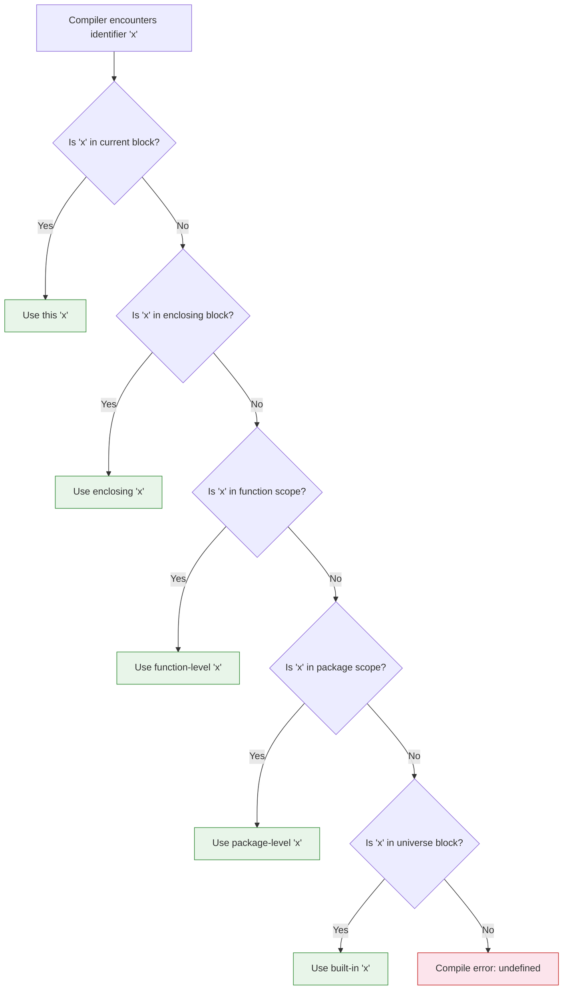
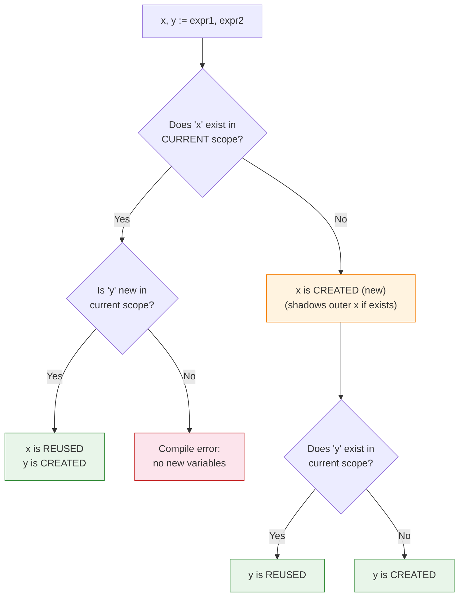
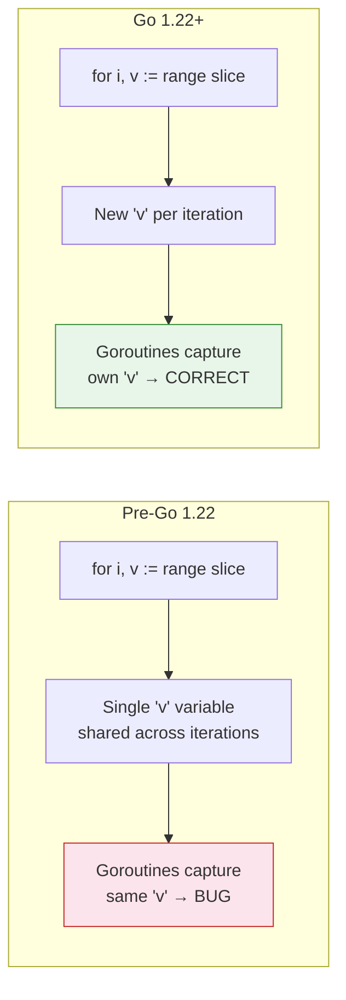

# Scope and Shadowing — Middle Level

## Table of Contents

1. [Introduction](#introduction)
2. [Core Concepts](#core-concepts)
3. [Evolution & History](#evolution--history)
4. [Pros & Cons](#pros--cons)
5. [Alternative Approaches](#alternative-approaches)
6. [Use Cases](#use-cases)
7. [Code Examples](#code-examples)
8. [Coding Patterns](#coding-patterns)
9. [Clean Code](#clean-code)
10. [Product Use / Feature](#product-use--feature)
11. [Error Handling](#error-handling)
12. [Security Considerations](#security-considerations)
13. [Performance Optimization](#performance-optimization)
14. [Metrics & Analytics](#metrics--analytics)
15. [Debugging Guide](#debugging-guide)
16. [Best Practices](#best-practices)
17. [Edge Cases & Pitfalls](#edge-cases--pitfalls)
18. [Common Mistakes](#common-mistakes)
19. [Anti-Patterns](#anti-patterns)
20. [Tricky Points](#tricky-points)
21. [Comparison with Other Languages](#comparison-with-other-languages)
22. [Test](#test)
23. [Tricky Questions](#tricky-questions)
24. [Cheat Sheet](#cheat-sheet)
25. [Summary](#summary)
26. [What You Can Build](#what-you-can-build)
27. [Further Reading](#further-reading)
28. [Related Topics](#related-topics)
29. [Diagrams & Visual Aids](#diagrams--visual-aids)

---

## Introduction

> Focus: "Why?" and "When?"

You already know that Go variables have scope and that shadowing can occur. Now the critical questions are: **why** does Go's scoping work this way, and **when** should you leverage or avoid shadowing deliberately?

Go's scope rules are intentionally simple and lexical — the compiler resolves all variable references at compile time by looking at the source code structure. This design choice makes Go programs predictable: you can always determine which variable a name refers to by reading the code from inner blocks outward.

Shadowing becomes important when you work with error handling chains, closures in goroutines, and complex control flow. Understanding the `:=` reuse rule and how the compiler resolves names is what separates a middle-level Go developer from a junior one.

---

## Core Concepts

### The Go Specification's Scope Rules

The Go specification defines scope precisely. Every identifier belongs to one of these scopes:

```go
package main

import (
    "fmt"   // file-scoped import
    "os"
)

// Package scope: visible in all files of package main
var config = "production"

func main() {
    // Function scope
    logger := "default"

    // Block scope: for-loop init
    for i := 0; i < 3; i++ {
        // Block scope: loop body
        msg := fmt.Sprintf("[%s] iteration %d", logger, i)
        fmt.Println(msg)
    }
    // i and msg are not accessible here

    if env, ok := os.LookupEnv("GO_ENV"); ok {
        // env and ok are scoped to the if-else block
        config = env // modifies package-level config (no shadowing)
        fmt.Println("Environment:", config)
    } else {
        fmt.Println("Default:", config)
        // env and ok are still accessible here in else
    }
}
```

### The := Reuse Rule in Depth

The short variable declaration `:=` has a special rule: in a multi-variable declaration, if at least one variable on the left side is new, the existing variables are **reused** (assigned to), not redeclared.

```go
package main

import (
    "fmt"
    "os"
)

func main() {
    // First declaration: both file and err are new
    file, err := os.Open("data.txt")
    if err != nil {
        fmt.Println("Error:", err)
        return
    }
    defer file.Close()

    // Second declaration: info is new, err is REUSED (same err variable)
    info, err := file.Stat()
    if err != nil {
        fmt.Println("Stat error:", err)
        return
    }
    fmt.Println("Size:", info.Size())

    // BUT inside a new block, := always creates new variables
    if true {
        data, err := os.ReadFile("other.txt") // NEW err in this block
        if err != nil {
            fmt.Println("Inner error:", err) // This err is local to this block
        }
        _ = data
    }
    // The outer err is NOT affected by the inner block
}
```

### Shadowing Named Return Values

Named return values exist at function scope, making them susceptible to shadowing:

```go
package main

import "fmt"

func calculate(a, b int) (result int, err error) {
    // result and err are declared at function scope

    if b == 0 {
        // BUG: this creates a NEW err variable, does not modify the named return
        err := fmt.Errorf("cannot divide by zero")
        fmt.Println("inside if:", err)
        return // returns result=0, err=nil (the named return err is still nil!)
    }

    result = a / b
    return
}

func calculateFixed(a, b int) (result int, err error) {
    if b == 0 {
        // CORRECT: use = to assign to the named return
        err = fmt.Errorf("cannot divide by zero")
        return
    }

    result = a / b
    return
}

func main() {
    r, e := calculate(10, 0)
    fmt.Println("Buggy:", r, e)   // Buggy: 0 <nil>

    r, e = calculateFixed(10, 0)
    fmt.Println("Fixed:", r, e)   // Fixed: 0 cannot divide by zero
}
```

### Closure Scope and Goroutines

Closures capture variables by reference, not by value. Combined with scope, this leads to the classic loop variable capture bug:

```go
package main

import (
    "fmt"
    "sync"
)

func main() {
    // Pre-Go 1.22 behavior (Go 1.22+ fixes range loops but not classic for loops)
    var wg sync.WaitGroup
    values := []string{"a", "b", "c"}

    // BUG in pre-Go 1.22: v is shared across all iterations
    for _, v := range values {
        wg.Add(1)
        go func() {
            defer wg.Done()
            fmt.Println(v) // May print "c" three times in pre-Go 1.22
        }()
    }
    wg.Wait()

    fmt.Println("---")

    // FIX 1: Shadow the loop variable intentionally
    for _, v := range values {
        v := v // intentional shadowing — creates a new v per iteration
        wg.Add(1)
        go func() {
            defer wg.Done()
            fmt.Println(v) // Correct: each goroutine gets its own v
        }()
    }
    wg.Wait()

    fmt.Println("---")

    // FIX 2: Pass as function argument
    for _, v := range values {
        wg.Add(1)
        go func(val string) {
            defer wg.Done()
            fmt.Println(val)
        }(v)
    }
    wg.Wait()
}
```

### Import Scope

Import names are file-scoped, not package-scoped:

```go
// file1.go
package mypackage

import "fmt" // fmt is only available in file1.go

func PrintHello() {
    fmt.Println("Hello")
}
```

```go
// file2.go
package mypackage

// Must import fmt separately — it is NOT shared from file1.go
import "fmt"

func PrintWorld() {
    fmt.Println("World")
}
```

---

## Evolution & History

| Version | Change |
|---------|--------|
| Go 1.0 (2012) | Scope rules established as per Go specification |
| Go 1.4 (2014) | `go vet` improvements for detecting common issues |
| Go 1.12 (2019) | `shadow` analyzer available via `golang.org/x/tools` |
| Go 1.21 (2023) | `GOEXPERIMENT=loopvar` for per-iteration loop variable scoping |
| Go 1.22 (2024) | Loop variable scoping changed by default — each iteration gets its own copy |
| Go 1.22+ | `go vet` shadow check now part of standard tooling with `go vet -vettool` |

The most significant scope-related change in Go's history is the **Go 1.22 loop variable fix**. Before 1.22, `for` loop variables were scoped to the entire loop, causing the famous goroutine capture bug. After 1.22, each iteration of a `for range` loop gets its own copy of the variable.

---

## Pros & Cons

| Pros | Cons |
|------|------|
| Lexical scoping is predictable and analyzable | No built-in compiler warning for shadowing |
| `:=` reuse rule reduces boilerplate | `:=` reuse rule is confusing to learn |
| Block scoping limits variable lifetime | Deeply nested blocks reduce readability |
| Exported/unexported is simple and consistent | No finer-grained access control (no protected/friend) |
| Intentional shadowing in loops is idiomatic | Accidental shadowing in error chains is a top bug source |
| Go 1.22 loop variable fix eliminates a class of bugs | Code must target Go 1.22+ to benefit |

---

## Alternative Approaches

### Instead of Shadowing: Use Different Names

```go
// Instead of shadowing err
func process() error {
    data, readErr := readData()
    if readErr != nil {
        return readErr
    }

    result, parseErr := parseData(data)
    if parseErr != nil {
        return parseErr
    }

    return saveResult(result)
}
```

### Instead of Package-Level Variables: Dependency Injection

```go
// Instead of package-level config
// var db *sql.DB  // avoid this

// Use struct-based dependency injection
type Server struct {
    db     *sql.DB
    logger *log.Logger
}

func NewServer(db *sql.DB, logger *log.Logger) *Server {
    return &Server{db: db, logger: logger}
}
```

### Instead of Deep Nesting: Early Returns

```go
// Deep nesting with many scopes
func processDeep(data []byte) error {
    if len(data) > 0 {
        if parsed, err := parse(data); err == nil {
            if validated, err := validate(parsed); err == nil {
                return save(validated)
            }
        }
    }
    return fmt.Errorf("processing failed")
}

// Flat with early returns — fewer scope levels
func processFlat(data []byte) error {
    if len(data) == 0 {
        return fmt.Errorf("empty data")
    }

    parsed, err := parse(data)
    if err != nil {
        return fmt.Errorf("parse: %w", err)
    }

    validated, err := validate(parsed)
    if err != nil {
        return fmt.Errorf("validate: %w", err)
    }

    return save(validated)
}
```

---

## Use Cases

1. **Error handling chains** — Properly scoping or reusing `err` across multiple operations
2. **HTTP handler request processing** — Variables scoped to the handler function lifetime
3. **Goroutine-safe closures** — Intentional shadowing to capture loop variables
4. **Configuration layering** — Package-level defaults, function-level overrides
5. **API design with exported/unexported** — Controlling the public surface of a package
6. **Test isolation** — Each test function has its own scope, preventing cross-test contamination

---

## Code Examples

### Example 1: Multi-Level Shadowing Trace

```go
package main

import "fmt"

var x = "package" // scope: package

func main() {
    fmt.Println("1:", x) // 1: package

    x := "function" // scope: main, shadows package x
    fmt.Println("2:", x) // 2: function

    {
        x := "block" // scope: bare block, shadows function x
        fmt.Println("3:", x) // 3: block
    }

    fmt.Println("4:", x) // 4: function (block x is gone)

    for i := 0; i < 1; i++ {
        x := "loop" // scope: loop body, shadows function x
        fmt.Println("5:", x) // 5: loop
    }

    fmt.Println("6:", x) // 6: function (loop x is gone)
}
```

### Example 2: Type Switch Shadowing

```go
package main

import "fmt"

func describe(i interface{}) string {
    // In a type switch, the variable is rebound with the concrete type
    switch v := i.(type) {
    case int:
        return fmt.Sprintf("integer: %d (doubled: %d)", v, v*2)
    case string:
        return fmt.Sprintf("string: %q (length: %d)", v, len(v))
    case bool:
        return fmt.Sprintf("boolean: %t", v)
    default:
        return fmt.Sprintf("unknown: %v", v)
    }
}

func main() {
    fmt.Println(describe(42))
    fmt.Println(describe("hello"))
    fmt.Println(describe(true))
}
```

### Example 3: Shadowing in Defer

```go
package main

import "fmt"

func main() {
    x := "original"

    defer func() {
        // This closure captures x by reference
        fmt.Println("deferred:", x) // deferred: modified
    }()

    x = "modified"

    // But with shadowing:
    y := "outer"
    defer func() {
        fmt.Println("deferred y:", y) // deferred y: outer
    }()

    y = "modified outer"
    // Wait — the deferred func captures y by reference, so it prints "modified outer"
    // Let's see the actual behavior:
}
// Output:
// deferred y: modified outer
// deferred: modified
```

### Example 4: Intentional Shadowing for Type Conversion

```go
package main

import (
    "fmt"
    "strconv"
)

func main() {
    value := "42"

    // Intentional shadowing: convert string to int, reuse the name "value"
    if value, err := strconv.Atoi(value); err == nil {
        // Inside this block, value is an int
        fmt.Printf("Parsed: %d (type: %T)\n", value, value) // Parsed: 42 (type: int)
    }

    // Outside, value is still a string
    fmt.Printf("Original: %s (type: %T)\n", value, value) // Original: 42 (type: string)
}
```

### Example 5: Package-Level Init and Scope

```go
package main

import "fmt"

var (
    appName    = "MyApp"
    appVersion = "1.0.0"
)

func init() {
    // init has its own function scope
    // It can access and MODIFY package-level variables
    appName = appName + " Pro"
}

func main() {
    fmt.Println(appName)    // MyApp Pro
    fmt.Println(appVersion) // 1.0.0
}
```

### Example 6: Shadowing with select Statement

```go
package main

import (
    "context"
    "fmt"
    "time"
)

func worker(ctx context.Context) {
    ticker := time.NewTicker(100 * time.Millisecond)
    defer ticker.Stop()

    count := 0
    for {
        select {
        case <-ctx.Done():
            // ctx.Err() is scoped but not shadowing anything
            err := ctx.Err()
            fmt.Println("stopped:", err)
            return
        case t := <-ticker.C:
            // t is scoped to this case branch
            count++
            fmt.Printf("tick %d at %v\n", count, t.Format("15:04:05.000"))
            if count >= 3 {
                return
            }
        }
    }
}

func main() {
    ctx, cancel := context.WithTimeout(context.Background(), time.Second)
    defer cancel()
    worker(ctx)
}
```

---

## Coding Patterns

### Pattern 1: Scoped Error Groups

```go
func processItems(items []Item) error {
    for _, item := range items {
        // Each iteration has its own err — no contamination
        if err := validate(item); err != nil {
            return fmt.Errorf("validating item %s: %w", item.ID, err)
        }

        if err := save(item); err != nil {
            return fmt.Errorf("saving item %s: %w", item.ID, err)
        }
    }
    return nil
}
```

### Pattern 2: Builder with Method Chaining (Scope Control)

```go
type QueryBuilder struct {
    table  string
    where  string
    limit  int
    err    error
}

func (qb *QueryBuilder) Where(condition string) *QueryBuilder {
    if qb.err != nil {
        return qb // short-circuit on error
    }
    qb.where = condition
    return qb
}

func (qb *QueryBuilder) Limit(n int) *QueryBuilder {
    if qb.err != nil {
        return qb
    }
    if n < 0 {
        qb.err = fmt.Errorf("limit must be non-negative, got %d", n)
        return qb
    }
    qb.limit = n
    return qb
}
```

### Pattern 3: Intentional Shadowing for Immutability

```go
func transformData(raw []byte) ([]byte, error) {
    data := raw

    // Each step shadows 'data' with the transformed version
    // If you want to keep intermediate results, use different names
    data, err := decompress(data)
    if err != nil {
        return nil, err
    }

    data, err = decrypt(data)
    if err != nil {
        return nil, err
    }

    data, err = decode(data)
    if err != nil {
        return nil, err
    }

    return data, nil
}
```

---

## Clean Code

### Rules for Scope Hygiene

1. **Minimum scope principle** — Declare variables as close to their first use as possible
2. **Maximum clarity principle** — If shadowing makes code confusing, rename the variable
3. **Flat is better than nested** — Use early returns to avoid deep scope nesting
4. **One purpose per variable** — Do not reuse a variable for different meanings in nested scopes
5. **Explicit is better than implicit** — If you intentionally shadow, add a comment explaining why

```go
// GOOD: clear, flat, minimal scope
func fetchUser(id string) (*User, error) {
    resp, err := http.Get("https://api.example.com/users/" + id)
    if err != nil {
        return nil, fmt.Errorf("fetching user: %w", err)
    }
    defer resp.Body.Close()

    if resp.StatusCode != http.StatusOK {
        return nil, fmt.Errorf("unexpected status: %d", resp.StatusCode)
    }

    var user User
    if err := json.NewDecoder(resp.Body).Decode(&user); err != nil {
        return nil, fmt.Errorf("decoding user: %w", err)
    }

    return &user, nil
}
```

---

## Product Use / Feature

### Web Server with Scope-Aware Design

```go
package main

import (
    "log"
    "net/http"
)

// Package scope: shared across all handlers
var version = "1.0.0"

func main() {
    mux := http.NewServeMux()

    // Each handler closure captures mux but has its own scope
    mux.HandleFunc("/health", func(w http.ResponseWriter, r *http.Request) {
        // r and w are scoped to this handler invocation
        w.Header().Set("Content-Type", "application/json")
        fmt.Fprintf(w, `{"status":"ok","version":"%s"}`, version)
    })

    mux.HandleFunc("/process", func(w http.ResponseWriter, r *http.Request) {
        // Each request gets its own scope
        userID := r.URL.Query().Get("user_id")
        if userID == "" {
            http.Error(w, "user_id required", http.StatusBadRequest)
            return
        }

        // Process with request-scoped data
        result, err := processUser(userID)
        if err != nil {
            http.Error(w, err.Error(), http.StatusInternalServerError)
            return
        }

        fmt.Fprint(w, result)
    })

    log.Fatal(http.ListenAndServe(":8080", mux))
}
```

---

## Error Handling

### The Error Chain Shadowing Problem

```go
package main

import (
    "fmt"
    "os"
)

// BAD: err is shadowed in the if block
func readFileBad(path string) ([]byte, error) {
    var result []byte
    var err error

    if file, err := os.Open(path); err == nil {
        // This err is a NEW variable — shadows the outer err
        defer file.Close()

        if result, err = os.ReadAll(file); err != nil {
            // This err modifies the INNER err, not the outer one
            return nil, err // This works here, but...
        }
    }

    // If os.Open fails, outer err is still nil!
    return result, err // BUG: returns nil error even if Open failed
}

// GOOD: flat error handling, no shadowing
func readFileGood(path string) ([]byte, error) {
    file, err := os.Open(path)
    if err != nil {
        return nil, fmt.Errorf("opening %s: %w", path, err)
    }
    defer file.Close()

    data, err := os.ReadAll(file) // reuses err (same scope)
    if err != nil {
        return nil, fmt.Errorf("reading %s: %w", path, err)
    }

    return data, nil
}
```

### Multi-Step Error Handling with Proper Scope

```go
func processOrder(orderID string) error {
    order, err := fetchOrder(orderID)
    if err != nil {
        return fmt.Errorf("fetch order: %w", err)
    }

    // err is reused here — no shadowing because same scope
    inventory, err := checkInventory(order.Items)
    if err != nil {
        return fmt.Errorf("check inventory: %w", err)
    }

    payment, err := processPayment(order.Total)
    if err != nil {
        return fmt.Errorf("process payment: %w", err)
    }

    err = shipOrder(order, inventory, payment)
    if err != nil {
        return fmt.Errorf("ship order: %w", err)
    }

    return nil
}
```

---

## Security Considerations

### Access Control Variable Shadowing

```go
// VULNERABILITY: shadowed authorization check
func handleRequest(r *http.Request) error {
    isAuthorized := false

    token := r.Header.Get("Authorization")
    if token != "" {
        // BUG: isAuthorized is shadowed here
        isAuthorized, err := validateToken(token)
        if err != nil {
            return err
        }
        _ = isAuthorized // unused in this scope
    }

    if !isAuthorized { // Always false — the outer isAuthorized was never modified
        return fmt.Errorf("unauthorized")
    }

    return processSecureAction()
}

// FIXED
func handleRequestFixed(r *http.Request) error {
    isAuthorized := false

    token := r.Header.Get("Authorization")
    if token != "" {
        var err error
        isAuthorized, err = validateToken(token) // uses = for isAuthorized
        if err != nil {
            return err
        }
    }

    if !isAuthorized {
        return fmt.Errorf("unauthorized")
    }

    return processSecureAction()
}
```

### Unexported Fields for Data Protection

```go
type User struct {
    ID       string // exported — visible to JSON marshaling, etc.
    Name     string // exported
    password string // unexported — not serialized, not accessible outside package
    token    string // unexported — keeps secrets safe
}
```

---

## Performance Optimization

### Scope and Memory Allocation

```go
package main

import "testing"

// BAD: allocating in a wide scope
func processWide(data [][]byte) int {
    buffer := make([]byte, 1024) // allocated once, lives for entire function
    total := 0
    for _, d := range data {
        copy(buffer, d)
        total += len(d)
    }
    _ = buffer
    return total
}

// GOOD: allocating in narrow scope — GC can reclaim sooner
func processNarrow(data [][]byte) int {
    total := 0
    for _, d := range data {
        buffer := make([]byte, 1024) // scoped to loop iteration
        copy(buffer, d)
        total += len(d)
        _ = buffer
    }
    return total
}

// BEST: reuse allocation but keep scope narrow where possible
func processOptimal(data [][]byte) int {
    total := 0
    buffer := make([]byte, 0, 1024) // allocate once, reuse
    for _, d := range data {
        buffer = buffer[:0]
        buffer = append(buffer, d...)
        total += len(d)
    }
    return total
}

func BenchmarkWide(b *testing.B) {
    data := make([][]byte, 100)
    for i := range data {
        data[i] = make([]byte, 100)
    }
    b.ResetTimer()
    for i := 0; i < b.N; i++ {
        processWide(data)
    }
}

func BenchmarkNarrow(b *testing.B) {
    data := make([][]byte, 100)
    for i := range data {
        data[i] = make([]byte, 100)
    }
    b.ResetTimer()
    for i := 0; i < b.N; i++ {
        processNarrow(data)
    }
}

func BenchmarkOptimal(b *testing.B) {
    data := make([][]byte, 100)
    for i := range data {
        data[i] = make([]byte, 100)
    }
    b.ResetTimer()
    for i := 0; i < b.N; i++ {
        processOptimal(data)
    }
}
```

---

## Metrics & Analytics

| Metric | Tool | Target |
|--------|------|--------|
| Shadow warnings | `go vet -vettool=$(which shadow)` | 0 warnings |
| Max nesting depth | `gocyclo` or manual review | ≤ 4 levels |
| Package-level mutable vars | `grep -c "^var "` in package files | Minimize |
| Exported identifier count | `go doc` output | Only necessary public API |
| Cyclomatic complexity | `gocyclo ./...` | ≤ 10 per function |

---

## Debugging Guide

### Step 1: Identify the Shadowed Variable

```bash
# Install the shadow analyzer
go install golang.org/x/tools/go/analysis/passes/shadow/cmd/shadow@latest

# Run it on your code
go vet -vettool=$(which shadow) ./...
```

### Step 2: Use Delve Debugger to Inspect Scopes

```bash
# Install delve
go install github.com/go-delve/delve/cmd/dlv@latest

# Debug your program
dlv debug main.go
# Set a breakpoint and inspect variables at different scope levels
# (dlv) break main.go:25
# (dlv) continue
# (dlv) locals
# (dlv) print x
```

### Step 3: Add Temporary Print Statements

```go
func debugShadowing() {
    x := 10
    fmt.Printf("outer x: %v (addr: %p)\n", x, &x)

    if true {
        x := 20
        fmt.Printf("inner x: %v (addr: %p)\n", x, &x) // Different address!
    }

    fmt.Printf("outer x after: %v (addr: %p)\n", x, &x)
}
```

### Step 4: Use golangci-lint

```bash
# golangci-lint has a shadow checker built in
golangci-lint run --enable govet
```

---

## Best Practices

1. **Use the shadow analyzer in CI/CD** — catch shadowing before it reaches production
2. **Prefer flat error handling** — avoid nesting that creates shadowing opportunities
3. **Use `var err error` declarations** when you need to share err across blocks
4. **Name variables distinctly** — `readErr`, `writeErr` instead of reusing `err` in nested scopes
5. **Leverage `if init; cond` syntax** — it naturally scopes variables correctly
6. **Minimize package-level state** — use dependency injection instead
7. **Document intentional shadowing** — add a comment when shadowing is deliberate
8. **Use `go vet` in pre-commit hooks** — automated checking prevents regressions
9. **Keep functions short** — shorter functions mean fewer scope levels
10. **Review closures carefully** — especially those passed to goroutines

---

## Edge Cases & Pitfalls

### Edge Case 1: := with Blank Identifier

```go
func main() {
    err := fmt.Errorf("first")

    // _ is the blank identifier — it does not count as "new"
    // So this line FAILS to compile: no new variables on left side of :=
    // _, err := someFunc() // ERROR if err is the only named variable and exists

    // This works because result is new:
    result, err := someFunc()
    _ = result
}
```

### Edge Case 2: Constant Shadowing

```go
package main

import "fmt"

const x = 10

func main() {
    // You can shadow a constant with a variable
    x := "now I'm a string"
    fmt.Println(x) // now I'm a string
    // The constant x is hidden in this scope
}
```

### Edge Case 3: Shadowing in Select with Default

```go
func main() {
    ch := make(chan int, 1)
    ch <- 42

    result := 0

    select {
    case result := <-ch: // SHADOWED — this is a new result
        fmt.Println("received:", result)
    default:
        fmt.Println("no data")
    }

    fmt.Println("outer result:", result) // 0 — not modified!
}
```

### Edge Case 4: Method Receiver Shadowing

```go
type Server struct {
    addr string
}

func (s Server) Start() {
    // s is a copy (value receiver), but...
    s := Server{addr: ":9090"} // This shadows the receiver!
    fmt.Println(s.addr)        // :9090
}
```

---

## Common Mistakes

| Mistake | Impact | Prevention |
|---------|--------|-----------|
| `:=` in if block shadows outer err | Error is lost silently | Use `=` or declare err before the if block |
| Shadowing named return values | Return unexpected zero values | Avoid `:=` when named returns exist |
| Shadow in select case | Received value is lost | Use `=` or assign to a pre-declared variable |
| Shadowing receiver in method | Receiver is ignored | Never redeclare the receiver variable |
| Modifying loop variable thinking it modifies the slice | Original slice unchanged | Use index-based assignment: `items[i].field = x` |

---

## Anti-Patterns

### Anti-Pattern 1: Shadow Chain

```go
// BAD: Multiple levels of shadowing make code unreadable
func shadowChain() {
    x := 1
    if true {
        x := 2
        if true {
            x := 3
            if true {
                x := 4
                fmt.Println(x) // 4 — but which x did we want?
            }
        }
    }
}
```

### Anti-Pattern 2: Shadowing for Lazy Typing

```go
// BAD: Using := everywhere because it is shorter
func lazyTyping() error {
    result, err := step1()
    if err != nil {
        return err
    }

    if something {
        result, err := step2(result) // accidental shadow!
        if err != nil {
            return err
        }
        _ = result
    }
    // result from step2 is lost
    return process(result)
}
```

### Anti-Pattern 3: Package Variables as Global State

```go
// BAD: Mutable package-level state
var currentUser *User
var dbConnection *sql.DB

// These can be modified from any function in the package,
// making scope analysis difficult and race conditions likely.
```

---

## Tricky Points

1. **`:=` reuse only works in the SAME scope** — if the existing variable is in an outer scope, `:=` creates a new one (shadowing).

2. **`if init; cond` variables extend to `else`** — the init variable is visible in the else branch too.

3. **Named returns are at function scope** — they can be shadowed by any inner block declaration.

4. **`range` in Go 1.22+ creates per-iteration variables** — but classic `for i := 0; i < n; i++` still shares the variable.

5. **Type switch `v := x.(type)` creates a new v per case** — each case's `v` has the concrete type, not `interface{}`.

6. **Constants can be shadowed by variables** — and the variable can have a completely different type.

---

## Comparison with Other Languages

| Feature | Go | JavaScript | Python | Rust | C++ |
|---------|-----|-----------|--------|------|-----|
| Block scope | Yes (`{}`) | `let`/`const` (ES6+) | No (function scope) | Yes (`{}`) | Yes (`{}`) |
| Variable shadowing | Allowed, no warning | Allowed with `let` | Different model (rebinding) | Allowed and encouraged | Allowed with warning |
| Scope detection tool | `go vet -shadow` | ESLint `no-shadow` | pylint | Clippy `shadow` (info level) | `-Wshadow` flag |
| Loop variable scope | Per-iteration (Go 1.22+) | Per-iteration (`let`) | Per-iteration | Per-iteration | Per-iteration |
| Export mechanism | Uppercase/lowercase | `export` keyword | `_` prefix convention | `pub` keyword | `public`/`private` |
| File scope | Imports only | Module scope | Module scope | Module scope | Include-based |

---

## Test

<details>
<summary><strong>Question 1:</strong> What does <code>:=</code> do when the variable exists in the same scope vs an outer scope?</summary>

**Answer:** In the **same scope**, `:=` reuses the existing variable (assigns to it) if at least one other variable on the left is new. In an **outer scope**, `:=` creates a **new** variable in the current scope, shadowing the outer one.

</details>

<details>
<summary><strong>Question 2:</strong> What will this print?</summary>

```go
x := 1
if x, y := 2, 3; x > 0 {
    fmt.Println(x, y) // ?
}
fmt.Println(x) // ?
```

**Answer:** Inside the if: `2 3`. After the if: `1`. The `x` in the if-init is a new variable (block scope), not the outer `x`.

</details>

<details>
<summary><strong>Question 3:</strong> Can import names leak between files in the same package?</summary>

**Answer:** No. Import declarations are file-scoped. Each file in a package must import the packages it uses independently.

</details>

<details>
<summary><strong>Question 4:</strong> In Go 1.22+, does the loop variable capture bug still exist for classic <code>for i := 0; i < n; i++</code> loops?</summary>

**Answer:** Go 1.22 changed behavior for both `for range` and classic three-clause `for` loops. Both now create per-iteration variables. However, the fix applies only when the module's `go` directive is 1.22 or later in `go.mod`.

</details>

<details>
<summary><strong>Question 5:</strong> What tool detects variable shadowing in Go?</summary>

**Answer:** The `shadow` analyzer from `golang.org/x/tools`. You can run it with `go vet -vettool=$(which shadow) ./...` or use `golangci-lint` with the `govet` linter enabled.

</details>

---

## Tricky Questions

1. **Q:** Can you shadow a type name (like `int` or `string`) in Go?
   **A:** Yes. `int := 42` is valid — it shadows the built-in type `int`. After this, you cannot declare variables of type `int` in that scope.

2. **Q:** Does `defer` capture variables by reference or by value?
   **A:** Defer with a closure captures by reference. Defer with a direct function call evaluates arguments immediately (by value).

3. **Q:** If you shadow a package-level variable inside a function, is the package-level variable affected?
   **A:** No. The package-level variable retains its value. The function-scoped variable is independent.

4. **Q:** Can a method receiver be shadowed inside the method body?
   **A:** Yes. You can write `s := newValue` inside a method with receiver `s`, creating a new local `s`.

5. **Q:** What happens if you shadow `error` (the interface type)?
   **A:** `error := "oops"` is valid. After this, you cannot use `error` as a type in that scope.

---

## Cheat Sheet

| Scenario | Code | Result |
|----------|------|--------|
| Modify outer variable | `x = 5` | Outer x changes |
| Shadow outer variable | `x := 5` (in inner block) | New x, outer unchanged |
| Reuse in same scope | `x, y := 5, 6` (x exists) | x reused, y new |
| Package export | `func MyFunc()` | Other packages can call it |
| Package unexport | `func myFunc()` | Only this package can call it |
| Scoped if variable | `if x := f(); x > 0 {}` | x only in if/else |
| Scoped for variable | `for i := 0; i < n; i++` | i only in loop |
| Intentional shadow in loop | `v := v` | New v per iteration |
| Detect shadows | `go vet -vettool=$(which shadow)` | Reports shadow warnings |

---

## Summary

- Go uses **lexical scoping** — variable visibility is determined by source code structure
- The `:=` **reuse rule** works only within the same scope — in inner scopes it always creates new variables
- **Shadowing** is not a compiler error — use tools like `go vet -shadow` to detect it
- **Named return values** are function-scoped and easily shadowed
- **Go 1.22** fixed loop variable scoping for both `for range` and classic `for` loops
- **Import statements** are file-scoped, not package-scoped
- Use **early returns** and **flat structure** to minimize scope nesting
- **Closures** capture variables by reference — be careful with goroutines
- **Intentional shadowing** (e.g., `v := v` in loops) is an idiomatic Go pattern
- The **shadow analyzer** should be part of every Go project's CI/CD pipeline

---

## What You Can Build

- **CI/CD linting pipeline** — integrate shadow detection into your build process
- **Code review checklist tool** — automated checks for scope anti-patterns
- **Error handling middleware** — properly scoped error tracking in HTTP servers
- **Concurrent data pipeline** — goroutines with correctly captured variables
- **Plugin system** — exported/unexported interfaces for controlled API surface

---

## Further Reading

- [Go Specification: Declarations and scope](https://go.dev/ref/spec#Declarations_and_scope)
- [Go Blog: Fixing For Loops in Go 1.22](https://go.dev/blog/loopvar-preview)
- [Go Wiki: CommonMistakes](https://go.dev/wiki/CommonMistakes)
- [Effective Go: Names](https://go.dev/doc/effective_go#names)
- [golang.org/x/tools shadow analyzer](https://pkg.go.dev/golang.org/x/tools/go/analysis/passes/shadow)
- [golangci-lint documentation](https://golangci-lint.run/)

---

## Related Topics

- [Short Variable Declarations](/golang/02-language-basics/01-variables-and-constants/01-var-vs-short-declaration/) — the `:=` operator
- [Constants](/golang/02-language-basics/01-variables-and-constants/02-constants/) — constant shadowing
- [Functions](/golang/02-language-basics/03-functions/) — closures and scope
- [Error Handling](/golang/04-error-handling/) — error variable scoping
- [Goroutines](/golang/05-concurrency/) — variable capture in closures
- [Packages](/golang/03-packages/) — exported vs unexported

---

## Diagrams & Visual Aids

### Scope Resolution Order



### := Reuse vs Shadow Decision



### Go 1.22 Loop Variable Change


